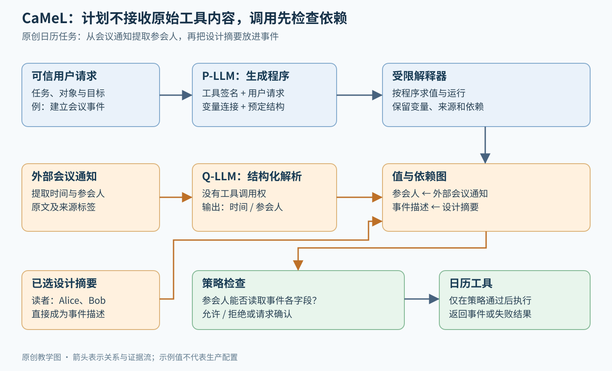
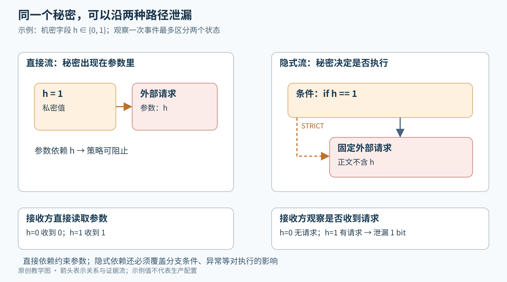

# CaMeL：把提示注入防御变成可执行的信息流约束

> 状态：技术精读 · arXiv:2503.18813v2 · 未复现

## 一句话

让一个模型根据可信请求生成程序，让另一个无工具权的模型解析外部内容，再由解释器追踪值的来源、检查工具参数，把“应该听谁的”落实为“哪些数据可以驱动哪些操作”。

## 它要解决的问题

[ReAct](../react/reading.md) 把工具观察写回模型上下文，让模型根据反馈继续决定下一步。这个循环也把网页、邮件和文档里的文字带进了决策过程。**提示注入**就是外部内容中的指令越过数据边界，影响了本应由用户和系统控制的行为。

考虑“根据会议通知建立日历事件，并附上设计摘要”。攻击者可以试图让模型调用另一个工具，也可以保持“读通知、抽取信息、建事件”的步骤不变，只把参会人替换成自己。前一种改变**控制流**，即执行哪些步骤与分支；后一种改变**数据流**，即哪些值进入哪些操作。两者都可能产生越权结果。

CaMeL 从 Dual-LLM 模式出发：规划模型只看可信请求，隔离模型处理外部数据。但即使后者没有工具，错误提取出的地址仍可能流入规划好的工具调用。因此，论文的关键增量是解释器中的值级别来源追踪与策略执行，对应 [Agent 基线](../../fields/agents/BASELINES.md) 的“动作空间与接口”和“环境”部件。[1]

## 核心想法

CaMeL 把通常挤在同一个模型上下文里的三项职责分开：

1. **P-LLM（Privileged LLM，规划模型）**根据用户任务和工具签名（参数与返回值约定）生成受限 Python 程序，定义调用哪些工具、如何把变量连接起来
2. **Q-LLM（Quarantined LLM，隔离解析模型）**把外部材料转为指定结构；它接触原始内容，但没有工具调用权
3. **解释器和策略**保留变量依赖及安全标签，在真实工具执行前给出允许或拒绝

这里的“受限”指只支持一部分 Python 语法和预先提供的函数。程序由专门解释器执行，便于在赋值、分支与调用时记录信息流。P-LLM 能看到生成的代码、变量名和经过处理的错误信息，工具返回值的具体内容则留在执行环境里。[1]



图 1：原创机制图。蓝色路径传递可信任务与程序结构，橙色路径传递外部数据及其衍生值；绿色策略检查是工具执行的前置条件。Q-LLM 的输出进入变量及依赖图，工具正文不会因此回灌给规划模型。

## 机制

### 1. 先生成程序，再读取外部材料

以 Alice 的日历任务为例，程序需要读取会议通知、提取时间与参会人、读取设计摘要、建立事件。下面是帮助理解依赖关系的伪代码，省略原实现要求的结构类型定义：

```python
notice = read_email("meeting-42")
meeting = query_ai_assistant(notice, schema=MeetingInfo)
design = read_file("design-summary")
create_calendar_event(
    title=meeting.title,
    time=meeting.time,
    participants=meeting.participants,
    description=design,
)
```

P-LLM 在生成这些步骤时知道变量之间的关系，随后由解释器把实际值送进工具。Q-LLM 即使把恶意邮件里的文字当成命令，也只能影响自己的结构化输出；这些输出继续携带来自邮件的依赖。

结构化输出约束的是形状，例如“参会人是一组字符串，时间是一个字段”。攻击者地址同样可以是合法字符串，因此还需要下一层的语义授权。

### 2. 给值记录来源与允许读者

CaMeL 的 **capabilities（值级别安全标签）**记录值来自用户、哪个工具或工具内部来源，以及谁有权读取它。**provenance（来源关系）**回答“这个值受谁影响”；**readers（允许读者）**回答“这个值可以交给谁”。两者承担不同职责：公开网页可以人人可读，同时对操作指令而言仍是不可信来源。[1]

**示例数值与集合：**Alice 选择的设计摘要允许读者为 `{Alice, Bob}`。会议通知是公开活动信息，因此其标题和时间设为 Public（人人可读），但来源仍不可信。Q-LLM 从通知中提取出参会人 `{Bob}`。采用原文日历示例中“所有参会人都能读取事件字段”的检查，Bob 属于摘要的允许读者集合，因此这项检查通过。

如果注入令参会人变成 `{Eve}`，则 `Eve ∉ {Alice, Bob}`，检查失败，建事件动作被阻止。同一程序、同一工具名，只改变一个参数，就足以改变授权结果。原文日历策略还允许另一条路径：参会人全部直接来自可信用户；本例刻意使用外部通知提取的参会人，只演示读者检查这一分支。

再考虑合并两份材料：设计摘要的读者为 `{Alice, Bob}`，内部预算的读者为 `{Alice, Chen}`。要让同一个人读到合并文本，必须同时有权读取两份来源，读者条件的交集为 `{Alice}`。此时发给 Bob 会暴露预算信息，检查应失败。这个集合运算是对“检查全部依赖来源”的教学展开；实现保留依赖图，并不要求把所有标签预先压成一个集合。

### 3. 变换文本时保留依赖

对普通程序，`c = a + b` 很容易识别出 `c` 依赖 `a` 与 `b`。对 Q-LLM，输入可能被摘要、翻译或改写，输出和原文不再有逐字对应。CaMeL 仍把输出关联到输入来源，因此“改写成摘要”保留相关限制。

[判断] 这个设计选择把复杂问题保守化了：解释器追踪哪些输入可能影响了输出，而不尝试证明每个输出词到底来自哪一句。代价是细粒度较粗时会挡住原本安全的操作；收益是省去了另一个模型判断“秘密是否已经被洗掉”的不确定环节。取舍需要结合工具的标签粒度来看。

### 4. 分支也会泄漏信息

假设机密字段 `h` 只可能为 0 或 1，程序在 `h == 1` 时向一个外部服务发起固定请求。请求文字完全相同，但接收方观察“收到 / 没收到”，就能推断 1 bit 的秘密。这里发生的是**隐式信息流**：秘密影响是否执行，而非直接出现在参数中。



图 2：原创手算示例。左侧是秘密直接成为工具参数；右侧通过是否发出固定请求泄露同一个二值秘密。STRICT 模式把分支条件加入依赖，使策略能够看见这条关系。

CaMeL 的 NORMAL 模式主要保留直接依赖；STRICT 模式进一步把 `if` 条件、循环迭代对象加入块内相关求值的依赖。针对 Q-LLM 可通过输出触发异常的情形，STRICT 还把调用之后的语句关联到该调用输入，防止攻击者利用“程序是否继续运行”泄漏信息。[1]

### 5. 出错之后怎样继续

Q-LLM 可以通过一个布尔字段表示信息不足，解释器据此抛出专用异常。P-LLM 接收错误类型和位置后修正程序；可能带入外部文字的错误内容会被隐藏。原型会保留此前已执行的变量、依赖及标签，避免把已完成的动作当作从未发生。[1]

这个细节很重要：若第一封邮件已发送，第二步才失败，从头重放可能重复发送。CaMeL 原型尚未提供操作序列的原子性（整组操作全部成功或全部不生效）或回滚，恢复过程仍需要了解已经发生的副作用。

## 证据：哪个实验支撑哪个主张

**AgentDojo**是用邮件、日历、银行、旅行和 Slack 等模拟工具环境衡量 Agent 任务完成与提示注入攻击的基准。**utility（任务完成率）**衡量正常目标是否完成；**ASR（攻击成功率）**衡量攻击者目标是否达成。它们可以同时下降，也可能出现“没有泄漏，但任务也没做完”。[1]

以下数值固定于 arXiv v2 的对应实验；论文另报策略触发率，因此任务完成率应与需要用户放行的频率一起读。

| 主张 | 支撑实验 | 怎么读 |
|---|---|---|
| 隔离与显式策略能保留相当一部分能力 | Table 2：o3 High 的正常任务完成率，原生工具调用为 84.5%，CaMeL 为 77.3%，相差 7.2 个百分点 | 这是特定模型和 AgentDojo 任务集的取舍；摘要中的约 84% 与 77% 对应此类比较，不代表所有模型 |
| 在给定攻击集上，显式策略有额外收益 | §6.3、Table 7：Claude 3.5 Sonnet 下，949 次攻击中 CaMeL 成功攻击数为 0，无策略版本为 1，tool filter 为 8 | 这一行是同一基准攻击集上的经验结果，不能外推成任意适应性攻击的成功概率为零 |
| 把解析任务交给便宜模型可能节省成本 | §6.1.3：Claude 4 Sonnet 规划、Claude 3.5 Haiku 解析，作者报告 utility 约下降 1%，任务中位估算成本约降低 12% | 说明两种职责可用不同模型承载；原文对约 1% 的表述未展开为另一组完整对照表 |
| 主要工程代价包含额外模型交互 | §6.5、Figure 13：受攻击条件下，Claude 3.5 Sonnet 的任务中位输入、输出 token 用量分别为原生调用的 2.82 倍、2.73 倍 | 这是 token 统计，不是延迟或账单倍数；统计使用 GPT-4o tokenizer，且排除工具文档 token |

实验还揭示了一个结构性失败：用户要求“执行这封邮件中的事项”时，计划本身依赖外部数据，P-LLM 却看不到该数据。另一个失败源是 API 返回结构文档不足，规划模型无法可靠生成解析代码。这些现象说明，安全结构的代价不仅是更多 token，还包括对任务表达和工具说明的要求。[1]

STRICT 的隐式依赖追踪也会增加策略触发。触发意味着系统需要停止或请求授权，它保护了边界，同时消耗用户注意力。因此应同时测“完成了多少”“挡住了多少”“问了用户多少次”，并区分分母是全部任务还是已成功任务。

## 局限与后续

**可见信息与规划能力之间有张力。**把外部数据彻底留在变量里，有利于控制注入入口，却限制需要动态理解外部指令的任务。后续的 [FIDES](../arxiv-2505.23643/README.md)[2]研究同时带保密性和完整性标签的规划器，通过选择性隐藏和受约束地查看变量，扩大可安全表达的任务范围。[判断] 这把问题从“一律隐藏”推进到“哪些信息在什么约束下可以重新进入决策”。

**规则需要可信的来源和完整的执行覆盖。**工具返回“谁能读”的元数据若缺失，就难以构造细粒度政策；某个旁路工具若未被检查，也会削弱保证。CaMeL 将解释器形式化验证（用数学方法证明实现满足规定性质）列为未来工作。它的安全论证应分成威胁模型、规则及执行假设、攻击实验和实现正确性四层来看。[1]

**侧信道与审批疲劳仍需系统设计。**异常、时间和共享资源可能暴露秘密；过于保守的标签又会频繁触发用户确认。部署者需要在限制动作、减少敏感输入、缩小工具范围和请求授权之间取得平衡。Microsoft 在 2026 年 5 月介绍的 FIDES 实验性中间件，展示了在工具调用前传播并检查标签的工程化方向；它仍需应用侧正确标记来源和工具。[3]

对软件 Agent 最值得借鉴的是：把安全状态留在模型之外，用明确的程序结构保存来源；把“模型建议做什么”和“系统允许做什么”分开。底层沙箱再限制进程能读写的路径、系统接口和网络出口，形成互补保护，详见[权限、沙箱与协作讲义](../../fields/agents/permissions-isolation-collaboration.md)。

## 批注

**易误读**

- v2 的威胁模型假设用户请求可信、用户没有粘贴攻击者指令、记忆未被攻陷；纯文本错误摘要及没有受保护数据流后果的钓鱼文本属于明确非目标（§3、§3.1）。
- “规划模型不读取外部数据”不等于程序没有依赖外部数据的分支；运行时仍有条件和循环，STRICT 正是为这些隐式依赖增加追踪。把外部字符串解释为工具选择或可执行程序还会重新打开控制路径（§6.4、§7）。
- P-LLM 的代码字面量在原型中标为 User 来源（§5.3），因此可信任务到程序的正确翻译仍是前提；这套标签不能证明规划器完全理解用户意图。
- Table 7 的 0 次成功攻击仅对应 Claude 3.5 Sonnet 的对照实验。其他模型与套件中有被基准判为成功的输出，原文讨论了直接打印酒店评论等非目标情形（§6.2）；“所有模型 ASR 都为 0”不成立。
- Figure 10 的策略触发比例只统计成功任务；Appendix E 的 Figure 20 统计全部任务。Table 2 的 utility 与策略触发是分开呈现的指标，不宜把 77.3% 解释为无需确认的自动完成率。
- §6.2.2 对银行政策的文字描述与 Appendix E 的简述粒度不同。本例采用 §5.2 的日历规则；若实现或复现实验，应以论文所链接的固定代码版本核对每个工具的具体判定。
- 版本：arXiv v1（2025-03-24）的摘要为 67%，v2（2025-06-24）更新了模型与实验，本文采用 v2。SaTML 2026 的官方议程[4]与作者页面[5]确认发表状态；作者页仍保留旧摘要数字，不能用来替换 v2 表格。

**与其他论文的关联**

- `[历史]` 相对 [ReAct](../react/reading.md)，CaMeL 改变的是动作生成与工具观察之间的连线，以及调用前的信息流检查；它保留语言模型生成计划、工具执行外部任务的基本分工。
- [Instruction Hierarchy](../arxiv-2404.13208/README.md)[6]通过训练教模型区分指令优先级；CaMeL 用解释器检查实际流向。前者作用于候选行为分布，后者限制可执行行为，构成互补路线。
- [FIDES](../arxiv-2505.23643/README.md)[2]进一步形式化规划器的安全性与表达能力，其受约束变量查看机制回应了 CaMeL 所暴露的数据依赖任务瓶颈；这里比较的是设计问题，没有把两篇不同配置的完成率直接相减。

**未核实 / 待验证**

- 尚未取得与 SaTML 正式出版记录逐页对照的最终全文，因此这里的数字均明确限于 arXiv v2，不声称与正式版逐项相同。
- 未对解释器、策略代码和工具适配层做完整实现审计，未重跑 AgentDojo 或测量真实成本；作者仓库明确定位为研究产物，部署成熟度需要单独评估。[7]
- 引用定位、版本及阅读范围见 [证据档案](evidence.json)与[来源信息](source.json)。两幅图为原创教学图，集合与 1 bit 算例不是论文实验数据。

## 参考资料

[1] [Debenedetti et al. Defeating Prompt Injections by Design. arXiv v2, 2025-06-24；本文方法与数字的固定版本。](https://arxiv.org/html/2503.18813v2)

[2] [Costa et al. Securing AI Agents with Information-Flow Control. arXiv v2, 2025-09-03。](https://arxiv.org/html/2505.23643v2)

[3] [Microsoft. Stop prompt injection from hijacking your agent, new security capabilities now released within Agent Framework. 2026-05-20；实验性功能。](https://devblogs.microsoft.com/agent-framework/fides/)

[4] [IEEE SaTML 2026 官方议程：论文收录信息。](https://satml.org/2026/program/)

[5] [Florian Tramèr 作者论文页：SaTML 2026 发表信息，摘要仍保留旧版数字。](https://www.floriantramer.com/publications/camel25/)

[6] [Wallace et al. The Instruction Hierarchy: Training LLMs to Prioritize Privileged Instructions. arXiv v1, 2024-04-19。](https://arxiv.org/html/2404.13208v1)

[7] [CaMeL 作者代码仓库：研究产物定位及运行说明。](https://github.com/google-research/camel-prompt-injection)

CaMeL v2 原文由上述作者以 [CC BY 4.0](https://creativecommons.org/licenses/by/4.0/) 发布；本文为原创中文讲解与教学改编，图示及算例另行绘制。
