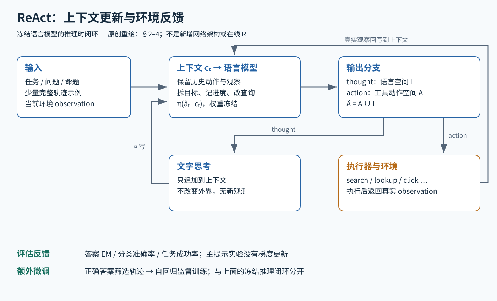

# ReAct：让语言模型交替"想"与"做"，把环境返回的观察写回上下文

> 状态：技术精读 · 原文 arXiv:2210.03629v3（ICLR 2023）· 未复现

## 一句话

Yao 等（2022）让冻结的大语言模型在一条轨迹里交替输出"思考"（thought，写给自己看的文字推理）和"动作"（调用搜索、点击、移动等环境接口），执行器把环境返回的观察（observation）接回上下文，模型据此决定下一步；主实验只靠几条示例轨迹做少样本提示，不更新权重。

## 它要解决的问题

2022 年前后，语言模型的两种用法是分开研究的：

- **只推理**：思维链（chain-of-thought，CoT，一句话：让模型先写出中间推理步骤再给答案）提高了多步推理题的准确率，但推理全部依赖模型参数里的知识，事实错了也无从纠正，错误还会沿推理链传播。
- **只行动**：[SayCan](../../../robotics-embodied/papers/saycan/README.md) 等工作让语言模型直接预测机器人可执行的动作，再由环境可行性模型重排；这类方法有外部反馈，但没有让模型显式维护"做到哪了、下一步为什么做这个"。

最接近的前作是 Inner Monologue（Huang 等 2022）：把环境反馈作为"内心独白"注入上下文，形成闭环。ReAct 作者明确说自己建立在这个闭环之上。ReAct 要回答的是：如果让模型在闭环里自由地写推理，推理和行动能否互相帮助——推理帮助制定、跟踪、修改计划，行动帮助获取参数以外的信息？

提示方式本身来自 [GPT-3](../../../llm/papers/gpt3/README.md) 展示的少样本上下文学习（in-context learning，一句话：把几条完整示例放进提示，模型照着格式续写，不改权重）。

## 核心想法

增量只有一处：**把动作空间扩成"环境动作 ∪ 语言"**。

论文把交互历史记作 cₜ = (o₁, a₁, …, oₜ)，策略是 π(aₜ | cₜ)。ReAct 令新的动作空间 Â = A ∪ L：A 是环境支持的动作，L 是全部语言文本。若本步输出属于 L，就是一条 thought，它只追加到上下文，环境不变；若属于 A，执行器去调用环境，返回的观察再追加进上下文。[§2]

这个改动不涉及模型结构、损失或训练，全部收益来自"上下文里多了一种内容"。两个使用细节决定了它在不同任务上的形态：

- **知识类任务用密集思考**：thought → action → observation 严格交替。
- **长程决策任务用稀疏思考**：由模型自己决定在关键节点插入计划或检查，连续几个动作之间可以没有 thought。

## 机制



图中蓝框是模型对上下文的处理，橙框是真正跨越环境边界的执行与反馈：thought 只改变上下文，动作才改变外界或带回新信息。

### 1 一条轨迹怎样生长

以 HotpotQA（一句话：需要跨两篇维基百科文章找证据才能回答的多跳问答数据集）为例。维基百科工具只有三个动作：

- `search[实体]`：命中则返回该页面前 5 句，未命中则返回相近条目名；
- `lookup[字符串]`：返回当前页面中下一条包含该字符串的句子；
- `finish[答案]`：提交答案。

作者故意使用比当时检索器更弱的接口，让"查什么、查不到怎么改"由语言推理来驱动。[§3.1]

一条自拟的教学轨迹（格式仿照论文，内容非原文）：

```
问题：某乐队主唱出生的城市位于哪个国家？
Thought 1：先查乐队，找到主唱是谁。
Action 1：search[某乐队]
Obs 1：（页面前 5 句）……主唱为 X……
Thought 2：主唱是 X，再查 X 的出生地。
Action 2：search[X]
Obs 2：X 出生于 Y 市……
Thought 3：Y 市在 Z 国。
Action 3：finish[Z 国]
```

每一轮，模型只生成到动作行就停下；执行器解析动作名和参数，调用工具，把真实返回写成 Obs 行，再让模型继续生成。如果执行器不在动作后截断，模型会自己续写一个"看似合理"的 Obs，闭环就退化成了只推理。

### 2 ReAct 与 CoT-SC 的组合规则（示例数值）

ReAct 和 CoT 各有失败方式：ReAct 依赖检索，搜不到就可能卡住；CoT 依赖内部知识，容易编造事实。作者用两条回退规则组合二者。CoT-SC（self-consistency，一句话：对同一问题采样多条思维链，取多数答案）在论文中采样 21 次，温度 0.7。[§3.2]

- **ReAct → CoT-SC**：ReAct 在 HotpotQA 上 7 步内、FEVER 上 5 步内没给出答案，就改用 CoT-SC。
- **CoT-SC → ReAct**：21 个样本中，多数答案的票数不到一半时，说明模型内部知识不自信，改用 ReAct 去查。

示例数值：21 个样本里，答案 A 得 9 票、B 得 7 票、C 得 5 票。多数答案 A 的 9 票 < 21 / 2 = 10.5，触发切换，改用 ReAct 检索。若 A 得 11 票，则直接采用 A，不调用工具。

这条规则的成本不对称：走 CoT-SC 一律要 21 次采样，切换到 ReAct 还要追加若干轮工具调用。所以组合方法的分数要和"相同采样与工具预算"放在一起看。

### 3 可选的小模型微调

论文另做了一组微调：用提示方法生成、且最终答案正确的 3,000 条轨迹，训练 PaLM-8B 和 62B 直接生成 thought、action 和 observation 的序列（训练目标是普通的自回归负对数似然）。推理时 observation 仍来自真实工具。[§3.2；附录 B.1]

## 证据：哪个实验支撑哪个主张

主实验用 PaLM-540B 少样本提示；HotpotQA 用 6 条示例，FEVER（一句话：判断一个命题被维基百科支持、反驳还是信息不足的数据集）用 3 条。

| 主张 | 支撑实验 | 怎么读 |
|---|---|---|
| 加入 thought 比只行动好 | HotpotQA EM：ReAct 27.4，Act 25.7；FEVER 准确率 60.9 对 58.9（Table 1） | 同样有工具，多了推理，两项都提升 |
| 外部检索能纠正推理中的编造 | FEVER 上 ReAct 60.9，CoT 56.3；但 HotpotQA 上 ReAct 27.4 低于 CoT 29.4（Table 1） | 检索在需要核对事实的任务上占优；在多跳问答上，弱检索接口带来的卡住和搜偏抵消了收益 |
| 两种知识来源互补 | ReAct → CoT-SC 在 HotpotQA 得 35.1；CoT-SC → ReAct 在 FEVER 得 64.6（Table 1） | 比任一单独方法都高，但用了更多采样和工具调用 |
| 失败方式不同 | 人工检查 200 条轨迹（两种方法各 50 条成功、50 条失败）：失败轨迹中被判为"幻觉"的比例 ReAct 0%，CoT 56%；ReAct 失败中推理错误占 47%、搜索结果无用占 23%（Table 2） | ReAct 用"检索依赖与循环"换掉了"编造事实" |
| 在交互决策中，自由思考比只给环境反馈好 | ALFWorld（一句话：文字版家务模拟环境，134 个未见过的测试游戏）：ReAct 平均 57%、六套提示中最好 71%；Act 最好 45%；ReAct-IM（只允许 Inner Monologue 式的反馈型思考）平均 48%、最好 53%；模仿学习基线 BUTLER 八次中最好 37%（Table 3） | 摘要"高 34 个百分点"是 71 − 37 的最佳设置对比 |
| 少样本提示可胜过专门训练的基线 | WebShop（一句话：118 万件商品的模拟购物网站，按用户需求找商品）：ReAct 成功率 40.0%，Act 30.1%，模仿学习 29.1%，模仿 + 强化学习 28.7%，人类专家 59.6%（Table 4） | 仍明显落后人类 |

两组对照最能说明核心想法：Act 对 ReAct 隔离了"有没有 thought"；ReAct-IM 对 ReAct 隔离了"thought 能否自由地做分解和常识推理"。两组都支持"自由推理 + 行动"优于其中一半。

## 局限与后续

- **检索依赖与循环**。错误分析中最大的失败来源是推理错误（含反复执行相同动作的循环），其次是搜索结果不提供信息。后来的 Reflexion 在 ReAct 之上加入自我反思，[Voyager](../../../llm/papers/arxiv-2305.16291/README.md) 把它作为对照基线之一，加入环境反馈、执行错误和自我验证的迭代提示，以及可复用的技能库。
- **少样本提示的上限**。作者提出更多人工轨迹、微调和强化学习是后续方向。论文中的小模型微调已经是这个方向的第一步。
- **接口与权限**。论文的动作都没有副作用：维基百科接口只读，WebShop 不发生真实交易。工程化的 Agent 需要在此基础上处理权限与审批。[SWE-agent](../../../llm/papers/arxiv-2405.15793/README.md) 沿用 ReAct 的 thought + command 格式，把动作空间换成为语言模型专门设计的代码编辑与终端命令接口。
- **推理文字的忠实性**。thought 是可以人工检查、甚至可以人工修改的决策记录（附录 A.3 中改两处 thought 就让一个 ALFWorld 失败案例成功），它与模型内部计算之间的关系是另一个问题，见 [CoT 忠实性的度量](../../../llm/papers/url-https-aclanthology.org-2024.findings-emnlp.882/README.md)。

## 批注

**易误读**

- ReAct 并非在所有知识任务上胜过 CoT：HotpotQA 上 27.4 低于 CoT 的 29.4（Table 1）。
- ALFWorld 的 71% 是六套提示排列中最好的一套，平均为 57%；对比的 BUTLER 37% 是八次中的最好一次（Table 3）。每类任务人工标注 3 条示例，取其中两条的 6 种排列组成 6 套提示（附录 B.2）。
- 幻觉 0% 对 56% 是 200 条抽样轨迹的人工分类占比，不是总体幻觉率（Table 2）。
- 组合方法 35.1、64.6 的采样与工具预算高于单次方法，不是等成本比较（§3.3）。Table 1 中监督训练的专门系统在两个数据集上分别为 67.5 和 89.5，论文的目标不是刷榜。
- 附录 A.1 的 GPT-3（text-davinci-002）对比只用 HotpotQA 随机 500 题子集，其中 PaLM 的 29.4 与主表 ReAct 的 27.4 不是同一口径。
- 微调实验只用最终答案正确的轨迹，且不同方法训练步数不同（Act/ReAct 4,000 步，Standard/CoT 在 8B 上 2,000 步、62B 上 1,000 步，附录 B.1），提升不能全部归给提示格式。

**与其他论文的关联**

- `[历史]` 作者自述 ReAct 建立在 Inner Monologue 的闭环之上（§5 Related Work），并把 [SayCan](../../../robotics-embodied/papers/saycan/README.md) 列为"语言模型直接预测机器人动作、再由可行性模型重排"的代表。两者都只有行动侧，ReAct 补上了自由推理。
- `[历史]` [SWE-agent](../../../llm/papers/arxiv-2405.15793/README.md) 原文写明每步生成 thought 和 command 并读取执行反馈，引用 ReAct；[Voyager](../../../llm/papers/arxiv-2305.16291/README.md) 把 ReAct 和"建立在 ReAct 之上"的 Reflexion 作为 Minecraft 实验的对照基线。
- `[结构]` CoT-SC → ReAct 的回退规则是一种按置信度分配推理计算的做法：先用便宜的方式，不自信时再花更多计算。这与 [测试时计算的最优分配](../../../llm/papers/test-time-compute/README.md) 讨论的是同一类问题。
- `[结构]` ReAct 的"动作产生新观察，新观察进入下一步决策"与 [R2R](../../../robotics-embodied/papers/r2r/reading.md) 的导航策略是同一种闭环；区别在于 R2R 用 LSTM 隐状态记住历史，ReAct 把全部历史以文字形式留在上下文里。

**未核实 / 待验证**

- 附录 C.4 的 Table 7（p.23）标为 Act、图注说没有 thought，但印出的清洗轨迹保留了一句 think；已查看 PDF 确认不是抽取噪声，未核对代码与实际运行的提示。
- 摘要中 WebShop "高 10 个百分点"的具体对比对象未在 Table 4 中逐项核对（40.0 对 IL 29.1、IL+RL 28.7 的差均大于 10）。
- 数值出处与页码定位见 [证据档案](../../../docs/deep-readings/evidence/react.json)。
