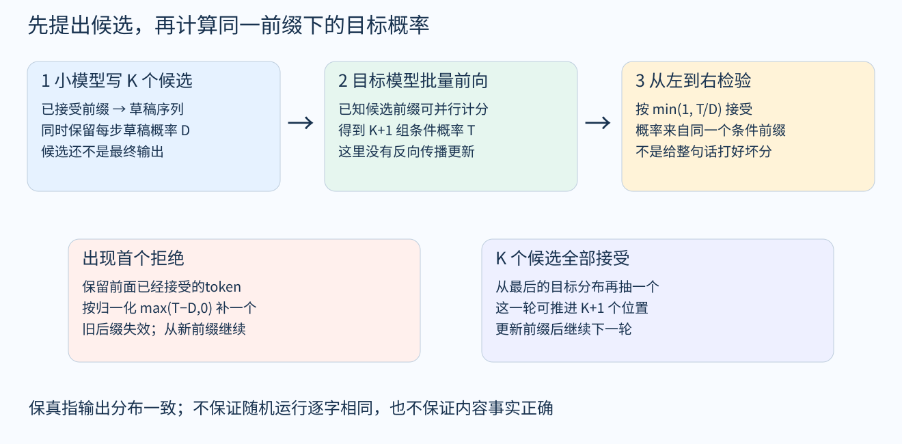

# 2026年10月3日研究短报

## 1 小模型草稿：先分清“分布不变”和“质量足够好”

今天的新增具体问题是：小模型写草稿，大模型怎样验证；能否只在关键位置调用大模型。你主动提出的是这组问题，下面的具体文献来自此前助手推荐，不据此推定你已选定方案。

经典Speculative Decoding / Sampling用目标概率与草稿概率之比决定接受，并在首个拒绝处从残差分布补采样。它保留的是指定目标分布；不是让大模型评价一句话是否“看起来正确”，也不保证两次随机运行逐字相同。[1][2]

更贴近“关键位置接管”的是RelayLLM：由小模型发出调用信号，让大模型生成一段后再接回。这里应比较任务质量和调用成本，不能继承经典方法的精确目标分布保证。[3] 本次补了[两图机制导读与可手算的概率例子](../llm/fields/inference/draft-verification-guide.md)，用于先读懂保证，再比较EAGLE-3、DFlash、BiLD、Judge Decoding与级联方法。它是方向导读，不计作这些论文的全文精读。

## 2 四足卡死：恢复能力不只由惩罚大小决定

10月2日，你已明确自述正在训练四足RL，遇障后偶发持续命令不跟踪、尝试恢复却一直失败。研究画像因此从笼统学习兴趣细化为一个当前实验问题；现有信息还不足以判断根因。

优先把“摔倒起身”和“站着但脱不了困”分开。Recovery RL把任务策略与恢复机制分开；FastRLAP在RC车上组合卡住惩罚与恢复状态机，不能直接当作四足现成方案。[4][5] 我的阅读建议是先检查失败状态是否被训练覆盖、恢复行为能否产生有效进展、何时退出恢复，再比较奖励设计；这是待检验的问题拆分，不是已经证明的修复。

FastRLAP历史OpenReview链接与官方PMLR记录的关联尚未核实，原链接留在待核实清单；本轮找到的PMLR原文明确标为关联发现，没有静默替换历史来源。

## 3 Agent测试：性质本身也可能写错

你继续关注长上下文漂移、验证是否真正对应语义目标，以及多Agent的成本。Anthropic的性质测试研究提供了一个具体阅读切口：测试不仅要能运行，还要核查所断言的性质是否符合真实需求。[6] 本轮核验了文章与相关论文的关联；不能由测试通过推出任意未来环境下目标都正确。

## 本次整理边界

检索窗口为2026年10月2日08:46至10月3日08:23 UTC。恢复20个独立历史条目，19个完成官方身份/主题核验，1个原始标识符关联待核；4组截断URL另留缺口。只有检索摘要，没有原会话链接，不能声称覆盖全部历史。

各条区分摘要核验、方法段选读与官方博客，未训练、复现性能或完成全部论文精读。原有starter与历史提取、FastRLAP关联发现分开标注。论文原文提供官方链接；私有来源编号与内部版本记录不进入公开仓库。

本轮目录去重后为162项资源（159篇论文、1个代码仓库、2篇官方博客），包含18项新增历史资源与1项FastRLAP官方关联发现；DeepSeek-V3沿用已有条目。已有33篇独立讲解保持不变，其余129项为文献卡；另有34项待核实线索。新增大小模型机制导读单独计为方向导读，不增加单篇精读数。

## 参考文献

[1] Fast Inference from Transformers via Speculative Decoding. https://proceedings.mlr.press/v202/leviathan23a.html

[2] Accelerating Large Language Model Decoding with Speculative Sampling. https://arxiv.org/html/2302.01318v1

[3] RelayLLM: Efficient Reasoning via Collaborative Decoding. https://arxiv.org/html/2601.05167

[4] Recovery RL: Safe Reinforcement Learning With Learned Recovery Zones. https://arxiv.org/abs/2010.15920

[5] FastRLAP: A System for Learning High-Speed Driving via Deep RL and Autonomous Practicing. https://proceedings.mlr.press/v229/stachowicz23a.html

[6] Finding bugs across the Python ecosystem with Claude and property-based testing. https://www.anthropic.com/research/property-based-testing
