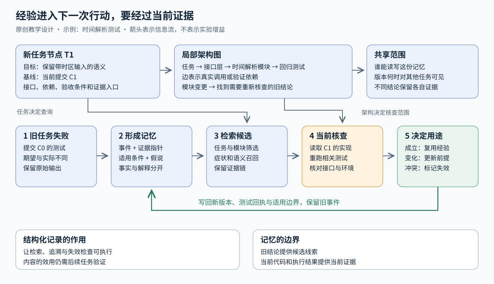

# 2026年10月5日研究短报

## 工程记忆：先让旧失败在下一次行动前可见

今天的问题从“Agent 需要什么上下文”进一步落到：架构图和任务图的局部结构怎样保留历史，供新任务使用。[PROJECTMEM](../cross-domain/papers/arxiv-2606.12329/README.md)提供一个容易检查的例子：追加记录问题、尝试和修复，编辑前按文件调出旧事件，再由调用者判断哪些仍适用。当前 v2 是 2026 年 9 月 30 日修订，作者尚未证明它能减少重复失败；文件预检给出的是警告，不是理解补丁语义后的自动否决。[判断] 值得先学它怎样保存依据，再用 [MemoryArena](../cross-domain/papers/arxiv-2602.16313/README.md)和 [DreamBench-SWE](../cross-domain/papers/arxiv-2608.20664/README.md)追问记忆是否改善后续任务。

从测试失败到记录、检索、重新验证的完整过程，见[机制讲义](../cross-domain/fields/agents/memory-evidence-loop.md)。[研究问题笔记](../perspectives/notes/agent-memory-questions.md)另列安全测试、排错、大型系统和从零开发需要比较的差别。

## Cordis：组件能否安全启停，是另一类状态问题

组件依赖变化后怎样启停、哪些影响需要撤销，是 Cordis 论文研究的问题：[A Programming Paradigm for Spatiotemporal Composability](../cross-domain/papers/arxiv-2608.25512/README.md)。论文明确说 Cordis 是其实现，DeepSeek 官方 dsh 仓库也直接说明依赖关系。它把组件产生的可撤销影响与依赖变化纳入运行时，把依赖变化与组件生命周期联系起来。[判断] 这能作为阅读架构机制的材料，但不直接解决长期经验检索；任意外部副作用能否回滚，还要看论文的前提和实际实现。

## 算子：先分清运算、实现和分派

同一个数学运算可以有不同硬件实现，分派器负责选用合适实现。[Triton 的 Fused Softmax 教程](../cross-domain/resources/triton-fused-softmax/README.md)用融合运算减少中间数据读写，适合把计算与内存流动对应起来。聊天引用的 [PyTorch dispatcher 旧教程](../cross-domain/resources/pytorch-dispatcher/README.md)已由官方标注弃用，仍可用于理解概念；动手接入自定义算子时，应沿卡片给出的现行入口学习。[判断] 硬件变化可能要求重新调优，不能直接推成每次都要重写运算本身。

整理记录

聊天回收与官方身份核验分别进行；13 个论文标识中，11 个带原始 URL、2 个仅恢复 arXiv ID。均为助手引用，未据此认定用户已读或采纳；无可打开的原会话链接。另恢复并核验 2 项官方文档，现行替代入口作为关联来源单列。
保留实际版本与选读范围，不把文献卡、机制讲义或摘要核验写成全文精读、复现。[来源与版本记录](2026-10-05-sources.json)保存详细区别，[来源链缺口](2026-10-05-source-gaps.json)另列。
旧 Page 导出到既有文件的同步暂停：上一轮纯源基线在当前工作区不可用。新增材料独立保存，已有人工整理内容保留，不用当前仓库反充源基线。

