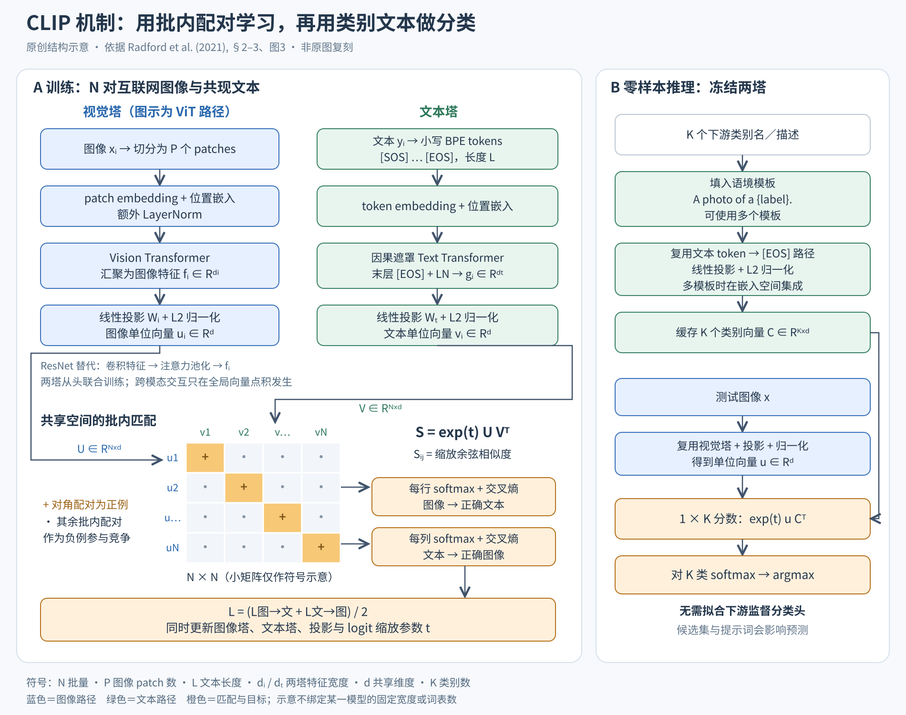

# CLIP 从图文配对学习可迁移视觉表征

论文：Alec Radford 等，Learning Transferable Visual Models From Natural Language Supervision，2021，[arXiv:2103.00020v1](https://arxiv.org/abs/2103.00020v1)。下文页码对应本地 48 页原文 PDF。已阅读正文第 1–27 页与附录 A–F；参考文献用于追索相邻路线。本文是论文精读与机制分析，没有进行训练复现。

## 1 问题与关键判断

CLIP 的目标不是把 ImageNet 的固定分类头做得更好，而是让视觉模型从互联网图文配对中学习，并用自然语言指定下游分类任务。关键接口是：把类别描述编码成向量，这些向量直接充当图像分类器的权重。预训练只要求辨认正确图文配对，因此不必为每个下游任务重新收集人工标签。

论文的主要贡献是把已有的跨模态对比学习扩展到 4 亿对图文，并系统验证它能支持多种零样本任务。对比损失、双塔和用文本生成分类器均有前作，不能把这些单点机制都算作 CLIP 首创。作者明确将其称为简化并扩大规模的 ConVIRT；它更强的证据在于训练效率、数据规模和跨任务评估的组合。（§1–2，pp.1–6；§8，pp.25–27）

## 2 数据与训练路径

WIT 包含从公开互联网来源收集的 4 亿个图像—文本对。检索用约 50 万个查询词，来自英文 Wikipedia 高频词、短语、文章名和 WordNet；每个查询最多保留约 2 万对，尝试增加概念覆盖、缓和不平衡。监督是与图像共现的完整文本，不是直接把检索词当标签。作为对照，YFCC100M 经英文自然语言标题／描述过滤只剩约 1500 万图像。因此“网络数据丰富”成立，但并不意味着数据无偏或各任务都有充分覆盖。（§2.2，pp.3–4；§8，p.26）

图像塔有两条实现路线：修改后的 ResNet 加入 ResNet-D、抗混叠池化，并以注意力池化替代全局平均池化；ViT 则将图像切成 patch，叠加 patch 与位置嵌入后增加 LayerNorm，再送入 Transformer。文本塔将小写 BPE 序列加上 [SOS]/[EOS]，使用带因果遮罩的 Transformer，取末层 [EOS] 状态、归一化并线性投影。两塔从头训练，不以 ImageNet 权重或预训练语言模型初始化；最终只用线性投影把各自特征映射到同一个维度 d。（§2.3–2.4，pp.4–5）

每批 N 个配对样本产生单位向量 uᵢ、vⱼ，构造 Sᵢⱼ = exp(t)·uᵢᵀvⱼ，即 N×N 缩放余弦相似度矩阵。对角线是已知配对：按行做 softmax，让每幅图找自己的文本；按列做 softmax，让每段文本找自己的图。两方向交叉熵取平均：

L = −(1/2N) Σᵢ [log(exp(Sᵢᵢ)/Σⱼ exp(Sᵢⱼ)) + log(exp(Sᵢᵢ)/Σⱼ exp(Sⱼᵢ))]

这不是逐词生成，也不是对每个图文对独立做二元判断，而是在同一批次的候选项之间竞争。两塔的交互只发生在全局向量点积处，没有图像 token 与文本 token 间的交叉注意力。分析上，这使候选文本可以预先编码，代价是缺少显式的细粒度区域—词交互。其他配对被当作负样本，语义相近的样本可能成为“假负例”；这是从目标推导出的风险，并非本文单独验证的消融。（§2.3、图3，pp.4–5；§8，p.27）

训练批量为 32,768，共 32 轮，采用 Adam、解耦权重衰减和余弦学习率；图像增强仅用缩放后的随机方形裁剪。可学习的对数缩放参数起始等效于温度 0.07，logit 放大倍数限制在 100，以避免不稳定。论文训练五个 ResNet、三个基本 ViT；默认最佳模型 ViT-L/14@336px 在 224 分辨率训练后额外以 336 分辨率训练一轮。最大 ViT 的报告成本为 256 张 V100、12 天，不能把零样本推理的低适配成本误读成预训练便宜。（§2.5，p.5；附录F，p.48）

核读注意：v1 正文 p.5 写词表 49,152，表18 写 49,408，二者不一致；图中使用符号 L、d，不把这一差异自行“修正”为已证实配置。

## 3 零样本推理与机制图

给定 K 个类别，先将类别名填入语境模板，例如 A photo of a {label}.，再由文本塔得到 K 个类别向量。测试图像经图像塔得到一个向量，对 K 个文本向量计算缩放余弦相似度并 softmax，选最大者。它等价于输入与权重均 L2 归一化、无偏置的线性分类器；文本塔生成权重，类别向量可缓存。这里的“零样本”指无需该下游训练集的标注样本，不是模型从未见过相关视觉概念。（§3.1.1–3.1.2，p.6）

多模板集成先在嵌入空间平均，因而推理仍可缓存一组类别向量。类别词有歧义，短名称又与自然句子存在分布差异，所以提示词是模型接口的一部分。分析上，softmax 分数只在给定候选集内相对归一化；换类别集会换竞争关系，不能直接当作开放世界“可信度”。论文也承认开发中反复查看完整验证集，因此严格意义的完全无验证标签任务开发并未得到证明。（§3.1.4，pp.7–8；§6，p.20）

图为原创结构示意，不复制论文图1。左侧展示 ViT 图像 token 路径及 ResNet 替代选项，文本侧明确 [EOS] 汇聚；下方显示批内 N×N 矩阵、对角正例及行列交叉熵。右侧独立展示 K 类文本缓存与测试图像路径。N 为批量，L 为文本长度，dᵢ/dₜ 为塔输出宽度，d 为共享嵌入维度；小矩阵仅为示意。

## 4 哪些实验真正支持结论

**目标效率。** 图2（p.3）比较图像条件 Transformer 语言模型、词袋预测及词袋对比目标：前者学习 ImageNet 零样本能力约慢 3 倍，从词袋预测换成对比又约快 4 倍。横轴是处理图像数量，评价的是达到零样本性能的学习效率，不是准确率提升倍数，也不是所有生成模型的普遍上限。

**零样本能力。** 表1（p.7）中 CLIP 在 ImageNet 为 76.2%，Visual N-Grams 为 11.5%；aYahoo 为 98.4% 对 72.4%，SUN 为 58.5% 对 23.0%。这不是控制变量比较：数据量、编码器、训练与推理算力都大幅不同。图5（p.8）中最佳 CLIP 零样本在 27 个数据集的 16 个上超过 ImageNet ResNet-50 特征的全监督线性探针，但 EuroSAT、KITTI 距离、计数等明显较弱。不能概括为“超过所有全监督视觉系统”。

**提示与少样本。** 默认图像描述模板使 ImageNet 提升 1.3 个百分点，80 个模板集成再提升 3.5 个百分点；图4报告跨 36 个数据集平均约 5 点增益。图6的 20 个可做 16-shot 评估的数据集上，零样本平均约等于同一 CLIP 特征的 4-shot 线性分类器；图7显示这高度依任务而变，估计中位数为 5.4 个标注／类，ImageNet 为16，Flowers102、EuroSAT 则不足1。（pp.7–10）

**表征质量。** 冻结编码器后拟合正则化逻辑回归，与零样本是不同实验。最佳 CLIP 在12数据集套件比最佳对比模型平均高2.6点，在扩展27数据集上约高5点；相对 Noisy Student EfficientNet-L2 的线性探针，21/27 项占优，但 ImageNet 落后3点。附录A以验证集选择 L2 正则，ViT 使用投影前特征；因此别把线性探针的85.4% ImageNet 当成76.2%零样本结果。（§3.2，pp.11–13；表10，p.40）

**分布变化。** 图13–15显示自然分布偏移下有效鲁棒性提高，而在 ImageNet 标注上拟合线性头使准确率从76.2%升至85.4%，平均偏移集表现却略降。图14中 ImageNet-R、ObjectNet 分别下降4.7和3.8点。有效鲁棒性是超出同等 ImageNet 表现所预测的偏移性能，不等于绝对准确率处处最高；也不能据此单独证明“语言监督导致鲁棒”，因为数据分布与零样本协议同时变化。（§3.3，pp.13–16；表16，p.47）

**数据和任务边界。** 等规模过滤 YFCC 与 WIT 子集的 ResNet-50 消融，平均线性探针65.5/66.6、零样本29.6/30.0，差别很小，细分类别差别却大；WIT 本身含 YFCC，不能把它视为完全独立的数据对照（表12，pp.44–45）。OCR 中零样本 MNIST 为88.4%，低于原始像素逻辑回归92.5%，而 Rendered SST2 的线性探针达80.5%（表14，p.46）。视频实验也须分清：线性评估用单帧，附录E零样本结果平均全视频帧，表11／表15的 UCF101 分别为76.9%／80.3%，表15明确采用全帧平均，不能直接混用。

## 5 可信边界与适用条件

重叠分析没有发现足以解释总体表现的巨大污染增益：35个数据集的检测重叠率中位数2.2%、均值3.2%，最大估计总体增益为 Birdsnap 的0.6点。但检测器召回率无法在4亿图像上完全验证，重叠／干净子集的难度也可能不同，所以结论只是“已检出的重叠影响有限”，不是无泄漏证明。（§5，pp.17–19；附录C，p.44）

人类实验只覆盖 Oxford Pets；人类零到一样本明显改善，而本文线性少样本方法没有充分利用语言先验。这限制了把 CLIP 的零样本成绩等同于人类学习方式的解释。社会影响部分进一步说明类别集与阈值能改变偏见表现；例如表7增加 child 类后，儿童图像落入有害类别的比例明显下降。这不能消除模型偏见，更不能使人脸敏感属性分类适合实际部署。（§4，pp.16–18；§7，pp.20–25）

**分析判断：** CLIP 适合作为开放词汇分类、文本找图、低标注视觉表征的基线，尤其候选概念可清楚写成自然语言且接近网络图文分布时。它不是开放式生成器，也没有直接提供检测框、分割掩码、计数或可靠关系推理。对于医学、遥感、细微属性等任务，应分别检查领域覆盖、提示稳定性、类别集变化与少量标注适配，不能只看综合平均分。

相邻路线可按接口区分：ViT 是可替换的视觉骨干；SimCLR/BYOL 等单模态表征学习本身不生成语言分类器；VirTex／图像描述目标逐词生成、接口更开放但本文基线学习零样本分类较慢；ConVIRT 是更直接的图文对比前作；UNITER 等融合模型以更密集的跨模态交互处理理解任务。CLIP 的特征是将两种模态压到同一向量空间，以简单、可缓存的匹配换取大规模训练和迁移能力，而非覆盖所有视觉语言任务。（§1、§8；附录A、E.1）

## 6 阅读覆盖与文件

完整阅读正文 §1–9（pp.1–27），附录A–F（pp.37–48）；表10、11与图20–22已结合渲染图核查。参考文献 pp.27–36 为条目索引核对，未声称逐一阅读所引论文。相关证据、页码和限定条件见 `clip.evidence.json`；机制图可编辑源文件为 `clip.svg`，显示版为 `clip.png`。

## 图解文件与证据索引

[PNG高清图](../../assets/baselines/visual/clip.png) · [SVG可编辑图](../../assets/baselines/visual/clip.svg) · [结构化证据](evidence/clip.json)

来源类型：本次为细分方向新选择的 baseline，不是历史聊天提取。
