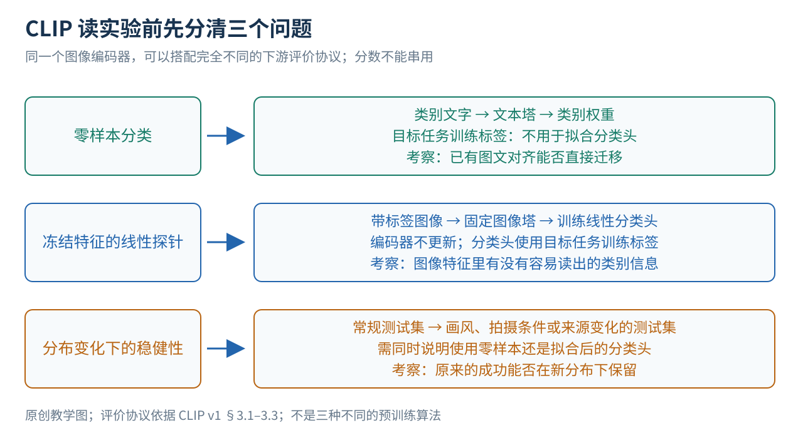

# CLIP 精读 从一张图片和一句话到零样本分类

假设你有一个相册，想把照片分成“猫”“狗”“汽车”。通常的做法是先收集已经分好类的图片，用它们训练一个三分类模型。后来你想新增“滑板”，就要考虑收集新标签、修改分类头、再训练。CLIP 提供了另一种接口：把候选类别写成句子，让模型比较照片与这些句子是否匹配。新增类别时可以先新增文字描述，而不必立即为这个任务训练新的分类器。

这听起来像“模型看懂了一切”，实际机制却很具体：一个网络把图片变成一串数字，另一个网络把文字变成同样长度的一串数字；训练让原本配对的图文更容易互相找回。分类时，再用类别文字生成候选向量。读完本文，你应能从原始图文对一路追到训练损失，手算一次两对样本的学习目标，再分清论文的零样本、少样本、线性探针和鲁棒性结果。

论文是 Alec Radford 等人的 Learning Transferable Visual Models From Natural Language Supervision，本文固定使用 arXiv:2103.00020v1，48页版本。[1] 底稿的阅读记录覆盖正文§1–9、附录A–F；这次教学改写对所用机制、实验及边界做定向复核。所有跑分均为原论文报告，本文没有重新训练模型或复现指标。正文的方括号编号指向文末参考资料，图中的教学数值会与实测结果明确区分。

## 一 先理解 CLIP 想改变的分类方式

### 1 固定类别的分类器为什么不够灵活

把图片输入一个传统分类器，模型先提取“特征”，再给每个类别打分。这里的特征不一定是人能直接命名的“耳朵”“轮胎”，而是模型内部的一组数。假设特征有512个数，分类头可以为“猫”保存512个权重，为“狗”再保存512个权重。图片特征与每组权重做加权求和，就得到各类别的分数。模型用已标注的训练照片调整这些权重，使正确类别得分更高。

问题在于，类别含义主要被保存在这些训练出来的权重中。“猫”这个汉字或者英文 cat，通常只是方便人查看的标签，并没有参与计算。把分类头里的“猫”改名为“火车”，不会让模型突然识别火车。换到新任务时，往往需要重新学习一组类别权重。

CLIP 把这组权重的来源改了：让文本网络根据类别描述生成它们。例如，把 cat 写成 A photo of a cat.，文本网络就输出与该描述对应的向量。图片与这个向量越相似，“猫”的分数越高。因此，自然语言从人看的备注，变成了模型实际使用的任务接口。[1]（§3.1.1–3.1.2）

### 2 零样本到底少了什么

这里的“零样本”指：针对这次下游分类任务，不用该任务的已标注训练样本来拟合分类器。它不表示模型没训练过，也不表示模型从未接触猫、狗或汽车。CLIP 此前已经在4亿对互联网图文上训练过，而且可能学过与测试类别非常相近的概念。[1]（§2.2、§3.1）

“下游”只是相对于大规模预训练而言：先学一个可复用的图文表示，再把它用到宠物、场景或交通工具识别等具体任务。一个模型可以在下游零样本使用，同时拥有昂贵的上游训练。把“下游不用再训练”说成“模型不需要训练”，会误解这篇论文的成本与贡献。

## 二 一张总图先把训练和使用分开

图1沿用既有原创机制图，依据原文§2–3和图3绘制，没有复制论文原图。先只读两块区域：左边是训练，右边是训练完成后的使用。蓝色是图像路径，绿色是文字路径，橙色表示评分与学习目标。

左边输入的不是一张图，而是一批已经知道对应关系的图文对。图像塔和文本塔分别处理自己的输入，最后各交出一个向量。下方的方阵把本批每张图与每段文字都比一遍：对角线是数据里原有的配对，其余格子作为竞争项。模型的任务是让正确配对容易被选出来。

右边则不再出现训练批次。文字输入换成了我们指定的类别描述，例如猫、狗、汽车。文本塔先生成这些候选的向量，测试图片再与它们比较。两座网络在这条标准零样本路径上都保持不变，即“冻结”，不因为预测一张新照片就修改参数。

总图中的 N 是训练批量，K 是本次任务的类别数，d 是图文最终共享的向量长度。L 在文本路径表示序列长度，而底部的损失符号表示学习目标；它们不应混为一个量。旧图用 P 表示图像 patch 的个数，本文不把这个 P 当作 ViT 文献里常用的 patch 边长。图里出现了 ViT，只因为它是可选的图像塔；CLIP 也实验了 ResNet。因此，“CLIP”主要指图文训练与使用方式，并不是“ViT”的另一个名字。[1]（§2.3–2.4）

接下来把总图拆成三个问题：一对图文怎么变成可比较的数字，一批图文怎么产生学习信号，训练好的模型怎么接受新类别。

## 三 图片与文字怎样变成可比较的数字

### 1 向量是表示方式 不是人工编好的语义目录

“向量”可以先理解为有固定顺序的一串数，例如 (0.3, −0.7, 0.2)。编码器是把输入变成这串数的可训练函数。图像编码器处理像素，文本编码器处理文字，它们的计算方式不必相同，但最后都要交出相同维度的结果，才能直接比较。

不要把向量的第一维固定理解成“猫含量”，第二维理解成“红色含量”。训练一般没有为每一维指定这样的语义；有用信息可以分散在很多维中。真正受约束的是整体关系：相关图片和文字的方向应更接近，不匹配的候选应较难被误选。

图像塔的输出与文字塔的输出原本可能分别有 dᵢ 和 dₜ 维。CLIP 用两个可训练的线性投影把它们都变成 d 维。线性投影就是按可学习权重重新混合这些数。两座塔不共享这个投影矩阵：它们需要把两种不同模态的信息映射到同一个可比较的空间。[1]（§2.3、图3）

### 2 为什么还要把向量长度统一

假设两个向量方向完全相同，一个长度是另一个的10倍。如果直接点积，较长的向量很容易得到更大分数，模型可能通过放大数值而不是改善语义匹配来取巧。CLIP 对投影后的向量做 L2 归一化：将向量除以自身长度，使长度变成1。

对于二维向量 (3, 4)，长度是 √(3² + 4²) = 5，归一化后得到 (0.6, 0.8)。两个单位向量的点积就是余弦相似度：同向时为1，垂直时为0，反向时为−1。高维空间仍遵循同样的公式，只是我们不容易把它画出来。

设第 i 张图片的单位向量为 uᵢ，第 j 段文字的单位向量为 vⱼ，CLIP 的配对分数写成：

Sᵢⱼ = a × uᵢᵀvⱼ，a = exp(t)。

这里 i、j 是样本编号；上标 T 表示转置，用来写点积；Sᵢⱼ 是图片 i 与文字 j 的一个分数；a 是正的缩放倍数；t 是训练中学习的一个数，exp 是指数函数。缩放倍数不改变一行分数的大小顺序，但会改变随后 softmax 的尖锐程度：放大分数差，概率就更集中到高分候选。它通常也写成温度的倒数 1/τ，因此“小温度”与“大缩放倍数”是同一个方向。[1]（§2.3、图3）

### 3 两座塔内部各做了什么

图像侧有两类模型。修改后的 ResNet 用卷积逐步提取图像特征，并以注意力池化汇总整张图；ViT 则先把图片切成小块，把每块变成一个向量，再让 Transformer 在块之间交换信息。CLIP 的 ViT 在 patch 与位置嵌入相加后额外做了一次 LayerNorm。LayerNorm 可以先理解为对每个表示内部的数值尺度做标准化，再进行可训练的调整，用来帮助后续计算稳定。[1]（§2.4）

文字侧先用 BPE 分词。分词后的 token 不一定等于一个完整单词，也可能是词的一部分；模型先把 token 编号查表变成向量，再用 Transformer 结合上下文处理。文本两端带有开始和结束标记 [SOS]、[EOS]。论文取最后一层 [EOS] 位置的表示，经归一化和线性投影，作为整段文字的向量。[1]（§2.4）

文字塔使用因果遮罩，即某个位置不能看右边尚未出现的 token。因为 [EOS] 在末尾，它仍可以汇集前面整段文字。这里虽然用了与语言模型有关的结构，训练目标却不是逐词续写。网络最终要做好的是整段文字与整张图的匹配。

两座塔在编码过程中没有互相查看对方的细粒度 token。图像 token 不会在某层直接对文本 token 做交叉注意力；二者到最后的全局向量点积才发生跨模态比较。这个设计使文字向量能够提前缓存，也意味着细小区域、词序和复杂关系是否被保留下来，依赖单个全局向量的表达能力。后一点是机制分析，不能冒充论文已经单独验证过的消融结论。

## 四 一批配对如何变成训练目标

### 1 数据只告诉模型原来哪两项在一起

想象一批里有两对数据：一张猫图配着猫的描述，一张狗图配着狗的描述。我们知道两条原始配对，但还会额外计算“猫图与狗描述”“狗图与猫描述”的分数。这样，两对样本变成四个可比较的组合。

真实训练中若一批有 N 对，就有 N×N 个分数，但仍只有 N 个已知配对。将图像编号放在行、文字编号放在列，原始配对都在对角线。训练一方面让每张图片从 N 段文字中找到自己的文字，另一方面让每段文字从 N 张图片中找到自己的图片。双向目标可以约束两个检索方向，而不只是单方面训练“看图选文字”。[1]（§2.3、图3）

### 2 softmax 和交叉熵分别做什么

分数 S 可以为正、为负，也不要求加起来等于1。softmax 把一组分数变成非负且总和为1的数。例如，固定图片 i，在这一行里，对文字 j 的相对概率为：

pⱼ = exp(Sᵢⱼ) / Σₖ exp(Sᵢₖ)。

Σ 表示把候选项相加，k 是遍历本批文字的临时编号。分子代表这一个候选，分母代表所有候选的竞争总量。正确配对的概率越大，模型越容易完成这道选择题。

交叉熵在这种只有一个正确目标的情形下，可以写成 −ln(p正确)。ln 是自然对数。正确概率接近1时损失接近0；正确概率很小时损失很大。训练程序根据损失对参数求导，再用优化器小幅调整两座塔、投影矩阵和缩放参数，让后续批次更容易选中已知配对。这个过程叫反向传播与参数更新，不是人工逐一告诉网络某一维应该代表什么。

### 3 手算一批只有两对的数据

图2的所有数字都是便于手算的教学设定，不是原模型的真实输出。设猫图和猫文的向量都是 (1, 0)，狗图和狗文都是 (0, 1)，缩放倍数 a = 2。四个向量长度都为1。相同方向的点积为1，垂直方向为0，所以得分矩阵两行分别为 (2, 0) 与 (0, 2)。

先读第一行。猫图在“猫文、狗文”之间选择，正确配对概率为 e²/(e² + e⁰) ≈ 7.389/8.389 ≈ 0.881。对应损失为 −ln(0.881) ≈ 0.127。第二行对称，正确狗文的概率和损失相同。

再按列看：猫文从两张图中选猫图，狗文从两张图中选狗图。本例矩阵恰好对称，所以列方向也得到0.127。先平均所有行的损失，再平均所有列的损失，最后对两个方向取平均，整批损失仍约为0.127。

如果四个分数完全相同，每一行只能给两个候选各0.5，损失便是 −ln(0.5) ≈ 0.693。于是这组手算展示了目标的含义：正确配对与竞争项拉开差距，损失就从“分不清”的状态下降。它不意味着一次更新一定能达到这里设定的理想向量，也不意味着0.127是实际训练应达到的统一阈值。

完整批次的目标可以写为：

L = −(1/2N) Σᵢ [ln(exp(Sᵢᵢ)/Σⱼ exp(Sᵢⱼ)) + ln(exp(Sᵢᵢ)/Σⱼ exp(Sⱼᵢ))]。

N 是配对数，i 遍历正确配对，j 遍历竞争候选。第一个分母沿行相加，表达“图找文”；第二个分母沿列相加，表达“文找图”；前面的 1/(2N) 对两个方向和全部样本求平均。这与逐词生成一段描述不同，也与给每个图文组合独立判断“是／否”不同：这里的候选在同一个分母里互相竞争。[1]（§2.3、图3）

### 4 未配对不等于语义上一定错误

假设一批里有两张不同的猫图，它们的描述都只写“一只猫”。数据记录仍把它们当成不同配对，非对角组合依然进入竞争项，可从语义看，两段描述可能都适合两张图。这就是潜在的假负例：在目标中被当成负项，但语义上并非真正不相关。

这个风险可以从批内配对目标推导出来。它提醒我们，对比学习利用的是数据中的对应关系，不是一份完美的世界知识清单。本文没有把这种风险包装成 CLIP 原论文单独量化过的失败比例。

## 五 真实的数据与训练流程

### 1 四亿对数据是怎样的监督

论文构建的 WIT 包含4亿个互联网图像—文本对。为了尽可能覆盖不同概念，收集过程使用约50万个查询词，并对每个查询最多保留约2万对结果。查询词包含英文 Wikipedia 高频词、短语、文章名及补充的 WordNet 词条。[1]（§2.2及脚注1）

这里需要区分“搜索用的词”和“训练用的文字”。搜索词用于寻找样本，最终训练用的是与图像共同出现的完整文本，不是简单地把那个搜索词当作干净类别标签。文本可能描述主体，也可能描述背景、语境或拍摄者关心的事情。自然语言监督因此更丰富，也更嘈杂。

作者检查另一个大型图片数据集 YFCC100M 时发现，标题和描述中有许多文件名、相机参数等内容；只保留自然语言英文标题或描述后，剩下约1500万张图。这个例子解释了为什么“有一亿张图片”和“有一亿条有用图文监督”不是同一回事。另一方面，限制每个查询的样本量也不能保证整个数据集没有文化、语言或概念偏差。[1]（§2.2）

### 2 一次参数更新具体发生什么

训练程序抽取一批图文对，对图像做缩放后的随机方形裁剪，对文本做分词；两座塔从头初始化并共同训练，不先加载 ImageNet 图像权重或现成语言模型。图文经编码、线性投影与归一化后产生批内分数矩阵，计算双向交叉熵，再反向更新参数。下一批重新抽取数据，重复这个过程。[1]（§2.3–2.5）

论文批量为32,768，训练32轮。一个 epoch 即按该训练安排遍历一轮训练数据；它不等于一次参数更新。优化器使用 Adam、解耦权重衰减及余弦学习率安排。Adam 根据梯度的统计量调节各参数的更新尺度，权重衰减对参数增长施加约束，学习率安排决定训练不同阶段步子迈多大。理解机制时先抓住“损失决定更新方向”，复现时再严格核查具体数值。[1]（§2.5、附录F）

温度初始化等效于0.07，论文描述把 logit 放大倍数限制到不超过100，以避免训练不稳定。这里的上限指缩放倍数，并不是把余弦相似度限制在100。[1]（§2.5）

### 3 好用的接口背后仍然有昂贵预训练

作者训练了五个 ResNet 和三个基本 ViT 配置。论文通常报告的最佳模型是 ViT-L/14@336px：先以224分辨率训练，再在336分辨率额外训练一轮。最大 ViT 的报告成本为256张 V100 GPU 训练12天。因而，CLIP 的优势之一是把这笔预训练成本复用于多种任务，而不是让昂贵计算消失。[1]（§2.4–2.5）

版本细节也值得保留：v1正文p5写词表大小49,152，附录F表18写49,408，二者不一致。正文还写最大序列长度76。教学理解不依赖这几个实现常数；如果要复现，应锁定论文版本与所用代码版本，逐项核对，不能在没有说明的情况下把其中一个数字改成另一个。

## 六 训练好后怎样用一句话定义类别

### 1 从类别名到缓存的分类器

回到相册任务。先列出 K 个候选类别，给每个类别填入同一类提示模板，例如 A photo of a {label}.。每句话经过文本塔，得到归一化类别向量 c₁ 到 cK。然后把新图片编码为单位向量 u，分别计算 a×uᵀcₖ，选最高分的类别。这里 k 是类别编号，不再是训练批次里的样本编号。[1]（§3.1.1–3.1.2）

从传统分类器的角度看，每个 cₖ 恰好就是一个类别的权重，只不过它是文本塔生成的。固定候选集时，这些向量可以预先算好并缓存。后续每张图片只需运行图像塔，再与缓存的向量比较。因此，双塔没有细粒度交叉交互的结构，也带来了推理和检索上的便利。

图3的三分类得分是假设的2.0、0.5和−1.0。对它们做 softmax，分母为 exp(2.0) + exp(0.5) + exp(−1.0) ≈ 9.406，分别得到约78.6%、17.5%、3.9%。模型选择“猫”。这与上一节的两对训练算例分属两个阶段，不应把这三个候选当成一次真实训练批次。

这些数只是给定候选集内的相对分数。把“猫”删掉后，模型仍可能被迫在“狗”和“汽车”中选一个；所以78.6%不能直接理解成“放到开放世界里有78.6%概率确实是猫”。若要允许“以上都不是”，需要额外设计拒识、校准与评估，这不是在 softmax 后加一个名字就自动解决的问题。

### 2 提示词为什么会改变表现

裸类别名可能很短，也可能有歧义。网络预训练看到的却往往是带上下文的句子，所以将类别名放入“某物的照片”之类模板，能够更明确地指定用途。不同任务还可能更适合其他语境，例如卫星照片、文字截图或某种动物的图像。[1]（§3.1.4）

论文还尝试多个模板。可以为同一类别写出若干句表达，把它们各自编码，再在嵌入空间集成，生成一个类别表示。因此，多模板不一定要求对每张测试图片重复执行文字网络；候选向量仍可以缓存。

但提示设计不是完全没有人类参与的步骤。作者在开发过程中查看了完整验证集，论文明确承认这与最严格的“目标任务一张验证标签都不看”不同。准确的表述是：标准零样本评估没有用目标任务训练标签拟合分类头，但论文没有证明完全不借助验证反馈的任务开发流程。[1]（§6）

## 七 逐项读实验 先问清楚分数在测什么

图4不是新增算法，而是读实验的路线图。零样本在测“文字接口能否直接生成有效分类器”；线性探针固定图像编码器，用标签训练一个简单分类头，在测“表示里是否含有可读出的类别信息”；分布变化实验则把相同协议搬到来源或外观不同的图像上。看到准确率时，先找到它对应哪条路。

“准确率提高1个百分点”表示例如从70%变成71%，不是原分数乘以1.01。“线性探针”虽然不更新编码器，仍使用目标任务标签；“4-shot”通常表示每类有4个带标签样本，不是整个数据集总共4张图片。把这些口径对齐，后面的数字才有意义。

### 1 对比目标是否更适合本文的零样本分类

原论文图2横轴是训练时处理过的图像数量，纵轴是 ImageNet 零样本准确率。作者比较逐词生成描述的 Transformer 语言模型、预测词袋的模型，以及词袋对比目标。词袋把文字看成“出现了哪些词”，不要求恢复完整词序。论文发现，语言模型学习该零样本分类能力约慢3倍；把词袋预测改为对比目标，又带来约4倍的学习效率改善。[1]（§2.3、图2，p3）

这项实验支持作者为何选择更简单的配对识别任务：如果目的就是学出可用于分类的图文表示，没必要先把每个描述词都预测准确。它测的是达到某种下游表现所需的数据处理进度，不是准确率变成原来的3倍或4倍，也不能推出所有生成式视觉语言模型都不如对比模型。

### 2 零样本究竟达到什么程度

表1报告 CLIP 在 ImageNet 上为76.2%，Visual N-Grams 为11.5%；在 aYahoo 上为98.4%对72.4%，在 SUN 上为58.5%对23.0%。这些结果显示零样本图像分类从早期方案到 CLIP 有明显进展，但不是只改一个变量的公平消融：模型、训练数据、计算预算都不同。[1]（§3.1.3、表1，p7）

更能提醒读者克制的是图5：CLIP 的零样本结果在27个数据集中的16个上超过基于 ImageNet ResNet-50 特征训练的全监督线性分类器。这里的对手是特定图像特征加线性头，不是所有可能的监督视觉系统。图中的任务差异也很大，遥感场景、距离估计和计数等任务存在明显短板。正确结论是“无需目标任务训练样本也能在不少任务上与这个监督基线竞争”，不能省略比较对象。[1]（§3.1.3、图5，p8）

### 3 提示词带来的提升如何拆开

ImageNet 上，将裸类别名称换成默认图像描述模板，提升1.3个百分点；在这一默认模板的基础上，80个模板的集成再提升3.5个百分点。图4则报告提示设计与集成在36个数据集上的平均增益约为5个百分点。[1]（§3.1.4、图4，pp7–8）

这三个数不是同一个实验的三种说法：1.3和3.5有各自的比较起点，约5点是跨任务平均。它们共同说明文本输入形式会影响任务接口，但不意味着任意任务多写80句话都能稳定增加3.5点。模板需要适合类别含义与图像来源。

### 4 零样本相当于多少张标注图片

图6在20个能做16-shot评估的数据集上比较：CLIP 零样本的平均表现大约相当于同一 CLIP 特征上训练的4-shot线性分类器。这并不是“CLIP只相当于每类看过4张图”，因为它的预训练已经看过海量图文，文字接口也带来了监督信息。[1]（§3.1.5、图6）

图7进一步估计各任务达到零样本水平所需的标签数，中位数为每类5.4个；ImageNet约为16，而 Flowers102 和 EuroSAT 的估计不足1。后一个数不是实际能提供零点几张图片，而是按曲线估算出的等效位置。这种差异说明语言先验在各任务中有用程度不同，平均数不能替你判断一个具体任务。[1]（§3.1.5、图7，pp9–10）

### 5 线性探针证明了什么 又没有证明什么

线性探针把 CLIP 的图像编码器冻结，另外使用下游标签拟合正则化逻辑回归。逻辑回归在这里是一个线性打分加概率输出的分类器，“正则化”约束它不要过度记住训练样本。验证集被用来选择正则强度；ViT 探针使用最终对比投影之前的图像特征。[1]（§3.2、附录A）

在12数据集套件上，最佳 CLIP 比最佳对比模型平均高2.6个百分点；扩大到27个数据集后，平均优势约5点。相对 Noisy Student EfficientNet-L2 的线性探针，CLIP 在21/27项中占优，但 ImageNet 仍低约3点。这支持“CLIP 学到了可迁移的视觉表示”，并非说文本生成分类器在每个任务上都是最佳方案。[1]（§3.2，pp11–13）

CLIP 的 ImageNet 线性探针准确率85.4%与前面的76.2%零样本准确率不是冲突：前者另外使用了 ImageNet 标签训练分类头。拿85.4%当作“零样本结果”会错误地把两条评估路线合在一起。[1]（表10，p40）

### 6 为什么在 ImageNet 上变准 在新分布上反而可能变差

自然分布变化测试会改变拍摄环境、图像来源或表现形式，例如从普通照片换成绘画或不同背景的实物图。论文图13–15显示，零样本 CLIP 在多种变化下表现出较高的有效鲁棒性。这里“有效”有特定含义：比较它的偏移集成绩，是否超过按常规 ImageNet 成绩通常能预测出的水平；不只是看绝对分数是否最高。[1]（§3.3）

一个很有解释力的对照是：使用 ImageNet 标签训练线性头后，原测试集准确率从76.2%升到85.4%，但平均偏移集表现略降。图14中 ImageNet-R 与 ObjectNet 分别下降4.7和3.8个百分点。这提示对一个固定标签分布进行适配，可能提高该分布成绩，同时削弱另一种迁移优势。[1]（§3.3、图14；表16）

不过实验同时牵涉数据分布、预训练方式和下游协议，不能仅凭这组结果就断言“自然语言监督本身导致全部鲁棒性优势”。要隔离这样的因果问题，还需要更严格地控制其余变量。

### 7 数据源和特殊任务的消融为何值得看

作者用等规模的过滤后 YFCC 与 WIT 子集训练 ResNet-50，平均线性探针准确率分别为65.5%与66.6%，平均零样本为29.6%与30.0%。平均分差距很小，但具体细分类别可能差很多；同时 WIT 本身包含 YFCC 来源，二者不是完全独立的数据宇宙。这项对照帮助区分“规模相近时来源有没有影响”，不能把它概括成所有网络数据都等价。[1]（表12，pp44–45）

OCR 是识别图片中的文字。CLIP 在零样本 MNIST 手写数字上为88.4%，甚至低于原始像素逻辑回归的92.5%；与此同时，在把文字情感判断渲染成图片的 Rendered SST2 上，线性探针达到80.5%。前者提醒我们，人类觉得简单的视觉任务未必匹配网络图文训练；后者说明表示又可能保留某些可用于文字任务的信息。两者评估协议不同，不能只看一个数字就宣称 CLIP 是通用 OCR 系统。[1]（表14，p46）

视频结果也必须核对输入处理。论文线性评估采用单帧，附录E中的零样本视频实验平均全视频帧；UCF101 在表11与表15分别为76.9%和80.3%。这里既换了评估方式，也换了帧聚合方式，不是同一套测试的两次可直接比较跑分。[1]（附录A、E；表11、15）

## 八 这条路线来自哪些真实前作

CLIP 的突破不宜被讲成“首次把图像与语言放在一起”。更准确的历史要把目标、结构与规模分开。

早期 Visual N-Grams 已经用图片相关文字学习视觉概念并尝试零样本转移。CLIP 将其作为直接比较对象，因此表1的意义是跨代系统能力的进展，而不是凭空出现的第一条语言监督路线。[1][2]

ConVIRT 更接近 CLIP 的训练结构。它利用医学图像及对应报告做图文对比学习，在 CLIP 之前就已经采用跨模态配对目标。CLIP 正文明确把自己的方法称作经过简化、放大规模的 ConVIRT：减少部分数据变换、从头训练、使用线性投影，并把范围推向大规模通用互联网图文。[1]（§1–2）[3]

VirTex 则代表另一种相关选择：让视觉表示服务于文本描述预测。CLIP 的早期生成基线与这条路线相关，但本文后来选择“找到正确配对”而非“恢复确切句子”。这解释了图2为什么是目标设计的重要实验，而不仅是一张速度比较图。[1]（§2.3）[4]

批内竞争和对比目标也有更早的历史。论文将多类 N-pair loss 与 InfoNCE 作为相关来源；因此，双塔、对比损失、语言定义类别这几个单点都不能简单归为 CLIP 首创。CLIP 更有说服力的贡献，是把这些思路组成高效系统，训练到4亿图文规模，再用广泛的零样本、探针与分布变化实验展示其迁移性质。[1]（§2.3、§8）[5][6]

这里对前作的介绍限于相关方法和历史关系核验，没有声称逐篇完成全文精读。ViT 属于可替换的视觉骨干层面；ConVIRT、VirTex 更接近训练信号层面。保持这种层次，才不会把“换骨干”和“换监督方式”混为同一种创新。

## 九 哪些边界不能被综合平均分掩盖

### 1 已检出的重叠影响有限 不等于无数据泄漏

预训练数据来自互联网，可能包含下游测试图片。论文的重叠检测在35个数据集上得到中位重叠率2.2%、平均3.2%，对整体准确率的最大估计增益为 Birdsnap 的0.6个百分点。这说明按作者检测到的重叠，尚未发现足以解释总体优势的巨大增益。[1]（§5、附录C）

但检测器在4亿图像上的召回率无法完全验证，且“有重叠”与“没检出重叠”的子集难度可能不同。严谨的结论要保留检测方法的边界，不能升级成“证明不存在泄漏”。

### 2 图文匹配不自动提供定位 计数和关系推理

一张图可能同时有“红杯子”“蓝盘子”“杯子在盘子左边”等多层信息。全局匹配可以很擅长判断有没有杯子，却未必准确保存数量、左右关系或非常细微的属性。论文评估也显示部分计数、空间和专门领域任务较弱。[1]（§3.1.3、§6）

原始 CLIP 的输出是全局相似度，不直接给检测框、分割掩码或逐词解释。把它接到额外系统里可能获得这些能力，但那是新方法或新适配，需要另外的训练与证据。它也不是开放式回答问题的聊天模型。

### 3 提示与候选类别同时是能力接口和风险来源

论文社会影响分析表明，类别集、提示和阈值会改变偏见表现。例如，某些评估加入 child 类后，儿童图像落入有害类别的比例下降。但改变候选后某个测试改善，并不等于模型偏见消失，更不能作为在人脸敏感属性判断中实际部署的依据。[1]（§7、表7）

Oxford Pets 的人类实验也只覆盖有限任务。人类从零样本到一样本明显改善，而论文使用的线性少样本方法并未充分利用相同的语言先验。CLIP 的零样本结果不能因此被等同于人类认识新概念的方式。[1]（§4）

## 十 把 CLIP 放回视觉研究地图

如果需求是“已有候选概念能用自然语言描述，想在少标注情况下先获得一个可用分类或检索系统”，CLIP 是很清晰的基线。它把图像表示与语言连接起来，使类别接口可以变化。这与只学视觉特征的单模态方法不同，也与让图像和文字细粒度交互的融合模型不同。

使用时应顺着本文的因果链检查：任务概念是否接近预训练图文，候选名称有没有歧义，提示变化是否稳定，是否需要“以上都不是”，任务真正需要的是整体相似度还是定位、数量与关系。医学、遥感或细微工业缺陷等领域尤其不能仅凭通用平均分下结论。

若想进一步研究，最有信息量的比较通常不是随意更换多个组件后看总分，而是先固定图像骨干、数据、计算预算与下游协议，再分别改变文本监督、损失、提示或少量标签适配。这样才知道改善来自哪里。

现在再回看总图，你应该能用一句连续的话解释它：互联网配对提供对应关系，两座塔把图与文编码成单位向量，批内双向竞争训练它们的共享空间；任务到来时，类别文字在这个空间里生成分类权重，图片通过与这些权重比较得到预测。CLIP 的创新与边界，都藏在这条简单但完整的路径中。

## 十一 参考资料与图解文件

[1] Radford et al. Learning Transferable Visual Models From Natural Language Supervision. arXiv:2103.00020v1，本文事实与数字的主来源。[固定版本原文](https://arxiv.org/pdf/2103.00020v1)。底稿记录：正文pp1–27、附录A–F pp37–48；本次定向复核机制、关键实验、消融和局限。未训练复现，参考文献列表不等于被引论文全文阅读。

[2] Li et al. Learning Visual N-Grams from Web Data. ICCV 2017。用于核对语言监督与零样本前作关系。[论文原文](https://arxiv.org/abs/1612.09161)

[3] Zhang et al. Contrastive Learning of Medical Visual Representations from Paired Images and Text. 2020。用于核对 ConVIRT 的图文对比前作关系。[论文原文](https://arxiv.org/abs/2010.00747v1)

[4] Desai and Johnson. VirTex Learning Visual Representations from Textual Annotations. 2020。用于核对描述预测路线。[论文原文](https://arxiv.org/abs/2006.06666)

[5] Sohn. Improved Deep Metric Learning with Multi-class N-pair Loss Objective. NeurIPS 2016。本文只沿CLIP原文核对该目标的历史归属。[论文入口](https://proceedings.neurips.cc/paper/2016/hash/6b180037abbebea991d8b1232f8a8ca9-Abstract.html)

[6] van den Oord et al. Representation Learning with Contrastive Predictive Coding. 2018。用于核对InfoNCE历史关系。[论文原文](https://arxiv.org/abs/1807.03748)

图1： [图示总览图](../../assets/baselines/visual/clip-beginner-20261002.svg) · [SVG可编辑图](../../assets/baselines/visual/clip-beginner-20261002.svg)

图2： [图示批内手算图](../../assets/baselines/visual/clip-batch-lesson-beginner-20261002.svg) · [SVG可编辑图](../../assets/baselines/visual/clip-batch-lesson-beginner-20261002.svg)

图3： [图示推理图](../../assets/baselines/visual/clip-inference-lesson-beginner-20261002.svg) · [SVG可编辑图](../../assets/baselines/visual/clip-inference-lesson-beginner-20261002.svg)

图4： [图示评估协议图](../../assets/baselines/visual/clip-evaluation-lesson-beginner-20261002.svg) · [SVG可编辑图](../../assets/baselines/visual/clip-evaluation-lesson-beginner-20261002.svg)

[原精读结构化证据](evidence/clip.json) · [本次教学改写核验记录](evidence/clip.beginner-revision.json)

来源类型：视觉语言细分方向的代表性 baseline。教学算例与原创图是机制解释，不是新增论文实验。
