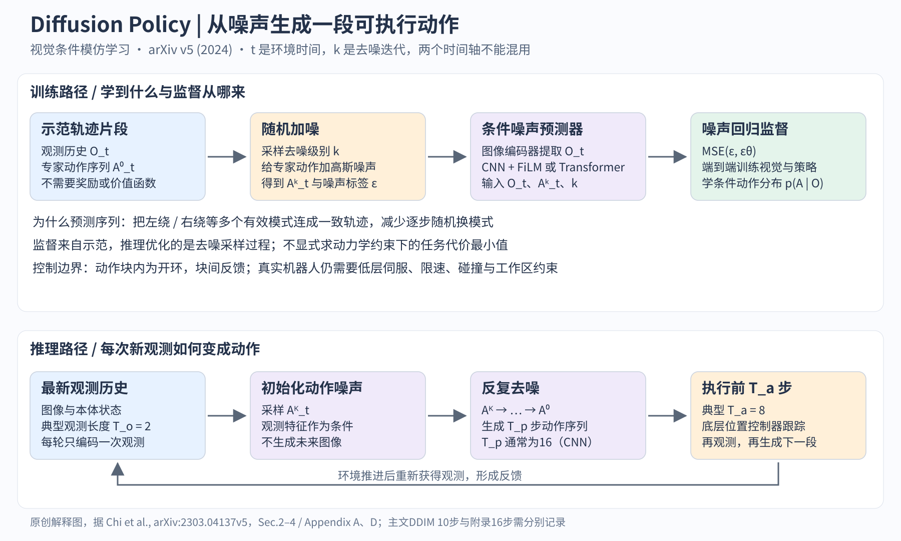

# Diffusion Policy 精读 从动作分布到闭环机器人控制

## 阅读边界与一句话定位

本文依据 Chi 等 [arXiv:2303.04137v5，2024-03-14](https://arxiv.org/pdf/2303.04137v5)，19页期刊扩展版，已读正文与附录A–D。原始RSS2023论文是v1–v4；v5增加控制理论讨论、视觉编码消融及3个双臂任务。arXiv摘要页仍写12任务，而v5 PDF写15任务，本文按PDF版本说明。没有运行官方训练或真实机器人实验。

这篇的基线角色是视觉条件行为克隆：学会从示范分布中生成一段动作。它不是完整VLA，也不是显式世界模型；理解它能把“生成式动作头”“语言理解”“预测物理世界”三个问题分开。

## 一 为什么一个回归动作不够

拿Push-T想象：机械臂可以从物体左侧或右侧绕过去，两种示范都合理。若以MSE回归单个动作，平均解可能恰好撞上物体；若每一时刻独立从多峰分布采样，又可能一会向左、一会向右，造成抖动。关键困难不仅是多峰，还包括跨时间选定同一种策略。论文因此同时改变概率模型与输出对象：从单步动作变成整段动作序列。

设O_t是最近T_o步观测，A_t是T_p步预测动作。模型学p(A_t|O_t)，生成动作块后执行其中T_a步，再获得新观测并重新生成。T_o、T_p、T_a分别是观测、预测、执行长度；环境时间t与扩散迭代k是两个维度。T_a越长，序列更连贯且摊薄推理开销，但对扰动反应越慢。这种receding-horizon结构解释了它与传统控制的接点，而不是神经网络本身提供了稳定性证明。[Sec.2.3；Fig.2、5]

## 二 观测怎样进入动作生成器

视觉观测先经过ResNet-18，原始实现把全局平均池化换为空间softmax，保留位置线索，并以GroupNorm替代BatchNorm，避免与扩散模型常用的参数EMA发生不良交互。不同相机使用独立编码器，各帧特征串接；本体状态也作为条件。视觉只作为条件输入，不需要一起扩散、重建或生成未来图像，因而一个去噪循环可复用已算出的视觉特征。[Sec.3.2]

论文提供两种去噪器。CNN版本用一维时间卷积网络，利用FiLM把观测特征与去噪步嵌入注入网络；Transformer版本把带噪动作作为序列token，通过cross-attention读取观测条件。时间卷积的平滑偏置对位置轨迹有帮助，却可能不适合突变速度命令。Transformer在部分复杂状态任务上更强，但更敏感于dropout、weight decay等设置。视觉编码器与去噪器是两个独立设计维度，不能把“CNN版本”误读为只有图像编码网络是CNN。[Sec.3.1；Appendix A.4]

## 三 训练时的标签为何是噪声

从示范取干净动作A⁰，随机取扩散级别k，采样标准高斯ε，构造Aᵏ=√ᾱ_k A⁰+√(1−ᾱ_k)ε，再优化E||ε−ε_θ(O,Aᵏ,k)||²。这是将论文Eq.5的简写恢复成常用DDPM记号，便于实现；论文把日程系数吸收进加噪表达，不能把其简式当完整调度器代码。实际训练不需要每个样本从k=K一路反推到0，而是随机抽一个级别做噪声回归。[Sec.2.1–2.3；Eq.1–5]

推理相反：从高斯动作噪声Aᴷ出发，多次调用ε_θ，逐步减少噪声得到A⁰。噪声预测与数据分布score相关，但不是“环境奖励的梯度”。不同初始噪声能落入不同动作模式；整个动作块联合生成，能够保持局部时间一致性。模型学习分布的方向场，不必像基于InfoNCE的能量策略那样估算动作归一化常数和依赖负样本质量；这是论文讨论训练稳定性的核心逻辑。[Sec.4.1、4.4；Eq.6–8]

动作预处理不是细枝末节。附录建议每维min/max缩放到[-1,1]，因为去噪器会裁剪预测范围；简单零均值单位方差可能把有意义的尾部动作裁掉；近常量维度只平移不缩放，旋转表示维度保持其约定。位置控制中的姿态用6D旋转表示，速度命令采用轴角表示；复现时若更换机器人坐标系、单位或旋转参数化，模型权重不能直接照搬。[Appendix A.1–A.2]

## 四 它与MPC和低层伺服的关系

滚动生成动作块像MPC的“规划一段、执行一部分、重新观测”。但本算法没有显式动力学约束、代价函数或碰撞可行域；去噪是在示范动作分布中采样，不能解释为每轮求解真实任务最优控制。Sec.4.5用线性系统和LQR示范说明：单步可学到a=−Ks；若预测未来动作，就隐含涉及闭环动力学(A−BK)的传播。这是一个可理解的极限例子，并非一般非线性接触系统的全局稳定性定理。

真实设备的稳定跟踪与安全仍来自独立控制栈。UR5的10Hz策略命令插值到125Hz，有限速和桌面上方工作区约束；Franka采用中层差分运动学QP，处理关节限制、双臂/桌面碰撞、冗余自由度，再由关节控制器跟踪。双臂数据的触觉遥操作与推理时的非触觉控制还不同。直接把论文动作生成器接到力矩接口，会漏掉整个系统的重要部分。[Appendix D]

## 五 核心结果怎样读才不夸大

仿真涵盖RoboMimic、Push-T、BlockPush、Kitchen。Tables1–2给“最佳checkpoint / 最后10个checkpoint平均”，不能只挑斜杠前的最大值代表稳定训练性能。视觉Transport-PH：CNN扩散策略1.00/0.93，LSTM-GMM0.88/0.62；视觉ToolHang：CNN0.95/0.73，LSTM-GMM0.68/0.49。状态多阶段任务中，Transformer在BlockPush完成两块的频率0.94，对照BET0.71；Kitchen完成至少四子任务频率CNN0.99，对照BET0.44。[Tables1–4]

摘要的46.9%是相对增益的跨列平均：每列选最强基线和最强扩散变体，以(ours−baseline)/baseline计算，再跨列平均，且不纳入MH列。它不是成功率绝对增加46.9个百分点，也不是单一固定模型在所有任务上的平均胜率。评估主文说3 seed、50个初始状态，但脚注说明RoboMimic因评估代码bug实际上只有22个初始状态，各基线同样受影响。阅读时必须把这个脚注与统计结果一起保留。[Sec.5.2脚注；Appendix B.2]

真实Push-T的端到端CNN版成功率95%、末态IoU0.80，人类0.84；LSTM-GMM最佳成功率20%，IBC为0%，每方法20次。该任务还要求推好物体后把机械臂移到结束区，IoU在最终状态算，不等同于仿真中取最大覆盖。翻杯成功率90%/20次。v5新增打蛋器55%、垫子展开75%、折衣75%，各20次，训练示范分别210、162、284条。小样本真实实验支持可行性，不能读成工业可靠性已解决。[Table6；Sec.6–7]

## 六 消融真正告诉我们的事

动作执行长度大于1有助一致性，但过长降低响应；作者认为8步适合多数所测任务。位置控制可容忍最多约4步模拟延迟而维持峰值趋势，不能外推为任意网络延迟鲁棒性。默认CNN多数任务T_o=2、T_p=16、T_a=8，真实Push-T为T_a=6；BlockPush是脚本oracle示范，最优horizon明显不同。[Fig.5；Tables7–8]

视觉预训练结果也有条件：RoboMimic Square-PH中，ViT从头训0.22，冻结CLIP特征0.70，微调0.98；ResNet18从头训0.94、冻结0.58、微调0.92。由此只能说该小数据任务的适配很重要，不能概括“预训练无用”或“所有情况都该微调ViT”。表中评估500 epochs，正文另述微调ViT在50 epochs便达到98%，两者描述不同时间点。[Table5；Sec.5.4]

还有需要保留的复现不一致：主文Sec.3.4写训练100步、DDIM推理10步约0.1秒；附录A.4及表7–8写真实实验推理16步。Table3对酱料任务写90条示范，附录C.2却写采集50条、90%训练；Kitchen示范数正文566而Table3为656。本文不替作者静默选择一个数字，复现应固定官方数据和配置后再解释差异。

## 七 从仿真到自己的系统

最小实验先复现Push-T：记录动作单位、归一化、相机裁剪、T_o/T_p/T_a、训练与推理scheduler、seed和checkpoint规则。然后只改变一个因素，如单步与8步执行，对比成功率、轨迹抖动、扰动恢复和推理延迟。最后再接已有位置伺服或QP安全控制器。

这条路线的主要限制仍是行为克隆的覆盖缺口、示范质量和分布偏移；高维生成能力不能让模型凭空知道未示范的接触恢复策略。推理多次网络调用带来延迟，动作块只能部分摊薄它。论文没有语言指令接口作为核心设定，没有在线奖励改善，也没有显式世界模型；这些是后续系统可组合的模块，而非这篇已经完成的能力。

## 八 读完后检查时间轴与执行接口

以下是实现层面的理解练习，不是新增实验结论。假设策略每次预测十六个位置目标，但只执行八个。第九个及以后的预测通常不会被原样继续执行，而是在新观测到来后重新生成；所以预测长度大于执行长度并不等于更久的开环承诺。反过来，若把整段十六步都交给下位机且不能取消，就已经改变了论文的反馈结构。

还有一个容易漏掉的对齐问题：示范的观测时间、目标命令时间与机器人真正到位时间并不相同。训练标签若错开一个周期，模型仍可能把噪声回归拟合得很好，部署却持续追逐过时目标。应先在原始轨迹中检查时间戳、动作片段起点、观测窗口末端及控制器缓存，再分析网络是否欠拟合。

最后做一个简单思想实验：把同一状态的两条合法绕行示范放进训练集，分别观察单步均值回归、逐步随机采样与整段扩散的轨迹。只要能解释前者为何可能走向两条路径之间、第二种为何可能反复换边、第三种又为何仍会受示范缺口影响，就抓住了这篇论文的核心。

## 图解文件与证据索引

[PNG高清图](../../assets/baselines/embodied/diffusion_policy_mechanism.png) · [SVG可编辑图](../../assets/baselines/embodied/diffusion_policy_mechanism.svg) · [结构化证据](evidence/diffusion-policy.json)

来源类型：复用原目录 p067，保留原来源，不重复计数。
