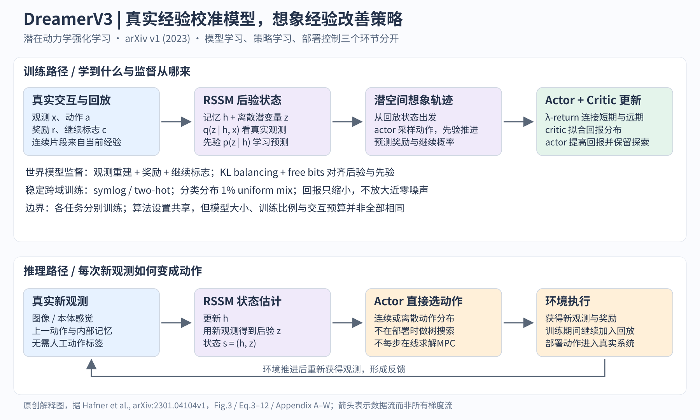

# DreamerV3 精读 从经验学习世界模型 再在想象中学控制

## 阅读边界与一句话定位

基准版本是 Hafner 等的 [arXiv:2301.04104v1，2023-01-10](https://arxiv.org/pdf/2301.04104v1)，共38页。已读正文、公式、实验、结论及方法和评估附录；参考文献仅用于定位前序方法，没有把被引论文算作已精读。2025年 [Nature 后续版本](https://www.nature.com/articles/s41586-025-08744-2) 单列对照，不能把其数字写进2023版结果。

DreamerV3是基于潜在动力学的强化学习算法：真实交互负责校准世界模型，模型内的想象轨迹负责改善策略。它适合作为“世界模型服务决策”的基线，但不能代表视频生成、物理仿真、3D重建等全部世界模型路线。

## 一 先把问题与闭环讲清楚

机器人/游戏环境给出观测 x、奖励 r 和是否继续 c，智能体输出动作 a。训练数据不是人工正确答案，而是当前策略真正试过的经验，存入 replay buffer。图像不是完整物理状态：单帧可能看不到速度、遮挡物和任务阶段，因此内部状态同时含记忆 h 和随机表征 z。需要学会的不是“下一张图像看起来像什么”这一件事，而是哪些隐藏因素影响未来奖励与可执行行为。

完整闭环是：策略真实执行→把转移存入回放→取连续片段训练状态估计与动力学→从真实片段的潜在状态出发，调用模型生成假想未来→在假想奖励上更新 actor/critic→改进后的策略继续真实探索。世界模型、actor、critic并行学习，但优化目标分开，不能把图画成所有损失任意反向流入一个网络。实际部署时用新观测更新隐状态，再调用actor直接选动作，没有每个控制周期的树搜索或在线轨迹优化。[正文 pp.3–8，Fig.3]

## 二 从观测到可预测表征

RSSM的确定性记忆是 h_t=f(h_{t-1},z_{t-1},a_{t-1})；看到当前观测时，从后验 q(z_t|h_t,x_t)采样；想象时没有真实x_t，只能从先验 p(z_t|h_t)采样。二者的区分是阅读整篇论文的钥匙。后验像带测量的状态估计，先验像无新测量的预测步骤；但这里不是明确给定噪声分布的卡尔曼滤波，而是端到端学出的离散随机潜变量。

模型状态 s_t=(h_t,z_t)连接三个预测头：重建观测、预测奖励、预测episode继续概率。重建提供“别丢掉观测信息”的信号；奖励头保证预测对任务有用；继续头避免价值函数在终止后仍积累收益。默认32个分类潜变量，每个32类，通过straight-through估计处理采样梯度。图像用CNN，低维量用MLP，记忆用GRU。[Eq.3；Appendix B、W]

关键损失为：L_WM=L_pred+0.5L_dyn+0.1L_rep。L_pred是观测、奖励、继续标志的负对数似然；L_dyn=max(1,KL[sg(q)||p])，只推动动力学去追后验；L_rep=max(1,KL[q||sg(p)])，推动表征变得可预测。sg表示停止梯度。两项数值看似同一个KL，梯度流向却不同。1 nat的free bits是下限截断，低于阈值后这部分没有继续压缩的梯度，并不是强迫每个状态至少携带一比特。[Eq.4–5]

如果只要求重建，模型可能把容量花在背景纹理；若只要求先验后验接近，又可能丢掉控制信息。KL balancing和free bits的贡献就是让这个权衡在视觉复杂度不同的环境中不必反复手调。分类分布额外混入1%的均匀分布，避免概率接近零时KL尖峰；这属于数值稳定化，不是探索规划器。[正文 pp.5–6；Appendix C–E]

## 三 奖励尺度为什么决定能否跨任务复用

不同任务的奖励可能是小数、数百甚至跨数量级。symlog(x)=sign(x)ln(1+|x|)，其逆是symexp；它保留正负号，同时压缩大幅值。向量观测输入与重建、奖励和价值学习使用相应变换，但不要误写成“所有RGB像素都先做symlog”：Appendix E说明纯图像环境的NoObsSymlog消融与原方法等价。

奖励和critic采用symlog域上的255桶分布及two-hot目标，连续目标被分给相邻两桶。这是稳定连续量回归的手段，不是把控制动作离散化。输出先求桶值期望，再做symexp。目标critic的参数EMA用于正则化，奖励头与价值头输出层从零初始化，减少早期凭空高估价值。[Eq.8–10；Appendix C]

actor还面临奖励收益与探索熵的相对尺度问题。论文以回报5%到95%分位差的滑动统计S归一化收益，并用max(1,S)作分母：只压小大收益，不放大小收益里的噪声。因而固定熵系数3×10^-4可同时用于密集与稀疏奖励；这比“做了归一化”更准确地解释核心设计。[Eq.11–12]

## 四 想象怎样变成控制能力

从回放片段的后验状态出发，actor产生动作，RSSM先验推进状态，奖励头和继续头给出预测信号。有限想象窗口末端由critic补上未来价值，使用λ-return：R_t^λ=r_t+γc_t[(1−λ)v(s_{t+1})+λR_{t+1}^λ]，末端接v。γ约0.997、λ=0.95。正文计16个状态，附录写15步想象horizon，宜明确“状态数与转移步数”而非混为矛盾。[Eq.6–7；Table W.1]

actor最大化归一化想象回报与熵，critic拟合停止梯度后的λ-return。v1对连续动作使用经动力学的随机反向传播，对离散动作用REINFORCE。因此“模型可微”不是所有动作情形都靠同一种梯度估计。训练时会产生很多假想轨迹，推理时则把这些经验压进策略网络。这与MPC的共同点是使用预测模型评价未来；区别是优化主要发生在训练期间，部署并不每步显式求解有限时域控制问题。[正文 p.7]

## 五 实验到底支持多大的结论

v1在7类基准及Minecraft上评估，任务总数超过150，但每个任务单独训练agent，绝不是一个权重模型零样本解决所有领域。Table A.1显示模型大小、训练比例和交互预算随基准变化，“固定超参数”主要指共享算法设置，不等于所有实验资源完全相同。

几个可核对锚点：视觉DMC 20任务、1M步，均值739.6，对照DrQ-v2为677.4；本体感觉DMC 18任务、500K步，均值743.1，对照D4PG为721.0。Atari200M 55游戏的人类归一化中位数302%，DreamerV2为219%，但均值920%反低于DreamerV2的1149%，说明聚合指标会改变叙事。Atari100k的人类归一化均值112%、中位数49%；不能说击败该基准所有方法，EfficientZero在该表中更高且评估设置不同。[Tables O.1、Q.1、S.1、T.1、V.1]

Minecraft的结论应写成“能学会偶尔取得钻石”：40个seed各训练100M步，24个seed至少一次达到含钻石的最高里程碑得分，总计50个episode；首次29.3M步。环境有12个物品里程碑奖励、生命小奖励、库存向量、25类动作和100倍挖掘速度，不能写成原版纯RGB、只有最终钻石奖励。此设定仍是困难长时序探索，但与原始游戏部署不是同一个问题。[正文 p.10；Appendix F–G]

消融在Appendix D–E：去KL balancing拖慢学习；去free bits影响简单环境；取消分母max会放大近零回报噪声并损害稀疏奖励探索；连续symlog回归弱于two-hot。附录给的是曲线，本文只采用作者解释和趋势，不从低分辨率图目测编造精确百分点。8M到200M模型的扩展实验支持这组任务上的更大模型更省交互，不能外推为无限尺度定律。[Fig.6；Appendix D]

## 六 版本差异与复现限制

Nature版本发表于2025-04-02，标题为Mastering diverse control tasks through world models，使用更新实验：8个基准领域、DMLab30任务、Atari57游戏、单A100；Minecraft报告所有训练run发现钻石。其10个Minecraft seed、实验预算与实现更新，不能替换v1的40 seed/24成功seed或V100数字。此处只核对后续版本的版本和实验差异，没有声称其补充材料也已逐项复现。

本次完成论文精读与证据核查，没有运行官方训练代码、复现实验或检验代码commit。最小复现实验建议先做DMC低维单任务：固定环境版本、action repeat、随机种子、replay比例、评估策略；同时记录真实交互步、训练步、墙钟和显存，别只比回报。对有仿真背景的读者，优先检验先验滚动误差是否会被actor利用，再看一步预测MSE。真实机器人还需独立安全约束、低层控制器与系统辨识检查，论文不提供闭环稳定性、约束满足或sim-to-real保证。

## 七 读完后用一个控制例子检验理解

以下是帮助理解的推演，并非论文新增实验。假设小车摄像头被短暂遮挡：后验无法从这一帧恢复完整位置与速度，记忆和动力学先验必须延续状态估计。如果模型生成的画面很清楚，但预测错了碰撞是否会终止任务，critic就可能高估危险轨迹；因此视觉逼真度不能代替决策有效性。如果奖励头在未访问区域错误预测高收益，actor又可能主动走向模型最不可靠的区域，造成想象回报上升、真实回报下降。

复现时可以围绕三个问题逐项检查。第一，关闭新观测后滚动预测，误差是否随时间急剧放大？第二，固定同一真实起点，想象回报与真实执行回报的排序是否一致？第三，改变奖励单位后，探索强度与训练稳定性是否仍相近？这三项分别检查状态预测、模型用于决策的可靠性，以及论文核心尺度处理设计。它们不是需要预先知道标准答案的考试，而是把“学到了世界模型”转换成可观察证据的方法。

也要避免只记录训练损失：低重建损失可能来自容易预测的静态背景，低KL可能来自过度压缩，低价值误差可能因为当前经验全是失败。真正的判据始终包含独立真实交互结果。

## 图解文件与证据索引

[PNG高清图](../../assets/baselines/embodied/dreamerv3_mechanism.png) · [SVG可编辑图](../../assets/baselines/embodied/dreamerv3_mechanism.svg) · [结构化证据](evidence/dreamerv3.json)

来源类型：复用原目录 p117，保留原来源，不重复计数。
