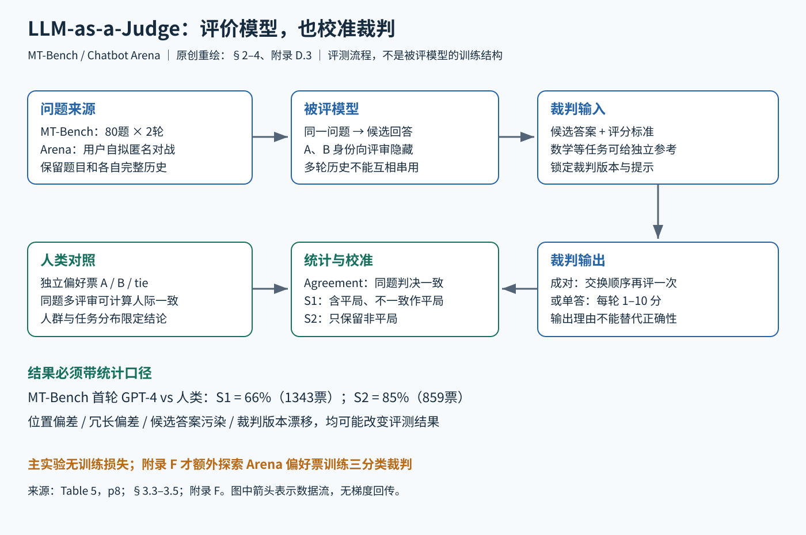

# MT Bench 与 Chatbot Arena 精读：怎样检验语言模型裁判

论文：Zheng 等，Judging LLM-as-a-Judge with MT-Bench and Chatbot Arena。固定阅读 arXiv:2306.05685v4（2023-12-24，NeurIPS 2023 Datasets and Benchmarks），29 页正文与 A–F 附录。它是评测方法、题集与偏好数据基线；正文使用已有模型当裁判，不能把 MT-Bench 误写成一种训练模型。[原文](https://arxiv.org/pdf/2306.05685v4)

## 核心问题

一个模型会做选择题，不代表它的开放式多轮回答让人满意；而人类偏好评估又很贵。本文问的是：强语言模型能否以足够高的一致性近似人类裁判，以及这种一致性在什么题目、统计口径和偏差处理下成立。最重要的阅读结论是，“超过八成”不是对任意答案正确性的保证，也不是包含平局时的总体一致率。

原创图将被评模型、模型裁判、人类对照三种角色分开。裁判的输出是评分或偏好标签，不会自动训练被评模型。

## 1 输入 状态 输出 反馈

MT-Bench 包含八类、每类十题，共八十个两轮问题：写作、角色扮演、信息抽取、推理、数学、代码、STEM 知识、人文社科。第二问经常改变第一问的约束，检验是否记得自己的回答并能进一步执行指令。Arena 则是匿名双模型对战，用户自拟问题，同时看两边回答，先投票再揭示模型身份。论文描述的是早期一个月约三万次投票的数据快照，不是今天的平台规模或模型排名。[§2，pp3–4]

自动裁判的输入是问题、一个或两个候选回答、评价标准以及可选参考答案。多轮时，“状态”是各模型各自完整的对话历史。输出可以是 A 优于 B、B 优于 A、平局，也可以是单回答一至十分及简短说明。反馈来自人类独立偏好票，用于检验裁判，而不是在主实验中直接反向传播。一个系统里同时出现回答模型与评审模型，并不意味着两者互相训练。[§3.1、§3.5；附录 A]

多轮接口尤其容易出错。若把第一轮、第二轮按问题拼成两个独立段落，裁判可能把 B 第一轮的“第二个例子”错当作 A 第二轮应跟随的对象。作者改为将 A 与 B 的完整会话分别放好，再关注第二轮。这个改动保护的是引用关系，而非增加模型知识。[Figure 16，p22；§3.5]

## 2 三种评审形式与两条统计公式

成对比较通常更敏感于细小差别，但 M 个模型的全部两两组合为 M(M−1)/2，成本随模型数平方增长；单答评分可把每个回答独立评完，便于扩展，但分数标尺容易随裁判版本变化。参考引导可以和两种形式组合，特别适合有客观答案的数学题，不能把参考答案存在与否混在一个平均结果里。[§3.1]

MT-Bench 主评分可写作 S=(1/160)Σq=1…80Σt=1…2 s(q,t)，即一百六十个回合分数平均；这是 §5 叙述的数学重写，不是训练损失。Agreement 则是随机抽到同一题、两个不同裁判对判决一致的概率。统计时首先要定义样本集合 Ω，再计算 Σi∈Ω 1[j₁(i)=j₂(i)]/|Ω|；题目与多个人类票的权重必须遵循论文 D.3 的抽样定义。

S1 包含平局和交换顺序后不一致的判决，并把后者算平局；S2 仅留下非平局。三分类随机基线约三分之一，二分类约二分之一。把 S2 的高一致率和 S1 的样本量拼接，会制造错误印象。本文不是用一个新奖励函数定义“真正质量”；它研究的是给定投票人群、问题分布和判决格式下的偏好近似。

## 3 偏差怎样被测出来

位置偏差实验为每道首轮题调用两次 GPT-3.5，以温度 0.7 生成相近答案，再交换展示顺序。Table 2 默认提示下，Claude-v1、GPT-3.5、GPT-4 的顺序一致率分别为 23.8%、46.2%、65.0%。提示里写“不要受位置影响”并不能消除偏差。重命名助手后 Claude 的偏好也改变，说明名字与位置可能同时介入。[§3.3，Table 2，p5]

论文采用的保守办法是交换顺序调用两次：只有同一答案两次都胜出才判胜，其余记平局。它降低了不稳定判断进入胜负统计的机会，却也增加平局和调用量。D.1 显示问题并非均匀分布：模型能力差距大时更一致，相近模型比较更难。因此“能区分明显好坏”不等于“能可靠排序两个很接近的新模型”。

冗长偏差用二十三个带列表的回答测试：不添加新信息，只把列表改述一次并放到原列表前。把这种重复版判得更好即为攻击成功。Table 3 的失败率是 Claude 与 GPT-3.5 各 91.3%，GPT-4 为 8.7%。这是小规模、特定构造的压力测试，既说明问题存在，也不能推断所有长答案都是投机或所有简短答案都更好。[Table 3、Figure 12]

数学偏差更微妙：裁判单独做题可以正确，看见错误候选后却顺着它算错。十道题、两种顺序的二十次比较中，默认提示把错误答案说成正确的次数为 14/20；要求裁判先在同一上下文推理降为 6/20；先独立生成参考，再单独评审为 3/20。收益来自隔离候选答案对解题的污染，参考本身仍可能错误。[Table 4，p5；Figures 13–15]

作者讨论“偏爱自己”的可能性：部分裁判对自己产出的胜率高于人类评价，但也偏爱其他模型，且难以只改风格不改质量。正文明确说现有数据不能确定自我偏好成立。因此本笔记把它记为待厘清的混杂因素，不把相关观察写成已证实因果。[§3.3]

## 4 超过八成到底是哪八成

MT-Bench 由六个模型作答，五十八位主要来自研究生群体的评审提供约三千票。Arena 从约三万票中抽约三千单轮票，涉及九类被评模型与 2,114 个独立 IP。IP 不是经核实的人数，两类评审的人群与问题分布也不同。[§4.1；附录 C]

Table 5 的 GPT-4 成对裁判与人类在第一轮 S1 一致率 66%、S2 为 85%；第二轮同为 66%、85%。人类彼此第一轮为 63%、81%，第二轮 67%、82%。第一轮 GPT-4 对人类的统计票数从 S1 的 1,343 降到 S2 的 859。Table 6 的 Arena 对应 64% 与 87%，统计票数 3,066 与 1,944。高一致率是真实报告，但它来自排除平局后的子集。[Tables 5–6，p8，已视觉核对]

D.3 又解释为何“超过人类互评”不能直接读成“超过人类能力”：三人投 A、A、B，人类不同个体两两仅三分之一一致；如果模型稳定选多数 A，与随机人类却有三分之二一致。模型可能更接近多数票，而人类间本来有分歧。附录进一步加入 human-majority，提醒必须区分单个人、多数人和人群共识。

作者还问与 GPT-4 不同意的人是否认为其理由合理：75%认为合理，34%愿改票。这能说明解释具有说服力，却不是独立正确性验证；看到裁判解释后的偏好与原先盲评，应分别保留，不能用改票反过来证明初次裁判一定对。[§4.2；附录 C.1]

## 5 对齐风格与基础能力为什么要一起测

Table 8 中 LLaMA-13B 的 MMLU 为 47.0、MT-Bench 为 2.61；Vicuna-13B(all) 为 52.1、6.39。更有启发的是 Vicuna-7B(selected)：只用 4.8M tokens、三千条精选会话，MT-Bench 5.95 接近 full 的 6.00，但 MMLU 37.3 明显低于 full 的 47.1。少量高质量对话能改变偏好的回答方式，却未带来同等幅度的知识能力改善。[§5，Table 8，p9]

E 说明 Vicuna 原始清洗后有 125K 会话；长会话切分使训练表中 sequence 数不等于原始会话数。全量与单轮等设置采用 batch 128、学习率 2e−5、三 epoch、长度 2048，精选数据五 epoch。此处用于检验评价维度互补，不应把它扩写成“MT-Bench 的训练流程”。

F 才是附带的裁判训练探索：Arena 抽 22K 单轮票，20K 训练、2K 验证，另用正文测试集；把 Vicuna-13B 改成 A/B/tie 三分类，解决自由文本难解析问题。微调后顺序一致率 65.0%，格式错误零；包含三类的一致率 56.8%，排除 tie 后 85.5%。分类交叉熵是自然实现，但论文没有给一个新的编号损失推导。三分类任务的输出格式变好，也不等于判断语义已经达到通用专家水平。[F、Table 15，p29]

## 6 路线位置与复现检查

作者建议能力测试与人类偏好评测互补。本文为指令微调、对齐、Agent 输出评价提供可重复的裁判基线，但不直接验证工具动作成功、环境状态正确、安全性或机器人轨迹稳定。它和 ReAct 是“行动方法与评价接口”的关系，不是一条模型继承链；若评 Agent，应另加任务完成证据和行动成本。

本笔记的分析是，最小可靠评测至少需要固定题集版本、回答模型、裁判版本、温度、评分提示、参考答案和顺序交换规则，同时保存逐例票与解析失败。报告总体均分之外，还应给类别、两轮分别的结果，平局覆盖率、人类对照分布以及接近模型对的差异。重复调用一致，不代表事实正确；偏好一致，也不代表安全合规。

正文明确主要关注 helpfulness，安全、诚实、无害性没有充分覆盖；准确、相关、创造性等维度也被压成单指标。附录 B 的案例固定 gpt-4-0314，并提醒未来版本不一定重现。把本文历史数值当作当前模型评审质量、今日 Arena 排名或所有语言人群的共识，都越过了证据边界。

## 阅读和证据覆盖

已读正文 §1–7、A 提示模板、B 案例、C 数据收集、D.1–D.4、E 训练、F.1–F.2；参考文献作索引，未复跑评测。精确位置与边界见 [证据文件](evidence/llm-judge.json)。本图原创，原 PDF 与阅读缓存不随交付发布。

## 图解文件与证据索引

[PNG高清图](../../assets/baselines/cross/llm-judge.svg) · [SVG可编辑图](../../assets/baselines/cross/llm-judge.svg) · [结构化证据](evidence/llm-judge.json)

来源类型：本次为细分方向新选择的 baseline，不是历史聊天提取。
