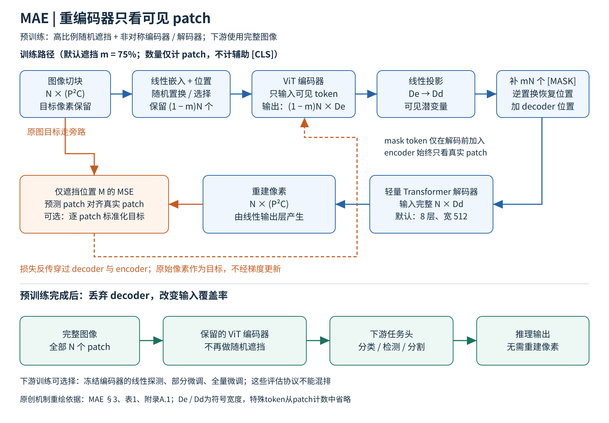

# MAE 精读：让重编码器只看可见部分

论文：Kaiming He 等，Masked Autoencoders Are Scalable Vision Learners，依据 [arXiv v3 完整原文](https://arxiv.org/pdf/2111.06377v3)，正文第1–9页、附录A–C第11–12页及第13–14页补充重建图。下文页码为PDF页码；明确区分论文实验和分析性解释，没有重新训练或复现结果。

## 一 从像素补全到表示学习

MAE要解决的是“如何用无标签图像训练可迁移的大型视觉编码器”，不是单纯追求修图观感。它沿用ViT，把大部分patch删掉，只编码剩下的小部分，再用轻量解码器恢复缺失像素。论文的贡献在于两个协同设计：高遮挡让任务具有难度；不让mask token进入昂贵编码器，使这种困难任务反而更省计算。[§1、§3]

作者解释，图像相邻区域有大量冗余，低遮挡可能靠局部颜色纹理插值完成；语言词语本来语义密度就高，不能直接照搬BERT的15%遮挡。这里“高遮挡促进语义理解”是有实验支持的机制假说，不是从重建损失推出的数学保证。模型能生成看似合理、却与真值不同的内容，也说明像素补全不等于恢复客观事实。[§1、图2–4，Broader impacts]

## 二 原创机制图与张量流

图源说明：依据原文§3、图1说明及附录A.1重新设计；没有复制原图。mae.svg为可编辑矢量版本。N表示全图patch数，m为遮挡比例；图示以m=75%解释默认设置，特殊[class] token单独注明，不与patch数量混算。

假设图像切成N个P×P、C通道的patch，像素目标为N×(P²C)。先做线性嵌入并加入位置信息，再随机打乱索引，保留(1−m)N个可见token。原始空间位置不会被忘掉：位置信息随token保留，恢复顺序使用逆置换。编码器只处理可见patch，不处理被遮挡位置的占位符。[§3]

编码器得到可见位置潜变量后，通过线性层对齐解码器宽度。再补入共享可学习mask token，并按逆置换还原完整序列顺序；向全部位置加入解码器位置编码。完整N个patch位置由轻量Transformer解码，最后线性层输出每个位置P²C个像素值。若没有位置编码，各mask token初始相同，解码器无法知道某个缺口位于何处。[§3，附录A.1]

损失只计算被遮挡patch集合M：L=(1/|M|)Σᵢ∈M mean((预测patchᵢ−目标patchᵢ)²)。可见patch虽可输出预测，却不受该项损失直接约束，因此原论文重建图里可见区域也可能比较差。作者故意没有总用真实可见像素覆盖这些位置，以便展示模型行为。它不是在所有像素上求平均的普通去噪自编码器。[p2图2注释；p4脚注1]

可选目标是每个patch独立做均值、标准差归一化后的像素。注意归一化的是重建目标，不是把整个数据集变成语义token。模型仍在做连续像素回归。附录还使用辅助dummy token兼容ViT的分类token；无该token改平均池化也能得到类似效果，不能把它当MAE不可或缺的结构。

## 三 训练与部署实际怎么分开

预训练只使用ImageNet-1k训练图像、不使用类别标签。主消融使用ViT-L/16，800 epochs、75%随机遮挡、8层宽512解码器；默认消融目标为未归一化像素。最终较强结果改用归一化像素和1600 epochs，不能把两套结果混算成同一baseline。[表1、表3]

附录表8给出AdamW，base learning rate 1.5×10⁻⁴、batch4096、β=(0.9,0.95)、weight decay0.05、40 epochs warmup、余弦衰减。base learning rate按batch/256线性缩放，不能把表中base值误读为4096批量下直接使用值。预训练只需随机尺度裁剪等轻量增强，不用color jitter、drop path或gradient clipping。[附录A.1]

下游分类时丢弃解码器，把完整图像所有patch送入编码器。全量微调更新编码器和分类头；线性探测冻结编码器，只训练线性头；部分微调只更新最后若干块。表9中的监督微调使用RandAugment、mixup、cutmix等，和预训练配方差别很大。真正推理时不再随机删75%的输入，也不再重建像素。用于检测分割时，还需连接任务头和相应特征尺度适配，不能把预训练模型直接叫成检测器。

## 四 最有解释力的消融

遮挡比例：图5中ViT-L线性探测从10%遮挡的54.6%上升到75%遮挡的73.5%；全量微调对比例更不敏感，40–80%范围总体较强。这说明“最佳遮挡”依赖评估目标，不能仅凭线性探测寻找任何任务的唯一最优值。[p4图5]

编码器是否看mask token：表1c中去掉编码器mask token后，微调84.2→84.9，线性探测59.6→73.5，整体训练FLOPs相对为3.3×→1×。这是MAE最关键的结构消融之一。作者把表示改善解释为缩小预训练与完整图像部署之间的输入差异；这属于合理解释，实验直接证实的是该设计下的性能和效率变化。[p5表1c]

解码器不是越强越好：表1a由1层增至8层，线性探测65.5→73.5，但全量微调84.8→84.9几乎不变。分析：深解码器能承担更多低层像素重建工作，让编码器末层不必过度专用于像素；若允许微调，末层又能重新适应分类。这个解释也提示为何不同训练目标的线性探测不应被当成全部表示质量。[p5]

重建目标：未归一化像素为84.9/73.5（微调/线性），归一化像素85.4/73.9，dVAE token85.3/71.6。表7进一步在分类、COCO、ADE20K中比较归一化像素和dVAE，差异很小。证据支持“MAE这套设计不必依赖外部tokenizer”，并不证明所有视觉离散token方案都无价值。[p5表1d；p8表7]

遮挡方式和观感：随机75%得到84.9/73.5，网格75%为84.0/66.0；网格重建反而更清晰、训练loss更低。块状75%为82.8/63.9。这组实验直接反驳“重建越好看，特征一定越好”。任务过易和过难都可能削弱表示学习。[表1f、图6]

## 五 主结果和公平比较边界

表3全量微调中，MAE B/L/H分别83.6/85.9/86.9%（224分辨率）；H在448为87.8%。同表MoCo v3的B/L为83.2/84.1，BEiT为83.2/85.2。BEiT的外部dVAE预训练使用了额外图像，表中专门注明，因此不能声称所有比较的数据来源完全一致。[p7表3]

效率证据要带实现条件：表2在128 TPUv3核心、TensorFlow、800 epochs下，ViT-L完整mask编码器为42.4小时，去掉mask token为15.4小时，即2.8×；改1层解码器11.6小时，即3.7×。ViT-H可达3.5–4.1×，其中完整mask版本119.6小时是根据10 epochs估算。正文另比较1600 epochs MAE-L约31小时和300 epochs MoCo v3约36小时。epoch数不能直接代表计算量，因为每步编码器看到的patch数大不相同。[p5表2；p7]

迁移也有结构化证据：COCO ViT-L的box AP，监督预训练49.3、MAE53.3；ADE20K ViT-L的mIoU分别49.9、53.6。检测使用适配FPN的ViT Mask R-CNN，分割使用UperNet；这些是端到端微调结果。附录A.3–A.4说明比较方法都搜索了任务超参，分割还在迁移时引入零初始化相对位置偏置，所以不能把增益理解为“裸编码器零样本分割”。[表4–5]

最值得记住的是图9：基线MAE-L线性73.5，微调最后一个Transformer块即81.0；MoCo v3线性更强，但在非线性部分微调上落后。这不是否定线性探测，而是要求明确你准备如何用特征。[§4.3]

## 六 附录、局限与适用路线

附录A.2给了更强、稳定的监督从零训练配方，防止把落后的监督baseline当成MAE全部收益。附录B表12的最终MAE-L线性探测为75.8，和主消融73.5的训练设置不同。附录C表13展示ImageNet-C/A/R/Sketch的迁移鲁棒性，尺度增大总体有利，但提高分辨率对IN-C反而不一定更好。鲁棒性是特定测试集结果，不是对真实部署分布的保障。

分析：MAE适合有较多无标签图像、愿意做下游微调、希望训练大ViT并节省预训练编码成本的场景；如果只想冻结编码器做最近邻或线性读出，应与DINO、对比学习直接比较。MAE没有文本塔，不天然提供开放词表语义接口；它也不是带校准概率的生成式图像模型，补全内容可能是平均化或虚构的。长预训练、任务配方、下游标签需求仍是成本。

与ViT的关系是“在同一个骨干上改变学习目标和预训练计算路径”；与CLIP的差别是监督来自图像自身缺失像素，而不是配对文本；与DINO的差别是预测像素目标，而不是匹配另一视图的教师分布。三者可以共享ViT，甚至在后续系统里组合，不能画成互斥树枝。

## 七 阅读覆盖

已阅读正文§1–6、Broader impacts；附录A.1–A.5全部训练和迁移细节、B线性探测、C鲁棒性；核对表1–13及图1–11。原文补充重建图以视觉方式检查，参考文献仅作为索引。具体证据和完整覆盖字段见mae.evidence.json。

## 图解文件与证据索引

[PNG高清图](../../assets/baselines/visual/mae.png) · [SVG可编辑图](../../assets/baselines/visual/mae.svg) · [结构化证据](evidence/mae.json)

来源类型：本次为细分方向新选择的 baseline，不是历史聊天提取。
