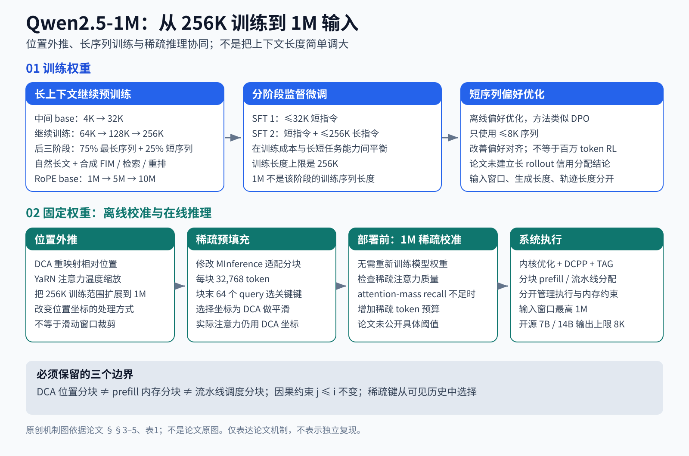

# Qwen2.5-1M 全文精读：百万上下文是怎样训练、外推并跑起来的

[长上下文方向路线图](../roadmaps/long-context.md) · [论文原文 v1](https://arxiv.org/html/2501.15383v1)

> 阅读对象：Qwen Team, *Qwen2.5-1M Technical Report*, arXiv:2501.15383v1。本文依据原论文全部正文、公式、算法、表格及图示；PDF共19页，正文到第15页，参考文献延续到第19页，**没有附录**。页码为PDF印刷页码。这里是机制分析和证据审计，不是独立复现实验，也不把2025年报告中的API或软件状态当作今日状态。
>
> 证据标记：**[报告]** 原文陈述；**[实验]** 论文中的观测；**[分析]** 本文解释、推导或建议；**[未公开]** 论文没有提供足以复现的信息。

## 一、先回答最容易混淆的三个问题

**1M不等于用1M长度训练，也不等于生成1M tokens。** 这条路线是：接续Qwen2.5中间检查点，逐步进行最长256K的长上下文预训练，再做长短混合SFT和短样本离线偏好优化，推理时用位置外推扩到1M。开源7B/14B的生成长度列为8K。预训练长度、输入窗口、输出预算是三件事。[§2–5、表1，PDF第3–6页](https://arxiv.org/pdf/2501.15383#page=3)

**长上下文不是SFT或RL独占的能力。** 这里预训练负责学习长距离依赖，SFT负责把它变成可用的指令行为；离线偏好训练只用了最长8K的样本；推理算法与系统优化再把已训练能力延伸到更长、降低运行成本。报告没有长轨迹在线RL实验。[§3–5，PDF第3–6页](https://arxiv.org/pdf/2501.15383#page=3)

**“注意力能看多远”与“因果遮罩能不能看未来”是不同坐标。** DCA改变位置距离的表示；稀疏注意力选择少量关键历史位置；两者都不要求取消自回归因果性。论文公式(2)仍对j≤i求和。所谓full attention在这里应理解为完整的因果注意力，不是双向注意力。[§5.2，公式2–4，PDF第8页](https://arxiv.org/pdf/2501.15383#page=8)

## 二、问题、基线与贡献边界

### 2.1 它实际要补哪几个缺口

[分析] 把“支持百万上下文”拆成四个独立验收条件，才能理解整篇报告：

1. **位置泛化**：推理出现训练时没有出现过的远距离，位置编码仍需可用。
2. **信息利用**：关键内容真的改变答案；只把文本塞入窗口不够。
3. **任务表达**：模型要按长文问题输出好答案，而不仅是继续补全文本。
4. **资源可行性**：运行时显存、首token等待和多请求调度都得可接受。

第1项由RoPE频率调节、DCA和温度缩放处理；第2项由长依赖数据与训练课程提供主要学习信号；第3项由SFT与偏好优化处理；第4项由稀疏prefill、分块、kernel和引擎协同处理。任何一个模块的成功都不能替代另外三个模块的验证。

### 2.2 骨架没有变成另一种模型

[报告] 仍为Qwen2.5的Transformer骨架：GQA、SwiGLU、RoPE、QKV bias、pre-RMSNorm。7B为28层、28个Q头/4个KV头；14B为48层、40个Q头/8个KV头；均不绑定输入输出embedding。Turbo是API提供的MoE模型，报告没有给出足以完整复现它的全部架构参数。[§2、表1，PDF第3页](https://arxiv.org/pdf/2501.15383#page=3)

[分析] 因此这不是“Transformer被新结构替代”的论文。GQA原已存在，不应列成1M版本新增发明。它有助于压低KV缓存，却不自动消除所有Q–K配对的算量。论文的新意更集中在**训练配方和既有外推/稀疏技术的耦合与工程化**。

## 三、训练：哪些参数真的经过学习

### 3.1 数据：长文本不保证包含长距离学习信号

[报告] 自然语料来源包括网页、arXiv、书籍、代码仓库；另加入FIM、按关键词/位置检索、段落重排等合成任务。[§3，PDF第3页](https://arxiv.org/pdf/2501.15383#page=3)

[分析] 这里最值得带走的想法不是“收集更长的文本”，而是**让正确预测必须依赖远处的信息**。例如一篇长文章中，大部分词仍由附近几句决定，那么即使每个训练样本都很长，优化器也可能主要获得局部建模收益。

- FIM可以把填空目标放在已有前后材料之后，使自回归模型利用两侧内容；不意味着在原序列上允许当前token偷看未来。报告没有公开精确序列化模板。
- 位置检索让答案取决于“在某段之前/之后”的材料；它对抗只按局部关键词续写的捷径。
- 段落重排要求恢复结构关系；但如果能靠相邻衔接词解决，未必证明模型学会了全局论证。需要额外控制实验才可区分。

[未公开] 各自然域占比、合成比例、每类样本数、总训练token数、任务生成模板、去重与污染审计、样本过滤质量数据都不充分。因此“合成数据降低了多少训练成本”不能从本报告定量还原。

### 3.2 课程：先学会较短跨度，再逐级加长

| 阶段 | 最大训练长度 | RoPE base | 身份与解释 |
|---|---:|---:|---|
| 初始 | 4,096 | 10,000 | 继承Qwen2.5早期训练路线 |
| 扩展 | 32,768 | 1,000,000 | 接续中间Base检查点，ABF调整 |
| 长上下文1 | 65,536 | 1,000,000 | 新增长上下文阶段 |
| 长上下文2 | 131,072 | 5,000,000 | 继续增加跨度 |
| 长上下文3 | 262,144 | 10,000,000 | 报告中的最大训练长度 |

后三阶段每阶段按**序列**构成75%当前最大长度、25%较短样本；不能改写成75%的tokens。报告未给短序列长度分布。[§3，PDF第3–4页](https://arxiv.org/pdf/2501.15383#page=3)

[分析] RoPE base变化改变不同维度的位置旋转频率；它不是增添一个“更长的因果mask”。长度课程也不仅是显存折中：当模型还不会较短检索时，直接将多数算力花在百万长度的干扰内容上，可能信号效率很差。但本报告没有等算力的“一步256K”对照，因此不能把课程顺序本身的因果收益当成已被单独证实。

### 3.3 课程的证据：长处进步，短处并非单调

表2追踪14B的预训练阶段：

| 训练上限 | RULER平均 | 64K测评 | 128K测评 |
|---:|---:|---:|---:|
| 32,768 | 82.3 | 76.4 | 37.6 |
| 65,536 | 86.8 | 86.7 | 56.0 |
| 131,072 | 92.5 | 93.0 | 83.8 |
| 262,144 | 92.7 | 91.9 | 87.6 |

[实验] 128K列提高明显，最后一阶段在128K任务又增加3.8分；64K列最后却下降1.1分。[表2，PDF第4页](https://arxiv.org/pdf/2501.15383#page=4)

[分析] 这支持“更长训练对长距离任务有帮助”，也提醒不要把平均分微升说成所有长度同时改善。它不是干净的长度单变量消融：阶段之间还增加了训练、调整了base、改变数据长度。若要证明“训练超出目标长度”的独立价值，至少还需要同训练token、同数据和同算力的比较。

## 四、后训练：把读取能力变成任务能力

### 4.1 合成长指令数据的完整链路

[报告] 先取长文档，再从随机抽取的文段生成问题；任务覆盖摘要、检索、多跳问答、推理、代码等。随后让Qwen-Agent基于**全文**作答，使用检索增强、逐块阅读和逐步推理等能力。最终学生看到的是“完整文档＋问题＋agent生成答案”。[§4，PDF第4页](https://arxiv.org/pdf/2501.15383#page=4)

[分析] 必须区分**教师制作答案的流程**和**学生推理的流程**。教师用了RAG，不等于学生在每次推理都必须调用RAG；教师有逐步阅读，也不等于论文训练了能反复调用工具的长轨迹agent。还存在值得检查的捷径：问题只从一个文段产生，答案可能主要由该段决定；“多跳任务类别存在”不足以证明每个样本确实需要跨全文整合。

### 4.2 两段SFT

- 第一段：只用≤32,768的短指令，训练步数与Qwen2.5对应阶段相同。
- 第二段：混合短指令和长指令，最长262,144。
- 目标：保住短任务能力，同时让模型学会长文指令。

以上是公开配方；确切短长比例、每阶段步数、学习率、batch、损失掩码与数据量没有完整公开。[§4，PDF第4页](https://arxiv.org/pdf/2501.15383#page=4)

[分析] 即使SFT只对答案位置计算loss，答案仍可通过attention依赖长输入，从而让梯度训练长距离信息的使用；不需要“给每个输入token一个奖励”。这是自回归监督学习的机制解释，不是报告新提出的损失函数。反过来，teacher forcing给出了目标token，也不保证模型在自由生成时会可靠地读取全部上下文。

### 4.3 离线偏好优化：它能支持什么结论

[报告] 使用“类似DPO”的离线RL，复用其他Qwen2.5模型的偏好训练对，全部≤8,192。不要把“类似”改写成已明确公开精确DPO算法与全部超参数。[§4，PDF第4页](https://arxiv.org/pdf/2501.15383#page=4)

| 模型 | LongBench-Chat优化前 | 优化后 | 端点差值 |
|---|---:|---:|---:|
| 7B-1M | 7.32 | 8.08 | +0.76 |
| 14B-1M | 8.56 | 8.76 | +0.20 |
| Turbo | 7.60 | 8.34 | +0.74 |

[实验] 表3给7B标注“+0.75”，但显示端点相减是0.76，可能涉及未显示精度或笔误；不擅自替作者修正。[表3，PDF第4页](https://arxiv.org/pdf/2501.15383#page=4)

[分析] 结果支持“短样本偏好优化的收益在这个长文对话评测上可迁移”。它没有证明：短RL可替代长预训练、偏好优化扩大了物理窗口、已解决长工具轨迹的奖励稀疏问题。因为受测模型此前已进行长预训练和长SFT，且LongBench-Chat上限约100K，而非1M。

## 五、推理外推：DCA与YaRN各改了什么

### 5.1 因果mask、位置、稀疏性要分开写

[分析] 用一个示意式将三个坐标拆开：

A(i,j) ∝ exp(position-adjusted-score(i,j) / temperature)，j属于允许集合。

- 因果约束：允许集合先受j≤i限制。
- DCA：调整score中位置关系的表示。
- 稀疏化：在允许的历史keys中再选子集。

所以“全注意力/稀疏注意力”和“因果/双向”不是一对互斥分类。因果全注意力、因果稀疏注意力都成立。这一拆分也解释为什么位置重映射本身不必丢弃历史token。

### 5.2 DCA不是把上下文截成互不相通的小段

[报告] DCA将长序列分块，使远距离位置以较小的、训练覆盖过的相对距离表示：块内保留原距离；跨块用重复的位置模式；相邻块额外保护局部距离的连续性。[§5.1、图2，PDF第5–6页](https://arxiv.org/pdf/2501.15383#page=5)

[分析] 需要保留“相邻块”这一步，否则图看起来会像简单取模，漏掉跨边界局部关系的特殊处理。图2的8-token训练长、5-token块、3-token局部窗口是讲解用玩具例子，不能当作7B/14B部署配置。DCA让远处信息在位置表示上进入熟悉区域；它不可能凭空教会模型复杂推理，信息内容的利用仍依赖权重与训练。

### 5.3 此处YaRN主要指attention温度缩放

原文公式(1)：softmax(qᵀk / (t√D))，其中√(1/t)=1+0.1 ln(s)，s为推理长度与训练长度之比。[§5.1、公式1，PDF第6页](https://arxiv.org/pdf/2501.15383#page=6)

[分析] 当s=4时，1/t≈1.2965、t≈0.7713，因此logits约放大1.30倍，分布通常更尖锐。这是公式的直接计算，不是测出来的准确率增益。它试图减轻更多候选位置带来的注意力分散，却不保证目标token总被选中。

此文报告实验总把DCA与该缩放共同使用；因此图中“有无DCA”的标签不能支持将全部增益严格归给DCA单独。也不应把该节扩写成完整YaRN所有位置插值技巧均被采用。[§5.1，PDF第6页](https://arxiv.org/pdf/2501.15383#page=6)

### 5.4 外推成功的范围

[实验] 图3比较普通版本与1M版本、有无外推，在1M范围的passkey、多查询/多值NIAH上观察效果。普通7B/14B只训练到32K，启用外推后简单passkey可超过80%；更长训练的1M版本更强。[图3及§5.1，PDF第6页](https://arxiv.org/pdf/2501.15383#page=6)

[分析] “无需额外训练”仅指外推操作，不是整套1M模型没做额外训练。找出一个密码的成功也不等于在百万token上进行准确的跨段综合论证。

## 六、让百万输入实际可运行：四层成本分别处理

### 6.1 稀疏prefill：少算哪些Q–K配对

[报告] MInference先离线确定各head的vertical/slash预算；推理时用部分query探测重要keys，再按竖线和斜线模式执行稀疏attention。Qwen版本进一步与分块prefill及DCA结合。[§5.2、图4，PDF第7页](https://arxiv.org/pdf/2501.15383#page=7)

[分析] 竖线可对应很多query共享的重要历史位置；斜线对应随query平移的相对局部结构。这里“稀疏”说的是计算位置，不是MoE的参数激活稀疏，也不是新的训练目标。不得从“注意力天然稀疏”推出所有任务都能无损删边。

### 6.2 分块prefill：少保留多少同时活跃的中间量

[报告] 1M输入时，7B单个MLP层激活占用可达71GB；prefill块长32,768使该激活占用减少96.7%。每个块用自身最后64个query寻找重要keys，而非尚不可取得的整个输入末尾query。[§5.2，PDF第7页](https://arxiv.org/pdf/2501.15383#page=7)

[分析] 96.7%指该激活部分，不是整模型总显存，也不是KV cache减少96.7%。分块prefill仍可关注已处理历史；它不同于将历史永久截断。还要避免把这里的32,768块与DCA位置块、DCPP调度块混为同一参数。

### 6.3 DCA与稀疏选点的冲突及修复

[报告] 作者假设DCA相对位置的不连续会破坏slash模式，导致关键token选择失准；于是**选点时**恢复更连续的相对位置，**最终attention计算时**仍使用DCA的重映射位置。[§5.2、图5，PDF第8页](https://arxiv.org/pdf/2501.15383#page=8)

[分析] 这是一项重要的系统耦合：两个各自有效的近似方法，组合时可能破坏对方的假设。图5体现的是改善对角线上位置的一致性，不能概括成“全局恢复原始距离”，否则就抹掉了DCA外推的作用。作者关于下降原因的解释是机制假说；比较图支持组合修复有效，但未单独证明全部因果链。

### 6.4 百万长度校准：保留了多少注意力质量

[报告] 原MInference短序列配置搜索通常低于32K。Qwen使用1M序列重新校准，借助FlashAttention返回的log-sum-exp计算完整与稀疏注意力的质量比：

recall = exp(LSE_sparse − LSE_full)。

不足阈值的head增加vertical/slash预算。[公式2–4、算法1，PDF第8–9页](https://arxiv.org/pdf/2501.15383#page=8)

[分析] 这里的recall是完整softmax分母中被选中keys保留下来的概率质量，不是任务答案召回率。保留0.99的attention mass也不是99%任务准确率。若忽略值向量相消、误差传播及多层非线性，两个指标就会被错误等同。校准依赖长序列数据和完整attention计算，因而“训练免费”也不等于零离线算力；但这不是梯度更新模型权重。

[未公开] 阈值、预算每次增加量、校准集规模与域分布、如何聚合query/样本上的recall、是否反复直到达标，均不足以从算法1精确复现。算法显示if判断，不能擅自改写成完整收敛保证。

[实验] 7B-1M在>400K时直接采用原稀疏方案可能降到≤60% NIAH检索准确率；改进选点和校准后恢复多数性能，并保持约4倍prefill加速。这是组合方案证据，缺少两个改动分别开关的完整2×2对照。[图6、§5.2，PDF第9页](https://arxiv.org/pdf/2501.15383#page=9)

### 6.5 引擎层：不能把kernel倍率当整机倍率

[报告] BladeLLM还有三类优化：稀疏KV加载与kernel流水、动态分块流水并行DCPP、调度/模型执行/解码分进程的异步TAG。Turbo另优化MoE的访存与warp协作。[§5.3，PDF第10–11页](https://arxiv.org/pdf/2501.15383#page=10)

[分析] DCPP针对不同历史长度造成的chunk耗时不等，动态调整chunk大小来降低流水气泡；TAG针对CPU调度与GPU执行串行等待。它们没有改变训练目标，也不直接提供更强的信息利用能力。

数值层级必须分清：A100上1M稀疏attention kernel，相同稀疏配置下MInference为13.7×、BladeLLM为27.8×（相对FlashAttention）；整体TTFT则是3.2–6.7×。H20上MoE kernel报告3.4 TB/s、较FusedMoE提高55%，不能挪用成所有模型端到端吞吐提升。[§5.3、图7–8；§6.3、图11](https://arxiv.org/pdf/2501.15383#page=10)

## 七、实验：证据到底覆盖哪种“长”

### 7.1 完整窗口和复杂理解并没有被同等验证

| 测评 | 文中长度范围 | 能观察到的能力 | 不能直接推出 |
|---|---|---|---|
| Passkey / NIAH图示 | 最长1M | 找回特定信息、位置鲁棒性 | 任意复杂任务的百万上下文可靠性 |
| RULER主表 | 最长128K | 多项检索/聚合合成任务 | 1M复杂推理 |
| LV-Eval | 最长256K | 多片段证据理解 | 1M复杂推理、真实项目闭环 |
| LongBench-Chat | 最长100K | 长文回答与偏好表现 | 长agent轨迹信用分配 |

[§6.1，PDF第12–13页](https://arxiv.org/pdf/2501.15383#page=12)

[实验] 14B-1M与Turbo在图1的passkey设置达到完全准确；7B仍有少量失败。[图1及§6.1](https://arxiv.org/pdf/2501.15383#page=1)

[分析] “1M窗口能访问”和“1M信息能完整整合”应分别记录。把RULER主表当成1M RULER测试会把证据范围扩大八倍。

### 7.2 比较必须给基线也用外推

| 模型/推理方式 | RULER平均 | RULER 128K | LV-Eval 256K | LongBench-Chat |
|---|---:|---:|---:|---:|
| 7B原版，RoPE | 80.1 | 31.4 | 0.5 | 未列 |
| 7B原版，DCA+YaRN | 85.4 | 55.1 | 36.9 | 7.42 |
| 7B-1M | 91.8 | 84.4 | 42.7 | 8.08 |
| 14B原版，RoPE | 86.5 | 53.0 | 0.8 | 未列 |
| 14B原版，DCA+YaRN | 91.4 | 78.1 | 39.4 | 8.04 |
| 14B-1M | 95.7 | 92.2 | 43.3 | 8.76 |
| 72B原版，DCA+YaRN | 95.1 | 88.4 | 45.2 | 8.72 |
| GPT-4o-mini | 87.3 | 65.8 | 不适用 | 8.48 |

[表4–5，PDF第13页；已视觉核对跨行合并单元格](https://arxiv.org/pdf/2501.15383#page=13)

[分析] 以14B的128K RULER为例：53.0→78.1是给原版加入外推后的+25.1分；78.1→92.2是1M整套训练配方相对更合理基线的+14.1分。两项不能简单解释为互不交互的独立因果贡献，但这种拆分可防止把推理修复收益全算在训练上。

另一个重要反例：72B+DCA的LV-Eval在全部五种长度都高于14B-1M。这说明扩大窗口和增强复杂任务的底层能力并非同一条轴。7B-1M在LV-Eval 128K得48.3，也略高于14B-1M的47.6；不能宣传模型尺寸越大每列就必然越高。

LV-Eval指标被作者修改以减少严格匹配导致的假阴性；本报告内部比较可读，直接与原始LV-Eval排行榜混排需先确认评测口径。表4称某行为“GPT-4”，正文提基线GPT-4o，存在命名不一致；这里保留原表标签，不替它判定具体API快照。[§6.1、表4–5](https://arxiv.org/pdf/2501.15383#page=12)

### 7.3 “短能力不受损”应该降格成带限定的结论

[实验] 表6有明显升降：14B GPQA 45.5→39.9，LiveCodeBench 42.6→38.6；HumanEval 83.5→88.4，IFEval 81.0→84.3。7B MATH 75.5→72.9、Arena-Hard 52.0→48.1。[表6，PDF第14页](https://arxiv.org/pdf/2501.15383#page=14)

[分析] 较准确的说法是“短任务总体大致保持同档水平，个别任务有回退也有改善”，而不是逐项无损。没有置信区间或重复运行，不应将所有升降都断言为稳定变化；同样，也不能无证据地把退步全部抹成随机波动。

### 7.4 加速实际在哪个条件成立

图11的1M TTFT倍率：

| 设备 | 7B-1M | 14B-1M | Turbo |
|---|---:|---:|---:|
| H20 | 5.4× | 6.7× | 4.3× |
| A100 | 4.2× | 5.1× | 3.2× |

batch size=1；7B采用TP=4，14B/Turbo采用TP=8。H20上14B从12.2分钟降到109秒，Turbo从4.9分钟降到68秒。倍率来自图示标注，时间来自正文，舍入后不必精确相等。[图11、§6.3，PDF第14–15页](https://arxiv.org/pdf/2501.15383#page=14)

[分析] 这是单请求首token延迟，不是整段生成时间，不是并发吞吐，也不是训练速度。1M更快并不意味已经交互式即时响应；109秒仍是用户可明显感知的等待。报告不提供覆盖不同并发数、输出长度、服务负载的完整价格/吞吐曲线。

## 八、为什么这不等于长rollout的credit assignment

[分析] 设一个agent执行100次工具调用，直到最后才得到成功奖励。即使所有历史轨迹都能放进1M窗口，仍有三个未解决问题：哪一步决定成败、怎样把终局反馈转为各动作的学习信号、如何应对策略改变后采样分布漂移。

本报告让历史**更可能可访问**，改善的是状态表征与证据使用条件；它没有给动作因果贡献的估计器、长轨迹优势估计、过程奖励模型、在线探索策略或工具反馈闭环。因此路线图中应有一条“长上下文可为长轨迹agent提供记忆条件”的虚线，而不是“解决长期信用分配”的实线。

更一般地，至少分开记录四个量：

- 输入跨度：一次前向可读多少tokens
- 输出长度：一次生成多少tokens
- 环境步数：与工具/环境交互多少次
- 奖励跨度：多晚、多稀疏地得到反馈

四者相关但不等价。更大的上下文甚至可能提高每次策略更新成本，不能从“窗口更长”推出“长RL训练更便宜”。

## 九、证据审计：哪些消融仍欠缺

| 要回答的因果问题 | 现有证据 | 缺少的控制 |
|---|---|---|
| 渐进课程是否优于直接长训 | 表2阶段追踪 | 等token/等算力、同数据的直接长训 |
| 哪种合成长数据有效 | §3配方说明 | 各任务移除、自然/合成配比曲线 |
| 两段SFT是否必要 | §4配方及最终成绩 | 一段混训、只短SFT、只长SFT对照 |
| 短偏好优化是否迁移 | 表3前后比较 | 不同偏好长度、任务类型与随机种子 |
| DCA和温度各贡献多少 | 图3联合应用 | DCA-only、temperature-only |
| 选点修正和长校准各贡献多少 | 图6组合改进 | 完整2×2消融 |
| attention mass recall预测任务损失吗 | 算法与NIAH图 | 阈值–成本–复杂任务准确率曲线 |
| 系统每个模块各快多少 | kernel图、总TTFT | 等配置逐项开关的系统级测量 |

[分析] 这些空白不否认报告的实用价值；它们限定了可以写进技术路线图的边：有些是实验支持，有些只是工程设计选择，有些仍是待研究假说。

## 十、下一步研究：从“能读”推进到“有效利用且经济”

以下是本文提出的后续实验，不是论文已完成工作。

1. **长度×任务难度矩阵**：在128K/256K/512K/1M分别测单针、多针、多跳、跨文件修改和矛盾证据处理；同时控制有效证据量与干扰量。
2. **训练信号密度控制**：固定token/FLOPs，比较长自然文本与明确跨段依赖样本，判断收益来自长度还是任务信号。
3. **训练阶段归因**：固定基础检查点，逐级添加长预训练、长SFT、短偏好优化，分别测短任务、检索、综合任务。
4. **近似误差审计**：扫描sparse预算与校准阈值，比较attention mass、答案正确率、引用证据完整性和TTFT，寻找任务相关安全预算。
5. **上下文与agent正交实验**：保持RL方法与轨迹步数不变，只改变可见历史；然后保持上下文不变改变奖励/优势估计方法。用交叉设计判断“记忆不足”还是“credit assignment不足”。
6. **端到端成本曲线**：同时报告峰值显存、TTFT、decode tokens/s、并发吞吐、校准成本与训练GPU小时；把训练成本和部署成本分账。

验收标准不应只是“最大支持长度”，而应是某任务难度下、达到目标成功率所需的最小输入预算和实际成本。

## 十一、原始来源与精读覆盖

- [主论文摘要页与版本](https://arxiv.org/abs/2501.15383)
- [主论文v1 HTML全文](https://arxiv.org/html/2501.15383v1)
- [主论文PDF](https://arxiv.org/pdf/2501.15383)：§1 pp2；§2–3 pp3–4；§4 p4；§5正文pp5–11（图10在p12）；§6 pp12–15；§7 p15；参考文献pp15–19。无附录，无被省略的补充实验部分。
- 下列是主论文引用的技术出处，作为后续精读入口，不把其全部细节冒充已由本报告验证：[DCA](https://arxiv.org/abs/2402.17463)、[YaRN](https://arxiv.org/abs/2309.00071)、[MInference](https://arxiv.org/abs/2407.02490)、[Qwen2.5基础报告](https://arxiv.org/abs/2412.15115)、[RULER](https://arxiv.org/abs/2404.06654)、[LV-Eval](https://arxiv.org/abs/2402.05136)。

**一句话归档：** 这是一条在既有因果Transformer上，以长依赖训练信号、分阶段后训练、位置外推与稀疏系统部署共同实现百万输入的路线；它提供了长检索和中长复杂任务的有力证据，但并未等价地验证百万级复杂推理、所有短任务无损或长rollout信用分配。
