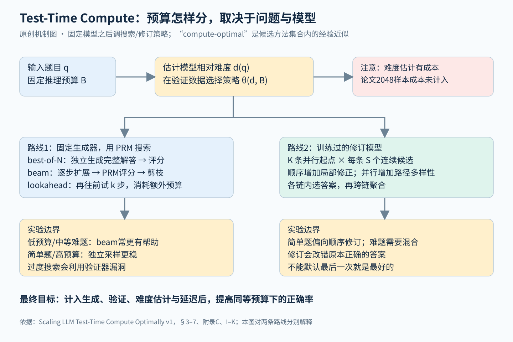

# 测试时计算预算 全文精读

论文：Charlie Snell等，Scaling LLM Test-Time Compute Optimally can be More Effective than Scaling Model Parameters。固定阅读 [arXiv v1](https://arxiv.org/abs/2408.03314v1)，[PDF全文](https://arxiv.org/pdf/2408.03314v1)，37页。覆盖正文§1–8、附录A–M，包括训练细节、负结果与图17–29的实际修订/搜索案例。它是推理预算分配的实验baseline，不是一篇新attention或新预训练架构论文。

## 先看结论

同样多的测试时计算，怎么使用比“再生成一点”更重要。论文比较两条路线：让验证器引导搜索，或训练模型在旧答案上继续修订；最合适的方法随模型所感知的题目难度和预算改变。所谓compute-optimal，是在有限候选策略里做难度条件选择的经验近似，既不是已解出的全局最优算法，也不等于所有问题都应该花更长思考时间。

图解：两条路线分别研究。左侧改变怎样筛选和扩展候选，右侧改变怎样产生下一个候选；难度估计本身有成本，不能从图上删掉这项开销。[SVG版](../../assets/baselines/architecture/test-time-compute-mechanism.svg)

## 1 两个旋钮与一个必要前提

设生成器给出候选分布p(y|q)。最朴素的best-of-N是独立生成N个完整解答，用一个评分器选最终答案。可以改的第一个旋钮是proposer：让后一次回答看见前几次尝试，生成分布随上下文改变；第二个是verifier：从只评价完整答案，变成评价部分前缀并指导逐步搜索。[§2]

一个教学推导有助于理解上限：若每次独立采样正确率为p，N个候选中至少有一个正确的概率是1−(1−p)^N。但这只是候选覆盖率，不是实际输出正确率，因为验证器可能选错；候选相关时，该公式也不再直接适用。增加N会同时带来找到正确答案的机会和遇到高分错误答案的机会，故最终曲线并不必然单调。

论文还有容易遗漏的前提：PaLM 2-S*（Codey）经过专门的验证或修订能力训练。它没有证明对任意现成模型加一句“再检查”就能获得同样收益。实验集中在MATH，使用12K训练题、500测试题；任务有相对明确的最终答案检查方式，不能直接外推到没有可验证结果的开放讨论。[§1脚注、§4]

## 2 “最优”问题怎样定义，又怎样近似

原文式(1)可写成：在题目q与预算B已给定时，选择策略参数θ，使诱导答案分布的正确率最高：

\[
\theta_q^*(B)=\arg\max_\theta\Pr_{y\sim Target(\theta,B,q)}[y=y^*(q)].
\]

θ可以是beam宽度、lookahead步数或顺序/并行比例。注意这里把每题预算作为输入，主要优化“预算怎么用”，不是直接解决所有问题之间“总预算如何跨题分配”的全局调度。

真值y*在真实部署未知，不能直接求上式。作者按基模型每题pass@1分成五个难度分位桶，再为每个桶和预算选最好的候选策略。难度是相对这个模型而言，不等于MATH人工难度标签；同一题换模型可能换桶。[§3.1–3.2]

oracle难度用2048次采样的真实正确率估计；predicted难度用同样2048个样本的平均验证器分数。后者不需要未知真值，却仍十分昂贵。作者明确没有把这项额外估计成本计入曲线。策略选择用桶内两折交叉验证，一折选策略、另一折测，再交换平均。因此“4倍效率”不能读成拿到新题、完整付清难度估计与服务成本之后仍省4倍。[§3.2、附录C]

## 3 PRM学的是后续成功概率

过程奖励模型PRM对每个解题步骤输出分数。这里的监督并非直接请人判断“这步是否严格正确”：作者从每个前缀运行Monte Carlo续写，用最终答案成功率作软标签。每题先取16个解答，每个步骤再做16次rollout，以二元交叉熵拟合这个0至1之间的目标。[§5.1、附录D]

因此分数更接近在当前生成策略下的reward-to-go，即“从这里继续还有多大机会成功”。它与数学局部正确性有关，却不相同：一个正确但很难继续的前缀可能得低分；后续生成策略变强或变弱，价值也可能变化。这个语义差别能解释后面的聚合消融。

为完整答案评分时，作者发现取最后一步PRM分数优于所有步骤分数的乘积或最小值。对于人类二元逐步标签，min可能是自然的错误检测规则；对于MC成功概率，把多个高度相关的值连乘并不自然。附录E、图13的结论有训练目标前提，不能宣称PRM永远应只看最后一步。

最终答案选择使用best-of-N weighted：把相同最终答案的各条解答分数相加，取总分最大的答案。用符号写为 argmax_a∑ᵢ1[answer(yᵢ)=a]v(yᵢ)。它结合了重复支持和验证分数，不等于简单挑单条最高分，也不等于不加权的多数投票。

## 4 三种搜索实际做了什么

best-of-N一次生成完整解答再筛选。beam搜索则先生成N个第一步候选，评分后保留N/M个，每个再扩展M个下一步，回到N个候选，循环至结束或最多40轮，再对最终答案聚合。这里沿用正文算法的N/M含义，避免把图示的简写当成另一套beam宽度定义。[§5.2]

lookahead在评估当前候选时，以温度0多向前试k步，把未来末端PRM值作为当前候选的分数。它更用力地优化同一个验证器，但也更费计算。论文将其生成预算近似记为N(k+1)，而beam和best-of-N按N计；这是便于比较的生成预算代理，不是精确的GPU秒或所有token算子账单。

图3中低预算beam优势较明显，预算增大后优势缩小甚至落后best-of-N；lookahead同预算下通常不占优。按难度拆分后，简单题继续搜索更容易利用PRM错误，中等难题更能受益于引导，最难桶各法进展都少。附录M给出低信息重复步骤、高分短解等实例，说明“验证器评分更高”与“答案更正确”会分离。[§5.3、图3–4]

这也是实验最重要的失败机制：搜索器并没有凭空获得真值，它只是在评分面上找极值。预算越大，越可能发现评分器的漏洞。不能把更深搜索直接当成更可靠验证；验证器分布外行为与校准应和生成器准确率一起测量。

## 5 修订模型不是随便把旧回答拼回去

修订训练先对每题独立采64个回答，再把错误回答放上下文、正确回答作训练目标。上下文随机包含0至4个错误答案，最后一个错误答案优先选与正确目标字符编辑距离近的版本，其他错误答案随机取。这样模型更可能学习局部修改，而不是完全忽略旧答案重新抽样。[§6.1、附录H]

推理时生成连续候选，保留最近四次回答作为上下文，即使训练只见过最多四个旧答案，也可持续修订。图6左侧显示后续候选的平均pass@1能提高，但不表示每条轨迹逐步变好：朴素使用下，约38%的正确答案会被改回错误答案。因此必须从候选历史中选最终回答，不能无条件取最后一次。

把总生成预算B分成K条并行链，每链S个连续候选，近似B=KS。并行提供不同起点，顺序提供局部修正；预算大时两者混合可能更好。图7–8显示简单题通常偏顺序，较难题需要适当比例。顺序更多也意味着更长关键路径，同样候选数不能保证同样用户等待时间。

修订分布与基模型分布不同，原PRM迁移过去不够好，作者因此为修订轨迹另训带历史的ORM。附录I的验证器聚合是先链内再链间，而多数投票把所有链的候选放一起投票。两种选择规则不应混写。附录J还显示历史上下文略有帮助，但修订收益并非完全由验证器多看历史解释。

## 6 4倍与14倍应该怎么读

图4在低预算区域用难度条件搜索，约16次生成可接近或超过best-of-N约64次的表现；图8修订路线给出64与256的对应比较。它们是某些曲线区间的效率改善，不是所有预算、难度或任务都稳定4倍，更不是4倍单次decode速度。硬件架构未在这个过程中被改变。

“能超过14倍大模型”来自§7的特定FLOPs账本。为免与生成预算混淆，令P为模型参数量、D_pre为训练token、D_inf为未来总生成token，近似训练成本6PD_pre，推理成本2PD_inf。若大模型参数乘M、训练数据量固定，则总成本乘M；小模型不重训，把节省的钱加到推理，可用的推理倍率为：

\[
F=M+3\frac{D_{pre}}{D_{inf}}(M-1).
\]

这是把6PD_pre+F·2PD_inf=M(6PD_pre+2PD_inf)移项的结果。当服务请求少，D_inf小，预训练节省能给每次推理留出很多预算；当大量请求反复调用同一模型，额外推理成本要持续支付，更大预训练模型可能更划算。

论文用约14倍参数的模型、三种推理/训练token比R≈0.16、0.79、22比较。图9在易题、中等题和较低推理负载下偏向测试时计算；最难题或高推理负载更可能偏向扩大预训练。这里比较的是固定训练数据量下增大参数，不是同时优化数据量和参数量的完整训练最优前沿，也不是固定墙钟或固定美元的生产评测。

## 7 附录里的反例与创新边界

附录K很值得读：作者再用ReST式流程训练修订模型，顺序修订反而明显变差。其解释是在线数据放大了伪相关，但原因尚未被单独证明。它提醒我们，模型在一次回答上更强，不自动意味着它擅长连续自我修正；训练分布里只放错误历史、实际推理却出现正确历史，也会造成分布偏移。

附录L的成功例子涉及算术、进制转换、格式和解题策略修正；图23展示第26与27次尝试之间的一次算术修正，显示“最终修好”与“高效修好”不是同一个目标。示例是定性展示，不能拿它代替500题总体统计。论文也没有联合验证“PRM树搜索加修订”的完整系统，或证明在医学、法律等高风险开放问题上更安全。

这篇的创新主要是把方法、题目相对难度和预算放在同一实验框架里，展示应当条件化比较，而不是宣称首次发明best-of-N、PRM或自我修订。它与本组架构论文正交：MLA或Mamba可降低一次生成的底层成本，测试时策略则决定要生成、验证和修订多少次；两类收益不能在没有联合测量时直接相乘。

## 8 最小复现应记录什么

固定同一个生成器与数据划分，分别绘制独立采样、beam和顺序/并行修订的预算曲线；保存每个候选的最终答案、分数、实际token数和延迟。困难度策略必须在独立折上选择，报告oracle与predicted两种结果，并把估计难度的代价单列。再同时报告候选含正确答案的覆盖率和最终选择准确率，便能分辨到底是生成不出，还是验证器选错。

若要落地，下一步应研究便宜的难度预测或边做边调度，并以总生成、验证、prefill和延迟成本核算。本段是由论文局限推出的工程建议，不冒充作者已经完成的部署方案。

## 阅读证据

[证据与覆盖记录](evidence/test-time-compute.json)给出版本、章节、附录和关键结果位置。本文仅发布原创图解与精读，没有重发原文或案例截图。

## 图解文件与证据索引

[SVG高清图](../../assets/baselines/architecture/test-time-compute-mechanism.svg) · [SVG可编辑图](../../assets/baselines/architecture/test-time-compute-mechanism.svg) · [结构化证据](evidence/test-time-compute.json)

来源类型：复用原目录 p001，保留原来源，不重复计数。
