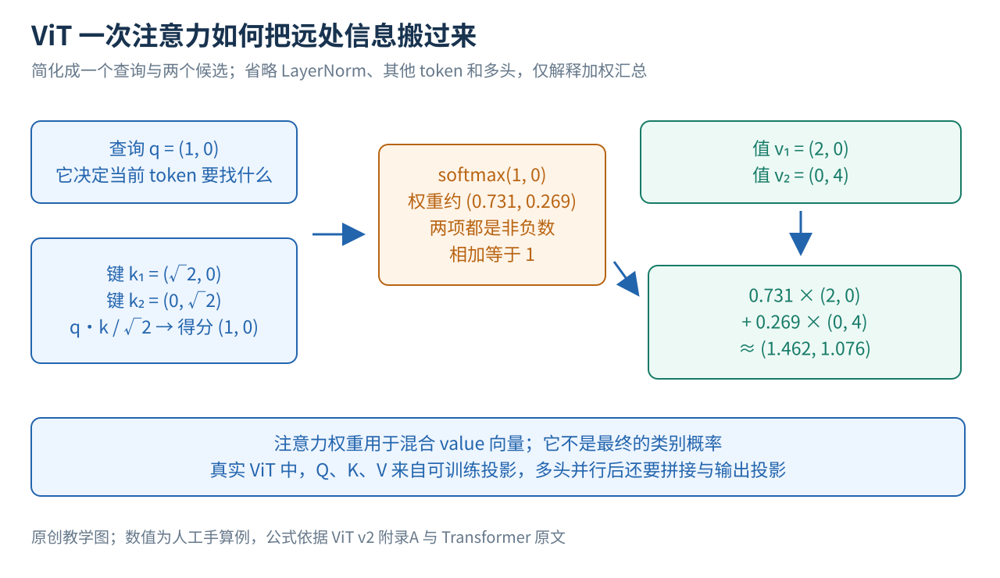
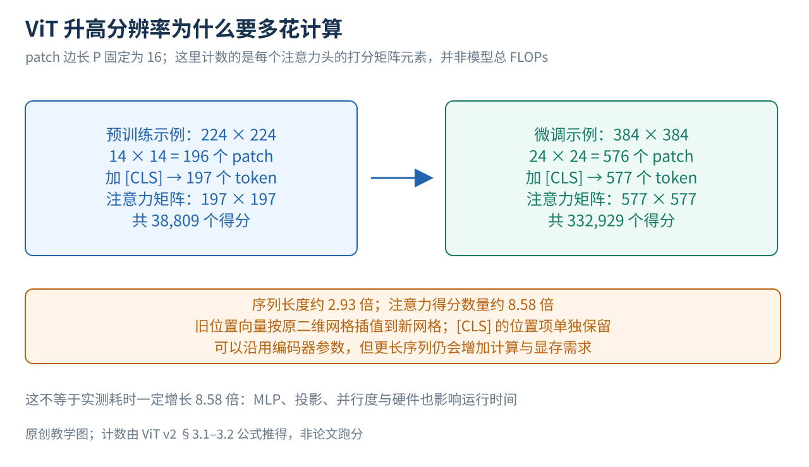

# ViT 精读 一张图片怎样变成序列并学会分类

给你一张狗的照片，你能利用耳朵、身体轮廓、毛色以及它们之间的关系判断“这是一只狗”。计算机最初拿到的却只是像素数字。要让它分类，需要一个可训练的过程，把像素变成有用的特征，再根据特征输出类别分数。

ViT 提供了一种非常清楚的做法：把图片切成小块，把每块变成一个向量，让这些小块通过 Transformer 交换信息，最后汇总整张图。它最值得研究的地方，不只是“图像也能用 Transformer”，还在于一个带条件的发现：在论文的训练配方下，这种视觉先验较少的模型需要较多数据；当预训练规模足够大时，它能得到很强的分类与迁移表现。

本文从像素、向量、分类这些起点讲起，再手算切块和一次注意力，沿着真实的预训练、迁移、推理流程读论文，最后逐项解释数据规模与消融证据。读完应能回答：16×16到底指什么，分类token在做什么，注意力权重是不是类别概率，为什么升高分辨率会增加计算，以及哪项实验真正支持“大数据对ViT很重要”。

论文为 Alexey Dosovitskiy 等人的 An Image is Worth 16x16 Words: Transformers for Image Recognition at Scale，ICLR 2021。本文固定依据 arXiv:2010.11929v2，22页版本。[1] 底稿阅读记录覆盖正文pp1–9、附录A–D pp13–22；本次改写定向复核机制、关键实验和版本数字。论文参考文献不等于我们逐篇读过的原文；本文没有训练复现，人工算例不是论文实测结果。正文编号资料统一列在文末。

## 一 先分清图片 分类器与骨干网络

### 1 图片对模型来说是一堆怎样的数

一张普通彩色图片通常可以表示为 H×W×C 个数：H 是高度，W 是宽度，C 是颜色通道数，RGB图片的 C = 3，分别表示红、绿、蓝。224×224的彩色图片就有224×224×3 = 150,528个原始数值。模型需要从它们中提取能区分任务类别的信息，而不是简单地记住每个像素位置的颜色。

特征或表示，是网络加工后得到的一组数。比如把整张图片变成768维向量，就等于用768个内部数值表示这张图。它们不是一份人工规定的“第一维是狗，第二维是猫”的清单；一项视觉属性可以分散在很多维里，多种属性也可能共享表示。

分类头是把这些特征映射成类别分数的最后一小段网络。例如任务有猫、狗、汽车三个类别，它就输出三个数。训练时使用正确标签衡量输出是否合适，再据此更新网络。推理时只输入新图片，不需要真实标签。

### 2 为什么要把骨干与学习目标分开

“骨干网络”负责把像素加工成表示；“学习目标”规定训练过程中什么输出算好。相同骨干可以接受不同学习信号，比如人工类别标签、遮掉部分图像后的预测任务，或图片与文字的配对关系。

ViT 首先是一种骨干架构。原论文的主实验采用有标签分类预训练，以便回答“这个架构在什么数据与预算条件下有效”。因此，不能把 ViT 理解成一种只能用人工标签训练的算法，也不能把后来使用 ViT 的各种自监督方法视为同一篇论文的结果。[1]（§3–4）

### 3 卷积提供了哪些预先写进模型的经验

ViT 之前，卷积神经网络CNN已经是重要的视觉骨干。可以把卷积先理解为：用同一套小滤镜扫描图片各个位置，每次优先处理附近的像素。这会把两条经验直接写进结构：附近像素通常有关联，同一个局部图案移动到别处时仍值得用相同方式识别。

这些预先加入的偏好叫“归纳偏置”。偏置在这里不是道德意义上的偏见，而是模型对可能规律的预设。局部性强调先看邻近范围；平移等变性大致指输入移动后，对应特征也随之移动。边界、下采样等细节会影响严格性质，但这些结构总体上让CNN更容易复用局部视觉模式。

ViT 的全局注意力没有要求每层都只看相邻块，它可以更自由地学习远近关系。但少写一些视觉规律，不等于这些规律不重要，而是把学习它们的工作更多交给数据。论文后面的数据规模实验，正是在检验这个代价与机会。[1]（§3.1、§4.3）

## 二 一图看完 ViT 的完整路径

图1沿用既有原创机制图，根据原文§3.1–3.2、式1–8和附录训练说明重绘，并非论文原图。蓝线是计算结果向前传递，橙色虚线表示训练时损失对参数产生的更新信号，底部把三个阶段分开。

上半部分先看四件事。第一，图片切块，每块展平成一排数。第二，同一个线性投影把各块变成等长向量。第三，加入一个负责汇总的分类token和表示位置的向量。第四，整条序列穿过多层Transformer，最后取出分类token的结果送入分类头。

“token”在这里不是一个汉字，也不是一个单词，而是序列中的一个处理单位。图像里的大部分token对应一个patch，也就是一小块像素；额外的 [CLS] token不对应任何一块原始像素。图中的 D 是每个token的特征宽度，N 是patch数，L 是编码器层数，K 是当前任务类别数。

底部的预训练、微调、推理不是三种不同图片格式。预训练先在大数据上学习参数，微调利用目标任务的数据继续调整参数，推理则把训练好的网络用于新图片。后面会解释为什么迁移时需要换分类头，以及为什么分辨率变化还会牵涉位置编码。

## 三 从二维像素走到一维序列

### 1 16×16指一小块的尺寸

标题里的16×16是常用patch的像素边长，不是“每张图片固定分成16×16个token”。假设图片尺寸可被patch边长P整除，横向有 W/P 块，纵向有 H/P 块，所以：

N = (H/P) × (W/P) = HW/P²。

这里 P 是一个方形patch的边长，N 是patch总数。对于224×224图片、P = 16，横纵各有14块，总数是14×14 = 196。额外加一个分类token后，Transformer接收197个token。[1]（§3.1）

每个patch含 P²C 个像素数。在这个例子里是16×16×3 = 768。展平就是保留这些数的对应顺序，把原来的小方块排成一个768维向量；它没有自动提取语义，也不是把768个数平均成一个数。

图2先用4×4单通道小图片解释顺序。左上角2×2块包含1、2、5、6，展平后是一行；右上角块则包含3、4、7、8。分块改变的是处理单位，不是任意打乱像素。实际图片当然不是这16个整数，这里只是为了让你能看清每个数字去了哪里。

### 2 一个共享线性投影怎样处理所有块

展平后的像素数还需要变成模型想使用的特征宽度D。论文使用可训练矩阵 E，形状为 (P²C)×D。每个patch的向量都乘同一个 E，输出D个数，称为patch embedding，即patch的向量表示。[1]（§3.1、式1）

“共享”十分重要：不是左上角有一个专用投影，右下角又有一个专用投影。所有位置复用相同规则，位置信息稍后单独加入。这也意味着，即使某个局部图案出现在不同位置，最初的投影仍以相同方式加工其像素。

再做一个小算例。让一个patch为 x = (1, 2, 5, 6)，希望投影到D = 2。假设 E 的四行依次是 (1, 0)、(0, 1)、(1, 0)、(0, 1)，则 xE = (1 + 5, 2 + 6) = (6, 8)。这是对输入做两种不同的加权组合。真实模型的 E 会从数据中学习，并不预设成这个矩阵。

ViT-B/16恰好把一个768维像素块映射到768维特征，但输入维度与特征宽度是两个独立概念。相等不意味着它只是原样复制；768×768矩阵仍会混合数值。换成不同patch大小或模型宽度时，这两个数也不必相等。

### 3 为什么还要加位置向量

假如我们把图片左边与右边的patch交换，模型通常应该能区分这个变化。单靠全局自注意力，不会自动知道序列里的某一块原来位于左上角。ViT 为每个序列位置准备一个可学习的D维向量，并把它加到该位置的patch表示上。[1]（§3.1）

延续刚才的例子，若这一位置向量是 (0.1, −0.1)，原来的 (6, 8) 就变成 (6.1, 7.9)。加法让内容与位置信息共同进入后续网络；它不是把位置编号写进某个固定维度，也不是输入了现成的二维邻接表。位置向量在训练中学习，同一位置的向量在不同图片之间复用。

论文默认使用一维可学习位置编码。按固定顺序读入的patch实际上来自二维网格，模型需要通过数据学会其中的空间关系。后面的消融会告诉我们：在被测条件下，提供位置信息有用，但更复杂的二维方案并没有明显胜过这种简单做法。

### 4 分类token从哪里来

在patch序列前再放一个可学习的D维向量，通常写作 [CLS] 或原文的 [class]。它像一个可训练的汇总位置：开始时没有一块专属图片内容，之后可通过注意力从其他token获取信息。最终只取它的输出，形成整图表示。[1]（§3.1）

它不是把正确标签“狗”提前塞进输入，也不天然知道什么区域最重要。训练时它收到整图分类损失的影响，才逐渐学会聚合对任务有用的信息。如果背景也能帮助降低训练损失，它同样可能利用背景，因此不能把 [CLS] 直接解释成可靠的物体定位器。

写成一个式子，输入序列为：

z₀ = [xclass；x₁E；x₂E；…；xNE] + Epos。

z₀ 是进入第一层之前的整个序列；xclass 是可学习分类向量；xᵢ 是第i个展平patch；E 是共享投影；分号表示把向量按序排成多行；Epos 是所有位置向量组成的矩阵。共有N + 1行，每行D个数，所以形状为 (N + 1)×D。这就是图片进入标准Transformer前完成的全部主要转换。[1]（式1）

## 四 Transformer怎样让图片各部分交换信息

### 1 先从一个token向其他token提问讲起

如果一个patch只包含狗耳朵的一部分，仅看这块可能分不清它是耳朵、叶片还是衣角。其他位置的身体轮廓可以帮助解释它。自注意力提供一种数据驱动的汇总方式：让当前token根据内容为其他token分配权重，再按这些权重取回信息。

每个token经三组可训练线性变换产生 Query、Key、Value，简称Q、K、V。可以暂时把query理解成“当前要寻找什么信息”，key理解成“这个候选能否匹配这种需求”，value理解成“实际取回并混合的内容”。这个类比帮助理解分工，但它们实际都是数值向量，不是人写出来的问题和答案。

把某个query与所有key点积，便得到一排匹配分数；除以 √dₕ，再做softmax，得到权重。dₕ是这一注意力头中query/key的维度，平方根缩放用于控制点积的尺度。随后用权重对value做加权求和。矩阵形式为：

A = softmax(QKᵀ / √dₕ)，输出 = AV。

Q和K的每一行对应一个token，Kᵀ使我们能一次计算所有token配对。A的每一行是在候选token上归一化的权重，行内相加等于1。V储存被汇总的内容。这是跨位置传递信息的步骤；这些权重不是“猫、狗、汽车”的分类概率。[1]（附录A，式5–7）

### 2 手算一次注意力汇总

图3只保留一个query和两个候选，以便手算。设 dₕ = 2，q = (1, 0)，k₁ = (√2, 0)，k₂ = (0, √2)。先做点积，再除以√2，得到两个分数1和0。

对 (1, 0) 做softmax，第一个权重为 e¹/(e¹ + e⁰) ≈ 0.731，第二个约为0.269。这里 e 是自然对数的底数，指数变换使分数变成正数，分母使权重归一化。

再令 v₁ = (2, 0)，v₂ = (0, 4)，汇总结果就是：

0.731 × (2, 0) + 0.269 × (0, 4) ≈ (1.462, 1.076)。

注意，我们用key来决定权重，却混合value；不是把key本身直接当成最终内容。这个输出已经同时包含两个候选的信息，而且来自候选一的权重更大。图中的向量与数字都是人工设定，省略了真实ViT里的其余token、归一化、残差、多头与输出投影，不应当成完整网络的一层复现。

### 3 多头为什么不是把同一计算重复几遍

一个匹配规则未必足以同时处理局部边缘、形状和远距离关系。多头注意力让不同可训练投影并行进行多组Q、K、V计算，再把各头的输出拼接并投影回D维。因此各头有机会学习不同的关系；但不能事先保证某个头专门负责颜色或某种物体。[1]（附录A，式8）

ViT-B的D = 768、头数12，常用的每头宽度就是768/12 = 64。每个头都可以查看整条序列，区别在于使用不同的可训练投影。头与头不是把图片切成互不交流的12块区域。

### 4 一个完整Transformer块还有什么

ViT采用先归一化的结构，通常称Pre-LN。每个块先对输入做LayerNorm，再经过多头注意力，最后把结果加回原输入；然后再做一次LayerNorm，经过MLP，再加一次残差。[1]（§3.1、式2–3）

LayerNorm对每个token内部的数值做归一化与可训练调整，有助于控制计算尺度。残差连接就是“原表示 + 新算出的改变量”，让网络可以在保留旧信息的基础上逐步修正。它不是把损失加到特征里，也不是另一种注意力。

MLP是逐token使用的两层全连接网络，中间有GELU非线性。对ViT-B而言，内部宽度为3072，再投影回768。这段网络对每个位置使用同一组参数，主要加工每个token自身的特征；跨token的信息交换发生在前面的注意力里。经过整个块，序列仍有N + 1个token，每个仍是D维，变化的是其中储存的信息。[1]（§3.1、表1）

把这样的块堆叠L次，低层处理过的信息继续被高层组合。最后取分类token的表示并做LayerNorm，得到整张图的D维特征。ViT-B、ViT-L、ViT-H分别有12、24、32层，宽度分别为768、1024、1280；B、L、H表示模型规模，后面的“/16”“/14”表示patch边长。[1]（表1）

## 五 从分类分数到参数学习

### 1 用一个三分类例子看清训练信号

假设最后的整图特征送入分类头，得到“猫、狗、汽车”三个分数 (2, 1, 0)。先考虑每张图只有一个正确类别的教学情形。softmax把它们转换为约 (0.665, 0.245, 0.090)。如果真实类别是猫，交叉熵损失为 −ln(0.665) ≈ 0.408；如果真实类别是狗，则损失为 −ln(0.245) ≈ 1.408。

同一组预测，在不同真实标签下会受到不同惩罚。训练程序计算损失对各参数的梯度，再用优化器更新分类头、Transformer、patch投影、分类token和位置向量。于是，虽然监督只在整张图的类别上出现，前面的各层也会收到更新信号。

这个三分类算例只为解释单标签任务的学习过程。它不是宣称论文所有预训练数据都只有单一标签，或者JFT的标签处理可以不加区别地照搬这组softmax计算。复现时应按具体数据与训练实现核对标签和损失约定。

### 2 预训练不是只训练最后一层

原论文的主要预训练是端到端有监督学习。分类头在预训练时是带一个隐藏层的MLP，编码器内部的MLP则是Transformer块里的另一部分，两者不要混淆。预训练期间，不只是分类头，整条图像路径的可训练参数都参与学习。[1]（§3.1、附录D.3）

所谓“表征学习”，并不是另一个神秘流程。因为分类头必须依靠前面的特征完成任务，训练会推动前面的网络学出对这些类别有用的表示。之后换到相关任务时，有些已经学到的形状、纹理或结构信息可能仍然有用，这就是迁移的基础。

## 六 论文实际上怎样预训练和迁移

### 1 三种数据规模分别在检验什么

论文比较ImageNet-1k约130万张图、ImageNet-21k约1400万张图、JFT约3.03亿张图。三者不是简单复制同一个数据集，而是类别范围、来源与标签条件均不完全相同。作者按下游测试集进行预训练数据去重，以降低直接重叠的影响。[1]（§4.1）

因此，从ImageNet切到JFT时的差异不能全都归因于“多看了多少张图”。论文还从同一JFT中抽不同大小子集，以更直接地研究数量变化。把跨数据集实验与同源子集实验配合着读，证据会比只看主表完整。

### 2 一轮真实预训练怎样展开

模型在224分辨率进行预训练，抽取一批图像和标签，依次完成切块、投影、位置编码、Transformer、分类头及损失计算，然后反向更新。所有比较架构，包括ResNet，在相应主设置中都使用Adam，批量4096；学习率先经过10,000步warmup，再按设定衰减。[1]（§4.1、附录B、表3）

warmup可以理解为训练初期先逐步增大更新步幅，避免一开始就进行过大的参数变化。一个epoch表示遍历一轮数据，很多次批次更新共同构成一个epoch，所以同样7个epoch，在不同大小数据集上意味着不同数量的更新。

配方不能只记一行。JFT主要设置的权重衰减为0.1，学习率线性衰减；ImageNet-21k和ImageNet的训练时长、学习率、权重衰减、dropout均有不同。表3中ImageNet训练甚至使用余弦学习率衰减。dropout在训练时随机屏蔽部分中间数值，权重衰减限制参数增长，二者都可缓和过拟合。论文在小数据条件下特别调整这些正则化设置，说明“数据越少越差”并不是完全不做调参后的随意比较。[1]（§4.3、表3）

### 3 迁移时为何要换头

假设预训练分类头对应上千或上万类别，而目标任务只需要分猫、狗、汽车，旧头的输出维度和类别含义都不合适。论文丢弃整个预训练头，接上一个零初始化的D×K线性层，K为新任务的类别数。随后用目标任务的标签微调网络，而不是永远固定编码器。[1]（§3.2、附录B.1.1）

零初始化这里指新的分类层，不能理解成把预训练好的Transformer也清零。微调通常采用SGD、动量0.9、批量512、余弦学习率衰减且无权重衰减。SGD依据当前梯度更新，动量让连续更新具有一定方向记忆；具体学习率通过目标任务训练数据划出的开发集选择。[1]（附录B.1.1、表4）

### 4 为什么微调可以用更大的图片

论文通常把微调分辨率提高到384，同时保持patch边长不变。这样图片能保留更细的视觉内容，但patch数量会增加。编码器里的线性变换仍处理D维向量，因此大部分参数不需要因序列变长而重建；有问题的是原先按固定网格学习的位置向量。[1]（§3.2）

图4继续固定P = 16。224输入对应196块，加分类token为197；384输入对应24×24 = 576块，加分类token为577。位置向量先按原图片的二维网格排列，再通过二维插值获得更密的新网格；分类token对应的位置项单独处理。插值可以先理解为根据旧网格中的邻近数值估计新位置的数值，而不是重新随机生成全部位置编码。

序列变长却不是免费的。一个注意力头需要对所有token两两打分：197² = 38,809个分数，577² = 332,929个分数，约增加到8.58倍。这只是注意力分数矩阵的元素数量，不等于整模型运行时间一定增加8.58倍。线性投影、MLP、硬件并行和内存操作也会影响真实成本。

论文表2的最高ImageNet结果使用了进一步的设置：ViT-L/16以512分辨率微调，ViT-H/14以518微调，并使用权重平均。权重平均会综合训练过程中多个时刻的参数，因此这些结果不能与标准384分辨率的表5数字视为同一条件。[1]（§4.1、表2、表5）

### 5 实际使用时哪些步骤不再发生

推理时，输入新图片，按既定预处理和分辨率切块，通过固定参数的编码器与分类头得到分数，选取类别即可。没有真实标签，也不计算用于更新参数的训练损失。

这个分类头认识的是训练过的K个类别。仅把某个类别名称改写成“潜水艇”，不会自动让它识别潜水艇。ViT本身没有把自然语言名称映射成分类权重的文本塔；CLIP才在另一个层面提供了这种图文接口。[9]

## 七 读结果前先区分两种评价协议

“全量微调”使用目标任务训练标签更新模型，报告适配完成后的测试准确率。它回答的是：有机会使用目标任务数据调整系统后，这个预训练模型能做到多好。

“少样本线性评估”则冻结表示，每类只取少量有标签样本训练一个简单分类器。ViT论文使用正则化最小二乘回归求解该分类器；正则化控制参数规模，最小二乘让输出尽量接近目标类别编码。这种方案计算较快，适合在训练过程中频繁比较模型和数据规模。[1]（§4.1）

因此，ImageNet 5-shot linear不是“只用5张图把整个ViT从头训练出来”，也不是表2的主结果。5-shot指每类的标签样本数，而图像编码器此前已经经历大规模预训练。读消融时尤其要记住这一点，因为表8的位置编码和图9的分类token实验，都使用这条较轻量的评估路线。

## 八 关键实验究竟支持了哪些结论

### 1 表2证明大规模ViT是有竞争力的完整系统

表2的ImageNet结果中，JFT预训练的ViT-H/14为88.55±0.04%，ViT-L/16为87.76±0.03%，BiT-L为87.54±0.02%。其中±报告三次微调结果的标准差，不是三个全新预训练过程的波动。预训练成本分别约2500、680、9900 TPUv3-core-days。[1]（表2，p6）

TPUv3-core-days把设备数量与训练天数相乘。比如更多核心用更短时间，乘积仍可相同；它是特定硬件上的资源度量，不能直接当成某张普通GPU的天数。这组数字说明旗舰ViT系统以较低报告预训练成本达到了很强结果，但优化器、训练时长及其他设置也不同，所以不能仅凭成本比值宣布“架构本身固定节省某个百分比”。

逐项读表还能避免一句概括掩盖细节：ViT-L/16在VTAB上为76.28±0.46，BiT-L为76.29±1.70；ImageNet ReaL二者也同为90.54。因而，不宜写“ViT-L/16严格击败了所有任务的CNN”。更稳妥的结论是，旗舰ViT结果在这组主要基准上总体达到或超过强CNN基线，具体项目仍需分别比较。[1]（表2）

### 2 表5说明更大模型不一定在更少数据上更好

先固定看表5的ImageNet测试列：只用ImageNet预训练时，B/16为77.91%，更大的L/16反而为76.53%；使用JFT预训练后，B/16为84.15%，L/16为87.12%。这形成了一条清楚的证据链：在论文所用配方下，更大容量需要足够数据，才能把潜力转化成更高迁移准确率。[1]（§4.3、图3、表5）

表5统一采用384分辨率微调，并未加入主表最高成绩使用的额外高分辨率与权重平均。所以同一H/14在表5是88.04%，而表2是88.55%。这不是小数误差，而是评估设置不同。另一个需要原样保留的版本细节是：该版本表6的H/14为88.08%，与表5的88.04%略有差异；不能擅自把原文两个表“统一修正”为一个数字。

这些结果没有证明ViT永远无法在ImageNet规模工作，也不约束后来改变数据增强、蒸馏或训练配方的方法。历史论文的条件性结论，需要留在其当时的实验范围内。

### 3 图4用同一个数据来源更直接检验规模

如果只比较ImageNet和JFT，数据量与数据类型一起变了。图4因此从JFT抽取约9M、30M、90M样本，并与完整数据训练比较。在这一组中，作者保持主要超参数一致，不为每个小子集额外重新调正则化，但采用早停，报告训练过程中最佳验证表现；下游使用5-shot线性评估。[1]（§4.3、图4，p7）

早停就是当继续训练不再改善验证表现时选取较合适的时点。这让我们不能把图4理解为所有模型都在相同步数无条件跑到最后。尽管有这些协议限定，曲线仍支持一个重要观察：小子集上ResNet更有优势，而在更大子集上ViT表现更好。它比简单跨两个数据集比较，更直接支持“视觉先验在数据较少时有帮助”。

### 4 图5比较计算预算 而不是只比较参数量

同样参数量的模型可能处理不同数量的token，训练时长也可能不同，所以“参数更多”不能直接替代“计算更多”。§4.4在JFT上比较ResNet、纯ViT及混合模型的性能与预训练计算曲线。混合模型先用CNN产生特征图，再将其转成序列交给Transformer。[1]（§3.1、§4.4）

在论文覆盖的范围里，作者报告ViT达到相似的五任务平均表现，所需预训练计算约比ResNet少2–4倍；小预算下混合模型略占优势，预算增大后与纯ViT的差距减小。这个结论来自扩展实验与曲线，而不是把表2两个硬件天数直接相除。[1]（图5、表6）

这也不是一条保证无限规模都成立的定律。它说明标准Transformer在这些条件下兼具可扩展性和效率，研究时仍需要固定数据、训练次数、输入分辨率与迁移协议。

### 5 表8告诉我们位置有用 复杂位置方案未必更好

位置编码消融使用ViT-B/16，在ImageNet 5-shot linear上评估。为便于阅读，将原表的小数写成百分比：无位置编码为61.382%，默认一维位置编码为64.206%，二维为64.001%，相对位置为64.032%。[1]（附录D.4、表8，p17）

无位置编码时，模型仍能利用每个patch内部的纹理和内容，所以不是完全无法分类；但跨patch的显式位置线索丢失，结果下降。加入简单位置编码后有明显改善，而更复杂方案与默认方案的差距很小。

这项消融支持“此设置中，位置信息有帮助，简单一维方案已经足够有竞争力”。它没有证明空间结构对视觉不重要，也没有证明其他分辨率、任务或训练条件下二维设计一定没用。

### 6 图9提醒我们不要把调参失败当成结构失败

作者曾尝试不用分类token，改成对所有patch输出做全局平均池化，也就是逐维求平均，再接分类头。最初表现很差，看上去似乎证明 [CLS] 是关键。后来发现，平均池化需要不同学习率：图9中分类token使用8×10⁻⁴，平均池化沿用此值较差，改为3×10⁻⁴后便得到相近曲线。[1]（附录D.3、图9，pp16–17）

这里比较的仍是ImageNet 5-shot线性评估，不能升级成“任何任务中两种汇总方式都完全等价”。真正有用的研究教训是：替换一个组件后，若某些超参数与该组件强相关，必须给替代方案合理的调参机会，再判断机制优劣。

## 九 附录如何补足主结论

### 1 更深 更宽 更小patch不是同一种扩大模型

附录D.2分别增加深度、表示宽度、MLP宽度，并调整patch大小。更深的网络带来更多连续加工步骤，更宽的网络给每个token更多表示维度，更小patch则把同一图片切成更长序列。它们增加能力与成本的方式并不相同。[1]（附录D.2、图8）

尤其是减小patch边长：Transformer主干的大部分参数不必增加，输入投影参数还会随像素块维度改变，但token数量会上升，从而提高注意力计算。因此，只比较参数量容易忽略重要差异。论文观察到深度与更长序列在相关扩展实验中带来收益，但这不等于每个维度都可以无限增大。

附录D.5进一步给出真实TPUv3吞吐和可容纳批量，D.6讨论轴向注意力的速度表现。轴向注意力把空间交互拆到不同轴上，理论计算可能更省，朴素实现却不一定跑得更快。这再次说明，FLOPs是算法计算量估计，运行时间还受内存、并行和算子实现影响。[1]（附录D.5–D.6）

### 2 原文已经试过早期遮挡预测 但不是后来的MAE

论文还做了一个初步自监督实验：选中50%的patch embedding进行破坏。在被选中部分里，80%换成可学习mask向量，10%换成随机其他patch，10%保持不变；然后根据对应位置的表示预测patch的离散平均颜色。[1]（§4.6、附录B.1.2）

以100块作示意，就是约50块被选中，其中约40块变mask、5块换随机patch、5块维持原样，但选中的位置仍承担预测任务。留下部分原样输入是这个训练配方的一部分，不能把它误读成作者忘了遮挡。这个计数只是按比例解释，不是论文实际固定使用100个patch。

ViT-B/16在这一预训练后得到79.9%的ImageNet准确率，较从头训练约高2个百分点，但比相应大规模有标签预训练低约4点。它证明“ViT能接受不依赖类别标签的学习目标”具有潜力；它不是主表88.55%的训练路线。[1]（§4.6）

后来MAE采用高比例遮挡，并让计算量较大的编码器只处理可见patch、配合轻量解码器重建像素，目标与计算路径都有变化。因此，不能因为两者都提到masked patch，就说ViT附录已经完整提出了同一个MAE算法。[7] 这里比较的是机制层级，没有把后来的成绩计入ViT原论文。

### 3 注意力热图展示了什么

原论文可视化了位置向量相似度、注意力距离和图像区域响应。某些早期层的头偏局部，另一些已经能进行较远距离的信息整合；位置向量也学出与空间位置有关的结构。[1]（§4.5、图7、附录D.7）

图6与图14采用Attention Rollout，组合多层的注意力关系来观察整图汇总路径。它不是单独取最后一层某个头的权重，也不应与其他论文看起来相似、定义却不同的热图直接当成同一种测量。[1]（附录D.8）

热图集中到主体区域，可以帮助观察模型行为，但并不构成“这些像素是预测的唯一原因”的因果证明，更不是带有像素级真值评价的分割结果。网络还有残差、MLP等路径，漂亮的注意力图不能替代任务实验。

## 十 ViT的历史位置并不是第一次把注意力用于图像

标准Transformer来自机器翻译中的序列建模，多头自注意力公式也不是ViT发明的。ViT的重要选择，是尽量直接复用这种标准编码器，而不是为视觉任务设计复杂的专用注意力结构。[1]（§2）[2]

分类token与预训练后迁移的设计还与BERT等语言模型有关。这里要区别：原始机器翻译Transformer提供基础架构，BERT式分类汇总是更直接的 [CLS] 相关来源；不能把所有设计笼统归到同一篇Transformer论文里。[1]（§3.1）[3]

Cordonnier、Loukas与Jaggi在ICLR 2020的工作已经研究自注意力与卷积的关系，并采用类似小块输入与全局注意力路线。ViT自己的相关工作明确称它为最接近的前作。区别在于，前作使用很小的2×2块并在较小分辨率条件下研究，而ViT进一步用更大patch、大规模预训练及迁移实验，证明标准Transformer能够处理更现实的图像分类规模。[1]（§2）[4]

数据规模这条线同样有前史。Sun等人在2017年研究JFT-300M上的CNN规模与迁移表现；BiT则系统研究大规模监督预训练后迁移的ResNet。JFT不是ViT新提出的数据集，ViT核心比较中的CNN也不是未经优化的弱基线：它采用BiT相关的GroupNorm和Weight Standardization配置，分别按组归一化特征和标准化卷积权重。[1]（§2、§4.1）[5][6]

因此，ViT的贡献更准确地说，是把“图片作为patch序列，交给尽量标准的Transformer”这条路线，通过大数据、计算预算和多任务迁移实验证成一个强视觉骨干选择。它不是第一次使用图像注意力，也不是只凭一张结构图就证明Transformer天然胜过卷积。

本节核验的是前作与ViT的关系及相关方法段落，不声称已逐篇完成这些前作的全文精读。

## 十一 哪些情况下这个基线有用 哪些问题还没解决

### 1 最强结果的数据条件不容易复制

论文最强设置依赖非公开JFT。公开模型权重可以帮助复用表示，却不能使外部研究者完整重建同一数据条件。若你的数据少、领域差别大，不能把主表的成绩直接当成项目预期。原文自己的规模实验已经显示，模型容量、数据量和训练配方必须配合。[1]（§4.3）

### 2 全局交互并不等于免费高分辨率

细小病灶、文字和密集物体可能需要更高分辨率或更细patch，但两者都可能增加序列长度。前面197到577的例子展示了注意力分数的平方增长。实际系统需要权衡输入细节、显存、吞吐和任务效果，而不只是选择参数更多的型号。

### 3 分类骨干不自动等于检测或分割系统

原论文重点验证图像分类与迁移。分类输出告诉你整张图属于哪个类别；检测还要回答目标在哪里，分割还要给每个像素分配类别。ViT的序列特征可以成为这些系统的部件，但要配合新的头、训练协议与评价，不能把原分类实验直接扩展成已经解决所有视觉任务。[1]（§5）

### 4 后续方向应按改变了哪一层来理解

如果保持ViT骨干而换成MAE的重建目标，研究的是自监督学习信号；换成DINO的教师学生自蒸馏，即用教师网络提供的目标训练学生网络，研究的又是另一类不直接依靠人工类别标签的表示学习约束。[7][8] 如果把ViT作为CLIP图像塔，再与文本塔对齐，新增的是自然语言任务接口。[9]

这些方法可以共享patch与Transformer计算，但数据、损失和使用方式不同。比较它们时，应尽量对齐骨干大小、预训练数据、分辨率、训练步数与下游协议，再问某种目标是否真正带来改善。否则“某方法胜过某方法”可能只是在比较两套不同资源的系统。

## 十二 回到最初那张狗的照片

现在可以把整条路径连起来：像素先按固定大小切块，每块通过共享投影成为向量，加上位置与分类token后进入Transformer；注意力从不同位置汇集信息，MLP加工每个位置的特征，多层处理后由分类token交出整图表示。训练标签通过分类损失改变整个网络，迁移时换成新类别的分类头，推理时则只执行前向计算。

再回头看论文的标题，“一张图相当于16×16的词”不是说图片天然就是语言，而是提出一种统一的计算接口：只要先把图像变成适当的序列，就能借用成熟的序列架构。论文的证据同时提醒我们，这种简洁性把更多学习空间关系的工作交给了数据，数据规模和训练条件始终是结论的一部分。

若要自检是否真正读懂，试着不翻正文解释三件事：224图片与384图片为什么分别是197和577个token；表2的88.55%为什么不能和表5的88.04%当成同设置结果；分类token消融为什么说明调参公平性，而不是证明所有汇总方法完全相同。能解释这三点，就已经跨过了“只记模型名与跑分”的阶段。

## 十三 参考资料与图解文件

[1] Dosovitskiy et al. An Image is Worth 16x16 Words: Transformers for Image Recognition at Scale. ICLR 2021，arXiv:2010.11929v2。[固定版本原文](https://arxiv.org/pdf/2010.11929v2)。底稿记录：正文pp1–9、附录A–D pp13–22；本次核查关键机制、表2/3/5/6/8、图4/5/9及相关局限。本文所有ViT实验值均来自该版本，未训练复现。

[2] Vaswani et al. Attention Is All You Need. 2017。标准Transformer与多头注意力来源。[论文原文](https://arxiv.org/abs/1706.03762)

[3] Devlin et al. BERT Pre-training of Deep Bidirectional Transformers for Language Understanding. 2018。用于核对分类token及预训练迁移背景。[论文原文](https://arxiv.org/abs/1810.04805)

[4] Cordonnier, Loukas and Jaggi. On the Relationship between Self-Attention and Convolutional Layers. ICLR 2020。ViT所述最相关patch与全局注意力前作。[固定版本入口](https://arxiv.org/abs/1911.03584v2)

[5] Kolesnikov et al. Big Transfer BiT General Visual Representation Learning. ECCV 2020。大规模监督视觉迁移前作与CNN对照。[固定版本入口](https://arxiv.org/abs/1912.11370v3)

[6] Sun et al. Revisiting Unreasonable Effectiveness of Data in Deep Learning Era. ICCV 2017。JFT数据规模路线的历史来源。[论文原文](https://arxiv.org/abs/1707.02968)

[7] He et al. Masked Autoencoders Are Scalable Vision Learners. 2021预印本，CVPR 2022。这里只用于区分后续MAE的目标与编码器路径。[论文原文](https://arxiv.org/abs/2111.06377)

[8] Caron et al. Emerging Properties in Self-Supervised Vision Transformers. ICCV 2021。这里只用于定位DINO自蒸馏方向，不把其结果算入ViT原论文。[论文原文](https://arxiv.org/abs/2104.14294)

[9] Radford et al. Learning Transferable Visual Models From Natural Language Supervision. 2021。用于区分ViT视觉骨干与CLIP图文接口。[固定版本原文](https://arxiv.org/pdf/2103.00020v1)

图1： [图示总览图](../../assets/baselines/visual/vit-beginner-20261002.svg) · [SVG可编辑图](../../assets/baselines/visual/vit-beginner-20261002.svg)

图2： [图示切块图](../../assets/baselines/visual/vit-patches-lesson-beginner-20261002.svg) · [SVG可编辑图](../../assets/baselines/visual/vit-patches-lesson-beginner-20261002.svg)

图3： [图示注意力手算图](../../assets/baselines/visual/vit-attention-lesson-beginner-20261002.svg) · [SVG可编辑图](../../assets/baselines/visual/vit-attention-lesson-beginner-20261002.svg)

图4： [图示分辨率与计算图](../../assets/baselines/visual/vit-resolution-lesson-beginner-20261002.svg) · [SVG可编辑图](../../assets/baselines/visual/vit-resolution-lesson-beginner-20261002.svg)

[原精读结构化证据](evidence/vit.json) · [本次教学改写核验记录](evidence/vit.beginner-revision.json)

来源类型：视觉骨干细分方向的代表性baseline。全部教学手算和分解图均为机制解释，不是新跑分。
