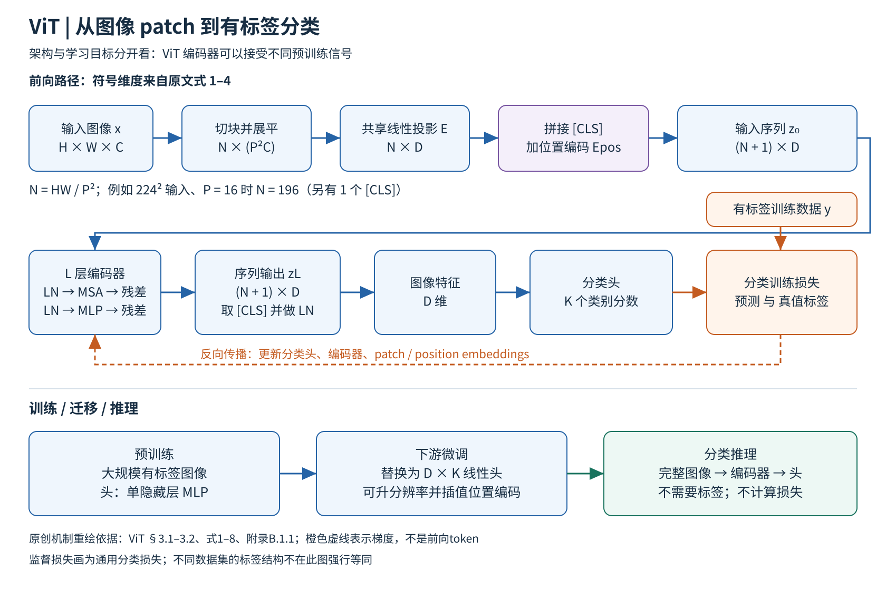

# ViT 精读：把图像变成序列，规模如何补偿归纳偏置

论文：Alexey Dosovitskiy 等，An Image is Worth 16x16 Words: Transformers for Image Recognition at Scale，ICLR 2021。本文依据 [arXiv v2 完整原文](https://arxiv.org/pdf/2010.11929v2)，阅读正文第1–9页、附录A–D第13–22页，并核对关键表图；页码均为PDF页码。参考文献仅作来源索引，没有逐一读取被引论文。下文“论文证据”指该版本实验，“分析”是机制解释与使用建议，不是复现实验。

## 一 这篇论文真正回答什么

ViT首先是一种图像编码器架构，不是一种只能有标签训练的学习目标。论文的主要实验选择有标签分类预训练，用来检验：如果保留标准Transformer，尽量少加入视觉专用结构，是否还能获得有竞争力的视觉表示？结论带有明确条件：大量预训练数据使纯Transformer获得很好的性能与计算效率；在论文当时的中小数据、正则化配方下，CNN的局部性与平移等变性仍有优势。把结果压成“Transformer全面胜过CNN”会丢掉论文最重要的自变量：数据量、训练预算和迁移协议。[§1、§4.3–4.4]

“16×16”指一个常见patch的像素尺寸，绝不是把每张图固定分成16×16个token。图像分辨率H×W、通道C、patch边长P时，patch数N=HW/P²。P=16、224×224图像对应196个patch，加一个分类token共197个token。这是根据公式推算的例子，不是所有ViT的固定规格。[§3.1，式1–4]

## 二 图解与张量路径

图源说明：本图依据原文§3.1–3.2、式1–8及附录B.1.1自行绘制，未复制原论文图像。SVG可编辑文件为vit.svg。图中D、N、K均为符号；蓝线为前向张量路径，橙线标示有标签训练信号，底部区分迁移训练与实际预测。

输入x∈R^(H×W×C)被切成不重叠patch，展平后为N×(P²C)。一个共享、可训练的线性投影E∈R^((P²C)×D)把每块映射成D维向量。随后在序列首部拼接可学习的[class]向量，加入(N+1)×D的可学习一维位置向量，得到z₀。这里的“共享”很关键：不是给每个位置分别训练一个patch投影器；位置差异由位置编码提供。

每层先做LayerNorm，再做多头自注意力并加残差；接着LayerNorm、两层GELU MLP、残差。序列长度和每个token的D维宽度在整个编码器内保持不变。注意力中Q、K、V由token线性变换得到，softmax(QKᵀ/√dₕ)决定各token如何混合V，最后多头拼接和投影。MLP逐token处理，自注意力负责跨patch交互。最终取[class]的归一化表示作为图像特征。预训练头是单隐藏层MLP；下游微调替换为零初始化的D×K线性分类头。[§3.1，附录A、B.1.1]

分析：分类token不是固定“看最重要物体”的探针。它通过全局注意力和分类损失学会汇聚对目标有用的信息；是否编码背景或捷径取决于训练数据。位置编码也不是天然二维邻接表，论文的默认一维可学习编码需要从任务中学习空间关系。

## 三 数据与完整训练流程

论文比较ImageNet-1k约130万张图、ImageNet-21k约1400万张图，以及内部JFT约3.03亿张图，并按下游测试集进行预训练数据去重。预训练分辨率为224，所有比较架构采用Adam、batch 4096；JFT主设置weight decay 0.1，10k步warmup，再线性衰减。数据集之间的epoch、学习率、正则化并不相同，应读附录表3，不能把一条配方套到全篇。[§4.1；附录B，表3]

迁移时丢弃旧分类头，用目标数据的类别重新建立线性头，并更新模型。通常在384分辨率微调，SGD momentum 0.9、batch 512、余弦衰减、无weight decay。主表最高ImageNet结果另用更高分辨率和权重平均：L/16为512，H/14为518。升分辨率而不改P会增加token数，因此要按原二维网格对位置编码插值。模型参数可复用，计算和显存开销却不会保持不变。[§3.2、§4.1，附录B.1.1，表4]

评估有两种不同协议：全量微调，以及在冻结表示上用少量有标签样本求解正则化最小二乘分类器的few-shot评估。后者用于快速分析数据量、算力的影响，不等于主表的微调准确率。实际分类推理只需图像、训练好的编码器和分类头，无标签、无损失计算；换一个任意文字类别名称并不能像CLIP那样直接产生新分类器。

## 四 关键证据应如何读

1. 大规模迁移的旗舰结果：表2中JFT预训练ViT-H/14的ImageNet为88.55±0.04%，ViT-L/16为87.76±0.03%；BiT-L为87.54±0.02%。预训练分别约2500、680、9900 TPUv3-core-days。这里说明的是整套系统结果，不是隔离了所有训练因素的“架构节省百分比”。原文也提醒优化器、训练时长等会影响效率。[p6，表2]
2. 数据依赖：表5中仅ImageNet预训练再微调的B/16为77.91%，L/16为76.53%；JFT预训练后分别84.15%、87.12%。更大的模型需要足够数据才能兑现容量收益。表5统一384且没有主表的额外技巧，因此H/14的88.04%不应与表2的88.55%混为同一设置。[p7图3–4；p15表5]
3. 更接近架构控制实验的是§4.4与表6：统一在JFT上比较ResNet、ViT与hybrid的性能/预训练计算曲线。作者报告在五项任务平均性能上，ViT达到相似表现所需计算约少2–4倍；小预算hybrid略占优，预算扩大后差距消失。结论限于试验范围，没有证明无限规模定律。[p7–8图5；p15表6]
4. 位置编码消融：ViT-B/16的ImageNet 5-shot线性评估，无位置编码为0.61382，默认一维编码0.64206，二维0.64001，相对位置0.64032。证据支持“需要位置信息，但该设置下复杂位置方案未见明显优势”，不是“空间结构完全无用”。[p17表8]
5. 分类token并非不可替代：附录D.3、图9显示全局平均池化在调低学习率后可以达到近似表现。初次失败主要来自学习率失配，这是一条很有价值的baseline公平性教训。[p16–17]

## 五 附录补足了哪些容易忽略的结论

附录D.2比较增加深度、宽度、MLP宽度、减小patch等途径。深度和更长序列有稳健收益，但并非只看参数量就能解释；减小patch不增加主要模型参数，却提高计算成本。D.5又用TPUv3实际吞吐和可容纳batch补充FLOPs，说明理论复杂度与硬件运行时间不能直接互换。D.6的轴向注意力尤其说明这一点：理论代价合理，朴素实现仍可能很慢。

论文还做了早期masked patch prediction：破坏50%的patch embedding，其中80%替换mask、10%替换随机patch、10%不变，预测被选中patch的离散平均颜色。B/16最终ImageNet为79.9%，优于从零训练约2点，但落后大规模有标签预训练约4点。[§4.6；附录B.1.2] 这与MAE的“只把可见token送入重编码器、用轻解码器重建高比例缺失像素”存在实质差异，不能把ViT附录当成MAE的同一算法。

最后，图6和图14的可视化使用跨层Attention Rollout，而非仅取最后一层注意力；DINO的常见图则直接观察最后层[class]到patch的头。两篇看起来相近的热图其实有不同计算定义。注意力距离与位置编码可视化支持网络学到空间模式，却不构成因果解释或可靠分割性能的证明。[§4.5，附录D.7–D.8]

## 六 创新、局限与可用条件

创新的核心是把“可扩展、硬件友好的标准Transformer”确立为视觉骨干，并用大数据和迁移对比证明它可行，而不是发明新的注意力公式。少视觉先验让模型具有更一般的序列接口，也把学习空间规律的负担交给了数据和训练。

局限同样具体：最强结果依赖非公开JFT，普通团队不能原样重建数据条件；原文主要验证图像分类，并未提供通用检测分割系统；全局注意力随token数平方增长，高分辨率、密集预测会带来成本；原始小数据结论与当时配方绑定，不能拿它断言后来所有ViT都不适合ImageNet规模。

分析：当任务有稳定标签、允许微调、希望统一后续视觉token接口时，ViT是清晰的架构baseline。若标签不足，应保持骨干不变、比较MAE或DINO等预训练目标；若需要自然语言查询和开放类别，应比较CLIP式图文对齐。研究时最好固定骨干容量、预训练数据、分辨率、更新次数、下游协议，再讨论目标函数带来的差异。

## 七 阅读覆盖与下一步

已阅读：§1–5；附录A注意力、B训练与早期自监督、C完整结果、D.1–D.10全部分析；核对表1–9和图1–14的用途，视觉检查架构图、主表、位置编码表、注意力示例。完整证据索引见vit.evidence.json。

推荐阅读顺序是先手算patch数和一个Transformer块，再复查表2与表5为什么数值不同，最后接MAE/DINO/CLIP。这样后续改变的是学习信号，而不是把不同层级的概念混成“模型家族”。

## 图解文件与证据索引

[PNG高清图](../../assets/baselines/visual/vit.png) · [SVG可编辑图](../../assets/baselines/visual/vit.svg) · [结构化证据](evidence/vit.json)

来源类型：本次为细分方向新选择的 baseline，不是历史聊天提取。
