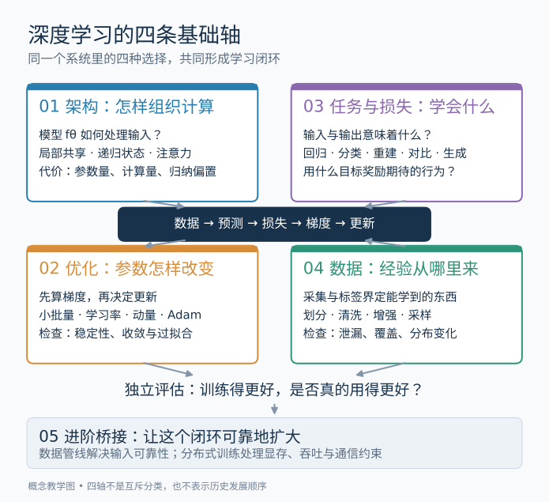

# 深度学习基础学习导航

## 先读两分钟

这套讲义把深度学习拆成四个彼此配合的问题：**模型能表示什么，参数怎样学到，究竟让它学什么，经验从哪里来**。它们分别对应架构、优化、任务与损失、数据。理解这四件事之后，再学习数据管线和分布式训练，就能知道工程系统到底在替哪一步解决瓶颈。

先不用记住一串模型名字。读到一个新方法时，试着填完一句话：**它用什么数据，让什么结构，在什么目标下，通过什么更新规则，学会什么能力；最后用什么证据证明有效。** 如果只能说出模型名，这句话还没有填完。

每个具体概念单独成篇：先看一张浓缩总图，再沿分步图读机制、例子与论文中的关键段落。四条基础轴只负责组织目录，不要求一次读完一篇大全。已有优化、状态估计或 SLAM 背景，可以先从梯度和 SGD 进入；想看懂 Transformer，则先读注意力与 QKV。

## 四条基础轴怎样连起来



图中的四个框不是四个互斥的研究方向。同一个系统同时有这四种选择；改变其中一个，往往会改变另外几个的合理选择。

用一个监督学习问题作最小例子：给定输入 x 和目标 y，模型 fθ 产生预测 ŷ；用损失 ℓ 衡量 ŷ 与 y 的差异；训练过程反复修改参数 θ。

```text
数据：D = {(x₁, y₁), …, (xₙ, yₙ)}
模型：ŷ = fθ(x)
目标：J(θ) = (1/n) Σᵢ ℓ(fθ(xᵢ), yᵢ) + λ R(θ)
更新：θ ← θ − η × 对 θ 的目标梯度
检查：在没有参与调参的测试数据上，测量任务指标
```

这是最小监督学习例子，不是所有深度学习任务的完整公式。自监督训练的目标可以由数据自身构造；强化学习的数据又受当前策略影响。相关模块会逐步放宽这里的假设。

四条轴分别回答不同问题：

- **架构**决定 fθ 如何组织计算，例如局部共享、递归状态或注意力。它影响表达能力、归纳偏置和计算成本。
- **任务与损失**规定输入输出、可用监督和被奖励的行为。架构本身不会告诉我们什么叫做好。
- **优化**决定怎样从当前参数走向更好的参数。反向传播负责计算梯度，优化器负责使用梯度，这两件事要分开。
- **数据**决定哪些情形被看见，以及「做好」是否能从训练样本推广到真正使用场景。样本多不等于覆盖足够。

损失下降只是训练环节中的证据。评估还需要检查指标是否对应真实任务、数据是否泄漏、场景是否改变。这个区分会贯穿整套讲义。

## 按基础轴找独立模块

各模块分别解释一个概念；相邻模块通过链接连接。读完「先读两分钟」后，沿总图、步骤图、实例和论文研读往下走。

### 架构

[架构模块目录](01-architectures.md)

从 MLP 的非线性出发，分别理解 CNN 的局部共享、RNN 的递归状态、LSTM 的门控、注意力与 QKV、VAE 和扩散模型。SSM、GNN、MoE 是下一层扩展入口。

### 优化

[优化模块目录](02-optimization.md)

梯度与 SGD、动量、自适应缩放、Adam 与 AdamW、Muon 分开学习。先手算更新，再看轨迹和失败边界。训练诊断贯穿其中。

### 任务与损失

[任务与损失模块目录](03-tasks-losses.md)

回归与鲁棒损失、分类与概率、自监督与生成目标、机器人几何、正则化各自成篇。特别区分目标含义、实现公式和评估指标。

### 数据

[数据与数据集模块目录](04-data-and-datasets.md)

样本定义与划分、数据管线、图像与文本小实验、IMU 小实验分开阅读。数据集目录用于查询来源和适用边界。

### 进阶桥接

[进阶模块目录](05-advanced-bridges.md)

先理解多卡训练如何保持目标一致，再分别进入强化学习、迁移与元学习。四条基础轴仍是检查这些方法的工具。

## 与 SLAM 和传统方法的联系

下面是**教学类比**，不是声称神经网络历史上由 SLAM 推导出来。

状态估计通常要选状态变量、测量模型、残差与求解器。学习系统也要选表示、预测模型、目标与求解过程。共同点是：错误的观测含义和建模假设，不能只靠更强的求解器弥补。

差异是求解对象与证据：一次 SLAM 后端通常在给定观测下估计该场景状态；监督训练通常跨样本估计共享参数，再检验对新样本的表现。学习式估计、可微优化和在线学习会连接两侧，所以先问「此处优化的是状态还是可迁移参数」。协方差加权残差与任意调权的多任务损失，也不能未经推导就视为等价。

## 阅读每个方法时固定问六个问题

1. **问题动机。** 旧方法在哪个具体条件下不够用？是否有数据、计算或评价条件的改变？
2. **数学机制。** 输入输出、参数、状态、目标和更新各是什么？哪些量固定，哪些量学习？
3. **传统联系。** 能否联系到已知的回归、滤波、控制或概率推断？相似性在哪一步终止？
4. **证据范围。** 论文真正做了哪些实验？在哪个数据和预算下比较？作者的解释是否与实验事实分开？
5. **失败边界。** 哪些假设一变，结论就可能不成立？有没有泄漏、分布变化或计算预算不公平？
6. **一个实例。** 能不能用小数字、简单输入或最小实验走完全过程？不能时，先停在该基础概念，不急着进入下一篇。

## 术语约定

- **参数 θ**是由训练学习的量；学习率、网络宽度等通常是超参数。输入相关的隐藏状态不等于共享参数。
- **模型与架构**不完全等同：架构是计算结构；具体模型还包含参数及使用方式。
- **目标与损失**在日常表述里常混用；本讲义用单样本损失 ℓ 与聚合训练目标 J 帮助区分。正则项可能属于 J。
- **反向传播与优化器**分开：前者沿计算图应用链式法则求导，后者选择参数更新。
- **自监督**指监督信号的构造方式，不代表没有目标，也不保证无需人工设计。
- **训练指标与测试指标**分开；验证集用于选择方案，测试集用于最终评估，反复按测试结果改方案会损害其独立性。
- **历史证据**用原始论文或作者资料支持；**教学类比**只用于帮助理解；**工程建议**应说明使用前提。

## 什么时候可以开始精读

不必等到掌握全部细节。只要能用自己的话解释某个基础机制，再到对应精读里检查作者如何放大、组合或改变它。

- 看懂注意力的输入输出后，读 [Transformer 精读](https://github.com/hk865/my-knowledge-data-base/blob/main/docs/deep-readings/transformer.md)；看懂图像局部结构后，再比较 [ViT 精读](https://github.com/hk865/my-knowledge-data-base/blob/main/docs/deep-readings/vit.md)。
- 看懂重建目标后，读 [MAE 精读](https://github.com/hk865/my-knowledge-data-base/blob/main/docs/deep-readings/mae.md)；看懂配对与对比目标后，读 [CLIP 精读](https://github.com/hk865/my-knowledge-data-base/blob/main/docs/deep-readings/clip.md)。
- 看懂条件生成与逐步去噪后，读 [DDPM 精读](https://github.com/hk865/my-knowledge-data-base/blob/main/docs/deep-readings/ddpm.md)；再把条件换成机器人观测，读 [Diffusion Policy 精读](https://github.com/hk865/my-knowledge-data-base/blob/main/docs/deep-readings/diffusion-policy.md)。
- 看懂轨迹数据、策略和期望回报后，读 [PPO 精读](https://github.com/hk865/my-knowledge-data-base/blob/main/docs/deep-readings/ppo.md)。

这些是第二层入口。基础机制由独立模块解释，读正文不以先看论文为条件。

## 一个很小的自测

挑任意熟悉的方法，写下：输入、输出、可学习参数、损失、数据来源和测试方式。然后分别回答：

- 如果数据不变而换架构，改变了什么？
- 如果架构不变而换损失，模型会被鼓励做什么不同的事？
- 如果训练损失更低但新场景更差，接下来要检查哪条轴？
- 如果模型放不进一张显卡，是学习问题变了，还是执行约束变了？

答案能区分这些层次，就已具备继续学习的骨架。各模块的例子会把骨架填实。

## 补充材料

本导航中的最小线性回归、损失与小批量更新可以对照《动手学深度学习》的[线性回归章节](https://d2l.ai/chapter_linear-regression/linear-regression.html)检查。更系统的数学和模型背景可使用 Goodfellow、Bengio、Courville 的 [Deep Learning 官方在线版](https://www.deeplearningbook.org/)。它们是补充参考，具体历史与方法证据放在各独立模块相应段落附近。
