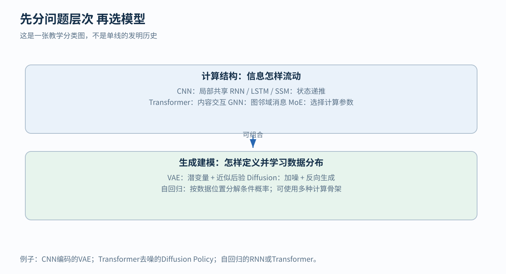

# 架构与生成模型 学习地图

[返回总学习导航](00-learning-navigation.md)

## 先读两分钟

CNN、RNN、LSTM、Transformer主要描述**信息怎样计算和流动**；VAE、diffusion主要描述**怎样定义和学习生成分布**。两组不是互斥菜单：VAE的编码器可以是CNN，diffusion的去噪器可以是U-Net或Transformer。自回归则是另一个维度：把联合分布写成逐项条件概率的乘积。RNN可以自回归，Transformer可以自回归，也可以做双向编码。

看任何模型，先写清四件事：输入是什么；输出是什么；哪些中间变量可被观察或保存；训练用什么信号。把一个动作序列送入Transformer预测噪声，与送入同样的Transformer预测下一个动作，计算骨架相似，学习问题却不同。

图1是教学分类，不是“所有方法都由左边方法发明而来”的历史谱系。箭头表示问题与设计的对应关系。

## 按问题选择模块

- [CNN 从固定滤波器到可学习视觉层级](11-cnn.md)
- [RNN 从历史观测到可学习状态](12-rnn.md)
- [LSTM 怎样选择记住 写入和读出](13-lstm.md)
- [Attention与Transformer 从软对齐到并行交互](14-attention-transformer.md)
- [QKV 为什么有匹配还需要内容](15-qkv-deep-dive.md)
- [VAE 从潜变量模型到可训练后验推断](16-vae.md)
- [Diffusion 从逐步加噪到条件生成](17-diffusion.md)
- [SSM GNN与MoE 扩展导读](18-ssm-gnn-moe.md)

## 用一个机器人任务串起来

假设目标是让移动机器人根据相机、IMU和地图输出动作。可以先用CNN抽取图像局部特征；用LSTM或SSM整理高频历史；用cross-attention让状态访问地图；最后用确定性回归、潜变量策略或diffusion表示动作分布。也可以用一个统一Transformer替代部分组合。哪种更好，要以数据量、可观测性、延迟、分布外鲁棒性和闭环成功率判断。

读论文时依次检查：它保留了哪些传统结构；哪些参数变成可学习；历史信息存在哪里；跨位置怎样通信；不确定性如何表示；训练信号来自哪里；推理时实际重复计算多少次；几何、动力学和安全约束由谁保证。能回答这些问题，才算理解了模型为什么被放在系统的这个位置。
