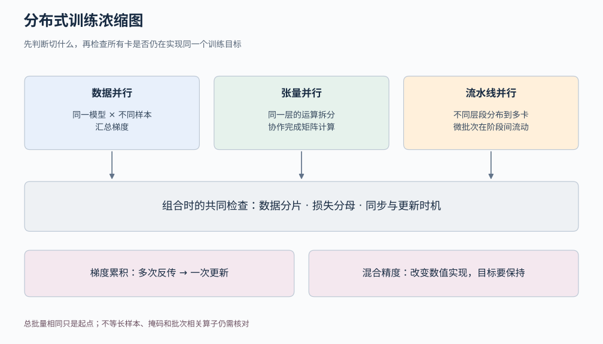
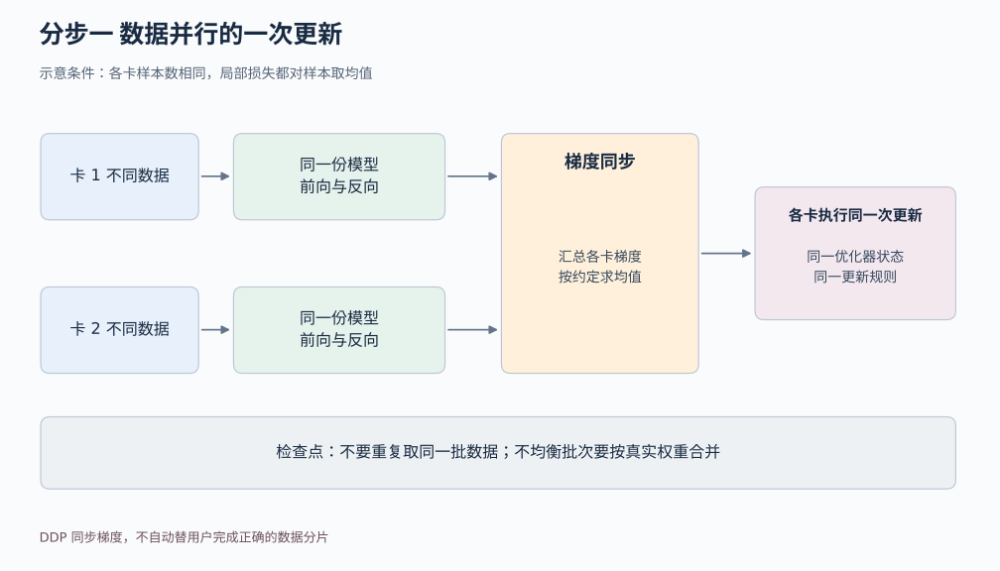
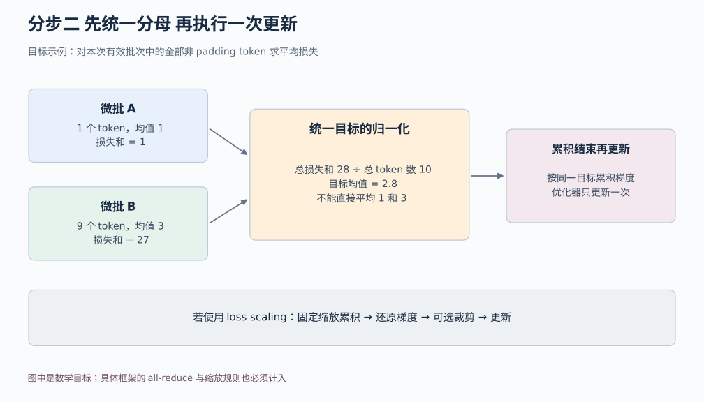

# 05a 分布式训练导读

[返回学习导航](./00-learning-navigation.md) · [返回进阶入口](./05-advanced-bridges.md)

## 先读两分钟

本模块是基础与分布式实践之间的导读，深度止于“切什么、怎样更新、如何验证目标没变”。先掌握一次前向、反向与优化器更新，再区分数据并行、张量并行和流水线并行。实现系统和通信库的细节留待专项精读。

模型架构决定能沿哪里切；优化与训练方法决定何时汇总和更新；任务与损失决定分母与权重；数据决定每张卡拿到什么。数据清洗、划分和管线版本管理见[数据基础](./04-data-and-datasets.md)，本模块侧重多卡计算。

## 浓缩总图

[打开可缩放矢量图](../../assets/foundations/advanced-distributed-overview.svg)

## 怎样读懂一次分布式更新

先区分三种切法：

- **数据并行**：每张卡放一份模型，各处理不同样本，再汇总梯度。普通 DDP 同步梯度，不自动替你正确切分数据；重复读取同一批样本不会凭空增加信息量。[PyTorch DDP 文档](https://docs.pytorch.org/docs/stable/generated/torch.nn.parallel.DistributedDataParallel.html)
- **张量并行**：把同一层的矩阵等张量运算切到多张卡，例如协作完成一个大线性层。它减少单卡承担的层内计算与存储，但需要通信。[Megatron-LM 原论文](https://arxiv.org/abs/1909.08053)
- **流水线并行**：把不同层段放到不同卡，让多个微批次在层段间流动。要考虑各阶段负载和等待的“气泡”；不能把一个批次逐卡串行跑，就当作已经充分并行。[GPipe 原论文](https://arxiv.org/abs/1811.06965)

三者可以组合。参数、梯度、优化器状态的分片则是另一项存储安排，不宜把所有“模型放不下一张卡”的方案都叫张量并行。

### 分步一 从单卡更新到多卡同步

[打开可缩放矢量图](../../assets/foundations/advanced-distributed-step1.svg)

图中先假定各卡样本数相同。将该假设拿掉时，应先推导全局目标的权重，再决定怎样合并局部梯度。

**梯度累积**让多个微批次先反向传播，累够再更新一次。在每张卡样本数相同的情况下，有效批量是“单卡微批量 × 数据并行卡数 × 累积次数”。这不等于多做几次参数更新；学习率日程应分清按样本、token 还是优化器更新步计数。[PyTorch 累积示例](https://docs.pytorch.org/docs/stable/notes/amp_examples.html#gradient-accumulation)

### 分步二 从微批次回到统一目标

[打开可缩放矢量图](../../assets/foundations/advanced-distributed-step2.svg)

最容易忽略的是分母。若目标是有效 token 的平均损失，就应按全部有效 token 加权。一个微批有 1 个 token、平均损失为 1，另一个有 9 个、平均损失为 3；平均两个均值得到 2，整体 token 均值却是 2.8。两者对应不同目标。DDP 的梯度平均、微批大小、padding 掩码、最后一个不完整批次，都要纳入同一套归一化推导。这个例子是加权平均的直接计算，而不是某个框架专属技巧。

**混合精度**改变部分计算的数值表示，以节约资源；它没有改变“希望优化什么”。FP16 的有限范围需要防范下溢与溢出，常配合 loss scaling。先放大损失，再在更新前还原梯度，不能把放大后的梯度直接当真实梯度裁剪。累积期间缩放因子也应保持一致。[混合精度原论文](https://arxiv.org/abs/1710.03740)；[PyTorch 数值处理示例](https://docs.pytorch.org/docs/stable/notes/amp_examples.html)

进阶前的验收标准很朴素：小模型、固定样本上，先比较单卡与分布式的一次更新。考虑浮点误差和批次相关算子的差异，确认实现没有无意改变目标，再追求速度。

## 后续论文精读入口

本次提供问题导向的原论文入口，不把导读标作已完成的逐节精读。

- [Megatron-LM 原论文](https://arxiv.org/abs/1909.08053)：沿线性层的哪一维切分？哪些位置必须通信？和数据并行为什么能组合？
- [GPipe 原论文](https://arxiv.org/abs/1811.06965)：微批次怎样填满流水线？气泡如何出现？何时更新参数？
- [Mixed Precision Training 原论文](https://arxiv.org/abs/1710.03740)：数值范围为什么造成梯度丢失？缩放如何恢复真实更新？

自测：不用框架名，也能解释“8 张卡各处理 4 个样本、累积 2 次”在何种条件下对应有效批量 64；若序列长短不同，为什么还要继续问损失除以什么。
