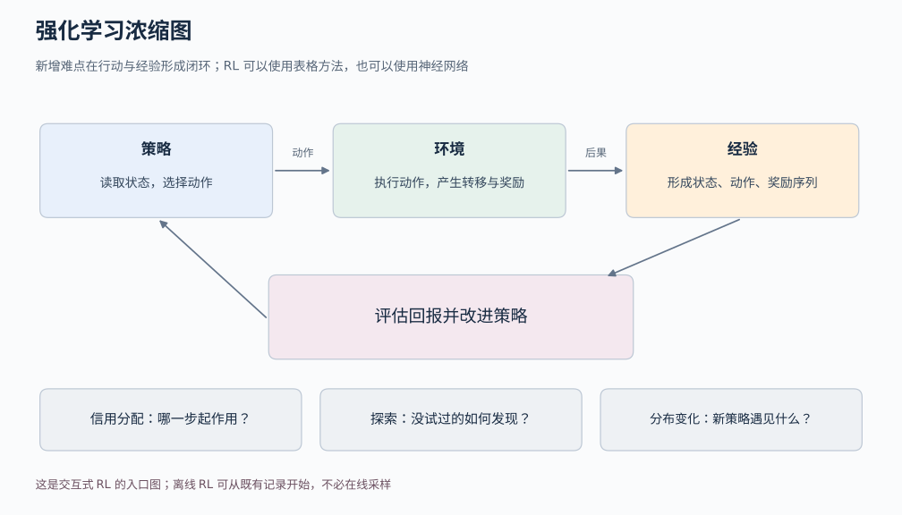
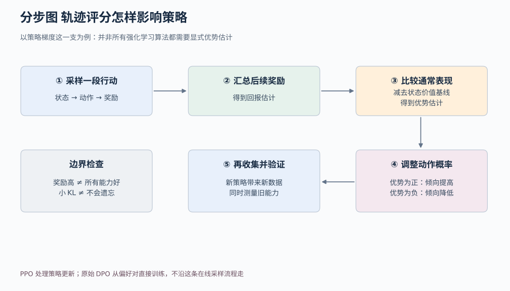

# 05b 强化学习：怎样从行动的后果学会更好的选择

## 1. 先从走出房间这件事开始

假设一个小机器人要走出房间。它可以向前走、向左转、向右转；撞墙扣分，走到门口得分。我们没有为每个可能的位置事先写好“此刻应该向左还是向右”，只给它行动和观察后果的机会。

这与常见监督分类不同。分类时，一张图片通常已经附有正确类别，模型根据固定样本学习。机器人这里选择了不同动作，接下来看到的位置就不同；它怎么行动，会改变之后获得的数据。

这种**行动影响经验，经验又影响行动规则**的闭环，是强化学习的核心。强化学习简称 RL；做选择的一方叫智能体，提供反馈并随动作变化的外部系统叫环境。环境可以是真实机器人系统、游戏模拟器，也可以是其他交互过程。

本篇会从这个例子解释状态、策略、奖励、回报、价值、优势和策略梯度，再说明 PPO 与 DPO 各解决哪部分问题。它不是任何具体算法的完整实现或训练报告。

## 2. 先把一次交互描述清楚

在时刻 t，机器人得到关于当前位置的信息，选择动作 aₜ。环境因此变化，给出下一步状态 sₜ₊₁ 和奖励 rₜ₊₁。不断重复，就得到一段状态、动作、奖励交替出现的记录，叫**轨迹 trajectory**。

**状态 state**表示对预测后续变化足够有用的当前信息。例如仅知道机器人“在房间中央”，可能还不够，还需要朝向和速度。**动作 action**是智能体可以选择的操作。**奖励 reward**是环境在一步交互后给出的数值反馈，不是“正确动作标签”。

**策略 policy**是从状态到动作选择的规则，用 π 表示。π(a|s) 表示处于 s 时选择 a 的概率。机器人可以在同一状态以 70% 概率向前、30% 概率转弯；策略不一定是确定的，也不一定由神经网络表示。小问题可以直接用表格保存这些概率或价值。

所谓**马尔可夫决策过程 MDP**，用状态、动作、转移规律和奖励描述这一类问题。马尔可夫性质要求当前状态已经包含预测下一步所需的信息，给定当前状态和动作后，更早的历史不再额外改变下一步的条件分布。[1]

现实里模型得到的往往只是**观测 observation**，例如摄像头的一帧图像。相同画面可能对应不同速度，单帧未必是充分状态。这时可能需要连续帧、历史信息或记忆模块。给变量起名 state，并不能让它自动满足马尔可夫性质。

读图时从策略选动作开始，沿箭头走到环境，再回到经验和更新。和固定训练集最不同的地方，是更新策略以后，下一轮收集到的状态与动作分布也可能改变。图中的网络结构只负责表达策略或预测值，不会替我们定义奖励究竟鼓励什么。

## 3. 奖励是一时的回报是一段未来

假设机器人先绕路花一步，得到奖励 −1，然后成功到门口，得到奖励 +5 并结束。若只看第一步的 −1，可能会错把必要绕路当成坏行为。

**回报 return**把后续奖励加起来。若从时刻 t 开始，使用折扣因子 γ，则可写为：

Gₜ = rₜ₊₁ + γrₜ₊₂ + γ²rₜ₊₃ + …

γ 通常在 0 到 1 之间，用于降低远期奖励的权重；有限回合任务也可以设 γ=1。若上面两步取 γ=0.9，起点回报为 −1+0.9×5=3.5，第二步之前的回报为 5。

折扣改变了目标，并不只是为了让程序好算。设 γ 很小，机器人更重视眼前代价；设得较大，它更重视长远后果。奖励的大小和回合结束条件也同样属于任务定义。

一次实际轨迹的回报只是一次结果。环境可能随机，策略也可能随机，所以训练通常想提高的是**期望回报**：如果在相同条件下重复很多次，平均能得到多少，而不是保证每次都走同一条路。

## 4. 价值和优势为什么能帮助判断动作

**状态价值 Vπ(s)**表示从状态 s 出发，之后按当前策略 π 行动，预期会得到多少回报。**动作价值 Qπ(s,a)**则先指定第一步采取 a，随后再按 π 行动。

两者都包含未来。一个动作眼前奖励很低，但如果它通向好位置，Q 仍可能很高。一个看起来安全的状态，如果当前策略在那里总做错动作，它的 V 也可能很低。因此价值必须连同“之后按什么策略”一起理解。

用一个一步结束的小例子计算。某状态有左、右两种动作，向左得 4 分并结束，向右得 1 分并结束。当前策略左右各选一半，则：

- Q(左)=4，Q(右)=1
- V=0.5×4+0.5×1=2.5
- 左动作优势 A(左)=4−2.5=1.5
- 右动作优势 A(右)=1−2.5=−1.5

**优势 advantage**定义为 Aπ(s,a)=Qπ(s,a)−Vπ(s)。它回答“这个动作比当前策略在此处通常做到的水平好多少”。右动作虽然得到正奖励 1，优势却是负的，因为它不如当前平均水平。由此可见，“奖励正就鼓励，奖励负就打压”不是完整的改进规则。

这些期望值在真实任务里往往不知道，要从经验估计。可以重复尝试求平均，也可以训练一个价值函数预测器：输入状态，输出预期回报。这个预测器常叫 critic；负责选择动作的策略常叫 actor。名字不同，仍然要分别说明它们输入什么、学习什么目标。

价值还有一个重要递推直觉：现在的预期回报等于“下一步奖励 + 折扣后的下一状态价值”的期望。这是动态规划和许多价值学习方法的重要连接，但本篇不要求先推完其收敛证明。

## 5. 轨迹打分怎样变成参数更新

假设我们用可微的模型表示策略。**可微**指能够计算输出概率随参数变化的局部导数。我们想提高优势为正的已采样动作的概率，降低优势为负的动作概率，这就是理解策略梯度的一个入口。[2]

在一步任务中，可以用一个教学用代理损失：

L = −A × log πθ(a|s)

a 是实际采样到的动作，θ 是策略参数，A 是这次用于更新的优势估计，log 在这里采用自然对数。更新策略时把 A 当作固定权重，不让梯度顺着它再改变评分方式。多条样本则按相应采样与目标权重汇总。

为什么要乘 log 概率？对数导数可以把期望回报的变化写成由已采样动作计算的梯度贡献；环境本身不必能反向传播。例如真实机器人撞墙事件不可微，仍然可以通过策略的动作概率获得学习信号。完整多步问题还要处理折扣、状态访问分布和采样权重，不能把一步例子的任意平均当成所有 RL 目标的无偏估计。

用最简单的两动作策略手算一次。设“向左”的概率 p=1/(1+e^(−θ))。当 θ=0，p=0.5。这个函数的导数是 p(1−p)，而 log p 对 p 的导数是 1/p，因此 log p 对 θ 的导数为 (1/p)×p(1−p)=1−p。导数在这里描述参数微小变化时，概率或损失的局部变化速度。若采样到向左，优势 A=1.5，则该样本对 θ 的损失导数为 −A(1−p)=−0.75。用学习率 0.1 做梯度下降，θ 从 0 变成 0.075，向左概率变为约 0.519，确实提高了。

这个计算只针对一个独立参数和一条样本。真实神经网络共享参数，很多样本的梯度会相加，有的方向还会互相冲突；不能承诺每个正优势动作经过一次合并更新后概率都必然增加。

读图时把回报看作实际或估计的未来成绩，把价值基线看作“这里通常能做到多好”，两者的差帮助判断相对表现。图的最后是改变概率，而不是把某条成功轨迹永久标成唯一正确答案。评分噪声和价值预测误差也会影响更新。

## 6. 为什么给整段行为打分还不够

第一道问题是**信用分配**。机器人最后成功，不代表中途每个动作都有帮助；有的动作可能绕了远路。语言模型的一整段答案得高分，也不意味着每个 token 都值得同样鼓励。我们需要估计哪些选择对未来有贡献，价值和优势正是在帮助组织这个问题。

第二道问题是**探索**。如果机器人从未走过右边通道，可能不知道那里更近。只加强目前已知的最好行为，可能一直停留在不够好的选择。探索意味着尝试不确定的动作；真实系统的探索还受安全、成本和权限约束，不能把模拟器里的无限试错直接搬到现实。

第三道问题是**数据分布变化**。策略改善后，常去的位置会变，过去的数据来自旧策略，不一定能按“当前策略刚采到的样本”直接使用。**on-policy**方法主要按当前或近期行为策略的数据组织更新；**off-policy**方法可以利用与当前目标策略不同的行为策略收集的数据，但需要相应算法和假设。

**离线强化学习**使用已经收集好的交互记录，训练时不必继续在线试错。难点之一是模型可能偏好数据几乎没覆盖过的动作，价值估计在这些区域不可靠。因此“离线有很多轨迹”也不自动解决探索覆盖与分布外动作问题。

## 7. PPO 怎样限制一次更新的诱因

把一批经验反复用来更新，可以提高数据利用率，但策略可能越改越远，旧经验对于新策略的代表性也随之变化。PPO 是策略优化方法，其中常见版本使用裁剪代理目标，抑制部分过大的概率变化带来的继续改进诱因。[3]

先定义概率比率 ρ：

ρ = π_new(a|s) / π_old(a|s)

分子是更新中策略给已采样动作的概率，分母是收集该动作时旧策略给它的概率。若旧概率 0.2，新概率 0.3，比率为 1.5，表示该动作概率提高到原来的 1.5 倍。

PPO 的裁剪目标项可以写为：

min(ρA, clip(ρ,1−ε,1+ε)A)

这里 clip 表示把数限制到指定区间，ε 是容许变化的设置。算法倾向于最大化这些项的平均值；若程序以最小化损失实现，就取相反数。

例如 A=2、ε=0.2、ρ=1.5：未裁剪项为 3，裁剪后的比率为 1.2，对应项为 2.4，最终取较小的 2.4。这一条样本在这个区域不再因概率继续增大而提供同样的额外收益诱因。A 为负时裁剪起作用的方向会不同，所以不能简单理解成“所有概率都被强制锁在 ±20% 内”。

特别注意：裁剪的是代理目标中的一项，不是直接给全部策略概率加硬约束。共享参数、其他样本和后续更新仍会影响概率。PPO 裁剪不严格保证整体 KL 距离处于某个范围，也不是安全性或不遗忘证明。实际 PPO 还涉及经验采集、优势估计和价值函数训练，本篇只解释这一核心机制，没有把它冒充完整实现。

## 8. DPO 为什么不能简单叫作另一种 PPO

在语言模型偏好数据里，一个样本可以由三部分组成：同一个问题 x、更受偏好的回答 y_w、较不受偏好的回答 y_l。我们想利用这些偏好对，让模型更倾向于符合偏好的回答。

DPO，即 Direct Preference Optimization，从特定偏好概率模型和带 KL 正则的奖励优化目标出发，得到直接优化策略的训练目标。[4] 原始离线 DPO 不需要先单独训练一个奖励模型，再运行 PPO 式策略采样和更新循环。

直观上，它比较当前策略与参考策略对两个回答的相对概率变化，用成对偏好提供训练信号。这里的“参考策略”是用于衡量偏离程度的固定基准模型；偏好本身也可能有噪声、冲突或偏差。

因此，PPO 的主线是用交互经验和优势估计进行策略优化，DPO 的主线是从偏好对直接训练策略。二者可以出现在相关的语言模型训练讨论里，但不能因为都与反馈有关，就视为同一算法。

更重要的是，只有一批静态偏好对，并不会自动解决一般环境中“该去哪里探索”“很久以后成功应归功于哪步”的问题。DPO 原始推导也依赖特定目标与偏好建模假设，不是对任意反馈场景的通用替代。

## 9. 语言模型和旧能力保持怎样接入这条主线

生成文本时，可以把当前上下文看作状态，把下一个 token 看作动作，整段回答看作一段轨迹。最终评分可能来自规则、人类偏好或模型。这让策略优化可以用于改善某些行为，但评分只是我们选择的信号，不一定等于真实性、任务成功或用户真正需要的品质。

例如只奖励回答长度，模型可能学会啰嗦；只奖励某些关键词，模型可能学会堆关键词。这种“评分变高但目标没有真正改善”的现象提醒我们，需要独立评价任务成功、事实正确性和其他相关能力。

还要关心**能力保持**：新训练让某种表现提高，是否损害了旧任务？KL 惩罚用于限制策略在某些输入分布上偏离参考策略的程度；旧数据回放或混入旧任务样本，可以继续提供原有任务信号。KL 是比较概率分布差异的一种量，它的平均值较小，不表示每个输入上的行为都不变。

这些方法都不能保证所有旧能力绝不下降。没有覆盖到的输入区域仍可能改变，有限测试也不能证明任意情况。EWC 等持续学习方法尝试通过保护对旧任务重要的参数来缓解干扰，但同样需要具体评价。[5] 合理报告应同时包含新任务收益与旧任务测试变化。

## 10. 第一个练习不必从大模型开始

先做一个一步结束的两动作任务：左动作固定奖励 4，右动作固定奖励 1，用一个可调概率表示策略。检查能否手算 V、Q 和 A，并验证一次更新方向。然后把奖励改为随机，观察单次高分为什么不能直接等于长期最好。

再增加一个两步的小环境，让某个第一步动作暂时扣分、却通向更高终点奖励，检查模型是否需要利用回报而非只看即时奖励。最后才逐步增加状态、价值估计和更复杂的策略优化。任何训练曲线都应来自实际运行，本篇数字只是教学算例。

游戏是直观入口，但 RL 不是先从游戏单线发展到控制。Bellman 在 1957 年就研究马尔可夫决策与动态规划，Barto、Sutton、Anderson 的 1983 年论文直接研究控制问题。[6][7] 控制、动态规划和试错学习都有重要历史脉络。

读完之后，你应能回答：奖励和回报为何不同；价值为什么依赖策略；优势为负为何也可能获得正奖励；策略为何影响训练数据；PPO 裁剪与 DPO 偏好训练分别作用在哪一环。能够把这些讲通，再继续读完整算法，符号就不再是一串突然出现的缩写。

## 参考资料与延伸阅读

[1] Richard S. Sutton, Andrew G. Barto. Reinforcement Learning: An Introduction，第 2 版教材草稿，相关内容为第 3 章。所列链接为 2014–2015 年草稿，不等同于最终出版排版。https://web.stanford.edu/class/psych209/Readings/SuttonBartoIPRLBook2ndEd.pdf

[2] Richard S. Sutton, David A. McAllester, Satinder P. Singh, Yishay Mansour. Policy Gradient Methods for Reinforcement Learning with Function Approximation. NeurIPS，1999。https://papers.neurips.cc/paper_files/paper/1999/hash/464d828b85b0bed98e80ade0a5c43b0f-Abstract.html

[3] John Schulman, Filip Wolski, Prafulla Dhariwal, Alec Radford, Oleg Klimov. Proximal Policy Optimization Algorithms，2017。https://arxiv.org/abs/1707.06347

[4] Rafael Rafailov, Archit Sharma, Eric Mitchell, Stefano Ermon, Christopher D. Manning, Chelsea Finn. Direct Preference Optimization: Your Language Model is Secretly a Reward Model. NeurIPS，2023。https://arxiv.org/abs/2305.18290

[5] James Kirkpatrick et al. Overcoming catastrophic forgetting in neural networks. PNAS，2017。https://arxiv.org/abs/1612.00796

[6] Richard Bellman. A Markovian Decision Process. Journal of Mathematics and Mechanics，6(5)，679–684，1957。原文首页：https://iumj.s3-us-west-2.amazonaws.com/abstracts/56038_abs.pdf

[7] Andrew G. Barto, Richard S. Sutton, Charles W. Anderson. Neuronlike Adaptive Elements That Can Solve Difficult Learning Control Problems. IEEE Transactions on Systems, Man, and Cybernetics，1983。https://ieeexplore.ieee.org/document/6313077/

后续专题：[PPO 笔记](../../docs/deep-readings/ppo.md)、[DPO 笔记](../../docs/deep-readings/dpo.md)、[InstructGPT 笔记](../../docs/deep-readings/instructgpt.md)。这些是进一步阅读入口，不是理解本文的前置要求。

课程导航：[学习导航](./00-learning-navigation.md) · [进阶入口](./05-advanced-bridges.md)

资料复核日期：2026-10-02。未进行强化学习训练或算法复现。
