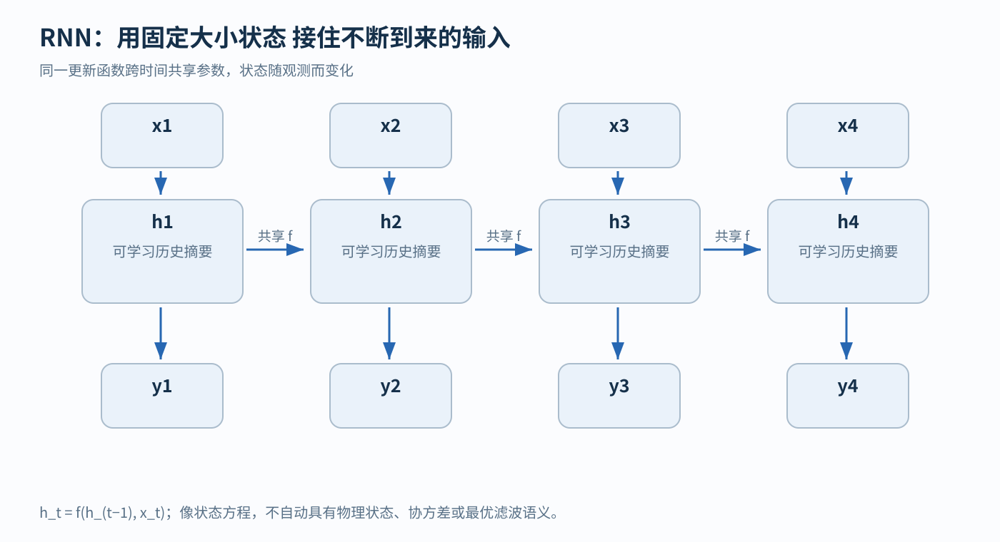
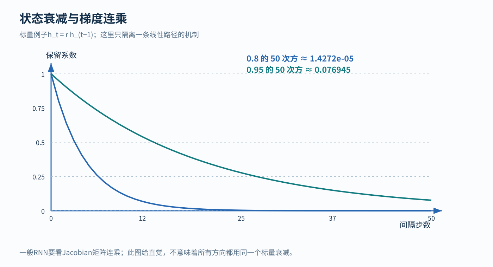
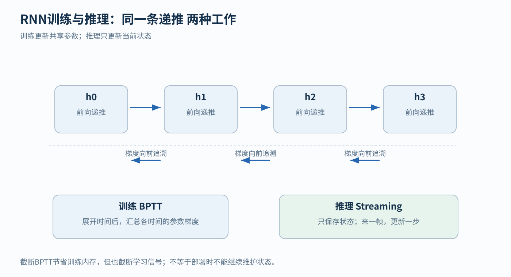

# RNN 从历史观测到可学习状态

[返回学习导航](00-learning-navigation.md) · [架构模块地图](01-architectures.md)

## 先读两分钟

RNN每步把新观测和旧状态合成新状态。它与状态方程有数学联系，却不自动是物理状态估计器；长依赖的困难主要在学习信号穿过许多递推后可能衰减或放大。

## 1 为什么当前观测不够

同一张相机图像可能对应向前运动或刚刚停下；同一瞬间的IMU读数也未必足以辨认运动状态。固定窗口MLP能拼接最近若干帧，却必须先选窗口长度。RNN的选择是：每到一个时刻，把新输入和上一时刻保存的状态一起更新。

对熟悉状态估计的人，s_t=f(s_(t-1),u_t)是很好入口：RNN也是递推系统。但这里是**数学结构类比**，不是“RNN从牛顿定律推导而来”的历史事实。它通常不区分物理状态、控制和测量，隐藏向量也不自动具有位置、速度或协方差的语义。

早期循环网络的历史比现代序列模型更广。Elman 1990年的代表工作通过反馈隐藏状态形成动态记忆，研究序列中的时间结构，并明确承接Jordan的相关思路。这能支持“以可学习内部状态表示上下文”，不能支持“RNN本质上就是有限状态机”的简化结论。[Elman原文及作者书目](https://jeffelman.ucsd.edu/research/publications/)

## 2 一条递推方程的含义

令输入 x_t∈ℝ^m，隐藏状态 h_t∈ℝ^d，输出 y_t∈ℝ^p：

h_t = tanh(W_x x_t + W_h h_(t−1) + b)；y_t = W_y h_t + b_y

其中 W_x:d× m，W_h:d× d，W_y:p× d。相同参数在各时间步复用，隐藏状态随数据改变。它可以每步输出，也可以只用末状态分类整个序列。

**最小例子。** 去掉非线性，设 h_t=0.8h_(t-1)+0.2x_t，就是指数平滑。展开得到 h_t=0.2Σ_(k=0)^(t-1)0.8^kx_(t-k)+0.8^th_0：过去输入以逐渐减小的权重影响现在。可学习、多维、非线性的递推则能形成更复杂的摘要。这只是RNN的一个特殊情形，不代表所有RNN都是低通滤波器。

它与有限状态机都可描述“状态加输入产生新状态”，但一般RNN状态属于连续向量空间，FSM状态是有限个离散符号。RNN可以学习近似离散状态行为；这不意味着其表示、学习算法和可解释性与FSM相同。实际计算有有限精度，也不能因此把FSM当成最有用的建模解释。

## 3 为什么长记忆难学

训练把同一个递推单元沿时间展开，通过BPTT计算梯度。早期状态对后期损失的作用包含连乘：

∂h_T/∂h_t = J_T J_(T−1) … J_(t+1)；J_k = diag(1−h_k²) W_h

许多方向上的放大率连续小于1，梯度就衰减；反复放大也可能导致爆炸。标量直觉是 0.9^(100)≈2.7×10^(-5)。这不是说模型从理论上完全不能保留历史，而是任务所需的长期依赖可能很难由普通梯度下降学到。Bengio等1994年的分析直接讨论了这一困难。[长期依赖原文](https://pubmed.ncbi.nlm.nih.gov/18267787/)

推理时每来一个输入只需更新固定大小状态，适合流式处理；训练时通常仍有时间递推依赖。截断BPTT省内存，却限制梯度跨越的范围。梯度裁剪可抑制爆炸，不会自动解决信息遗忘。

**何时选。** 小型在线时序任务、低内存设备、已有高频传感流都适合把RNN当基线。其局限是历史被压入有限维状态、顺序计算影响吞吐、分布变化可能令状态更新失效。在机器人中可学习未建模动态或时序特征，但不能因形式像滤波器，就声称它有Kalman滤波的统计最优性或不确定性传播保证。

## 相关论文精读

### Elman 1990 读动态记忆而不是背结构图

[作者书目与原文入口](https://jeffelman.ucsd.edu/research/publications/)关注context units如何反馈隐藏状态，以及网络怎样从序列任务中形成结构。把实验中某时刻“已知什么、要预测什么”列出来，避免误把未来目标当当前输入。它支持可学习连续状态处理时间信息，不给物理状态语义作保证。

### Bengio等1994 读学习困难的条件

[原文](https://pubmed.ncbi.nlm.nih.gov/18267787/)讨论长期依赖与梯度学习的冲突。先理解展开后的Jacobian连乘，再看论文怎样论证长间隔增加困难。结论不是RNN数学上不能表示长期关系，而是常见训练方法难以稳定学到它。

## 自测与最小实验

从h0=0开始，输入[1,0,0,0]，用h_t=0.8h_(t−1)+0.2x_t，得到[0.2,0.16,0.128,0.1024]。把0.8改为0.99会怎样影响记忆时间？另做延迟复制任务，把需要保留的标记与目标间隔逐渐加长，记录准确率和梯度范数。若训练时跨episode继续传状态，测试时却每段清零，结果为什么可能变化？
