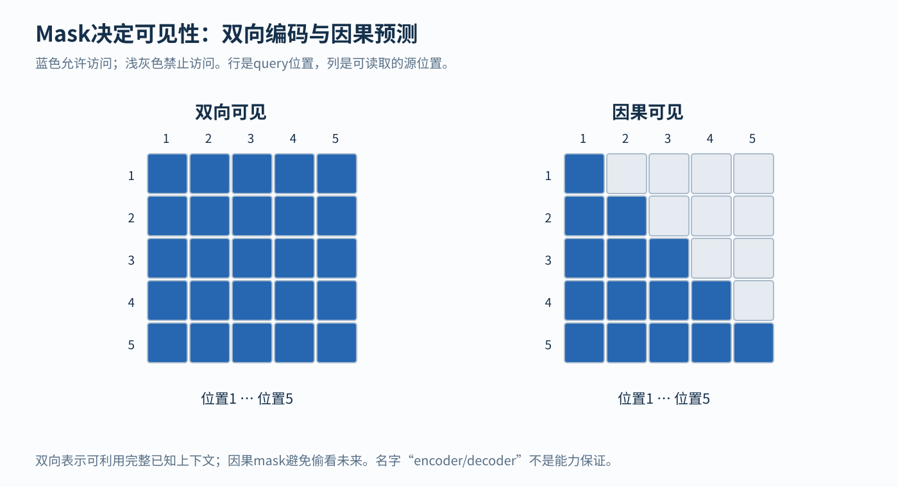
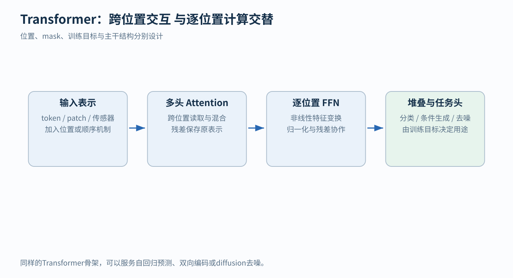
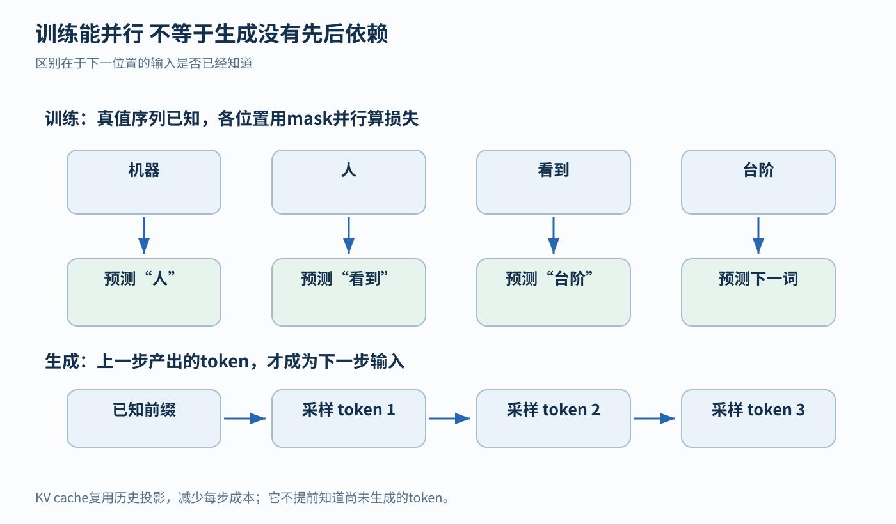

# Attention 与 Transformer：从“到哪里找信息”开始理解

读到“自注意力”“QKV”“多头”“编码器”时，最容易出现一种错觉：每个词都认识，连在一起却不知道模型到底做了什么。原因往往不是公式太难，而是公式之前的问题没有说清楚。

先看一句话：“小林把书放回书架，因为他已经读完了。”我们理解“他”时，需要回到前面寻找合适的人物；理解“读完”的对象时，又需要找到“书”。一句话里的每个位置，需要的上下文并不相同。如果模型只是给每个词查一份固定解释，再各自处理，就很难建立这些联系。

Attention 要解决的就是这种**按当前需要，从其他位置读取信息**的问题。Transformer 则把这种读取机制，与逐位置计算、位置机制、残差连接等部件组合成可以训练的网络。本文会从文字怎样变成数字讲起，亲手算完一次注意力，再把它装进完整模型。所有数值例子都是教学构造，不代表真实模型里某个维度有固定的人类语义。

## 1. 计算机处理的不是字面上的“词义”，而是一组数字

### 1.1 从文本到 token：先决定处理单位

文本进入模型前，通常会经过 tokenizer，中文常叫“分词器”，但它未必按照我们理解的词语切分。它可能把一个词拆成几个片段，也可能把一个常见词组保留成一个单位。这些单位统称为 token。

例如，为了讲解，可以假设“机器人看到台阶”被切成：

“机器” → “人” → “看到” → “台阶”

这只是本章使用的教学切分，并不声称某个真实 tokenizer 一定这样切。“机器人”在另一个 tokenizer 中也可能是一个 token。不同 tokenizer 有自己的词表，即“它认识哪些离散符号”的清单。

词表给每个 token 分配一个整数编号。例如“机器”的编号是 17，“人”是 8。这个编号只是查表地址，不能当作有语义的数值：“编号 18”并不意味着它与“编号 17”的含义更接近。

因此，tokenizer 完成的是“文本 → token 序列 → ID 序列”。它还没有生成后面注意力计算所需的语义表示。

### 1.2 向量：把一个位置表示成几个数

向量可以先理解成按顺序排好的一组数字。例如：

$$
x=[0.2,\,-0.5,\,1.1,\,0.7]
$$

它有四个分量，所以叫四维向量。这里的“维”就是数字的个数，不要求你想象四维空间。

可以暂时把向量比作一个对象的多项测量结果。但真实模型的分量通常不是人工定义的“人物程度”“颜色程度”等清晰标签，而是在训练中形成的数值特征。同一个语义可能分散在多个分量中，一个分量也可能参与表达多种信息。把每一维都硬解释成一个词义，会误导后面的理解。

两个相同长度的向量可以相加，方法是对应位置相加：

$$
[1,2]+[0.3,-0.5]=[1.3,1.5]
$$

也可以乘一个数：

$$
0.2[1,2]=[0.2,0.4]
$$

这两种操作看起来简单，却正是后面“按权重混合信息”和“残差连接”的基础。

### 1.3 嵌入表：由 token ID 找到初始向量

模型会保存一张可学习的 embedding table，也就是嵌入表。假设词表有 $N_{\text{vocab}}$ 个 token，每个 token 用 $d$ 个数字表示，那么表的形状是：

$$
E\in\mathbb{R}^{N_{\text{vocab}}\times d}
$$

这个写法的意思只是：$E$ 是一个有 $N_{\text{vocab}}$ 行、$d$ 列的实数表。每行对应一个 token 的初始向量。输入编号 17，就取出第 17 号 token 对应的那一行。

“可学习”表示表中的数字是模型参数，会随着训练更新。它不是人提前为所有词写好的释义词典。通过预测任务，模型逐渐调整这些向量，使它们更有利于完成任务。分布式词表示和神经语言模型早于 Transformer；Bengio 等人的 2003 年工作已经联合学习词表示和语言模型。[1]

同一个 token 在不同句子中，通常会查到同一份基础嵌入。但它后续的表示可以不同。例如“苹果手机”和“吃苹果”中的“苹果”，经过上下文处理后，不必保持相同的表示。这也是为什么不能把“embedding”和“模型任意一层的隐藏状态”混为一谈。

### 1.4 矩阵 $X$：把本次输入的所有位置叠起来

矩阵就是一个按行、列组织的数字表。如果一句输入有 $n$ 个 token，每个位置有一个 $d$ 维向量，把它们按位置逐行排好：

$$
X=
\begin{bmatrix}
x_1\\
x_2\\
\vdots\\
x_n
\end{bmatrix}
\in\mathbb{R}^{n\times d}
$$

**行轴表示位置，列轴表示特征。** 例如 $n=3,d=2$，就是三个位置、每个位置两个数字：

$$
X=
\begin{bmatrix}
1&0\\
0&1\\
1&1
\end{bmatrix}
$$

嵌入表 $E$ 包含整个词表的参数；$X$ 只包含本次输入的表示。它们不是同一张表。序列中某个 token 出现两次，会占用 $X$ 的两行，但两行可以由同一条嵌入表记录初始化。

在第一层，$X$ 可能是嵌入加上位置信息后的结果；在更高层，$X$ 是上一层算出的表示，已经可能带有上下文信息。因此后面写 $Q=XW_Q$ 时，$X$ 的准确含义是“当前这一层拿到的表示”，不应总把它读成“原始词向量”。

本文先只画一条序列。实际程序还会一次处理多条序列，于是在前面增加 batch 轴；多头注意力也会增加 head 轴。这些轴是计算的组织方式，不会改变本章要解释的单条序列、单个头的核心运算。

## 2. 为什么要让不同位置交换信息

假设模型要理解“他已经读完了”中的“他”。仅凭“他”的初始向量，只能知道这是一个代词，不能知道它在本句指谁。模型需要结合前面的“小林”等信息，形成“这个语境中的他”的新表示。

一种办法是从左到右逐步处理，把已读内容压进一个状态，再交给下一个位置。循环神经网络采用了这种按序更新状态的思路。另一个历史问题出现在早期的编码器—解码器翻译模型中：编码器先把整个源句压成一个固定长度向量，解码器再依靠这个向量逐步生成译文。源句变长时，所有细节都要经过这一个信息瓶颈。

Bahdanau 等人提出的软对齐机制，让解码器在不同生成步骤，以不同权重读取源句不同位置的表示。其预印本发表于 2014 年，论文发表于 ICLR 2015。[2] 翻译到某个词时，可以重点读取与它有关的部分，而不必只依赖同一份固定句子摘要。这时的模型仍然包含循环网络；出现 attention，并不等于已经出现 Transformer。

Transformer 在 2017 年进一步把注意力作为序列内部和序列之间交互的主体，减少沿着 token 位置一步步递推的计算。[3] 两个相距很远的位置，可以在一次允许它们互相访问的注意力计算中直接联系。这改变的是信息传递路径和计算组织方式，不保证模型一定能正确理解所有远距离关系。

理解这段历史，只需要抓住一个实际需求：**当前位置需要的上下文应当随内容而变。** “他”可能要找人物，“读完”可能要找对象，而不是所有位置都拿同一个平均摘要。

## 3. 先不谈 QKV：注意力输出本质上是一种加权混合

### 3.1 普通平均为什么不够

假设我们有三个来源，它们能够提供的内容分别是：

$$
v_1=[2,0],\qquad v_2=[0,1],\qquad v_3=[2,1]
$$

普通平均会给每个来源相同权重：

$$
\frac13v_1+\frac13v_2+\frac13v_3
=
\left[\frac43,\frac23\right]
$$

但当前位置可能最需要第一个来源。假设我们给三个来源的权重是 $0.8,0.1,0.1$，就得到：

$$
o=0.8v_1+0.1v_2+0.1v_3=[1.8,0.2]
$$

这里不是把向量拼成长向量，而是逐个分量相乘、相加。例如输出第一个分量是 $0.8\times2+0.1\times0+0.1\times2=1.8$。

如果另一个位置更需要第二个来源，它可以使用 $0.1,0.8,0.1$，得到：

$$
o'=[0.4,0.9]
$$

来源没有改变，只改变“从各来源读取多少”，输出就变了。这已经包含了注意力的核心直觉。

### 3.2 “注意”不是只选一个，而是通常软性混合多个

标准 softmax attention 给出的权重非负，而且总和为 1，所以输出是 value 向量的加权平均，也称凸组合。与“找到一个最相似位置，只拿那一行”相比，它保留了连续的混合方式，因而称为“软”选择。

权重 $0.8$ 不等于“这个来源有 80% 的概率是事实正确的”。它只表示在这一次计算、这一个头、这个接收位置的混合中，给该来源分配了 0.8 的系数。来源本身可能有错，模型也可能选错。

现在有两个问题没有回答：这些权重怎样随输入产生？来源提供的内容，又怎样从当前表示中得到？Q、K、V 就是回答这两个问题的一套可训练设计。

## 4. Q、K、V：把“匹配条件”和“传递内容”分开

### 4.1 同一个位置可以同时是提问者和信息提供者

把某个接收位置想成一个正在查资料的人。为了完成一次读取，我们需要三类东西：

- Query，记为 $q$：当前接收位置用什么特征提出查询
- Key，记为 $k$：一个来源位置用什么特征参与匹配
- Value，记为 $v$：这个来源位置实际提供什么内容

这个类比只是在解释数学角色，不表示模型真的先生成一句自然语言问题，再搜索一个数据库。

例如“他”需要人物相关的上下文时，查询特征与某个来源的被匹配特征可以产生较高分数；真正加入“他”的新表示的，则是那个来源的 value。匹配所需的特征与希望传来的内容没有理由完全相同，所以模型允许它们分别学习。

在 self-attention，即自注意力中，这三类向量都从同一条序列的当前表示 $X$ 产生。“self”指来源相同，不表示每个位置只能看自己。同一个位置既有自己的 query，也有供其他位置读取的 key 和 value。

### 4.2 投影矩阵不是魔法，而是可学习的线性组合

设输入特征宽度是 $d$，匹配空间宽度是 $d_k$，内容空间宽度是 $d_v$。我们准备三组参数：

$$
W_Q\in\mathbb{R}^{d\times d_k},\quad
W_K\in\mathbb{R}^{d\times d_k},\quad
W_V\in\mathbb{R}^{d\times d_v}
$$

然后计算：

$$
Q=XW_Q,\qquad K=XW_K,\qquad V=XW_V
$$

矩阵乘法可以理解为：用参数指定的方式，把旧特征组合成新特征。例如：

$$
[1,2]
\begin{bmatrix}
1&3\\
2&0
\end{bmatrix}
=
[1\times1+2\times2,\;1\times3+2\times0]
=
[5,3]
$$

右边每一列规定了一个新特征怎样由输入各分量加权组成。神经网络里把这种操作称为“线性投影”或“线性变换”；它不一定是几何课里那种垂直投影，也不一定降维。

矩阵乘法的形状规则是：

$$
(n\times d)(d\times d_k)=(n\times d_k)
$$

中间两个 $d$ 必须相同，因为每个输出分量都要把 $d$ 组乘积相加。外侧的两个数则决定输出有多少行、多少列。

因此，$Q$ 和 $K$ 都有 $n$ 行、$d_k$ 列；$V$ 有 $n$ 行、$d_v$ 列。位置数量没有变，只是每个位置换成了不同用途的特征。

标准做法让所有位置共享同一个 $W_Q$，也共享同一个 $W_K$、$W_V$。不是给第一个词配一组参数、第二个词另配一组。不同位置产生不同结果，是因为它们输入的向量不同。这也让同一层能够处理不同长度的序列。

### 4.3 参数怎样知道该学什么

模型通常不会得到“这一行 query 应当寻找主语”这样的直接标签。它得到的是整个任务的训练信号，例如下一 token 的正确答案。

如果当前参数产生的预测不好，训练算法会根据损失，计算各参数应怎样调整才能降低误差。这一计算叫反向传播；你可以先把它理解为“沿着计算链，把预测误差传回影响它的参数”。$W_Q,W_K,W_V$、嵌入表以及其他层的参数会一起调整。

所以“query 学会提问”是一种解释，不是额外增加了一个人工提问器。真正执行的是数值运算，哪些关系对任务有用，由数据、目标和训练共同塑造。

## 5. 从匹配分数到权重：点积、缩放与 softmax

### 5.1 点积怎样给两个向量打分

两个同维向量的点积，就是对应分量相乘后相加。例如：

$$
[1,2]\cdot[3,4]=1\times3+2\times4=11
$$

注意力用 query 与 key 的点积作为兼容性分数：

$$
r_{ij}=q_i\cdot k_j
$$

下标 $i$ 指接收位置，$j$ 指来源位置。$r_{ij}$ 越大，通常越倾向从位置 $j$ 读取。

这里的“兼容性”比“词义相似度”更准确。一个动词可能需要读取它的宾语，一个代词可能需要读取某个人物；有用的关系不要求两个词本身同义。Q、K 使用不同投影，也允许“我找谁”和“我被谁找到”具有不同方向。

点积还受到向量长度影响。只有做了特定归一化等约束，它才与余弦相似度直接对应。不能把所有点积都自动读成“两个单位向量之间的夹角相似度”。

### 5.2 为什么把 $K$ 转置

转置，记作上标 ${}^\top$，就是把矩阵的行和列交换。如果 $K$ 是 $n\times d_k$，那么 $K^\top$ 是 $d_k\times n$。

计算：

$$
R=QK^\top
$$

得到一个 $n\times n$ 表。第 $i$ 行的第 $j$ 列，正好是第 $i$ 个 query 与第 $j$ 个 key 的点积。这等于一次性计算所有接收位置与所有来源位置的匹配分数。

所以 $QK^\top$ 的两个轴都与位置有关，但含义不同：行是“谁在读取”，列是“从谁那里读”。理解这一点，后面的 mask 就不容易画反。

### 5.3 为什么除以 $\sqrt{d_k}$

点积会把 $d_k$ 个乘积加起来。维度增加时，分数的典型幅度可能随之增大。如果分数差距过大，后面的 softmax 容易变得极端，几乎把全部权重压到一个位置。

缩放点积注意力采用：

$$
s_{ij}=\frac{q_i\cdot k_j}{\sqrt{d_k}}
$$

原论文给出了一个说明性假设：如果 query 与 key 的各分量是相互独立、均值为 0、方差为 1 的随机变量，点积的方差会是 $d_k$，其标准差是 $\sqrt{d_k}$。除以这个数，便把这种假设下的分数尺度拉回较稳定的量级。[3]

“均值”描述围绕哪里波动，“方差”描述波动幅度的平方，标准差是方差的平方根。这里用这些量，是为了说明为什么分母取平方根，而不是直接取 $d_k$。

真实训练中的 Q、K 不必满足这些独立性和方差假设，尤其来自同一输入时可能有相关性。因此这是缩放设计的动机，不是“除完以后任何模型的分数方差永远等于 1”的保证。它也不是把点积变成概率的操作。

### 5.4 softmax 为什么既要取指数，又要除以总和

分数可能是负数，也不一定总和为 1，不能直接当成前面那种加权平均的系数。softmax 把一组分数 $s_1,\ldots,s_n$ 变成：

$$
a_j=\frac{\exp(s_j)}{\sum_{\ell=1}^{n}\exp(s_\ell)}
$$

$\exp(s)$ 就是 $e^s$，其中 $e\approx2.718$。它有两个这里很有用的性质：输出总是正数；输入越大，输出也越大。分母再把这一组正数归一化，使权重加起来等于 1。

例如分数是 $[0,1]$，取指数得到约 $[1,2.718]$，再各自除以 $3.718$，得到约 $[0.269,0.731]$。第二个来源分数更高，所以权重更大，但第一个来源仍然参与混合。

softmax 比较的是相对差距。同一行所有分数都加 10，最终权重不会变，因为分子分母都会乘上相同的 $e^{10}$。实际实现常先减去这一行的最大分数，再取指数，避免数字过大；数学结果不变。

但把所有分数乘以 10，通常会让分布更尖锐。例如 $[0,1]$ 变成 $[0,10]$，权重就接近 $[0,1]$。这也是为什么点积的尺度会影响行为。

对注意力矩阵要做的是**逐行 softmax**：

$$
A=\operatorname{softmax}_{\text{rows}}(S)
$$

每个接收位置独立决定如何分配自己的读取权重，所以每一行的和是 1；每一列的和不要求是 1。一个来源可以同时被许多位置读取，并不需要竞争“只能被分配一次”的名额。

## 6. 完整手算：从 $X$ 一直算到注意力输出

现在不跳过中间步骤，完整算一次单头自注意力。为了专注核心计算，暂时不加位置机制、mask、偏置、dropout 和残差。

其中 dropout 是一种训练技巧：随机把部分中间数值暂时置零，并作相应缩放，减少模型对固定组合的依赖；通常在正常推理时关闭。这里先省略它，以便专心看清确定性的计算过程。它与决定哪些位置允许被读取的 attention mask 不是同一种操作。

设有三个位置，每个位置两个特征，即 $n=3,d=2$。选择：

$$
X=
\begin{bmatrix}
1&0\\
0&1\\
1&1
\end{bmatrix},
\qquad
W_Q=
\begin{bmatrix}
1&0\\
0&1
\end{bmatrix},
\qquad
W_K=
\begin{bmatrix}
1&1\\
0&1
\end{bmatrix},
\qquad
W_V=
\begin{bmatrix}
2&0\\
0&1
\end{bmatrix}
$$

这里 $d_k=d_v=2$。$W_Q$ 是单位矩阵，所以乘它不会改变数字；这只是为了简化手算，真实模型的 $W_Q$ 不需要是单位矩阵。

### 6.1 先生成 Q、K、V

$$
Q=XW_Q=
\begin{bmatrix}
1&0\\
0&1\\
1&1
\end{bmatrix}
$$

$$
K=XW_K=
\begin{bmatrix}
1&1\\
0&1\\
1&2
\end{bmatrix},
\qquad
V=XW_V=
\begin{bmatrix}
2&0\\
0&1\\
2&1
\end{bmatrix}
$$

以第三行的 key 为例：

$$
[1,1]W_K
=
[1\times1+1\times0,\;1\times1+1\times1]
=
[1,2]
$$

可以看到，同一个输入 $[1,1]$ 生成了 query $[1,1]$、key $[1,2]$、value $[2,1]$。三个角色来源相同，但数值可以不同。

### 6.2 再计算所有位置对的分数

$$
QK^\top=
\begin{bmatrix}
1&0&1\\
1&1&2\\
2&1&3
\end{bmatrix}
$$

例如第二行第三列是：

$$
q_2\cdot k_3=[0,1]\cdot[1,2]=2
$$

而第三行第二列是：

$$
q_3\cdot k_2=[1,1]\cdot[0,1]=1
$$

这两个数不一样，具体展示了“位置 2 读取位置 3”和“位置 3 读取位置 2”可以是不同关系。注意力分数矩阵不必对称。

因为 $d_k=2$，除以 $\sqrt2\approx1.4142$：

$$
S\approx
\begin{bmatrix}
0.7071&0&0.7071\\
0.7071&0.7071&1.4142\\
1.4142&0.7071&2.1213
\end{bmatrix}
$$

### 6.3 对每一行分别做 softmax

第一行分数是 $[0.7071,0,0.7071]$。取指数约为：

$$
[2.0281,\;1,\;2.0281]
$$

总和约为 $5.0562$，于是第一行权重约为：

$$
[0.4011,\;0.1978,\;0.4011]
$$

对另外两行重复同一操作：

$$
A\approx
\begin{bmatrix}
0.4011&0.1978&0.4011\\
0.2483&0.2483&0.5035\\
0.2840&0.1400&0.5760
\end{bmatrix}
$$

小数四舍五入后，行和可能出现 $0.0001$ 量级偏差，未舍入结果的每行总和都是 1。第三行最关注第三个来源，但仍读取第一、第二个来源。

此时我们只有“如何混合”的权重，还没有得到新的特征表示。$A$ 每行有三个数字，对应三个来源位置；它们不是最终输出的两个特征分量。

### 6.4 用权重混合 V

最后计算：

$$
O=AV
$$

形状是：

$$
(3\times3)(3\times2)=(3\times2)
$$

第一行输出为：

$$
\begin{aligned}
o_1
&=0.4011[2,0]+0.1978[0,1]+0.4011[2,1]\\
&\approx[1.6044,\;0.5989]
\end{aligned}
$$

三行一起得到：

$$
O\approx
\begin{bmatrix}
1.6044&0.5989\\
1.5035&0.7517\\
1.7199&0.7160
\end{bmatrix}
$$

输出仍然有三个位置，但每个位置已经拿到按自身 query 混合的上下文内容。这就是一次 attention。它还不是最终词语，也不是最终分类答案；后面的模块会继续处理这些向量。

### 6.5 回头看公式，现在每一部分都有具体含义

$$
\operatorname{Attention}(Q,K,V)
=
\operatorname{softmax}_{\text{rows}}
\left(\frac{QK^\top}{\sqrt{d_k}}\right)V
$$

前半部分生成“从哪里读取多少”的权重，后半部分真正把各来源内容混入接收位置。Q、K 当然也携带输入相关信息，但在这条计算路径里，它们主要通过改变混合权重影响输出；V 提供被混合的内容。

图中从 $X$ 出发的上面两条分支汇入“匹配与归一化”，形成 $n\times n$ 的 $A$；下面的 V 分支一直保留 $n\times d_v$ 的内容，在右侧与 $A$ 相乘。图为突出主线，没有画出缩放与 mask，不能把图中简写的 $QK^\top\to\text{softmax}$ 当成实际实现的全部步骤。

这个双分支结构也解释了一个常见疑问：既然已经知道哪个来源最相关，为什么还需要 V？因为相关程度只是一组系数，就像知道“第一份资料权重 0.8”，并不等于已经拿到第一份资料中的内容。

## 7. Mask：先规定哪些信息允许被读取

### 7.1 可见性和重要性不是同一件事

QK 分数回答的是“在允许读取的来源中，哪些更相关”。但某些任务必须先规定“哪些来源根本不能看”。

例如预测一句话的下一个 token 时，不能偷看未来的正确答案。即使未来位置的 key 与当前 query 非常匹配，也不能让它参与输出。这个约束由 mask 实现。

通常把 mask 写成与分数矩阵同形状的 $M$：

$$
A=
\operatorname{softmax}_{\text{rows}}
\left(\frac{QK^\top}{\sqrt{d_k}}+M\right)
$$

允许访问的位置填 0，禁止访问的位置在数学上填 $-\infty$。因为 $\exp(-\infty)=0$，被禁止位置的权重就为 0。实际实现可以使用专门的布尔 mask 或适当的数值处理。

不是把禁止位置的分数简单改成 0：分数 0 取指数后是 1，仍然可能分到不少权重。

### 7.2 因果 mask 怎样改变刚才的手算结果

如果位置 $i$ 只允许读取自己和更早的位置，即 $j\le i$，三个位置的因果 mask 是：

$$
M=
\begin{bmatrix}
0&-\infty&-\infty\\
0&0&-\infty\\
0&0&0
\end{bmatrix}
$$

第一行只允许第一个来源，所以权重变成 $[1,0,0]$。第二行只允许前两个来源，而这两个分数恰好相同，所以权重是 $[0.5,0.5,0]$。第三行仍可访问三个来源，所以保持原先的权重。

因此：

$$
A_{\text{causal}}\approx
\begin{bmatrix}
1&0&0\\
0.5&0.5&0\\
0.2840&0.1400&0.5760
\end{bmatrix}
$$

注意第二行不能直接把原权重的最后一项删成 0，留下 $[0.2483,0.2483,0]$。那样总和不为 1。正确做法是只在可见来源中重新归一化。

新的输出是：

$$
O_{\text{causal}}\approx
\begin{bmatrix}
2&0\\
1&0.5\\
1.7199&0.7160
\end{bmatrix}
$$

第一行虽然失去了其他上下文，仍可读取自己的 value，并非没有输出。

图中每一行是一个接收位置，每一列是一个来源位置。左图五行五列全蓝，表示这五个位置双向可见；右图只有下三角及对角线为蓝色，表示从左到右的因果可见性。右图第三行只有前三格为蓝，具体含义就是“第三个位置能读取第 1、2、3 个位置，不能读取第 4、5 个”。

不要把这个图读成模型已经学到的注意力强弱。它只有“允许”和“禁止”，没有表达蓝色格子之间谁更重要。重要性还要由 QK 分数和 softmax 决定。

### 7.3 padding mask 和因果 mask 解决不同问题

为了把长短不同的序列放进同一批计算，程序常给短序列补一些占位 token，叫 padding。这些占位不是真实内容，需要避免它们作为来源影响有效位置，这通常由 padding mask 处理；计算训练损失时也要排除不应学习的占位目标。

因果 mask 防止读取未来，padding mask 排除无效占位，两者可以同时使用。实现时还要防止一个有效 query 的所有来源都被遮掉，因为全是 $-\infty$ 的一行无法按普通 softmax 公式正常归一化。

## 8. 为什么已有 QK，还需要位置信息

### 8.1 内容相同，顺序不同，意思也可能不同

比较“甲追乙”和“乙追甲”。它们含有相同的三个 token，但角色关系不同。

如果模型只使用 token 内容，不使用位置、因果 mask 或任何其他顺序相关信号，那么共享的 QKV 投影不会因为一个 token 换到第一行就自动给它加上“我是第一个”的知识。重排输入行，纯 self-attention 的输出也会相应重排行。

这种性质叫**排列等变**：“等变”不是输出完全不变，而是输出跟着输入一起重排。若之后再把所有输出不分顺序地平均，两种输入就可能得到相同的整体表示。

需要限定前提：这说的是没有位置和其他顺序信号的注意力。因果 mask 本身已经给出前后可见性结构，所以不能笼统声称“没有显式位置编码，模型就绝对得不到任何顺序信息”。

### 8.2 最直接的办法：给每个位置加一个向量

假设同一个 token 的嵌入是 $[1,0]$，第一、第二位置的向量分别为：

$$
p_1=[0,0.1],\qquad p_2=[0,0.2]
$$

相加后，两个位置得到：

$$
x_1=[1,0.1],\qquad x_2=[1,0.2]
$$

即使 token 身份相同，它们送进后续计算的表示也不再完全相同。模型于是可以学习利用这种差别。

原始 Transformer 使用正弦、余弦构造位置向量，也比较过可学习的位置嵌入。[3] 正弦方案可以理解为一组快慢不同的“计数波形”：有的分量随位置快速变化，有的缓慢变化，多组波形一起标识位置。知道它承担什么职责，比一开始背出频率公式更重要。

相加并不意味着模型永远能完美、独立地恢复内容与位置，也不自动保证对远超训练长度的位置有效。位置机制给的是可用信号，怎样使用仍取决于训练。

### 8.3 也可以在匹配阶段引入相对位置

另一类方法关心“两个位置相隔多远”。例如在分数上加一个只与 $i-j$ 有关的偏置：

$$
s_{ij}=\frac{q_i\cdot k_j}{\sqrt{d_k}}+b_{i-j}
$$

其中 $b_{i-j}$ 是相应距离的额外分数。若某种设置给距离为 1 的来源加 $0.5$，就相当于在内容匹配之外，提高相邻位置的读取倾向。具体偏置可以学习，也可以由预定规则产生。

RoPE 则使用旋转方式把位置作用到 Q、K 上。[4] 以二维为例，向量 $[a,b]$ 旋转角度 $\theta$ 后变成：

$$
[a\cos\theta-b\sin\theta,\quad a\sin\theta+b\cos\theta]
$$

如果两个原向量都是 $[1,0]$，不旋转时点积是 1；一个不旋转、另一个旋转 90 度后，第二个变为 $[0,1]$，点积成为 0。内容向量相同，但位置对应的旋转改变了匹配分数。

当第 $i$、$j$ 个位置分别按位置相关角度旋转时，点积中的位置关系可通过角度差体现出来。高维 RoPE 把维度两两配对，用多组旋转频率实现这一思路。它不是直接把“第几位”当作一个更大的点积分数加进去。

QK 内容投影与位置机制因此不是互相替代的两种写法。前者学习比较哪些特征，后者让这种比较能够利用顺序或距离。二者共同作用，才形成实际的匹配规则。

## 9. 多头注意力：为什么一次混合还不够

### 9.1 一个输出会把多个来源混在同一组坐标里

回到“小林把书放回书架，因为他已经读完了”。一个位置可能同时需要人物信息、对象信息、局部搭配信息。单个头确实可以给多个来源非零权重，但它最后只形成一组加权混合，某些不同来源的信息可能在同一个输出空间里混到一起。

多头注意力让模型用多套投影，分别计算多组注意力：

$$
O^{(r)}
=
\operatorname{Attention}
(XW_Q^{(r)},XW_K^{(r)},XW_V^{(r)})
$$

上标 $r$ 表示第几个头。每个头有自己的查询、匹配和内容投影，所以可以形成不同的权重和内容表示。这增加了同时保留不同读取方式的机会，但没有保证“第一个头管语法，第二个头管知识”。这样的分工要靠具体模型的证据，不能从结构名称推出。

### 9.2 拼接之后还要再投影

设有 $h$ 个头，每个头输出 $n\times d_v$。把它们沿特征维拼接：

$$
C=\operatorname{Concat}
(O^{(1)},\ldots,O^{(h)})
\in\mathbb{R}^{n\times(hd_v)}
$$

再通过输出投影回到模型宽度 $d$：

$$
\operatorname{MHA}(X)=CW_O,
\qquad
W_O\in\mathbb{R}^{(hd_v)\times d}
$$

MHA 是 Multi-Head Attention 的缩写。拼接不是对不同头取平均，它先把每个头的输出保留在不同坐标段中，再让 $W_O$ 学习怎样组合它们。[3]

用一个独立的小例子看清这一步。假设两个头各输出一个数。第一个头的 values 是 $[2,0,2]$，某个 query 的权重是 $[0.7,0.1,0.2]$，输出为 $1.8$。第二个头的 values 是 $[0,1,1]$，权重为 $[0.1,0.4,0.5]$，输出为 $0.9$。这里直接给权重，只是为了专门演示合并阶段。

拼接得到 $[1.8,0.9]$。若：

$$
W_O=
\begin{bmatrix}
1&0\\
0.5&1
\end{bmatrix}
$$

则多头模块的最终输出是：

$$
[1.8,0.9]W_O=[2.25,0.9]
$$

所以“注意力输出是 value 的凸组合”的说法，严格针对一个头在 softmax 后的 $AV$ 这一步。经过多头拼接、任意输出投影和残差后，整个模块的输出不再受同一个凸组合范围约束。

常见配置令每个头的宽度约为 $d/h$。例如总宽度 512、8 个头，每头宽度 64。因此增加头数不必等于把整个宽度为 512 的注意力完整复制 8 遍。实际计算量还取决于各投影维度和实现。

## 10. FFN、残差、归一化：把读取变成可堆叠的计算

一次 attention 让位置之间交流了信息，但“获得材料”不等于“完成全部计算”。Transformer 块通常还包含逐位置前馈网络、残差连接和归一化。它们解决的是不同问题。

### 10.1 FFN：每个位置拿到上下文后，怎样进一步加工

FFN 是 Feed-Forward Network，前馈网络。标准 Transformer 中，它通常对每个位置应用同一套两层变换：

$$
\operatorname{FFN}(x)
=
\phi(xW_1+b_1)W_2+b_2
$$

若 $x$ 有 $d$ 个分量，那么 $W_1$ 的形状是 $d\times d_{\text{ff}}$，先把它变成 $d_{\text{ff}}$ 维；$W_2$ 的形状是 $d_{\text{ff}}\times d$，再变回 $d$ 维。$b_1,b_2$ 是可学习的偏置，即额外加上的一组数。

$\phi$ 是非线性激活函数。原始 Transformer 使用 ReLU，即把每个负数改为 0，非负数保持不变。[3] 后续模型也采用其他激活或门控形式；这里用 ReLU 便于手算。

设：

$$
x=[1,-2],\quad
W_1=
\begin{bmatrix}
1&0&1\\
0&1&1
\end{bmatrix},
\quad
W_2=
\begin{bmatrix}
1&1\\
1&0\\
0&1
\end{bmatrix}
$$

暂设偏置为 0，则：

$$
xW_1=[1,-2,-1]
$$

经过 ReLU：

$$
\operatorname{ReLU}([1,-2,-1])=[1,0,0]
$$

再乘 $W_2$：

$$
\operatorname{FFN}(x)=[1,1]
$$

如果去掉中间非线性，两次线性变换可合并成一次，表达能力会受限。加入非线性后，网络可以根据输入不同，激活不同的特征组合。

“逐位置”表示在这个 FFN 子层里，不再重新把位置 1 与位置 2 的向量相加。每一行独立通过同一个函数。不过该行在 attention 后已含有上下文，所以逐位置处理不等于完全不使用上下文。

### 10.2 残差连接：在原表示上增加一次更新

如果每过一层都用全新结果覆盖旧表示，网络需要同时负责保存有用内容和产生变化。残差连接给出一条直接相加的路径：

$$
y=x+f(x)
$$

例如原表示是 $[1,-1]$，子层计算的更新是 $[0.2,0.5]$，那么新表示是：

$$
[1,-1]+[0.2,0.5]=[1.2,-0.5]
$$

这可以理解为“原状态加上本层提出的修正”。从优化角度看，也为信号和梯度提供了更直接的跨层路径。

但是，相加不是把原向量单独封存起来。更新可能加强、削弱甚至抵消原来的某些分量，所以“残差保证所有信息原封不动保留”过强。准确说法是，它让原表示拥有一条直接参与后续计算的路径。

残差还解释了为什么注意力输出投影和 FFN 第二层通常都返回宽度 $d$：要与 $X$ 相加，行数和列数都必须匹配。

### 10.3 LayerNorm：调整一个位置内部的特征尺度

不同层、不同输入的数值尺度可能变化很大。Layer Normalization，层归一化，通常对每一个 token 向量内部的特征计算均值与方差，再进行规范化和可学习的缩放、平移。[5]

对于一个 $d$ 维向量：

$$
\mu=\frac1d\sum_{r=1}^{d}x_r,\qquad
\sigma^2=\frac1d\sum_{r=1}^{d}(x_r-\mu)^2
$$

$$
\operatorname{LN}(x)_r
=
\gamma_r\frac{x_r-\mu}{\sqrt{\sigma^2+\varepsilon}}+\beta_r
$$

$\varepsilon$ 是防止分母为零的小正数；$\gamma,\beta$ 是可学习参数，让模型决定归一化之后各特征怎样缩放、平移。

以 $[1,2,3,4]$ 为例，均值是 2.5，方差是 1.25。先忽略很小的 $\varepsilon$，并令 $\gamma=1,\beta=0$，结果约为：

$$
[-1.342,-0.447,0.447,1.342]
$$

它保留了这些分量相对高低的结构，同时改变了共同的偏移和尺度。它不是把数值压成 0 到 1，也不是把输出变成概率。

还要注意，标准的这种 token-wise LayerNorm 在一行内部计算统计量，不需要把后面尚不可见的 token 一起平均。因此它本身不会破坏因果 mask 的约束。若误把归一化轴写成整条序列，做的就不是这里描述的同一种操作。

### 10.4 把部件按顺序接起来

一种 pre-norm，即先归一化再进入子层的简化块，可以写为：

$$
H=X+\operatorname{MHA}(\operatorname{LN}(X))
$$

$$
Y=H+\operatorname{FFN}(\operatorname{LN}(H))
$$

读第一行：先规范化 $X$，让多头注意力从其他位置读取信息，再把结果作为更新加回 $X$，得到 $H$。

读第二行：规范化 $H$，让 FFN 对每个位置做非线性加工，再把加工结果加回 $H$，得到这一块的输出 $Y$。

这里省略了训练中可能使用的 dropout 等细节。实际在 pre-norm 中生成 QKV 的直接输入是 $\operatorname{LN}(X)$，所以前面“QKV 都来自当前表示”的公式，要结合子层的实际输入来读。

原始 Transformer 使用的是 post-norm，即对子层结果与残差相加后再归一化。两种安排不是完全相同的记号变换，会影响优化行为；pre-norm 与 post-norm 的差异有专门研究。[3][12]

这时再看总览图，就不必把四个方框当成四个待背诵的术语了。第一框提供逐位置向量与顺序信号；第二框使各位置读取其他位置；第三框加工每个位置收集到的内容；第四框表示把这样的块重复堆叠，再接适合任务的输出层。残差与归一化围绕子层协作，图中并未画出所有线路。

堆叠并非机械重复同一组参数。通常不同层有不同参数；上一层得到的新表示，会成为下一层的输入，下一层再据此重新生成 QKV 和注意力权重。“他”的表示先融入某些人物信息后，后续层就可能基于这个更丰富的状态提出新的查询。

也不应把模块职责硬划成“attention 只管语法、FFN 才存知识”。跨位置读取与局部非线性加工是可观察的计算差别；语法、事实和推理行为往往由参数与表示跨层协作形成，不能仅凭部件名字分配。

## 11. 最后的向量怎样变成下一个 token

前面所有输出仍是向量。假设最后一层在位置 $t$ 得到 $h_t\in\mathbb{R}^{d}$，语言模型会用输出层为整个词表打分：

$$
z_t=h_tW_{\text{vocab}}+b_{\text{vocab}},
\qquad
W_{\text{vocab}}\in\mathbb{R}^{d\times N_{\text{vocab}}}
$$

$z_t$ 有 $N_{\text{vocab}}$ 个数，称为 logits，可以理解为“每个候选 token 尚未归一化的分数”。再对词表轴做 softmax：

$$
p_t=\operatorname{softmax}(z_t)
$$

这次得到的是下一个 token 的预测分布。它与 attention 内部的 softmax 有相同数学形式，却归一化了不同对象：注意力 softmax 在来源位置之间分配读取权重；输出 softmax 在词表候选之间分配预测概率。

例如候选只有三个 token，分数是 $[2,1,0]$，概率约为 $[0.665,0.245,0.090]$。模型可以选择最大概率 token，也可以按某种采样规则选择。选择不是通过“把最后一层向量直接翻译成一个词”完成，而是经过这一套打分和决策。

训练时，若正确 token 的预测概率是 $p_{\text{correct}}$，常用损失为：

$$
L=-\log p_{\text{correct}}
$$

这里 $\log$ 是自然对数，即 $\exp$ 的逆运算。正确答案概率为 0.8 时，损失约为 0.223；概率为 0.1 时，损失约为 2.303。正确答案概率越低，惩罚越大。

这让“怎样得到 QKV 的好参数”有了闭环：先由参数算出表示和预测，再根据正确 token 计算损失，最后通过反向传播调整整条计算链上的参数。模型不必先拥有一套完整的人工语义规则，才开始学习注意力关系。

## 12. 因果训练为什么能并行，生成却通常要一步一步来

### 12.1 先解决一个容易错一位的问题

继续使用教学 token 序列：

$$
[\text{机器},\text{人},\text{看到},\text{台阶}]
$$

如果目标是预测下一个 token，输入与训练目标需要错开一位。例如：

| 输入位置 | 该位置可见的前缀 | 该位置要预测的目标 |
|---|---|---|
| 机器 | 机器 | 人 |
| 人 | 机器、人 | 看到 |
| 看到 | 机器、人、看到 | 台阶 |
| 台阶 | 机器、人、看到、台阶 | 结束符 |

结束符是告诉模型“这一段完成了”的特殊 token；实际训练数据可能包含不同的分隔符、边界和损失设置。

为什么因果 mask 的对角线允许访问自己？因为“看到”这个输入位置预测的是后面的“台阶”。它读取输入中的“看到”是合法的；如果让它读取右边真实输入位置的“台阶”，才是在偷看要预测的答案。

也可以用在开头加起始符的等价教学写法：

输入：起始符、机器、人、看到、台阶  
目标：机器、人、看到、台阶、结束符

两种写法都是在说“用已知前缀预测后一个 token”。实际代码可能在数据准备阶段 shift，也可能由损失函数内部 shift，必须确认具体实现，避免移动两次或完全没移动。

### 12.2 并行算的是多个已知前缀下的预测

训练时，完整真实序列已经在数据中。因此“机器”“人”“看到”“台阶”的输入向量都能同时准备好。每一层可用矩阵运算同时计算所有位置，只需用因果 mask 保证第 $t$ 个位置读不到第 $t+1$ 个及之后的信息。

这种训练通常使用真实前缀作为输入，称为 teacher forcing。计算“人”位置的损失，不需要等“机器”位置先预测出正确的“人”，因为训练数据已经提供了它。于是多个位置的预测和损失能够在一次前向传播中得到。

这不意味着所有计算都没有依赖。第二层仍然要等第一层产生表示，FFN 要使用相应子层的输入。并行性主要是：在同一层内，不必像按位置递推的模型那样，等位置 1 完全算完才开始位置 2。

### 12.3 生成时，下一个输入还不存在

真实生成时，模型只有给定前缀。例如用户输入“机器人”，接下来是“看到”还是“走向”，需要先由模型决定。只有选出了新 token，它才成为下一步上下文的一部分。

普通自回归生成因此遵循：

已知前缀 → 预测分布 → 选一个 token → 追加到前缀 → 再预测

“自回归”就是让已经产生的结果参与下一步预测。数学上，一段序列的概率可以写为：

$$
p(t_1,\ldots,t_n)
=
\prod_{i=1}^{n}p(t_i\mid t_1,\ldots,t_{i-1})
$$

$\prod$ 表示把各项相乘，竖线表示“在前面的 token 已知的条件下”。第一个 token 可以以起始符或已有提示作为条件。

存在一次提出多个候选再验证等加速技术，但这不等于普通因果生成天然可以像 teacher-forcing 训练那样，一次知道整段未来输入。

图的上半部依次写着“机器→预测人”“人→预测看到”“看到→预测台阶”“台阶→预测下一词”。这些竖箭头是在表示输入与目标错开一位，不是在说每个预测只看它上方那一个 token：因果注意力还允许它读取左边所有已知位置。

下半部的横向箭头才表示生成步骤之间的等待关系。下一次模型调用所用的新 token，来自上一步选择，而不是训练数据直接提供。这正是“训练可并行”和“生成有先后依赖”可以同时成立的原因。

### 12.4 KV cache 缓存了什么，又没有解决什么

假设已经生成了 100 个 token，现在生成第 101 个。若每一步都把前 100 个 token 的所有层重新计算一遍，会重复大量工作。

在标准因果 Transformer 中，旧位置不能读取新位置，因此仅在末尾追加 token 时，旧位置已经算出的表示不需要因新 token 而改变。我们可以为每一层保存这些旧位置的 K 和 V，叫 KV cache。

这里要分清输入位置和预测目标。例如，第 100 个 token 刚被选出时，把它作为新输入送进模型，为第 100 个位置计算各层的 Q、K、V，再用该位置的输出预测第 101 个 token。缓存随之补上第 100 个位置的 K/V。这里说的“新位置”，是刚加入输入前缀的位置，不是尚未生成的答案位置。

新一步只需为新位置计算 query、key、value，让新 query 与已有的 keys 加上新 key 匹配，再混合对应 values。旧 query 通常不需要保存，因为下一步关心的是新位置的输出，不必重新请求每个旧位置的输出。

这里缓存的是**各层基于各层输入生成的 K、V**，不是只存一份最初的词嵌入，也不是简单把最终整段答案记下来。它依赖于同一个前缀、同一模型与相应推理设置下的可复用性；若修改前缀中间的 token，后续缓存通常不能照搬。

缓存减少了重复计算，却没有预先知道第 102 个 token 是什么。新 query 仍要访问越来越长的历史 K/V，缓存也要随历史增长。因此 KV cache 提升效率，同时带来持续增加的显存与读取带宽需求。[9]

## 13. Encoder、decoder、cross-attention 应该怎样区分

看到架构名字时，最有效的问题不是“哪个更高级”，而是：输入中哪些部分已经知道？输出中哪些部分尚待生成？每个位置允许读取什么？

### 13.1 Encoder-only：先拿到完整输入，再理解它

假设任务是判断“这篇评论是否满意”，整篇评论已经给出。中间某个词同时参考前后文并不违规，因为没有要向模型隐藏的未来答案。

典型 encoder-only Transformer 让输入位置双向可见，再输出整句或逐位置的表示。BERT 是代表性工作，其预训练包含遮蔽语言建模：把输入中选定位置的内容遮蔽或替换，让模型根据可见上下文预测原 token；原始 BERT 还使用了下一句预测任务。[6]

这与前面因果 next-token 训练不相同。BERT 式遮蔽任务可以利用缺口两侧的信息；因果任务要严格使用前缀。是否双向可见，是信息约束；预测什么，是训练目标。两个设计应该一起看，但它们不是同一概念。

获得编码结果后，可以接分类器判断评论类别，也可以为各位置预测标签。它不天然要求逐 token 生成一篇新文章。

### 13.2 Decoder-only：用前缀不断预测后续

典型 decoder-only 语言模型使用因果自注意力，依靠前缀预测后续 token。用户的指令、提供的资料和已生成回答可以放在同一串 token 中，后面的位置读取前面的信息。

这里的“decoder-only”是架构家族名称。它不表示网络只能做“解码密码”，也不表示只能进行低层文字转换。不同任务可以被组织为条件文本生成，但效果仍取决于数据、目标、规模和训练，而非名字赋予的能力。

还要区分：现代 decoder-only 块通常没有原始翻译模型 decoder 中的那一个独立 cross-attention 子层。所以“decoder 就是 encoder 加一个因果 mask”最多描述部分近似结构，不能准确概括原始 encoder–decoder 的完整 decoder。

### 13.3 Encoder–decoder：输入和输出是两条不同序列

翻译场景更适合展示完整区别。假设源句已经全部给定，目标译文尚未生成。

encoder 先把源句变成一串表示 $X_s$。decoder 一方面用因果 self-attention 读取已知目标前缀，另一方面用 cross-attention 读取源句。后者叫“交叉注意力”，因为 query 和 key/value 来自不同序列。

把交叉注意力入口处的目标侧表示记为 $X_t$。它通常已经过本层的因果自注意力处理，并不是尚未生成的完整译文。$X_s$ 则是编码器输出的源句表示。下标 s、t 分别帮助我们区分源侧和目标侧。

设源句有 $n_s$ 个位置，目标当前有 $n_t$ 个位置：

$$
Q=X_tW_Q,\qquad
K=X_sW_K,\qquad
V=X_sW_V
$$

源、目标表示原本可以有不同宽度，只需把 Q、K 投影到相同的匹配宽度 $d_k$。此时：

$$
Q:n_t\times d_k,\qquad
K:n_s\times d_k,\qquad
V:n_s\times d_v
$$

所以：

$$
A:n_t\times n_s,\qquad
O:n_t\times d_v
$$

假设目标有 2 个位置，源句有 4 个位置，注意力权重表就是两行四列。每个目标位置都有一行，决定如何混合四个源位置的信息。两条序列长度不相同没有关系，也不要求形成一对一对应。

因为完整源句已经知道，目标位置通常可以读取所有有效源位置；限制不能偷看未来的是目标序列内部的 self-attention。具体任务若还有流式输入等约束，则需要另外设置源侧可见性。

原始 Transformer 就是 encoder–decoder 模型。[3] T5 延续这一类思路，把许多文本任务组织成文本输入、文本输出的形式。[7] 例如分类也可以生成类别文字，因此不能把“encoder–decoder”限定成只能翻译。

### 13.4 换成图像或机器人状态，哪些数学不变

注意力公式要求的是“每个输入单位有一个向量”，不要求这个单位一定是文字。

ViT 将图像切成 patches，把每块像素整理成向量后线性映射为 token 表示，再交给 Transformer 处理。[8] 假设一张 $32\times32$ 的 RGB 图像切成四块 $16\times16$ patch，每块含 $16\times16\times3=768$ 个像素数值，就可以用线性层把这 768 维映射为模型需要的 $d$ 维。这里的 768 来自像素展开，不是 tokenizer 查词表。

机器人系统中，也可以让当前本体状态形成 query，让地图单元提供 keys 和 values。某个 query 可以读取对当前动作更相关的地形信息。这与“用描述子找对应”有相似之处，但普通 attention 得到的是软信息混合，不自动给出严格几何对应，也没有自带的物理正确性保证。

跨模态使用时，最重要的往往是输入单位怎样定义、时间如何同步、位置信息怎样表示，以及输出任务需要什么约束。把数据塞进相同矩阵形状，只解决了计算接口问题，没有自动解决任务建模问题。

## 14. 它为什么有用，成本又为什么会变大

### 14.1 长距离直接访问不是免费午餐

普通全注意力要比较每个 query 与每个 key。长度为 $n$ 时有 $n^2$ 对位置，计算点积及混合还需要处理特征维度。

用大 O 记号省略常数后，若所有头的总宽度保持在 $d$ 量级，成对注意力计算通常记作 $O(n^2d)$。这个记号主要描述输入变大时工作量怎样增长，不直接给出某块显卡上的毫秒数。

例如长度从 1024 增加到 2048，位置对数量从 1,048,576 变成 4,194,304，增加到四倍。朴素实现若显式保存每个头的完整分数或权重矩阵，相关中间存储也会随 $n^2$ 增长。

但整个 Transformer 层还包括 QKV 与输出投影，以及 FFN。常见宽度安排下，投影约有 $O(nd^2)$ 的成本，FFN 约有 $O(ndd_{\text{ff}})$ 的成本。序列不长、特征很宽时，不能只看 $n^2$ 就断言 attention 一定占据全部开销。

### 14.2 FlashAttention 改善的是怎样计算、怎样搬数据

数学上需要 $QK^\top$ 与 $AV$，不等于必须先把完整 $n\times n$ 权重矩阵写进显存，再读回来乘 V。

FlashAttention 通过分块计算和组织片上存储、显存之间的数据搬运，避免朴素地存取完整注意力矩阵，计算的是数学上的精确 attention，而不是用稀疏或低秩结果替代它。[11] 浮点运算顺序不同仍可能带来微小数值差异，“精确”不意味着逐 bit 完全一致。

这可以显著改善内存占用和实际速度。但对标准稠密全注意力，位置对仍然需要处理，不能因此说它把二次算术量直接变成了线性。这里要区分“算多少次”“存多少中间结果”“搬多少数据”，它们都会影响效率。

### 14.3 MQA、GQA 为什么与 KV cache 联系紧密

标准多头注意力通常每个 query 头都有相应的 K/V 头。假设有 16 个头，缓存中就要为历史 token 保存 16 组 keys 和 values。

Multi-Query Attention，即 MQA，让多个 query 头共享同一组 K/V；Grouped-Query Attention，即 GQA，则把 query 头分组，每组共享一组 K/V。[9][10]

例如同样保留 16 个 query 头，若改成 4 个 K/V 头，并保持相同每头维度，那么 K/V 元素数相对 16 个 K/V 头的配置减少到约四分之一；使用 1 个 K/V 头则进一步减少。缓存容量和读取带宽因此可能下降，但不同头的内容读取自由度也受到新的共享约束，需要通过训练与评估考察质量影响。

这里共享的是**不同 query 头所访问的 K/V**，不是把 Q 与 K 设置成同一个矩阵，更不是让所有 query 都得到相同输出。各 query 仍可产生不同分数，对共享的 values 使用不同权重。

### 14.4 局部、稀疏、线性注意力改动的是另一些地方

如果每个位置只允许读取附近 $w$ 个位置，位置对就从约 $n^2$ 变成约 $nw$。这是局部注意力的基本收益，但远距离信息可能需要经过多层或额外全局连接才能传到目的地。

稀疏注意力用其他规则保留一部分连接。它改变了谁能直接读取谁，不能只把它当作完全无代价的实现加速。

“线性注意力”是一类方法的统称，通常通过改变或近似注意力核、重组计算，使某些成本对长度近似线性。代价、表达形式和等价条件因方法而异，不能把所有叫 attention 的算子都认作与本章 softmax 全注意力完全相同。

这些优化分别作用于可见连接、数学形式、头共享或硬件执行。理解原始信息流之后，再看变体，就能准确问出“它省掉了哪一部分，又保留了什么”。

## 15. 理解机制以后，仍然需要保留哪些边界意识

注意力能访问远处，不代表它一定找到正确远处。序列越长，干扰内容越多；位置机制和训练长度也会影响行为。模型能够接收多少 token，与它能否稳定利用其中每一条关键事实，是两个不同问题。

高注意力权重也不能直接当成完整的因果解释。某个来源权重大，但它的 value 可能主要位于后续计算不敏感的方向；其他头、残差和 FFN 还会改变结果。因此观察权重可以帮助提出假设，若要证明某段信息真正影响输出，仍需要更直接的干预或评估。

双向可见并非普遍优于因果可见。离线理解一段完整文本时，前后文都是已知材料；在线预测动作或未来传感器状态时，右侧数据可能根本尚未发生。训练阶段如果错误使用未来信息，离线指标可能很好，部署时却无法复现。

对于机器人或其他实时系统，还应实际测量从输入到动作的闭环延迟，而不是只比较单层乘法速度。传感器同步、token 化带来的细节损失、缺失输入、错误地图、输出控制约束，都不会因为主干换成 Transformer 而自动消失。

因此，理解 Transformer 的关键成果不是记住“它比以前的网络更强”，而是获得一套检查信息流的办法：输入怎样变成向量，谁能读取谁，读取的权重如何计算，内容如何传递，后续怎样加工，任务损失如何反过来训练这一切。具体模型是否适合任务，仍要由这些设计与实际证据共同判断。

## 16. 用三个小问题检验自己是否真正跟上了

### 问题一：只保留 $A$，是否已经完成了注意力输出？

没有。以第 6 节为例，$A$ 的形状是 $3\times3$，描述三个接收位置如何读取三个来源；V 的形状是 $3\times2$，才保存每个来源要传递的两个特征。只有计算 $AV$，才得到每个位置新的二维内容表示。

如果把 V 的每行都改成同一个向量 $[5,7]$，无论每行权重怎样变化，只要权重和为 1，输出都会是 $[5,7]$。这个极端例子直接说明：匹配权重并不能脱离内容独自决定输出。

### 问题二：去掉因果 mask，训练 next-token 模型是不是只会“学得更快”？

问题更严重。在输入—目标错开一位的训练中，当前位置要预测的正确 token 就位于输入的下一个位置。去掉 mask 后，模型可能直接读取这个答案，从而降低训练损失。但真实生成时答案还不存在，这样的训练没有遵守部署时的信息条件。

所以 mask 不是为了故意降低模型能力，而是把训练任务限制在生成时实际可用的信息内。是否存在未来泄漏，应该沿着所有跨位置计算检查，而不是只确认某一层画了一个三角形。

### 问题三：新生成一个 token 后，为什么能复用历史 K/V，却不能直接拿历史 attention 权重继续用？

旧位置的 K/V 在合法的因果追加场景下仍然有效；但新位置有新的 query，而且来源集合也增加了新位置。因此它与各个 key 的分数、逐行 softmax 的分母以及最终权重都需要重新计算。

缓存复用的是稳定的来源表示，不是声称每一步“关注哪些位置”都不变。能分清这两者，就同时理解了 KV cache 的收益和它不能消除生成依赖的原因。

## 参考文献

以下是机制与历史说明所依据的原始论文。正文中的手算矩阵、教学句子和数值练习是为解释运算而构造的例子，不是论文实验结果。首次阅读不需要跳出正文；读完后可按需要核查原文。

[1] Yoshua Bengio, Réjean Ducharme, Pascal Vincent, Christian Jauvin. “A Neural Probabilistic Language Model.” Journal of Machine Learning Research, 3:1137–1155, 2003. [论文页面](https://jmlr.org/papers/v3/bengio03a.html)

[2] Dzmitry Bahdanau, Kyunghyun Cho, Yoshua Bengio. “Neural Machine Translation by Jointly Learning to Align and Translate.” ICLR, 2015; arXiv 预印本发表于 2014 年. [论文原文](https://arxiv.org/abs/1409.0473)

[3] Ashish Vaswani, Noam Shazeer, Niki Parmar, Jakob Uszkoreit, Llion Jones, Aidan N. Gomez, Łukasz Kaiser, Illia Polosukhin. “Attention Is All You Need.” Advances in Neural Information Processing Systems 30, 2017. 重点对应第 3 节模型架构与第 4 节计算比较. [论文原文](https://arxiv.org/abs/1706.03762)

[4] Jianlin Su, Yu Lu, Shengfeng Pan, Bo Wen, Yunfeng Liu. “RoFormer: Enhanced Transformer with Rotary Position Embedding.” arXiv:2104.09864v1, 2021. [论文原文](https://arxiv.org/abs/2104.09864v1)

[5] Jimmy Lei Ba, Jamie Ryan Kiros, Geoffrey E. Hinton. “Layer Normalization.” arXiv:1607.06450, 2016. [论文原文](https://arxiv.org/abs/1607.06450)

[6] Jacob Devlin, Ming-Wei Chang, Kenton Lee, Kristina Toutanova. “BERT: Pre-training of Deep Bidirectional Transformers for Language Understanding.” NAACL-HLT, 2019; arXiv 预印本发表于 2018 年. [论文原文](https://arxiv.org/abs/1810.04805)

[7] Colin Raffel, Noam Shazeer, Adam Roberts, Katherine Lee, Sharan Narang, Michael Matena, Yanqi Zhou, Wei Li, Peter J. Liu. “Exploring the Limits of Transfer Learning with a Unified Text-to-Text Transformer.” Journal of Machine Learning Research, 21(140):1–67, 2020; arXiv 预印本发表于 2019 年. [论文页面](https://jmlr.org/papers/v21/20-074.html)

[8] Alexey Dosovitskiy, Lucas Beyer, Alexander Kolesnikov, Dirk Weissenborn, Xiaohua Zhai, Thomas Unterthiner, Mostafa Dehghani, Matthias Minderer, Georg Heigold, Sylvain Gelly, Jakob Uszkoreit, Neil Houlsby. “An Image Is Worth 16x16 Words: Transformers for Image Recognition at Scale.” ICLR, 2021; arXiv 预印本发表于 2020 年. [论文原文](https://arxiv.org/abs/2010.11929)

[9] Noam Shazeer. “Fast Transformer Decoding: One Write-Head Is All You Need.” arXiv:1911.02150, 2019. [论文原文](https://arxiv.org/abs/1911.02150)

[10] Joshua Ainslie, James Lee-Thorp, Michiel de Jong, Yury Zemlyanskiy, Federico Lebrón, Sumit Sanghai. “GQA: Training Generalized Multi-Query Transformer Models from Multi-Head Checkpoints.” EMNLP, 2023. [论文原文](https://arxiv.org/abs/2305.13245)

[11] Tri Dao, Daniel Y. Fu, Stefano Ermon, Atri Rudra, Christopher Ré. “FlashAttention: Fast and Memory-Efficient Exact Attention with IO-Awareness.” Advances in Neural Information Processing Systems 35, 2022. [论文原文](https://arxiv.org/abs/2205.14135)

[12] Ruibin Xiong, Yunchang Yang, Di He, Kai Zheng, Shuxin Zheng, Chen Xing, Huishuai Zhang, Yanyan Lan, Liwei Wang, Tieyan Liu. “On Layer Normalization in the Transformer Architecture.” Proceedings of the 37th International Conference on Machine Learning, PMLR 119:10524–10533, 2020. [论文页面](https://proceedings.mlr.press/v119/xiong20b.html)

## 读后导航

本文已经给出理解单次注意力和 Transformer 主干所需的完整基础。若要进一步讨论“Q、K 是否一定要独立投影”“能否改写为一个匹配矩阵”“为什么有匹配还需要 V”等参数化问题，可在读完后继续阅读 [QKV 独立模块](15-qkv-deep-dive.md)。

[返回学习导航](00-learning-navigation.md) · [返回架构模块地图](01-architectures.md)
