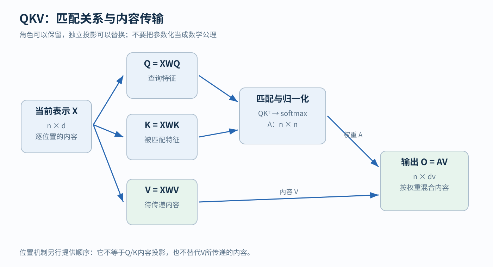
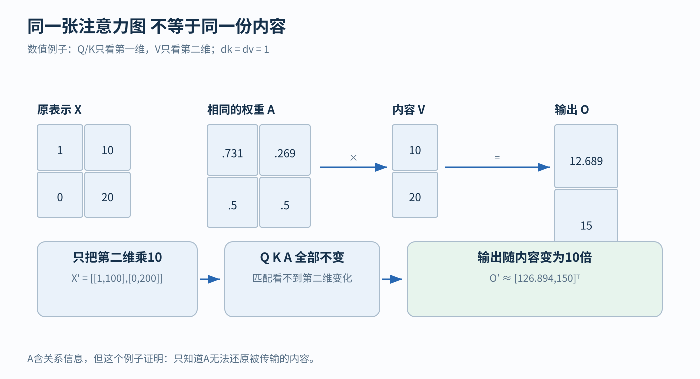
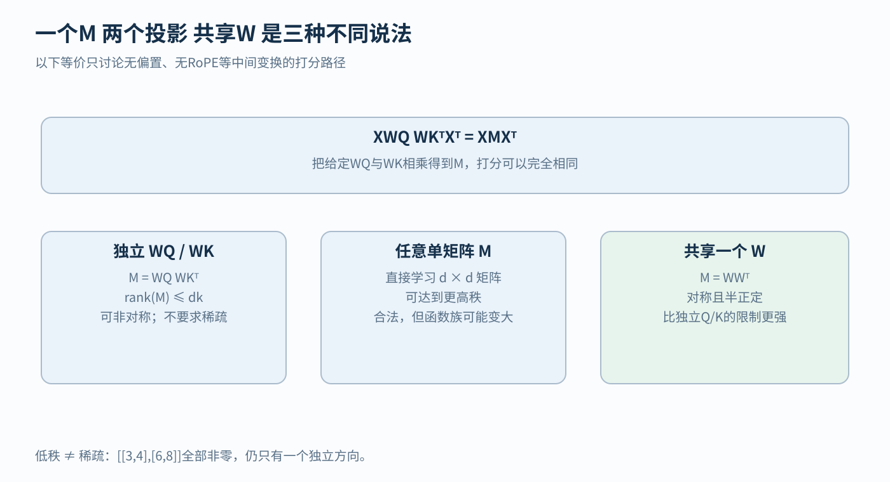
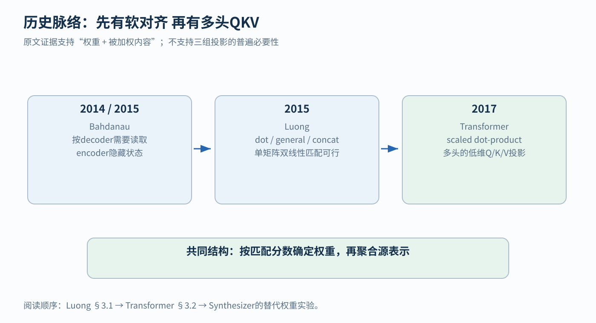

# QKV 为什么已经算出匹配 还要传递内容

假设机器人面前有两块候选落脚区域。它根据当前姿态判断：第一块区域值得参考的程度是 70%，第二块是 30%。现在，机器人知道该怎么抬脚了吗？

还没有。70% 和 30% 只是两块区域的相对权重。它还需要知道这两块区域的高度、坡度或其他地形信息。第一块高 10 厘米、第二块高 20 厘米，与第一块高 100 厘米、第二块高 200 厘米，显然不是同一件事，即使参考比例完全相同。

Q、K、V 就是在处理这两个不同的问题：**怎样决定参考谁，以及参考之后拿到什么。** 三个互相独立的可学习矩阵是最常用的实现。能够成立的数学形式、工程上常用的形式、在某个任务上表现最好的形式，是三个需要分别回答的问题。

本文从最小数字例子讲起。你不需要先读懂 Transformer，也不需要记得任何前面的聊天。文中的数值都是为说明运算而手工设计的教学例子。

## 1 先把查询 匹配和内容分开

继续想象机器人在查看地形。当前的身体状态形成一个“查询”：我现在准备向前迈步，想找适合这个动作的信息。每个地图单元提供两类东西。

第一类是便于匹配的描述，例如它在前方还是侧面、与当前脚的位置有什么关系。第二类是匹配后实际需要读取的信息，例如地形高度、表面方向，以及某些模型学出来、没有直接物理名称的特征。

在 attention 的术语里：

- Query，简称 Q，是查询所使用的特征
- Key，简称 K，是每条候选记录供查询匹配的特征
- Value，简称 V，是每条记录被选中或被赋予权重后，实际参加汇总的内容

不要被中文的“值”误导。Value 不一定是一个标量，也不表示“重要性分数”。它通常是一整行向量。重要性分数来自 Q 与 K 的比较，V 是被这些分数加权的对象。

这里的查询是神经网络里的一个向量，key 也是向量。数据库检索是帮助理解角色的类比；第 9.4 节会看到，记忆网络一脉把这个类比真正做成了模型，并且是 Transformer 原文引用的前作之一。

暂时把计算过程写成普通话：

1. 用当前查询与每条候选记录比较，得到一组匹配分数
2. 把分数变成可以用于混合的权重
3. 按这些权重把各条记录的内容加起来

这就是一次基本 attention 的核心。2017 年 Transformer 的定义同样把 attention 写成 query 与 key–value 对到输出的映射。[1] 接下来要解决的是：这些东西在计算机里究竟长什么样？

## 2 从一个数字到一张矩阵

### 2.1 向量是一条有固定顺序的数字记录

假设一个记录写成 [1, 10]。它有两个位置，因此叫二维向量。“二维”在这里表示两个数字，并不一定表示二维平面上的坐标。

为了方便理解，暂时约定第一个数字是一个用于匹配的特征，第二个数字是准备传递的数值。这是我们给教学例子设置的含义。真实神经网络的一维通常不是固定的“高度”或“词性”，而是训练中与其他维度共同起作用的特征。

如果再来一条记录 [0, 20]，把两条记录上下叠起来，就得到矩阵：

$$
X=
\begin{bmatrix}
1&10\\
0&20
\end{bmatrix}.
$$

矩阵可以先理解为一张数字表。这个 X 有两行、两列，形状是 2×2。每一行是一条记录，每一列是某一维特征。

下文统一用 n 表示记录或 token 的数量，用 d 表示每条记录的特征数量。所以 X 的一般形状是 n×d。本例 n=2、d=2，只是恰好相等；真实输入的 token 数与特征维度一般不同。

### 2.2 文本怎样变成这样的表

假设输入是一句“机器人看到台阶”。为了教学，我们把它分成三个 token：“机器人”“看到”“台阶”。真实 tokenizer 可能切得更细；token 不一定等于一个词。

Tokenizer 负责把文本转换成 token ID。假设三个 ID 分别是 7、4、9。ID 只是编号，大小没有语义。随后用这些编号到 embedding 表 E 中查对应的向量。比如：

$$
E[7]=[1,0],\qquad E[4]=[0,1],\qquad E[9]=[1,1].
$$

方括号 E[7] 表示“取表里编号为 7 的那一行”。如果词表有 10 个 token，每个向量有 2 维，那么整张 E 的形状就是 10×2。它是模型保存的参数表；本次输入只查其中三行。

查表后，本次输入的初始表示可以写成：

$$
X_0=
\begin{bmatrix}
1&0\\
0&1\\
1&1
\end{bmatrix}.
$$

下标 0 表示“初始阶段”，不是矩阵的一列。加入位置信息、通过若干层计算之后，我们得到当前层的 X。此时“台阶”那一行可能已经吸收了“看到”、前文场景和其他信息，所以它不再只是最初查出来的词向量。

这里有四个不同对象：tokenizer 是转换规则，E 是全词表的参数，X 是当前输入在当前层的运行时表示，V 是由 X 进一步构造出来的内容表示。

词袋则是另一种表示：它通常统计每个词出现了多少次。例如“猫追狗”和“狗追猫”可以得到相同的词频。Attention 里的 X、V 一行对应一个位置，同一个词出现两次就占两行。

图像 patch、地图单元或传感器时间窗口，也可以各自变成一行向量。后面的 QKV 运算对这些输入同样适用。

## 3 计算 QKV 之前 先学会三种小运算

### 3.1 线性变换是在重新组合一条记录的特征

我们希望从 [1,10] 中只取出第一维。可以把这条行向量乘以下面的列向量：

$$
[1,10]
\begin{bmatrix}
1\\0
\end{bmatrix}
=1\times1+10\times0=1.
$$

如果改成乘 [0,1] 的列形式，就会得到 10。乘 [2,3] 的列形式，则得到 1×2+10×3=32。

这个“每个输入乘一个系数，再相加”的过程，就是线性变换的基本动作。如果同时放入几列系数，就能同时生成几个新特征。在深度学习中常把这种可学习线性变换叫作“投影”；它不一定是几何课上那个必须垂直落到某个平面的正交投影。

因此，XW 就是用同一套系数 W，分别转换 X 的每一行。W 是训练中要调整的参数，X 是随着这次输入而变化的数据。

### 3.2 点积把两条特征记录变成一个分数

两条长度相同的向量，可以逐项相乘，再把结果相加。例如：

$$
[1,2]\cdot[3,4]=1\times3+2\times4=11.
$$

这个数叫点积。点积可以用于匹配，是因为某些对应维度同时较大时，乘积会推动总分增大；方向相反的分量则可能降低总分。

点积同时受方向和长度影响。如果把一条向量整体乘 10，点积也会乘 10。Q 和 K 的投影要通过训练，才能让这样的比较对任务有用。

### 3.3 Softmax 把一组分数变成一组权重

假设两个候选的分数分别是 1 和 0。一般的匹配分数可能为负，加起来也未必等于 1，需要先转换成混合比例。Softmax 采用如下转换：

$$
a_1=\frac{\exp(1)}{\exp(1)+\exp(0)},\qquad
a_2=\frac{\exp(0)}{\exp(1)+\exp(0)}.
$$

exp(s) 就是 e 的 s 次方，e 约为 2.718。由于 exp(1)≈2.718、exp(0)=1，所以：

$$
a_1\approx0.731059,\qquad a_2\approx0.268941.
$$

它们都是正数，加起来等于 1。分数更高的候选分到更多权重，但另一条记录没有被彻底抛弃。这种连续混合常被称为“软”选择。

一般地，若有 n 个分数 s₁ 到 sₙ，第 j 个权重为：

$$
a_j=\frac{\exp(s_j)}{\sum_{\ell=1}^{n}\exp(s_\ell)}.
$$

Σ 是“逐项相加”的符号；ℓ 只是相加时使用的计数编号。分母把所有候选的 exp 分数加起来。Softmax 得到的是模型内部的混合系数，不自动等于“这个对应关系为真的概率”。

如果所有分数相等，例如 [0,0]，权重就是 [0.5,0.5]。如果两个分数都增加 100，权重不会改变，因为分子和分母都多出同一个 exp(100) 因子。程序里常利用这个性质，先减去最大分数以改善数值稳定性。

## 4 从 X 到输出 完整算一次 attention

刚才的机器人例子里，查询来自身体状态，候选来自地图。接下来先算一种更简单的情况：查询和候选都来自同一组记录。每条记录既发出查询，也提供可被其他记录读取的内容，这叫自注意力（self-attention）。因此，两条记录会产生两个查询，我们要分别算出它们的输出。

现在回到两条记录：

$$
X=
\begin{bmatrix}
1&10\\
0&20
\end{bmatrix}.
$$

我们故意设计成：匹配只看第一维，传递的内容只看第二维。因此设置：

$$
W_Q=W_K=
\begin{bmatrix}1\\0\end{bmatrix},
\qquad
W_V=
\begin{bmatrix}0\\1\end{bmatrix}.
$$

这三个 W 都有 2 行、1 列。输入有 2 维，输出只有 1 维，所以每个投影都把二维记录变成一个数。本例取相同的 W_Q、W_K 是为了便于手算；标准 attention 中两者各自学习。

### 4.1 第一步 为每条记录生成 Q K V

按照刚才学过的线性变换：

$$
Q=XW_Q=
\begin{bmatrix}1\\0\end{bmatrix},
\qquad
K=XW_K=
\begin{bmatrix}1\\0\end{bmatrix},
\qquad
V=XW_V=
\begin{bmatrix}10\\20\end{bmatrix}.
$$

例如 V 第一行是 1×0+10×1=10，第二行是 0×0+20×1=20。

Q、K 各有两个位置，每个位置一个匹配特征。V 也有两个位置，每个位置一个内容特征。我们把匹配特征维度记成 d_k，把内容特征维度记成 d_v；此处 d_k=d_v=1。

### 4.2 第二步 让每个 query 与每个 key 比较

第一个 query 是 1。它与第一个 key 1 比较，点积是 1；与第二个 key 0 比较，点积是 0。

第二个 query 是 0。它与两个 key 的点积都是 0。

所以全部匹配分数组成：

$$
S=
\begin{bmatrix}
1&0\\
0&0
\end{bmatrix}.
$$

第一行表示“第一个查询怎样看待两个候选”，第二行表示“第二个查询怎样看待两个候选”。列的编号则表示被读取的源位置。

把所有两两点积一起计算，可以写成 QKᵀ。上标 T 表示转置，即把行变成列、列变成行。K 原来是 2×1，Kᵀ 就是 1×2；QKᵀ 因而得到 2×2 的所有位置对分数。

标准 scaled dot-product attention 还要把这个结果除以 √d_k。本例 d_k=1，除数就是 1，所以数字不变。[1] 缩放的原因稍后再讲。

### 4.3 第三步 每个查询单独分配自己的权重

分别对 S 的每一行做 softmax：

$$
A\approx
\begin{bmatrix}
0.731059&0.268941\\
0.5&0.5
\end{bmatrix}.
$$

这里“每行”很关键。第一行的两个数用第一行自己的分母，第二行使用第二行自己的分母。

因此，每一个查询都拿到一张“如何分配自己注意力”的清单。每行加起来是 1；每列则不要求加起来是 1。两个查询完全可以同时主要读取同一个源位置。

### 4.4 第四步 用权重混合内容

第一个查询的输出是：

$$
o_1=0.731059\times10+0.268941\times20
\approx12.689414.
$$

第二个查询的输出是：

$$
o_2=0.5\times10+0.5\times20=15.
$$

把输出叠起来，写成矩阵乘法就是：

$$
O=AV\approx
\begin{bmatrix}
12.689414\\
15
\end{bmatrix}.
$$

如果每条 V 有两个特征，就对两列分别做同样的加权求和。例如两个 value 是 [10,1] 和 [20,3]，第一个输出便是：

$$
0.731059[10,1]+0.268941[20,3]
\approx[12.689414,1.537882].
$$

同一行权重作用到一整条内容向量，而不是只挑其中一个数字。

**图 1 怎么读。** 从左边 X 出发，它分成三条路径。上面 Q 与中间 K 在“匹配与归一化”处汇合，产生权重 A；下面 V 不参加这一处的配对打分，而是把内容送到右下角。最后 A 和 V 在 O=AV 处汇合。沿着箭头看，就能发现 QKᵀ 只完成了中间的一步，尚未完成内容读取。

这张图省略了缩放、mask 等细节，强调的是两条不同的信息路径。

### 4.5 把整个过程收成一条公式

现在再看标准写法，就不必把它当咒语背诵：

$$
Q=XW_Q,\quad K=XW_K,\quad V=XW_V,
$$

$$
S=\frac{QK^\top}{\sqrt{d_k}}+B,\qquad
A=\operatorname{softmax}_{\text{每行}}(S),\qquad
O=AV.
$$

B 是加到分数上的矩阵，可以用来表示可见性限制；这里暂不加入其他偏置。允许访问的位置设为 0，禁止访问的位置可在数学上设为负无穷。因为 exp(负无穷)=0，被禁止的位置就不参与混合。实际程序由具体实现选择安全的数值处理方式，并须避免让一个有效查询整行都被屏蔽。

各个形状也可以从记录含义推出：X 为 n×d；W_Q、W_K 为 d×d_k；Q、K 为 n×d_k；W_V 为 d×d_v；V 为 n×d_v；S、A 为 n×n；O 为 n×d_v。A 的两条轴都是位置，O 的两条轴分别是位置与内容特征。

### 4.6 为什么还要除以 √d_k

一个点积要把 d_k 个乘积加起来。维度变多时，如果各项尺度相近，最终分数的波动通常会变大。分数差距过大，softmax 很容易变得极端：大部分位置接近 0，少数位置接近 1。

原始论文用一个简化假设解释缩放：如果 Q、K 的各坐标独立、均值为 0、方差为 1，那么点积的方差会随 d_k 增长；除以 √d_k 可以把这一增长抵消。[1]

这里的“方差”描述数值围绕平均值波动的程度。例如 d_k=64 时，除数是 8。它缩小了进入 softmax 的分数尺度，同一行分数的大小顺序保持不变。

真实训练的特征不必满足独立和单位方差。因此 √d_k 是有明确动机的标准设计，它的推导依赖上面的独立、单位方差假设。

## 5 为什么有了 A 仍不能省掉内容

把刚才 X 的第二列整体乘 10，得到：

$$
X'=
\begin{bmatrix}
1&100\\
0&200
\end{bmatrix}.
$$

由于 Q、K 只读取第一列，Q、K、S、A 全部保持不变。V 却变成 [100,200]ᵀ，输出也变成：

$$
O'\approx
\begin{bmatrix}
126.894142\\
150
\end{bmatrix}.
$$

**图 2 怎么读。** 上半部分是已经算过的例子。下半部分只修改 X 第二列，匹配通路看不到这次变化，内容通路却看得到，所以输出跟着改变。图里的小数经过四舍五入，精确计算应使用未截断的权重。

这个例子说明：同一个 A 可以对应多种内容。一个只收到 A、没有收到其他相关输入的后续函数，无法知道这次应该输出 12.689 还是 126.894：两种不同情况已经被压成了同一个输入。

A 本身含有谁与谁匹配、匹配强弱如何等输入相关的信息，也可以设计专门利用 A 的新模型。本节要说明的是分工：**A 决定从哪里读，V 决定读到什么；标准 attention 通过 AV 把两者合在一起。** 这条“读哪里”与“读到什么”的分工，后来在可解释性研究中有对应的实验证据，见 [注意力与 FFN 的分工谱系](../../foundations/relations/attention-ffn-division.md)。

这里还有一个常被省略的条件。真实 Transformer 通常有残差连接，会把原来的 X 一并传向后面。所以“只给 A 的模块丢失了哪些信息”和“整个有残差的网络还保留哪些信息”是两个问题，后者要看完整网络。

### 5.1 不学习 W_V 可以吗

可以。令 V=X，得到 O=AX。此时每条记录的原表示直接作为内容，不再额外学习一次 value 投影。

对刚才的 X 和 A：

$$
AX\approx
\begin{bmatrix}
0.731059&12.689414\\
0.5&15
\end{bmatrix}.
$$

输出保留两维内容：第一列是第一维特征的加权平均，第二列是原来的 10、20 的加权平均。计算完全合法。

因此，要分清两句话：“不额外学习 W_V”与“不再向汇总操作提供任何内容”。前者仍然有 value，只是把 X 直接当作 value；后者改变了模块实际能读取的信息。

W_V 的作用是让模型自己学习“这次 attention 适合传递 X 中的什么组合”，也可以改变内容维度。这是建模自由度与工程接口。

### 5.2 W_V 能不能挪到混合之后

如果内容路径上只有这些线性运算，矩阵乘法满足结合律：

$$
A(XW_V)=(AX)W_V.
$$

左边先为每条记录变换内容，再混合；右边先混合原始记录，再做同一套线性变换。只要尺寸兼容，两边完全相同。

注意 A 往往也是 X 的函数。这个等式挪动的只是内容路径上的线性变换；输入改变时 A 也会改变，整个 X→O 仍是非线性的。

如果后面还有输出投影 W_O，那么：

$$
OW_O=AXW_VW_O=AXC,\qquad C=W_VW_O.
$$

C 就是把两次连续线性变换合成后的矩阵。若在两次变换之间加入非线性、依赖内容的归一化等操作，一般就不能这样直接合并。

前面只做了一组完整的 QKV 计算，这叫一个注意力头。多头就是让几组这样的计算读取同一个 X，但使用各自的参数。各头算出自己的输出后，先把这些输出沿特征方向拼接，再用 W_O 混合。所谓把 W_O 按头分块，就是把它对应各头输出的那几行分别记为 W_{O,h}。

多头时，每一头 h 有自己的 A_h 和 W_{V,h}。把输出投影按头分块后，可写成：

$$
Y=\sum_h A_h X C_h,\qquad C_h=W_{V,h}W_{O,h}.
$$

这里 h 是头的编号，Σ_h 表示把各头贡献相加。各头的内容变换可以分别合并，但不同的 A_h 一般不能全部替换成同一个 A。两个头可能分别从不同位置读取信息，把它们强行变成同一套权重，会丢掉这种分工。

这些是前向计算的代数等价。合并后的参数数量、低秩限制、训练轨迹和缓存大小可能不同。

## 6 两个 QK 投影 能不能合成一个 M

可以，但先约定比较条件：没有线性偏置，没有在投影之后额外对 Q、K 做位置相关变换，使用同一个 X 作为 self-attention 输入。缩放因子和 mask 可以在得到相同原始分数后照常加入。

把 Q、K 的定义代入：

$$
QK^\top=(XW_Q)(XW_K)^\top.
$$

转置一个矩阵乘积时，顺序要反过来：

$$
(XW_K)^\top=W_K^\top X^\top.
$$

所以：

$$
QK^\top=XW_QW_K^\top X^\top=XMX^\top,
\qquad M=W_QW_K^\top.
$$

M 有 d 行、d 列。它直接规定“输入的一种特征怎样与另一个输入的特征共同打分”。对单个位置对 i、j 来说，分数是 x_i M x_jᵀ。x_i、x_j 都是 X 的某一行。

这个形式叫双线性形式：固定右边的 x_j 时，它对左边 x_i 是线性的；固定左边时，它对右边也是线性的。第 6.7 节和第 9.4 节会看到，word2vec 和记忆网络用的也是这种打分。

### 6.1 用数字确认 这不是近似

令：

$$
X=
\begin{bmatrix}1&0\\0&1\end{bmatrix},\qquad
W_Q=
\begin{bmatrix}1\\0\end{bmatrix},\qquad
W_K=
\begin{bmatrix}0\\1\end{bmatrix}.
$$

X 是单位矩阵：乘它不会改变兼容尺寸的向量或矩阵。因此 Q=[1,0]ᵀ，K=[0,1]ᵀ，得到：

$$
QK^\top=
\begin{bmatrix}0&1\\0&0\end{bmatrix}.
$$

另一方面：

$$
M=W_QW_K^\top=
\begin{bmatrix}1\\0\end{bmatrix}
\begin{bmatrix}0&1\end{bmatrix}
=
\begin{bmatrix}0&1\\0&0\end{bmatrix}.
$$

再计算 XMXᵀ，仍然得到同一张矩阵。两个投影确实可以合为一个 M。

### 6.2 合并 M 与共享同一个 W 的区别

刚才合并的是 W_QW_Kᵀ，其中 W_Q、W_K 仍然可以不同。

如果另作规定，让 W_Q=W_K=W，才会得到：

$$
M=WW^\top.
$$

这是一项新的约束。它会让 M 对称，即第 i 行第 j 列等于第 j 行第 i 列。没有 mask 和额外分数偏置时，原始分数 S=(XW)(XW)ᵀ 也对称，因为同一个向量与另一个向量的点积，交换顺序后不变。

前面的非对称分数矩阵 [[0,1],[0,0]]，便不能由这个共享 W 的形式精确产生。这里位置 1 很匹配位置 2，而位置 2 对位置 1 的原始匹配分数却不同。

这体现了独立 Q、K 的一种自由度：查询角色与被查询角色可以不同。“一个代词需要读取某个名词的信息”，不必等于“那个名词同样需要读取这个代词”（这是关系角色的直觉示例，训练后的头是否真的做代词消解要靠分析）。

### 6.3 半正定到底多限制了什么

共享 W 不仅带来对称性，还带来半正定性。对任意行向量 z：

$$
zMz^\top=zWW^\top z^\top=(zW)(zW)^\top=\lVert zW\rVert^2\ge0.
$$

符号 ‖u‖² 表示向量 u 各个数字的平方之和。例如 ‖[3,4]‖²=3²+4²=25，当然不会小于 0。“对任意 z，这个数都不为负”，就是此处半正定的含义。

它不等于“矩阵里每个数字都非负”。例如 W=[1,−1]ᵀ，则：

$$
WW^\top=
\begin{bmatrix}
1&-1\\
-1&1
\end{bmatrix}.
$$

其中有负数，但它仍然半正定。独立的 W_QW_Kᵀ 则一般既不必对称，也不必半正定。

### 6.4 分数对称 为什么注意力权重仍可能不对称

回看完整手算中的：

$$
S=
\begin{bmatrix}1&0\\0&0\end{bmatrix}.
$$

S 是对称的。但逐行 softmax 后：

$$
A\approx
\begin{bmatrix}0.731059&0.268941\\0.5&0.5\end{bmatrix}.
$$

A₁₂≈0.268941，A₂₁=0.5，它们不相等。原因是第一行归一化的分母为 e+1，第二行为 2。相同的原始跨位置分数 0，除以了不同的分母。

所以，严谨说法是：共享 Q/K 投影限制的是无额外偏置、无 mask 时的原始匹配分数；逐行 softmax 之后，最终 attention 权重仍可以不对称。因果 mask 还会进一步给访问加入方向。

### 6.5 直接训练任意 M 又有什么不同

给定两个投影后，把它们相乘得到 M，是同一计算的改写。直接把一个 d×d 的 M 作为自由参数训练，却未必拥有相同的限制。

区别出在“秩”。先不用背正式定义，可以把秩理解为矩阵里有多少个不能由其他方向拼出来的独立方向。

例如：

$$
W_Q=
\begin{bmatrix}1\\2\end{bmatrix},\qquad
W_K=
\begin{bmatrix}3\\4\end{bmatrix}
$$

产生：

$$
M=
\begin{bmatrix}3&4\\6&8\end{bmatrix}.
$$

第二行恰好是第一行的两倍，没有提供一个新的独立方向，所以这个非零矩阵的秩是 1。d_k=1 时，两列向量相乘只能产生这类秩至多为 1 的矩阵。

一般地：

$$
\operatorname{rank}(M)\le\min(d,d_k).
$$

rank 表示矩阵的秩。当 d_k 小于 d 时，这种因子化对 M 施加低秩限制。一个不受约束的 d×d 矩阵则可以达到秩 d。例如 2×2 单位矩阵的两行彼此独立，秩为 2，无法写成两个 2×1 向量的乘积。

反过来，只要 M 的秩不超过 d_k，就能找到合适的两因子来表示它。如果 d_k 已经不小于 d，任意 d×d 矩阵都可以这样分解。因此，“一个 M 比两个投影表达更强”必须附带维度与约束条件。

### 6.6 低秩与稀疏

上面的 M 四个元素全部非零，仍然只有秩 1。它是稠密而低秩的。

稀疏说的是大量元素为 0。一个很大的单位矩阵只有对角线为 1，其余全是 0，很稀疏；但每行提供一个独立方向，它可以是满秩的。

这两种性质解决的问题也不同。Q/K 的小维度因子化限制匹配空间；稀疏 attention 常用窗口或 mask 限制哪些位置之间允许连边。

QKᵀ 的秩至多为 d_k；softmax 是非线性操作，A 的秩可以更高。刚才 S 的第二行全为 0，秩只有 1；A 的两行却不互为倍数，秩为 2（softmax 前的秩上界不能搬到 softmax 后）。

**图 3 怎么读。** 顶部是一条等价关系，说明已给定的 W_Q、W_K 可以合并。下方三栏是在比较三种参数化：左栏是低维独立投影，中栏是自由 M，右栏是共享 W。先问“矩阵尺寸和约束是什么”，再问哪种形式覆盖哪些分数函数。哪种训练得最好，还取决于优化难度、泛化效果和实际运行时间。

### 6.7 word2vec 的两套词向量也是低秩双线性打分

`[结构]` 同样的结构在 2013 年的 word2vec 里已经出现。Mikolov 等的 skip-gram 模型（一句话：用一个词去预测它附近出现的词，以此学习词向量）给每个词准备两套向量：作为中心词时用“输入向量” v_w，作为被预测的上下文词时用“输出向量” v'_w。中心词 w_I 预测上下文词 w_O 的概率是[11]

$$
p(w_O\mid w_I)=\frac{\exp(v'^{\top}_{w_O}v_{w_I})}{\sum_{w}\exp(v'^{\top}_{w}v_{w_I})}.
$$

把全部输入向量叠成 V×d 的矩阵 W_in，输出向量叠成 W_out，V 是词表大小。用只在第 i 位为 1 的行向量 e_i 表示第 i 个词，则 v_{w_i}=e_iW_in，v'_{w_j}=e_jW_out，打分为：

$$
v'^{\top}_{w_j}v_{w_i}=e_iW_{\text{in}}W_{\text{out}}^\top e_j^\top=e_iMe_j^\top,\qquad M=W_{\text{in}}W_{\text{out}}^\top.
$$

这与第 6 节的 x_iMx_jᵀ、M=W_QW_Kᵀ 是同一个式子：两套独立的词向量就是两个独立投影，M 是 V×V 的矩阵，秩至多为 d，并且一般不对称。手算：词表 3 个词、d=1，取 W_in=[1,2,0]ᵀ、W_out=[0,1,3]ᵀ，得到

$$
M=\begin{bmatrix}0&1&3\\0&2&6\\0&0&0\end{bmatrix},
$$

秩为 1；M_12=1 而 M_21=0，“词 1 预测词 2”与“词 2 预测词 1”的分数不同，正对应第 6.2 节独立 Q、K 允许的非对称匹配。

两者的差别在 softmax 的范围和读出：word2vec 对整个词表做 softmax，输出就是预测概率；attention 对序列中的位置做 softmax，再用权重读取 V。

## 7 为什么实践中仍然常常保留 Q 和 K

第一，低维匹配可能更省计算。设有 n 条记录，每条 d 维，匹配维度是 d_k。计算 XW_Q、XW_K，再计算 QKᵀ，粗略需要：

$$
2ndd_k+n^2d_k
$$

次量级的乘法。前一项对应两次投影，后一项对应所有位置对的点积。若直接先算 XM，再乘 Xᵀ，粗略需要：

$$
nd^2+n^2d.
$$

例如 n=100、d=8、d_k=2，前者约为 23,200 次乘法，后者约为 86,400 次。这只是单头匹配部分的手算，不包含 softmax、内容混合、内存访问和其他层。真实速度还受到硬件、算子融合、多头布局和序列长度的影响。

第二，查询和记忆不一定来自同一组输入。机器人状态可以生成 query，地图可以生成 key 和 value，这叫 cross-attention。若有 2 个查询、5 个地图单元，Q 的形状可以是 2×d_k，K 是 5×d_k，A 就是 2×5，输出则是 2×d_v。

两边原始特征维度也可以不同：状态是 d_q 维，地图是 d_m 维，分别投影到同一个 d_k 维匹配空间即可。此时仍可写双线性形式，但中间 M 是 d_q×d_m 的矩阵。Q/K 接口把“两种输入如何成为可比较对象”表达得很清楚。

第三，多头允许多个不同的读取模式。同一层的一头可能从较近位置收集局部线索，另一头从别处读取不同信息。各头都使用自己的投影和权重，再汇总输出。这是设计允许的分工；训练后的头是否对应清晰的人类概念，要靠分析判断。

第四，自回归生成适合缓存已经算好的 K、V。模型生成一个新 token 后，新位置提供自己的 query，用它读取过去位置的 key 与 value。对于正常因果计算，过去位置的隐藏表示不依赖还没出现的未来，因此过去的 K/V 可以保留，不必每一步都重新计算。

KV cache 减少重复工作；下一步输入仍然要等当前输出产生。训练时已知完整正确序列，可以在因果 mask 下同时计算多个位置；生成时未知后续输入，通常仍逐步进行。并行性的主要来源是这一层各位置都从上一层表示开始计算。

### 7.1 哪些操作会改变合并 M 的条件

如果在线性投影中加入偏置，Q=XW_Q+b_Q、K=XW_K+b_K，展开 QKᵀ 会出现交叉项和常数项。简单的 XMXᵀ 不再完整；可以用附加常数维度等方法重新表达，但必须把变化写出来。

位置机制也有不同情况。把位置向量先加进 X，随后只做普通 Q/K 线性投影，前面的代数仍可用于这个新的 X。可是 RoPE 在投影后的 Q、K 上按照各自位置作旋转。[2] 不同位置对通常对应不同的旋转组合，不能一般地由同一个与位置无关的固定 M 取代全部位置对的计算。

位置机制解决“在哪里、相隔多远”；Q/K 投影解决“拿哪些特征来比较”。两者可以结合，顺序信息由位置机制提供。

## 8 用核回归理解 为什么匹配之后仍要读取 V

现在换一个不涉及神经网络的问题。我们测过两天的室外温度与饮料销量：

- 第一天，20℃，售出 10 杯
- 第二天，30℃，售出 30 杯

今天 22℃，想预测会卖出多少杯。一个朴素办法是：参考以前的日子，温度越接近今天，给那一天的销量越高权重。

如果今天与两天历史记录的相似程度分别取 0.8、0.2，那么预测值是：

$$
0.8\times10+0.2\times30=14.
$$

如果只知道相似程度 0.8、0.2，却不知道历史销量 10、30，能算出 14 吗？不能。温度用于匹配，销量才是被平均的结果。这个角色区分，与 Q/K 和 V 非常接近。

### 8.1 从这个例子写出 Nadaraya–Watson 形式

把历史数据记为一组 (x_j,y_j)。x_j 是第 j 条记录的输入，例如温度；y_j 是与它配对的观测结果，例如销量。今天的输入记作 q。

用 κ(q,x_j) 表示今天与第 j 条历史输入的非负相似权重。希腊字母 κ 读作 kappa，这里称为核函数。把这些权重归一化，再对结果 y_j 求和：

$$
\widehat m(q)=
\frac{\sum_j \kappa(q,x_j)y_j}
{\sum_\ell \kappa(q,x_\ell)}.
$$

m 上面的帽子表示“估计值”。分子是加权结果之和，分母是权重总和。这个形式来自经典的核回归估计，Nadaraya 与 Watson 在 1964 年分别发表了相关工作。[3][4]

“核”在这里是计算两条输入关系的函数（与卷积网络里的卷积核同名，含义不同）。“回归”表示预测数值结果。

例如用高斯权重：

$$
\kappa(q,x_j)=
\exp\left(-\frac{(q-x_j)^2}{2b^2}\right),
$$

b 是带宽，控制多远的记录仍值得参考。取 b=5℃，q=22℃，两天的未归一化权重是 exp(−0.08)≈0.923 和 exp(−1.28)≈0.278。归一化后约为 0.769 和 0.231，预测约为 14.63 杯。

b 较小，权重集中到温度非常接近的记录；b 较大，较远记录也会参与。这是一个局部加权估计。

### 8.2 怎样与 attention 的公式接起来

把历史输入 x_j 改名为 k_j，把历史结果 y_j 改名为 v_j，再选择：

$$
\kappa(q,k_j)=\exp\left(\frac{qk_j^\top}{\sqrt{d_k}}\right),
$$

代入归一化加权公式，就得到：

$$
o(q)=
\sum_j
\frac{\exp(qk_j^\top/\sqrt{d_k})}
{\sum_\ell\exp(qk_\ell^\top/\sqrt{d_k})}
v_j.
$$

这正是一个 query 的 softmax attention 输出。分数决定怎样权衡记录，value 决定各条记录送来什么。

因此，核回归视角有一个重要帮助：它把“匹配”和“读取配对结果”的必要角色解释得非常直接。后来的研究也明确从核平滑角度分析 Transformer 的 attention。[5][6]

self-attention 与刚才的温度预测有两处不同：它的 k_j、v_j 通常由同一条隐藏表示 x_j 学习生成，V 是模型自己构造的内容表示；多层网络还会不断改写这些表示，并结合其他模块完成任务。所以核回归对应的是单个 attention 读取这一步。

### 8.3 点积指数核 不总等于高斯距离核

高斯权重喜欢“距离近”；点积权重受到方向与向量长度共同影响。它们存在关系，但需要写全：

$$
qk^\top
=\frac{\lVert q\rVert^2+\lVert k\rVert^2-\lVert q-k\rVert^2}{2}.
$$

若缩放参数 τ>0，就有：

$$
\exp(qk^\top/\tau)=
\exp(-\lVert q-k\rVert^2/(2\tau))
\exp(\lVert q\rVert^2/(2\tau))
\exp(\lVert k\rVert^2/(2\tau)).
$$

τ 读作 tau，在标准缩放中可以取 √d_k。对一个固定 query，含 ‖q‖² 的因子在所有候选间相同，归一化时会抵消；含 ‖k‖² 的因子却可能随候选变化，通常不会抵消。

例如 q=0，两个 key 分别是 0 和 2，点积都为 0，softmax 给出等权重。但高斯距离核会偏好距离 q 更近的 key 0。因此，两者一般不能直接画等号。若所有 key 的范数相同等额外条件成立，才可得到相应的精确等价。

“用非负权重做核平滑”是比 Mercer 核（一句话：对称、半正定的核函数，经典核方法的标准要求）更宽的概念。独立 Q/K 投影允许非对称匹配；Wright 与 Gonzalez 的研究专门讨论了这种更广义的核视角。[6]

## 9 历史线索：从软对齐、记忆网络到多头 QKV

**图 4 怎么读。** 从左到右看三个具体研究阶段：先是让解码过程按需要读取源句各位置，再是比较不同打分方法，最后是将 attention 组织成 Transformer 的主要交互结构。下方共同点是“先确定权重，再汇总内容”。箭头表示这里讨论的发展线索；记忆网络一脉见第 9.4 节。

### 9.1 Bahdanau 的问题 是翻译时怎样不丢掉整句信息

早期一种 encoder–decoder 翻译方法，会先把输入句子压进一个固定长度向量，再让 decoder 生成译文。句子较长时，让一个固定向量承担全部细节可能形成瓶颈。

Bahdanau、Cho 与 Bengio 的工作让 decoder 在生成各步时，对 encoder 的多个位置状态计算对齐权重，再把这些状态加权得到当前需要的上下文。[7] 论文在 2014 年提交预印本，发表于 ICLR 2015。

此时已经有“用于决定读取比例的分数”和“实际被读取的源表示”，主体仍是循环网络，也还没有后来多头 Transformer 中那三组线性投影。attention 先作为 RNN 的附件出现（2014），到 2017 年才成为主体。

### 9.2 Luong 的一般打分 已经允许一个匹配矩阵

Luong 等人在 2015 年比较 dot、general、concat 等对齐打分函数。其中 general 形式为：

$$
\operatorname{score}(h_t,\bar h_s)=h_t^\top W_a\bar h_s.
$$

这里沿用论文的列向量记法：h_t 是当前解码位置的状态，带横线的 h_s 是源句位置 s 的状态，W_a 是一个可学习匹配矩阵。它就是双线性打分。换成本文统一的行向量写法，结构与 x_iMx_jᵀ 相同。[8]

得到权重以后，模型仍然加权源状态来构造上下文。它直接说明了两件事：打分可以用一个矩阵完成，打分完成之后仍然需要聚合内容。

### 9.3 Transformer 把多头投影组织成主体

Vaswani 等人在 2017 年提出 Transformer，用 attention 组织主要序列交互。多头机制让不同头分别把 query、key、value 投影到较小空间，计算各自输出，再组合起来。[1]

这是一种有实验支持的架构设计。学习设计时，应该区分作者做了什么、为什么这样设计、实验验证了什么，以及论文没有验证什么。

把本文提到的几种联系按性质分开：Nadaraya–Watson 与 attention 是 `[结构]` 对应，第 8 节已经用代数核验，Tsai 等与 Wright 等的核解释是后来的分析；Bahdanau、Luong 与下面的记忆网络是 `[历史]` 线索，有原文引用链为证。

### 9.4 记忆网络：把“按键读取”做成模型

第 1 节说数据库检索是一个类比。2014 到 2016 年，记忆网络一脉把这个类比一步步做成了可训练的模型，K 与 V 的分离就在这条线上出现。

`[结构]` Weston、Chopra 与 Bordes 2014 年提出记忆网络（Memory Networks）：模型把读过的句子存进一组记忆槽，回答问题时先给每条记忆打分，取出分数最高的一条。[12] 打分函数是 s(x,y)=Φ_x(x)ᵀUᵀUΦ_y(y)，Φ 把文本变成特征向量，U 是可学习的嵌入矩阵。按本文记号，这是 M=UᵀU 的双线性打分，正好是第 6.2、6.3 节“共享同一个 W”的对称半正定情形。这一版用硬性的 max 选出一条记忆，被读取的就是被打分的那条记忆本身。

`[结构]` Sukhbaatar 等 2015 年的端到端记忆网络把硬 max 换成 softmax，并为每条输入准备两套嵌入：矩阵 A 给出用于匹配的记忆向量 m_i，矩阵 C 给出被读取的输出向量 c_i。读取过程是 p_i=softmax(uᵀm_i)，o=Σ_i p_ic_i。[13] 这就是 K 与 V 的分离：u 是 query，m_i 是 key，c_i 是 value。

`[结构]` Miller 等 2016 年的 Key-Value Memory Networks 把这种分离写成显式的 (key, value) 记忆：寻址阶段用问题与 key 比较，读取阶段对 value 加权求和。作者写明，key 应设计成便于匹配问题，value 应设计成便于匹配答案；把 key 与 value 设成相同，就退回端到端记忆网络。[14] 例如知识库三元组“主语 关系 宾语”，key 是“主语+关系”，value 是“宾语”。这与第 1 节“匹配用的描述”和“实际读取的内容”的分工完全一致。

`[历史]` Transformer 原文在背景一节引用了端到端记忆网络，称它基于循环 attention 机制；正文把 attention 定义为“把一个 query 和一组 key–value 对映射到输出”。[1] 从记忆网络到 Transformer，由原文引用链能确认的一环是 Sukhbaatar 等 2015。后来 Geva 等分析 FFN 时，也正是拿端到端记忆网络的公式来对照，得出“FFN 是键值记忆”的结论（见 [注意力与 FFN 的分工谱系](../../foundations/relations/attention-ffn-division.md)）。[15]

## 10 与 RNN SVD SVM 分别有什么关系

### 10.1 线性注意力可以写成 RNN

RNN 的一个关键特点是逐步更新状态：当前隐藏状态依赖同一层上一步的状态。普通 Transformer 训练时，同一层多个位置可共同从上一层表示计算，因此没有相同的逐位置递推链。

但有些 attention 形式可以改写为递推。比如把相似度写成两个有限维特征向量的点积：

$$
\kappa(q,k)=\phi(q)^\top\phi(k).
$$

φ 表示把输入转换成另一组特征。为避免与本文的行向量习惯混淆，这一小节把 φ(q)、φ(k)、v_t、o_t 都写成列向量。设 φ 的输出有 r 维，那么 φ(q)、φ(k) 是 r×1，v_t、o_t 是 d_v×1。若采用因果读取，可以累计：

$$
T_t=T_{t-1}+\phi(k_t)v_t^\top,\qquad
z_t=z_{t-1}+\phi(k_t).
$$

t 是时间步；T 是 r×d_v 的矩阵，存储键特征与内容的累计配对信息；z 是 r×1 的向量，存储归一化所需的累计键特征。新的查询读取：

$$
o_t^\top=
\frac{\phi(q_t)^\top T_t}
{\phi(q_t)^\top z_t}.
$$

分子 φ(q_t)ᵀT_t 的形状为 1×d_v，分母 φ(q_t)ᵀz_t 是一个数，所以结果是行向量 o_tᵀ。分母需要有效且非零；具体方法会选择相应特征和数值处理。这个结构把“把过去所有项再求和一次”变成“在上次的统计量上加一项”。Katharopoulos 等人的 linear attention 给出了这类联系。[9]

最小的一维例子是：历史上 φ(k₁)=2、v₁=10，φ(k₂)=1、v₂=20。累计 T=2×10+1×20=40，z=2+1=3。若 φ(q)=1，读取结果是 40/3≈13.33。

这种精确的递推要求相似度能写成有限维特征的点积。标准 softmax 的 exp(qkᵀ) 展开成幂级数 Σ_n (qkᵀ)ⁿ/n! 后需要无穷多维特征，所以线性注意力要么换一个核，要么做近似；论文标题里的“Transformers are RNNs”指的是这类核。

`[结构]` 这个递推就是一个状态空间模型：状态是矩阵 T_t，转移矩阵是单位阵（旧状态原样保留、不衰减），每步写入 φ(k_t)v_tᵀ，读出用 φ(q_t)ᵀ。与 Mamba 对照，它缺少随输入变化的遗忘。见 [SSM、GNN 与 MoE](18-ssm-gnn-moe.md) 第 2 节和 [递推状态谱系](../../foundations/relations/recurrent-state.md)。

### 10.2 SVD 是一种矩阵分解工具

SVD 的全称是奇异值分解。它把一个矩阵分解为若干方向及其强度。对于秩不超过 d_k 的 M，可以利用这种分解构造出满足 M=W_QW_Kᵀ 的两因子。

如果写成 M=UΣRᵀ，可以取 W_Q=UΣ^(1/2)、W_K=RΣ^(1/2)，只保留非零奇异值对应的列，必要时补零列。Σ 是放着非负奇异值的对角矩阵，Σ^(1/2) 就把这些对角线数逐个开平方。

这个构造用来说明“低秩 M 一定可以拆成两部分”。标准 Transformer 训练直接优化 W_Q、W_K，参数也不必保持 SVD 中的正交结构。

### 10.3 SVM 是另一类学习方法

SVM 是支持向量机，经典分类形式围绕分类间隔等目标建立，可以使用核函数。它与 attention 共有的是“核或内积”这一工具；QKV 的分解用到的是 SVD。看到“QKV 来自某种 SVM 分解”的说法时，先核对作者指的是奇异值分解、核方法联系，还是另一个特定理论（SVD 与 SVM 缩写相近，含义无关）。

## 11 如何判断某个组件到底有没有必要

“能不能去掉 QK”至少有三种意思。

第一种是数学问题：能不能定义一个不使用 QK 点积的混合模块？可以。例如直接给定 A，或用另一个网络生成权重，再计算 AV。

第二种是函数等价问题：替换之后，能不能精确产生原模块对所有输入的同一个输出？这需要比较公式、维度和约束。

第三种是实验问题：换一种模块重新训练，能否在给定数据、预算和任务上达到相近结果？这要靠实验回答。表达范围更大也不保证有限数据下更好训练，参数更少也不保证实际更快。

Synthesizer 研究了不使用常规 query–key 两两点积的权重生成方式，并在若干任务中得到有竞争力的结果。[10] 但它的形式仍然包含类似 value 的内容分支 G(X)，例如 softmax(B)G(X)。B 是它生成的分数矩阵，G(X) 是从输入构造的待混合内容。它替换的是如何产生权重，内容分支仍然保留。

做一个可解释的消融实验，可以比较：

1. Q=K=X，固定使用原表示的点积
2. Q=XW、K=XW，共享投影
3. Q=XW_Q、K=XW_K，独立投影
4. 直接训练任意 M，用 XMXᵀ 打分
5. 保留原匹配，但改成 V=X
6. 保留内容通路，用另一种方式生成 A

这些设置应从头训练，或明确说明使用了怎样的适配训练。直接删除已经训练好的模型里的一个组件，再看到性能下降，主要说明原模型依赖了该组件；替代架构能否学会任务，要从头训练才能回答。

比较时要说明数据、任务、参数量、训练计算预算、优化器和训练步数是否匹配，并使用多个随机种子。除了任务分数，还应看延迟、峰值内存、缓存大小和序列变长后的表现。

对机器人而言，还要追问混合结果是否适合控制。例如两个可通行区域之间的平均位置，可能恰好落在障碍物上；两个地形高度的平均值也需要另外检查是否安全。Attention 给出信息混合机制，几何可行性与闭环安全需要由完整系统另行约束或验证。

## 12 用几个问题 检查是否真的理解了

**问题一：n=4、d=8、d_k=2、d_v=3 时，各矩阵多大？**

X 是 4×8，W_Q、W_K 是 8×2，Q、K 是 4×2。QKᵀ、S、A 是 4×4。W_V 是 8×3，V、O 是 4×3。合并后的 M 是 8×8，但秩至多为 2。

可以用一句话检查这些尺寸：每个查询对四个源位置分配权重，再把四条三维内容合成一条三维输出。

**问题二：只让 V 乘 10，Q、K 不变，输出怎样变化？**

A 不变，所以 AV 也乘 10。这就是内容分支与匹配分支的区别。若只是改 X，就不能直接断言 A 不变，还要看修改是否影响 Q/K。

**问题三：共享 W 是否必然让 A 对称？**

不必然。共享 W 让无额外偏置、无 mask 的原始自注意力分数具有对称性；逐行 softmax 的分母不同，最终 A 可以不对称。前文的 2×2 例子就是反例。

**问题四：为什么 M 可以合并 却仍然有人保留 Q/K？**

前向代数允许合并，不代表相同的低秩约束、参数化、计算安排和缓存代价都会自动保留。要同时看函数、训练和工程实现。

**问题五：删除 W_V 是否等于删除 V？**

不是。V=X 仍然提供被混合内容。删除某个线性变换，与让混合操作没有可读取内容，是不同改动。

**问题六：核回归视角解释了什么 又没有证明什么？**

它清楚解释了“比较输入以确定权重，再平均对应结果”的角色分工，也提供了可验证的公式联系，属于结构对应。它对应的是单次 attention 读取；整个 Transformer 还有多层表示学习等经典核回归没有的部分。历史来源要看第 9 节的引用链。

读到这里，再回头看 Q、K、V，最重要的就不再是三个字母，而是三个层次：输入里保存了什么，模型如何决定读取关系，以及被读取的信息如何真正到达输出。

## 与其他概念的关系

- `[结构]` `[经验]` **FFN 键值记忆与注意力–FFN 分工**：FFN(x)=f(xW_1)W_2 与 attention 的 softmax(qKᵀ)V 形式相同，只是 key、value 换成固定参数；第 5 节“A 决定读哪里、V 决定读到什么”的分工，在可解释性研究中有对应证据。见 [注意力与 FFN 的分工谱系](../../foundations/relations/attention-ffn-division.md) 与 [SSM、GNN 与 MoE](18-ssm-gnn-moe.md) 第 4.5 节。
- `[结构]` `[历史]` **记忆网络**：端到端记忆网络的两套嵌入 A、C 就是 K、V 的分离，Key-Value Memory Networks 把它写成显式键值对；Transformer 原文引用了端到端记忆网络（第 9.4 节）。
- `[结构]` **word2vec**：skip-gram 的输入、输出两套词向量给出 M=W_inW_outᵀ 的低秩、非对称双线性打分，与 M=W_QW_Kᵀ 是同一结构（第 6.7 节）。
- `[结构]` **核回归**：单个 query 的 softmax attention 就是以指数点积为核的 Nadaraya–Watson 估计（第 8 节）。
- `[结构]` **RNN 与状态空间模型**：线性注意力是转移矩阵为单位阵的矩阵状态递推（第 10.1 节）。见 [RNN](12-rnn.md)、[SSM、GNN 与 MoE](18-ssm-gnn-moe.md) 和 [递推状态谱系](../../foundations/relations/recurrent-state.md)。
- `[结构]` **图神经网络**：自注意力是全连接图上以 QK 匹配为权重的消息传递，GAT 把它限制在图的邻居上。见 [SSM、GNN 与 MoE](18-ssm-gnn-moe.md) 第 3.6 节。

## 参考文献

[1] Ashish Vaswani, Noam Shazeer, Niki Parmar, Jakob Uszkoreit, Llion Jones, Aidan N. Gomez, Łukasz Kaiser, Illia Polosukhin. 2017. *Attention Is All You Need*. NeurIPS. 重点为第 3.2 节 attention 与多头，第 3.5 节位置编码，以及第 4 节序列计算的比较。[论文](https://arxiv.org/abs/1706.03762)

[2] Jianlin Su, Yu Lu, Shengfeng Pan, Bo Wen, Yunfeng Liu. 2021. *RoFormer: Enhanced Transformer with Rotary Position Embedding*. arXiv 首版。重点为投影后的旋转及相对位置信息进入内积的方式。[论文](https://arxiv.org/abs/2104.09864v1)

[3] E. A. Nadaraya. 1964. *On Estimating Regression*. Theory of Probability & Its Applications, 9(1), 141–142. DOI: 10.1137/1109020。[原始论文](https://doi.org/10.1137/1109020)

[4] Geoffrey S. Watson. 1964. *Smooth Regression Analysis*. Sankhyā: The Indian Journal of Statistics, Series A, 26(4), 359–372。[原始论文](https://www.jstor.org/stable/25049340)

[5] Yao-Hung Hubert Tsai, Shaojie Bai, Makoto Yamada, Louis-Philippe Morency, Ruslan Salakhutdinov. 2019. *Transformer Dissection: An Unified Understanding for Transformer's Attention via the Lens of Kernel*. EMNLP-IJCNLP, 4344–4353. 从核平滑角度解释 attention，是第 8 节结构对应的分析来源。[论文](https://aclanthology.org/D19-1443/)

[6] Matthew A. Wright, Joseph E. Gonzalez. 2021. *Transformers are Deep Infinite-Dimensional Non-Mercer Binary Kernel Machines*. 讨论更广义的非 Mercer 核视角，阅读时注意它给出的具体结构条件。[论文](https://arxiv.org/abs/2106.01506)

[7] Dzmitry Bahdanau, Kyunghyun Cho, Yoshua Bengio. 2014 预印本，ICLR 2015. *Neural Machine Translation by Jointly Learning to Align and Translate*. 重点为固定长度编码瓶颈、对齐权重及上下文向量定义。[论文](https://arxiv.org/abs/1409.0473)

[8] Minh-Thang Luong, Hieu Pham, Christopher D. Manning. 2015. *Effective Approaches to Attention-based Neural Machine Translation*. EMNLP, 1412–1421. 第 3.1 节比较 dot、general、concat 打分，并定义源状态的加权上下文。[论文](https://aclanthology.org/D15-1166/)

[9] Angelos Katharopoulos, Apoorv Vyas, Nikolaos Pappas, François Fleuret. 2020. *Transformers are RNNs: Fast Autoregressive Transformers with Linear Attention*. ICML. 阅读时注意线性特征化与递推实现的条件。[论文](https://arxiv.org/abs/2006.16236)

[10] Yi Tay, Dara Bahri, Donald Metzler, Da-Cheng Juan, Zhe Zhao, Che Zheng. 2021. *Synthesizer: Rethinking Self-Attention for Transformer Models*. ICML, PMLR 139:10183–10192；预印本首次发表于 2020 年。重点为替代权重生成与保留的 G(X) 内容分支。[论文](https://proceedings.mlr.press/v139/tay21a.html)

[11] Tomas Mikolov, Ilya Sutskever, Kai Chen, Greg Corrado, Jeffrey Dean. 2013. *Distributed Representations of Words and Phrases and their Compositionality*. 重点为第 2 节式 (2)：输入向量 v_w 与输出向量 v'_w 的 softmax 打分。[论文](https://arxiv.org/abs/1310.4546)

[12] Jason Weston, Sumit Chopra, Antoine Bordes. 2014 预印本，ICLR 2015. *Memory Networks*. 重点为第 3.1 节的打分函数 s(x,y)=Φ_x(x)ᵀUᵀUΦ_y(y) 与硬性选取记忆。[论文](https://arxiv.org/abs/1410.3916)

[13] Sainbayar Sukhbaatar, Arthur Szlam, Jason Weston, Rob Fergus. 2015. *End-To-End Memory Networks*. NeurIPS. 重点为第 2.1 节的输入记忆（矩阵 A）与输出记忆（矩阵 C）。[论文](https://arxiv.org/abs/1503.08895)

[14] Alexander H. Miller, Adam Fisch, Jesse Dodge, Amir-Hossein Karimi, Antoine Bordes, Jason Weston. 2016. *Key-Value Memory Networks for Directly Reading Documents*. 重点为第 3 节的 key addressing 与 value reading。[论文](https://arxiv.org/abs/1606.03126)

[15] Mor Geva, Roei Schuster, Jonathan Berant, Omer Levy. 2021. *Transformer Feed-Forward Layers Are Key-Value Memories*. 重点为第 2 节式 (1)(2) 对 FFN 与神经记忆的对照。[论文](https://arxiv.org/abs/2012.14913)；库内文献卡 [arxiv-2012.14913](../../cross-domain/papers/arxiv-2012.14913/README.md)

## 批注

**易误读**
- 核回归视角对应单次 attention 读取；由形式相似推出“整个语言模型就是固定数据表上的核回归”或“attention 输出是某个真实条件均值的无偏估计”，是错误推论（第 8.2 节）。
- 公式相似本身不构成历史证据。本文的历史判断只依据原文引用链：Bahdanau、Luong、端到端记忆网络（第 9 节）。
- 共享 W 使原始分数对称，最终权重 A 仍可不对称（第 6.4 节）；QKᵀ 的秩上界不适用于 softmax 之后的 A（第 6.6 节）。
- Weston 等 2014 的记忆网络用同一个 U 打分，还没有 K、V 分离；分离始于端到端记忆网络的两套嵌入（第 9.4 节）。

**与其他论文的关联**
- 端到端记忆网络 → Transformer（原文背景一节引用）→ Geva 等把 FFN 与端到端记忆网络的公式对照，见 [注意力与 FFN 的分工谱系](../../foundations/relations/attention-ffn-division.md)。
- Katharopoulos 等的线性注意力与 Mamba 同属“转移不依赖状态”的线性递推，见 [递推状态谱系](../../foundations/relations/recurrent-state.md)。

**未核实 / 待验证**
- Transformer 原文的参考文献中没有 Miller 等 2016 的 Key-Value Memory Networks；“key–value”这一术语是否由该文传到 Transformer，本轮没有找到作者自述，因此第 9.4 节只把 Miller 等 2016 写成结构对应。

## 读完之后

本文所用的矩阵手算、缩放后的数值、共享 W 的反例和参数化比较均已在正文展开，无须中途打开其他模块。若想把 QKV 放回一个完整网络，可继续读 [Attention 与 Transformer](14-attention-transformer.md)；也可回到[学习导航](00-learning-navigation.md)选择下一主题。
