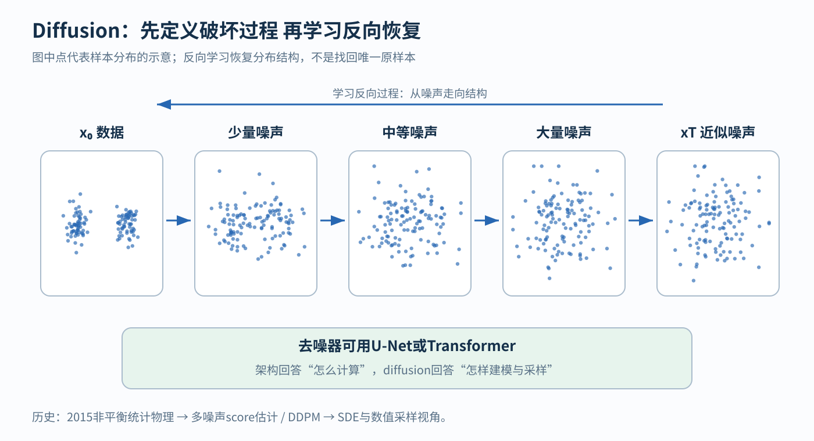
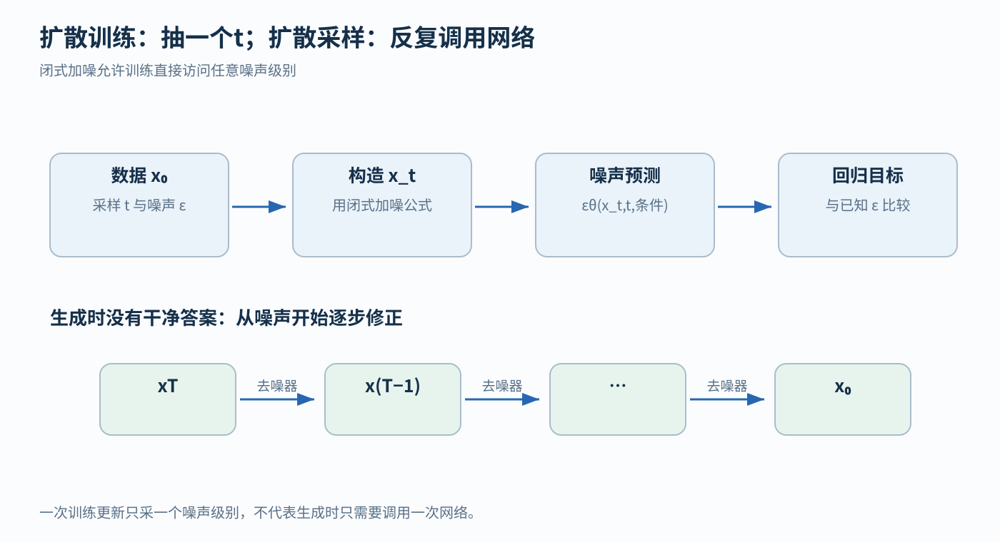
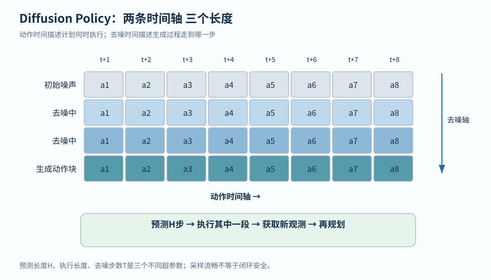

# Diffusion 从逐步加噪到条件生成

[返回学习导航](00-learning-navigation.md) · [架构模块地图](01-architectures.md)

## 先读两分钟

Diffusion把复杂生成拆成不同噪声级别上的反向修正。训练可随机采一个噪声级别，采样通常要多次调用网络。去噪时间与动作时间不同，所以生成动作块不等于逐动作自回归。

## 1 为什么从加噪开始

直接把简单随机变量映射为复杂数据，可能很难学习。Diffusion先规定一个容易执行的正向过程：逐渐给数据加噪，直至接近简单分布；再学习在每个噪声级别怎样反向恢复结构。重要的是，反向过程学习的是条件分布，不是把一份未知随机噪声精确减回去。

这不仅是事后的物理比喻。Sohl-Dickstein等2015年原文明确以非平衡统计物理为动机建立正反扩散过程。另一条线用score matching学习数据密度的梯度；Song与Ermon 2019年处理多噪声尺度score，DDPM 2020把扩散训练与去噪score matching联系起来，随后SDE框架统一了这些视角。[2015扩散原文](https://arxiv.org/abs/1503.03585)；[2019 score模型](https://arxiv.org/abs/1907.05600)；[DDPM](https://arxiv.org/abs/2006.11239)；[Score SDE](https://arxiv.org/abs/2011.13456)

## 2 训练怎样只采一个噪声级别

令原样本 x_0∈ℝ^D，β_t是噪声日程，α_t=1-β_t，ᾱ_t=Π_(s=1)^(t)α_s：

q(x_t | x_(t−1)) = N(√α_t x_(t−1), β_t I)
x_t = √ᾱ_t x_0 + √(1−ᾱ_t) ε；ε ~ N(0,I_D)

第二式能直接采出任意时刻的带噪样本，不必训练时真的跑完前面所有步。一个常见简化目标是：

训练损失 = E_(x0,t,ε) [ || ε − εθ(x_t,t,c) ||² ]

去噪网络输入是 D 维带噪样本、噪声级别 t及可选条件 c，输出 D 维噪声估计。也可预测 x_0、score或其他参数化，具体损失权重与采样器必须配套。上式是常用训练形式，不等于所有扩散模型都采用同一ELBO权重。

**最小例子。** 若一维数据有“向左绕行”和“向右绕行”两个峰，单次MSE回归可能预测中间的平均路线，恰好撞上障碍。扩散可以从不同初始噪声生成不同模式的完整动作样本。一次加噪后，即使知道噪声强度，也通常不能唯一判断它源自哪个模式；网络学习的是统计上合适的去噪方向，随机采样负责产生不同可能结果。

## 3 score SDE和自回归的关系

score是 s_t(x)=∇_xlog p_t(x)，维度与 x相同，是密度上升方向，不是“质量评分”。在上述Gaussian加噪和平方误差最优估计条件下，score与最优噪声预测通过 s_t(x_t)=-ε^*(x_t,t)/√(1-ᾱ_t)对应。

连续时间可写 dx=f(x,t)dt+g(t)dW_t。反向时间SDE的漂移包含 f-g^2∇_xlog p_t(x)，并沿时间递减积分；相关的probability-flow ODE则提供确定性轨迹视角。这解释了为什么数值积分器、步长和求解误差会影响生成速度与质量，但不能把神经网络自动等同于真实物理场。

采样时从 x_TsimN(0,I)开始，反复调用网络和更新规则获得 x_(T-1),…,x_0。这些步骤沿**噪声级别**推进，往往每步同时更新整个样本；token自回归沿**数据位置**推进，通常固定已生成前缀、追加下一个token。两者都可有序列化计算，也可用概率链式分解描述，但这不足以把常规diffusion统称为token AR。

## 4 后续演变与机器人选择

DDIM等改变采样路径，可用更少步骤；latent diffusion先把图像压缩到自编码器潜空间，再扩散，降低高分辨率生成成本。这里VAE式压缩与diffusion可以协作，没有“谁取代谁”的必然关系。[DDIM](https://arxiv.org/abs/2010.02502)；[Latent Diffusion](https://arxiv.org/abs/2112.10752)

机器人Diffusion Policy把 x_0换成动作块 A∈ℝ^(H× d_a)，条件是当前视觉和本体观测；生成未来一段动作，执行其中一部分，再根据新观测重新规划。动作时间 1… H与去噪时间 1… T是两条不同轴。去噪器可用CNN或Transformer，预测动作块也不要求按动作时刻逐个自回归。[Diffusion Policy原文](https://arxiv.org/abs/2303.04137)

**何时选。** 输出有多种合理模式、维度高、希望条件生成时，diffusion很有用。限制是多步网络调用的延迟、训练数据外的行为以及约束满足的不确定性。能采出流畅动作不等于碰撞安全、动力学可行或闭环稳定；真实部署应另行检查控制频率、动作界限、碰撞与安全机制。

## 相关论文精读

### 2015原文 物理联系是明示动机

[Sohl-Dickstein等](https://arxiv.org/abs/1503.03585)从复杂分布到简单分布的正向破坏、再学习逆过程入手。把每步随机变量、转移分布与学习部分标出来。它提供非平衡统计物理的真实历史联系，而“像擦掉图片噪声”的日常比喻只负责直觉。

### DDPM 把训练目标与采样分开

[Ho等2020](https://arxiv.org/abs/2006.11239)重点读前向闭式加噪、噪声预测参数化与训练/采样算法。训练一次采一个t不代表推理只运行一步；简化MSE与完整变分目标的权重关系也需分清。

### Score SDE与Diffusion Policy 连接数学与机器人

[Score SDE](https://arxiv.org/abs/2011.13456)看反向随机微分方程如何依赖score，以及ODE采样联系；[Diffusion Policy](https://arxiv.org/abs/2303.04137)看动作块的维度、观测条件、receding horizon和采样开销。动作块预测长度、执行长度、去噪步数是三个不同超参数，不能只用“序列长度”含糊代称。

## 自测与最小实验

设动作块包含8个时刻、每步7个动作量，去噪网络输出形状就是8×7。若用了10次去噪调用，是否意味着执行10个动作？不是，10是求解步数，8是预测动作时间长度，实际执行多少还取决于控制方案。固定示范数据，对比确定性回归与条件扩散在双峰动作上的输出，再检查每种模式是否真的安全可行。
