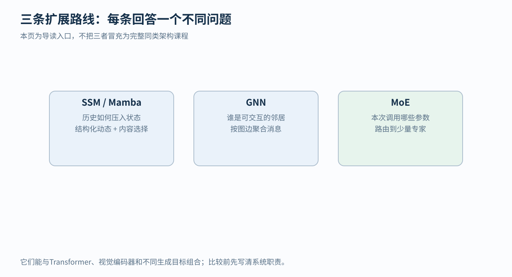

# SSM GNN 与 MoE 的三个独立入门问题

## 1 先分清它们各自在解决什么

面对一个机器学习系统，至少可以问三个不同的问题。

第一，传感器一直送来新数据，我们怎样用有限内存保存有用历史？这会引出状态空间模型 SSM，以及在其中加入内容选择机制的 Mamba。

第二，输入不是整齐的一排文字或一张像素网格，而是一组互相连接的对象，应该让谁与谁交换信息？这会引出图神经网络 GNN。

第三，想增加模型容量，却不想每次把所有参数都运行一遍，能不能只调用其中一部分？这会引出混合专家 MoE。

它们不是三位竞争同一岗位的候选人。一个系统可以同时用图表示对象关系、用状态保存时间信息、再用专家路由选择计算模块。本章把三条路线分别讲清楚，每一节都从小例子开始，不要求先读另一篇架构课。

**怎样读这张图？** 左框问“历史如何压进状态”，中框问“谁是可交互的邻居”，右框问“本次调用哪些参数”。三个框不是先后升级顺序。图中“导读入口”表示还不能代替各方向的完整研究课程；下面会把入口处最关键的计算真正展开，而不是只留下三个术语。

## 2 SSM 先从一个会缓慢降温的房间开始

### 2.1 状态是什么

假设我们每分钟看一次房间。即使这一分钟没有开暖气，房间也不会瞬间回到室外温度，因为墙壁和空气保留了热量。

先做一个简化模型：

h_t=0.8h_(t−1)+0.2u_t

h_t 表示第 t 分钟末的温度偏差，u_t 表示这分钟输入的加热强度，数值已经适当缩放。这里只是人为设定的教学系统，不是实际房间的标定方程。

设 h_0=0，依次输入 u=[1,0,0]：

h_1=0.8×0+0.2×1=0.2

h_2=0.8×0.2+0.2×0=0.16

h_3=0.8×0.16+0.2×0=0.128

虽然第二、三步停止加热，状态仍带着过去输入的影响。“状态”就是为下一次更新保存的内部量，不必把此前每一分钟的原始输入都重读一遍。

如果房间由空气、墙体等多个部分决定，可以用多个数保存状态。线性离散状态空间模型的一般形式是：

h_t=Āh_(t−1)+B̄x_t

y_t=Ch_t+Dx_t

这里 x_t 是本步输入，h_t 是内部状态，y_t 是可读出的输出。若输入有 m 维、状态有 n 维、输出有 p 维，则：

- Ā 是 n×n，描述旧状态怎样影响新状态
- B̄ 是 n×m，描述输入怎样进入状态
- C 是 p×n，描述怎样从状态读出输出
- D 是 p×m，描述输入是否直接传到输出

大写字母表示矩阵，乘法仍是对应乘积求和。D 可以设为 0；它不是每个模型都必须使用的额外记忆。

横线提醒我们这里用的是离散时间系数。连续时间版本常写作 dh/dt=Ah+Bx，随后根据采样间隔转换成离散更新。以一维无输入系统 dh/dt=−λh 为例，λ>0 是衰减速率，Δ 是采样时间间隔。经过 Δ，精确保留系数为 exp(−λΔ)。Δ 越大，相同物理衰减跨过的时间越长。

### 2.2 为什么同一状态方程又像一个长卷积

把初始状态设为 0，连续代入：

h_1=B̄x_1

h_2=ĀB̄x_1+B̄x_2

h_3=Ā²B̄x_1+ĀB̄x_2+B̄x_3

再用 C 读出，并暂时令 D=0：

y_3=CĀ²B̄x_1+CĀB̄x_2+CB̄x_3

发现了吗？越早的输入，多经过几次 Ā；每个过去输入都乘一个由“相隔多久”决定的系数。设 K_j=CĀ^jB̄，则：

y_t=Σ_(j=0)^(t−1) K_j x_(t−j)

Σ 表示把这些项相加。这是沿时间的一种卷积表示。**递推计算与卷积计算，在固定系数、相应初始条件下，可以是同一模型的两种算法。**

房间例子的时间核是 [0.2,0.16,0.128,…]。对输入 [1,2,0]，递推得到 h_1=0.2，h_2=0.56，h_3=0.448。展开计算第三步则为：

0.128×1+0.16×2+0.2×0=0.448

两条路得到相同结果。若初始状态不为零，还要加上它传播到当前的贡献；若系数随输入改变，就不能直接使用这条固定卷积核。

### 2.3 S4 与 Mamba 分别多做了什么

神经网络里的 SSM 不必把状态解释成温度或速度。它可以学习一组对预测有用的内部动态，再与非线性、通道混合等模块组成更大网络。

朴素的大状态矩阵可能很贵。S4 通过结构化的状态矩阵参数化和高效计算方法，让长序列状态空间层更可训练、更可计算。读到“structured”时，要问具体约束了哪个矩阵、因此节省了哪一步，而不是只理解成网络有几个方框。[1]

固定系数还有另一个问题：面对“这是重要指令”和“这只是无关填充”，同样的线性规则不能按内容选择保留程度。

Mamba 让部分 SSM 参数依赖当前输入，尤其包括步长相关量 Δ、输入映射 B、读出 C。离散化后的状态转移也因此随输入改变。它还设计了适合硬件的并行 scan 算法，处理这种不再适用固定卷积核的递推。[2]

“选择”可先用这个教学公式理解：

h_t=(1−g_t)h_(t−1)+g_t x_t

g_t 在 0 到 1 之间，由输入决定。旧状态为 0.7、无关输入 x_t=−0.6，若 g_t=0.01，则 h_t=0.687；若重要新信息使 g_t=0.9，则 h_t=−0.47。前者几乎保留旧状态，后者大幅更新。这个标量门控例子解释内容选择的目的，不是完整 Mamba 实现。

scan 也不是把时间关系删掉。对可组合的更新，计算可以重新分组并行处理；需要专门算法才能兼顾依赖关系和硬件效率。模型总延迟还取决于状态维度、内存访问及实际实现，不应把论文中的某个速度比当成任何硬件上的常数。

### 2.4 与控制理论是直接结构联系但不是同一个滤波器

状态空间形式在控制与估计中有明确历史基础，Kalman 的工作就是重要原始文献之一。[3] S4、Mamba 直接使用这类数学结构，这比随口说“像人的记忆”更具体。

不过状态空间模型是一种系统描述，Kalman 滤波还需要噪声假设、协方差传播、测量更新等。学出 Ā、B̄、C，并不自动补齐这些条件，更不保证隐藏状态具有物理单位。

适合考虑 SSM 的情形包括长流式序列、希望运行时状态内存不随已读长度持续增大。也要承认：把历史压进固定状态，与随时精确取回任意过去原文之间存在信息保留的权衡。训练内存也不等于部署时只保存状态的内存。

## 3 GNN 先让三个互相连接的对象交换信息

### 3.1 图不是画出来的曲线

这里的“图”是 graph，由节点与边组成。节点表示对象，边表示关系。

例如机械臂的三个部件 A、B、C 按 A—B—C 连接。节点特征可以是关节角、速度或类型；边特征可以是连接类型、相对长度或测量信息。图只规定谁与谁相关，不能代替这些物理量本身。

如果给每个节点一个数：

h_A=1，h_B=2，h_C=4

我们先人为规定一条更新规则：把自己与直接邻居的数取平均。邻居就是有一条边直接连接到的节点。

第一轮同时更新：

A 的邻居只有 B，因此 h'_A=(1+2)/2=1.5

B 的邻居是 A、C，因此 h'_B=(2+1+4)/3=7/3≈2.3333

C 的邻居只有 B，因此 h'_C=(4+2)/2=3

强调“同时”：三项都用旧值 [1,2,4]。不能算出 A 的新值后，马上偷偷把它当作同一轮 B 的输入。

第一轮 A 还看不到 C 的原值，但第二轮 A 会通过 B 间接受到 C 的影响。两轮更新带来了两跳范围的信息；“跳”是沿边走一步。

### 3.2 从固定平均到可学习消息传递

真实 GNN 通常不只是做平均。它先计算邻居给自己的消息，再汇总消息，最后更新节点表示：

m_i=Σ_(j∈N(i)) φ(h_i,h_j,e_ij)

h'_i=ψ(h_i,m_i)

现在把每个符号落到刚才的图：

- i 是准备更新的节点，例如 B
- N(i) 是其邻居集合，此时为 {A,C}
- h_i、h_j 是当前节点与邻居的状态向量
- e_ij 是这条边的特征
- φ 是可学习的消息函数，可由小神经网络实现
- m_i 是所有邻居消息的汇总
- ψ 是可学习的更新函数，结合自己旧状态与汇总消息

φ 不是“相邻就自动有意义”的魔法。不同边类型怎样编码、有没有方向、是否包含相对位置，都决定它能学到什么。

刚才的平均例子可看成一个特例：消息就是邻居当前值，更新时把自己的值加入并除以总个数。更一般的模型可以用求和、均值或带权重的聚合，具体效果与归一化方式有关。[4]

### 3.3 为什么邻居顺序不能随便影响结果

A、C 作为 B 的两个邻居，先列 A 还是先列 C，本来不应改变关系图。求和满足 1+4=4+1，因此对邻居排列不敏感。

如果只是重新编号全部节点，并同步重新排列特征和边，合理的节点预测应跟着对应节点重排，这叫置换等变。若输出整张图的一个数，例如分子的某项性质，通常希望最终读出对节点编号不敏感，叫置换不变。

这与三维旋转是不同问题。节点编号换了不影响输出，不代表把坐标整体旋转后模型一定满足正确几何变换。处理机器人姿态还需要另外设计或验证几何结构。

### 3.4 多堆几层是否总会更好

更多层可以传播更远的信息，但也可能遇到两个不同现象。

过平滑：反复混合后，不同节点的表示越来越相似，原本该区分的节点变得难以区分。

信息压缩瓶颈：远处许多节点的信息都挤过少数边，最后压进固定大小的向量，重要细节可能难以传过来。这常与 over-squashing 一词联系起来，和“所有表示变得相似”不是完全同一个问题。

这些是需关注的风险，不是任何层数、任何 GNN 都必然发生的结论。图结构、更新方式、残差通路等会改变行为。

训练目标仍由任务决定。可以预测每个节点的类别、某条边是否存在，或整张图的性质。消息函数与更新函数根据预测损失学习；“用了图”不自动告诉我们应该优化哪个答案。

### 3.5 历史和机器人边界

Scarselli 等的 GNN 工作研究直接处理图结构的神经模型；其早期状态迭代形式与今天常用的有限层消息传递有区别。[5] Gilmer 等 2017 年的 MPNN 框架统一描述了多种已有图模型，并在分子任务上研究具体变体。它不是“图神经网络第一次出现”的唯一发明节点。[4]

把 GNN 理解为从规则像素邻域走向任意图邻域，是方便的数学对照；并不能据此断言全部 GNN 历史都是从 CNN 单线推导而来。

在位姿图上跑一个 GNN，也不等于已经求解几何优化。位姿图优化通常有明确的残差、噪声权重和坐标约束；GNN 可能只是在预测边的可信度或提供初始值。应说清它接手了哪一步，是否保留旋转和平移结构，以及坐标原点等自由选择是否被正确处理。

## 4 MoE 先问为什么每次都要启动所有参数

### 4.1 专家不是几位真人

普通稠密层处理一个输入时，通常要调用这一层的整套参数。假设有很多种输入模式，我们想增加模型容量，却不希望每个输入都执行所有新增模块。

MoE，即 mixture of experts，混合专家，把一部分计算分成多个子网络，并由路由器决定当前输入调用哪些子网络。专家就是这些参数模块，不是被赋予独立身份的真人，也不保证一个专门懂数学、另一个专门懂历史。[6][7]

先用三个非常小的“专家函数”演示：

f_1(x)=2x

f_2(x)=x+1

f_3(x)=−x

它们是为手算规定的函数；真实专家通常是可学习的多层网络。

输入 x=2，路由器给三个专家的概率为 [0.6,0.3,0.1]。如果使用三个专家加权：

y=0.6×4+0.3×3+0.1×(−2)=3.1

这说明“混合”是什么意思，但仍运行了全部专家，尚没有得到稀疏计算的好处。

### 4.2 只取前两个专家怎样算

设只选择分数最高的两个，叫 top-k 路由，这里 k=2。我们明确采用“保留后重新归一化”的规则：

g_1=0.6/(0.6+0.3)=2/3

g_2=0.3/(0.6+0.3)=1/3

第三个专家不运行。输出：

y=(2/3)×4+(1/3)×3=11/3≈3.6667

为什么与刚才 3.1 不同？因为我们改变了调用集合，并重新分配权重。稀疏路由不是把全部专家答案算完再假装少用了几个。不同模型也可能使用不同的权重归一化方式，不能只看“top-2”就假定公式完全相同。

一般写成：

y=Σ_(e∈S(x)) g_e(x) f_e(x)

S(x) 是路由器为输入 x 选中的专家集合；e 是专家编号；f_e 是专家输出；g_e 是组合权重。所有被组合的专家输出必须具有兼容形状，例如都是 d 维向量。

### 4.3 路由器怎样产生分数

一个常见路由器对输入做线性变换，得到每位专家的分数，再用 softmax 转成非负、总和为 1 的权重：

p_e=exp(r_e)/Σ_j exp(r_j)

r_e 是第 e 个分数。指数 exp 放大相对较大的分数，分母使总和为 1。随后按模型的具体规则选择少量专家、计算权重、派发输入并合并输出。

路由器参数与专家参数一起从任务损失学习，但 top-k 的离散选择带来优化细节：被选中的路径如何获得梯度、未选中专家怎样获得训练机会，都不能用一句“正常反向传播即可”带过。稀疏门控 MoE 的原始工作讨论了路由噪声和负载均衡等机制。[7]

可以把路由器类比为分诊台，但这只是功能比喻。它没有人类专家科室的天然语义，学习结果也不一定稳定地对应可解释主题。

### 4.4 总参数多不代表每次计算同样多

假设有 8 个专家，每个 100 万参数，每个输入只选择 2 个。

专家总参数是 800 万，本次涉及的专家参数约 200 万。还要加上路由器及其他共享模块，所以不能直接说“模型总共 800 万，但只需 200 万模型的全部成本”。

所有专家权重仍需存储，训练还会涉及优化器状态。若专家分散在不同设备上，输入要被发送到对应设备、结果再汇回。通信、等待、内存读写都可能成为瓶颈。

再想一个极端：本批次 100 个输入几乎都被送到同一个专家。其他设备闲着，这一个专家排队。负载均衡的目的，是避免路由集中到少量模块，让模型容量与硬件资源真正被利用。

一些实现对专家一次可接收的输入数设置容量上限；超过上限后怎样处理，需要看具体方案，不能把“丢弃”“改路由”或“继续排队”中的任何一种说成所有 MoE 的统一行为。

### 4.5 它放在完整模型的哪里

MoE 常被用于替换 Transformer 的前馈子层，也可用于其他架构。输入和输出形状可以保持相同，内部却由路由器选择少量专家。

因此“Transformer 还是 MoE”常是一个分类层次混乱的问题：系统完全可以是带 MoE 子层的 Transformer。MoE 也不自行决定模型是做分类、预测下一个词还是别的任务。

更早的混合专家工作已经研究门控网络与多个子网络的分工；1991 年的 Adaptive Mixtures of Local Experts 是直接证据。[6] 2017 年稀疏门控工作重点推进大容量与条件计算，不宜把当代大模型中的专家路由说成此前完全不存在的新概念。[7]

## 5 三个模型各做一次小实验

### SSM 实验

使用 h_t=0.8h_(t−1)+0.2x_t、h_0=0，输入 [1,2,0]。先递推得到 [0.2,0.56,0.448]，再用时间核 [0.2,0.16,0.128] 核对第三步。

随后人为让某一步系数变化，检查同一固定核是否仍可使用。答案通常是否；这能帮助理解为什么内容选择改变了计算路径。

### GNN 实验

用 A—B—C 与节点值 [1,2,4]，同时更新得到 [1.5,7/3,3]。第二轮 A 的值为：

(1.5+7/3)/2=23/12≈1.9167

此时 A 已间接受到初始 C 的影响。再交换节点编号并同步更新边，检查结果是否只是对应重排。不要只交换特征而保持旧边不动，那会改变问题本身。

### MoE 实验

用本章三个函数，分别比较全部专家、top-2 与 top-1。若 top-1 选择专家 1 并令其权重为 1，x=2 时结果就是 4。

再构造一批输入，记录每个专家收到多少次任务、总计算和等待时间。输出质量、负载分布、端到端耗时要一起看，只统计激活专家数不足以证明系统更快。

## 6 论文精读要拿回什么

**S4。** 先找到连续状态方程与离散化，再把递推展开为卷积。检查状态矩阵的结构化假设解决了哪些计算问题，区分数学等价、渐近复杂度与具体硬件耗时。[1]

**Mamba。** 对照固定 SSM，标出哪些量随输入变化，解释这为什么打破固定卷积核；再读选择任务和 scan 的实现动机。不要仅从“线性时间”四个字推断任意场景中的绝对速度。[2]

**Kalman。** 对照状态空间形式之外的噪声、协方差和估计步骤。读完应能说清“使用状态空间方程”与“实现某个统计滤波算法”的差别，而不是把两个名字互换。[3]

**MPNN 与早期 GNN。** 选一张三节点图，标出消息函数、节点更新和整图读出。再比较早期迭代状态形式与有限轮传播。检查节点重新编号时预测怎样变化，以及几何旋转是否属于论文真正保证的性质。[4][5]

**混合专家两条原始工作。** 读早期工作时找清门控如何划分训练样本；读稀疏门控工作时额外记录专家总数、每次选几个、负载均衡办法与通信成本。不要把“专家”这个名字当作模型已经自动获得人类专业分工的证据。[6][7]

读完本章，最重要的不是背出七篇论文，而是面对系统图时能问对问题：这一步在保存历史、交换关系信息，还是选择参数计算？问题分清后，公式和工程成本才有落脚点。

## 参考资料与继续阅读

[1] Gu, A., Goel, K., & Ré, C. (2021/2022). Efficiently Modeling Long Sequences with Structured State Spaces. https://arxiv.org/abs/2111.00396

[2] Gu, A., & Dao, T. (2023/2024). Mamba: Linear-Time Sequence Modeling with Selective State Spaces. https://arxiv.org/abs/2312.00752

[3] Kalman, R. E. (1960). A New Approach to Linear Filtering and Prediction Problems. https://people.math.harvard.edu/archive/116_fall_03/handouts/Kalman1960.pdf

[4] Gilmer, J., et al. (2017). Neural Message Passing for Quantum Chemistry. https://arxiv.org/abs/1704.01212

[5] Scarselli, F., Gori, M., Tsoi, A. C., Hagenbuchner, M., & Monfardini, G. (2009). The Graph Neural Network Model. https://papers.baulab.info/papers/Scarselli-2009.pdf

[6] Jacobs, R. A., Jordan, M. I., Nowlan, S. J., & Hinton, G. E. (1991). Adaptive Mixtures of Local Experts. https://www.cs.toronto.edu/~hinton/absps/jjnh91.pdf

[7] Shazeer, N., et al. (2017). Outrageously Large Neural Networks: The Sparsely-Gated Mixture-of-Experts Layer. https://arxiv.org/abs/1701.06538

[学习导航](00-learning-navigation.md) · [架构模块地图](01-architectures.md)
