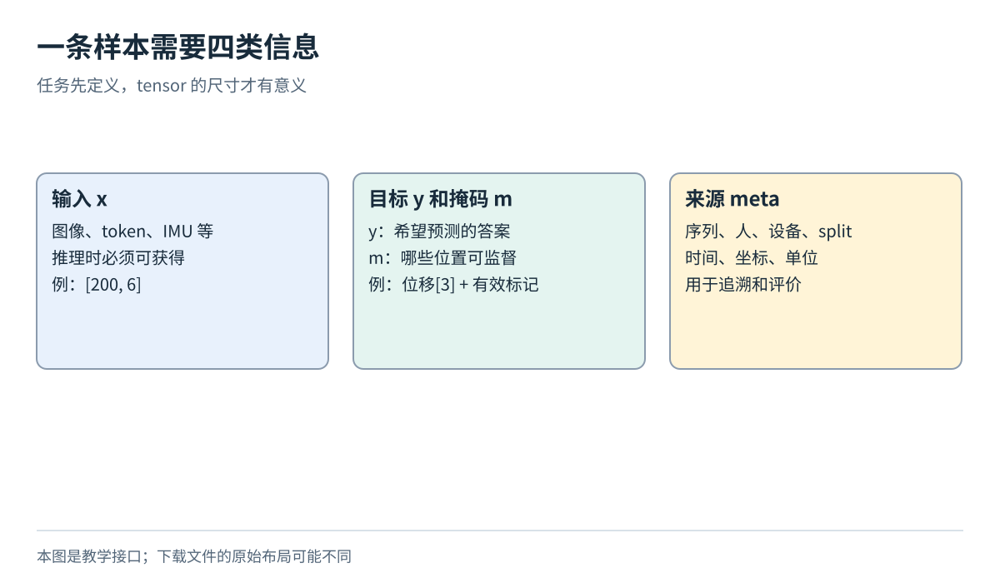
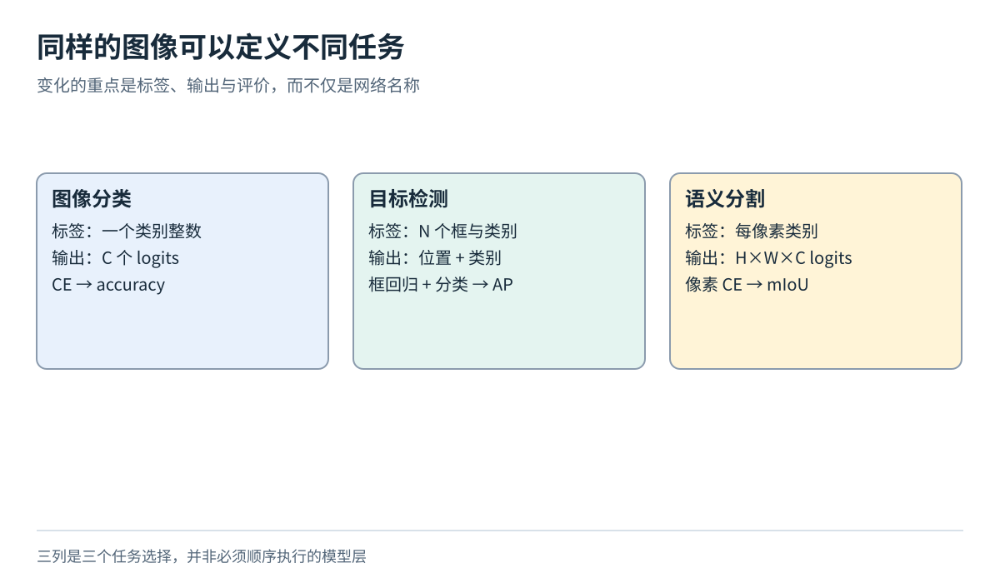
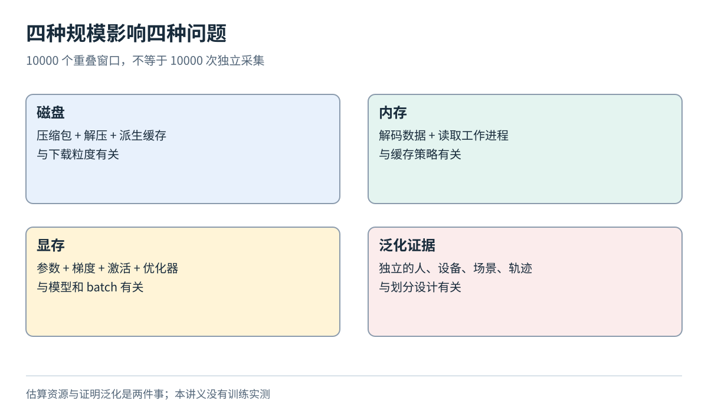

# 样本接口与数据集选择

[数据模块目录](../../04-data-and-datasets.md) · [总导航](../../00-learning-navigation.md)

## 先读两分钟

先确定推理时有什么输入、预测什么目标，再决定网络。本文独立解释 x、y、mask、meta 与四种数据规模；不要求先记住数据集名字。完成标准是为一个任务写出无歧义的样本约定。

## 一条样本到底是什么

将一条样本统一写成 `(x, y, m, meta)`：

- `x` 是推理时真正可获得的输入
- `y` 是训练目标，可以由人工标注、传感器真值或原始数据自身构造
- `m` 是有效位置掩码，例如文本 padding、缺失深度、无真值时间段
- `meta` 保存样本 ID、原始来源、时间戳、坐标系、单位和 split，通常不直接喂给网络

单样本不含 batch 维度；拼成一批后再加 `B`。图像 `[3,32,32]` 中三个轴是颜色、高、宽；IMU `[200,6]` 中两个轴是时间和通道。二者虽然都叫 tensor，邻近元素的含义不同。文本 token ID 是离散索引，不应像加速度一样做均值方差归一化。

还要区分四种“规模”：原始文件大小决定磁盘；解码与缓存决定内存；一个 batch 的激活和优化器状态决定显存；独立的人、场景和轨迹数决定泛化证据。把一条轨迹切成十万个高度重叠窗口，并没有得到十万个独立实验。

下载前先写一张任务卡：输入与可用时间范围、标签定义、输出形状、loss、评价指标、划分单位、数据版本。对于动作预测，还要写动作是关节角、力矩、末端位姿增量还是速度，及其控制周期。一个没有这些约定的 `[7]` 向量，无法直接连接机器人控制器。

## 同一数据为何对应不同任务

分类标签回答“主要是哪一类”，检测标签回答“哪些对象在哪里”，分割标签回答“每个像素属于什么”。从分类改到检测，不能只把最后一层输出增大：样本目标变长，增强必须变换坐标，collate 与评价也改变。前一章的任务与 loss 因此必须和本模块的数据接口同时确定。

## 不要把文件大小当成泛化证据

教学选择：图像先CIFAR-10，文本先IMDb，IMU先EuRoC局部运动回归。想学人体运动再看AMASS，想学机器人动作再看robomimic或Open X；人体关节参数、手机IMU和机器人控制动作不能因为都是序列就互换。

完整15项选型说明放在共享的[数据集阅读目录](../../catalog/dataset-selection.md)，可筛选[CSV](../../catalog/datasets.csv)与[JSON](../../catalog/datasets.json)另列官方入口、样本形状、loss建议、评价、划分和许可确认程度。目录不是必做清单。

## 论文精读片段 从数据名退回数据定义

关联论文：[Datasheets for Datasets](https://arxiv.org/pdf/1803.09010)，本模块核对第3节框架，重点3.1、3.2；阅读范围是数据定义，不是逐篇复现目录中的所有方法。作者将数据的动机、组成和实例关系纳入记录，允许对确实未知的信息明确标注未知。

读第3.2节时先问“instance是什么”，再问“它代表哪个总体”。这是两个层次：一条IMU窗口可以是训练实例，但它来自哪位采集者、哪台设备，决定能否代表目标使用条件。下面是将这个问题框架用于本讲义的推演。

1. 原始对象：一条完整飞行记录，内含IMU与参考状态。
2. 派生实例：记录内每个1秒窗口；重复覆盖的采样点应保留来源关系。
3. 目标总体：若想部署到新无人机，就不能仅以同设备留出序列证明跨设备能力。
4. 缺失信息：若没记录设备或许可证，就填“未确认”，不能把缺失自动解释为相同或无限制。

练习：给“手机IMU识别走路/跑步”和“手机IMU预测位移”各写一张任务卡。答案要点：前者目标为离散类别、可用CE；后者目标是指定坐标系/时间跨度的连续量、可用回归loss。二者都应防止同一人相邻片段进入训练与测试。

官方信息核验于2026-10-01。图是原创教学示意；实验均为方案，未下载大型数据或训练实测。
