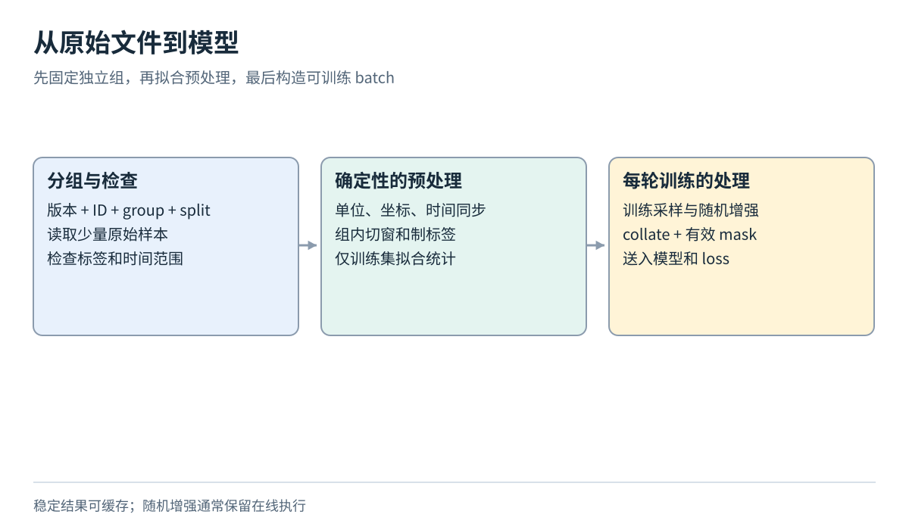
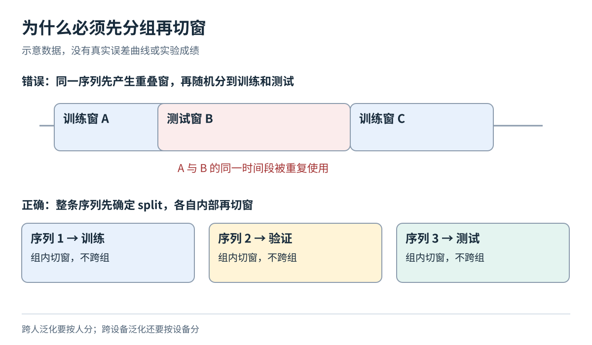
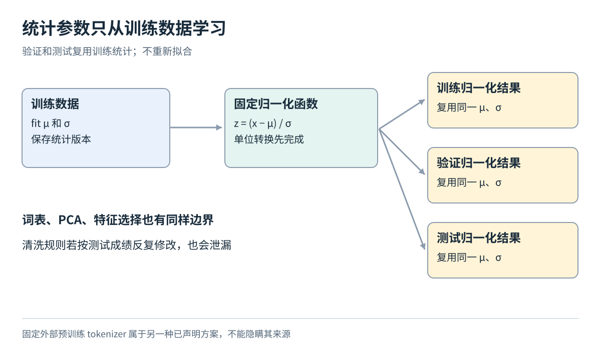

# 划分同步与最小数据管道

[数据模块目录](../../04-data-and-datasets.md) · [总导航](../../00-learning-navigation.md)

## 先读两分钟

先分组，再切窗；先固定训练统计，再处理验证测试。本文按真实数据流解释读取、同步、归一化、增强、采样和collate。重点是能证明输入与标签对应正确，而不是搭建大型训练平台。

## 逐步处理数据

推荐顺序是：**建立清单 → 分组划分 → 读取与检查 → 时间和坐标对齐 → 构造标签及切窗 → 训练集统计 → 采样和增强 → collate → 模型**。其中检查可提前做，但任何拟合型处理都只能使用训练部分。

1. **清单和读取。** 用一行记录一个图像、文档或原始序列的 ID、路径、组别及 split。先读十条，显示图片、文本片段或六轴曲线，检查 dtype、范围、缺失值、时间倒序和重复 ID。保留原始数据不动，将派生数据另存。
2. **划分。** 图片先沿用官方 train/test，再从 train 留验证集；文本以文档为单位；IMU 以完整序列为最低单位，跨人研究还要按人。先随机切窗再随机划分，会让几乎相同的时间片进入两边。
3. **同步。** 先确定时间单位和时钟来源。双目、IMU、动捕的第 100 行不一定同一时刻。用时间戳匹配；插值只在有支持的时间区间内做，长缺口作废。姿态插值先确认四元数顺序并规范化，再用合适的旋转插值，不能把四元数四个数当任意线性向量。
4. **切窗。** 记录起点、终点、步长、标签区间和有效掩码；不跨序列边界。测试步长应固定；大量重叠窗口的误差不是独立统计样本。若只能对单条长序列做时间划分，边界之间至少隔离输入窗口加预测跨度，且仍不能声称跨场景泛化。
5. **归一化。** 图像可将 uint8 转为浮点并缩放；连续信号可用训练集每通道均值、标准差。验证和测试必须复用这些统计。IMU 的物理单位转换先完成；“去均值”不是自动完成零偏标定或去重力。标签若缩放，评价时必须还原物理单位。
6. **采样与增强。** 训练可打乱样本；时序窗口内不能乱序。类别或轨迹长度不均衡时，可按类或序列采样，并记录分布变化。图片翻转对分类可能合理，检测框也必须随之变换；IMU 坐标旋转增强必须同步变换陀螺、加速度和位移标签。不能随意打乱时间、翻转单一轴，或假设改变时间尺度不影响运动学。
7. **collate 与缓存。** collate 把多个样本组成 batch：定长图像直接堆叠，变长文本补齐并生成 mask，检测目标通常保持列表，时序样本可补齐并屏蔽无效端点。缓存稳定的解码/切窗索引，不默认把随机增强结果永久缓存。缓存键包括原文件版本、split、预处理配置与统计版本，避免读到旧结果。

先验证单条样本，再验证一个 batch，再尝试让模型记住 16～32 条训练样本。若连这个都失败，优先排查标签、输出维度、loss、mask 和梯度，而不是立即换复杂架构。

## 先分组再切窗的原因

例如窗口A覆盖0到1秒，窗口B覆盖0.1到1.1秒，两者90%的时间区间相同。若A训练、B测试，模型几乎见过测试输入。测试的题目已经从“能否处理新序列”变成“能否处理见过片段的轻微移动”。同时，跨人的测试仍不自动等于跨设备或跨场景测试，应把目标泛化轴写进报告。

## 哪些处理会泄漏训练之外的信息

每次选择变换时问两件事：其参数来自哪里？使用的时间截至哪里？读取测试图的尺寸本身不等于训练；用全体测试数据拟合特征变换再报告未见测试性能，改变了评价条件。实时估计中，用未来数据做双向滤波同样改变可用信息，应明确标成离线方案。

## 论文精读片段 预处理不是中性步骤

关联论文：[RoNIN](https://arxiv.org/pdf/1905.12853)，本模块核对5.2、5.3和6.1节。论文测试时使用IMU估计姿态，并明确描述轨迹对齐；seen/unseen subjects分开评价。其启发不是照抄一个预处理函数，而是把姿态来源和对齐信息纳入实验协议。

逐步读法：先在5.2节圈出训练和测试姿态来源，判断哪些信息部署时可得；再到5.3节写清评价允许怎样对齐；最后读6.1节，检查指标的时间尺度和受试者划分。这样才能解释一个数字究竟衡量了什么。

本讲义的迁移练习：若同一网络用“因果姿态估计”和“真值姿态”预处理后差距很大，结论只能首先指向姿态链路的重要性，不能全部算成网络结构的优劣。若两种方案还用了不同轨迹对齐规则，连这个比较也不干净，必须先统一协议。

自检：①训练均值是否参与测试归一化？应该参与，因为它是冻结模型流程的一部分。②测试均值能否重新拟合？严格held-out协议下不应如此。③真值能否用于制作测试标签？可以；它不应同时成为未声明的推理输入。

## 完成检查

提交的不是一张漂亮曲线，而是一份别人能重做的证据：

- 固定的数据版本、清单和 train/validation/test ID；原始文件校验值以及处理配置
- 一条原始样本、处理后样本和一个 batch 的可视化/形状检查
- 标签含义、有效 mask、单位、坐标变换方向与时间范围；推理时输入可获得性
- 训练集拟合的归一化参数，模型和优化器配置，随机种子与模型选择规则
- 简单基线、验证曲线、最终测试结果、失败案例及各组表现；不只报总体均值
- 运行环境、耗时、峰值显存；未运行就写“计划/估算”，不补造数字

对 IMU 尤其要额外检查：毫秒是否误当秒，deg/s 是否误当 rad/s，加速度是否含重力，四元数是 xyzw 还是 wxyz，标签原点是否一致，离线平滑/末端校准是否偷偷用了未来。对机器人再加一条：动作编码匹配不等于真实硬件安全可执行。

先把三个小实验中任意一个做到“数据解释得清、训练能复现、测试没有泄漏”，再扩展数据量或模型。这样新增的复杂度才是在解决明确问题。

官方信息核验于2026-10-01。图是原创教学示意；实验均为方案，未下载大型数据或训练实测。
