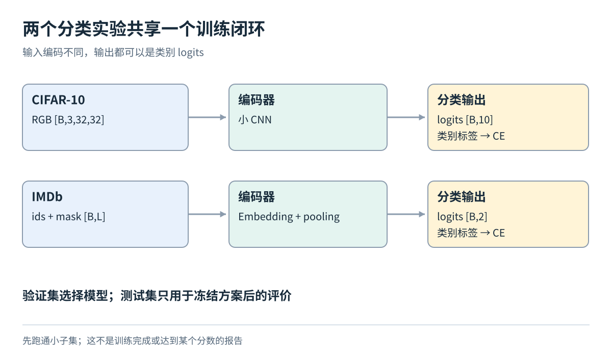
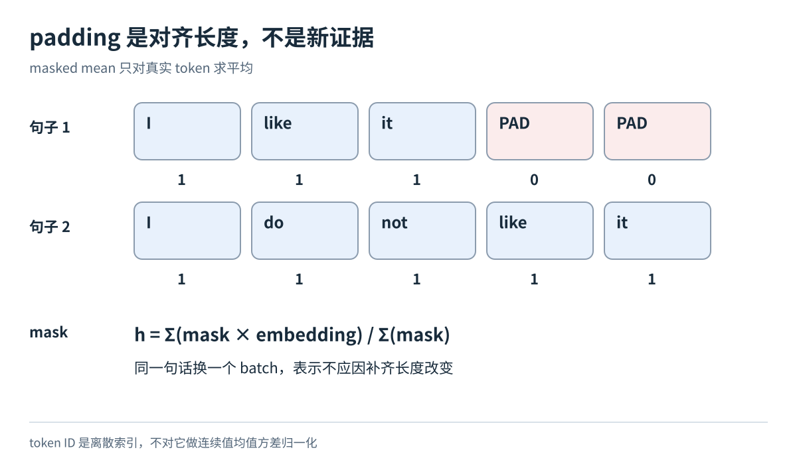

# 图像与文本分类的小规模实践

[数据模块目录](../../04-data-and-datasets.md) · [总导航](../../00-learning-navigation.md)

## 先读两分钟

这两个实验只改变输入编码，保留同样的“样本→logits→交叉熵→独立测试”闭环。图像先用小CNN，文本先用embedding与masked pooling；16GB显存只做可行性估算，不承诺速度或精度。

## 图像实验的读取与形状

![CIFAR-10单图转换并堆叠为[B,3,32,32]](../../../../assets/foundations/data/c-image.svg)

[CIFAR-10 官方页面](https://www.cs.toronto.edu/~kriz/cifar.html)给出 10 类、32×32 彩色图像，官方训练集 50,000 张、测试集 10,000 张。教学时只从训练集按类固定抽取 5,000 张训练、1,000 张验证；可从官方测试集预先固定 1,000 张作为教学测试子集。记录随机种子与 ID，结果标成“教学子集”，不能与全量榜单混报。

单样本 `x: float32[3,32,32]`，`y: int64`，范围 0～9；一批输出 `logits[B,10]`。从小型 CNN 开始，用交叉熵，直接传 logits，不先做 softmax。先无增强，再只增加随机裁剪/水平翻转，观察验证误差而不是只看训练误差。

评价记录平均交叉熵、accuracy、各类召回和混淆矩阵。类别近似均衡时随机猜测约 10%，但正式基线应按实际子集分布计算。每轮用验证集选择模型，实验设计冻结后才看测试集。训练准确率高、验证准确率低，是需要检查过拟合和分布差异的证据，不是“再训练久一点”的自动理由。

建议起始 batch 64、参数量约百万以内，CPU 也可验证流程；16GB GPU 预计有余量，实际仍需记录峰值显存。官方页面提供下载，但本次页面未找到明确的数据专用许可证；不能因下载公开就写成“无限制商用”。

## 文本实验的长度与掩码

[IMDb 官方数据页](https://ai.stanford.edu/~amaas/data/sentiment/)提供影评文本及正负标签，训练/测试各 25,000 条，另有无标签部分。先从官方 train 抽 4,000 条训练、1,000 条验证，官方 test 固定 1,000 条教学测试。只读有标签目录；不要把无标签样本硬赋成某个情感类别。

用训练文本建立一个有限词表，未知词映射到 UNK；保留否定词，不把“不喜欢”清洗成“喜欢”。编码得到 `ids[L]`，教学截断上限可先设 256，并记录多少文本被截断。collate 得到 `ids[B,Lmax]` 与有效 token mask。先用 embedding 加 masked mean pooling，再接线性分类头，输出 `[B,2]`，配交叉熵。batch 可从 32 开始，不必微调大语言模型才算做 NLP。

评价 accuracy 与 macro-F1，同时检查长影评、否定句、讽刺表达的错误。空文本或全padding样本应剔除或按事先规定处理，避免分母为零。padding 必须从 pooling 中排除，否则同一影评仅因 batch 中其他文本更长，表示就可能改变。词表、清洗规则及长度选择都不能偷看测试效果来回调。

如果改成“给前文预测下一个 token”，就换成 WikiText 类语料：目标由右移一位的文本构造，输出 `[B,L,V]`，按有效 token 计算交叉熵。它与情感分类共享 tokenizer 和 batching，却不共享标签含义；困惑度只能在 tokenizer、文本预处理和评价协议一致时比较。IMDb 官方页面本次未确认独立数据许可证，使用前查看所获数据包的 README 和条款。

## 论文精读片段 标签来源与划分会改变任务

第一篇：[Learning Multiple Layers of Features from Tiny Images](https://www.cs.toronto.edu/~kriz/learning-features-2009-TR.pdf)，只聚焦3.1节（报告印刷页32）。作者描述了从带噪声检索标签到人工筛选及去重的过程。本模块不复现其RBM模型。读这一节应区分“标签怎么来”与“网络怎么学”，并问：只有一个显著对象的筛选，是否接近未来多目标复杂场景？

第二篇：[Learning Word Vectors for Sentiment Analysis](https://aclanthology.org/P11-1015.pdf)，聚焦4.3.2及其前一段数据划分动机（印刷页148–149）。其IMDb训练与测试使用不相交电影，避免模型过度依赖某部电影特有词与情感的关联；本教学实验不复现其词向量学习与SVM。

按三个层次核对：①一条记录是一篇影评，标签描述情感；②多篇影评可来自同部电影，统计上有关联；③若测试目标是新电影，就要让电影身份成为划分单位。我们从官方train内部再抽validation时，随机影评划分只提供有限的开发验证；想更严格，需从附带来源URL等信息确认电影ID后分组，不能猜ID。

教学推演：假设训练里某电影的角色名总出现在好评中，模型可能学到角色名→好评。换一篇同电影影评也答对，并不能充分证明它理解“失望但演技不错”这类语义。这个例子解释为何accuracy需要与数据设计一起阅读。

完成小实验后交付三张图：训练/验证曲线、测试混淆矩阵、错误样本。它们必须由实际运行产生；本模块的示意图不能当成实验结果。

官方信息核验于2026-10-01。图是原创教学示意；实验均为方案，未下载大型数据或训练实测。
