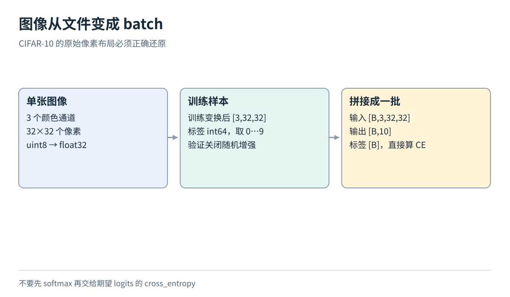

# 图像与文本分类的小规模实践：把一条样本走完整个训练闭环

## 1. 先明确我们究竟要练习什么

拿到一张小图，我们想判断它是猫、汽车还是其他类别；拿到一篇英文影评，我们想判断它表达正面还是负面情感。输入形式不同，但两个任务都有同一条主线：读取样本，把它转换成数值，计算各类别分数，与正确标签比较，再根据误差调整模型。

本篇给出两套小规模教学方案。目标是把这条主线做对，并能解释错误从哪里来，不是复现排行榜成绩。这里会解释需要的网络部件、数据形状、损失和指标，不要求先记住 CNN、embedding 或 pooling 这些名字。

以下数据子集、模型大小和训练设置都是建议起点；本文没有执行下载或训练，也没有得到可报告的实测精度。

图的左边是两种输入，中间是把输入变成特征的**编码器**，右边是把特征变成类别分数的**分类头**。训练时还需要标签和损失；真正使用模型时只给输入，不把正确标签一起喂进去。先理解这张图，再分别替换图像与文本的编码器。

## 2. 先把分类分数和交叉熵讲清楚

模型输出的 **logits** 是未经归一化的类别分数。两类任务的一条输出可以是 [2,0]，表示模型给第 0 类的分数更高，但不能把 2 直接读成概率 200%。

**softmax** 把分数转换成非负且总和为 1 的概率。做法是各分数先取指数，再除以指数之和。对 [2,0]，得到约 [0.881,0.119]。其中 0.881 来自 e²/(e²+e⁰)。

单标签分类的**交叉熵**可以理解成“正确类别的负对数概率”。若正确类别是 0，损失为 −ln(0.881)，约 0.127；若正确类别是 1，损失为 −ln(0.119)，约 2.127。同一预测对不同正确答案，会得到不同惩罚。

训练框架通常把数值稳定的 softmax 与负对数计算合并实现。例如 PyTorch 的 CrossEntropyLoss 接受原始 logits；使用类别编号目标时，输入一批分数 [B,C]，目标为 [B]，每个编号在 0 到 C−1 之间。[1] 不要先做一次 softmax，再把概率误当成 logits 传入。

**反向传播**计算损失对模型参数的导数，也就是梯度；**优化器**使用这些梯度调整参数。它们不会替你发现“第 0 类究竟是猫还是狗”这种语义错误，所以标签映射仍必须人工核对。

## 3. 图像实验先固定数据和划分

CIFAR-10 提供 32×32 的彩色图像，共十类，官方训练集 50000 张、测试集 10000 张。[2] 为降低起步成本，本篇建议固定一个教学子集：

1. 从官方训练集每类取 500 张训练图，共 5000 张
2. 从剩余官方训练数据每类取 100 张验证图，共 1000 张
3. 从官方测试集每类预先固定 100 张，共 1000 张教学测试图

抽取时保存随机种子和原始 ID，确保训练与验证不重叠。这里“每类固定数量”的方案是本篇设计，不是官方新增划分。报告时必须写“教学子集”；即使测试表现不错，也不能直接与使用全量数据的论文榜单比较。

训练集用于参数学习，验证集用于比较模型和选择保存哪一轮，测试集在实验设计固定后才使用。反复根据测试成绩改模型，就把测试集变成了开发工具，失去了独立检查的作用。

## 4. 一张图怎样经过小型 CNN

一张原始图有红、绿、蓝三个通道，数值通常是 0～255 的整数。先转成浮点数，再除以 255，可得到大致在 0～1 的输入。若进一步减均值、除标准差，应只用训练集拟合统计量，并固定应用到验证和测试。

本篇使用“通道、高、宽”的轴顺序，所以一张图是 [3,32,32]，64 张图堆叠后是 [64,3,32,32]。真实类别是一个整数，而不是十个浮点分数。

图中最容易混淆的地方，是批量轴和颜色轴。B 表示有多少张图，3 表示每张图有三个通道。若实际读入的数组是 [32,32,3]，需要调换轴，而不能只把形状数字改写一下。

下面设计一个足够小的卷积神经网络，英文简称 CNN：

- 第一层 3×3 卷积，把 3 个输入通道变成 32 个特征通道；步长 1、四周补一圈后，空间大小保持 32×32
- 经过 ReLU，再做 2×2 最大池化，空间大小从 32×32 变为 16×16
- 第二层 3×3 卷积把通道数变成 64，仍保持空间大小；再经过 ReLU 和 2×2 最大池化，得到 [B,64,8,8]
- 对每个通道的 8×8 个位置求平均，得到 [B,64]
- 用一个线性分类头，把 64 个特征组合成十类分数 [B,10]

现在解释这些词。**卷积**让一个小窗口在图像上移动，在不同位置复用同一套可学习权重；不同输出通道可以学习不同局部模式。**ReLU**把负数变成零、非负数保留，使多层计算不只是一个大线性变换。**最大池化**在每个小区域取最大值，减少位置数。**空间平均池化**把每个通道汇总成一个数。**线性层**对这些数做加权求和并加偏置，给每一类一个分数。

这套网络没有要求你先找到“猫耳朵检测器”。权重会在训练中被调整。但我们也不能预先保证某个通道一定学到人类能命名的特征。

## 5. 图像训练按这个顺序检查

先关闭随机增强，检查一条样本和一个 batch。再让模型尝试记住少量固定训练图，确认损失能够明显下降。这个调试步骤只检查训练链条，不评价泛化。

随后可以把 batch 设为 64，优化器先采用 Adam，学习率先设 0.001，最多训练 10 个 epoch。**epoch**表示训练集被按当前采样规则遍历一遍；这些数字只是便于开始的配置，不是最优参数或成绩承诺。每轮结束计算验证损失，按预先规定的最小验证损失选择模型。

一次更新顺序是：清空旧梯度，前向计算 logits，计算这一批交叉熵，反向计算梯度，执行优化器更新。梯度默认可能累积，所以忘记清空会改变你实际执行的训练方案。验证阶段关闭梯度计算，并切换到模型的评价模式，避免依赖训练状态的部件产生不同含义。

基础流程可靠后，只加入一个改动，例如随机裁剪和水平翻转，再比较验证结果。不要同时换模型、换划分和换增强，否则不知道差异来自哪里。水平翻转适合本教学分类任务的常见对象语义，不代表所有图像任务都能这样增强，例如文字识别就需要另行判断。

参数量较小的网络可先在 CPU 验证流程；16GB GPU 通常可作为小规模练习的候选，但实际显存还取决于实现、精度和中间结果。应测量峰值占用，不能把“输入很小”写成必然能容纳任意模型。

## 6. 分类结果不只看一个正确率

**accuracy 正确率**是预测正确的样本数除以全部样本数。若 1000 张测试图中 700 张预测正确，正确率是 70%。这是手算例子，不是本实验成绩。

对十类任务，均匀随机猜测的期望正确率是 10%；总猜训练集中最多的一类，也是一个需要记录的简单基线，其测试效果取决于测试类分布。基线告诉我们模型是否比几乎不学习的规则更有用。

**混淆矩阵**把真实类别放在一条轴、预测类别放在另一条轴。例如约定行是真实类别、列是预测类别，猫行狗列的数量就表示“把猫错判成狗”。对角线是预测正确的数量。必须写明轴方向，否则读者可能把错误方向看反。

某类的**召回率**是这一类真实样本中被正确识别的比例。即使总体正确率还行，少数类别也可能几乎全错。平均交叉熵则还能帮助观察置信分配：两个模型正确率一样，但一个对错题极度自信，损失可能明显更大。概率值也不自动等于可靠置信度，需要另行校准和评价。

## 7. 文本实验从一篇影评开始

IMDb 的有标签数据包括 25000 条训练影评和 25000 条测试影评，另有无标签部分。[3] 本篇建议从官方 train 固定抽取 4000 条训练、1000 条验证，并从官方 test 固定抽取 1000 条教学测试，尽量平衡正负类并保存 ID。只读取有标签目录；没有标签不等于负面。

一篇影评最初是字符串。**分词 tokenizer**把它切成若干 token，token 可以是词、子词或字符。为把步骤看清楚，这里先采用固定的小写化和词级切分规则，并保留否定词。把 “not good” 清洗成 “good”，会直接破坏情感信息。

只用训练文本建立词表，例如保留最多 20000 个常见词。为 PAD 和 UNK 留出专用编号：PAD 用于补齐，UNK 表示不在词表里的词。验证或测试出现新词时使用 UNK，不临时把测试词加入重新拟合的词表。

一篇影评编码后是长度为 L 的整数序列。先固定最多保留 256 个 token，并统计被截断的比例。截断提高了计算可控性，也可能丢掉后半段关键转折；这项损失要通过错误分析看见，不能只记录速度收益。

## 8. embedding 和 masked mean pooling 怎样工作

**embedding**可以先理解为一张可学习的查表：每个 token ID 对应一个 64 维向量。编号只负责找表中的哪一行，向量内容才参与后续计算。一批文本补齐后是 [B,Lmax]，查表后变成 [B,Lmax,64]。

为什么需要补齐？因为同一批影评长度不同，矩形数组不能一行放 80 个数、另一行放 120 个数，而不额外指定组织规则。最简单的做法是将短文本补到本批最长长度，再用 mask 标明哪些位置是真实 token。

图中的 PAD 占了位置，却不属于句子内容。**masked mean pooling**就是把有效位置的向量相加，再除以有效位置数。对一条文本，其表示可写为 h=Σ(mₜeₜ)/Σmₜ，其中 eₜ 是第 t 个词向量，mₜ 为 0 或 1。

用二维向量手算：真实词向量分别是 [2,0] 和 [0,4]，补齐两个位置，mask 为 [1,1,0,0]。正确平均是 ([2,0]+[0,4])/2=[1,2]。如果把四个位置全部平均，即使 PAD 向量是零，也变成 [0.5,1]。同一条影评竟会因同批其他影评更长而改变表示，这就是忽略 mask 的问题。

空文本或全 PAD 的有效位置数为零，必须事先约定剔除或专门处理，不能让计算除以零。得到 [B,64] 的文本表示后，再接线性头输出 [B,2]，沿用前面已经解释的交叉熵。batch 可以从 32 开始，优化器和检查步骤也可沿用图像实验。

这个基线很容易理解，也有明确局限：平均词向量丢失了顺序。同一组词即使换了语序，表示也一样，因此不能期待它可靠理解否定的作用范围、复杂转折或讽刺。保留否定词只是避免主动破坏信息，并没有自动解决语言理解。

## 9. 用 F1 和错误样本补上总体数字

二分类中先选一类作为当前关注类。**precision 精确率**问“模型预测属于这类的样本，有多少真的属于它”；**recall 召回率**问“真实属于这类的样本，有多少被找出来”。

假设实际正面 10 条，模型预测正面 8 条，其中 6 条正确。那么精确率为 6/8=0.75，召回率为 6/10=0.6；F1 是二者的调和平均，2×0.75×0.6/(0.75+0.6)≈0.667。它会同时关注错收和漏掉。**macro-F1**是分别把每一类作为关注类计算 F1，再对各类等权平均；遇到分母为零，必须固定处理规则并说明。

除 accuracy 和 macro-F1，还要阅读具体错题：截断影评是否更差？包含否定词的文本是否出问题？模型是否只靠某个演员或角色名判断？

IMDb 原论文明确考虑训练和测试电影不相交的问题，以降低特定电影词汇与情感标签关联带来的捷径。[4] 本篇从官方 train 中随机抽验证影评，只构成较有限的开发验证；更严格的方案应在能可靠恢复电影 ID 时按电影分组，不能从文件编号猜电影身份。

CIFAR 数据报告也介绍了人工筛选标签等构建过程。[5] 这提醒我们，任务表现与数据如何采集和筛选有关，不能把小型单标签图像的成绩直接推广到任意复杂场景。

## 10. 分类和下一词预测不要混在一起

影评情感分类的一篇文本只有一个情感目标，输出是 [B,2]。若改成“根据前文预测下一个 token”，训练目标要从文本右移一位构造，输出通常是 [B,L,V]，其中 V 为词表大小。每个有效位置都有自己的下一个 token 目标，还必须防止利用未来 token。

WikiText 是可继续调查的语言建模语料方向。[6] 语言模型常报告困惑度，它与平均 token 负对数概率有关；但不同 tokenizer、预处理和评价协议下，每个 token 的含义不同，数字不能随意横向比较。共享分词和批处理技术，不意味着两类任务共享标签或评价方式。

完成本篇实验后，应交付固定划分、处理配置、训练/验证曲线、最终测试混淆矩阵和可解释的错误样本。图必须来自实际运行；本文教学示意图不是结果图。CIFAR-10 与 IMDb 官方介绍页提供下载和引用信息，本篇未确认完整的数据专用许可，具体使用应继续核对所获数据包及发布方条款。

## 参考资料与延伸阅读

[1] PyTorch contributors. CrossEntropyLoss，官方 API 文档。https://docs.pytorch.org/docs/stable/generated/torch.nn.CrossEntropyLoss.html

[2] Alex Krizhevsky, Vinod Nair, Geoffrey Hinton. CIFAR-10 and CIFAR-100 datasets，官方数据页面。https://www.cs.toronto.edu/~kriz/cifar.html

[3] Andrew L. Maas et al. Large Movie Review Dataset，官方数据页面。https://ai.stanford.edu/~amaas/data/sentiment/

[4] Andrew L. Maas, Raymond E. Daly, Peter T. Pham, Dan Huang, Andrew Y. Ng, Christopher Potts. Learning Word Vectors for Sentiment Analysis. ACL，2011，142–150；相关数据划分讨论见第 4.3.2 节及其前文。https://aclanthology.org/P11-1015/

[5] Alex Krizhevsky. Learning Multiple Layers of Features from Tiny Images. Technical Report，University of Toronto，2009；相关位置为第 3.1 节。https://www.cs.toronto.edu/~kriz/learning-features-2009-TR.pdf

[6] Stephen Merity, Caiming Xiong, James Bradbury, Richard Socher. Pointer Sentinel Mixture Models. ICLR，2017；介绍 WikiText 数据。https://arxiv.org/abs/1609.07843

课程导航：[数据基础](../../04-data-and-datasets.md) · [总导航](../../00-learning-navigation.md)

来源复核日期：2026-10-02。本篇为教学方案，未实测。
