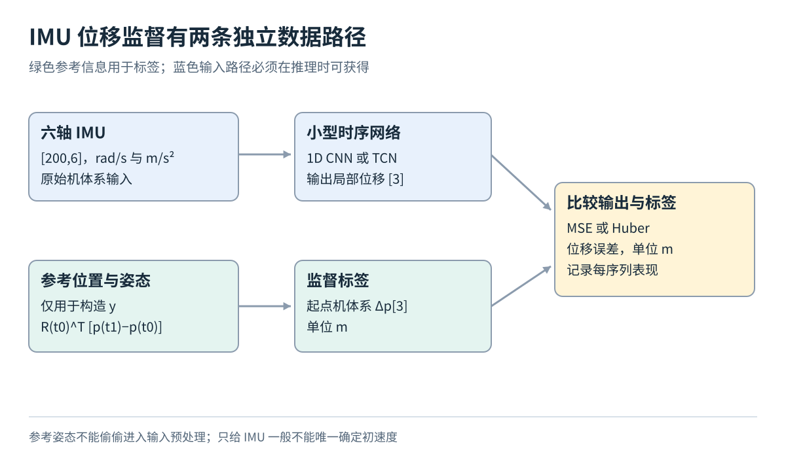
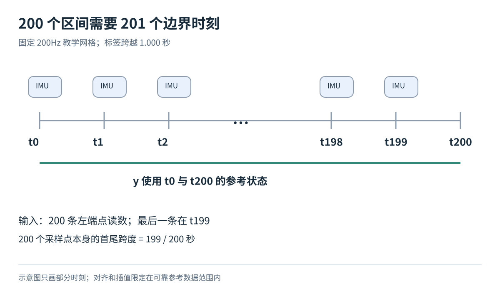
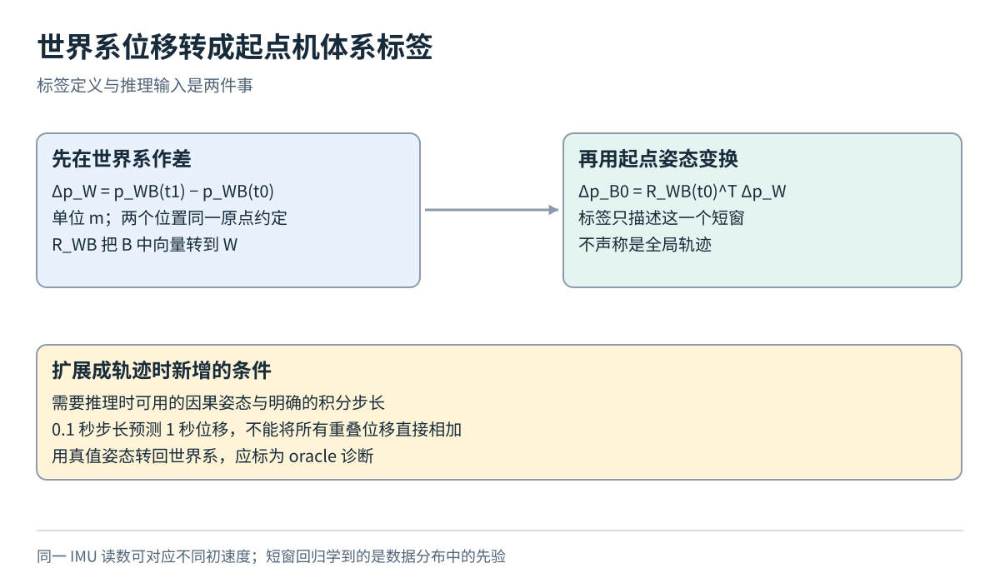

# IMU 窗口怎样对应一个位移标签：从传感器读数到可解释的回归实验

## 1. 先问一个比网络结构更重要的问题

想象把两个姿态相同的传感器分别放在两辆匀速直线行驶的车上。一辆每秒前进 1 米，另一辆每秒前进 2 米；忽略振动、转动和传感器误差，它们可以具有相同的加速度计和陀螺仪读数，但一秒位移明显不同。

这说明一个关键限制：**只给一小段 IMU，一般不能唯一确定这段时间移动了多远。** 加速度描述速度怎样变化，并不直接提供初始速度。把网络变大，不能凭空创造没有被观测到的信息。

那么学习 IMU 位移还有意义吗？有，但必须说清目标：我们希望模型利用训练数据中常见的运动模式，估计一个短时间窗口内的位移。这是有分布条件的监督回归实验，不是任意运动条件下的严格惯性导航解，也不意味着解决了长期漂移。

本篇会把输入、时间、坐标和评价逐个讲清。所有序列划分与模型设置都是教学方案，没有进行训练实测。

## 2. IMU 的六个数各是什么

IMU 是惯性测量单元，本篇使用三轴陀螺仪和三轴加速度计。陀螺仪的角速度表示设备朝向变化有多快，单位为 rad/s；加速度计读数单位为 m/s²，但不能直接当成世界坐标下的位置二阶导数。

原因是加速度计测量的是与非重力作用有关的比力，并在随设备旋转的坐标系里报告它。采用常见符号约定时，可以写成：

f_B = R_WBᵀ(a_W − g_W) + b_a + n_a

这里 f_B 是机体系加速度计读数，a_W 是世界系线加速度，g_W 是世界系重力加速度，b_a 是偏置，n_a 是噪声。R_WB 把机体系方向转到世界系，因此其转置 R_WBᵀ 把世界系方向转回来。静止放在桌上的传感器仍会读到与重力有关的非零数值；所以“传感器数值不为零”不等于“设备正在发生平移加速”。

这个公式用于解释读数含义，本篇不要求你实现完整惯导。也不要把训练数据减去一个平均数，就写成完成了去重力和偏置标定。

我们固定一条输入记录的通道顺序为 [ωx,ωy,ωz,ax,ay,az]。ω 表示角速度，a 在这里表示文件里的加速度计通道。200 条记录按时间排列，形成一个 [200,6] 数组。符号、顺序和单位写清楚，比仅仅写“六维数据”重要得多。

## 3. 为什么选择 EuRoC 以及哪些信息可以使用

EuRoC 是无人机采集的视觉惯性数据集，官方提供双目图像、200Hz IMU、标定和运动参考信息。[1] 200Hz 表示每秒约 200 次采样，理想等间隔下相邻读数相差 1/200=0.005 秒。

本实验只规划使用 IMU CSV、对应参考状态和标定信息，不需要把所有图像都读进内存。官方数据已迁移至 ETH Research Collection；下载前应检查具体归档、文件大小和能否按所需序列获取，而不是因为训练只用 CSV，就假定下载包一定很小。[1][2]

接下来一定要区分两条路径：

- **推理输入路径**只包含约定时间窗内的六轴 IMU，不输入参考位置或参考姿态
- **监督标签路径**使用离线参考位置和起点参考姿态，制作这段运动的答案

图中的两条路径最后在训练损失处相遇：网络预测与参考答案比较。参考姿态出现在标签制作路径，并不表示模型使用时也能获得它。如果把参考姿态用于旋转输入或拼接输入，就已经换成拥有额外信息的另一项实验，必须单独说明。

EuRoC 论文解释了接口约定和参考状态生成过程：完整参考状态通过包含 IMU 与外部跟踪测量的离线估计过程得到。[3][4] 因此文件名里的 ground truth 应理解成具有误差和处理过程的参考状态，不应描述为完全独立于 IMU、逐时刻绝对无误的直接测量。

## 4. 把一秒的边界算准确

先从三个时刻开始：0、0.005、0.010 秒。这是三个采样点，却只有两个相邻区间，总跨度为 0.010 秒。由此可以看出，“点数”和“区间数”差一个。

为使教学约定没有歧义，我们定义 201 个边界时刻 t₀、t₁、…、t₂₀₀，相邻相差 0.005 秒，总跨度为 200×0.005=1 秒。输入取每个区间左端的 200 条六轴读数；标签使用第一个与最后一个边界时刻的参考位置。

也就是说，输入最后一条读数在起点之后 0.995 秒，标签终点在起点之后 1.000 秒。若直接取 200 个点，再拿首尾点相减，它们跨越的是 199 个间隔，即 0.995 秒，而不是完整一秒。

图中请数区间，而不是只数读数标记。输入数量为 200，标签的两个边界相隔一秒，二者由同一张窗口索引表定义。不能切输入时采用一套边界，查标签时再凭另一套行号猜测。

真实时间戳不一定完全均匀，应先检查间隔，再决定是否重采样到统一网格，并记录规则。绝对纳秒时间先以整数保存，减去序列起点后再转秒，避免巨大数值转成 float32 时丢失细小时间差。

参考状态恰好不在窗口边界时，可以在可靠支持区间内插值位置和朝向。位置插值是在相邻已知位置间作局部近似；朝向则应采用符合旋转性质的插值。超出参考时间范围、出现长缺口或跨越序列边界的窗口应丢弃，并记录原因，不能以任意填零制造“有效标签”。

## 5. 位移为什么还要指定坐标系

假设无人机向房间东侧移动 1 米。房间固定坐标可以把它记作 [1,0,0]；但无人机本身的机头可能朝北，那么从它自己的轴看，这次运动可能是朝侧面。

本实验把答案定义为**起点机体系下的三维位移**。这里的“起点”很重要：我们用窗口开始那一刻的三个方向作为固定参考，而不是让答案的坐标轴在一秒内跟着设备不断旋转。

定义 W 为世界系，B 为 IMU 机体系；p_WB(t) 表示时刻 t 的机体原点在世界系中的位置。R_WB(t) 表示把机体系向量转到世界系的旋转矩阵。一个旋转矩阵可以看成坐标方向之间的转换表，其转置等于逆变换。

标签计算为：

y = Δp_B₀ = R_WB(t₀)ᵀ [p_WB(t₁) − p_WB(t₀)]

这次为了让公式容易读，t₀ 和 t₁ 分别表示整个窗口的起止时刻。先作世界系位置差，再把这个位移转到起点机体系。旋转不改变长度单位，所以输出 y 仍以米为单位，形状为 [3]。

分三步手算一个例子。起点世界位置为 [4,2,0] 米，终点为 [5,2,0] 米，因此世界位移为 [1,0,0] 米。起点姿态若是绕 z 轴正向旋转 90°，机体系 x 轴指向世界 +y，机体系 y 轴指向世界 −x。世界 +x 就对应机体 −y，因此标签是 [0,−1,0] 米。若错误地乘 R 而不是 Rᵀ，会得到相反方向，这个检查很容易抓住坐标变换写反的错误。

图中先看两点的位置差，再看坐标旋转，最后才看后续轨迹可能需要的姿态来源。它没有说网络能直接预测世界轨迹，也没有让参考姿态成为部署输入。

读 EuRoC 字段时，还要核对四元数约定和机体原点。论文采用 Hamilton 四元数，排列为 wxyz，body 定义位于 IMU 坐标系；实际代码仍应核对表头和使用的转换函数。[3] 四元数是表示朝向的一种四参数形式，不同库的排列未必相同。

若使用的是原始动捕标记的状态，而不是已转到 IMU 原点的参考状态，还需要传感器外参。标记与 IMU 的空间偏移叫杆臂；设备旋转时，两者的平移轨迹可能不同。只修正朝向、不修正原点位置，仍会制作错误标签。

## 6. 先固定划分再生成窗口

本篇提供一个明确的教学划分：

- MH_01_easy、MH_02_easy 的可靠区间用于训练
- MH_03_medium 的可靠区间用于验证
- MH_04_difficult 的可靠区间用于测试

可靠区间应根据数据完整性、参考支持范围等预定规则确定，不能因为某段测试误差难看就事后删除。把保留与排除区间写进清单。

这是本篇设计的同场景跨序列教学协议，不是官方神经网络训练划分，也不是随机同分布抽样的保证。它可以帮助检查对新序列和更困难运动的表现，但不能证明跨人、跨设备或任意新场景能力。MH_05 或 Vicon 房间数据可作为额外分布测试，报告时应与主测试区分。

训练窗口步长先设为 0.1 秒，最多保留 10000 窗，并保存抽样 ID；验证、测试按固定规则覆盖有效区间。先划分完整序列，之后才切窗。否则一秒窗口彼此重叠 90%，很容易让几乎相同的信号同时进入训练和测试。

窗口数也不是独立实验次数。评价应提供每条序列结果，不要把大量重叠窗口当作独立重复试验，给出过于乐观的统计把握。

## 7. 一个足够小但完整的回归模型

输入一批为 [B,200,6]，输出为 [B,3]。可以先采用一维卷积神经网络：让小卷积窗口沿时间方向移动，在不同时间复用权重，学习局部运动变化。它与处理图片的卷积思想相同，只是这里移动的轴是时间。

一个教学起点是：6 通道经核宽 5 的卷积变成 32 通道，接 ReLU；再经核宽 5 的卷积变成 64 通道，接 ReLU；在时间轴求平均，得到 64 维表示；最后用线性层输出三维位移。步长先用 1，适当补齐以保持时间长度。某些框架的一维卷积要求 [B,通道,时间]，所以实际送入时要从 [B,200,6] 转为 [B,6,200]。

这个结构只是容易检查的起点，并不保证能表达所有长程运动关系。若改用 TCN，即通过时间卷积和可能的扩张连接扩大可见时间范围的网络，也应先解释具体感受野，再比较是否有效。更复杂架构不能替代正确的标签。

训练前按训练集每个通道计算均值与标准差，验证和测试复用它们。batch 先取 64，Adam 学习率先取 0.001，训练上限先设 20 轮，并按验证集位移误差选择保存模型。先固定这些设置，再作一次只改一个因素的实验。百万参数以内的小模型通常适合在 16GB 显存级别设备上尝试，但仍须实测资源，本文不承诺耗时或显存峰值。

## 8. 损失和米制误差要分开报告

最容易起步的是分量均方误差 MSE。对一条预测 ŷ 和标签 y，先得到三个分量残差，分别平方，再平均：

L = [(ŷx−yx)² + (ŷy−yy)² + (ŷz−yz)²] / 3

若三个残差为 [0.1,−0.2,0] 米，那么 MSE=(0.01+0.04+0)/3≈0.0167 m²。位移向量的欧氏误差则是 √(0.01+0.04)=0.2236 米。前者的单位是平方米，后者是米，不能把它们都写成“平均位移误差”。

也可以研究 Huber 损失：残差较小时使用二次惩罚，较大时改为线性增长，降低极端误差对梯度的影响。例如对分量残差 r，阈值 δ 下可定义：|r|≤δ 时为 0.5r²，否则为 δ(|r|−0.5δ)。阈值 δ 必须说明以米还是标准化单位定义；损失形式变了，不代表异常标签可以不检查。

在真正训练前先计算两个基线：始终预测零位移，以及始终预测训练集标签的平均位移。后者的均值只能从训练集求，不能把测试标签均值拿来当模型。若网络连基线都明显不如，优先检查同步、标签、坐标与训练过程。

最终报告欧氏误差的均值、中位数、95 分位数以及每条序列结果。中位数描述典型情况；95 分位数帮助发现较大的尾部错误。同时画预测分量与参考分量的随时间变化，但这些图必须由实际运行产生。

## 9. 窗口估计准确为什么仍不能直接得到完整轨迹

首先是信息限制。前面的匀速例子说明，同样的短窗读数可以对应不同初速度和位移。模型可能借助训练分布中常见的速度、振动和运动模式得到有用预测，但换成不同设备或运动方式，这些关联可能失效。把这种关联称为**运动先验**，意思是模型借用了训练中常见的规律，而非从测量中唯一解出了状态。

其次是坐标限制。输出在起点机体系，要累积到世界系，需要每个窗口起点在部署时可获得的姿态。用参考姿态完成转换可以做诊断，但应标为 oracle，即借助真实部署中未必存在的理想信息，不能与纯 IMU 实际方案混报。

第三是时间重叠。每 0.1 秒预测一次“一秒位移”，相邻输出覆盖了大部分同一段运动，不能全部直接相加。若匀速每秒走 1 米，十个重叠的一秒预测并不代表这 0.9 秒左右新增了 10 米。需要设计不重叠增量、速度输出或明确的融合方法，才能构造一致轨迹。

只有真的构造了完整轨迹，才适合报告 ATE、RPE 等轨迹指标。ATE 衡量约定对齐后整条轨迹的位置差；RPE 衡量约定时间或距离间隔上的相对运动误差。必须说明对齐方式、间隔和汇总规则。本篇没有验证轨迹，也不是 RoNIN 方法复现。[5]

## 10. 如何判断这个练习已经做对了

完成标准不是得到一个好看的小数，而是能回答：每条输入覆盖哪段时间？终点标签来自哪里？三维答案相对于哪个坐标系、哪个原点？有哪些信息只用于做标签？训练与测试是否共享原始片段？误差以什么单位计算？

EuRoC 官方也提醒动态运动下的跟踪精度和独立采集系统的同步存在限制。[1] 因此小幅数值改进可能受参考误差影响，应结合序列与稳定区间分析，不能据此宣称消除了偏置和漂移。

ETH 归档的现有权利标签为 “In Copyright - Non-Commercial Use Permitted”。[2] 这是来源页面的权利标记记录，不是对任何具体用途的法律结论。下载和使用前应核对相应数据包与条款。

本篇图是教学示意，算例是手算；实验尚未运行，没有下载大型归档或产生模型成绩。

## 参考资料与延伸阅读

[1] ETH Zurich Autonomous Systems Lab. EuRoC MAV Dataset，官方介绍、可用数据与已知限制。https://projects.asl.ethz.ch/datasets/euroc-mav/

[2] Michael Burri et al. The EuRoC micro aerial vehicle datasets，ETH Research Collection 数据归档。https://doi.org/10.3929/ethz-b-000690084

[3] Michael Burri, Janosch Nikolic, Pascal Gohl, Thomas Schneider, Joern Rehder, Sammy Omari, Markus W. Achtelik, Roland Siegwart. The EuRoC micro aerial vehicle datasets. The International Journal of Robotics Research，35(10)，1157–1163，2016。相关内容为接口、标定同步和限制讨论。https://doi.org/10.1177/0278364915620033

[4] 同文作者稿，用于核对原文第 4、5、6 节。https://www.researchgate.net/profile/Michael_Burri2/publication/291954561_The_EuRoC_micro_aerial_vehicle_datasets/links/56af0c6008ae19a38516937c.pdf

[5] Hang Yan, Qi Shan, Yasutaka Furukawa. RoNIN: Robust Neural Inertial Navigation in the Wild: Benchmark, Evaluations, and New Methods. ICRA，2020。https://arxiv.org/abs/1905.12853

课程导航：[数据基础](../../04-data-and-datasets.md) · [总导航](../../00-learning-navigation.md)

来源复核日期：2026-10-02；归档正文直连复核受限，权利标记与迁移信息分别依据归档检索记录及官方数据页。
