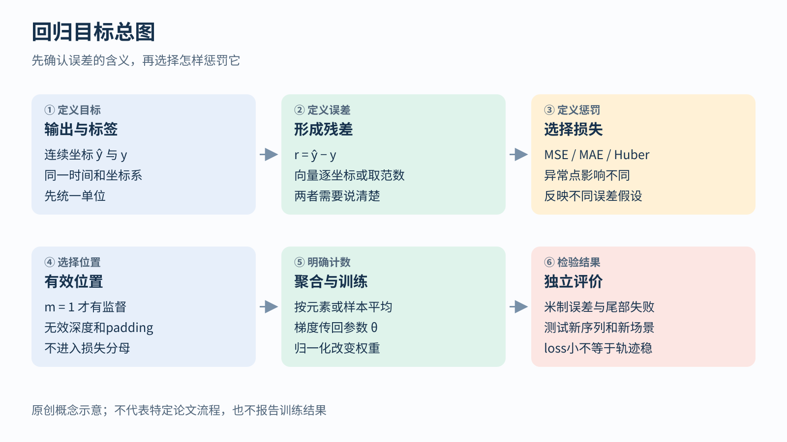
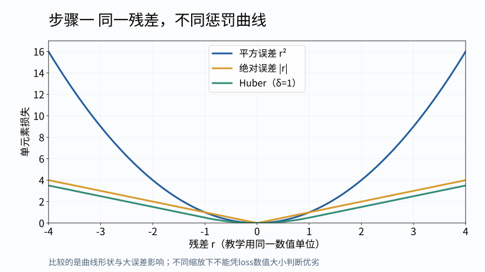
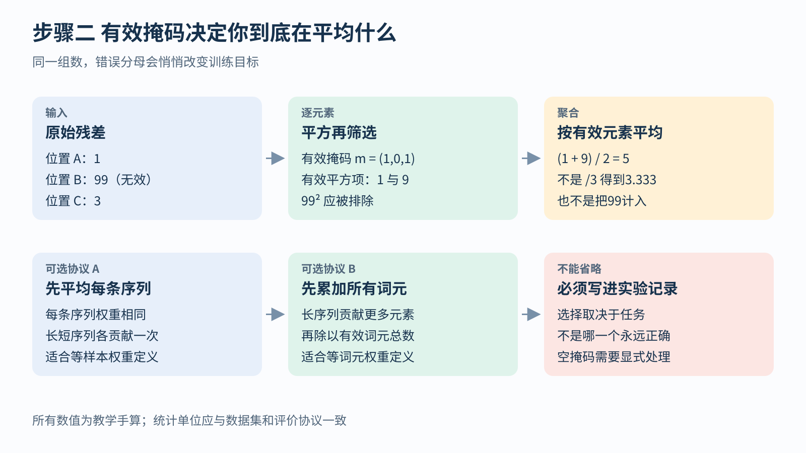

# 回归与鲁棒损失 从残差到训练分数

[返回任务与目标总览](../../03-tasks-losses.md) · [返回学习导航](../../00-learning-navigation.md)

## 先读两分钟

回归先问“误差到底是什么”，再问“怎样罚它”。本模块从一维残差开始，学会MSE、MAE、Huber的不同偏好，再检查有效掩码、异常值与物理单位。先会算三个残差的分数，再读鲁棒估计。

最少前置：知道模型输出 `ŷ=fθ(x)`、标签是 `y`。本模块只讨论预测残差，参数上的L1/L2另见[正则化模块](./05-regularization.md)。



## 连续数值错了多远

回归先形成残差 `r = ŷ − y`。先以一个输出坐标为例：

- 平方误差：`r²`；对有效元素求平均就是均方误差MSE
- 绝对误差：`|r|`；求平均就是平均绝对误差MAE
- Huber：小误差采用二次项，大误差采用线性项

```text
Huberδ(r) = 0.5 r²                    当 |r| ≤ δ
            δ (|r| − 0.5 δ)           当 |r| > δ
```

`δ > 0` 是切换尺度，与残差有相同单位。Huber在零附近平滑，又让极大残差的梯度不像平方误差那样一直增大。它与Smooth L1的缩放约定不总相同，不能仅凭名字替换超参数。[PyTorch Huber定义](https://docs.pytorch.org/docs/2.14/generated/torch.nn.HuberLoss.html)

**手算：** 三个残差是 `1、1、10`，则MSE为 `(1+1+100)/3 = 34`，MAE为 `12/3 = 4`。取 `δ=1`，Huber为 `(0.5+0.5+9.5)/3 = 3.5`。重点不是3.5比34“小”，而是大残差对三种目标的相对影响不同。

MSE偏好条件均值，MAE偏好条件中位数。例如输入完全相同而标签是 `0、0、9`，常数预测3使MSE最小，预测0使MAE最小。这提醒我们：若同一观察下存在“左绕、右绕”两种成功动作，平方误差可能学到两者的平均；这个平均未必是一条可行路径。

MSE还可由固定方差的高斯观测模型推导；MAE可由固定尺度的拉普拉斯模型推导。但使用MSE不意味着现实噪声已经被证实是高斯分布，也不保证网络输出带有可靠置信度。



读曲线时分别看零附近和远离零的区域。平方误差的导数是 `2r`，绝对误差在非零处的导数只有正负号；Huber在小残差区的导数是r，在外侧则饱和为 `δ·sign(r)`。因而Huber减少的是极端残差对梯度的影响，不是自动把异常样本删除。异常值若恰好是部署中重要的罕见事件，过分压低它的影响也可能有代价。

## 有效掩码与平均分母

样本接口为 `(x,y,m,meta)`，其中m表示有效目标位置，meta记录时间、坐标系、单位和来源。常见形式是 `Σ(m·ℓ)/Σm`；没有有效目标时，应显式跳过或处理该批次。



长度2和长度100的序列，按所有有效元素平均会让后者贡献更多；先各自平均再平均则让两条等权。两者都可能有意义，关键是与实验问题一致。把米改成厘米后，MSE扩大一万倍；若想让Huber切换点保持同一物理含义，δ也要乘100，整体损失尺度还需重新检查。

## 鲁棒核与不确定性各做什么

对几何残差 `r`，可先用正定协方差 `Σ` 形成 `s=rᵀΣ⁻¹r`，再优化 `Σ样本 ρ(s)`。前一步表达不同方向和单位上的可信程度；后一步通过鲁棒核减弱大残差影响。最小化这类残差函数属于M估计思想，并不限于神经网络。[Ceres非线性最小二乘建模](https://ceres-solver.readthedocs.io/latest/nnls_modeling.html)

注意库接口可能接收“残差平方范数”，而不是残差本身，不能把前文标量Huber公式原封不动套上去。鲁棒阈值也必须对应白化前或白化后的尺度。鲁棒核不能自动修正错误坐标系、整段时间错位或系统性坏标签。


## 关键论文段落研读

**研读定位：MAE正文§3的重建目标段落，另有已有全文精读可继续。** [原论文](https://arxiv.org/pdf/2111.06377#page=3)把解码器输出还原为像素，并仅在被遮挡patch上计算MSE。它说明同一平方误差不仅能回归机器人位移，也能作为表示学习的预训练信号；目标来自图像自身，仍有明确的y和m。

逐段阅读时先圈出“输出是像素”、再圈出“只算遮挡位置”，最后问“评价是重建误差还是下游表征”。不能由重建loss低直接推出分类更强。继续阅读[MAE已有全文精读](https://github.com/hk865/my-knowledge-data-base/blob/main/docs/deep-readings/mae.md)，其中明确区分正文、附录覆盖与未做训练复现。

这里是关键段落研读与概念推导，不重新宣称完成了新的MAE全文复现。

## 自检与下一步

1. 重算残差1、1、10的MSE、MAE和δ=1的Huber
2. 给无效标签加一个特别大的数，检查掩码是否真的使loss不变
3. 区分“对残差用L1”与“对网络参数用L1”

下一步：[概率分类与NLL](./02-classification-probabilities.md)解释如何从概率模型构造损失；[机器人几何目标](./04-robotics-imu.md)解释为什么姿态不能简单作坐标差。

所有示意图均为本讲义原创；手算和解析曲线不代表训练实验。本文没有重跑论文训练或独立复算其报告指标。
