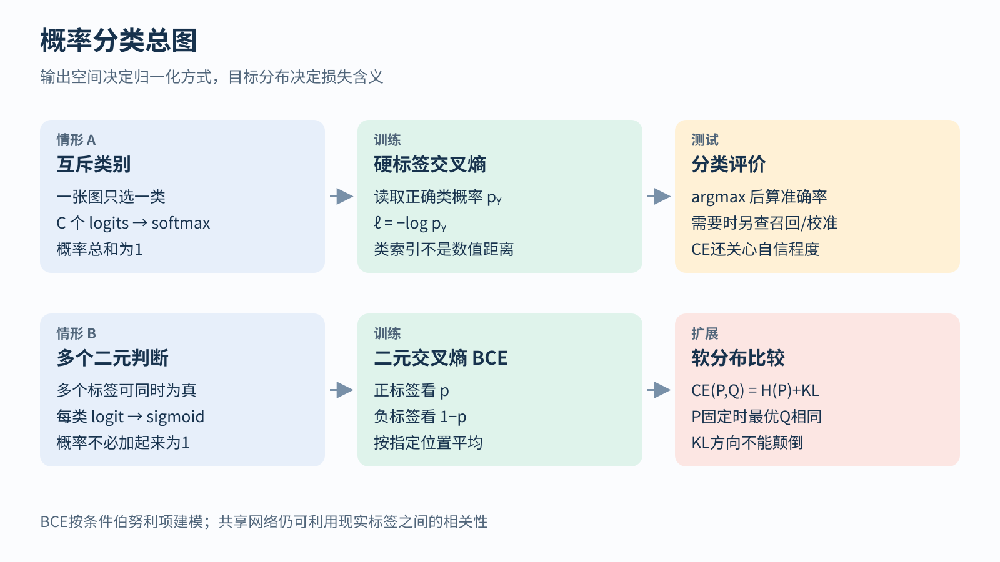
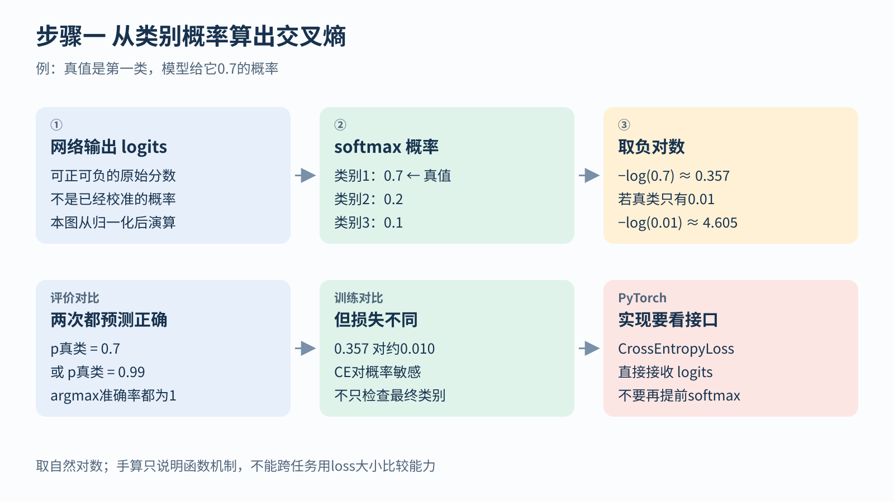
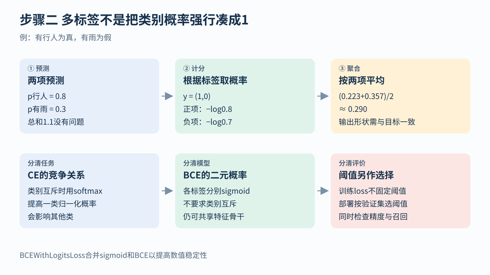

# 概率分类 从交叉熵到BCE NLL与KL

[返回任务与目标总览](../../03-tasks-losses.md) · [返回学习导航](../../00-learning-navigation.md)

## 先读两分钟

先分清“互斥地选一类”和“分别回答多个是非问题”。本模块从logits、概率和真实标签走到CE/BCE，再解释NLL与KL。读完应能写出输出形状，算出一条样本的损失，并说明为什么准确率与交叉熵不同。

约定样本为 `(x,y,m,meta)`。m只规定有效监督位置；网络能看什么信息，还由输入和注意力等机制决定。



## 给真实结果分配了多大概率

负对数似然NLL的一般形式是：

```text
ℓNLL = −log pθ(y | x)
```

`pθ` 是模型给目标的概率，或连续变量的概率密度。对数把多个独立条件项的乘积变成加法；加负号后，概率越高，惩罚越低。NLL是一种构造目标的方法，不是一种固定网络，也不只属于分类。

例如连续回归让网络同时输出均值 `μ` 和正方差 `σ²`，高斯NLL在忽略常数后为：

```text
ℓ = 0.5 [log σ² + (y − μ)² / σ²]
```

残差为2时，方差1给出2，方差4给出约1.193，方差100却回升到约2.323。较大方差可表达“不确定”，但对数项阻止模型靠无限放大方差逃避所有错误。方差应通过正值参数化并作数值保护，仍须另测校准。[Gaussian NLL定义](https://docs.pytorch.org/docs/2.14/generated/torch.nn.GaussianNLLLoss.html)

连续密度可以大于1，因此连续NLL可以为负；它还受单位和常数项约定影响。不能把它与分类NLL或别人的不同归一化loss直接比较。

## 互斥类别与多个独立判断

**多类单标签分类：** 一张图在指定标签体系里只属于一个类别。网络先输出每类的原始分数logit，再通过softmax得到总和为1的概率。硬标签交叉熵为 `ℓCE = −log p正确类别`。

**手算：** 三类预测概率为 `(0.7, 0.2, 0.1)`，真值是第一类，损失约0.357；若正确类只得到0.01，损失约4.605。两个预测都可能选错，交叉熵还会区分“错得多自信”。在PyTorch中，CrossEntropyLoss直接接收logits；通常不要先做softmax再传入。硬标签是整数类别索引，不是类别编号之间的距离。[交叉熵接口与定义](https://docs.pytorch.org/docs/2.14/generated/torch.nn.CrossEntropyLoss.html)



**二分类或多标签分类：** 若分别判断“有行人”“有雨”“有车辆”，多个标签可以同时为真。每个输出通过sigmoid转成一个二元概率，常用二元交叉熵BCE：

```text
ℓBCE = −[y log p + (1−y) log(1−p)]
```

例如两个标签 `y=(1,0)`，概率 `p=(0.8,0.3)`，逐标签平均损失为 `[-log0.8−log0.7]/2 ≈ 0.290`。它没有要求两个概率之和为1。BCE按条件伯努利项建模，不表示现实标签真的互不相关；共享骨干仍可利用它们的相关信息。BCEWithLogitsLoss把sigmoid与损失合并以提高数值稳定性。[BCE官方说明](https://docs.pytorch.org/docs/2.14/generated/torch.nn.BCEWithLogitsLoss.html)



两类互斥任务既可用两个logit加CE，也可用一个logit加BCE。选定一种接口即可，不能把“有两个类别”误解成必须有两个独立二元标签。

## 两个分布不同在哪里

给定目标分布 `P` 与预测分布 `Q`，KL散度为：

```text
KL(P || Q) = Σc Pc log(Pc / Qc)
```

它衡量按P加权的概率偏离，不是对称距离。取 `P=(0.5,0.5)`、`Q=(0.75,0.25)`，可得 `KL(P||Q)≈0.144`，反向约0.131。交叉熵满足 `CE(P,Q)=H(P)+KL(P||Q)`；当P固定时，最小化两者对Q有相同最优解，但数值不同。

KL常见于软目标蒸馏或分布约束。必须说明方向、温度及在哪些位置求和。PyTorch的KLDivLoss通常要求模型侧输入为对数概率；`mean`与`batchmean`还会产生不同缩放。[KL接口注意事项](https://docs.pytorch.org/docs/2.14/generated/torch.nn.KLDivLoss.html)

## 先把样本接口检查一遍

CIFAR-10分类：`x[B,3,32,32] → logits[B,10]`，整型标签 `y[B]`。IMDb情感分类：`tokens[B,L] → logits[B,2]`，整型标签 `y[B]`；padding需要在编码或池化中妥善排除，但整句分类本身并无逐词元类别loss。B为批量、L为补齐长度。

多标签分类则可令输出与浮点目标都为 `[B,C]`。不要因为形状能广播就认为它一定正确：多出来的维度、错误的类轴、补齐位置参与平均，都可能让代码运行却改变目标。

训练分数与部署阈值也不是同一决策。CE通常配argmax，BCE的阈值应根据验证协议及漏检/误报代价决定；准确率之外还要按任务报告召回、精确率或校准。


## 关键论文段落研读

**研读定位：InstructGPT §3.5的SFT训练与模型选择段落。** 原文报告，示范token的验证loss约在一轮后开始过拟合，但更久的SFT仍可改善人类偏好与奖励模型评分。这不是交叉熵“失效”，而是指出示范似然与用户偏好是不同评价问题。[原文§3.5](https://arxiv.org/html/2203.02155v1)

读这一段时分清三件事：监督目标是什么、用哪个验证指标选模型、最终怎样评价。结论仅限论文对应实验，不可推成“训练越久越好”或“所有验证loss都不值得看”。可继续读[InstructGPT原论文](https://arxiv.org/pdf/2203.02155v1)，本模块只核读了相关训练段落，不声称重新完成全文精读。

## 自检与下一步

1. 为“每图一个物种”和“图中有哪些物体”各写一个输出与标签形状
2. 比较p真类=0.7与0.99：准确率相同，CE为什么不同？
3. 将KL(P||Q)和KL(Q||P)分别算一遍

下一步：[自监督与生成目标](./03-pretraining-objectives.md)解释为什么同样的CE可用于下一词元、掩码恢复与对比匹配。

所有示意图均为本讲义原创；手算和解析曲线不代表训练实验。本文没有重跑论文训练或独立复算其报告指标。
