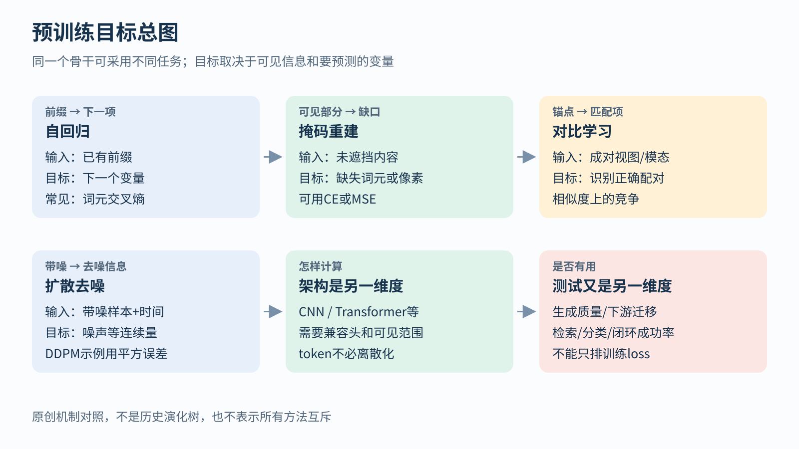
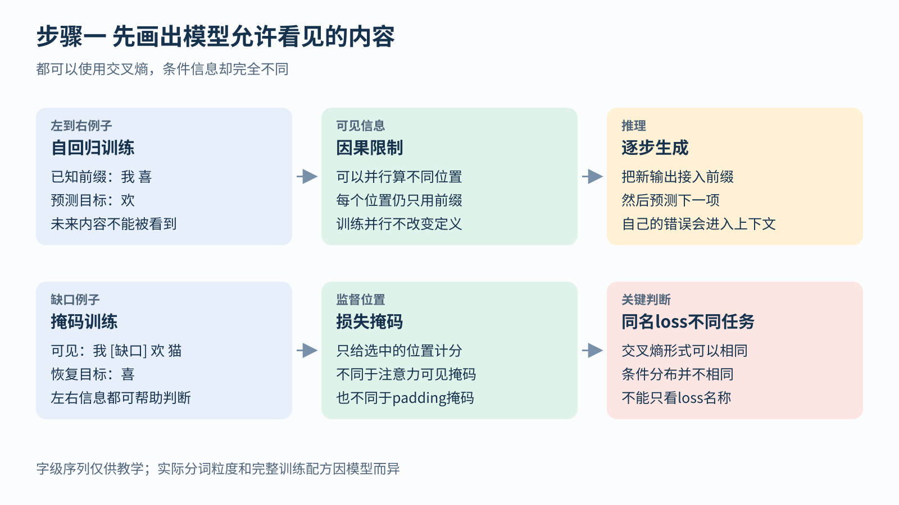
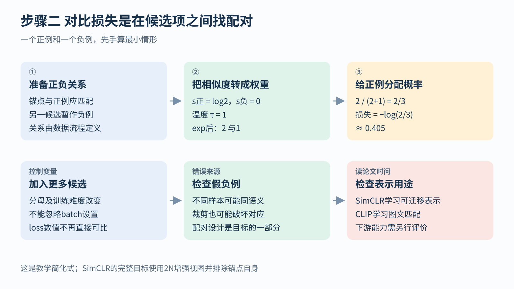

# 自监督与生成目标 从可见信息到学习信号

## 1. 同一份数据可以出成不同的练习题

假设我们有一张猫坐在窗边的照片，以及描述它的一句话。我们可以让模型判断它是不是猫，可以遮住照片一块让模型补全，可以拿几句文字让模型找出匹配的一句，也可以把图片加上噪声，让模型学习怎样去噪。

这些任务可能使用相似的神经网络零件，却给出了不同的学习信号。架构回答“网络怎样计算”；训练目标回答“我们让它做什么题、根据什么判分”；评价则回答“学完以后究竟有没有用”。

自监督的核心是从数据本身构造目标，例如用原句里被隐藏的词作答案。它不是没有答案，也不是没有损失。图文配对还可能来自人写的描述，因此不同方法的监督来源也不能一概而论。

这张图不是历史进化树。左上自回归没有让右侧方法过时；不同目标可以共存或组合。阅读时先看每一格的输入与目标，再看用什么分数，不要只记住CE、MSE几个缩写。

## 2. 自回归先规定不能偷看哪一部分

把“我喜欢猫”暂时分为三个词元：我、喜欢、猫。词元token是模型处理的一个单位，实际分词可以是字、词或子词，这里只为手算。

自回归语言模型按顺序预测：

没有正文时预测“我”；

看见“我”后预测“喜欢”；

看见“我喜欢”后预测“猫”。

用概率写，就是：

p(y₁,y₂,y₃)=p(y₁)p(y₂|y₁)p(y₃|y₁,y₂)

y₁、y₂、y₃是三个词元，“|”表示以已经给出的内容为条件。更长序列只是继续乘下去。这是概率链式分解；自回归模型进一步选择按这种顺序参数化、训练和生成。

模型每次给词表里的候选词元一组概率。若真实词元得到概率p，损失为−ln p，这就是交叉熵。一次完整句子可以把各有效位置的分数相加或平均，但必须写明是哪一种。

## 3. 输入和答案错开一位训练才能成为预测

训练时，整句文本已经在数据中。我们可以准备：

输入：[BOS，我，喜欢]

目标：[我，喜欢，猫]

BOS是句子开始的特殊符号，用来给第一个预测提供起点。第一个输入位置预测“我”，第二个位置预测“喜欢”，第三个位置预测“猫”。

如果某个位置允许看到自己要猜的答案，模型可能直接复制，得到很低的训练损失，却没有学会真正生成。因此使用因果限制：每个预测只能利用对应的已有前缀，不能读取未来目标。

假设三个真实词元分别得到概率0.5、0.25、0.8。整句条件概率为0.5×0.25×0.8=0.1。总负对数似然为−ln0.1≈2.303；逐项算是0.693+1.386+0.223≈2.303。若按三个词元平均，得到约0.768。

同一预测只因求和或平均，就出现2.303与0.768两种分数。因此比较语言模型loss时，要确认词元化、有效目标位置和分母一致。

## 4. 训练可以并行为什么生成仍常常逐步进行

训练已知真实句子，所以不同位置的前缀都能由数据提供。网络可以在同一批矩阵计算里处理所有位置，再通过因果注意力掩码阻止各位置看到未来。这种并行不改变每个预测的条件信息。

推理时，未来句子还不存在。模型先生成一个词元，再把它放进前缀，继续生成下一个。因此训练前缀常来自真实数据，推理前缀逐渐包含模型自己的答案；一处错误还可能影响后续内容。

“自回归”由这个条件关系定义，不由“使用Transformer”定义。其他结构也可以自回归；Transformer也可以用于非自回归任务。

图上排用字级例子“我 喜”预测“欢”；下排用“我 [缺口] 欢 猫”恢复“喜”。文字粒度只是示意，关键区别是上排不能看后面，下排允许借助左右两侧上下文。

## 5. 掩码学习不是从左到右再换一个名字

掩码语言建模先挑选一些位置隐藏或破坏，然后要求模型恢复原词元。例如原句“我喜欢猫”，输入变成“我 [MASK] 猫”，答案是“喜欢”。模型可以借助左右上下文，因为任务本来就是补缺口。[1]

BERT的具体做法不止简单地把每个选中位置都换成[MASK]，还包含其他替换策略，以减轻训练特殊符号与实际使用的差异。但理解核心机制时，先掌握“选中目标、构造受损输入、恢复原答案”即可。[1]

这里有三种容易混淆的掩码：

- 补齐掩码：哪些位置是为了凑长度填进去的，没有真实内容
- 可见性掩码：某个位置允许读取哪些其他位置，例如因果限制
- 损失掩码：哪些位置参与计分，例如只评价被选中恢复的位置

只把未来位置从loss中删掉，不会自动阻止网络看到它们。反过来，限制了注意力，也没有自动决定哪些目标该参与平均。数据流程必须分别处理。

如果词表有V个候选，掩码位置仍可输出V个logit，再用交叉熵。这与下一词元任务使用同一种计分函数，但条件分布不同，训练问题就不同。

## 6. 图像掩码为什么可能用MSE而不是交叉熵

图像也可以切成小块patch。比如一张图片切成16块，遮住其中若干块，模型看见其余部分后预测缺失内容。

MAE方法让编码器主要处理可见patch，再通过解码器重建图像像素，并在遮挡位置计算重建误差。[2] 编码器负责从输入提取表示，解码器把表示转换回训练要求的输出。这里的表示是网络内部的一组数字，不等于人工类别标签。

若缺失patch中某个归一化像素真值为0.7，模型预测0.5，平方误差就是(0.5−0.7)²=0.04。多个像素按既定方式平均得到MSE。像素是连续数值，所以不必变成词表分类。

这解释了为什么“图片也被切成token”不等于“它正在做自回归分类”。token只是输入单位，目标可以是像素、离散码、类别或别的表示。

重建目标可能促使模型理解对象与布局，但低重建误差未必对应最强分类能力。要评价预训练表示，应把编码器放到规定的下游任务中测试，而不是只给重建loss排榜。

## 7. 对比学习把任务改成在候选项里找配对

现在不要求生成像素，而是给猫照片做两次不同裁剪，希望模型仍认出它们来自同一张图。网络将每个视图变为一个向量，称为表示；我们用相似度s衡量两向量是否接近。

对某个锚点，也就是本次要找配对的视图，其配对视图称正例；其他候选暂时作负例。把相似度经过指数，再在候选里归一化：

p正=exp(s正/τ)/Σ候选exp(s候选/τ)

ℓ=−ln p正

τ是正的温度。它缩放相似度差异：温度较小，较高相似度更容易占据大部分概率；温度较大，分布更平缓。分母必须包含正例，否则不再是这里定义的归一化概率。

先算一正一负的最小例子：s正=ln2，s负=0，τ=1。指数权重为2与1，正例概率2/(2+1)=2/3，损失约0.405。

图的三格依次是确定配对、算权重、计算负对数。若增加一个相似度也为0的负例，分母变成2+1+1=4，正例概率降为1/2，损失升至0.693。模型没变，只是候选集合变了，所以不能忽略batch大小与候选数来比较loss。

## 8. SimCLR的完整一批究竟有哪些候选

SimCLR对N张原图各生成两种增强视图，总共2N个表示。对其中一个锚点，另一张来自同一原图的视图是正例；锚点自己从分母排除，其余2N−1项参与竞争。[3]

例如N=2，原图A、B分别生成A₁、A₂、B₁、B₂。以A₁为锚点时，候选是A₂、B₁、B₂；A₂是正例，另外两个暂作负例。随后每个视图都可轮流作锚点，汇总损失。

论文还把编码器输出h送入投影头，得到z，在z上计算对比损失，而下游通常使用h。投影头是一小段可训练变换；它让“适合完成对比题的表示”与“希望保留给下游的表示”不必完全重合。[3]

真正难点不只是公式。裁剪可能把猫完全裁掉，那么所谓正例已经不再含相同语义；两张不同照片可能都是同一只猫，却被当作负例。数据增强和配对定义都在决定模型学会忽略什么、保留什么。对比学习不是自动知道现实中谁应当相似。

## 9. CLIP把图像与文字配成一张匹配表

CLIP使用图像编码器与文本编码器，把一批N对图文分别变成向量，再计算N乘N的相似度矩阵。[4] 第i行、第j列表示第i张图与第j段文字的匹配程度。

若只有两对数据，图A配文字A，图B配文字B，那么期望较高的匹配在对角线上。沿每一行问“这张图该选哪段文字”，可计算一次交叉熵；沿每一列问“这段文字该选哪张图”，再计算反向交叉熵，组合成双向目标。

这与SimCLR有共同的候选竞争形式，但监督关系不同：一边来自同图的增强视图，一边来自图文配对。文本可能含人类描述的语义知识，因此不能仅因为没有固定分类标签，就抹去其监督来源。

训练完成后，检索图文匹配、用文本提示作零样本分类，都是另外规定的使用与评价方式，不是训练loss本身已经报告了这些能力。

## 10. 扩散把干净数据变成不同难度的去噪题

扩散生成的一条常见路线是：训练时人为给干净数据加噪，让网络预测加入的噪声；生成时从噪声开始，按规定的反向步骤逐渐得到样本。[5]

用DDPM的一种训练参数化说明。x₀是干净数据，ε是本次随机采样的标准高斯噪声，t表示噪声级别。记ᾱₜ为由噪声日程确定的信号保留系数，则：

xₜ=√ᾱₜx₀+√(1−ᾱₜ)ε

网络输入xₜ和t，输出εθ(xₜ,t)，希望接近本次实际加入的ε。常用简化损失是噪声预测的平方误差：

L_simple=E[‖ε−εθ(xₜ,t)‖²]

E表示对训练样本、噪声级别和随机噪声取平均；范数平方表示所有坐标残差平方相加。不是要求第一次阅读就掌握完整随机过程，而是先看清答案从哪里来：噪声由训练程序自己采样，所以程序知道正确ε。

用一维例子手算：设x₀=2，ᾱₜ=0.64，ε=1，则xₜ=0.8×2+0.6×1=2.2。若模型预测噪声0.7，平方误差为(1−0.7)²=0.09。

给定噪声估计，还可推一个干净值估计：(2.2−0.6×0.7)/0.8=2.225。但正式生成流程通常还要按选定采样器完成多步反向更新，不能把这一个代数式当成所有扩散模型的完整采样算法。

## 11. 为什么去噪的迭代不等于下一词元生成

扩散中的t通常表示噪声水平。它的一步可能同时修正整张图或整个动作块的很多坐标；下一步再在另一个噪声水平上继续处理。自回归则按指定变量顺序，让新变量依赖已经生成的前缀。

所以“它也循环很多次”并不能说明它是文本式自回归。反过来，自回归也可以预测连续变量的条件分布，并不必须用离散词表。

DDPM论文的简化MSE还改变了原变分目标中不同噪声级别的权重。变分目标是与数据似然相关的一种可优化界；简化目标不是原样、未改权的同一个表达式。作者用具体实验讨论了这些取舍，不能只看到平方误差就认为完整概率建模推导不存在。[5]

## 12. 生成动作也需要回到执行系统里评价

Diffusion Policy把类似去噪思想用于条件动作生成：根据当前观察，生成一段未来动作，再执行其中一部分，重新观察并规划后续。[6] 这里动作块可同时包含多个时间步的连续控制量。

为什么不一次把整段动作执行完？真实环境可能变化，执行有误差，新的观察能让策略修正。这个反复“观察、生成、执行部分、再观察”的过程属于闭环使用方式，与仅在离线示范上算动作MSE不同。

即使动作分布比单个均值更灵活，也不自动保证安全、动力学可行或跨环境泛化。要分别评价离线目标、实际闭环成功率、失败类型和计算延迟。本章介绍目标机制，没有复现这些论文的训练与机器人实验。

## 自检

1. 训练时同时处理全部词元，为什么还能是自回归？因为每个位置的可见前缀仍受因果限制。
2. 损失掩码能防止偷看未来吗？不能，它只规定计分位置。
3. 一张图被切成patch，目标一定是离散分类吗？不一定，MAE可预测连续像素。
4. 对比损失增加一个负例为什么可能升高？候选分母变大，任务改变。
5. 扩散训练时噪声答案从哪里来？来自训练程序自己采样并加入的噪声。

这些目标有不同优势与边界，可以组合，也可以用于不同架构。判断一个系统在学什么，最可靠的顺序仍是：看见什么、预测什么、哪里计分、怎样评价。

## 参考资料与继续阅读

[1] Devlin等，BERT: Pre-training of Deep Bidirectional Transformers for Language Understanding：https://arxiv.org/abs/1810.04805

[2] He等，Masked Autoencoders Are Scalable Vision Learners：https://arxiv.org/abs/2111.06377

[3] Chen等，A Simple Framework for Contrastive Learning of Visual Representations，公式1与算法1：https://arxiv.org/abs/2002.05709

[4] Radford等，Learning Transferable Visual Models From Natural Language Supervision：https://arxiv.org/abs/2103.00020

[5] Ho等，Denoising Diffusion Probabilistic Models，3.4节简化训练目标：https://arxiv.org/abs/2006.11239

[6] Chi等，Diffusion Policy: Visuomotor Policy Learning via Action Diffusion：https://arxiv.org/abs/2303.04137

继续阅读：[机器人与IMU](./04-robotics-imu.md)；[概率分类](./02-classification-probabilities.md)；[返回任务与目标总览](../../03-tasks-losses.md)；[返回学习导航](../../00-learning-navigation.md)
