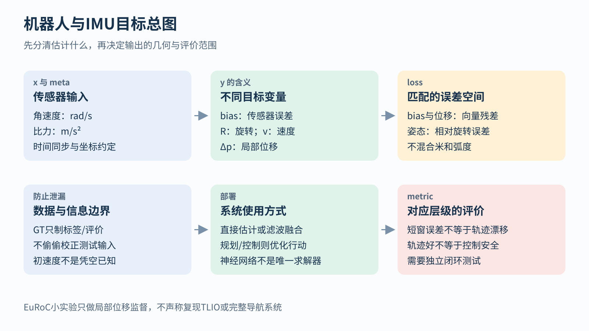
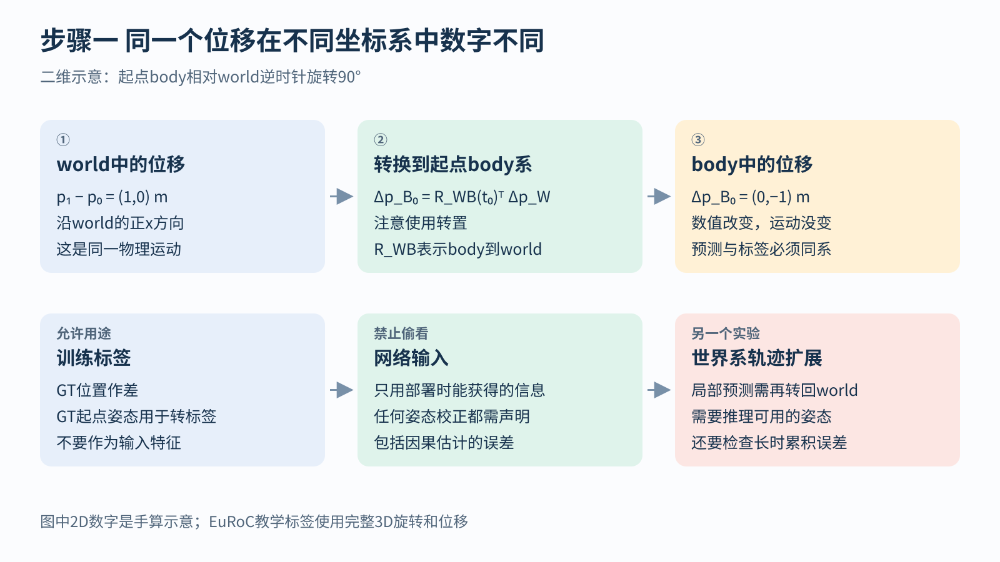
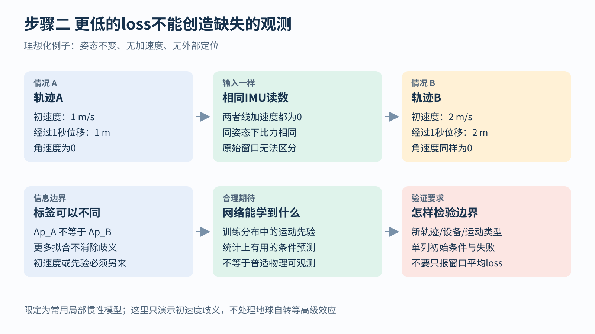

# 机器人与IMU目标 从坐标约定到可观测性

## 1. 机器人说学会了究竟是哪一件事

想象一台小车正在走廊里行驶。它可能需要回答三类问题：我现在在哪里；下一步应该往哪走；电机应该施加什么动作。三者相关，却不是同一个预测任务。

状态估计回答位置、朝向、速度等当前状态。规划与控制选择未来轨迹或动作。模仿学习则从示范中学习“在这样的观察下应该怎样行动”。一个估计网络的误差小，不直接证明控制安全；一个动作预测器在离线数据上准确，也不自动保证小车真实运行时不偏离示范。

本章以IMU短窗位移预测为主线，逐步说明传感器读到了什么、标签怎样定义、旋转为什么不能任意相减，以及更低的loss为什么无法创造缺失的物理信息。

总图上排先检查输入、目标和误差空间，下排才讨论部署与评价。尤其要留意“短窗误差”和“长期轨迹漂移”是两个层级；当前实验只完成哪一层，就只能声称验证了哪一层。

## 2. IMU的六个数字并不是位置和速度

常见六轴IMU包含三轴陀螺仪与三轴加速度计。三轴指沿设备自身的三个坐标方向分别测量。

陀螺仪提供角速度，例如绕某个轴每秒旋转多少弧度，单位rad/s。180度等于π弧度。角速度描述转得多快，不直接等于当前朝向；要结合初始朝向并随时间积分，才能得到朝向变化。

加速度计测量的是比力，单位m/s²。它不是已经在世界坐标系中去掉重力的线加速度。常用局部模型写成：

f测=R_WBᵀ(a_W−g_W)+bₐ+nₐ

先逐个读符号。a_W是设备在世界系的线加速度；g_W是重力向量；R_WB把设备body系向量转到world系，转置R_WBᵀ反过来把世界系量转回设备系；bₐ是加速度计偏置；nₐ是噪声。[1]

偏置bias可以先理解成传感器持续多报或少报的一点量，随温度或时间还可能变化；噪声则使读数在短时间内波动。陀螺仪也有自己的偏置b_g，单位是rad/s，不能与加速度偏置的m/s²直接混成同一种量。

如果设备竖直静止，a_W=0，世界系重力向下，理想比力会抵消重力项而呈向上的约9.81m/s²。实际哪个轴为正要看设备轴定义。因此“静止时加速度计应当全为零”一般是错误理解。

## 3. 同一窗口可以设置好几种不同的标签

输入一段IMU读数，可以要求网络预测偏置、姿态、速度或者位移。这些问题共享输入，但答案不同。

预测偏置是在估计传感器误差；预测姿态要处理旋转几何；预测速度或位移还涉及初始状态和运动规律。不能因为都输出三个数，就认为它们是同一个回归任务。

传统状态估计器也会最小化残差。例如它直接调整本次轨迹的位置、速度、姿态，让传感器模型尽量解释测量。学习型估计器则通常先用许多轨迹训练网络参数，再用网络预测新轨迹中的状态或观测量。两者都能出现MSE，但优化的未知量不同。

IMU预积分把两时刻之间很多高频读数压缩成相对运动约束，并明确处理旋转、偏置与误差传播。[1] 这里不需要先学会整套推导，但应知道：引入神经网络不意味着这些物理关系可以忽略，学习输出也可以作为传统估计器的一部分。

## 4. 给短窗位移任务写一份明确合同

本套EuRoC教学实验采用每窗200条、每条6个IMU值的输入。一个批次可写成x[B,200,6]，B是窗口数；输出ŷ[B,3]，表示每窗的三维位移。形状告诉我们数字有多少，但还没有告诉我们“这三个数在哪个坐标系”。

设窗口起止时刻为t₀与t₁，p_WB(t)是body原点在world系中的位置，R_WB(t₀)是起点body到world的旋转。标签定义为：

y=R_WB(t₀)ᵀ[p_WB(t₁)−p_WB(t₀)]

先作世界系位置差，再转成起点设备坐标系中的位移。为什么使用起点？因为窗口内设备可能旋转，我们必须固定一个表达整段位移的参考系，而不能每个分量随时换轴。

本实验中的参考位置和姿态用于制作标签与评价，不应被暗中拿去修正测试输入。若另一个系统明确使用推理时可得的姿态估计来旋转输入，应说明估计来源、是否因果，以及它的误差如何影响结果。

样本还应带有有效掩码m与元信息meta。m表示该窗有没有可靠标签；meta记录时间戳、单位、坐标方向和参考来源。这些不是可有可无的注释，而是目标定义的一部分。

## 5. 同一个物理位移换个坐标系数字会改变

为了手算，先只看平面。世界x轴向右、y轴向上；起点设备相对世界逆时针转了90度，因此设备的正x轴指向世界正y轴。

相应body到world旋转矩阵的两行是(0,−1)和(1,0)。若世界位移为(1,0)米，即向右移动1米，转到设备系要乘它的转置：

设备x分量=0×1+1×0=0

设备y分量=−1×1+0×0=−1

所以标签为(0,−1)米。

图的三格描述同一条运动，没有让小车真的转弯或反向。只是设备坐标的“向右”对应负y方向，所以数字改变。若模型预测body系而标签仍用world系，MSE会处罚本来正确的物理预测。

完整三维使用3乘3旋转矩阵，但原则完全一样：先写清R到底从哪个系转到哪个系，再决定是否取转置。不要凭变量名字猜方向。

若要把每个局部位移接成世界轨迹，还需做反向转换：世界增量约为R_WB(t₀)ŷ。这个R在部署时必须真实可得，不能偷用测试真值。它一旦有误差，局部位移再准确，也可能被转到错误方向。

## 6. 为什么姿态误差不能直接逐坐标相减

平移向量可以作差，旋转却有表示等价性。平面角度179度与−179度在圆周上只差2度，普通减法得到358度。绕一圈回到原处，数值标签却可能跳变，这就是表示与真实几何之间的差别。

三维常用欧拉角或四元数表示朝向。欧拉角有顺序约定与奇异位置；单位四元数用四个受长度约束的数表示旋转，而q与−q表示同一姿态。比如(1,0,0,0)和(−1,0,0,0)表示同一个单位旋转，但逐分量差的平方和为4，显然不该作为真实姿态错误。

一种更明确的方式是先求相对旋转：

R相对=R真值ᵀR预测

它表示从真实朝向到预测朝向还差怎样的旋转。再把这次旋转写成“转轴方向乘旋转角”的三维向量e_R。正式记法常为：

e_R=Log(R相对)∨

ℓ_R=‖e_R‖²

Log在这里是旋转矩阵的对数映射，不是对九个元素分别取普通对数；∨表示把对应的反对称矩阵读回三维向量。初学时可以先抓住输出含义：向量方向是转轴，长度是主旋转角，单位弧度。[2]

179度与−179度这个例子中，最短角差为2度，约0.03491弧度，因此角度平方约0.001218，而不是358度对应的巨大错误。

合法三维旋转组成SO(3)。它要求坐标轴保持单位长度、彼此垂直，并排除镜面反射。网络输出九个任意数并不会自动成为合法旋转；输出四元数也需要单位化等处理。接近零角度或180度时，计算Log还需稳定实现，不能只写数学符号便认为程序一定可靠。[2]

## 7. 米与弧度为什么不能无意间混在一起

位姿同时包括平移和旋转，常用SE(3)描述。它组合三维旋转与平移，不包含额外的缩放自由度；单目视觉中可能缺少绝对尺度，是传感器观测问题，不是SE(3)多了一个尺度参数。

假设位置误差0.1米，朝向误差0.1弧度。把两个数字直接平方相加，等于人为规定这两种错误同样重要，但这个规定没有因为公式简洁而自动合理。

一个易理解的办法是按任务容忍尺度无量纲化。如果允许位置误差0.2米、角度误差0.05弧度，则标准化误差分别是0.1/0.2=0.5与0.1/0.05=2，平方和为0.25+4=4.25。它说明当前角度误差相对要求更严重。

也可用可信协方差加权。协方差矩阵Σ记录各方向误差尺度及相关性，rᵀΣ⁻¹r相当于在这些尺度下重新度量残差。再加鲁棒核ρ，可以降低极端残差的影响，但不能修正整体错坐标或时间错位。

## 8. 网络的不确定性为什么会影响融合结果

如果网络不仅预测位移μ，还预测各方向的方差，它是在同时声明“我猜这里”和“我对此有多确定”。高斯负对数似然在忽略常数后可写成：

ℓ=½[rᵀΣ⁻¹r+ln detΣ]

r=目标−μ；detΣ是协方差的行列式。对于对角协方差，它是三个方向方差的乘积。第一项要求预测准确，第二项避免无限扩大不确定性来逃避错误。

先用一个理想化标量融合例子理解“信谁更多”。一个物理预测为1米，方差0.04；一个独立网络观测为1.4米，方差0.01。在误差独立且高斯等条件下，可按精度，也就是方差倒数加权：

权重分别为1/0.04=25和1/0.01=100。

融合均值=(25×1+100×1.4)/(25+100)=1.32米。

网络声称更精确，所以融合更靠近1.4米。若它实际经常错却报告极小方差，系统会过度相信它，这比单看位移MSE更危险。

真实滤波器还要处理多维状态、时间传播和相关性。本例不是TLIO滤波公式的完整替代，只说明为什么“方差是否可信”会改变系统结果。

## 9. 相同IMU读数为什么可以对应不同位移

现在讨论比损失设计更根本的限制。设两个设备姿态相同、没有旋转，也没有线加速度。设备A以1m/s匀速移动，设备B以2m/s匀速移动，持续1秒。

A移动1米，B移动2米。它们的角速度都为0，线加速度也都为0；同样姿态下加速度计读到的比力相同。因此这段IMU输入完全可能相同，位移标签却不同。

图左、右是两个不同轨迹，中间是相同读数。底部说明缺的是初速度信息，不能靠换MSE为Huber补出来。这里采用常用局部惯性模型，忽略地球自转等高级效应，不是在讨论所有高精度导航情形。

如果一种未知量在现有测量下无法唯一确定，就涉及可观测性限制。没有外部位置和航向参考时，全局位置和全局yaw通常也没有绝对依据。yaw是绕重力方向的航向角；把整个场景与轨迹一起绕竖直方向转一圈，局部惯性读数未必能分辨哪边是真正北方。

位移网络仍可能表现不错，因为它从训练数据学到了运动先验，例如某种步态通常对应某种速度。先验是对常见运动模式的统计倾向，不是新增的传感器观测。在训练分布内有用，与对任意物理运动唯一可解，是不同结论。

## 10. 很小的偏置为什么会变成很大的位置漂移

假设姿态和重力补偿完全正确，只剩恒定加速度偏差b。积分一次，速度误差约为bt；再积分一次，位置误差约为½bt²。

取b=0.01m/s²、t=100秒。速度误差是1m/s，位置误差是½×0.01×10000=50米。每次读数只是很小一点偏差，持续积累后却不能忽略。

真实系统还会有姿态误差，使重力分量混入本不该有的水平加速度；误差可能随运动变化，所以这个50米例子只是隔离机制，不是对具体设备的预测。

短窗误差小不保证长轨迹误差小。相邻窗口若持续偏向同一方向，错误不会像独立随机噪声那样互相抵消；转换姿态与初始速度也会影响拼接。必须另做轨迹级评价。

## 11. TLIO怎样把学习先验放回估计器里

TLIO是一个具体组合：网络从IMU窗口预测三维位移和对角协方差，滤波器用物理IMU模型传播状态，再用网络输出作测量更新。它使用局部重力对齐坐标系，竖直方向与重力一致，同时谨慎处理航向，避免向滤波器注入虚假的全局yaw可观测信息。[3]

重力对齐系与本章EuRoC实验的“起点完整body系”不是同一种坐标选择。前者消除了倾斜、保留特定航向约定；后者沿起点设备自身三个轴表达位移。不能仅因为都叫局部位移，就把标签与接口互换。

论文中网络的方差也不是生成后便毫无调整地使用。连续重叠窗口的观测相关，原文实践中把预测协方差放大10倍。系统还需要初始化，实验使用参考初速度、roll和pitch，并给相应不确定性；位置和yaw用于固定坐标规范。[3]

这几条说明该方法是“网络加估计器加明确初始条件”的完整系统，不是从任意原始IMU窗口凭空恢复全部状态。阅读时应连同输入对齐、协方差、初始化和评价协议一起理解；本章没有复现TLIO。

## 12. 从数据集到真实机器人还要检查什么

EuRoC数据来自微型飞行器，提供相机、IMU与参考运动信息。官方说明也列出了高速动态运动下参考测量精度可能变差、不同记录系统之间同步有限等问题。参考轨迹是评价依据，但不能因此假定每一时刻都完全无噪声。[4]

制作标签时，先核对时间戳单位、插值范围、四元数分量顺序、旋转方向、传感器外参和参考来源。时间错开几十毫秒，在快速运动时就可能变成显著标签偏差；鲁棒loss不负责自动校正这一问题。

划分训练测试时，应按独立序列、设备或场景等任务要求进行，避免高度重叠的邻近窗口落到两边而制造虚高结果。若要证明跨携带方式或跨运动类型有效，就应专门留出相应测试，而非只随机抽几个窗。

报告短窗位移时写清窗口长度、坐标系、单位与向量误差定义。报告整段轨迹时还要写初始状态、时间同步、是否平移或旋转对齐、评价时长与最终漂移。对齐去除了哪些自由度，也决定了这个数字究竟验证了什么。

## 13. 动作预测为什么还需要闭环测试

模仿学习可以把观察映射成动作，离散动作使用分类目标，连续动作使用回归或分布目标。但机器人一旦有一点动作偏差，就可能进入示范里很少出现的状态；下一次又在陌生状态中作决定，误差可能累积。

DAgger研究的核心机制是让学习策略实际遇到的状态也进入数据收集，再由专家提供相应动作标签，逐步扩大训练覆盖。[5] 这说明问题不仅是把离线loss降得更低，还包括训练数据是否覆盖部署过程中会到达的状态。

规划器还可能直接优化目标距离、动作能量与避障代价。给碰撞一个有限惩罚权重，不等于严格保证不碰撞；安全约束与系统验证需要独立设计。本章不会把短窗回归成绩升级为真实控制安全结论。

## 自检

世界位移(1,0)、起点body逆时针转90度，局部标签是什么？(0,−1)。

两个匀速运动速度不同，IMU能只凭无加速度窗口区分它们吗？在本章模型下不能，还需初速度或额外先验。

q与−q不同，真实姿态一定不同吗？不一定，它们表示同一旋转。

100秒后0.01m/s²恒定偏差的理想化位置误差是多少？50米。

窗口loss低，是否已经验证完整导航？没有，还需部署可得姿态、初始条件、长期轨迹与实际系统测试。

## 参考资料与继续阅读

[1] Forster等，On-Manifold Preintegration for Real-Time Visual-Inertial Odometry，IMU模型、偏置与预积分：https://arxiv.org/abs/1512.02363

[2] Solà等，A micro Lie theory for state estimation in robotics，旋转与位姿误差表示：https://arxiv.org/abs/1812.01537

[3] Liu等，TLIO: Tight Learned Inertial Odometry，网络目标、滤波测量、相关性与初始化：https://arxiv.org/abs/2007.01867

[4] ETH ASL，EuRoC MAV Dataset，数据来源、标定与已知问题；页面附原论文入口：https://projects.asl.ethz.ch/datasets/euroc-mav/

[5] Ross等，A Reduction of Imitation Learning and Structured Prediction to No-Regret Online Learning：https://proceedings.mlr.press/v15/ross11a.html

继续阅读：[回归与鲁棒损失](./01-regression-robustness.md)；[概率目标](./02-classification-probabilities.md)；[返回任务与目标总览](../../03-tasks-losses.md)；[返回学习导航](../../00-learning-navigation.md)
