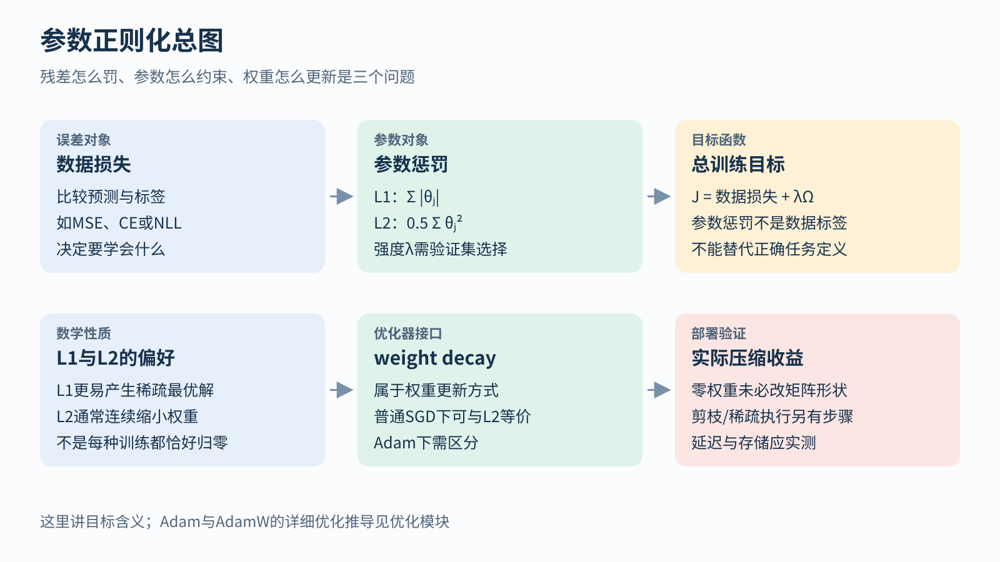
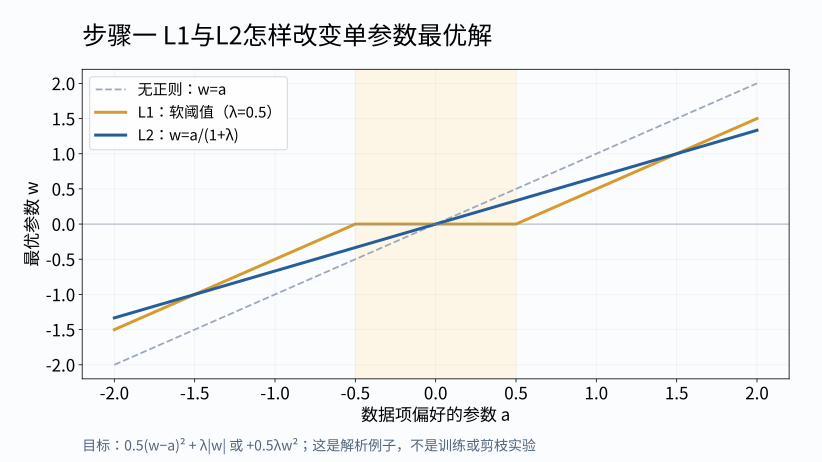
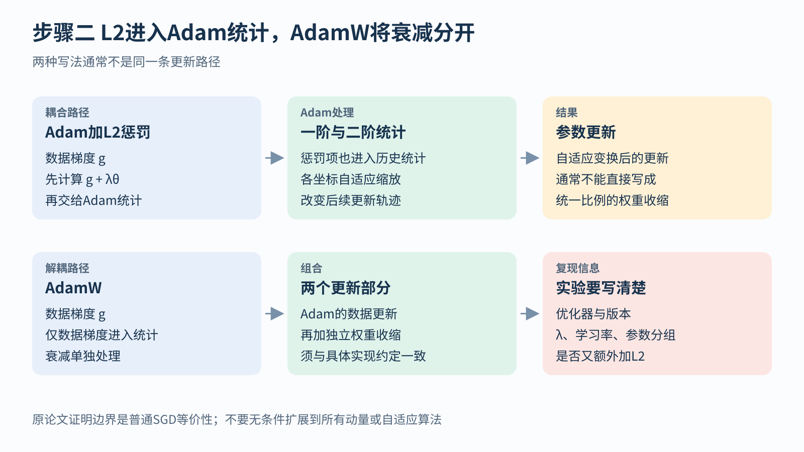

# 参数正则化 从L1 L2到权重衰减

[返回任务与目标总览](../../03-tasks-losses.md) · [返回学习导航](../../00-learning-navigation.md)

## 先读两分钟

参数正则化限制的是模型参数，不是给预测残差改一个名字。本模块从一个可手算的单参数问题看L1/L2，再说明为什么零权重不自动带来剪枝加速，以及为什么AdamW不能简单写成“Adam的loss加L2”。

先理解目标含义即可。优化器内部的一阶、二阶统计和完整更新推导，应接着读优化模块。



## 正则化是在约束哪一种东西

把训练目标写成：

```text
J(θ) = 平均数据损失 + λ Ω(θ)
```

`Ω` 是参数惩罚，`λ` 控制强度。它与对残差使用L1/L2不是同一件事：一个约束参数，一个衡量预测偏差。

L1正则化使用 `Σj |θj|`，L2正则化常写为 `0.5 Σj θj²`。L1更容易产生稀疏最优解；L2通常把权重连续缩小。用单参数例子看最清楚：最小化 `0.5(w−a)²+λ|w|` 的解是对a作软阈值，`a=0.3、λ=0.5` 时得到0；改为L2项后，解为 `a/(1+λ)=0.2`。



这说明目标的偏好，不保证普通梯度更新在有限步内恰好产生很多精确零。即使有零权重，矩阵形状、层数和网络连接结构也未必改变。要取得存储或延迟收益，还需明确剪枝方式、稀疏表示及硬件支持；结构化剪枝另需决定删哪些通道或模块。[PyTorch剪枝教程](https://docs.pytorch.org/tutorials/intermediate/pruning_tutorial.html)

**L2与weight decay只在特定优化方式下等价。** 对不带动量的普通SGD，使用上面的L2约定，可写成：

```text
θ下一步 = (1−ηλ) θ当前 − η ∇数据损失
```

`η` 是学习率。这里惩罚梯度表现为按比例缩小权重。Adam会用历史梯度的一、二阶统计缩放更新；若把 `λθ` 加进梯度，它也会进入这些统计，通常不再等价于直接缩权重。

AdamW把衰减与数据梯度的自适应更新分开。这个区别属于更新规则，不能简单说成“AdamW就是loss加L2”。具体参数名和实现也要核查；同时手加L2又启用衰减会改变目标与更新，应有意为之。[Decoupled Weight Decay原论文](https://arxiv.org/abs/1711.05101)



Dropout、数据增强、早停也可能限制过拟合，但机制不同，更不能保证所有任务都改善。正则化强度需要验证集选择；过强会妨碍拟合，过弱可能不足以抑制对训练细节的依赖。

## 多任务加权也是目标设计

总损失 `Σk αkℓk` 中，各项的单位、数量和梯度规模都可能不同。把位移从米改为厘米，未归一化平方误差会扩大一万倍；这不等于位移任务重要了一万倍。至少先按容忍误差或训练集统计作有依据的尺度处理，再在验证集检查任务间取舍。

按不确定性加权是一类具体建模方法，仍需检查概率假设以及训练目标是否对齐真实用途。[多任务不确定性加权原论文](https://arxiv.org/abs/1705.07115)这类权重不是网络拓扑，调整它们也不是自动做架构搜索。


## 关键论文段落研读

**研读定位：AdamW论文§2的等价性分析与算法2。** 先在普通无动量SGD中把L2梯度展开，会得到每步按比例收缩参数。再检查Adam：若把惩罚梯度并入g，一、二阶历史统计都会受它影响；算法2的解耦版本把衰减作为独立更新部分。[原论文](https://arxiv.org/pdf/1711.05101#page=3)

读图中的实验时，应把“此处优化器与任务上的观察”与“数学等价性条件”分开。不能据此宣称AdamW对任意模型都一定更好，或把普通SGD的等价式推广到任意动量实现。本模块是关键公式与算法研读，没有重跑原文实验，也没有声称通读其全部附录。

## 自检与下一步

1. 用a=0.3、λ=0.5分别求L1与L2例子的最优w
2. 说明为什么权重中有零，不保证推理更快
3. 核对训练配置是否同时手加L2和启用weight_decay，判断这是否是有意设计

下一步：从[学习导航中的优化与训练轴](../../00-learning-navigation.md)进入Adam/AdamW的完整更新模块。

所有示意图均为本讲义原创；手算和解析曲线不代表训练实验。本文没有重跑论文训练或独立复算其报告指标。
