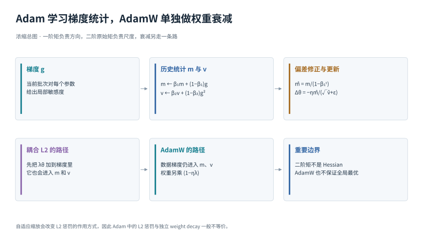
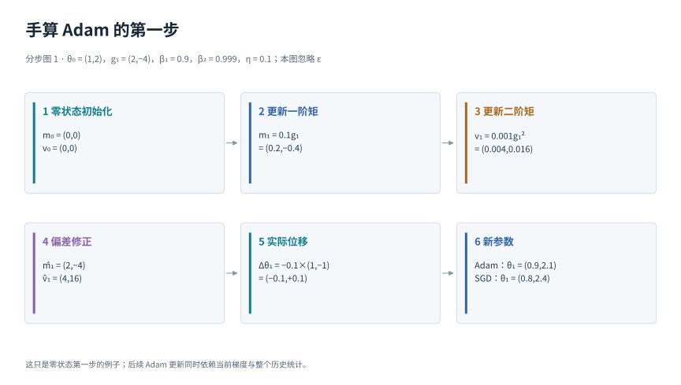
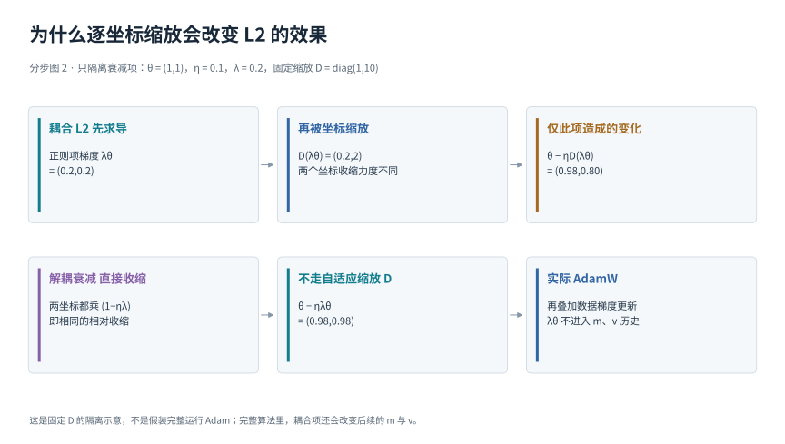

# Adam 与 AdamW

[返回优化目录](../../02-optimization.md) · [返回总导读](../../00-learning-navigation.md)

## 先读两分钟

本模块专门解决三个容易混淆的问题：Adam 的二阶矩是什么，偏差修正在修正什么，为什么 AdamW 不是简单把 L2 名字换成 weight decay。默认你已知道梯度与实际更新不同；不熟悉时先看梯度模块。

## 一张图建立整体印象

## 先约定计算方式

本模块的历史量从第 0 步的零状态开始；第 t 次梯度 gₜ 在更新前参数 θₜ₋₁ 处计算，更新后的参数记为 θₜ。

下列平方、开方、除法均逐元素进行，m、v 初始为零，ε 是分母稳定项。β₁、β₂ 控制历史遗忘速度，η 仍是需要选择的全局学习率。

## Adam 同时记住方向和平方尺度

mₜ = β₁mₜ₋₁ + (1−β₁)gₜ

vₜ = β₂vₜ₋₁ + (1−β₂)gₜ²

m̂ₜ = mₜ/(1−β₁ᵗ)

v̂ₜ = vₜ/(1−β₂ᵗ)

θₜ = θₜ₋₁ − ηₜm̂ₜ/(√v̂ₜ + ε)

m 是一阶矩的滑动估计，保留梯度的方向；v 是二阶原始矩估计，描述平方幅度，**不是“二阶导数”，也不等于方差**。零初始化会使早期均值偏小，分母中的 1 − βᵗ 用来做偏差修正。可以把 Adam 理解为“平滑方向，再按近期幅度缩放”，但它仍需调整全局学习率。[Kingma 与 Ba 的 Adam 原论文](https://arxiv.org/abs/1412.6980)

## AdamW 把权重衰减从自适应梯度中拆开

在损失中加入 λ‖θ‖²/2，梯度会增加 λθ。对不带动量的普通 SGD，这等价于每步额外把参数乘以 (1 − ηλ)；对 Adam，λθ 若进入 m、v，便也参与自适应缩放，两者不再是同一个操作。AdamW 单独做衰减：

θₜ = (1−ηₜλ)θₜ₋₁ − ηₜm̂ₜ/(√v̂ₜ + ε)

这就是 decoupled weight decay。它改变的是更新中“数据梯度”与“参数收缩”的关系，不是让 Adam 自动找到更优的全局解。正则化为何可能改善泛化，见[参数正则化模块](../objectives/05-regularization.md)；这里记住 **L2 惩罚与 weight decay 只在特定更新规则下等价**。[Loshchilov 与 Hutter 的 AdamW 论文](https://arxiv.org/abs/1711.05101)

## 第一步的数值 可以全部算出来

图 1 从零状态开始，取 g = (2,−4)、η = 0.1，忽略 ε。偏差修正后，分子是 (2,−4)，平方根分母是 (2,4)，于是实际位移为 (−0.1,+0.1)。这与 SGD 的 (−0.2,+0.4) 不同。第二步之后，历史平均通常不等于当前梯度，因此不能把 Adam 永远简化成“只取梯度符号”。

若在这同一步使用 λ = 0.1 的 AdamW，旧参数 (1,2) 先相对收缩 1%，成为 (0.99,1.98)，再叠加同一数据更新，得到 (0.89,2.08)。本例有意忽略 ε，只用来理解两个更新分量；它不是推荐超参数。

## 为何自适应缩放让 L2 和衰减分家

图 2 把数据梯度暂时拿掉，并固定缩放矩阵 D = diag(1,10)。若 θ = (1,1)、η = 0.1、λ = 0.2，L2 梯度经过 D 后会让两个坐标分别收缩到 0.98 和 0.80；独立衰减则都到 0.98。它隔离展示“收缩项是否也经过逐坐标缩放”，不是完整 Adam 仿真。在真正 Adam 里，耦合的 λθ 还会进入历史统计，后续差异不只是一时的乘数。

## 关联论文精读

### Adam 的 Algorithm 1 与 Section 3

打开 [Adam 原论文](https://arxiv.org/pdf/1412.6980) 的 Algorithm 1，沿着图 1 对齐每一行：梯度、一阶矩、二阶原始矩、偏差修正、参数更新。再看 Section 3 的初始化偏差：指数均值从零开始，前 t 步权重总和为 1−βᵗ，因此以它归一化。不要把这个修正理解成“纠正错误梯度”，它纠正的是初始化造成的统计缩小。

用最简单的恒定梯度 g = c 自己推一遍：mₜ = (1−β₁ᵗ)c，除完正好得到 c；对平方梯度同理。现实梯度随时间变化，修正不意味着历史估计就完全等于当前真实梯度。论文中的二阶原始矩是 E[g²] 类量；方差还需减去均值平方，而 Hessian 是损失的二阶导数。三个名字相近，含义不同。

### AdamW 的 Proposition 2 与 Algorithm 2

打开 [AdamW 原论文](https://arxiv.org/pdf/1711.05101)，重点对比 Proposition 2 和 Algorithm 2 中正则项加入的位置。前者展示一般自适应缩放下的非等价性，后者给出把衰减从动量和自适应梯度路径中移出的算法。图 2 是固定预条件矩阵的教学化推导，与论文论证的思路对应。

精读时必须核对 λ 的定义：不同文献可能把学习率吸收进 decay 系数，导致公式看似不同。工程中还可能对 bias、归一化参数采用不同衰减分组；这属于具体训练设计，不是“AdamW 对所有参数一律怎么做”的数学定律。[PyTorch AdamW 实现说明](https://docs.pytorch.org/docs/stable/generated/torch.optim.AdamW.html)

## 自检与下一步

只给你本步梯度，能否算出第 100 步 Adam 的更新？不能，还需要历史状态、步数与超参数。把 loss 整体放大 100 倍时，Adam 的分子分母存在一定的尺度抵消，但 ε、裁剪、精度和衰减等会破坏简单的完全等价，不能据此认为任意缩放都无影响。

下一步看 [Muon](muon.md) 怎样处理整块矩阵；想理解为什么限制参数有时改善测试表现，返回[正则化目录](../objectives/05-regularization.md)。
