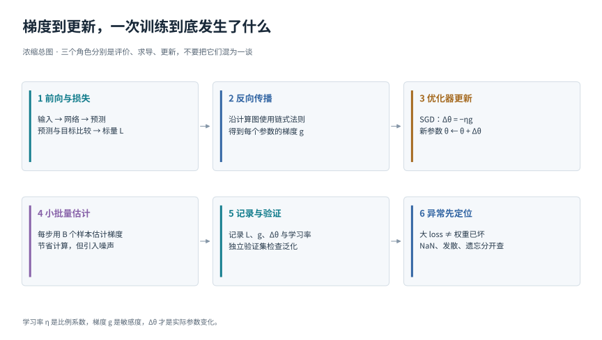
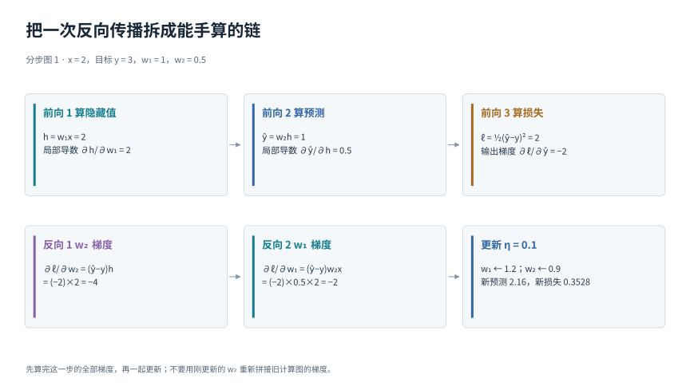
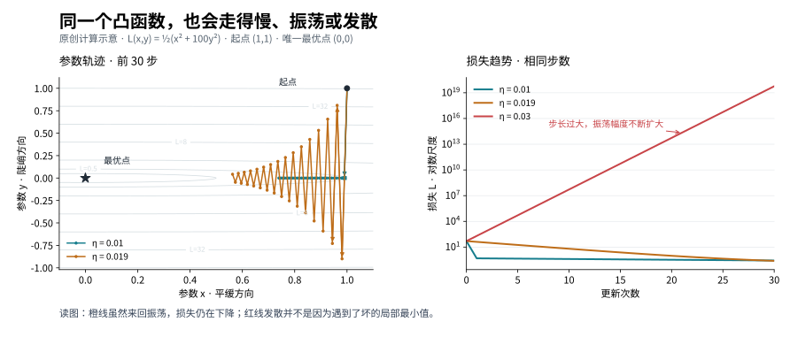

# 梯度、反向传播与SGD：模型到底怎样改正一次错误

## 1. 从一个会猜错的模型开始

假设我们要根据输入数值x预测目标y。先不管x代表房屋面积还是传感器读数，只用一条规则：预测值ŷ=wx。这里w是可调整的旋钮，叫作参数；ŷ上面的小帽子提醒我们，它是预测，未必等于真实答案。

拿到一条样本x=2、y=3。若w=0.5，模型给出ŷ=1，比答案少了2。我们当然想把w增大，但复杂网络有成千上万个参数，不能每次凭直觉猜哪个旋钮该转多少。训练要把这个过程变成机械步骤：先给错误打分，再计算每个参数影响分数的方向，最后小幅修改参数。

本章只解决这三个问题。读完后，你应当能够完整手算一次更新，并区分“本批数据比较难”“步子迈大了”和“计算已经出现无效数值”。

这张总图请先只看上排。左边的前向计算产生预测和损失；中间的反向传播产生梯度；右边的优化器用梯度修改参数。下排说明实际训练还要抽小批量、记录结果、排查异常。六个框不是六种竞争算法，而是同一个训练过程中的不同工作。

## 2. 损失只是分数，它还没有告诉我们怎样修改参数

用本例的平方误差打分：

ℓ(w)=½(ŷ−y)²=½(2w−3)²

ℓ读作“单条样本的损失”。括号里的预测减真值叫残差。平方使正负错误都得到非负惩罚；前面的½只是让稍后的求导少一个系数2，不会改变本例最好的w。

分别试三个w：

- w=0.5：预测1，残差−2，损失½×4=2
- w=1：预测2，残差−1，损失½×1=0.5
- w=1.5：预测3，残差0，损失0

这里损失越小越好。它衡量的是当前预测如何，并不自动告诉我们哪个参数该怎么动。若有很多样本，我们通常把各样本损失平均：

L(θ)=(1/N)Σᵢ₌₁ᴺℓ(fθ(xᵢ),yᵢ)

N是样本数，Σ表示逐项相加，i是样本编号。fθ是“使用参数θ的模型”；θ可以只有一个w，也可以是一整组权重。L是一个数，即整份训练集的平均分。这里没有要求你先懂抽象函数论：它就是把“分别预测、分别扣分、最后平均”压缩成一行。

## 3. 导数是轻轻转一下旋钮时分数的变化率

在w=0.5附近，把w增加0.01，变为0.51：预测从1变为1.02，损失从2变为½×1.98²=1.9602。于是这一小段中的“损失变化除以参数变化”为：

(1.9602−2)/0.01=−3.98

如果把0.01取得越来越小，这个比值趋近−4。这个局部变化率就是导数。负号的意思是：在这里把w稍微增大，损失会减小。它不是“参数已经变化了−4”，更不是“预测误差等于−4”。

用求导规则直接计算也得到：

∂ℓ/∂w=(2w−3)×2

在w=0.5时，它是(1−3)×2=−4。符号∂表示只考察某个变量的小变化；若模型有许多参数，先暂时固定其他参数，分别算每个参数的导数，再把这些数排列起来，就得到梯度g。

例如θ=(w₁,w₂)，g=(−2,−4)。它表示在当前位置，增大任何一个参数都倾向于降低损失，但两个坐标的敏感度不同。梯度的形状与参数相同。参数是一张矩阵时，梯度也是同样大小的矩阵。

这个判断只在附近成立。地图上脚下的坡向不能告诉你整座山的所有地形，导数也没有承诺远处仍然沿着同样趋势变化。

## 4. 学习率把方向建议变成实际步子

最简单的梯度下降规则是：

Δθ=−ηg

θ新=θ旧+Δθ

Δθ表示实际参数变化，η是正的学习率。负号让我们往损失局部减小的方向移动。本例g=−4，取η=0.1，则Δw=−0.1×(−4)=0.4，新参数为0.9。新的预测是1.8，损失为½×(1.8−3)²=0.72，确实小于原来的2。

为什么学习率不能随便大？同一个起点若用η=0.6，Δw=2.4，新参数为2.9，预测5.8，损失3.92。方向起初没错，却跨过了最低处并冲得太远。

因此请始终分清：损失L是一个评价分数，梯度g是敏感度，学习率η是比例系数，更新Δθ才是真正的位移。换成其他优化器后，它还可能利用历史统计变换梯度；仅看到g并不能推断实际移动多少。

“负梯度下降最快”也有条件：在当前位置，用一阶近似L(θ+Δθ)≈L(θ)+gᵀΔθ，并把所有候选步子的欧氏长度限制为同样大小时，负梯度使这个近似减少最多。gᵀΔθ就是各坐标“梯度×位移”的乘积之和。这说的是局部近似，不是任意大步子的保证，更不是全局最优保证。

## 5. 网络有两层时怎样知道第一层该负责多少

把模型稍微加长：

h=w₁x，ŷ=w₂h，ℓ=½(ŷ−y)²

h是中间结果，常叫隐藏表示。它只是先算出来、供下一步使用的数字。现在w₁不能直接改变损失，而是先改变h，再改变ŷ，最后影响ℓ。链式法则就是把这一路上的局部变化率相乘。

跟着图逐格算。取x=2、y=3、w₁=1、w₂=0.5。

第一遍从左往右算值：h=1×2=2；ŷ=0.5×2=1；残差为−2；损失为½×(−2)²=2。这叫前向传播。

第二遍从结果向原因追问。预测稍微增大时，损失怎样变？答案是∂ℓ/∂ŷ=ŷ−y=−2。h增大一点会让预测增大多少？因为ŷ=w₂h，答案是∂ŷ/∂h=w₂=0.5。因此h对损失的总影响是(−2)×0.5=−1。

再问w₁增大一点会让h增大多少？因为h=w₁x，答案是x=2。所以：

∂ℓ/∂w₁=(−2)×0.5×2=−2

对w₂，路径更短：w₂直接乘着h，因此∂ŷ/∂w₂=h=2，得到：

∂ℓ/∂w₂=(−2)×2=−4

取学习率0.1，同时更新：w₁新=1−0.1×(−2)=1.2；w₂新=0.5−0.1×(−4)=0.9。重新前向：h新=2.4，ŷ新=2.16，损失为½×(−0.84)²=0.3528。

图的上排保存旧参数下的中间结果，下排沿依赖关系计算梯度。不要先更新w₂，再把新的0.9塞回旧的反向公式；这样混合了两个不同参数位置的计算，已经不是刚才推导的同一步梯度下降。

真实网络有更多分支，但仍做这些乘法与加法。同一参数通过两条路径影响损失，两条贡献要相加。例如同一个w同时出现在a=wx和b=wz中，若输出为a+b，对w的导数包含x和z两项。自动微分系统沿计算图保存和复用这些局部结果，这就是反向传播高效的原因。[1]

**反向传播负责算梯度，优化器负责用梯度更新参数。** 不是先选SGD就用一种反向传播，选Adam就换一种求导原理。

## 6. 为什么每次只看一小批样本

假设训练集只有四条数据，它们在同一个旧参数位置给出的梯度分别是−2、−4、0、−6。全体平均梯度为(−2−4+0−6)/4=−3。用学习率0.1，全批量更新就是+0.3。

如果本步只抽到前两条，平均梯度为−3，恰好一样；若抽到第一和第三条，平均梯度为−1，更新只有+0.1；若抽到第二和第四条，平均梯度为−5，更新为+0.5。这不是求导器算错，而是每一小批看到的训练集切片不同。

每步用全部样本叫全批量梯度下降；一次用一条样本常称随机梯度下降，英文缩写SGD；一次用B条叫mini-batch SGD。工程里说“用SGD”，经常包含小批量版本。

当每条样本有相同机会被抽到、平均方式正确等条件满足时，小批梯度的期望等于全体梯度。“无偏”说的是多次抽样的平均，不保证任意一个批次方向都好。增加B通常让估计更稳定，但也增加一次更新的成本；固定处理同样多样本时，大batch还意味着更新次数变少。[2]

step是一次优化器更新；epoch是训练集被完整遍历一次。若有1000条样本，batch大小100，无丢弃和其他特殊处理时，一个epoch大约10个step。不要把“训练了100步”与“训练了100轮”当成相同预算。

显存放不下大batch时，可分多个微批次反向，再统一更新，这叫梯度累积。比如四个相同大小的微批次，各自算平均损失，应各乘¼再反向，才能得到四批合起来的平均梯度。若每批有效词元数不同，简单除以4可能并不等于按有效词元平均。含有依赖批统计的运算时，累积也未必与直接大batch完全相同。

## 7. 为什么一个方向已经稳定另一个方向还是走得很慢

现在考虑两个可调参数x、y。为避免和前面样本输入混淆，此节的x、y都是参数坐标。我们人为设定：

L(x,y)=½(x²+100y²)

它唯一的最低点是(0,0)。x方向的平方前面是1，y方向是100，表示同样离开原点一点，y方向的代价大得多。你可以把它想成狭长谷底：沿谷底平缓，横向谷壁很陡。

梯度是(x,100y)，于是：

x新=(1−η)x，y新=(1−100η)y

从(1,1)出发，初始损失是50.5。

- η=0.01：x新=0.99，y新=0，新损失0.49005。陡方向迅速归零，但之后x每次只缩小1%
- η=0.019：x新=0.981，y新=−0.9，新损失40.9811805。y越过零，却只剩原来90%的幅度，下次还会换符号，振荡逐渐缩小
- η=0.03：x新=0.97，y新=−2，新损失200.47045。y每步换符号且幅度翻倍，所以发散

判断是否收敛，要看重复相乘的系数绝对值是否小于1。y方向要求|1−100η|<1，解得0<η<0.02。这个要求把x方向的步子也限制得很小。困难不是遇到了坏局部最优，而是同一个学习率要照顾很不一样的尺度。

左图横纵轴是两个参数，画出两条稳定配置的前30步；右图横轴是更新次数，纵轴是损失，并额外画了发散的η=0.03。右图用对数纵轴：等高的距离代表相同比例，而非相同加法差值。橙线来回穿过谷底不等于训练失败，关键是振幅在缩小；红线的问题是振幅不断扩大。

更专业地说，二阶导数描述坡度变化得多快；把所有二阶偏导排列成矩阵叫Hessian。本例它是diag(1,100)，即对角线上为1和100、其他位置为0。两种主要曲率的比值为100，称为这个正定二次问题的条件数。条件数大意味着不同方向不好同时照顾。这里引入名字是为了让你读论文时认识它，理解困难本身不需要先会矩阵求逆。

若我们知道本例两个方向恰好相差100倍，就可以把y梯度先除以100。这样同一个学习率比较容易处理两个方向。这类先变换梯度尺度的办法叫预条件。现实网络的完整曲率昂贵且不断变化，动量和自适应优化器用更便宜的信息改善更新，但不是把所有训练困难都消除了。

## 8. 梯度很小并不只可能是已经学好了

最低点附近梯度可能很小，但还有别的原因。对函数x²−y²，在原点沿x走会升高，沿y走会降低，梯度却为零。这叫鞍点。局部最小值指附近没有更低的点；全局最小值指整个空间都没有更低的点。两者都不同于鞍点。

此外，许多层的局部导数连乘也可能让信号变小。先看一维：连续乘10次0.5，只剩约0.00098；连续乘10次2，变成1024。真实网络里中间变量通常是向量，局部变化率是雅可比矩阵，即“每个输出对每个输入的导数表”。矩阵连乘可能在某些方向缩小，在另一些方向放大。这是理解梯度消失、爆炸的入口。[3]

Pascanu等人的论文研究循环网络的长时间依赖，将长链求导中的乘积展开，解释为什么早期信息可能传不回来，或小变化被层层放大。它研究的机制支持梯度范数裁剪，但裁剪只压低过大的有限梯度，不会凭空补回已经消失的信息。[3]

对严格鞍点，有理论证明在特定光滑性、小步长和随机初始化条件下，梯度下降几乎必然不会收敛到它。“严格”指至少存在一个向下弯曲方向；“几乎必然”是概率意义；“不会收敛到”讨论长期极限。它不能改写成“任何网络几百步内必然找到全局最优”。[4]

更多数据、更多参数与全局最优也没有简单等号。训练集拟合得很好，仍可能只记住了训练细节。训练损失下降是优化证据；未见数据表现好才是泛化证据，两者要分别观察。

## 9. Loss突然变大按哪条线索查

先比较同一定义、同一归一化方式下的分数。若把目标从米换成厘米，平方误差会扩大10000倍；若由平均改为求和，分数会随着有效元素数增长。这类变化首先是计分尺度改变，不能直接宣布模型坏了。

只有一两个批次尖峰时，先保存对应样本，检查标签、序列长度、有效掩码及输入范围。连续不同批次不一定同样难，单步loss增加不是总体训练必然恶化。

若loss连续上升，同时真实更新越来越大，就检查学习率、调度器与优化器状态。可以记录梯度范数和更新范数。范数是向量整体大小，例如(3,4)的欧氏范数是√(9+16)=5。‖Δθ‖/‖θ‖表示本步相对参数规模改了多少；参数范数为零或极小时要单独处理，不能机械相除。

若梯度有限但异常大，可限制其范数。阈值c=1、梯度(3,4)时，原范数5，把整个向量乘1/5得到(0.6,0.8)，方向保留而长度变为1。这叫整体范数裁剪。它与把每个坐标分别截到某个范围不同，也不保证Adam等带历史统计的实际更新被同样上限约束。[3]

若出现Inf或NaN，问题已经超出普通“大数”。Inf表示无穷大，NaN表示非数值，常来自溢出、非法对数或0除0。应找到第一个异常算子，核对输入与精度。NaN乘一个小学习率仍然是NaN；参数或优化器状态已被污染时，应恢复到正常检查点并修复根因。混合精度若使用了梯度缩放，先还原梯度尺度再做裁剪。[5]

检查点不仅是权重。要较完整地接续训练，还需保存优化器的历史、学习率调度状态、步数，必要时包括混合精度缩放器、随机数与数据迭代状态。只恢复权重而重置动量，不会完全接续原来的轨迹。[6]

最后，训练loss降而验证loss升，可能是过拟合，也可能是评估模式或数据流程有问题；新任务变好而旧任务变差，可能是遗忘。这些都需要对应的验证集，不能靠检查NaN代替能力评价。

## 10. 把一轮训练说完整

一次训练步骤应能被解释成：取出有效数据；用旧参数计算预测与损失；按计划清空或累积梯度；反向传播；检查数值并按需要裁剪；让优化器更新参数；记录损失、学习率及实际更新；定期在固定验证协议下评价并保存检查点。

这里每个步骤都有独立职责。模型没学动，先确认参数确实参与计算、梯度存在、更新真的发生、数据与目标对齐，再讨论换优化器。接下来的动量模块会回答：当方向忽左忽右或不同坐标尺度差很多时，怎样利用过去的梯度。

## 自检

1. g=(2,−4)、η=0.1，普通SGD的参数变化是多少？
2. 本章两层网络中，为什么w₁的梯度要乘w₂？
3. η=0.019那条曲线在振荡，为什么仍能收敛？
4. 只给第100步的梯度，能否知道Adam的真实更新？

答案：1. Δθ=(−0.2,+0.4)。2. w₁先影响h，再由w₂把h的变化传到预测，因此这段传递率必须计入。3. 陡方向每步乘−0.9，符号交替但幅度缩小。4. 不能，还需历史统计、步数与超参数。

以上算例和图是教学计算，不是算法性能基准，也不表示复现了所引论文的训练实验。

## 参考资料与继续阅读

[1] PyTorch，Automatic Differentiation with torch.autograd：https://docs.pytorch.org/tutorials/beginner/basics/autogradqs_tutorial.html

[2] Bottou、Curtis、Nocedal，Optimization Methods for Large-Scale Machine Learning：https://arxiv.org/abs/1606.04838

[3] Pascanu、Mikolov、Bengio，On the difficulty of training Recurrent Neural Networks，重点看长链求导与梯度范数裁剪：https://arxiv.org/abs/1211.5063

[4] Lee等，Gradient Descent Only Converges to Minimizers，重点核对严格鞍点结论的假设：https://proceedings.mlr.press/v49/lee16.html

[5] PyTorch，Automatic Mixed Precision examples：https://docs.pytorch.org/docs/stable/notes/amp_examples.html

[6] PyTorch，Saving and Loading Models：https://docs.pytorch.org/tutorials/beginner/saving_loading_models.html

继续阅读：[动量与逐坐标自适应](momentum.md)；[返回优化目录](../../02-optimization.md)；[返回总导读](../../00-learning-navigation.md)
