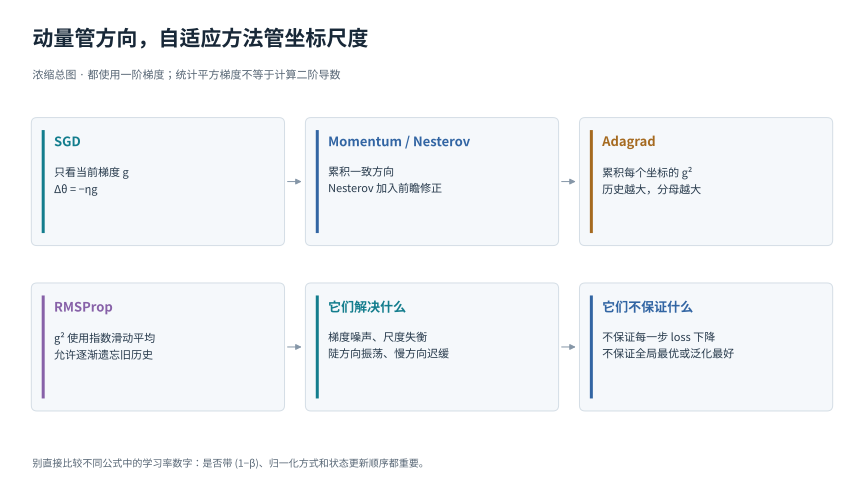
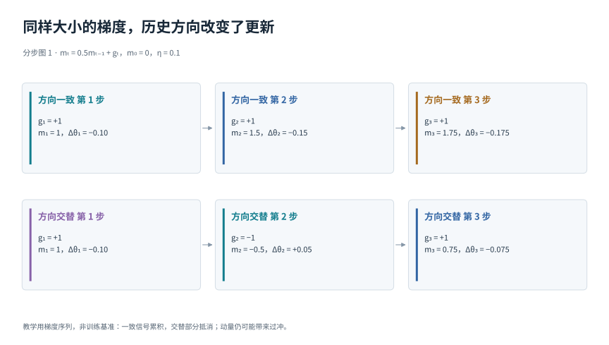
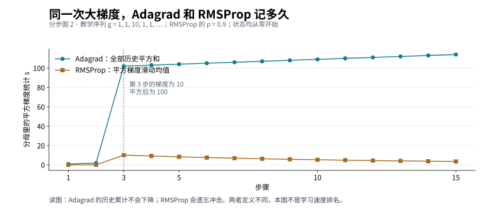

# 动量与逐坐标自适应优化

[返回优化目录](../../02-optimization.md) · [返回总导读](../../00-learning-navigation.md)

## 先读两分钟

这组方法都在回答：当前批次的梯度很吵，而且不同坐标的尺度不一样，怎样更稳更快地更新？本模块把方向记忆与幅度记忆分开，再用两段可手算的梯度历史解释它们。先修好数据与求导，再比较优化器。

## 一张图建立整体印象

## 统一记号

本模块的历史量从第 0 步的零状态开始；第 t 次梯度 gₜ 在更新前参数 θₜ₋₁ 处计算，更新后的参数记为 θₜ。

下列向量的平方、开方、除法默认逐元素进行，历史状态初始为零，ε 是避免分母过小的数。公式强调原理，具体库可能采用等价记号或不同的 ε 位置，复现实验时应核对实现。

## 动量让持续一致的方向积累起来

图 1 用同样大小、不同方向的梯度比较历史累积。普通 SGD 每步位移大小都为 0.1；动量在一致方向上加速，在交替方向上抵消一部分变化。

普通 SGD 只看当前 g。动量记住最近的方向：

mₜ = βmₜ₋₁ + gₜ

θₜ = θₜ₋₁ − ηₜmₜ

同方向梯度会积累，正负交替的部分会互相抵消，于是可能更快沿平缓山谷前进。这里没有乘 (1 − β)；若采用指数均值写法，学习率尺度也须相应理解。动量会带来惯性，因此 β 与 η 不合适时仍可能冲过头。

Nesterov 的一种解释是先看“按惯性将要到达的位置”，再修正速度。用 v 表示带方向的实际位移，可写为 vₜ₊₁ = βvₜ − η∇L(θₜ + βvₜ)，随后 θₜ₊₁ = θₜ + vₜ₊₁。它比“先累积，再盲目往前冲”的解释多了一步前瞻。实际库常重排计算，不必按这个字面形式额外做一次完整前向。[Sutskever 等关于动量和 Nesterov 的论文](https://proceedings.mlr.press/v28/sutskever13.html)

## Adagrad 按每个参数的历史梯度调整尺度

sₜ = sₜ₋₁ + gₜ²

θₜ = θₜ₋₁ − ηgₜ/(√sₜ + ε)

某个坐标过去频繁出现大梯度，分母就大；另一个坐标很少被触发，累积量较小。这样不用所有坐标共享同一有效步长，对稀疏特征尤其有动机。问题是 s 只增不减，长时间训练后有效步长可能太小。[Duchi 等的 Adagrad 原论文](https://www.jmlr.org/papers/v12/duchi11a.html)

## RMSProp 用近期统计代替无限累积

sₜ = ρsₜ₋₁ + (1−ρ)gₜ²

θₜ = θₜ₋₁ − ηgₜ/(√sₜ + ε)

平方梯度现在会遗忘旧历史，因而能适应不同阶段的梯度尺度。它不是精确求 Hessian，只是利用一阶梯度的统计构造逐坐标缩放。RMSProp 的早期一手材料是 Hinton 课程中介绍 Tieleman 未发表工作的讲义，不能给它虚构一篇正式的“原始期刊论文”。[原始课程材料](https://www.cs.toronto.edu/~tijmen/csc321/slides/lecture_slides_lec6.pdf)

## 一次尖峰之后 历史多久才会淡去

图 2 的梯度依次是 1、1、10，之后一直为 1。Adagrad 的 s 在第三步达到 102，随后继续增加。ρ = 0.9 的 RMSProp 前三步 s 为 0.1、0.19、10.171；第四步变成 9.2539，随后逐步向 1 靠近。这里画的是更新分母里的统计量，不是 loss，所以不能从曲线更低直接推出训练更好。

这也解释“自适应”到底适应什么：它读的是观察到的梯度历史，没有直接看见真实 Hessian。若两个参数的梯度高度相关，逐坐标方法仍未完整利用这层相关结构；若整体把所有参数打平，则连原来的矩阵结构也丢失了。后者正是 [Muon](muon.md) 使用不同处理方式的入口。

## 关联论文精读

### Momentum 的前瞻不是看见未来

阅读 [Sutskever 等 2013](https://proceedings.mlr.press/v28/sutskever13.pdf) 的 Section 2，比较经典动量与 Nesterov 的更新式。经典动量在当前位置求梯度；Nesterov 的解释式把求梯度位置移到惯性预测点。所谓“前瞻”是当前已知速度构造出来的位置，不是提前获知下一批数据。论文实验还强调初始化与动量调度，不能把改进全归于一个算法名称。

把公式代入一维 L(θ) = θ²/2 检查：θ = 1、v = −0.2、β = 0.9、η = 0.1。经典动量得到 v新 = −0.28、θ新 = 0.72；前瞻点是 0.82，Nesterov 得到 v新 = −0.262、θ新 = 0.738。这个教学例子显示前瞻修正减少了这一步冲量；它并不证明 Nesterov 每一步都更好。

### Adagrad 改变了优化的几何尺度

阅读 [Duchi 等 2011](https://www.jmlr.org/papers/v12/duchi11a.html) 的算法构造，先找到累积梯度平方所形成的对角缩放，再读稀疏特征的动机。不要把“某些罕见特征得到相对更大的步长”误解为“优化器知道它们一定更重要”。重要性仍来自损失与数据，算法只依据观测历史调整度量。

[RMSProp 早期讲义](https://www.cs.toronto.edu/~tijmen/csc321/slides/lecture_slides_lec6.pdf) 的第 29 页（PDF 页码）把平方梯度改成滑动均值。精读时只需对比“累加”和“指数遗忘”两项，便能推导图 2 的差异；这份材料是课程讲义，不应包装成正式发表的算法定理论文。

## 自检与下一步

若连续梯度都是 +1，β = 0.5 的上述动量状态会趋近 2，而不是 1；这是因为本模块使用未归一化的累积式。若改成 m ← βm + (1−β)g，才会趋近 1。比较实现时要先统一记号。

下一步读 [Adam 与 AdamW](adam.md)：它把一阶方向记忆和二阶幅度记忆组合起来，再把权重衰减单独处理。
