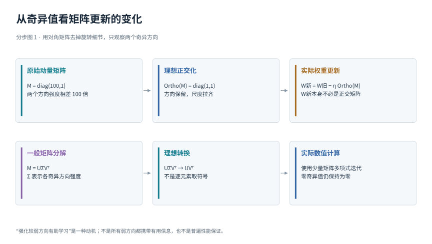
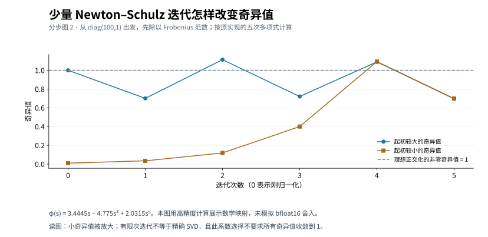

# Muon与矩阵更新正交化

## 1. 先看神经网络里为什么会有矩阵

一层简单网络可以接收两个输入x₁、x₂，产生两个输出h₁、h₂：

h₁=w₁₁x₁+w₁₂x₂

h₂=w₂₁x₁+w₂₂x₂

四个权重排列成两行两列的W。第一行负责第一个输出，第二行负责第二个输出。写成h=Wx，只是把两条计算合到一起。矩阵不只是储存四个数字的盒子，它还描述输入空间怎样被拉伸、旋转并送到输出空间。

反向传播后，四个权重各自有一个梯度，也排列成同形状矩阵G。Adam主要为各坐标存历史统计、分别缩放；Muon关心的是：能否保留这整块矩阵的结构，再改变更新在不同组合方向上的强弱？

Muon这个名字来自MomentUm Orthogonalized by Newton-Schulz。主要原始来源是Keller Jordan等人的公开说明与参考实现；其来源和协作贡献应按作者资料记录，不能简单归为某家公司独自发明。[1][2]

图的顺序是G到M，再到O，最后才到W。G是刚算出的梯度，M是带历史的更新建议，O是加工后的更新。请先把这四个对象分清，否则很容易把“更新正交化”听成“网络权重被强制正交”。

## 2. 为什么一个矩阵可能只偏向少数方向

先看最容易算的矩阵M=diag(100,1)。diag表示只有对角线非零，因此M的两行是(100,0)和(0,1)。

把输入方向(1,0)交给它，输出(100,0)，长度放大100倍；把(0,1)交给它，输出(0,1)，长度只放大1倍。两个方向的增益相差100倍。

如果这样的矩阵用作更新，修改会非常偏向第一个方向。原作者提出一个经验动机：一些较弱的更新方向可能仍对学习有用，是否能把它们的相对尺度提高？这里“可能有用”是解释算法设计的假说，不是证明弱方向一定比强方向更重要。[1]

对真实矩阵，强弱方向通常不是某一行、某一列或单独一个神经元，而可能是多个坐标的组合。例如向右上同时移动，与向右下同时移动，受到的放大可以不同。Muon需要一种能找到这些组合方向的描述。

## 3. 奇异值分解先是三个动作，再是一串字母

奇异值分解，缩写SVD，将矩阵写作：

M=UΣVᵀ

先把它想成三个连续动作。最右边Vᵀ选择一组方便的输入方向；中间Σ沿这些方向分别伸缩；最左边U把结果摆放到输出方向。矩阵作用于输入时从右往左执行。

Σ对角线上非负的数叫奇异值，每个数描述对应方向被放大多少。U和V的列向量是互相垂直且长度为1的方向。上标ᵀ表示转置，即交换行和列；对方形正交矩阵，转置也恰好是逆变换。

“正交”先只需理解成：这些方向两两垂直，而且这里还都取单位长度。比如(1,0)与(0,1)垂直，长度都为1。写成矩阵O时，方形正交矩阵满足OᵀO=I，I是保持输入不变的单位矩阵。

理想化的更新正交化是把非零奇异值的强弱拿掉：

UΣVᵀ → UVᵀ

它保留输入输出方向间的对应关系，把各个已有非零奇异方向的增益变为1。对diag(100,1)，方向本来就是坐标轴，输出自然变成diag(1,1)。

图第一行先用对角矩阵展示“100比1”变成“1比1”。第二行再给出一般SVD表达。不要反过来先背UVᵀ，再猜它在做什么：它只是删去不同方向上的伸缩差异，保留方向结构。

## 4. 为什么这不是把每个元素取正负号

考虑另一个矩阵：

M的第一行是(3,1)，第二行是(1,3)。

把方向(1,1)送入，得到(4,4)，增益为4；把方向(1,−1)送入，得到(2,−2)，增益为2。把两种方向分别除以√2，它们就都是单位长度而且互相垂直。

因为这个例子的输入方向与输出方向相同，理想正交化把4和2都变为1后，得到单位矩阵I：第一行(1,0)，第二行(0,1)。

若逐元素取符号，四个元素原来全为正，会得到第一行(1,1)、第二行(1,1)。它把(1,−1)变成(0,0)，根本不等于单位矩阵。由此可见，矩阵方向上的尺度整形与逐元素归一化是不同操作。

矩阵可以不是方形。若行数多于列数且列满秩，理想结果的列正交；若列数多于行数且行满秩，则行正交，所以常说半正交。若本来就缺少某些方向，数学上叫秩亏，可以只保留非零奇异值的紧致分解。多项式迭代不会把精确为零的方向凭空变成有信号的方向。

## 5. 从动量到参数 一次更新究竟改了谁

忽略实现中的前瞻、形状缩放和衰减，Muon的教学骨架是：

Mₜ=μMₜ₋₁+Gₜ

Oₜ≈Ortho(Mₜ)

Wₜ=Wₜ₋₁−ηₜOₜ

第t步在旧权重Wₜ₋₁计算Gₜ；μ控制过去方向保留多少；η是学习率；Ortho表示前面解释的理想正交化；≈提醒我们实际计算只是近似。动量状态M从零开始。

假设W旧=diag(2,3)，本步M=diag(100,1)，理想O=I，η=0.1。那么：

W新=diag(2,3)−0.1diag(1,1)=diag(1.9,2.9)。

新权重的两列长度分别1.9和2.9，显然不是单位长度，因此W新不是正交矩阵。被加工的是M；将加工结果减到W上，不会自动使W正交。

本节公式只是看清主线。所读参考实现采用滑动平均形式的动量，并常启用Nesterov风格组合，再做矩阵处理。不同动量归一化方式经过理想Ortho可能消去整体正比例尺度，但有限迭代、ε与实现细节仍应按源码核对，不能把教学骨架逐字当成所有版本的实现。[2]

## 6. 为什么不用SVD直接算出答案

SVD适合解释机制，但训练时每一步、每个大矩阵都精确分解，计算成本可能过高。Muon参考实现选择少量Newton–Schulz型多项式矩阵迭代，利用硬件擅长的矩阵乘法得到近似尺度整形。[1][2]

先把M除以Frobenius范数：

X₀=M/(‖M‖F+ε)

Frobenius范数就是把所有矩阵元素平方、相加、再开根号。对diag(100,1)，它为√(10000+1)≈100.005。忽略很小的ε，归一化后的两个奇异值约为0.99995和0.0099995。

这个整体归一化先把输入尺度放进适合迭代的范围。它本身没有拉齐强弱比例：两者仍相差100倍。真正改变比例的是后续多项式。

参考实现使用系数a=3.4445、b=−4.775、c=2.0315，每次计算：

X新=aX+b(XXᵀ)X+c(XXᵀ)²X

XXᵀ是矩阵乘法，不是各元素自乘。括号外的平方表示再与自身做一次矩阵乘法。源码常先存A=XXᵀ，再计算B=bA+cAA，最后X新=aX+BX，以复用中间结果。[2]

为什么这能改奇异值？把X=UΣVᵀ代入，可得XXᵀ=UΣ²Uᵀ。再乘X得到UΣ³Vᵀ，下一项对应UΣ⁵Vᵀ。因此整个操作为：

X新=U(aΣ+bΣ³+cΣ⁵)Vᵀ

方向U、V保持不变，每个奇异值s单独经过同一个函数：

φ(s)=3.4445s−4.775s³+2.0315s⁵

这里“逐个处理奇异值”与“逐个处理原矩阵元素”完全不同，前者是在矩阵自身的组合方向上调整尺度。

## 7. 五次迭代的每一个数字说明什么

横轴0代表刚归一化，还没有进行多项式更新；纵轴是奇异值。较小值开始只有约0.01，较大值接近1。将它们分别代入φ，可以得到：

- 第0次：(0.999950，0.010000)
- 第1次：(0.701036，0.034439)
- 第2次：(1.113579，0.118428)
- 第3次：(0.720652，0.400043)
- 第4次：(1.090042，1.093063)
- 第5次：(0.696488，0.698895)

第一步的小值可以近似理解为3.4445×0.01≈0.034445，因为三次项和五次项暂时很小。随着它增大，高次项逐渐不能忽略，于是不能每步都只乘3.4445。

到第五次，两个值已非常接近，但都约0.7而不是1。这不是算错。这里选取的系数追求用少量步骤快速整形，不要求所有非零奇异值精确收敛到1。参考实现的注释也明确区分输出与精确UVᵀ。[2]

图和上面的数字用高精度计算显示多项式行为，没有模拟bfloat16舍入。bfloat16是一种较低精度的浮点格式，能降低部分硬件上的计算成本，但真实输出还受舍入、矩阵形状和具体实现影响。不能把这组小矩阵数字当作某个大模型训练速度的实测结果。

## 8. 原作者方法和大规模扩展分别解决哪一层问题

原作者说明重点解释动量之后怎样处理矩阵，以及为什么选择少量矩阵乘法而非精确SVD。其中关于较弱方向的解释属于经验动机，训练成绩属于其具体实验；两者都没有给出所有任务必胜的定理。[1]

大规模扩展工作进一步研究权重衰减、不同矩阵形状下的更新尺度和分布式实现。[3] 为什么形状重要？若一个矩阵有很多行列，相同的奇异值尺度不代表每个元素的典型大小与另一种形状相同；直接照搬学习率，可能使某些层改得更激进。

更新RMS指元素平方平均后开根号，它衡量每个元素的典型更新幅度。扩展方法讨论让不同形状参数的这个尺度更可比，并把计算分布到多设备上。你不必在第一次阅读时实现分布式算法，但应知道“大规模可用”不仅是把小矩阵公式重复更多次。

这类论文的效率结论对应给定模型、数据和对照配置。不能把某组语言模型的训练收益推广到所有微调、视觉任务、强化学习或设备上。[3]

## 9. 哪些参数适合以及怎样公平比较

原始使用建议把隐藏层的二维权重矩阵交给Muon，embedding、输出层以及偏置和归一化缩放等通常使用AdamW。卷积核可按实现规定展平，例如把输出通道作为行、其余维度合成列；因此二维处理不等于只支持全连接层。[1][2]

参数分组时应列出每类实际名称和形状，确保每个需要训练的参数恰好归属一个更新规则。不要遗漏参数，也不要让同一参数被两个优化器重复更新。学习率、衰减和尺寸缩放必须与使用的实现匹配。

比较时至少问两个问题：相同数据或计算预算下，验证质量怎样；达到相同验证质量，总耗时怎样。少了多少step不一定等于节省多少时间，因为矩阵迭代、临时内存和通信都有成本。两种优化器都应得到合理调参机会。

## 自检

如果M=diag(100,1)，理想Ortho(M)是什么？是diag(1,1)，原来的方向保留，两个非零增益拉齐。

如果M某个奇异值为0，多项式会把它变成1吗？不会，因为φ(0)=0。

如果O正交，W−ηO必然正交吗？不会，diag(2,3)−0.1I就是反例。

如果非对角矩阵所有元素都为正，Ortho(M)是不是全1？不是，本章(3,1；1,3)的例子已经说明逐元素取符号会得到完全不同的线性变换。

本章保留原有示意图并补充数学解释，没有重跑所引论文的大模型实验。

## 参考资料与继续阅读

[1] Keller Jordan等，Muon: An optimizer for hidden layers in neural networks，方法、作者贡献与经验边界：https://kellerjordan.github.io/posts/muon/

[2] KellerJordan/Muon参考实现，重点查看muon_update与zeropower_via_newtonschulz5；本章核对的是2026年10月2日读取版本：https://github.com/KellerJordan/Muon/blob/master/muon.py

[3] Liu等，Muon is Scalable for LLM Training，权重衰减、更新RMS与分布式扩展：https://arxiv.org/abs/2502.16982

继续阅读：[Adam与AdamW](adam.md)；[梯度与SGD](gradient-sgd.md)；[返回优化目录](../../02-optimization.md)；[返回总导读](../../00-learning-navigation.md)
