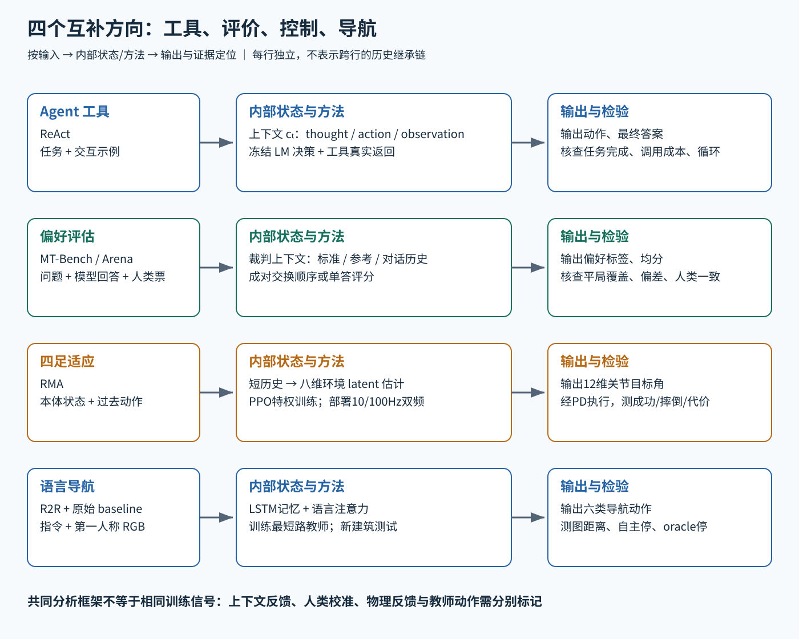

# Agent 工具 评估 四足适应与语言导航路线图

这四篇覆盖不同层次的问题：ReAct 组织语言模型与工具的交互；MT-Bench / Chatbot Arena 检验输出评审是否接近人类偏好；RMA 处理四足机器人的物理条件变化；R2R 定义真实图像中的指令导航任务并提供原始策略。它们共享“输入、内部状态、输出、反馈”的分析语言，但不是一条彼此继承的算法链。

图中每一横行是一条独立阅读路径；行间没有历史继承箭头。训练、推理和评价的反馈不能互相替代。

## 1 Agent 工具路线

先理解自回归语言模型怎样依据上下文预测序列，再读 [ReAct](../deep-readings/react.md)。其关键接口是模型生成结构化动作，执行器返回真实观察，模型更新工作上下文。最小对照为 Standard、CoT、Act-only、ReAct；切换模型、增加采样或换检索器都要单独控制。

要问：新事实来自参数记忆还是工具？模型写的一段话是否真被执行？失败观察是否改变了下一步？当前轨迹是推理时上下文更新，还是训练样本？ReAct 正好给出最小可检查闭环，但不涵盖所有长期记忆、权限、安全和多 Agent 机制。

## 2 评估路线

理解指令遵循、偏好与事实能力的差别后，读 [MT-Bench 与 Chatbot Arena](../deep-readings/llm-judge.md)。它们把评价对象、裁判和人类对照分开，并用位置交换、参考答案与一致率检验裁判。

评审反馈的产物是标签或分数；只有另行指定训练流程才会成为训练信号。S1 含平局，S2 去平局，必须同时看覆盖率。若把这套方法用于 Agent，需要另外核验工具结果、任务完成与行动成本；只读最后一句自然语言回答无法证明外部任务成功。

## 3 四足适应路线

先理解策略梯度或 PPO、机器人传感器与关节执行接口，再读 [RMA](../deep-readings/rma.md)。训练时用特权环境变量学控制相关隐变量，随后从短历史回归隐变量，部署让慢适应与快控制异步运行。

它与 ESKF 共享“由观测历史估计看不见因素”的问题意识，但没有继承误差状态滤波方程，也不是把 ESKF 换成一个神经网络的简单等价物。与 MPC 可以比较控制结构、建模假设及实机指标，不能拿语言任务成功率直接比四足稳定性。要分清当前身体状态、未知环境条件、目标关节角和最终力矩四个接口。

## 4 视觉语言导航路线

先掌握部分可观测序贯决策、图像特征和语言注意力，再读 [R2R](../deep-readings/r2r.md)。应先看任务与建筑划分、可达视点图、停止标准，然后看原始六动作 LSTM。重点是模型动作改变下一张图像，以及环境泛化和停止识别怎样分别评价。

R2R 原始 baseline 的 student-forcing 与 RMA 的适应训练，都让训练数据覆盖模型自身行为产生的状态，具有可比较的分布偏移问题。但两者的标签不同：前者是当前位置到目标的下一步教师动作，后者是仿真特权编码；这只是机制类比，不是声称论文有直接继承关系。

## 哪些连接成立 哪些仍需新系统设计

ReAct 和 R2R 都可能使用语言，但前者把语言当工作上下文及工具决策载体，后者把语言当视觉导航任务条件。R2R 和 RMA 都可能服务同一机器人，但前者输出高层离散移动，后者输出十二关节目标角，二者中间仍缺定位、避障、路径跟踪与速度指令接口。把它们放在同一幅路线图，不代表已经存在经过验证的集成系统。

MT-Bench 类裁判可评回答是否有帮助，不能替代 R2R 的图距离、停止成功，或 RMA 的摔倒率与运动代价。反过来，任务完成也不能覆盖全部人类偏好。合适的综合评估应保留各方向的原生指标，最后再讨论权衡。

## 读完后应能自己回答

- ReAct 主提示实验为什么没有新增训练损失，工具 observation 为什么不能由模型自己续写？
- “GPT-4 与人类超过八成一致”去掉了哪些样本，和“答案八成都正确”差在哪里？
- RMA 为什么预测控制相关 latent 而非精确摩擦系数，在线变化的是权重还是 latent？
- R2R 为什么按建筑划分，oracle stopping 和自主停下分别测了什么？

本组四篇均固定版本阅读：ReAct v3、LLM-as-a-Judge v4、RMA v1、R2R v3。每篇附原创机制图和逐项证据索引；没有宣称复现训练、真实硬件部署或当前排行榜。本文路线连接为分析性综合，不增加原论文未报告的实验结论。
