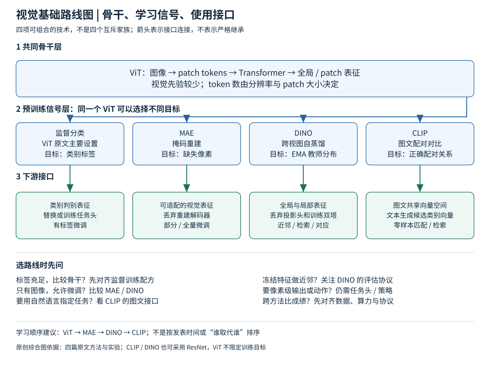

# 视觉与图文基础路线图

这一组回答三个问题：图像怎样变成token，预训练信号从哪里来，训练后模型以什么接口被使用。阅读顺序建议为[ViT](../deep-readings/vit.md) → [MAE](../deep-readings/mae.md) → [DINO](../deep-readings/dino.md) → [CLIP](../deep-readings/clip.md)，这是概念学习顺序，不是发表时间顺序。原始工作大致依次为ViT（2020）、CLIP（2021年2月）、DINO（2021年4月）、MAE（2021年11月）。

图源说明：本图为四篇精读的原创综合图。箭头表示“同一个骨干可接受不同训练信号”和“学到的表征通向哪些接口”，不表示某篇严格由上一篇继承，也不把四项划成互斥模型家族。

## 一 先把分类轴分开

| 观察轴 | ViT原文主要设置 | CLIP | MAE | DINO |
|---|---|---|---|---|
| 方法层级 | 骨干架构＋有标签规模实验 | 图文配对预训练与语言接口 | 图像掩码重建预训练 | 跨视图自蒸馏预训练 |
| 输入组织 | 图像patch序列 | 图像编码器＋文本token序列 | 稀疏可见patch，轻解码器补全 | 同图global/local多视图 |
| 预训练目标来自 | 图像类别标签 | 配对文本与批内匹配关系 | 被遮挡patch的像素 | EMA教师的另一视图分布 |
| 默认目标类型 | 监督分类 | 双向图文对比交叉熵 | 遮挡位置像素MSE | 教师分布对学生分布交叉熵 |
| 丢弃的训练组件 | 下游任务可换预训练分类头 | 零样本仍需文本向量，可缓存 | 解码器与mask训练流程 | 投影头、双分支训练和EMA更新 |
| 典型下游接口 | 图像特征＋学得的任务头 | 图像向量与类别/查询文本向量 | 图像特征＋任务微调 | 全局/patch表示、k-NN、检索、微调 |
| 不应直接推断 | 所有ViT都需要亿级标签 | 零样本分数就是校准置信度 | 重建更清晰就代表特征更强 | attention热图就是完整分割器 |

表中“默认”均指所读原论文。ViT可用于后三种方法；CLIP图像塔也可用ResNet，DINO同样能用于ResNet。标签监督、自然语言弱监督、掩码自监督、教师自监督是学习信号的区别；Transformer/CNN是架构区别，两条轴可以组合。

## 二 逐步读懂什么

第一步，ViT：手算N=HW/P²，区分patch宽度、token数、embedding维度和分类数。画清patch投影、[CLS]、位置编码、自注意力与头，解释为什么升分辨率会涨计算量。重点反查表2和表5为什么ImageNet数字不同，而不是只记88.55%。

第二步，MAE：在相同ViT上改变任务，解释为什么删除75%patch后反而有更强表征、且重编码器更省计算。必须说清mask token何时插入，MSE算哪些位置，为什么部署完整图像而不继续随机删块。再用表1a和图9理解线性探测与微调为什么可能给出不同排序。

第三步，DINO：把固定像素目标换成动态教师分布。逐项区分参数EMA、输出中心EMA、stop-gradient、温度以及多crop。能解释“学生自己产生教师”为何不只是恒等映射，也能指出该机制并非理论保证永不坍塌。再比较冻结全局表示和patch对应能力，不将它们混写。

第四步，CLIP：从单模态任务转到图文配对。手画N×N相似度矩阵，确认哪一方向做softmax，训练正例索引怎样产生。最后把N个训练配对改成K个候选类别，理解文本编码器如何生成分类权重，以及为什么零样本仍受提示、候选集和预训练覆盖影响。

## 三 按实际需求选baseline

- 任务有清晰标签，核心问题是骨干：先用受控配方的监督ViT；和CNN比较时对齐数据、输入尺度及训练预算
- 有大量无标签图像，允许下游更新骨干：优先比较MAE与DINO，并报告全量或部分微调结果
- 希望冻结特征做检索、近邻或局部对应：DINO是直接切入点，同时保留MAE或对比目标作同骨干对照
- 任务通过自然语言指定，如文本找图或开放类别识别：CLIP提供现成匹配接口；单模态预训练模型仍需另行语言对齐
- 需要像素级输出、空间动作或机器人控制：这四篇只解决表征基础，仍需任务头、几何/时序建模或策略学习；不能从图像预训练成绩推出机器人成功率

这些是基于原论文机制和实验边界的分析性建议，不是对2026年所有新方法的排行榜。

## 四 做任何跨论文比较前的检查单

1. 固定或披露骨干、参数量、patch大小、分辨率，以及所读取的特征层
2. 对齐数据规模、是否有文本或标签、外部tokenizer/教师、去重与目标域覆盖
3. 同时报训练步数、实际处理的token/视图数量与硬件成本，不能只比epochs
4. 分开记录zero-shot、k-NN、linear probe、partial fine-tuning、full fine-tuning
5. 留意下游增强、类别文本模板、超参搜索预算，避免把不同协议的最高数字放进同一榜单
6. 区分论文直接报告、作者机制假说和本文分析；一张热图或补全样例不能替代定量任务验证

## 证据与进一步阅读

本图和对比表依据[ViT §3–4及附录B–D](https://arxiv.org/pdf/2010.11929v2)、[MAE §3–5及附录A–C](https://arxiv.org/pdf/2111.06377v3)、[DINO §3–5及附录B–F](https://arxiv.org/pdf/2104.14294v2)、[CLIP §2–3及附录A–F](https://arxiv.org/pdf/2103.00020v1)。逐项数值和限定条件见四篇独立精读与证据文件；这一页不替代全文精读。
