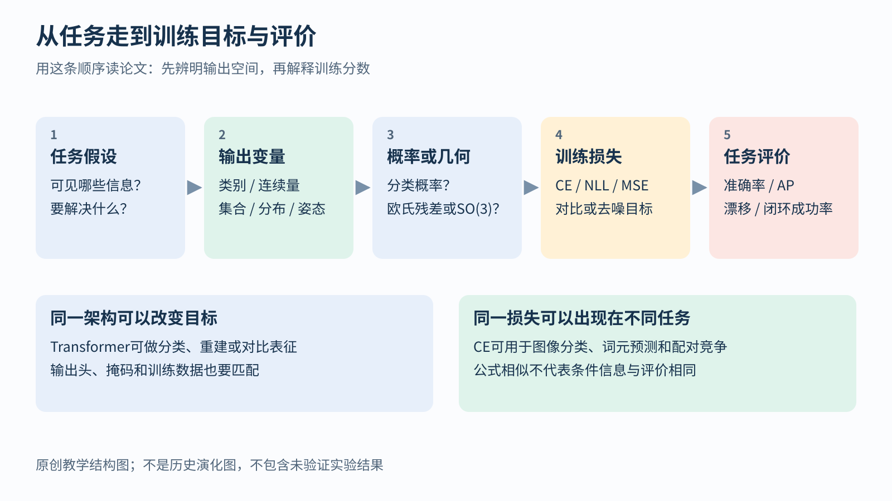

# 任务与训练目标 学习模块导航

## 先把题目说清楚 再决定怎样给答案打分

假设模型看见一张照片，照片里有一只猫。我们究竟想让模型回答什么？

如果问题是“有没有猫”，它需要作出类别判断。如果问题是“猫在哪里”，它还需要输出位置。如果问题是“猫离相机几米”，答案就要包含距离。同一张照片可以用于这些不同任务，但它们需要的答案不同，也不能用完全相同的规则评价。

这里的“任务”就是希望系统完成的具体工作。“训练目标”则规定训练时怎样衡量模型做得好不好。例如，预测距离为 3 米、实际为 5 米，就差了 2 米；我们可以根据这个差异计算一个误差分数。这个分数叫损失。模型训练时尝试降低它，但最终还要检查实际工作是否完成得更好。

读图时，先沿着“想解决的问题”走向“需要输出的东西”，然后再看“怎样获得对照答案”和“怎样比较预测与答案”。最后的评价意味着：模型在真正使用场景里是否有帮助。例如，机器人预测下一步位置的平均误差很小，并不自动证明它能安全走完整条路线。

这张图是学习顺序，不是技术发明的历史时间线。各模块会从一个具体问题开始，把评分规则、计算过程和适用条件逐步展开。

## 第一类问题 预测一个数值

你想估计物体有多远、机器人移动了多少、下一时刻的速度是多少。答案通常是连续数值，这类问题叫回归。

最先需要理解的是残差，也就是预测值减去目标值。残差可以为正或为负；损失函数会把它变成可用于训练的分数。平方误差、绝对误差和 Huber 损失怎样对待一次特别大的错误，是回归模块的主线。

## 第二类问题 判断属于哪个类别

你想判断图像里是哪种物体，或者一段文本表达正面还是负面态度。模型不仅可以给出所选类别，还可以给每个候选类别分配概率。

“选对了”与“对这个答案有多确信”是两件事。正确类别得到 0.51 的概率，与得到 0.99 的概率，都可能被选中，但训练时提供的改善信号不同。分类模块会从这个差异解释交叉熵，再介绍其他相关的概率量。

## 第三类问题 没有人工答案 能不能构造学习信号

一段文本本来包含下一个词，一张图片本来包含被遮住的区域。把其中一部分暂时隐藏起来，就可以让模型根据可见内容预测隐藏内容。答案仍然存在，只是它来自数据本身。

这种构造方式常被称为自监督。它不表示模型没有目标。生成、对比、掩码和去噪各自在要求模型学会什么，是否允许看未来内容，都要具体说明。相应模块会逐个比较，避免把它们笼统归为同一种任务。

## 第四类问题 答案带着物理意义

机器人输出的三个数字可能表示位置，也可能表示速度。即使都是位置，还要知道相对于哪个原点、朝向哪套坐标轴、使用米还是厘米。

所以机器人和 IMU 模块先讲清物理量的含义，再讨论怎样算误差。同一个运动过程换了一套坐标，正确的数字会变化；有些未知量也无法只靠已有传感器确定。损失函数必须尊重这些条件，不能只要求两个数组看起来接近。

## 第五类问题 同样能答对 为什么还要约束参数

有些模型能把训练记录记得很好，却在新数据上表现差。正则化是在训练目标或更新过程中加入约束的一类办法。

L1、L2 和权重衰减会怎样改变一次参数更新，需要用具体数字区分。它们也不是“自动修剪网络”的同义词。正则化模块会先展示一个参数怎样被改变，再解释何时可能产生稀疏，以及哪些结论不能直接推广到整个网络。

## 选篇入口

这些是阅读入口。每篇会在正文中解释必要概念，不要求读到一半回来查目录。

1. [回归与鲁棒损失](modules/objectives/01-regression-robustness.md)：从预测距离的误差开始
2. [概率分类](modules/objectives/02-classification-probabilities.md)：从答案正确与概率可信的差别开始
3. [自监督与生成目标](modules/objectives/03-pretraining-objectives.md)：从数据怎样给自己出题开始
4. [机器人与IMU目标](modules/objectives/04-robotics-imu.md)：从单位、坐标与传感器能知道什么开始
5. [参数正则化](modules/objectives/05-regularization.md)：从参数为什么还要受到约束开始

[返回学习总导航](00-learning-navigation.md)

各篇文末列出对应原论文和官方资料。本组的数值例子用于解释机制，没有执行模型训练，也不表示达到了论文中的实验结果。
