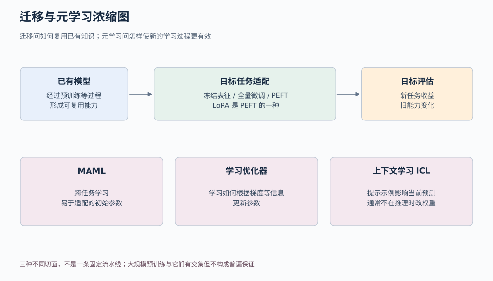
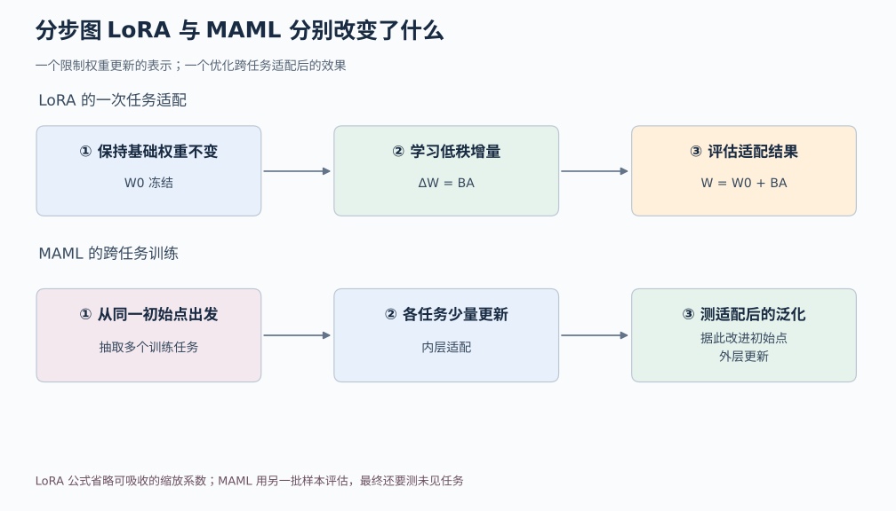

# 05c 迁移与元学习：已有知识怎样帮助新任务

## 1. 先从电影影评换成餐厅评论开始

假设我们已经训练了一个模型，能够判断英文电影影评是正面还是负面。现在手上只有少量餐厅评论，希望它也能判断顾客满意不满意。

两个任务都输出正面或负面，为什么还会出问题？因为数据变了。电影里 “unpredictable” 可能称赞情节难以预测，评价餐厅服务时却可能表达不满；“演员”“剪辑”变成了“服务员”“口味”。我们既想保留已有语言能力，又要适应新语境。

这就是理解**迁移学习 transfer learning**的入口：利用来源任务或来源领域中学到的东西，帮助目标任务或目标领域。任务类型不必改变，仅仅数据分布变化，也可能需要迁移。

另一个问题是：如果以后经常遇到只有几个样本的新任务，能不能让模型不仅记住旧任务，还学会“怎样更快适应新任务”？这会把我们带到**元学习 meta-learning**。

本篇会先讲迁移与微调，再拆开 LoRA 的矩阵计算，最后用一个小例子说明 MAML 的内外两层学习，并区分上下文学习。概念会在本页解释，不要求中途跳去其他文章。

## 2. 先分清模型参数特征和任务头

神经网络里通过训练改变的数字叫**参数**。给定输入和参数，模型会算出中间表示，通常称为**特征**。例如一个文本编码器把整段评论变成一个向量，向量的不同分量共同表达对预测有用的信息。

**任务头**是把这些特征转换成任务输出的小模块。在正负分类中，它可以把一个 768 维特征向量变成两个类别分数。特征向量不是两个类别本身；同一套特征还可能用于别的任务。

有了这个区分，就能理解三种常见适配方式。

第一种是**冻结编码器，只训练任务头**。冻结表示不更新那部分参数，但前向计算依然需要它。优点是训练状态较少，数据很少时也比较容易控制；局限是原有特征若根本没有保留新任务需要的信息，仅换一个头可能不够。

第二种是**全量微调**。从已有参数出发，允许整个模型继续训练。它给予适配更大自由度，也需要管理更多梯度和优化器状态；小数据下可能过拟合，旧任务表现也可能下降。

第三种是只训练特定层或额外小模块。它介于“完全冻结”和“全量更新”之间，常被归入**参数高效微调 PEFT**。Adapter 在模型里加入较小的可训练适配模块，是其中一类方法；LoRA 则用低秩矩阵表示某些权重的更新量。[1][2]

**迁移学习**描述我们要解决的知识复用问题；**微调**描述从已有参数继续训练的操作；**PEFT**描述减少可训练参数的一类技术；**LoRA**是具体方法。它们不处在同一抽象层，不能当作互相排斥的四个模型名称。

图中先看从已有模型到目标任务的适配选择，再看元学习所关注的学习过程。冻结、微调与 LoRA 回答“允许哪些参数怎样变化”；元学习进一步问“训练时能否专门优化未来的适应能力”。二者可以组合，不是必须二选一。

## 3. 预训练和适配为什么不是某种固定算法

**预训练**通常指先在较广的数据或任务上训练出可复用参数；**适配**则利用目标数据或反馈继续调整模型的能力和行为。

不同适配阶段的训练信号可以不同。继续预训练可能仍然采用下一 token 预测；监督微调使用输入与目标输出配对；偏好优化使用回答之间的偏好关系。这些是在说“用什么信号学习”。

LoRA 说的是另一件事：“学习时哪些权重被固定，更新量怎样表示。”因此 LoRA 可以和多种目标组合。使用 LoRA 不会自动把训练变成元学习，也不会自动解决数据质量问题。

“先试冻结特征还是先试 LoRA”是工程选择，需要看目标任务、数据量、资源和已有模型。定义概念时不能把某种常见流程写成所有问题必须遵守的唯一顺序。

## 4. 从一个线性层推到 LoRA

先看普通线性层 y=W₀x。我们采用列向量约定：输入 x 有 d_in 个分量，输出 y 有 d_out 个分量，所以权重矩阵 W₀ 的形状为 [d_out,d_in]。

全量微调允许 W₀ 的每个元素变化。LoRA 则冻结 W₀，额外训练两个小矩阵 A 和 B，把更新写成：

W = W₀ + sBA

其中 A 的形状是 [r,d_in]，B 的形状是 [d_out,r]，r 是较小的秩设置，s 是缩放系数。原始方法常用 s=α/r；α 是调节更新尺度的超参数。为先看清算术，下面取 s=1。[2]

于是前向计算可以拆成 y=W₀x+B(Ax)。旧模型负责第一项，可训练的小支路负责第二项。这不是把整个旧模型删掉了，而是在原有输出上加一个受约束的修正。

**低秩**是什么意思？对更新矩阵 BA 而言，所有输出修正都由 B 的 r 个列方向组合而成，所以更新的秩至多为 r。它限制的是这一处权重更新能使用的独立方向数，不是在宣称整个模型的知识只有 r 个维度。

## 5. 手算一个 LoRA 更新支路

令输入维度为 4，输出维度为 3，取 r=1：

A=[1,0,−1,0]

B 是三行一列，每行的数依次为 2、1、0

给输入 x=[3,1,1,2]，先算 A x=3−1=2，再算 B×2=[4,2,0]。因此新输出就是原来 W₀x 的输出，再加上 [4,2,0]。

如果把两个矩阵相乘，更新矩阵 BA 的三行分别为 [2,0,−2,0]、[1,0,−1,0]、[0,0,0,0]。第二行是第一行的一半，第三行全零，它们的变化方向并不独立，这正是秩受限制的直观表现。

原始 3×4 权重有 12 个元素，而 A、B 合起来有 4+3=7 个可训练元素。这个小例子节省得不夸张，因为尺寸本来就小。换成 4096×4096 的权重、r=8，则全量权重有 16777216 个元素，LoRA 两个矩阵合计 8×4096+4096×8=65536 个，是这一个权重矩阵元素数的 1/256。

注意，这个比例仅比较该矩阵的可训练参数量，不表示整模型总显存或训练耗时也缩到 1/256。基础模型仍要存储和执行，许多中间激活仍然需要保留，其他模块是否训练也会影响总量。

常见初始化让一个矩阵随机、另一个为零，使初始 BA 为零，模型先保持原来的映射。不能想当然把 A、B 都设为零：此时乘积对 A 的梯度含 B，对 B 的梯度含 A，两边都为零，会阻碍这个支路从零起步。[2]

如果是普通线性层、固定 LoRA 适配器且部署形式允许，可以把 W₀+sBA 合并成一个权重再推理。这样无需额外执行这条小支路；但不同适配器切换、量化或其他变体还需要相应处理，不能把所有实现都一概而论。

## 6. 低秩能省资源为什么仍要做实验

低秩更新是一种约束。它可能正好足以描述目标任务所需的改变，也可能不够。增大 r 会提供更多适配自由度，同时增加可训练参数和状态；把 r 调大并不保证验证效果单调提高。

数据越少也不意味着约束越强一定越好。若来源任务与目标任务差得很远，只改变少数方向可能难以适应；若数据有错误，LoRA 也会学习错误信号。全量微调同样不是天然胜者，它可能消耗更多资源却没有带来可验证收益。

一个干净的比较应固定基础模型、目标训练数据、验证/测试划分和评价口径，再比较冻结任务头、LoRA 与全量微调。记录可训练参数、峰值显存、耗时和任务表现；不要只报一个参数比例就宣布所有成本都降低了。

如果迁移后比从头训练或简单基线还差，称为**负迁移**。这提示我们，来源知识并非无条件有益，还需要检查领域差异、优化配置和评价数据。

## 7. 元学习把学习后的效果变成训练目标

现在把问题换成很多相似但不同的任务。例如经常需要根据少量样本辨认一组新的物品类别，每次类别不同，每类只有几张示例。我们希望模型在遇到新任务时，少量学习就能适应。

普通训练可以把所有训练样本混在一起优化一个目标。元学习则可以显式模拟“遇到新任务，先学几条，再在另一批样本上表现”的过程。

对每个任务，分成两部分：

- **支持集 support set**：提供给模型进行任务内适配的少量样本
- **查询集 query set**：检查适配之后是否学会了这个任务的另一批样本

两部分应分开。若适配后还只在适配用过的样本上打分，很难区分“学会新任务”和“记住这几个例子”。

**MAML**全称 Model-Agnostic Meta-Learning。它学习一个共享初始参数 θ，使模型在各种训练任务上经过少量梯度更新后，能在该任务的查询集上表现好。[3]

先补两个计算概念：**损失**把预测与目标之间的差异变成一个可优化的数；**梯度**描述各个参数微小变化时，损失会朝哪个方向、以多快的速度变化，符号 ∇θ 表示对参数 θ 求梯度。学习率控制沿梯度方向调整参数的步长。

可以把流程写成两层。**内层**用任务 i 的支持集损失 L_support,i 适配：

θ′ᵢ = θ − α∇θL_support,i(θ)

α 是内层学习率。随后在该任务查询集计算 L_query,i(θ′ᵢ)。**外层**再调整共同起点 θ，使许多任务适配后的查询损失平均更低：

θ ← θ − β∇θ 平均ᵢ L_query,i(θ′ᵢ)

β 是外层学习率。外层梯度要考虑 θ′ᵢ 是怎样从 θ 得来的，而不只是把适配后的参数与起点混为一谈。原始 MAML 通过梯度更新本身继续求导；一阶近似会省略部分导数信息，属于另外需要说明的近似。

## 8. 用两个简单任务手算内外两层

为了专注更新逻辑，设模型只有一个参数 θ，预测就是 θ。任务 1 希望预测 2，任务 2 希望预测 4；各任务损失为 0.5×(预测−目标)²。这个极简算例把任务内样本差异省掉了；真实实验仍需独立支持集与查询集。

从 θ=0 开始，内层学习率 α=0.5。

任务 1 的梯度为 0−2=−2，适配后 θ′₁=0−0.5×(−2)=1；任务 2 梯度为 −4，适配后 θ′₂=2。适配后的损失分别为 0.5×(1−2)²=0.5，以及 0.5×(2−4)²=2，平均为 1.25。

现在外层问的不是“怎样分别再改 1 和 2”，而是“最初的 0 放在哪里，才能让这两次适配的结果一起变好”。

内层关系为 θ′ᵢ=0.5θ+0.5aᵢ，其中 aᵢ 为任务目标。因此 θ′ᵢ 随 θ 的变化率为 0.5。查询损失对初始 θ 的导数分别是 (1−2)×0.5=−0.5 和 (2−4)×0.5=−1，平均 −0.75。

若外层学习率 β=1，新的共同起点变为 0−1×(−0.75)=0.75。再各走一次内层更新，任务 1 得到 1.375，任务 2 得到 2.375；平均适配后损失约为 0.758，比刚才的 1.25 小。这些数字都是手算示例。

这个玩具问题只是在演示梯度怎样经过“学习步骤”回到初始点。它没有证明 MAML 优于普通预训练；在这么简单的二次问题里，其他方法也可以找到好的起点。真正有意义的是在保留任务差异的实验中，比较新任务适配效率和泛化。

图的上半部分对应 W₀ 与低秩修正，学习对象是参数增量的表示；下半部分对应多个任务的支持集适配和查询集评价，学习对象是便于以后适配的起点。它们研究的维度不同，因此可以组合，例如限制内层只更新某些适配参数，但需要重新明确目标和实现。

## 9. 元训练的测试对象应该真的是新任务

除了一个任务内部的支持/查询划分，还需要跨任务的训练、验证、测试划分。元训练任务用于学习共同起点；元验证任务用于选择设置；元测试任务用于最终检查。

若声称适用于“未见过的新类别”，测试类别就不应出现在元训练类别里。若声称适用于新用户，每个任务按用户定义，则应留出用户。只给同一任务换几个样本，然后写成全新任务能力，会夸大结论。

测试时允许用支持集做约定数量的适配，这是任务协议的一部分，并非自动算泄漏；但不能再用查询标签选择学习率、更新次数或最有利的模型，然后把查询表现称为独立结果。

还要与合理基线比较，例如普通预训练后微调、冻结特征或最近邻方法，并尽量对齐数据量和计算预算。算法名字里有“学会学习”，不能代替这些证据。

## 10. 上下文学习为何不需要当场改权重

给语言模型几条示例：“满意的评论输出青，不满意的评论输出橙”，再让它处理一条新评论。模型可能根据提示中的例子改变当前回答方式，而无需执行梯度下降。这类通过上下文示例适应当前任务的现象，称为**上下文学习 ICL**。GPT-3 论文展示并评估了相关少样本能力。[4]

这里变化的是上下文与本次计算中的内部表示，通常不是模型参数。撤去示例以后，不能因为刚才答对，就说这一映射已永久写入权重。ICL 与微调在推理时改变的东西不同。

它与元学习有联系：两者都关心跨经验获得适应新任务的能力。但不能把所有 ICL 都说成“模型内部真的运行了 MAML”，也不能把所有大模型预训练直接等同于显式元学习目标。

某些理论在特定数据生成条件下，把 ICL 解释为隐式贝叶斯推断。[5] **贝叶斯推断**在这里可以先理解为：结合原有假设与当前示例，更新对“这次到底是什么任务”的判断。理论解释依赖模型和数据假设，不是证明任意语言模型都能可靠适应任意新任务。

## 11. 学习优化器与大规模预训练分别补充什么

MAML 学的是一个容易适配的起点；**learned optimizer 学习优化器**则尝试学习更新规则本身，例如给定当前梯度和历史状态，下一步参数应该怎样调整。[6] 它需要在一批训练优化问题上学习，再在留出的优化问题上评价。训练过的小网络优化得快，不代表自动泛化到所有模型尺寸和损失结构。

大规模预训练可以提供很强的通用表征和适应能力，确实吸收了许多“利用上下文和少量信息解决新问题”的需求。但下一 token 预测目标，与显式优化“经过少量适配后在新任务查询集上表现”的目标仍然不同。

因此，“预训练提供强基线”是合理判断；“数据够多就已经解决元学习”则过强。应看具体条件：任务差异多大、有几个示例、允许改权重吗、能花多少适配时间、需要怎样的可靠性。不同条件下，ICL、冻结特征、微调和显式元学习可能有不同价值。

## 12. 用三个问题选择下一步

如果你只有一个目标任务，先问是否已有合适的预训练模型，以及冻结特征能做到什么，再比较微调方案。若训练资源紧张，LoRA 可以是候选，但要测量真实成本和表现。

如果你有许多相关任务，并且未来经常需要快速适应新任务，再问能否构造真实的支持集、查询集与留出任务，设计元学习实验。缺少这些划分，元学习很容易退化成仅仅换个名字训练。

如果部署时不能改权重，但能提供少量示例，可以研究 ICL，同时检查示例顺序、表述、标签方式和任务变化的敏感性。不能只挑一组最顺手的提示报告结果。

最后试着用一句话区分它们：LoRA 约束某些参数更新怎样表示；MAML 优化少量学习之后表现好的初始点；ICL 通常通过输入上下文改变当前行为。三者都可能帮助适应，却没有共同的无条件成功保证。

## 参考资料与延伸阅读

[1] Neil Houlsby et al. Parameter-Efficient Transfer Learning for NLP. ICML，2019。https://arxiv.org/abs/1902.00751

[2] Edward J. Hu, Yelong Shen, Phillip Wallis, Zeyuan Allen-Zhu, Yuanzhi Li, Shean Wang, Lu Wang, Weizhu Chen. LoRA: Low-Rank Adaptation of Large Language Models. ICLR，2022。https://arxiv.org/abs/2106.09685

[3] Chelsea Finn, Pieter Abbeel, Sergey Levine. Model-Agnostic Meta-Learning for Fast Adaptation of Deep Networks. ICML，2017，PMLR 70:1126–1135。https://proceedings.mlr.press/v70/finn17a.html

[4] Tom B. Brown et al. Language Models are Few-Shot Learners. NeurIPS，2020。https://arxiv.org/abs/2005.14165

[5] Sang Michael Xie, Aditi Raghunathan, Percy Liang, Tengyu Ma. An Explanation of In-context Learning as Implicit Bayesian Inference. ICLR，2022。https://arxiv.org/abs/2111.02080

[6] Marcin Andrychowicz et al. Learning to learn by gradient descent by gradient descent. NeurIPS，2016。https://arxiv.org/abs/1606.04474

后续专题：[GPT-3 精读笔记](../../docs/deep-readings/gpt3.md)。LoRA、MAML 和 ICL 理论的原论文见以上文献，本文不宣称完成了逐节复现。

课程导航：[学习导航](00-learning-navigation.md) · [进阶入口](05-advanced-bridges.md)

资料复核日期：2026-10-02。本文数值为教学手算，未执行微调或元学习训练。
