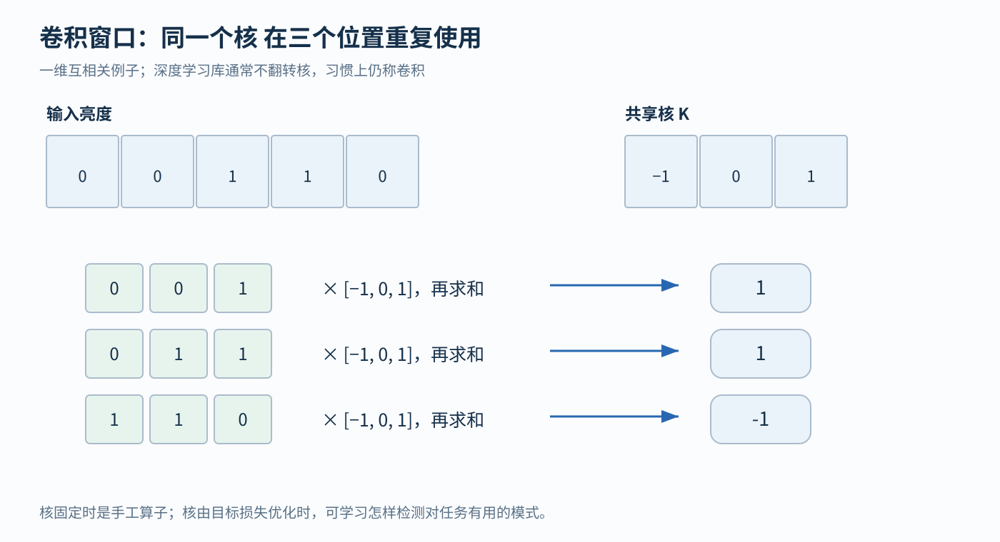
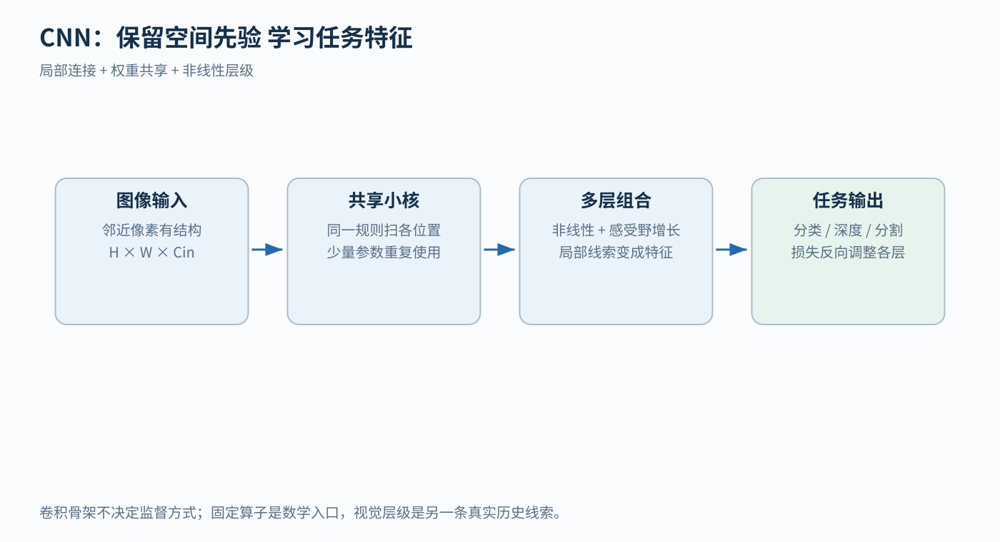
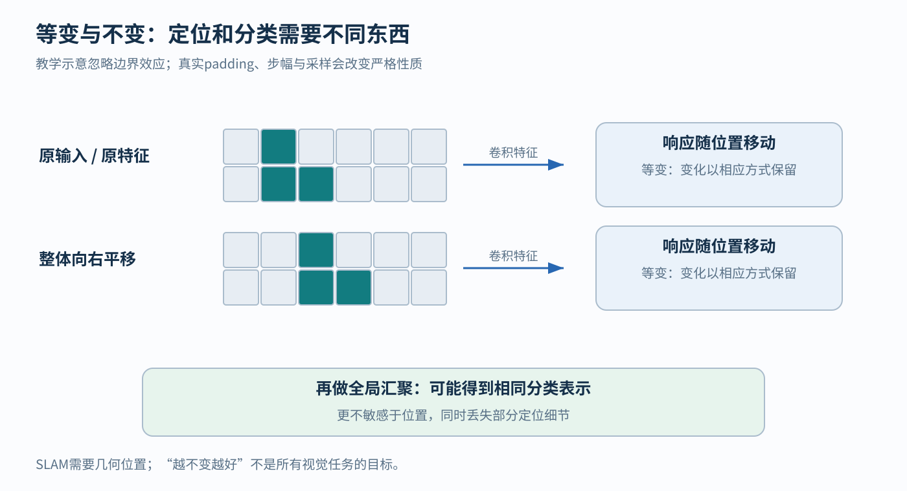

# CNN 从像素窗口到可学习视觉特征

## 1 图片里的同一个东西为什么要反复学习

假设我们要识别一张手写数字图片。数字“1”可以写在左边，也可以写在右边。对人来说，这两张图都很好认；但计算机最初看到的只是一排排数字：每个数字表示一个像素有多亮。

先把图片缩小到 8×8，即 8 行、8 列，共 64 个亮度值。最直接的办法是把它们排成长度为 64 的向量，再交给一个神经网络。这里“向量”不用想得神秘，就是按顺序放在一起的一组数。

如果一个中间节点分别接收全部 64 个像素，就需要 64 个连接权重。权重是“这一输入要乘多大系数”的数。若有 4 个这样的节点，再给每个节点一个偏置，就有 64×4+4=260 个待学习的参数。偏置是加在加权总和上的常数。

这个方案并非不能工作，问题是：左上角的一小段竖线与右下角的一小段竖线，分别经过不同连接。模型没有预先被告知“它们可以用同一套办法检测”。

于是我们提出两个朴素要求：

1. 先看附近的一小块。边缘通常由相邻像素的亮暗变化组成，不必一开始就连接整张图
2. 到别的位置时，沿用刚才的检测办法。不要在每个位置重新发明一个“竖线检测器”

**CNN，即卷积神经网络，把这两点写进网络结构：局部连接、权重共享。** 这是一种建模假设，不是从所有可能图片里证明出来的定理。它适合自然图像中经常重复出现的局部结构。[1][2]

## 2 一个小核滑过去到底在算什么

先只看一行亮度：

X = [0, 0, 1, 1, 0]

0 表示暗，1 表示亮。我们暂时手工选三个系数：

K = [−1, 0, 1]

K 叫作卷积核。它做的事情很简单：把一个长度为 3 的窗口盖住输入，对应位置相乘，再把结果相加。

第一次，窗口盖住 [0,0,1]：

(−1)×0 + 0×0 + 1×1 = 1

第二次，向右移动一格，盖住 [0,1,1]：

(−1)×0 + 0×1 + 1×1 = 1

第三次，再向右一格，盖住 [1,1,0]：

(−1)×1 + 0×1 + 1×0 = −1

因此结果是 [1,1,−1]。这组结果不是类别标签，而是一张更小的“响应图”：不同位置对这个核的响应有多强。

为什么这里能反映亮暗变化？因为中间乘 0，结果实际等于“右侧亮度减左侧亮度”。右边更亮，得到正数；右边更暗，得到负数；两边一样亮，得到 0。

这个核就是 HOG 求梯度用的模板。HOG（Histograms of Oriented Gradients，方向梯度直方图：先求每个像素的梯度方向，再在小格子里统计方向分布的一种手工图像特征）出自 Dalal 与 Triggs 2005 年的行人检测论文。他们比较了带高斯平滑的模板、3×3 Sobel、更长的五点模板等多种求梯度的办法，结论是不做平滑的一维 [−1, 0, 1] 效果最好，并把它定为默认设置。[5] 所以刚才手算出的响应图 [1,1,−1]，正是 HOG 流水线在这一行上算出的水平梯度。

**怎样读这张图？** 最上面是同一行输入；下面三个窗口对应刚才的三次计算。每个窗口都乘 [−1,0,1]，而不是分别使用三套参数。“共享”的正是这三个系数。窗口在移动，规则没有变。

严格数学卷积会翻转核；本例以及常见深度学习实现通常不翻转，运算名是互相关。工程上仍沿用“卷积层”的叫法。对可自由学习的核而言，翻不翻转可以通过学习另一组系数来对应，但手工指定核时必须认清方向。

### 从一行变成一张图

二维图像没有换一套原理，只是把“连续三个数”换成“附近一个小方块”。例如输入的一小块是：

第一行：[1, 2]
第二行：[3, 4]

核的两行是 [1,0] 和 [0,−1]，那么这一位置的输出就是：

1×1 + 0×2 + 0×3 + (−1)×4 = −3

核右移、下移，就得到其他位置的输出。

### 为什么输出通常比输入小

长度为 5 的输入，长度为 3 的窗口，只有从第 1、2、3 个位置开始时能完整放下，所以输出长度是 5−3+1=3。

这涉及三个经常同时出现的词：

- 核大小：每次看多大一块
- 步幅 stride：每次移动几格。本例是 1；步幅 2 就隔一格再计算
- 填充 padding：先在边缘补多少格。本例没有填充；补零可以让窗口覆盖边缘外侧

以普通、没有膨胀间隔的卷积为例，输入高 H、核高 k、上下各补 p 格、步幅 s，输出高为：

H_out = floor((H + 2p − k)/s) + 1

floor 表示向下取整。8 行输入、3 行核、p=0、s=1，得到 6 行；若 p=1，就得到 8 行。宽度也按同样办法计算。填充只是边界处理方法，并没有给模型提供真实的新像素。

## 3 从一个检测器到很多种特征

灰度图每个位置只有一个亮度值；彩色图通常每个位置有红、绿、蓝三个值，这三个方向叫作通道。中间层的通道也可以有 16 个、32 个，不过它们不再一定对应颜色，而是不同的学习结果。

假设输入是 8×8×3，要输出 4 个通道，核的空间大小是 3×3。一个输出通道需要同时查看三个输入通道，因此它有：

3×3×3 = 27 个权重

加一个偏置，共 28 个参数。4 个输出通道共 28×4=112 个参数。在无填充、步幅 1 时，输出形状为 6×6×4。

注意：4 是我们选择的输出通道数量，不是由图片有几种颜色自动决定的。每一个输出通道都有自己的 27 个权重，但同一输出通道在不同位置共享这些权重。

现在再读一般公式就容易了。暂时省略“一次处理多少张图片”的批次维度，设输入：

X ∈ ℝ^(H×W×C_in)

ℝ 表示这些数是实数；H、W 是高和宽；C_in 是输入通道数。核记作：

K ∈ ℝ^(k_h×k_w×C_in×C_out)

其中 k_h、k_w 是核高、核宽，C_out 是输出通道数。无填充、步幅 1 时，某个位置的卷积结果为：

Z[i,j,o] = b[o] + Σ_u Σ_v Σ_c K[u,v,c,o] X[i+u,j+v,c]

逐项读：i、j 是输出位置；o 是第几个输出通道；u、v 遍历小窗口；c 遍历输入通道；Σ 表示把所有对应乘积加起来。b[o] 是第 o 个通道的偏置。

公式虽然长，仍只是我们手算过的“对应相乘，再求和”。参数总数是：

k_h × k_w × C_in × C_out + C_out

这里没有 H×W，所以图像变大时，卷积层的参数不会随像素数同比增长。不过计算次数、特征图占用的内存会增大；“参数少”不等于“计算量不变”。

## 4 核怎样学习和多层怎样组合

到这里，K 还是我们手工选择的。CNN 的关键一步，是让训练数据决定 K。

以数字分类为例，一张真实标签为“1”的图片经过卷积和后续计算，模型给出十个数字的预测概率。如果它只给“1”很低的概率，损失就大。损失是衡量预测有多不符合目标的数。

反向传播会计算：每个核系数稍微变一点，最终损失会怎样变。这个变化率叫梯度。优化器根据梯度调整系数，让同类训练样本上的表现逐渐改善。**没有人逐个给中间通道贴上“这是竖线”“那是眼睛”的标签；我们通常只给任务目标。**

为什么要加入 ReLU 等非线性？ReLU 的规则是 max(0,z)：正数保留，负数变 0。刚才 [1,1,−1] 经过 ReLU 变成 [1,1,0]。如果多层仅由线性运算串起来，整体仍然是一个线性变换；加入非线性，网络才能表示更复杂的条件组合。

为什么叠很多层？第一层某位置看 3×3 像素，第二层再看第一层附近的 3×3 位置，就能间接受到原图 5×5 区域的影响。这片能影响一个输出的输入区域叫感受野。在步幅均为 1、没有膨胀卷积的这个例子里，第三个 3×3 层可看到 7×7 区域。

层叠让局部线索能组合成更大的结构，但不保证第几层必然等于“边缘层”“眼睛层”或“物体层”。这些是帮助理解的概括，具体表示要通过实验检查。

**怎样读总览图？** 从左到右是一次预测的流程。图像提供数字，共享小核提取局部响应，多层计算组合响应，最后按任务输出结果。训练时，最右侧的损失会反过来影响左边各层的参数。图中“任务输出”可以是类别，也可以是深度、关键点或逐像素标签，因此 CNN 本身并不指定唯一损失或监督方式。

## 5 移动一下还认得与完全不关心位置的区别

把一条竖线从左边移到右边，理想卷积的强响应也会从左边移到右边。这叫平移等变：输入怎样移动，输出相应地移动。

分类时，我们有时只想知道“有没有这条线”，不关心它在哪里。可以把一张响应图汇总成一个数，例如取最大值或平均值。这种汇聚能降低输出对位置的敏感程度，但同时丢掉部分位置细节。

一个具体比较：特征图 A=[0,3,0,0]，B=[0,0,3,0]。两张图不同，强响应的位置不同；它们的全局最大值却都是 3，平均值也都是 0.75。后两种表示已经分不清位置。

**怎样读这张图？** 上下两组分别是移动前后。先看卷积响应的位置有没有跟着移动；再看最后汇聚成的分类表示是否可能相同。前者是等变，后者体现对位置更不敏感。图中忽略了边界；真实填充、步幅与下采样会影响严格的等变性质。

这对机器人尤其重要。判断“画面里有路标”可以不太关心路标在哪个像素；要用路标定位相机，就必须保留像素坐标。不是越丢位置越先进，而是要问任务需要什么。

## 6 历史来源与后来的结构改进

这一节按“上一步留下了什么问题”串起 CNN 的历史。卷积、权重共享和梯度训练在 1998 年已经齐备；之后十多年的变化，主要来自另外三样东西：手工特征路线提供的对照、足够大的数据与公开 benchmark、能训练大网络的算力。

### 从视觉皮层模型到可训练的卷积网络

Fukushima 1980 年的 Neocognitron 要解决的问题是：识别结果会随图案平移和形变而改变。他在引言中直接采用 Hubel 与 Wiesel 的视觉皮层层级模型：S 细胞对应简单细胞，负责提取特征；C 细胞对应复杂细胞，负责容忍位置变化。同一个“细胞平面”里的所有 S 细胞，输入连接的空间分布相同，只是位置平移，这正是第 1 节说的权重共享。[1] 它的 S 层靠无监督自组织学习，只需反复呈现图案、不使用类别标签。作者在实验部分写到，训练十个数字时，结果对参数和图案呈现方式非常敏感。[1]

LeCun 等人的文档识别工作把共享参数、局部连接与梯度训练结合起来，卷积核改由标注数据和反向传播决定。1998 年论文中的 LeNet-5 是理解这种系统如何实际工作的经典实例。[2]

### 手工特征路线：HOG 与 DPM

2000 年代的物体检测主要走另一条路线：特征由人设计，只有分类器在学习。Dalal 与 Triggs 2005 年提出 HOG，目标是为行人检测找一套稳健的特征。它的流水线（原文 Fig.1）可以逐步对应到 CNN 的一层：[5]

| HOG 的步骤 | 原文默认做法 | 对应的 CNN 部件 |
|---|---|---|
| 计算梯度 | 用 [−1,0,1] 及其竖直版本求水平、竖直梯度，不做平滑 | 卷积层，核固定为这两个 |
| 按方向加权投票 | 每个像素按梯度方向投到 0°–180° 的 9 个方向桶，票数是梯度幅值；原文第 6.3 节称这一步是描述子的基本非线性 | 逐像素非线性：2 个梯度通道变成 9 个方向通道 |
| 在 8×8 像素的 cell 内累计 | 每个 cell 得到一个 9 维方向直方图 | 求和池化，步幅 8 |
| 在重叠 block 内做对比度归一化 | 每个 block 含 2×2 个 cell，用 L2-Hys 归一化 | 归一化层（AlexNet 原文 Sec.3.3 也用了一种局部归一化） |
| 线性 SVM | 对整个检测窗口的特征打分 | 最后的线性分类层 |

所以 HOG 加线性 SVM，相当于一个卷积核固定、只有最后一层可学习的浅层 CNN。在作者新建的 INRIA 行人数据集上，HOG 把每窗口误检率比 Haar 小波等已有特征降低了至少一个数量级。[5] 作者在未来工作中写到：人体高度关节化，加入局部空间不变性更强的部件模型会有帮助。

DPM（Deformable Part Model，可变形部件模型：一个整体模板加若干可以小幅移动的部件模板，部件偏离理想位置要付出代价）走的正是这个方向。Felzenszwalb、Girshick 等人的版本在 HOG 特征金字塔上用混合多尺度的部件模型，以 latent SVM 训练；与 PASCAL VOC 2008 的正式参赛系统相比，它在 20 个类别中 9 类第一、8 类第二。[6] 它的整体模板和部件模板，都是在 HOG 特征图上做的线性滤波，也就是卷积。

### 数据、算力与 benchmark：ImageNet、ILSVRC 与 AlexNet

卷积网络和手工特征路线并存了十多年。改变局面的条件在 2009–2012 年凑齐：

- ImageNet（2009，Princeton 的 Deng、Fei-Fei 等）：要解决的问题是互联网图片爆炸，却缺少按概念组织好的大规模标注数据。论文发表时已有 5247 个类别（WordNet 中的名词同义词集）、320 万张图，目标是约 5000 万张。[7]
- ILSVRC（ImageNet Large Scale Visual Recognition Challenge，基于 ImageNet 的年度竞赛，2010 年起每年举办）：给所有团队一个公开的同一 benchmark。分类任务约 120 万张训练图、1000 类。[8][9]
- AlexNet（2012，Toronto 的 Krizhevsky、Sutskever、Hinton）在引言中把问题说得很直接：CNN 对图像的结构假设大体正确，但在高分辨率图像上大规模训练一直太贵；GPU 配上高度优化的二维卷积实现，加上 ImageNet 这样足够大的标注集，才使训练大 CNN 成为可能。[9] 网络有 6000 万参数，在两块 GTX 580 GPU 上训练五到六天，用 ReLU 加快训练，用 dropout 抑制过拟合。在 ILSVRC-2012 上，它的 top-5 测试错误率是 15.3%，第二名（多个 Fisher 向量手工特征分类器的平均）是 26.2%。[9]

ILSVRC 的组织者在总结论文中把 2012 年称为转折点：2013 年绝大多数参赛方法改用深度 CNN，2014 年几乎所有队伍都在用 CNN。[8] [判断] 改变局面的是数据、算力和 benchmark，卷积机制在 LeNet 中已经具备。

### ILSVRC 驱动的深度竞赛：VGG、GoogLeNet 到 ResNet

AlexNet 之后，ILSVRC 上的问题变成“网络怎样做得更深、更省”：

- VGG（2014，Oxford）固定其他设计、全部用 3×3 卷积，专门研究深度的影响，做到 16–19 层，在 ILSVRC-2014 分类中排第二、定位第一。[10]
- GoogLeNet（2014，Google）在计算预算不变的前提下同时加深加宽，参数比 AlexNet 少 12 倍，以 6.67% 的 top-5 错误率获得 ILSVRC-2014 分类第一，VGG 为 7.32%。[11]
- 更深却更难训练怎么办？ResNet（2015，Microsoft Research）在引言中指出退化问题：网络加深后，精度先饱和再下降，而且更深模型的训练误差反而更高，所以问题出在优化，而非过拟合。ResNet 让一段网络学习修正量 F(x)，输出写成 x+F(x)。如果这段暂时不需大改输入，可以让修正量接近零，而不是重新学出整个恒等映射。相加要求形状匹配，必要时另做投影。它的集成模型在 ILSVRC 2015 分类上 top-5 测试错误率 3.57%，排第一。[3]

### 预训练主干迁移到检测和分割

- R-CNN（2013，Berkeley 的 Girshick 等）要解决的问题是 PASCAL VOC 检测在 2010–2012 年进展停滞。它先在 ILSVRC 分类数据上预训练 CNN，再在检测数据上微调。在 VOC2007 上 mAP 达到 54.2%，HOG 特征的 DPM 为 33.7%；其中微调本身带来 8.0 个百分点。[12]
- 同一位作者 2014 年证明 DPM 本身可以写成 CNN：把 DPM 的推断算法逐步展开，模板滤波是卷积，部件形变用的距离变换是最大池化的推广，多个混合分量取最大值就是 maxout 单元。把底层的 HOG 换成 AlexNet 的 conv5 特征后，VOC2007 上的 mAP 从 33.7% 升到 45.2%。[13] 手工特征路线与 CNN 路线在这里合成一条。
- 把图缩小后，怎样恢复每个像素的结果？U-Net（2015，Freiburg）面对的是生物医学图像：要逐像素定位，训练图像却只有几十张。它先提取较大范围的上下文，再逐步恢复空间分辨率，并把较早层的高分辨率信息接到恢复路径。它关心的是密集输出中的定位细节。[4]

ResNet 与 U-Net 都有跨层通路（残差是相加，U-Net 是把特征拼接在一起，两者是不同的操作）。

[判断] 从 R-CNN 开始，“先在 ImageNet 上预训练一个视觉主干，再迁移到具体任务”成为视觉领域的默认起点。

### ViT 与 ConvNeXt：架构之争里的数据和训练配方

- ViT（2020，Google Brain）把图像切成 16×16 的块，当作 token 序列交给 Transformer（见 [Attention 与 Transformer](14-attention-transformer.md) 第 13.4 节）。只在 ImageNet 上预训练时，大 ViT 不如同规模的 ResNet；在 ImageNet-21k 上两者相近；在约 3 亿张图的 JFT-300M 上预训练后，ViT 反超。作者的解释是，Transformer 缺少平移等变和局部性这类 CNN 自带的归纳偏置，数据少时泛化差，数据足够多时可以直接从数据中学到。[14]
- ConvNeXt（2022，FAIR 与 Berkeley）反过来问：Swin 这类视觉 Transformer 的优势，有多少来自 Transformer 本身？只把 ResNet-50 的训练换成 Transformer 式配方（训练 300 轮、AdamW 优化器、更强的数据增强），ImageNet 精度就从 76.1% 升到 78.8%；再逐步借用 Transformer 的宏观和微观设计，得到的纯卷积网络在相近计算量下全面超过 Swin。[15]

[判断] CNN 与 Transformer 的胜负，很大程度取决于数据规模和训练配方，而不只是架构本身。

### 用到机器人与选型

在 SLAM 中，CNN 可以提供特征、深度或匹配线索；几何约束、尺度和跨帧一致性由后端单独处理。

当局部空间结构强、分辨率高时，CNN 是值得比较的基线；远距离信息需要经过多层传播才能汇合。实际选型同时比较数据、预训练、延迟和任务表现。

## 7 带着具体问题读论文

### Neocognitron 中固定结构与学习参数的分工

先读引言与结构图。把 S 层、C 层分别标出来：哪些连接可改变？哪些结构帮助容忍位置变化？再读自组织部分，检查它的学习过程是否需要类别标签。最后写出这篇与现代 CNN 相通的结构思想，以及不同的训练方式。不要把现代 ReLU 或全部反向传播流程倒推给 1980 年的模型。[1]

### LeNet 中一张图片怎样逐层变形

读卷积网络与 LeNet-5 部分时，逐层写下输入大小、输出大小、核大小、通道数和连接方式。特别检查哪些参数跨位置共享、哪些层不再只是局部卷积。解释“连接发生很多次”和“独立参数有很多个”为何不是同一件事。旧架构还可能采用部分通道连接，不要直接套用现代全通道连接的参数公式。[2]

### ResNet 与 U-Net 分别解决的瓶颈

对 ResNet，检查作者讨论的深度增加与优化困难，并区分训练误差问题和过拟合。对 U-Net，画出缩小、放大和跨层传递的位置，解释这些路径为什么服务于像素级输出。只说“都有跳跃连接”还不足以表明读懂。[3][4]

## 8 手算检查与最小实验

**问题一。** 8×8×1 输入，3×3 核，4 个输出通道，步幅 1、无填充。输出和参数量是多少？

先算空间：8−3+1=6，所以输出是 6×6×4。每个通道有 3×3×1+1=10 个参数，4 个共 40 个。不是给 6×6 个输出位置各配 10 个新参数。

**问题二。** 同样的核处理 16×16 输入，参数会翻倍吗？

不会，仍然 40 个；输出变成 14×14×4，因此计算和中间内存增加。

**问题三。** 最大池化后得到同样结果，是否说明输入相同？

不是。A=[0,3,0,0] 与 B=[0,0,3,0] 就是反例。汇聚是一种信息压缩。

最小实验可以不训练任何模型：画一个亮方块，使用固定边缘核，记录原图与平移一格后的响应。分别比较不下采样、步幅 2、全局汇聚的结果，并检查边界。先亲眼看见等变成立与被破坏的条件，再训练可学习的核，理解会牢固得多。

## 9 与其他概念的关系

### 从手工特征到可学习特征

这条链从视觉神经科学走到今天的卷积核，每一步说明与上一步是什么关系：

1. `[历史]` **Hubel–Wiesel → Neocognitron。** Fukushima 在 Neocognitron 的摘要和引言中直接采用 Hubel 与 Wiesel 的视觉皮层层级模型：S 细胞对应简单细胞（提取特征），C 细胞对应复杂细胞（容忍位置变化），层级越高、感受野越大、对位置越不敏感。[1] 第 4 节的“感受野随层数变大”与第 5 节的“汇聚降低位置敏感度”，正是这两种细胞的分工。
2. `[历史]` **方向直方图类描述子 → HOG。** Dalal 与 Triggs 在引言中写明，HOG 与边缘方向直方图、SIFT 描述子（统计关键点周围梯度方向分布的局部特征）、shape context 属于同一类；他们的改动是在密集均匀的格子上计算，并用重叠 block 做局部对比度归一化。[5]
3. `[结构]` **HOG 的第一步就是一个固定的卷积核。** 第 2 节手算的 [−1,0,1] 是 HOG 的默认梯度模板，在 [0,0,1,1,0] 上得到 [1,1,−1]；第 6 节的表格把 HOG 的五个步骤逐一对应到“卷积 → 逐像素非线性 → 池化 → 归一化 → 线性分类”。HOG 加线性 SVM 因此是一个核固定、只有最后一层可学习的浅层 CNN。
4. `[结构]` **DPM 可以展开成 CNN。** DPM 在 HOG 特征图上用整体模板和部件模板做线性滤波，这一步本身就是卷积。Girshick 等人把 DPM 的整个推断过程逐步展开：部件形变用的距离变换是最大池化的推广，多个混合分量取最大值是 maxout 单元。因此任何 DPM 都等价于一个特定结构的 CNN，底层的 HOG 也就可以换成学到的特征。[13]
5. `[经验]` **学到的第一层卷积核与手工方向滤波器形状相似。** AlexNet 原文第 6.1 节展示第一层的 96 个卷积核：网络学到了多种对频率和方向有选择性的核，以及各种颜色斑块。[9] Yosinski 等人的迁移性研究把这一点概括为：在自然图像上训练的网络，第一层学到的特征类似 Gabor 滤波器（按特定方向和频率响应的带通滤波器）和颜色斑块。[16] 手工路线在 HOG 里写死的“方向梯度”，在可学习路线里由数据重新学了出来。

这条链说明，CNN 与手工特征之间的关系是“同一种计算，参数从人工指定变为由数据决定”：HOG 固定了卷积核，DPM 固定了特征、学习模板，AlexNet 把每一层的核都交给了训练。

### 与其他模块的关系

- `[结构]` **RNN 在时间上共享权重，卷积在空间上共享权重。** [RNN](12-rnn.md) 每一步都用同一套 W_h、W_x 更新状态，卷积层在每个位置都用同一个核；两者都让参数量与序列长度或图像大小无关（本讲义第 3 节的参数公式里没有 H×W）。区别在于 RNN 的每一步还要读取上一步的状态，卷积的各位置之间没有这种依赖。
- `[结构]` **Transformer 的 FFN 是 1×1 卷积，ViT 的 patch 嵌入是步幅等于核大小的卷积。** 把第 3 节公式中的核高、核宽设为 1，就得到对每个位置做同一个线性变换，这正是 Transformer 中逐位置 FFN 的形式；把核大小和步幅都设为 16，就得到 ViT 把 16×16 图像块映射成 token 的那一步。推导和尺寸验证见 [Attention 与 Transformer](14-attention-transformer.md) 第 17 节。
- `[历史]` **Transformer 的残差连接引用 ResNet。** Attention Is All You Need 在每个子层外加残差连接，并直接引用 He 等人的 ResNet。第 6 节 ResNet 要解决的“更深反而训练误差更高”，在 Transformer 里对应 [Attention 与 Transformer](14-attention-transformer.md) 第 10.2 节的 y = x + f(x)。
- `[经验]` **CNN 与 ViT 的优劣取决于数据规模和训练配方。** ViT 在中等规模数据上不如同规模的 ResNet，在 JFT-300M 上反超；ConvNeXt 只换训练配方就让 ResNet-50 提升 2.7 个百分点。[14][15] 这是第 6 节最后一段判断的实验依据；领域层面的对照见[视觉表征方向](../../multimodal/fields/visual-representation/README.md)，跨领域的论证见[观点：CNN 与 Transformer](../../perspectives/cnn-vs-transformer.md)。

## 批注

**易误读**

- 第 6 节 HOG 与 CNN 的对应是计算结构上的对应：HOG 的方向投票在方向和位置上都做双线性插值，把梯度幅值分到相邻的桶和 cell，形式上与 ReLU 不同；AlexNet 的局部响应归一化在通道之间进行，HOG 的 block 归一化在空间邻域内进行，细节不同（HOG 原文第 6 节；AlexNet 原文第 3.3 节）。
- “Gabor 状”一词来自 Yosinski 等 2014 的摘要；AlexNet 原文第 6.1 节的措辞是“对频率和方向有选择性的核”与“颜色斑块”，没有用 Gabor 一词。
- Neocognitron 的 S 层用无监督自组织学习，没有反向传播；第 7 节读它时，不要把现代 ReLU 或反向传播倒推给 1980 年的模型。
- ViT 的“反超”依赖 JFT-300M 这个非公开数据集上的预训练（ViT 原文第 4.3 节、Fig.3）；只用 ImageNet-1k 时结论相反。

**判断的支撑论文（第 6 节）**

- “改变局面的是数据、算力和 benchmark”：AlexNet 第 1 节（GPU 加二维卷积优化实现、ImageNet 规模的标注数据使训练大 CNN 可行）；ILSVRC 综述第 5.1 节（2012 年是转折点，2013 年绝大多数、2014 年几乎全部参赛方法使用 CNN）；卷积、权重共享与梯度训练在 Neocognitron 与 LeNet 中已经出现。
- “预训练主干成为默认起点”：R-CNN 第 3.2 节（ImageNet 预训练加微调带来 8.0 个百分点）；DPM are CNNs（把 HOG 换成 ImageNet 训练的 conv5 特征）。本讲义只核对了这条检测线，分割、深度估计等任务上的普及程度没有逐篇核对。
- “胜负很大程度取决于数据和训练配方”：ViT 第 4.3 节与 Fig.3–4；ConvNeXt 第 2.1 节与第 1 节。

**与其他论文的关联**

- [ViT](../../multimodal/papers/vit/README.md)：第 6 节 ViT 节点与第 9 节 patch 嵌入关系的原文。
- [Attention 与 Transformer](14-attention-transformer.md) 第 13.5 节：语言模型一侧的架构收敛，可与本讲义第 6 节的 CNN 与 ViT 之争对照。
- [视觉表征方向](../../multimodal/fields/visual-representation/README.md)：本讲义第 6 节历史链的领域版本，附逐篇综合表 synthesis.csv。
- [架构与信息流概念地图](../fields/architectures/README.md)：本讲义与其他架构模块的依赖关系。

**未核实 / 待验证**

- LeCun 等 1998 年论文的全文本轮没能打开（作者主页拒绝连接，镜像 PDF 抽不出文字），第 6 节关于 LeNet 的描述保留原有写法，没有补充新的细节。
- DPM（Felzenszwalb 等）的发表年份按题录写作 2010，所用 PDF 正文没有印出年份。
- Zeiler 与 Fergus 2013 对第一层卷积核的可视化只通过 ar5iv 摘要模型转述读到，没有写入正文。

## 参考资料与继续阅读

[1] Fukushima, K. (1980). Neocognitron: A Self-organizing Neural Network Model for a Mechanism of Pattern Recognition Unaffected by Shift in Position. https://www.cs.princeton.edu/courses/archive/spr08/cos598B/Readings/Fukushima1980.pdf

[2] LeCun, Y., Bottou, L., Bengio, Y., & Haffner, P. (1998). Gradient-Based Learning Applied to Document Recognition. https://leon.bottou.org/papers/lecun-98h

[3] He, K., Zhang, X., Ren, S., & Sun, J. (2015/2016). Deep Residual Learning for Image Recognition. https://arxiv.org/abs/1512.03385

[4] Ronneberger, O., Fischer, P., & Brox, T. (2015). U-Net: Convolutional Networks for Biomedical Image Segmentation. https://arxiv.org/abs/1505.04597

[5] Dalal, N., & Triggs, B. (2005). Histograms of Oriented Gradients for Human Detection. CVPR. 重点对应 Fig.1 与第 6.2 节. https://lear.inrialpes.fr/people/triggs/pubs/Dalal-cvpr05.pdf

[6] Felzenszwalb, P. F., Girshick, R. B., McAllester, D., & Ramanan, D. (2010). Object Detection with Discriminatively Trained Part Based Models. IEEE TPAMI. https://cs.brown.edu/people/pfelzens/papers/lsvm-pami.pdf

[7] Deng, J., Dong, W., Socher, R., Li, L.-J., Li, K., & Fei-Fei, L. (2009). ImageNet: A Large-Scale Hierarchical Image Database. CVPR. https://www.image-net.org/static_files/papers/imagenet_cvpr09.pdf

[8] Russakovsky, O., Deng, J., et al. (2015). ImageNet Large Scale Visual Recognition Challenge. IJCV; arXiv 预印本发表于 2014 年. 重点对应第 5.1 节. https://arxiv.org/abs/1409.0575

[9] Krizhevsky, A., Sutskever, I., & Hinton, G. E. (2012). ImageNet Classification with Deep Convolutional Neural Networks. NIPS. 重点对应第 1 节、第 6 节与 Fig.3. https://papers.nips.cc/paper_files/paper/2012/file/c399862d3b9d6b76c8436e924a68c45b-Paper.pdf

[10] Simonyan, K., & Zisserman, A. (2015). Very Deep Convolutional Networks for Large-Scale Image Recognition. ICLR; arXiv 预印本发表于 2014 年. https://arxiv.org/abs/1409.1556

[11] Szegedy, C., et al. (2014). Going Deeper with Convolutions. arXiv:1409.4842. https://arxiv.org/abs/1409.4842

[12] Girshick, R., Donahue, J., Darrell, T., & Malik, J. (2013/2014). Rich Feature Hierarchies for Accurate Object Detection and Semantic Segmentation. 重点对应第 3.2 节. https://arxiv.org/abs/1311.2524

[13] Girshick, R., Iandola, F., Darrell, T., & Malik, J. (2014/2015). Deformable Part Models are Convolutional Neural Networks. 重点对应第 2 节. https://arxiv.org/abs/1409.5403

[14] Dosovitskiy, A., et al. (2021). An Image is Worth 16x16 Words: Transformers for Image Recognition at Scale. ICLR; arXiv 预印本发表于 2020 年. 重点对应第 1 节与第 4.3 节. https://arxiv.org/abs/2010.11929

[15] Liu, Z., Mao, H., Wu, C.-Y., Feichtenhofer, C., Darrell, T., & Xie, S. (2022). A ConvNet for the 2020s. 重点对应第 1–2 节. https://arxiv.org/abs/2201.03545

[16] Yosinski, J., Clune, J., Bengio, Y., & Lipson, H. (2014). How Transferable Are Features in Deep Neural Networks? 摘要. https://arxiv.org/abs/1411.1792

[学习导航](00-learning-navigation.md) · [架构模块地图](01-architectures.md)
