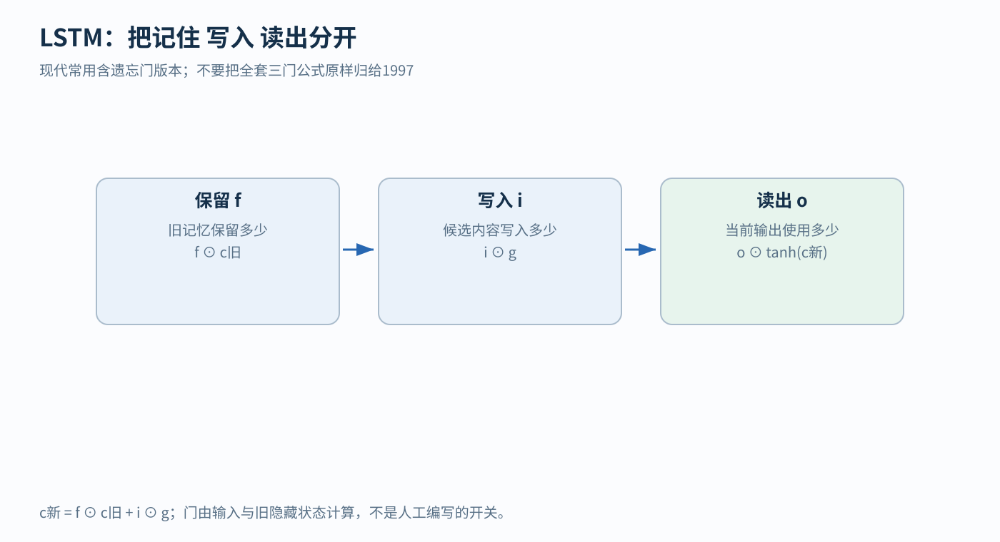
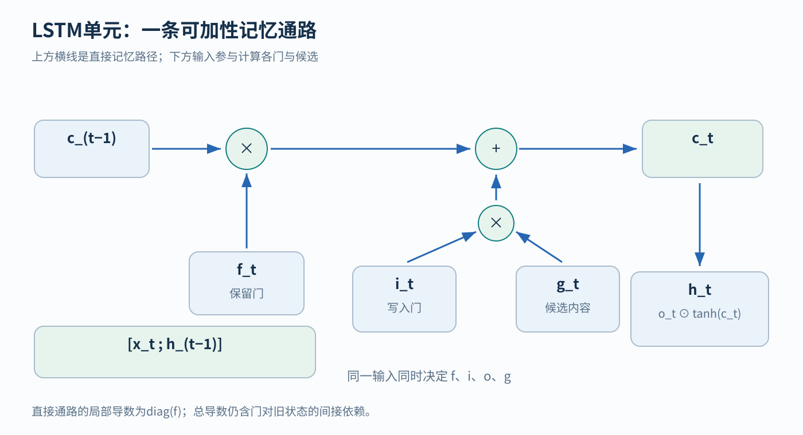
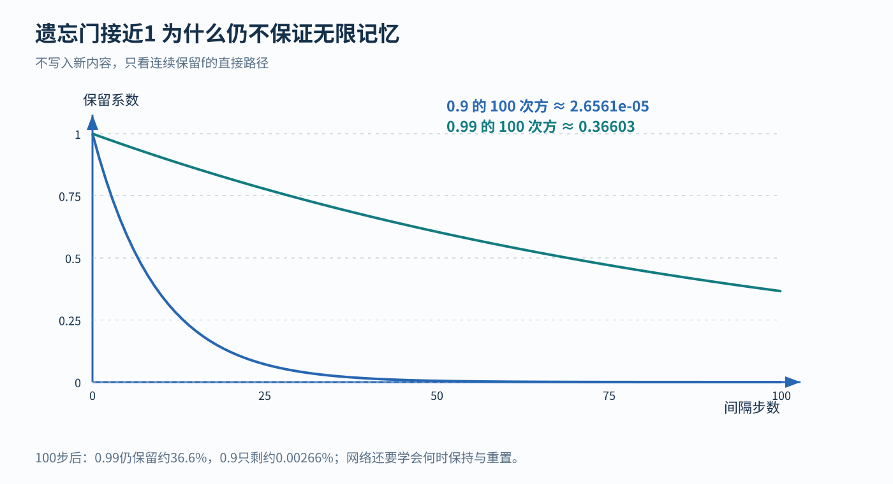

# LSTM 从长期记忆问题到门控更新

## 1 为什么记住一条线索也需要专门设计

假设机器人进入房间时看到一个标志：“这次把箱子送到左边”。随后几十帧里，画面主要是走廊、地板和墙壁。真正到岔路口时，它才需要用到最初的方向。

每帧都来了新信息，但不是每帧都应该改写“这次去左边”。理想的记忆器要能做到三件事：没有相关线索时保留原记录，任务变化时改写记录，需要决策时读出记录。

普通循环神经网络会把旧状态与新输入混合，再经过一次非线性变换。这里的状态是一组保存历史摘要的数，非线性是让网络能表达复杂关系的弯曲函数。这种更新很灵活，却让一条线索要穿过很多次变换。早期信息可能逐渐变弱，训练时“当初应该记住它”的反馈也可能难以传回去。

LSTM，即长短期记忆网络，仍然按时间递推，但增加了一条更便于保留的记忆通路，并学习何时保留、写入和读出。[1][2]

先把“门”理解成 0 到 1 之间的比例：乘 0 就不让这部分通过，乘 1 就完全通过，乘 0.3 就通过三成。真实门值由网络根据当前输入和状态算出来。

**怎样读这张图？** 左边的 f 控制旧记忆，中央的 i 控制候选新内容，右边的 o 控制从新记忆读出的内容。底部的等式说：新记忆由“保留的旧内容”加“允许写入的新内容”组成。图示是现代常见的含遗忘门版本，遗忘门的来历见第 6 节。

## 2 先用一个数字把三种门算清楚

暂时只保存一个数 c。c 可以理解成某条任务线索的内部记录，但正负号对应什么，是我们为例子约定的；实际网络不一定这么编码。

旧记忆为 c_old=0.7。我们先直接给门指定数值，之后再解释门怎么学习。

### 情况一 没有值得写入的新内容

设保留比例 f=0.99，写入比例 i=0。候选新内容 g 无论是什么，本次都不写进去：

c_new = f×c_old + i×g

c_new = 0.99×0.7 + 0×g = 0.693

注意 f 虽然被称为 forget gate，即遗忘门，但数值越大，保留越多。f=0.99 是保留 99%，不是忘掉 99%。

### 情况二 出现新任务需要改写

现在收到相反方向的指令。设 f=0.1、i=0.9、候选 g=−0.6：

旧内容剩下：0.1×0.7=0.07

新写入内容：0.9×(−0.6)=−0.54

合并：c_new=0.07−0.54=−0.47

同一条记忆通路，在不同输入下可以选择缓慢保持，也可以迅速改写。这里的 f 与 i 是两个独立的门，各自取值，两者之和可以不等于 1。本例恰好 f+i=1，第 6 节会看到，GRU 和 Mamba 的门控形式正是把两者绑定成 1−g 与 g。

### 情况三 记住了却暂时不输出

LSTM 通常还有另一个状态 h，作为当前向外提供的表示。它由：

h = o×tanh(c_new)

算出。tanh 把数平滑压到 −1 与 1 之间。若 c_new=−0.47，则 tanh(c_new)≈−0.4382；再设输出门 o=0.8，得到 h≈−0.3506。

如果 o 很接近 0，h 可以很小，但 c 仍然保存着 −0.47。也就是说，暂时少读出来时，内部记忆仍然完整保留。

这里已经出现 LSTM 最容易混淆的一对量：

- c_t：记忆状态，负责沿时间传递内部内容
- h_t：隐藏输出状态，参与当前输出，也会参与下一步门的计算

两者通常维度相同，但数值与用途不同。部署时两个状态都要保存并传给下一步。

## 3 门值从哪里来

刚才是我们给 f、i、o 赋值。真正的网络要根据“现在看到什么”和“之前处于什么状态”自行产生门值。

设当前输入 x_t 有 m 个数，上一步 h_(t−1) 有 d 个数。把两组数接在一起：

u_t = [x_t ; h_(t−1)]

方括号中的分号表示拼接。如果 x_t 有 3 维、h_(t−1) 有 4 维，u_t 就有 7 维，两组数原样排在一起。

一扇门先计算加权总和，再经过 sigmoid：

f_t = sigmoid(W_f u_t + b_f)

sigmoid(a)=1/(1+exp(−a))。exp 表示指数函数。它把任意实数变成 0 与 1 之间的比例。例如 a=0 得 0.5，a≈2.197 得 0.9，a≈4.595 得 0.99。

每一个门都有自己的权重和偏置，因此相同 u_t 可以同时产生“多保留”“少写入”“适当输出”三个不同决定：

f_t = sigmoid(W_f u_t + b_f)

i_t = sigmoid(W_i u_t + b_i)

o_t = sigmoid(W_o u_t + b_o)

候选内容 g_t 不该限制在非负比例内，因为有时需要写入负数，所以通常用 tanh：

g_t = tanh(W_g u_t + b_g)

最后更新：

c_t = f_t ⊙ c_(t−1) + i_t ⊙ g_t

h_t = o_t ⊙ tanh(c_t)

符号 ⊙ 表示对应位置相乘。若 f=[0.9,0.2]，旧记忆 c=[2,5]，则 f⊙c=[1.8,1]。每个记忆维度都有自己的保留比例。

四组矩阵 W_f、W_i、W_o、W_g 的形状均为 d×(m+d)，各有 d 维偏置。这里介绍的是常见无 peephole 版本；peephole 变体会让门额外直接看记忆状态，不同软件的实现可能在这一点上不同。

### 一个小型网络到底有多少参数

输入 m=3、隐藏维度 d=4 时，拼接输入有 7 维。一组门或候选计算需要：

4×7+4=32 个参数

共有三组门与一组候选，得到 4×32=128 个参数，不含后续输出层。这个计数采用每组一个合并偏置；有些实现把输入和循环偏置分开保存，报告的参数数目会不同。

普通 RNN 在相同 m、d 下，状态更新部分只需要 4×3+4×4+4=32 个参数。因此隐藏维度相同时，LSTM 的状态更新参数是普通 RNN 的 4 倍。

**怎样读单元图？** 从左上角的旧 c 开始，先经过乘号，由 f 决定保留多少；再到加号，把 i 与 g 相乘得到的写入内容加进来；右上角是新 c。下方的 [x_t;h_(t−1)] 为各门和候选提供信息。h_t 从新 c 经 tanh 和输出门得到。图上的叉号表示乘法，加号表示两条通路相加。

## 4 这为什么能帮助学习长期依赖

“保留旧记忆，再加一点新内容”在前向计算上容易理解。LSTM 的另一层关键动机在训练：让后面的错误能够沿一条较直接的路径影响前面的记忆。[1]

先把所有门暂时当作已给定的数，并只看直接的 c 通路：

c_t = f_t c_(t−1) + 其他项

旧记忆稍微变动 δ，下一步直接变动 f_tδ。这里 δ 只是一个很小的变化量。因此沿这条路径的导数是 f_t。若 f_t 接近 1，变化就比较容易保持。

连续多步，直接保留系数为：

f_(t+1) × f_(t+2) × … × f_T

若每一步 f 都相同，便是 f^(T−t)。这让我们能把“比较容易保持”量化成一个具体的数。

以不写入新内容、初始 c_0=1 为例：

- f=0.9，100 步后为 0.9^100≈0.0000266
- f=0.99，100 步后为 0.99^100≈0.366
- f=1 的理想极限下，直接通路保持不变

sigmoid 在有限输入下通常不会恰好输出 1，因此实际只能靠近这个极限。即使 0.99 看着很接近 1，持续 100 步也只剩约 36.6%。

**怎样读图？** 横轴是没有新写入时走过多少步，纵轴是旧内容的直接保留系数。两条曲线说明：每一步只差一点，长期累计可以差很多。图中用的是固定门值的受控例子。

更严谨地说，多维直接通路的局部导数是 diag(f_t)，即把各分量的 f 放在对角线上。这是直接通路的导数；完整网络的总导数还包括间接路径：门值依赖 h_(t−1)，而 h 又和旧 c 有关。输出门、非线性和损失的连接同样可能使学习困难。

对照 [RNN](12-rnn.md) 第 5 节：普通 RNN 每一步的导数是 diag(1−h_t²)W_h，要连乘一个满矩阵；LSTM 的直接通路每一步只乘一个对角矩阵 diag(f_t)，而且 f_t 由网络学习，可以停在接近 1 的位置。因此结论是：LSTM 提供了较容易保持状态和梯度的路径，改善长期依赖的可学习性（它不保证无限记忆）。

## 5 网络怎样学会开门和关门

训练时，门通常没有单独的“正确门值”标签。我们给的是任务答案，例如末尾应该向左、下一个词是什么、下一步速度多少。

预测与答案的差异形成损失。沿时间的反向传播，也就是 BPTT，会计算改变某组门参数怎样影响最终损失。假如早先关掉写入门导致漏记任务线索，后面的错误可以通过计算路径推动相关参数改变。

模型要在数据中反复遇到相关规律，优化过程才能找到合适的门控行为。训练出来的门，与我们人为赋予的“保留”“写入”等自然语言含义，可能只是大致对应。

推理时通常固定所有 W 和 b，只随输入更新 h_t、c_t。开始一次独立任务时如何初始化这两个状态、结束后何时清空，都应与训练设定一致。

例如两段日志来自不同房间，中间没有连续关系，却直接把第一段末状态传给第二段，可能让模型利用本不该存在的信息。评估时还要避免先看完整未来序列，再声称是实时在线预测。

## 6 遗忘门的来历，以及它在 GRU 与 Mamba 中的样子

### 6.1 1997 年的 LSTM 与 2000 年的遗忘门

Hochreiter 与 Schmidhuber 在 1997 年提出 LSTM 时，重点之一是保护跨较长时间间隔的误差传播，并用门控制对记忆单元的访问。这是原论文明确讨论的问题。[1]

今天常画的三门形式还包括后来加入的遗忘门。Gers 等《Learning to Forget》的 2000 年期刊论文讨论持续输入流中的状态重置，加入可学习的遗忘机制。本章完整的 f、i、o 公式，是 1997 年结构加上 2000 年遗忘门之后的形式。[2]

### 6.2 门控更新与 Kalman 更新的形式相同

`[结构]` 一维 Kalman 滤波（观测直接测量状态时）的更新是 x̂_new=x̂_old+K(z−x̂_old)=(1−K)x̂_old+Kz：旧估计保留 1−K，新观测 z 写入 K。把 K 换成门值 g、z 换成候选内容，就是“保留旧记录、写入新内容”的门控更新。两者的区别在于 K 的来源：Kalman 增益由噪声协方差算出，LSTM 的门由数据训练得到。

### 6.3 GRU：把保留和写入绑在一起

Cho 等 2014 年在编码器–解码器翻译模型中提出了一种更简单的门控单元，后来称为 GRU。它只有一个状态 h，更新写作：[3]

h_t = z_t ⊙ h_(t−1) + (1−z_t) ⊙ h̃_t

z_t 是更新门，h̃_t 是候选新状态（它的计算里还有一个重置门 r_t，决定候选内容参考多少旧状态）。和 LSTM 对照：GRU 让“保留比例”和“写入比例”相加恒为 1，相当于 f_t=z_t、i_t=1−z_t；它也不再区分 c 与 h。这是另一种容量与计算成本的折中，比较优劣要在相同任务、合理预算和一致训练条件下进行。

### 6.4 Mamba 的选择机制在特例下就是门控 RNN

`[结构]` Mamba（Gu 与 Dao 2023，一种让状态空间模型参数随输入变化的序列模型，见 [SSM、GNN 与 MoE](18-ssm-gnn-moe.md) 第 2 节）的论文第 3.5.1 节给出定理 1：取状态维度 N=1、A=−1、B=1，步长 Δ_t=softplus(Linear(x_t))，选择性 SSM 的递推就变成[4]

g_t = σ(Linear(x_t))，h_t = (1−g_t)h_(t−1) + g_t x_t

σ 就是第 3 节的 sigmoid。推导只有两步（论文附录 C）。softplus(a)=log(1+e^a)，所以离散化后的保留系数 exp(−Δ_t)=1/(1+e^a)=1−σ(a)；零阶保持离散化给出的输入系数恰好是 1−exp(−Δ_t)=σ(a)。

这正是第 2 节的门控更新：遗忘门 f_t=1−g_t，写入门 i_t=g_t，候选内容就是输入 x_t。用第 2 节情况二的数字核对：f=0.1、i=0.9 相当于 g_t=0.9，对应 Linear(x_t)≈2.197；旧记忆 0.7、新内容 −0.6，得到 0.1×0.7+0.9×(−0.6)=−0.47，与 LSTM 的结果相同。

两者的关键差别在门依赖什么。LSTM 和 GRU 的门由 [x_t;h_(t−1)] 算出，门值依赖旧状态；Mamba 的 Δ、B、C 只由当前输入 x_t 算出。于是 Mamba 的递推对状态 h 是线性的（系数随时间变化），可以用并行 scan 训练；LSTM 只能逐步计算。一般情形下 Mamba 每个通道还有 N 个状态和对角矩阵 A，相当于同时拥有多条不同衰减速度的遗忘通路。

`[经验]` Mamba 论文的消融（表 7）显示，在 Δ、B、C 三个可选择参数中，让 Δ 随输入变化最重要，作者把原因归于 Δ 与 RNN 门控的这层联系。[4]

`[历史]` Mamba 作者明确说明，定理 1 推广了 Gu 等 2021 年的一个引理，并沿用了 Funahashi 与 Nakamura（1993）、Tallec 与 Ollivier（2018）把 RNN 门控与连续时间系统离散化联系起来的观点：他们把离散化看作启发式门控机制的原理性基础。[4]

## 7 何时值得用以及还需要检查什么

如果需要在线处理传感流，重要线索持续多久不固定，又希望只维护有限大小的状态，LSTM 是自然候选。

但它仍需顺序更新，状态容量有限，比同隐藏维度的简单 RNN 也更贵。对特别长的历史精确检索，固定状态可能成为瓶颈；提高维度和改进训练并不免费。

用于机器人时，隐藏状态能承载任务信息或未建模动态。物理状态估计与不确定性保证需要额外的结构或验证。要分别检查实时延迟、场景切换、传感缺失、状态重置，以及训练分布之外的行为。

## 8 带着机制去读论文

### 1997 年论文中的受保护记忆路径

先找论文试图解决的长期误差传播问题，再看记忆单元的自连接和输入、输出门。分别画出前向状态如何走、反向误差如何走。先按原图读，再与本章的现代 f 门公式对照。读完应能解释：如果每一步都要无条件重写整个状态，为什么长间隔任务会更难训练。[1]

### Learning to Forget 中为什么需要主动遗忘

先看持续序列与人为指定重置边界的区别，再看新增门如何让网络自主保留或释放内容。用本章 0.7→0.693 与 0.7→−0.47 两次计算，分别对应“维持”和“改写”。论文提出门的动机，比只背名称更重要。[2]

### GRU 所在的编码器解码器工作

读到门控单元时，标清状态、候选与门的关系，再与本章第 6.3 节逐项对照。公式中哪一个系数代表保留，要看作者的具体约定：Cho 等把 z 放在旧状态一侧，Mamba 定理 1 把 g 放在新输入一侧。最后比较参数和运行成本。[3]

### Mamba 第 3.5 节与附录 C

先读定理 1 的条件，再按本章第 6.4 节自己推一遍 exp(−softplus(a))=1−σ(a)。然后读第 3.5.2 节对 Δ 的解释：Δ 大时重置状态、关注当前输入，Δ 小时保留状态、忽略当前输入。读完应能说出它与遗忘门的对应，以及门只依赖 x_t 带来的并行计算好处。[4]

## 9 自测与最小实验

**一。** c_old=0.7，f=0.1，i=0.9，g=−0.6，新记忆是多少？

先得保留 0.07，再得写入 −0.54，合并为 −0.47。不要把 i 当成待写入内容本身。

**二。** 如果输出门很小，内部记忆是否一定清零？

不是。输出门主要控制 h 的读出；c 是否保留，取决于更新式中的 f、i、g。

**三。** f=0.99 连续 100 步等于保留 99% 吗？

不是。总保留系数是 0.99^100≈36.6%，而不是单步的 99%。

最小实验可设为延迟复制：开头给一个标记，隔一段无关输入后要求复述。逐步增加间隔，比较 RNN、LSTM、GRU。做两组公平性不同的比较：一组隐藏维度相同，另一组总参数接近。分别记录准确率、训练速度和推理延迟。只看某一次测试分数，无法判断改进来自门控设计还是更多参数。

## 与其他概念的关系

- `[结构]` **普通 RNN**：RNN 的梯度每步乘满矩阵 diag(1−h_t²)W_h；LSTM 的直接记忆通路每步只乘可学习的对角矩阵 diag(f_t)（第 4 节）。见 [RNN](12-rnn.md) 第 5、7 节。
- `[结构]` `[经验]` **Mamba 的选择机制**：Mamba 定理 1 表明，选择性 SSM 在 N=1、A=−1、B=1 时就是 f_t=1−g_t、i_t=g_t 的门控 RNN；消融显示 Δ 是最重要的选择参数（第 6.4 节）。见 [SSM、GNN 与 MoE](18-ssm-gnn-moe.md) 第 2.3 节。
- `[结构]` **GRU**：GRU 的 z_t 与 1−z_t 是“遗忘门与写入门之和恒为 1”的特例，与 Mamba 定理 1 的形式相同（第 6.3、6.4 节）。从状态方程到 RNN、LSTM、SSM、Mamba 与线性注意力的整条谱系，见 [递推状态谱系](../relations/recurrent-state.md)。
- `[结构]` **Kalman 更新**：一维 Kalman 更新 (1−K)x̂+Kz 与门控更新形式相同，区别在于增益由协方差算出还是由数据学出（第 6.2 节）。状态空间形式与 Kalman 的关系见 [SSM、GNN 与 MoE](18-ssm-gnn-moe.md) 第 2.4 节。
- `[历史]` **Highway Network 与 ResNet**：Srivastava 等 2015 年的 Highway Network 在摘要中明确说，它的门控机制受 LSTM 启发，目的是让信息跨很多层而不衰减。[5] ResNet 去掉了门，保留恒等路径 y=x+F(x)，这条路径的导数恒为单位阵，作用与 LSTM 中 f=1 的直接通路相同（`[结构]`）。ResNet 见 [CNN](11-cnn.md)。

## 参考资料与继续阅读

[1] Hochreiter, S., & Schmidhuber, J. (1997). Long Short-Term Memory. Neural Computation, 9(8), 1735–1780. https://direct.mit.edu/neco/article/9/8/1735/6109/Long-Short-Term-Memory

[2] Gers, F. A., Schmidhuber, J., & Cummins, F. (2000). Learning to Forget: Continual Prediction with LSTM. https://pubmed.ncbi.nlm.nih.gov/11032042/

[3] Cho, K., et al. (2014). Learning Phrase Representations using RNN Encoder–Decoder for Statistical Machine Translation. https://arxiv.org/abs/1406.1078

[4] Gu, A., & Dao, T. (2023). Mamba: Linear-Time Sequence Modeling with Selective State Spaces. 第 3.5 节、附录 C、表 7。https://arxiv.org/abs/2312.00752 ；库内精读 [Mamba](../../llm/papers/mamba/reading.md)

[5] Srivastava, R. K., Greff, K., & Schmidhuber, J. (2015). Highway Networks. https://arxiv.org/abs/1505.00387

## 批注

**易误读**
- 第 1 节的示意图是含遗忘门的现代版本；1997 年原论文没有遗忘门（第 6.1 节）。
- “像一本可以保留、擦写、翻阅的笔记本”是本章的教学类比，不是这项研究的历史来源。
- 门控更新与 Kalman 更新形式相同，但由此推出“i_t 就是 Kalman 增益”或“门值带有不确定性含义”，是错误推论：门值没有经过协方差计算（第 6.2 节）。
- 第 4 节保留曲线用的是固定门值，不是任何 LSTM 的实测记忆寿命。
- Mamba 定理 1 只覆盖 N=1 的特例；一般的 Mamba 层有多维状态和读出矩阵 C，与 LSTM 不是逐项相同。

**与其他论文的关联**
- GRU 与 Mamba 定理 1 都把遗忘与写入绑定为互补的一对；LSTM 的两个门各自独立。三者的对照见 [递推状态谱系](../relations/recurrent-state.md)。
- Mamba 在附录相关工作中把 QRNN、SRU 等“递推里没有时间方向非线性的门控 RNN”看作选择性 SSM 的特例，见 [4] 附录 B.3。

**未核实 / 待验证**
- Highway Network 的期刊/会议正式版（NeurIPS 2015 的 *Training Very Deep Networks*）本轮未打开核对，正文只引用 2015 年 arXiv 版摘要。

[学习导航](00-learning-navigation.md) · [架构模块地图](01-architectures.md)
