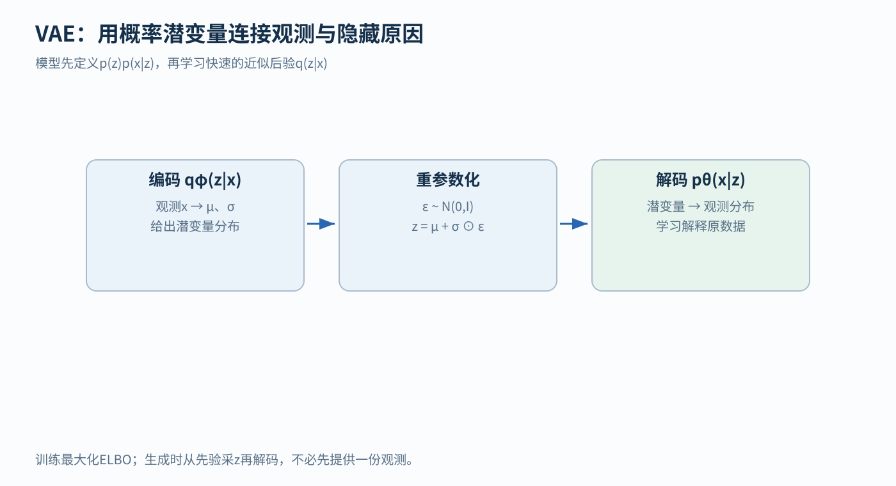
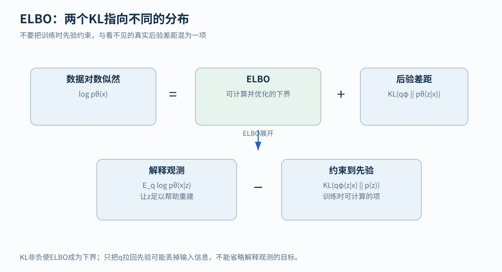
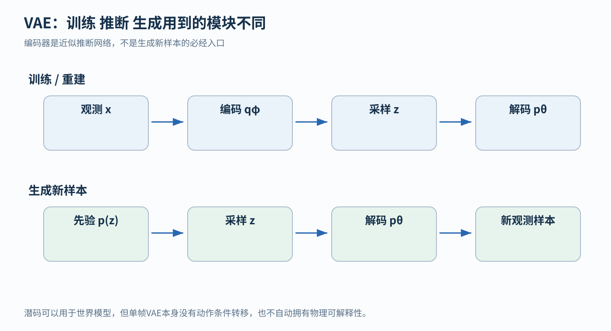

# VAE 从隐藏原因到可训练的生成模型

## 1 先问一个比压缩图片更具体的问题

假设我们收集了很多人写的数字“2”。它们都属于同一类，却有的向左倾、有的向右倾，有的笔画粗、有的笔画细。我们不仅想识别这些图片，还想生成一张新的、看起来合理的“2”。

最直接的想法是：能不能先决定一些隐藏因素，例如倾斜和粗细，再根据这些因素画出图像？

我们把看得到的图片叫 x，把看不到、需要模型引入的变量叫 z。z 叫潜变量，“潜”只是说它没有直接作为观测给出来。它是一组数；倾角、粗细只是帮助想象的例子，每个数的含义由训练决定。

这带来两个相反方向的问题：

- 生成：给定 z，怎样产生可能的图片 x
- 推断：看到图片 x，怎样判断哪些 z 比较可能解释它

VAE，即变分自编码器，把这两个方向一起训练。它的外形是“编码再解码”；要理解它为什么能生成新样本，需要先理解它定义的概率模型。[1][2]

本章会从一个只有两种隐藏原因的小例子开始。公式是把这两个问题写清楚的工具。

## 2 先验和后验到底相差在哪里

暂时不画整张图，只观察“这个像素是深色还是浅色”。设隐藏原因 z 有两种：细笔画、粗笔画。

我们先规定一个教学用模型：

- 随机选择粗、细笔画的概率各是 0.5
- 若选了粗笔画，这个像素为深色的概率是 0.8
- 若选了细笔画，这个像素为深色的概率是 0.2

第一组概率是在没看到图片之前对 z 的规定，叫先验 p(z)。后两组是在给定 z 时产生观测的概率，记为 p(x|z)。竖线可以读作“在已知右边条件下”。

那么随机生成一个深色像素的总概率是多少？

来自粗笔画的部分是 0.5×0.8=0.4，来自细笔画的部分是 0.5×0.2=0.1。两种情况相加，得到：

p(深色)=0.4+0.1=0.5

现在反过来，已经看到了深色，粗笔画原因占这些深色结果的多少？

p(粗笔画|深色)=0.4/0.5=0.8

同理，细笔画的后验概率是 0.2。**先验是观察前的分布，后验是观察后按证据更新的分布。** 后验给出的是一个分布：深色像素仍有可能来自细笔画。

一般地，把生成模型写成：

p_θ(x,z)=p(z)p_θ(x|z)

θ 是生成模型的参数，例如神经网络里的权重。联合分布 p_θ(x,z) 描述 x 与 z 一起出现的规律；它由先选 z、再生成 x 两步组成。

要算单独的 p_θ(x)，必须把各种可能的 z 都考虑进去。若 z 连续，就用积分代替刚才的两项求和：

p_θ(x)=∫ p(z)p_θ(x|z) dz

积分可以先理解为“把所有隐藏原因对这个观测的贡献加起来”。在复杂神经网络中，这个总和通常不能便宜、精确地算出。而真实后验：

p_θ(z|x)=p(z)p_θ(x|z)/p_θ(x)

又需要这个分母，于是推断也变难了。

这里 p 对离散变量表示概率，对连续变量通常表示概率密度。连续密度的某一个值不等于“恰好取这个数的概率”，也不必限制在 0 到 1；后面的对数密度公式要按这个区别理解。

## 3 用一个网络给出近似答案

既然每张图片都单独求精确后验很难，我们训练一个编码器 q_φ(z|x)，直接根据图片给出一个容易计算的近似分布。

φ 是编码器的参数，与生成模型参数 θ 是两组不同的数。q 是我们选择并训练的近似分布，与先验 p(z)、真实后验 p_θ(z|x) 是三个不同的对象。

一个常用选择是高斯分布：

q_φ(z|x)=N(μ_φ(x), diag(σ_φ²(x)))

先逐个读符号：

- N 表示高斯分布，也叫正态分布
- μ 是均值，表示分布中心在哪里
- σ 是标准差，表示随机结果在中心附近散得多开
- σ² 是方差，不要与 σ 混用
- diag 表示把各维方差放在对角线上，这个近似没有直接表示各维之间的相关性

若图片是 28×28 灰度图，展平后 x 有 784 个数；若潜变量选 2 维，编码器输出的不是一个二维点，而是两个均值与两个标准差，共四个数。随后才从这个分布里抽一个二维 z。

解码器拿到 z，输出图片的概率分布参数。例如可以输出 784 个像素的均值；若观测方差固定，这些均值与固定方差共同定义像素分布。显示图像时常把均值当作重建结果，但“输出分布”与“显示一张均值图片”要区分。

**怎样读图？** 从左到右，编码器把观测变成 μ、σ，中央从中产生 z，右边据 z 解释观测。下方强调训练目标。图中 ε 与重参数化稍后会逐步计算。

## 4 为什么损失里会同时出现重建和 KL

我们希望训练后的模型认为真实数据比较合理，即让数据的对数似然 log p_θ(x) 变大。log 是自然对数；取对数把很多概率相乘变成相加，便于优化。

但是刚才说过，p_θ(x) 往往难算。VAE 转而优化一个能估计的下界，叫 ELBO，即 evidence lower bound。

先认识 KL 散度。对于两个分布 q、p：

KL(q||p)=E_q[log q(z)−log p(z)]

E_q 表示“按 q 抽样后取平均”。离散情况下就是把每种 z 的值按 q 的概率加权；连续情况用积分。KL 衡量两分布的差异，非负；两者相同时为 0。它一般不对称，不是普通几何距离。

现在只做几步代数。先用真实后验作为右边分布：

KL(q_φ(z|x)||p_θ(z|x))
= E_q[log q_φ(z|x)−log p_θ(z|x)]

代入贝叶斯公式中的后验，再把乘除变为对数的加减：

= E_q[log q_φ(z|x)−log p(z)−log p_θ(x|z)+log p_θ(x)]

固定这张 x 时，log p_θ(x) 与抽到哪个 z 无关，可以拿到平均号外面。整理：

log p_θ(x)
= E_q[log p_θ(x|z)] − KL(q_φ(z|x)||p(z))
+ KL(q_φ(z|x)||p_θ(z|x))

前两项合起来定义为：

ELBO(x)=E_q[log p_θ(x|z)]−KL(q_φ(z|x)||p(z))

因此：

log p_θ(x)=ELBO(x)+非负的后验差距

所以 ELBO 不超过 log p_θ(x)。它是由上面几步代数推出来的下界，重建项和 KL 项都来自这个推导。[1]

两个 KL 容易看混：

- 训练目标中的 KL 对准先验 p(z)，常能直接计算
- 等式余项中的 KL 对准真实后验 p_θ(z|x)，一般不能直接计算

后者解释下界还差多少，训练时并不计算它。

最大化 ELBO 等价于最小化它的负数：

负 ELBO = 重建负对数似然 + 对先验的 KL

第一项要求抽到的潜变量有助于解释图片；第二项约束编码分布与我们选的先验之间的关系。只最小化第二项，所有图片都可以得到同一个先验分布，输入信息可能全丢了。

**怎样读图？** 先读上排“数据对数似然=ELBO+后验差距”，看清后验差距为什么非负。再读下排，把 ELBO 展开成解释观测的项减去对先验的 KL。两处 KL 的右边分别是后验、先验。

### 用两种笔画的例子核对这个下界

刚才看到深色后，真实后验是“粗 0.8、细 0.2”。假设近似 q 暂时给出“粗 0.7、细 0.3”。

平均解释观测的项为：

0.7log(0.8)+0.3log(0.2)≈−0.6390

q 对先验 [0.5,0.5] 的 KL 为：

0.7log(0.7/0.5)+0.3log(0.3/0.5)≈0.0823

所以 ELBO≈−0.6390−0.0823=−0.7213。

真实 log p(深色)=log(0.5)≈−0.6931，比下界高约 0.0282。这一差额正是 q=[0.7,0.3] 与真实后验 [0.8,0.2] 的 KL。

这个小例子只为核对公式。它说明：负数也有大小，−0.7213 的确低于 −0.6931。

## 5 抽样为什么还能反向传播

编码器输出一个分布，接下来要随机抽 z。若把抽样当作一个不透明按钮，普通自动求导很难知道“把均值改一点，输出会怎样变化”。

高斯分布有一个简单改写：

先抽 ε~N(0,I)

再计算 z=μ+σ⊙ε

ε 是与网络参数无关的标准高斯噪声；I 表示单位协方差，各维方差为 1、彼此独立。⊙ 是逐分量相乘。这种改写叫重参数化：把随机来源单独放到 ε，把 μ、σ 对结果的影响变成明确的可微运算。[1][2]

一维例子：μ=1，σ=0.5，这次抽到 ε=−0.4，则：

z=1+0.5×(−0.4)=0.8

对同一次固定 ε 而言，μ 增加 0.01，z 就增加 0.01；σ 增加 0.01，z 则减少 0.004。因此：

∂z/∂μ=1，∂z/∂σ=ε=−0.4

随机性仍在 ε 里，网络参数影响随机结果的路径变得明确了。重新抽一个 ε 会得到另一个 z。

实现时常输出 ℓ=log σ²，再令 σ=exp(ℓ/2)，这样标准差始终为正。“输出 log 方差”是对同一分布参数换一种数值表示。

## 6 把一条训练数据从头走到底

再做一个人为简化的一维算例。真实观测 x=2，先验 p(z)=N(0,1)。编码器暂时给 q=N(1,0.25)，注意方差 0.25 对应标准差 0.5。

1. 抽 ε=−0.4，得到 z=0.8
2. 假设这个教学解码器输出的均值是 2z，因此为 1.6
3. 假设观测分布方差固定为 1，那么此样本的负对数似然为 (2−1.6)²/2+log(2π)/2≈0.9989
4. 计算 q 对标准正态先验的 KL
5. 两项合起来，反向传播到编码器和解码器参数

第 4 步可用高斯的闭式公式：

KL=0.5(μ²+σ²−1−log σ²)

代入 μ=1、σ²=0.25：

KL=0.5(1+0.25−1−log 0.25)≈0.8181

因此本次抽样得到的负 ELBO 估计约为 1.8171（使用未四舍五入的两项相加）。它是一次随机抽样的估计；多次或多样本平均会降低估计噪声。

这里解码器均值写成 2z 只是为了手算。真正模型用神经网络学习这个映射，像素分布也不必固定采用方差为 1 的高斯。

## 7 重建和生成新样本走哪条路

**重建已有图片：** 输入图片 x，编码得到 q(z|x)，从中采 z，再解码得到图片分布。若用均值 z=μ 代替抽样，得到的是一个常用的确定性展示方式，要说明这与训练抽样不同。

**生成新图片：** 没有输入原图，直接从先验 p(z) 抽 z，再让解码器生成 x。此时不必经过编码器。

**提取表示：** 给定 x，使用编码分布参数或样本作下游特征，具体用哪种要按任务选择。

**怎样读图？** 上排从观测开始，有编码器；下排从先验开始，没有原图和编码器。两排共享解码器。必须先给原图片才能开始的流程，做的是重建或条件生成。

KL 项使编码分布受到先验约束，有助于让训练时见到的潜变量区域与生成时采样的区域衔接。有限数据、有限模型和优化误差仍可能让部分潜码生成质量较差。

## 8 潜变量怎样被使用，以及几种常见失败

潜空间各维的含义由训练目标决定。神经网络只需找到有助于目标的编码，没有额外约束时，同一信息可以分散在多个方向，也可能换一种坐标表示。

若解码器足够强，它可能几乎不使用 z；编码器又被 KL 拉向先验，形成潜变量使用不足甚至后验坍塌。此时重建可能不错，潜变量却没有被用上。应同时检查重建、KL、改变 z 是否改变输出。

简单像素高斯模型可能在多种合理结果之间偏向平均，产生模糊感。模糊程度还受解码器能力、似然设定与训练方法影响。

若把 KL 乘上一个系数 β，就改变了重建与 KL 之间的权衡。β=1 对应这里推导的标准 ELBO；其他 β 对应的是改动后的目标，需要另行说明。

VAE 的背景包括潜变量概率模型和变分推断。Kingma 与 Welling 的 AEVB 工作在 2013 年发布预印本，随后进入 2014 年会议；Rezende 等同期研究随机反向传播与近似推断。两者的重点都是让生成模型和快速后验近似能一起学习。[1][2]

SLAM 也会从观测推断隐藏状态，其中的几何状态有明确的物理含义；VAE 潜变量的含义由训练塑造。单帧 VAE 只描述一次观测；做世界模型时，要再学习潜变量怎样随动作和时间变化，见文末“与其他概念的关系”中的 DreamerV3。

## 9 论文精读与自测

读 AEVB 时，先在图 1 中区分生成方向与近似推断方向，再读第 2.2 节的下界、第 2.4 节的重参数化、第 3 节的 VAE 实例。把 θ、φ、z 标成三种角色：生成参数、推断参数、每个样本的随机变量。最后亲手重做一次本章两种笔画的 KL 等式，确认两个 KL 指向哪里。[1]

读 Rezende 等的工作时，关注怎样让随机变量路径上的梯度计算变得可行，以及推断模型与生成模型怎样联合优化。把两篇工作的相似机制与具体实现差异分开记录。[2]

**如果 μ=0、σ=1，KL 为什么是 0？** 因为近似分布与标准正态先验相同。但如果每张图片都这样编码，z 可能不再携带区分图片的信息，所以只压低 KL 不够。

**生成新样本需要先提供一张原图吗？** 不需要，从先验采 z 再解码即可。

**二维潜变量的高斯编码器输出两个数够吗？** 若均值和各维方差都由输入决定，需要两组共四个数；若固定方差则是另一种设定。

最小实验是固定数据与网络，只改变 KL 权重，分别记录重建负对数似然、KL、先验生成效果和潜变量扰动效果。各项要分开看：总损失相近时，模型可能以完全不同的方式使用潜变量。

## 10 2025–2026 延伸：潜空间还可以怎样设计

学完 ELBO 后，可以把两个决定分开：怎样把图片变成潜变量，怎样在潜空间里生成新样本。Latent Diffusion 让自编码器先承担压缩；后续研究开始检查，这个编码器需要优先保留像素细节，还是也要组织出有语义的表示。

**第一篇读 [RAE（2025）](../../multimodal/papers/arxiv-2510.11690/README.md)。** RAE（表示自编码器）固定一个已经学过视觉表示的编码器，训练解码器把特征还原成图片，再在这些特征上训练扩散或流模型。相对本章的 VAE，它把潜空间的形成交给已有表示学习；相对原始潜空间扩散，它提出高维语义特征也可用来生成。论文先检查重建，再检查高维特征上生成模型的宽度、噪声调度与生成质量，证据起点是 ImageNet 类别条件生成。优先读 §3–4，画出“编码器固定、解码器训练、生成模型另行训练”三部分。

**第二篇读 [Scaling Text-to-Image RAE（2026）](../../multimodal/papers/arxiv-2601.16208/README.md)。** 上一篇留下的是迁移问题：类别条件图像实验里的设计，在自由文本生成时还需要多少？续篇扩大解码器训练，并对照 RAE 与 FLUX VAE 的潜空间；维度相关的噪声调度仍重要，专用宽输出头的收益却随主干扩大而减弱。优先读 §3 的设计消融，再读 §4 的受控比较：一个设计为何有效，要连同它原先补的是哪个瓶颈一起判断。

**自测。** 若编码器给出一组固定特征 E(x)，解码器能还原图片，是否就已经能从标准正态噪声生成新图片？还需要学习噪声到这组特征分布的生成过程。把它与本章第 7 节的“从 VAE 先验采 z 后解码”并排画出来，能看出自编码器与潜空间生成器各自承担什么。

## 与其他概念的关系

- `[结构]` **扩散模型是编码器固定的多层 VAE**：DDPM 把扩散模型写成潜变量模型 p_θ(x_0)=∫p_θ(x_(0:T))dx_(1:T)，潜变量 x_1…x_T 与数据同维；它与其他潜变量模型的区别，在于近似后验 q(x_(1:T)|x_0) 被固定为逐步加高斯噪声的马尔可夫链（即正向加噪过程），训练优化的仍是本章第 4 节的变分下界。[3] 对照本章：VAE 的编码器 q_φ(z|x) 要学习，扩散模型的“编码器”是预先规定的加噪，只学习解码方向。见 [Diffusion](17-diffusion.md) 第 2–4 节。
- `[结构]` **ELBO 与 EM 算法**：第 4 节的等式 log p_θ(x)=ELBO+KL(q‖p_θ(z|x)) 说明，若把 q 直接取成真实后验，余项为 0，下界变得紧；再固定 q、对 θ 最大化 ELBO。交替这两步就是 EM 算法（一句话：在潜变量模型里交替“推断隐藏原因”和“更新参数”的经典方法）。用两种笔画的例子核对：取 q=[0.8,0.2]（即真实后验），解释观测的项为 0.8log0.8+0.2log0.2≈−0.5004，对先验的 KL 为 0.8log1.6+0.2log0.4≈0.1927，ELBO≈−0.6931，正好等于 log p(深色)。VAE 用编码器一次给出近似后验，代替 EM 中逐个样本求精确后验的那一步。
- `[结构]` `[经验]` **潜变量世界模型**：DreamerV3 的世界模型用编码器 q(z_t|h_t,x_t) 从观测得到随机表示，用动力学预测器 p(z_t|h_t) 充当随时间变化的“先验”，损失由重建等预测项和两者之间的 KL 组成。[4] 这正是本章 ELBO 的“重建项 + 对先验的 KL”，只是先验从固定的 N(0,I) 换成了根据历史与动作预测的分布；DreamerV3 还把 KL 拆成两项、分别加权并设下限（free bits）。论文的消融显示，在它的各项稳健性技巧中，世界模型的 KL 目标影响最大。[4] 见 [DreamerV3](../../multimodal/papers/dreamerv3/README.md) 与 [世界模型](../../robotics-embodied/fields/world-models.md)。
- `[历史]` **Latent Diffusion 的压缩器**：Rombach 等在潜空间里做扩散，所用自编码器的一种正则化是对潜变量施加轻微的、朝向标准正态的 KL 惩罚，作者写明这一做法“与 VAE 类似”。[5] 见 [Diffusion](17-diffusion.md) 第 8 节。

## 参考资料与继续阅读

[1] Kingma, D. P., & Welling, M. (2013/2014). Auto-Encoding Variational Bayes. https://arxiv.org/abs/1312.6114

[2] Rezende, D. J., Mohamed, S., & Wierstra, D. (2014). Stochastic Backpropagation and Approximate Inference in Deep Generative Models. https://proceedings.mlr.press/v32/rezende14.html

[3] Ho, J., Jain, A., & Abbeel, P. (2020). Denoising Diffusion Probabilistic Models. 第 2 节。https://arxiv.org/abs/2006.11239 ；库内精读 [DDPM](../../multimodal/papers/ddpm/README.md)

[4] Hafner, D., Pasukonis, J., Ba, J., & Lillicrap, T. (2023). Mastering Diverse Domains through World Models. 世界模型损失式 (2)(3) 与消融图 6。https://arxiv.org/abs/2301.04104

[5] Rombach, R., et al. (2021/2022). High-Resolution Image Synthesis with Latent Diffusion Models. 第 3.1 节。https://arxiv.org/abs/2112.10752

## 批注

**易误读**
- RAE 的图像生成比较针对具体表示编码器、解码器和训练配方；2026 续篇的等 token 对照还包含 RAE 与 VAE 输入分辨率差异。它们不改变本章 VAE 的概率定义，也不构成所有任务上潜变量方法优劣的结论。
- 潜空间某一维“自动对应姿态、光照”是常见误读；可解释的维度需要额外约束或事后分析（第 8 节）。
- “一切 VAE 都必然模糊”是从像素高斯似然的例子过度推广（第 8 节）。
- 扩散模型是“编码器固定的 VAE”是就训练目标与概率结构而言；两者的网络结构、采样过程和潜变量维度都不同。
- SLAM 与 VAE 都从观测推断隐藏状态，但 VAE 潜变量没有 SLAM 几何状态那样的物理单位保证。

**与其他论文的关联**
- DDPM 的变分下界与本章 ELBO 同源，见 [DDPM](../../multimodal/papers/ddpm/README.md)。
- DreamerV3 把 ELBO 中的固定先验换成学习的动力学预测器，是 VAE 走向世界模型的一步，见 [DreamerV3](../../multimodal/papers/dreamerv3/README.md)。

[学习导航](00-learning-navigation.md) · [架构模块地图](01-architectures.md)
