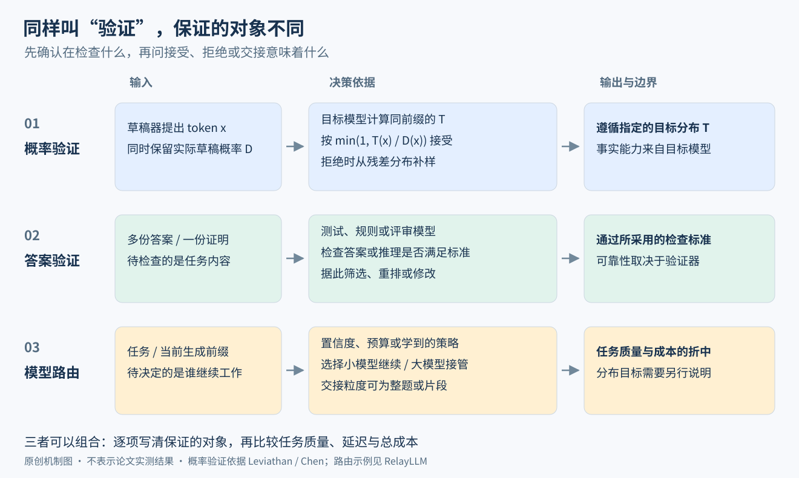

# 推理时计算与解码

> 状态：领域入门页 · v3 · 2026-10-04 · 依据 [synthesis.csv](synthesis.csv)（22 篇）
>
> 速览：
> 1. 本方向研究训练好之后怎样花算力：多写步骤、多次生成再选、搜索与修订，争取答得更对；优化解码与服务，让每个 token 更便宜。
> 2. 2022–2024 年主要靠提示和外部流程增加计算；o1、DeepSeek-R1 与 Kimi k1.5 把长思考训进模型。到 2026 年，预算控制已经包括思考长度、并行路数和验证强度。
> 3. 多算的收益取决于"生成得出"和"挑得出来"。答案或证明验证器判断任务质量；投机解码验证的是 token 概率。两者的保证对象不同。
> 4. `[判断]` 解码效率要同时优化接受长度、草稿耗时、验证成本和等待关系。DFlash 的并行草稿、SSD 的异步执行、V4.1-Flash 的负载感知验证分别处理不同的成本项。
> 5. `[判断]` 公开材料的边界也在变化：gpt-oss 已公开结构、推理档位与格式；DeepSeek-V4 已把长度惩罚用于三档模式。R1 与 k1.5 当年的分歧，应留在历史节点里理解。

本页是[大语言模型](../../README.md)领域的推理时计算方向。怎样用强化学习训练出长思考，在[强化学习方向](../posttraining/rl/README.md)；长上下文怎样获得与评测，在[长上下文方向](../long-context/README.md)；注意力与 KV 缓存的结构改造，在[预训练方向](../pretraining/README.md)问题③与[架构与效率方向](../architecture/README.md)。投机解码的概率机制有一篇带手算的导读：[小模型写草稿，大模型究竟验证什么？](draft-verification-guide.md)

## 这个领域在解决什么

一道 AIME（美国数学邀请赛，答案是 0–999 的整数）题交给一个已经训练好的模型。只让它直接写答案，GPT-4o 平均只做对 12%；让 o1 先在内部写很长的推理再回答，单次 74%，采 64 个答案投票 83%，用学到的打分函数从 1000 个答案里挑 93%（OpenAI o1 博客）。这组历史对比同时改变了模型和采样策略；对同一模型，74%、83%、93% 才展示了不同推理时预算与选择方法的结果。本方向要回答两件事：这些额外的算力怎样花最划算、什么时候花了也没用；以及怎样让每生成一个 token 更便宜，好让这些算力付得起。

做法分两大类五小类：

| 目的 | 做法 | 直觉 | 代表 |
|---|---|---|---|
| 答得更对 | 写出中间步骤 | 把一步跳到答案拆成多步，每步更容易做对 | 思维链（CoT） |
| | 并行：多采样再选 | 同一题答很多遍，正确答案更可能出现在其中；再用投票或验证器挑出来 | 自洽、best-of-N、Large Language Monkeys |
| | 顺序：搜索与修订 | 边写边打分、剪掉差的分支，或在旧答案上改 | PRM 引导的 beam 搜索、修订模型（Snell 等） |
| | 训练出来的长思考 | 用强化学习让模型自己学会反思、回溯、换方法，思考多长由模型决定 | o1、DeepSeek-R1、Kimi k1.5 |
| 算得更快更省 | 解码与服务效率 | 少走串行步数、少搬显存、一张卡同时服务更多请求 | 投机解码、EAGLE-3、vLLM、GQA、KIVI |

图中从左到右依次是输入、决策和保证。概率验证让执行结果遵循指定的目标分布；答案验证依赖测试、规则或评审模型；路由决定把计算交给谁。先定位这三者，再读"验证器""多算"或"大小模型协作"，就能明确论文究竟改变了什么。

## 与预训练、后训练的分工

结论：预训练提供知识与表示的起点，后训练塑造解题和工具使用策略，推理时计算分配这一次的预算；三者共同影响可达性能。下面的实验给出特定模型、任务和预算下的比较。

| 阶段 | 对推理时计算意味着什么 | 证据 |
|---|---|---|
| 预训练 | 题目太难时，多想也补不回来 | Snell 等第 7 节：在 FLOPs 相同的比较里，易题和中等题上"小模型 + 测试时计算"可以胜过 14 倍大的模型；最难的题，或推理请求量很大时，扩大预训练更划算。DeepSeek-R1 附录 G.1：早期在 7B 稠密与 16B MoE 上做 RL，AIME 始终没有明显提升 |
| 后训练 | 让模型学会把算力花在思考上 | R1-Zero 在只有"答案对不对 + 格式"两项规则奖励的 RL 中，回答长度随训练稳定增长，AIME 2024 从 15.6% 升到 77.9%（R1 第 2.3 节）。o1 博客：性能随 RL 的训练算力和思考时间两条轴同时平滑提升 |
| 推理时 | 决定这一次花多少：采几个样、想多长、要不要验证 | 外挂流程（自洽、best-of-N、搜索）与模型内的长思考可以叠加：R1-Zero 用自洽投票后 AIME 从 77.9% 到 86.7% |

`[判断]` 站在现在看过去：2022 年的思维链和自洽投票，本质是在模型外面用提示和投票"模拟"一段更长的思考；2024 年 Snell 等系统比较外挂流程的结论是"最优用法随题目难度变"，但外挂流程要事先估计难度，估计本身就很贵（原文第 3.2 节）。推理模型把"这题该想多久"交给模型自己在 RL 中学，于是外挂流程退到"在长思考之上再投票或重排"的位置。代价是思考长度本身成了要控制的变量，这是 2025 年过度思考研究的出发点。

## 推理时多算一点：什么时候有效，什么时候失效

结论：多算的收益取决于两件事：正确答案能不能被生成出来（覆盖率），以及生成出来之后能不能被挑出来（验证）。前者随采样数持续上升，后者是多数场景的瓶颈。

| 条件 | 有效的证据 | 失效的证据 |
|---|---|---|
| 有自动验证器（单元测试、证明检查器） | Large Language Monkeys：SWE-bench Lite 上 DeepSeek-Coder-V2 单次 15.9%，250 次采样后 56%，超过当时单次最好的 43%；覆盖率随采样数近似对数线性增长 | 验证器本身有错：SWE-bench Lite 有 11.3% 的题测试不稳定，CodeContests 122 题中有 35 题的正确解也过不了测试（Monkeys 第 4.2 节） |
| 没有自动验证器，靠投票或奖励模型挑 | 自洽：PaLM 540B 在 GSM8K 上从 56.5% 到 74.4%（40 条推理链投票）；o1 在 AIME 上 64 次投票从 74% 到 83% | Monkeys：MATH 上 Llama-3-8B 的覆盖率从 100 次的 82.9% 升到 1 万次的 98.44%，多数投票和奖励模型挑出的准确率只从 40.50% 到 41.41%，约 100 次后进入平台 |
| 验证器引导搜索（PRM 给每一步打分） | Snell 等：中等难度题上，难度条件下的搜索用约 1/4 的算力追平 best-of-N | 简单题上继续搜索更容易找到"验证器打分高但答案错"的解；最难的题各种方法都进展很少（Snell 第 5.3 节）；R1 尝试过 PRM 与 MCTS，前者在大规模 RL 中引出奖励作弊，后者搜索空间太大（R1 附录 G.2） |
| 让模型想得更长 | s1：只用 1000 道题微调，再在推理时把"结束思考"替换成"Wait"，AIME 2024 从 50.0% 到 56.7% | s1 的 Wait 追加约 6 次后收益变平，次数再多会陷入重复，受上下文窗口限制（s1 第 6.2 节） |
| 题目难度 | 难题上长思考有用：R1 在 2024 年竞赛题上平均用 8,793 个思考 token，最难的超过 18,000 | 简单题上浪费：o1 类模型回答"2 加 3 等于几"平均比普通模型多用 1,953% 的 token，MATH500 中 92% 以上的情况第一轮就已答对（Overthinking 第 1、2 节）；Thinking-Optimal 让同一模型按三档长度回答，最长一档在 GSM8K 上最差（Qwen2.5-32B：95.53 → 93.31） |

`[判断]` 把这张表压成一条经验：推理时多算，收益最大的是"正确答案能被廉价检验、题目对当前模型中等偏难"的任务（数学竞赛、有测试的代码）；在没有可靠验证器的开放任务上，多采样主要增加的是"选错"的机会，长思考主要增加的是成本。o1 博客也写明 o1-preview 在部分自然语言任务上不如 GPT-4o 受人类评审偏好；DeepSeek-R1 第 6 节写明写作这类任务难以构造可靠的奖励，纯 RL 怎样扩展仍是开放问题。

## 主线历史

结论：六个节点。前四个把"答得更对"从提示推进到训练与长度控制；第五个处理解码与服务效率；第六个把预算分配扩展到并行、自我验证和多轮智能体。每个节点先写上一阶段留下的问题。

### 1 思维链与自洽投票（2022，Google）

留下的问题：只扩大模型规模，算术、常识、符号推理仍做不好；给模型标注推理过程来微调，成本很高（[CoT](../../papers/arxiv-2201.11903/README.md) 第 1 节）。

改变：[思维链提示](../../papers/arxiv-2201.11903/README.md)在几个示例里写出中间推理，PaLM 540B 在 GSM8K 上从 17.9% 升到 56.9%，超过此前"微调 GPT-3 + 验证器"的 55%，不改任何参数。[自洽](../../papers/arxiv-2203.11171/README.md)把贪心解码换成采样 40 条推理链、对答案投票，再升到 74.4%，同样不需要训练和验证器。评测目标随之变成 GSM8K、MATH 这类有唯一答案的数学题。

做不好的场景：思维链约 100B 参数以上才有收益，小模型会写出通顺但不合逻辑的推理（CoT 第 3.2 节）；不保证推理路径正确，对的答案也可能来自错的推理（第 6 节）；自洽的成本随采样条数线性增加，作者建议 5–10 条，因为收益很快饱和。

### 2 验证器、搜索与重复采样（2024）

留下的问题：投票只能选"最常见"的答案，选不出"少数但正确"的答案；多出来的算力怎样花才划算，没有系统研究。

改变：两篇论文从两个方向量化"多算"。[Large Language Monkeys](../../papers/arxiv-2407.21787/README.md)（Stanford、Oxford、Google DeepMind）把覆盖率与选择分开测，证明有自动验证器时，便宜模型多采样可以胜过贵模型单次（SWE-bench Lite 上采样 DeepSeek 5 次，比 GPT-4o 或 Claude 单次解决得多，成本低 3 倍以上）。[Snell 等](../../papers/test-time-compute/reading.md)（UC Berkeley、Google DeepMind）在 MATH 上比较 PRM 引导的搜索与顺序修订，发现最优策略随题目难度变化，并给出测试时计算何时能替代扩大预训练。

做不好的场景：没有验证器时投票和奖励模型约 100 次采样后进入平台；搜索会利用 PRM 的错误；Snell 的结论依赖专门训练过修订与验证能力的 PaLM 2-S*，难度估计要 2048 次采样，作者没有把这笔开销算进曲线；修订模型约 38% 的情况把对的答案改错。

### 3 推理模型：用强化学习把长思考训进模型（2024-09 – 2025-01）

留下的问题：外挂的搜索与验证依赖可靠的过程打分，而过程打分在大规模下难以训练、容易被利用；能不能让模型自己学会在推理中检查、回溯？

| 节点 | 改变了什么 | 做不好的场景（原文） |
|---|---|---|
| [OpenAI o1](../../papers/openai-o1/README.md)（2024-09） | 大规模 RL 训练模型在回答前写很长的思维链；性能随 RL 训练算力与思考时间两条轴平滑提升；AIME 2024 单次 74%，Codeforces 第 89 百分位 | 不展示原始思维链，结构与训练细节都不公开；o1-preview 在部分自然语言任务上不如 GPT-4o 受偏好 |
| [DeepSeek-R1](../../papers/arxiv-2501.12948/README.md)（2025-01） | R1-Zero 直接在 V3-Base 上做 RL，只用规则奖励（答案正确 + 格式），回答长度自发增长，出现反思（"aha moment"，以 wait 一词骤增为标志）；不用神经网络奖励模型以防奖励作弊；R1 在 AIME 2024 上 79.8%，与 o1-1217 的 79.2% 相当；把 R1 蒸馏给 Qwen2.5-32B，AIME 72.6%，同一基座直接做 RL 只有 47.0% | R1-Zero 可读性差、中英文混杂；few-shot 提示反而让 R1 变差；简单题上仍有过度思考；软件工程任务评测太慢没做大规模 RL，相对 V3 提升不大 |
| [Kimi k1.5](../../papers/arxiv-2501.12599/README.md)（2025-01） | RL 上下文扩到 128K，同样不用 MCTS、价值函数和 PRM；超长轨迹分段续写（partial rollouts）；长度奖励让答对的回答越短越好；long2short 把长思考能力转进短回答模型，AIME 2024 上 60.8%，GPT-4o 为 9.3% | 结论写明长上下文 RL 的效率与可扩展性仍是问题，过度思考要在不损害探索的前提下减少 |

`[判断]` 两份同日发布的公开报告做出同一个取舍：放弃过程奖励模型与树搜索，回到"结果对不对"这种可验证的稀疏奖励，把搜索交给模型在长上下文里自己做。R1 附录 G.2 给出失败原因（PRM 引出奖励作弊、MCTS 的搜索空间是指数级），k1.5 第 2.3 节从另一面论证（价值函数会惩罚"先犯错再纠正"的路径）。这与 Snell 等"PRM 搜索在简单题上被利用"的观察一致：可靠的结果信号比不可靠的过程信号更能扩展。RL 的算法细节见[强化学习方向](../posttraining/rl/README.md)。

### 4 控制思考长度（2025）

留下的问题：长思考是 RL 的副产品，模型不知道什么时候该停。R1 在简单题上仍过度思考，k1.5 观察到回答长度在 RL 中显著增长。

改变：

- **测量浪费**。[Overthinking](../../papers/url-https-proceedings.mlr.press-v267-chen25bx.html/README.md)（Tencent AI Lab、上海交大）定义结果效率（得出第一个正确答案之后的 token 都算浪费）与过程效率（重复同一种解法的 token 算浪费）；QwQ-32B 与 R1 在 MATH500 最简单一档题上的结果效率都低于 50%。用 SimPO 偏好优化、以"第一个正确解加一次反思"为正例，QwQ 在 MATH500 上的 token 从 2,408 降到 1,331，准确率从 93.0% 变为 92.8%。
- **过长有害**。[Thinking-Optimal](../../papers/arxiv-2502.18080/README.md)（人民大学、微软亚洲研究院）用同一个基座按低、中、高三档长度训练，高档在 GSM8K 和 MATH500 上都不如低、中档，原因是长思维链里错误推理轮次更多；TOPS 让模型对每题取最短的正确回答做自我改进，GSM8K 上用 412 个 token 达到 QwQ 用 761 个 token 的准确率。
- **预算强制**。[s1](../../papers/arxiv-2501.19393/README.md)（Stanford 等）只用 1000 道精选题微调 Qwen2.5-32B，推理时追加"Wait"延长思考、追加结束符截断思考，第一次在开放模型上清楚地展示了"思考越长越好"的曲线；用全部 59K 道题训练只多 3.3 个点，却要 56 倍的 GPU 时间。
- **训练时就控制**。k1.5 的长度奖励与 long2short（见上一节）。

做不好的场景：s1 的曲线在 Wait 约 6 次后变平；Thinking-Optimal 只研究了数学和 SFT，作者推测 RL 给所有正确解同样奖励，可能鼓励"先犯错再纠正"；Overthinking 的压缩在 AIME 上让准确率从 46.7% 降到 43.3%，难题上省 token 与保准确率仍有冲突。

### 5 解码与服务效率（2022–2026）

留下的问题：小批量自回归解码需要反复读取本步激活的权重与历史 K、V，常常受显存带宽限制；推理模型回答更长、多次采样更多，又放大了这一成本。并发与验证块增大后，瓶颈还可能转到计算。

| 节点 | 改变了什么 | 做不好的场景（原文） |
|---|---|---|
| [投机解码](../../papers/arxiv-2211.17192/README.md)（2022-11，Google）与[投机采样](../../papers/arxiv-2302.01318/README.md)（2023-02，DeepMind） | 小模型连写几个草稿 token，大模型一次前向并行验证，按 min(1, 目标概率 / 草稿概率) 接受，拒绝处从残差分布补一个 token，输出分布与大模型完全相同。T5-XXL 上 2–3 倍；Chinchilla 70B 上 2–2.5 倍 | 加速靠多用并行算力换串行步数，算力已满时无益（Leviathan 第 6 节）；草稿长度增大后加速趋平甚至变差，尾部延迟方差增大（Chen 等） |
| [vLLM](../../papers/arxiv-2309.06180/README.md)（2023，UC Berkeley 等） | KV 缓存按块分页存放，按需分配、可在采样分支间共享；有效显存占比从 20%–38% 提到 96%，同等延迟下吞吐 2–4 倍 | attention kernel 本身比 FasterTransformer 慢 20%–26% |
| [GQA](../../papers/arxiv-2305.13245/README.md)（2023，Google）、[KIVI](../../papers/arxiv-2402.02750/README.md)（2024） | 前者让一组查询头共用一组 K、V；后者把 KV 缓存量化到 2 比特，批量放大 4 倍，吞吐 2.35–3.47 倍 | GQA 只在 encoder–decoder 上评估；KIVI 在已用 MQA 的 Falcon-7B 上需要 4 比特 |
| [EAGLE-3](../../papers/arxiv-2503.01840/README.md)（2025，北京大学、微软研究院等） | 草稿器不再是独立的小模型，而是读取目标模型多层内部特征的轻量网络，直接预测 token；单请求加速 3.0–6.5 倍，约为 EAGLE-2 的 1.4 倍；在 SGLang 中批量 64 时吞吐仍提高 38% | 需要访问目标模型内部特征并专门训练草稿器；vLLM 中批量 56 时只有 1.01 倍 |
| MTP 被多家开放模型采用（2025-12 – 2026） | [Nemotron 3](../../papers/arxiv-2512.20856/README.md) 的 Super 与 Ultra、[GLM-5](../../papers/arxiv-2602.15763/README.md)、[Qwen3.5](../../papers/qwen3.5/README.md)、[MiniMax-M2](../../papers/arxiv-2605.26494/README.md) 都在预训练中带 MTP 模块供投机解码使用；GLM-5 让 3 个 MTP 层共享参数，4 步投机的平均接受长度 2.76，DeepSeek-V3.2 为 2.55；MiniMax-M2 预训练时只训 1 个 MTP 模块，衰减期复制成 3 个 | 接受长度的对比用的是各家的私有测试集；草稿模块仍与目标模型绑定 |
| [DeepSeek-V3 的 MTP](../../papers/arxiv-2412.19437/README.md)（2024-12） | 预训练时带一个预测再下一个 token 的模块，推理时当草稿用，第二个 token 接受率 85%–90%，生成速度 1.8 倍（见[预训练方向](../pretraining/README.md)⑥） | 草稿器与目标模型绑定；该配置主要预测再下一个位置 |
| [DFlash](../../papers/arxiv-2602.06036/README.md)（2026） | 用读取目标特征的块扩散草稿器，一次前向并行生成整块候选 | 更长块与更深草稿器仍增加验证或草稿成本，接受长度与速度需一起看 |
| [SSD](../../papers/arxiv-2603.03251/README.md)（ICLR 2026） | 验证期间，在独立设备上为可能的验证结果预备下一轮草稿，减少串行等待 | 需要额外草稿设备与缓存；预测未命中要回退 |
| [DeepSeek-V4.1-Flash](../../papers/arxiv-2609.19969/README.md)（2026-09） | 骨干预训练移除 MTP，另训 DSpark；按接受概率估计与引擎吞吐曲线选验证长度 | 专用草稿器仍需训练，调度依赖当前负载与实测引擎成本 |
| [接受感知草稿训练](../../papers/arxiv-2609.24150/README.md)（2026-09） | 损失区分贪心一致与随机采样的分布重叠，优化连续接受的窗口 | 论文主要测接受长度；训练代理目标与真实端到端耗时仍有距离 |

`[判断]` 从独立小模型到 EAGLE 的目标特征复用、再到 V3 的联合预训练 MTP，草稿器一度与目标模型耦合得更紧；这条历史线解释了怎样提高接受率。到 2026 年，问题进一步扩展到四种优化：草稿质量、草稿并行、验证长度和执行重叠。复用目标表示是常见做法，但训练时机可以分离：V3 联合预训练 MTP，V4.1-Flash 改为预训练后专训 DSpark。这要求分别比较表示复用程度和训练时机。服务端还要按当前并发重新算账：接受长度提高，只有超过新增的草稿、验证和调度成本才带来加速。带数值的成本账见[导读第 5 节](draft-verification-guide.md#5-节省的是哪部分成本)。

放宽验证规则（BiLD、Judge Decoding）或选择性调用大模型（RelayLLM）另有质量—成本目标；它们与精确采样目标分布的执行优化应分开比较，见[导读第 6 节](draft-verification-guide.md#6-只让大模型生成关键部分是另一个问题)。

### 6 档位化的思考、自我验证与并行思考（2025-08 – 2026）

留下的问题：长度控制靠外加信号（第 4 节），用户无法按任务挑预算；没有可靠验证器的任务（证明、开放搜索）多采样也选不出好答案；单条思维链越长，墙钟时间越长；智能体在多轮工具调用之间要不要记住自己之前的思考，没有定论。

改变：

- **推理强度成为档位。** OpenAI 的 [gpt-oss 模型卡](https://arxiv.org/abs/2508.10925)（2025-08）训练低、中、高三档推理强度，用系统提示切换，图 3 显示 AIME、GPQA 的准确率随平均思维链长度近似对数线性增长。随后若干公开报告也采用档位或预算：DeepSeek-V4 用三档长度惩罚训练三种模式，Kimi K3 训练 3 档推理强度的专家，[Nemotron 3](../../papers/arxiv-2512.20856/README.md) 允许用户指定思考 token 上限、到达后插入思考结束符转入作答。训练侧也在压长度：[Kimi K2.5](../../papers/arxiv-2602.02276/README.md) 的 Toggle 每隔若干步在"限定预算内解题"与"放开长度"之间切换，在 K2 Thinking 上把输出 token 减少 25%–30%，性能几乎不降；Meta 的 [Muse Spark 博客](https://ai.meta.com/blog/introducing-muse-spark-msl/)（2026-04）称长度惩罚让模型"压缩思考"。
- **没有答案时用训练出来的验证器多算。** [DeepSeekMath-V2](../../papers/arxiv-2511.22570/README.md)（2025-11）训练能指出问题的证明验证器（再用元验证器检查它没有编造问题），推理时每题先写 64 份证明、每份验证 64 次，再挑出最好的 64 份迭代修改最多 16 轮，直到某份通过全部验证；IMO 2025 解出 6 题中的 5 题，Putnam 2024 得 118/120。这是对第 2 节"没有可靠验证器就进入平台"的直接回应：把验证器本身训练出来。
- **并行地多算。** Google 的 [Gemini 3 Deep Think](https://blog.google/products/gemini/gemini-3-deep-think/)（2025-12）称用"并行推理同时探索多个假设"，Meta 的 Muse Spark 推出让多个智能体并行推理的 Contemplating 模式，二者都没有公开方法。Kimi K2.5 公开了一种训练方法：编排器把任务拆开、并行派出子智能体，用鼓励并行与子任务完成率的奖励训练（PARL），以"关键步数"（编排器步数加每批并行子智能体中最长的一个）衡量延迟；WideSearch 上达到同样效果的执行时间快 3–4.5 倍，BrowseComp 从 60.6% 提到 78.4%。
- **思考跨轮保留。** gpt-oss 的模型卡写明多轮对话中应删除以前各轮的推理内容；2026 年的智能体模型反过来保留：[MiniMax-M2](../../papers/arxiv-2605.26494/README.md) 的"交错思考"把每轮的思考与工具调用都留在历史里，消融显示剥掉以前各轮的思考块会在智能体评测上一致变差；[GLM-5](../../papers/arxiv-2602.15763/README.md) 的 SFT 数据含交错思考；Qwen3.6（2026-04，见 [Qwen3.5 卡片](../../papers/qwen3.5/README.md)）新增"思考保留"选项，模型卡称它让智能体决策更一致、减少重复推理的 token。

做不好的场景：DeepSeekMath-V2 的成绩建立在每题数千次生成与验证之上，作者写明最难的 IMO 级题仍然困难；Agent Swarm 的"快 3–4.5 倍"是墙钟意义上的，并行子智能体合起来可能花更多 token；Gemini Deep Think 与 Muse Spark 的并行做法不公开，无法检查它们怎样在多条思路之间选择；保留思考会让上下文更快变长，与长上下文成本直接冲突（见[长上下文方向](../long-context/README.md)）。

`[判断]` 2026 年的变化是"多算"从一个维度变成三个：串行的思考长度（档位化）、并行的路数（Deep Think、Contemplating、Agent Swarm）、以及验证的强度（DeepSeekMath-V2 的多次验证）。公开配方的只有 Kimi 的并行智能体与 DeepSeek 的自我验证，闭源团队只公开到"有这个模式"。依据见批注。

## 技术地基

- **自回归生成与 KV 缓存**：生成每个 token 都依赖前面已生成的 token，只能一步一步来；KV 缓存保存历史位置的 K、V，避免重算，但要占显存、每步都要读。[Transformer 讲义](../../../foundations/lessons/14-attention-transformer.md)第 12 节。
- **采样与温度**：模型在每个位置输出一个词表上的概率分布，温度控制分布的尖锐程度；多采样、投票、投机采样的接受规则都建立在这一层。[导读](draft-verification-guide.md)第 1–3 节有手算。
- **拒绝采样**：从容易采样的分布出发，按概率比值接受或拒绝，得到目标分布的样本；投机解码是它的一个变体。[导读](draft-verification-guide.md)第 2–4 节。
- **强化学习与奖励**：结果奖励只看最终答案，过程奖励给每一步打分；奖励作弊指策略找到奖励函数的漏洞而不是真的做对。[强化学习讲义](../../../foundations/lessons/05b-reinforcement-learning.md)第 3–7 节，RL 在语言模型上的用法见[强化学习方向](../posttraining/rl/README.md)。
- **显存带宽受限**：小批量解码时，每一步的时间主要花在读权重与 KV 缓存上，算力用不满；投机解码、GQA、KV 量化都在利用或缓解这一点。[Transformer 讲义](../../../foundations/lessons/14-attention-transformer.md)第 14.3 节。

## 主要路线与团队偏好

结论：在"答得更对"一线，公开配方的团队都收敛到"结果奖励 + 长思考"，分歧在怎样控制思考长度；在"算得更快"一线，分歧在草稿器与目标模型的耦合程度，以及要不要保持输出分布不变。

| 团队 | `[判断]` 押注 | 代表 | 代价与做不好的地方 |
|---|---|---|---|
| Google（Research、DeepMind） | 先提出不改参数的基本件：思维链、自洽、投机解码与投机采样；之后系统研究测试时计算何时替代预训练 | CoT、自洽、Leviathan 等、Chen 等、Snell 等 | Snell 的结论依赖专门训练的修订与验证模型；PaLM、Chinchilla 不公开 |
| OpenAI（o1，2024） | 用大规模 RL 训练长思考，展示训练算力与推理时算力的两条扩展曲线 | o1 博客 | 当时未公开完整训练配方，原始思维链对用户隐藏；gpt-oss 的后续公开内容见下行 |
| DeepSeek（R1 / V3 阶段） | 规则化的结果奖励、纯 RL 出发（R1-Zero），再用蒸馏把能力传给小模型；推理效率放进模型结构（MTP、MLA、稀疏注意力） | R1、V3 | 可读性、语言混杂、few-shot 变差；过度思考未解决 |
| Kimi（k1.5，2025-01） | 长上下文 RL（128K）、不用价值函数，把思考长度当作训练目标 | k1.5 | 未声明开放代码与权重；长上下文 RL 的效率仍是问题 |
| 学术界（Stanford、人大与微软、腾讯等） | 用小数据、可复现的实验刻画规律：覆盖率、预算强制、过度思考、最优长度 | Monkeys、s1、Thinking-Optimal、Overthinking | 多在 32B 以下、以数学为主；Thinking-Optimal 只做 SFT |
| 系统社区（Berkeley 的 vLLM、北大等的 EAGLE） | 不改模型输出、只改执行：分页 KV、训练专用草稿器 | vLLM、EAGLE-3 | 加速随批量、硬件、任务变化，倍数不能跨配置搬用 |
| OpenAI（gpt-oss，2025-08） | 开放权重、结构与 Harmony 格式，训练低、中、高三档推理强度 | [gpt-oss 模型卡](https://arxiv.org/abs/2508.10925) | RL 配方仍只概述为与 o3 相似；多轮对话要求删除以前轮次的推理 |
| Google（2025-12 以后） | 并行推理的 Deep Think 模式 | [Gemini 3 Deep Think 博客](https://blog.google/products/gemini/gemini-3-deep-think/) | 方法不公开，只能看到评测数字 |
| DeepSeek（2025-11 至 2026-09） | 训练证明验证器；V4 用不同长度惩罚训练三档；V4.1-Flash 用 DSpark 自适应选择验证长度 | [DeepSeekMath-V2](../../papers/arxiv-2511.22570/README.md)、[V4](../../papers/arxiv-2606.19348/README.md)、[V4.1-Flash](../../papers/arxiv-2609.19969/README.md) | 证明验证预算高；DSpark 的调度要结合引擎与负载 |
| Kimi（2026） | 把并行与长度都做成 RL 的训练目标（PARL、Toggle） | [Kimi K2.5](../../papers/arxiv-2602.02276/README.md)、[Kimi K3](../../papers/arxiv-2607.24653/README.md) | 并行省墙钟时间、不一定省 token |
| MiniMax、Qwen、智谱 | 智能体场景下跨轮保留思考；预训练带 MTP 供投机解码 | [MiniMax-M2](../../papers/arxiv-2605.26494/README.md)、[Qwen3.5](../../papers/qwen3.5/README.md)、[GLM-5](../../papers/arxiv-2602.15763/README.md) | 上下文更快变长；MTP 接受长度只在各家私有集上报告 |

`[判断]` R1 与 k1.5 在 2025 年初都重视可验证的结果奖励，但长度控制处于不同阶段：R1 把过度思考列为局限，k1.5 已使用长度奖励。到 DeepSeek-V4，这一差异已经缩小：它在专家 RL 中使用不同长度惩罚与上下文窗口，再整合成三档模式。分布保真的解码优化则继续沿草稿、训练和执行多条路线发展；选择性交接的结果按任务质量和总成本衡量。依据见批注。

## 用什么衡量进展

结论：准确率的数字要同时看"采了几次、怎么选的"，速度的数字要同时看"批量多大、什么硬件、什么温度"；脱离这些口径的倍数不能比较。

- **数学与代码**：GSM8K（小学应用题，2022 年的主战场，现已饱和）、MATH 与 MATH500（竞赛题，500 题子集）、AIME 2024（每年 15 题，题少，方差大，常报多次运行平均）、Codeforces（编程竞赛，报 Elo 或百分位）、LiveCodeBench（按时间切分以减少污染）、SWE-bench（真实 GitHub 问题，用仓库测试判定）。
- **科学问答**：GPQA Diamond（博士级选择题）。
- **准确率的口径**：pass@1（单次，常为多次运行平均）、cons@64（64 次多数投票）、pass@k 或覆盖率（k 次中至少一次对，要求有验证器）、按学到的打分函数重排。o1 博客正文写 GPT-4o 在 AIME 上 12%，附表 pass@1 为 9.3，同一页面的两个口径不同。
- **思考成本**：平均输出 token 数；Overthinking 的结果效率与过程效率；s1 的"控制率"（实际思考长度落在预算内的比例）。
- **速度**：每 token 延迟、首 token 延迟、吞吐（tokens/s 或可承受的请求率）；投机解码另报平均接受长度。加速倍数依赖批量（EAGLE-3 单请求最高 6.5 倍，vLLM 中批量 56 时 1.01 倍）、温度（Leviathan：同一设置下温度 0 为 3.4 倍、温度 1 为 2.6 倍）和对照实现（Judge Decoding 相对 HuggingFace 9.7 倍、相对优化过的 GPT-fast 3.9 倍）。
- **目标迁移**：GSM8K（2022）→ MATH（2023–2024）→ AIME、Codeforces、GPQA（2024–2025）→ SWE-bench 与智能体任务（2025 以后）。`[判断]` 每一次迁移都发生在上一个 benchmark 被推理时计算抬到接近饱和之后：自洽把 GSM8K 推到 74%，推理模型把 MATH500 推到 96% 以上。

## 当前开放问题

- **没有可靠验证器的任务怎么多算？** Monkeys 第 5 节把它列为主要方向；R1 第 6 节写明写作等任务难以构造可靠的奖励模型。入口：[Large Language Monkeys](../../papers/arxiv-2407.21787/README.md)、[DeepSeek-R1](../../papers/arxiv-2501.12948/README.md)、[Verbalized Sampling](../../papers/arxiv-2510.01171/README.md)（多样性不足时多采样的收益受限）。
- **有了档位后，每道题该选多大预算？** gpt-oss 与 V4 已提供长度档位，接下来的问题是按任务难度和延迟限制选择预算，并在难题上维持质量。入口：[gpt-oss 模型卡](https://arxiv.org/abs/2508.10925)、[DeepSeek-V4](../../papers/arxiv-2606.19348/README.md)、[Thinking-Optimal](../../papers/arxiv-2502.18080/README.md)。
- **思维链是不是真实的推理过程？** CoT 原文把"网络是否真的在推理"留作开放问题；o1 隐藏原始思维链以便监控。入口：[Making Reasoning Matter](../../papers/url-https-aclanthology.org-2024.findings-emnlp.882/README.md)、[Measuring CoT Faithfulness by Unlearning](../../papers/url-https-aclanthology.org-2025.emnlp-main.504/README.md)。
- **测试时计算与预训练怎样分配？** Snell 等的 14 倍对比只在固定训练数据量下增大参数，没有覆盖推理模型；DeepSeek-V4 把"推理模型靠更长的思考提升能力"列为改造注意力的动因（见[长上下文方向](../long-context/README.md)）。入口：[Snell 等精读](../../papers/test-time-compute/reading.md)、[DeepSeek-V4](../../papers/arxiv-2606.19348/README.md)。
- **给定并发和硬件，写多长、验多长、要不要异步？** 入口：[EAGLE-3](../../papers/arxiv-2503.01840/README.md)、[DFlash](../../papers/arxiv-2602.06036/README.md)、[SSD](../../papers/arxiv-2603.03251/README.md)、[DeepSeek-V4.1-Flash](../../papers/arxiv-2609.19969/README.md)。接受长度与墙钟时间要共同衡量，训练目标的补充入口是[接受感知训练](../../papers/arxiv-2609.24150/README.md)。
- **串行思考、并行路数、验证强度三者怎样分配同一份算力？** 闭源团队的并行模式不公开选择规则；Kimi K2.5 只优化墙钟时间，DeepSeekMath-V2 只在数学证明上验证。入口：[Kimi K2.5](../../papers/arxiv-2602.02276/README.md)、[DeepSeekMath-V2](../../papers/arxiv-2511.22570/README.md)。
- **以前各轮的思考该留还是该删？** gpt-oss 要求删除，MiniMax-M2 与 Qwen3.6 选择保留并报告智能体任务受益；保留的代价是上下文增长，没有同条件对照。入口：[MiniMax-M2](../../papers/arxiv-2605.26494/README.md)、[Qwen3.5](../../papers/qwen3.5/README.md)。

## 阅读顺序

1. [CoT](../../papers/arxiv-2201.11903/README.md) → [自洽](../../papers/arxiv-2203.11171/README.md)：先看"多写步骤"和"多采样投票"这两个最小单元，后面所有方法都是它们的组合。
2. [Large Language Monkeys](../../papers/arxiv-2407.21787/README.md) → [Snell 等精读](../../papers/test-time-compute/reading.md)：把覆盖率与验证分开，理解多算在哪里有效、在哪里被验证器卡住；精读里有 PRM、beam 搜索和 14 倍对比的推导。
3. [OpenAI o1](../../papers/openai-o1/README.md) → [DeepSeek-R1](../../papers/arxiv-2501.12948/README.md) → [Kimi k1.5](../../papers/arxiv-2501.12599/README.md)：推理模型的出现与两份公开配方；对照读 R1 附录 G.2 与 k1.5 第 2.3 节，看两家为什么都不用 PRM 与搜索。RL 算法本身接着读[强化学习方向](../posttraining/rl/README.md)。
4. [s1](../../papers/arxiv-2501.19393/README.md) → [Overthinking](../../papers/url-https-proceedings.mlr.press-v267-chen25bx.html/README.md) → [Thinking-Optimal](../../papers/arxiv-2502.18080/README.md)：思考长度怎样延长、怎样测量浪费、怎样找最优长度。
5. [草稿—验证导读](draft-verification-guide.md) → [投机解码](../../papers/arxiv-2211.17192/README.md) → [EAGLE-3](../../papers/arxiv-2503.01840/README.md) → [vLLM](../../papers/arxiv-2309.06180/README.md)：先用手算弄懂为什么输出分布不变，再看草稿器怎样改进、服务系统怎样把批量做大；继续选读 [SSD](../../papers/arxiv-2603.03251/README.md)与[接受感知训练](../../papers/arxiv-2609.24150/README.md)，把执行顺序与训练目标接回同一份成本账。
6. [DeepSeekMath-V2](../../papers/arxiv-2511.22570/README.md) → [Kimi K2.5](../../papers/arxiv-2602.02276/README.md)：没有答案时怎样靠验证多算，以及怎样把并行做成训练目标；再看 [MiniMax-M2](../../papers/arxiv-2605.26494/README.md) §7.1 的交错思考。

基线拆分见 [Baseline 页](BASELINES.md)，按问题排列的练习见[路线图](ROADMAP.md)，本方向收录的论文见[论文目录](PAPERS.md)。

## 批注

**易误读**

- Snell 等的"4 倍"是特定预算区间内、难度条件策略相对 best-of-N 的生成次数比（例如 16 对 64 次），不计难度估计的开销；"胜过 14 倍大的模型"限于易题和中等题、推理请求量较低的设定（第 3.2、5.3、7 节）。摘要写"超过 4 倍"，正文写"约 4 倍"。
- Monkeys 的平台期在摘要中写作"几百次采样之后"，正文第 4.1 节与图 7 写作"约 100 次"；本页用正文的说法。
- o1 博客的 AIME 93% 是"从 1000 个样本中用学到的打分函数重排"，74% 才是单次；Codeforces 第 93 百分位、Elo 1807 属于为 IOI 进一步训练的另一个模型，不是 o1。
- R1-Zero 的 AIME 77.9% 是 pass@1 的平均值；R1 的 79.8% 与 o1-1217 的对比来自 R1 附录表 8，评测设置由 DeepSeek 统一重测。蒸馏与直接 RL 的对比（72.6% 对 47.0%）都以 Qwen2.5-32B-Base 为起点（附录 F.1）。
- Overthinking 引言称 MATH500 上 token 减少 48.6%，按表 4 默认方案（2,407.9 → 1,330.7）算约 44.7%，原文没有解释差异；本页用表 4 的数字。
- s1 摘要的"超过 o1-preview 最多 27%"是相对比例（AIME 56.7 对 44.6），GPQA 上 s1 低于 o1-preview（59.6 对 73.3）。
- 投机解码的"输出分布不变"是在理想算术下成立（Chen 等写明"在硬件数值精度内"），不等于每次运行逐字相同，也不等于答案更正确（[导读](draft-verification-guide.md)第 4 节）。
- vLLM 的"20.4%–38.2%"是已有系统中 KV 缓存显存真正存放 token 状态的比例，96.3% 是 vLLM 在图 2 中的对应值；"浪费 60%–80%"是由此反推，原文没有这样写。
- EAGLE-3 原文把"扩大训练数据收益有限"归给 EAGLE 的特征预测约束，没有说 EAGLE-2 有同样问题；6.5 倍出现在 Vicuna 13B、HumanEval、温度 0。vLLM 实验的硬件原文正文写 RTX3090、表题写 A100。

**判断的支撑论文**

- 推理时计算的三段分工：Snell 第 7 节（预训练与测试时计算不是一比一可换）、R1 第 2.3 节与附录 G.1（RL 让思考变长；小模型直接 RL 无效）、o1 博客（两条扩展曲线）。边界：Snell 的实验不是推理模型，推理模型上的同类比较尚无公开的受控实验。
- 放弃 PRM 与搜索：R1 第 2.2 节与附录 G.2、k1.5 第 1 节与第 2.3 节、Snell 第 5.3 节。反例：R1 附录 G.2 写明 PRM 仍可用于重排与引导搜索，失败不等于方法无效；o1 博客的 93% 用了学到的打分函数重排。
- 多算收益的条件：Monkeys 第 2、4 节，Snell 第 5–6 节，Overthinking 第 2 节，Thinking-Optimal 第 3 节，s1 第 6.2 节。边界：这些实验几乎都在数学与代码上，开放任务上的证据主要是 o1 博客的人类偏好结果与 R1 的局限自述。
- 草稿与执行的多轴优化：Leviathan 第 3 节的接受率与成本分析、EAGLE-3 第 1 节的目标特征复用、DFlash §3–4 的并行草稿、SSD 正式版 §3.1 的异步执行、V4.1-Flash §2.4.3 的负载感知调度。反例：V4.1-Flash 移除骨干预训练 MTP，却继续使用专用草稿器；表示复用不等于联合预训练。
- 团队偏好按"两篇以上、存在替代方案时重复同一选择"判断：Google 在 CoT、自洽、Leviathan 中都选择不改模型参数的推理时方法；DeepSeek 在 V3（MTP 用于投机）与 R1（规则奖励）中都把推理效率与可验证信号写进训练；Kimi 在 k1.5 的长上下文 RL 与 K2、K3 的长上下文扩展中持续押注长上下文（见[长上下文方向](../long-context/README.md)）。OpenAI 两行分别标明 o1 与 gpt-oss 的时点和公开范围，不能把开放权重模型的细节反推为全部闭源模型的配方。

**与其他论文的关联**

- [强化学习方向](../posttraining/rl/README.md)与 [PPO 精读](../../papers/ppo/reading.md)：R1 的 GRPO、k1.5 的在线镜像下降都是在 PPO 一脉上去掉价值网络；本页只写它们对推理时计算的影响。
- [长上下文方向](../long-context/README.md)：k1.5 的 128K RL、R1-Zero 在训练中把最大长度从 32K 提到 64K 后性能跳升（R1 第 2.3 节），说明长思考依赖长上下文；DeepSeek-V4 把测试时扩展列为百万上下文的动因。
- [预训练方向](../pretraining/README.md)⑥：DeepSeek-V3 的 MTP 在推理时用作投机解码的草稿；V4.1-Flash 改为预训练之后单独训练草稿模块。
- [ReAct 精读](../../../cross-domain/papers/react/README.md)与 [SWE-agent](../../papers/arxiv-2405.15793/README.md)：推理时计算扩展到多步工具调用，Monkeys 的 SWE-bench 实验用的就是这类智能体框架；智能体本身见[智能体方向](../../../cross-domain/fields/agents/README.md)。
- [Self-Discover](../../papers/arxiv-2402.03620/README.md)、[Forest-of-Thought](../../papers/arxiv-2412.09078/README.md)、[Recursive Introspection](../../papers/arxiv-2407.18219/README.md)：推理模型之前的外挂式推理结构与自我修订，可作为第 2 阶段的补充。
- [知识蒸馏方向](../../../cross-domain/fields/knowledge-distillation/README.md)：R1 的蒸馏结论（蒸馏优于小模型直接 RL）与 [Enhancing Code Generation by Distilling Reasoning](../../papers/arxiv-2403.13271/README.md)。

**未核实 / 待验证**

- Overthinking 的 arXiv 当前题名是 *On the Overthinking of o1-Like LLMs*，库中卡片沿用 ICML 2025 页面的题名 *On the Overthinking of Long Reasoning Models*；两者对应同一工作，ICML 版的数字是否与 arXiv v2 一致未核实。
- DeepSeek-R1 原文写明公开 SFT 与 RL 数据，但链接是占位符，数据是否实际公开未核实；Kimi k1.5 原文未声明开放代码与权重。
- k1.5 中 DPO、模型合并等 long2short 方法的具体数值只在图中，正文未给出。
- CoT"约 100B 参数"中的约等号来自 PDF 文本抽取，以原 PDF 为准。
- BiLD、Judge Decoding、RelayLLM、Faster Cascades 的结论沿用 2026-10-03 的文献卡核验，本轮未重新打开原文。
- 第 6 节中 gpt-oss 的内容取自模型卡 §2.5（"与 o3 相似的思维链 RL"、harmony 格式中"以前各轮的推理应删除"）与图 3；Gemini 3 Deep Think 只有官方博客一句方法描述（并行推理、同时探索多个假设）与 HLE 41.0%、ARC-AGI-2 45.1% 两个数；Muse Spark 只有官方博客。后两者不足以核对完整并行选择机制；gpt-oss 已有可核对的结构、格式和档位训练描述，完整 RL 配方仍未公开。
- 已知存在但本轮未打开：Gemini 3 Pro 模型卡与 Frontier Safety 报告、Nemotron 3 Super/Ultra 的单独报告、Kimi K2 Thinking 的官方博客、GPT-5 系列系统卡中关于推理强度的部分（库中已有 [GPT-5.6 系统卡](../../../cross-domain/papers/openai-gpt-5-6-system-card/README.md)，归评估方向）。

**第 6 节的判断依据与反例**

- "多算分成三个量"：gpt-oss §2.5.2 与图 3（档位）、DeepSeek-V4 与 Kimi K3 的三档（见[强化学习方向](../posttraining/rl/README.md)第 6 节）、Nemotron 3 的推理预算控制；Gemini 3 Deep Think 博客与 Kimi K2.5 的 Agent Swarm（并行）；DeepSeekMath-V2 §3.3.3（验证强度）。反例与边界：并行与验证的公开配方各只有一家，闭源团队的做法只能看到产品层面的描述。
- "跨轮保留思考"：gpt-oss §2.5.1（删除）、MiniMax-M2 §7.1（保留，消融变差）、Qwen3.6 模型卡（保留，作为选项）、GLM-5 的 SFT（交错思考）。这是一次方向上的反转，但 gpt-oss 面向的是一般多轮对话，MiniMax 与 Qwen 面向的是智能体，场景不完全相同。

**版本与证据边界**

- OpenAI 的公开范围按具体材料区分：o1 博客解释现象；gpt-oss 模型卡 §2.2、§2.5.1–2.5.2 公开结构、格式和档位。DeepSeek 的长度控制按 R1 与 V4 §5.1.1 分别记述，旧版局限不代表整个团队的当前能力。
- SSD 的机制以 ICLR 2026 正式 PDF §3.1 为准；会议摘要页与正式 PDF 的速度摘要口径不同，本页不转引其倍数。新增的接受感知训练为 2026-09-21 预印本，§3 的窗口目标在固定训练前缀上计算，主要证据是接受长度而非服务加速。
- 两张新增图是本库原创教学图。成本图使用人工设定的时间和接受率，服务于[导读](draft-verification-guide.md)的手算；保证对象图用于区分三种机制，未绘制论文实测数据。

**参考文献**

- OpenAI. [gpt-oss-120b & gpt-oss-20b Model Card](https://arxiv.org/html/2508.10925v1)，§2.2、§2.5.1–2.5.2
- DeepSeek-AI et al. [DeepSeek-V4](https://arxiv.org/html/2606.19348v1)，§5.1.1
- DeepSeek-AI et al. [DeepSeek-V4.1-Flash](https://arxiv.org/html/2609.19969v1)，§2.1、§2.4.3
- Chen, Liang, Liu. [DFlash](https://arxiv.org/html/2602.06036)，§3–4、§5.5
- Kumar, Dao, May. [Speculative Speculative Decoding，ICLR 2026 正式版](https://proceedings.iclr.cc/paper_files/paper/2026/file/1b96f01343ff10150e6719eb163e1536-Paper-Conference.pdf)，§3.1
- Xia et al. [Acceptance-Aware Draft Model Training](https://arxiv.org/html/2609.24150v1)，§2.4–4
