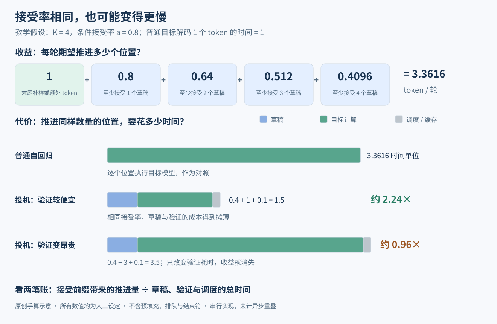

# 小模型写草稿，大模型究竟验证什么？

> 状态：机制导读 · 原创算例 · 未复现

> 速览：
> 1. 草稿器提出候选，目标模型给出同一前缀下的 token 概率；接受规则与拒绝后的补偿共同保持目标分布。
> 2. 接受率决定每轮能前进多远；草稿、验证与调度的耗时决定这些前进是否划算。
> 3. 草稿的训练、推理时的概率验证、答案正确性的验证，各自解决不同的问题。
> 4. 2026 年的新方法继续改草稿的生成、训练与执行顺序；读它们时，先定位改的是哪一笔成本。

本篇围绕三个问题展开：小模型如何写草稿、大模型如何保留自己的输出分布，以及能否只在关键位置接管。默认读者懂基础深度学习、token 与概率；拒绝采样从下面的算例讲起。[领域地图](README.md)解释它与长思考、搜索和服务系统的分工。

## 1 先把"打分"说清楚

假设已经生成"今天的天气"，现在要选下一个token。语言模型为词表中的候选 token 计算一组概率。不同模型可以给出不同分布：小模型可能偏好"很好"，大模型可能更偏好"不错"。这里的 token 是模型词表中的离散符号，可能对应一个字、词或词片段；下面把三个候选简写为 A、B、C。

以下用 D 表示草稿模型分布，用 T 表示目标模型分布。目标模型通常更大；算法要保留的是指定的 T，规模只是常见配置。

普通自回归生成每次按T选一个token，把它接到上下文末尾，再算下一组T。位置之间有先后依赖，因此不能在还不知道前一个token时，直接把所有后续token独立生成出来。

投机采样换了一种工作分配：先让便宜的模型提出短候选序列，再让目标模型同时计算这些已知候选前缀下的条件概率。候选前缀已经给定，目标模型可以像处理一段已知文本那样一次批量前向；哪些候选最终能保留，还要从左往右判断。[1][2]

图中上排是一次目标前向之前与之后的分工，下排是两种结束方式。并行的是已知候选位置的概率计算，最终提交的仍是一个连续前缀。

## 2 为什么不能觉得合理就直接接受

如果小模型给A的概率是0.6，大模型只给0.5，永远接受小模型提出的A，就会让A出现过多。哪怕两模型都认为A最可能，概率偏差仍然存在。反过来，大模型更喜欢的B，小模型可能提得太少。

所以这里要解决的是概率质量如何重新分配。经典投机采样对草稿token使用以下接受概率：[1][2]

$$\alpha(x)=\min(1,T(x)/D(x))$$

其中所有概率都以同一个已接受前缀为条件。x是刚从D抽到的候选，D(x)大于零；其他词表位置的零概率由残差分布处理。

这个公式做了两件直观的事：草稿给多了，就只保留其中一部分；草稿没有给多，就全部保留。接受草稿所贡献的最终概率质量为D(x)×α(x)，正好等于min(D(x),T(x))。

## 3 一个可以手算到底的例子

以下数值是教学用的人工构造，不是任何模型的实测结果。

| 候选 | 草稿D | 目标T | 接受概率 | 草稿被接受所贡献的质量 |
|---|---:|---:|---:|---:|
| A | 0.6 | 0.5 | 5/6 | 0.5 |
| B | 0.1 | 0.3 | 1 | 0.1 |
| C | 0.3 | 0.2 | 2/3 | 0.2 |

被接受的质量加起来是0.8，还有0.2进入拒绝分支。对照目标可以看到：A和C已经够了，B还缺0.2。因此，拒绝后应把这0.2补给B，而不是随便换一个token。

一般情况下，剩余质量写成max(T(x)−D(x),0)，再归一化成一个新的抽样分布。这个例子归一化后恰好是"只抽B"。两条分支合起来就得到(0.5,0.3,0.2)，与T一致。公式可以核对为：[1][2]

$$P(输出x)=\min(D(x),T(x))+\max(T(x)-D(x),0)=T(x)$$

先看每个候选在两分布中重叠的部分，再看目标分布多出来的部分。前者来自直接接受，后者来自拒绝分支；合在一起恰好填满目标。

一个容易忽略的反例是：拒绝后直接重新按T抽样。本例会变成(0.5,0.1,0.2)+0.2×(0.5,0.3,0.2)=(0.6,0.16,0.24)，并不是目标分布。因此"让大模型最后再抽一下"仍不够，补回什么分布是保真机制的一部分。

## 4 从一个token扩展到一小段草稿

小模型先写K个候选。目标模型计算第一个候选的概率、给定第一个候选时第二个的概率，以此类推，还能得到整段之后下一个位置的分布。验证从左到右进行。[2]

若前三个候选接受、第四个拒绝，前面三个保留，第四个用该前缀下的残差分布补一个 token，然后结束这轮。后续生成从这个新前缀重新出发（旧第五个候选的概率以旧第四个 token 为条件，不能直接复用为新前缀的目标概率）。

若K个都接受，则从最后位置的目标分布再抽一个token。因此一轮可能推进多个位置。这里的逐位置一致条件，加上条件概率的链式相乘，给出序列分布层面的对应关系。

温度、top-k 或 top-p 如果属于实际生成策略，T 应是应用这些规则后真正要采样的分布，D 应是实际产生候选的分布。理论精确性还需考虑实际浮点计算与实现细节；条件与常见误读见文末批注。[2]

## 5 节省的是哪部分成本

结论：每轮推进的 token 数是收益，草稿、验证与调度耗时是代价；两者相除才得到速度。

在第 3 节的单位置例子里，平均接受率 a 是 0.8，即两分布重叠的概率质量。一般地，它也可以写成：

$$a=\sum_x\min(D(x),T(x))=1-\frac12\sum_x|D(x)-T(x)|$$

后一项叫总变差距离（total variation，TV）：把两个离散分布之间各位置的概率差取绝对值、相加再除以二。本例 TV = (0.1 + 0.2 + 0.1)/2 = 0.2，所以 a = 0.8。这也解释了草稿器的目标：在便宜的前提下，尽量与目标分布重叠。[1]

把算例再推进一步。设每轮写 K = 4 个草稿；为了手算，假定在前面的候选都接受后，下一个位置的条件接受率始终是 0.8，并暂不考虑结束符和输出长度上限。若 L 是连续接受的草稿数，一轮总共输出 L + 1 个 token：末尾那个来自拒绝处的残差补样，或全部通过后的目标采样。因此：

$$\mathbb{E}[L+1]=1+a+a^2+a^3+a^4=3.3616$$

这是各位置"能走到这里"的概率相加。真实序列的接受率会随前缀变化，测量时应统计实际接受长度。[1]

图中把一次普通目标解码的时间记为 1。每个草稿步假设花 0.1，四步共 0.4；块验证花 1，调度与缓存处理花 0.1。一轮耗时 1.5，平均推进 3.3616 个位置，估算加速约为 3.3616/1.5 = 2.24 倍。若验证耗时增加到 3，其余条件保持不变，一轮变成 3.5，加速比约 0.96，反而略慢。所有时间和接受率都是人工设定，用来说明机制。

对于这种串行的草稿—验证实现，可用下面的成本账检查一项改进：

$$\text{加速比}\approx\frac{\mathbb{E}[L+1]\,t_{\rm AR}}{t_{\rm draft}+t_{\rm verify}+t_{\rm overhead}}$$

其中 t_AR 是对照实现生成一个 token 的时间。小批量解码常受显存带宽限制，块验证可利用原先闲置的并行算力。并发升高后，验证更大的块会增加计算压力；草稿更长也会增加写草稿与处理无效后缀的成本。[1][2]

评估时固定模型、精度、硬件、batch、输入输出长度与抽样设置，再分别看每 token 延迟、整请求延迟、吞吐量和总资源成本。并行使用更多设备时，还要把总设备数列出来（单请求加速比不能直接换算成相同比例的 API 账单下降）。

## 6 只让大模型生成关键部分是另一个问题

图中三行分别处理概率、答案与计算分配。第一行决定候选 token 怎样进入最终分布；第二行判断一个答案是否满足任务标准；第三行决定由哪个模型继续工作。实际系统可以组合这些部件，保证的对象仍要逐项说明。

上面的保证来自每个候选的目标概率与接受/补偿规则。若改成小模型平时自己写、认为遇到难点才叫大模型接管一段，系统就在做路由：决定"哪些位置值得付费"（这种选择性交接不能直接沿用精确采样指定目标模型的保证）。

阅读此类方法时，先问四件事：谁决定交接；交接一个token、一步推理还是一段文本；大模型回来以后是否检查此前的小模型输出；最终目标是精确保留分布，还是在指定评测中取得更好的质量与成本组合。以 RelayLLM 为例，小模型发起调用信号，请大模型续写指定数量的 token，然后自己接着写。谁调用、调用多长，都是计算分配策略的一部分；效果按任务质量与调用成本衡量。[3]

可继续对照 [BiLD](../../papers/arxiv-2302.07863/README.md)、[Judge Decoding](../../papers/arxiv-2501.19309/README.md)与 [Faster Cascades](../../papers/arxiv-2405.19261/README.md)：三者分别改回退、质量判定或级联采样机制。读级联系统时，把它定义的混合目标分布单独写出来，再与大模型自身的分布比较。

## 7 和训练、损失是什么关系

经典的草稿—验证—接受流程属于推理算法：参数固定，token 概率与接受决策来自前向计算和抽样。

草稿模型可以预先训练或蒸馏，也可以通过专门的预测头或其他结构改进候选生成。训练改变草稿分布 D 以及产生它的成本；部署时用同一套正确的验证规则，把不同的 D 修正到指定的 T。于是两张图可以分开画：训练时哪些参数接受什么监督；推理时哪些候选被谁接受、拒绝或补写。

[Acceptance-Aware Draft Model Training](../../papers/arxiv-2609.24150/README.md)（2026-09）把这个区分落实到损失设计：贪心验证围绕与目标 top-1 的连续一致训练，随机采样则围绕第 5 节的分布重叠训练，并把"越靠前拒绝，后面越用不上"计入窗口目标。[5] 它回答草稿怎样更容易被接受；目标模型的事实能力仍由目标模型自身决定。

## 8 2026 年的新方法分别改哪一笔账

结论：读新论文时，把改动放回第 5 节的分子和分母，比只按"小模型有多小"分类更有用。

- **更快地写完草稿。** [DFlash](../../papers/arxiv-2602.06036/README.md)把若干待生成位置遮盖，再用块扩散草稿器一次前向并行填充；它仍读取目标模型的内部特征。[4] 改的是 t_draft。块中候选的联合质量、块长度与验证成本，要一起衡量。
- **让写草稿与验证重叠。** [Speculative Speculative Decoding](../../papers/arxiv-2603.03251/README.md)（SSD，ICLR 2026）在独立设备上预猜本轮会接受多长、末尾会补哪个 token，为若干可能的新前缀提前备好下一轮草稿；命中就直接取用，未命中则走备用草稿流程。取出的草稿仍要接受常规验证。[6] 它改的是等待关系，因此耗时应按关键路径统计，不能继续把两台设备的工作时间直接相加。
- **让验证长度适应当前负载。** [DeepSeek-V4.1-Flash](../../papers/arxiv-2609.19969/README.md)的 DSpark 先预测各位置的条件接受概率，再结合推理引擎测得的吞吐曲线，选择每个请求验证多长。[7] 它同时考虑预期推进长度与 t_verify；高接受率仍需通过当前硬件和并发的成本检验。

这三类设计可以与训练损失一起比较：分布更接近提高可接受的前缀长度，草稿并行减少自身耗时，异步执行隐藏等待，自适应验证减少低收益计算。组合后的接口兼容性与收益，需要在同一执行系统里检验。

## 阅读路线与尚未解决的问题

先用本篇算例读懂 Leviathan 与 Chen 的概率机制，再看 [EAGLE-3](../../papers/arxiv-2503.01840/README.md)与 DFlash 怎样生成草稿；接着选读接受感知训练和 SSD，分别看训练目标与执行顺序；最后进入选择性交接与质量判别。

当前最值得继续追问的是：你要保留哪个目标模型的哪一种抽样分布？如果允许近似，愿意在哪些任务指标上接受多少变化？实际服务是单请求低延迟还是高并发吞吐？这些问题没有确定前，不能仅凭一个速度数字选出最适合的架构。

## 批注

**易误读**
- 分布保真不等于两次随机运行逐字相同，更不等于事实正确；目标模型的错误也会被保留下来（第 4 节）。
- 贪心解码固定选择目标 top-1；随机采样需要概率比值与残差补偿。只检查两个模型的 top-1 相同，不能证明随机采样分布相同。
- 同分布证明要求验证使用正确前缀下的目标概率、实际草稿概率及对应的补偿规则。直接用近似的目标概率替代 T，会改变需要证明的对象。
- 第 5 节的常数接受率与归一化时间是教学假设；实际服务还包括预填充、排队、通信与输出结束条件。公式针对普通串行实现，SSD 要另算重叠后的关键路径。
- 接受感知训练中的窗口目标以固定训练前缀计算，论文 §3.1 写明条件独立假设；它是训练代理目标，不能直接当成任意自由生成轨迹的无条件精确接受长度。论文主要报告 batch 1 的接受长度，不能据此报端到端加速倍数。
- 阅读路线的顺序是学习建议，不表示所有后续工作都直接由前一篇发展而来。
- 第5节列出的是阅读速度报告时的比较原则，不是本篇做出的性能测量。
- BiLD、Judge Decoding与Faster Cascades各是不同算法，本篇不把它们视为同一种方法（第6节）。

**与其他论文的关联**
- [领域地图](README.md)把概率验证、任务验证与预算分配放在同一幅图里；[Baseline](BASELINES.md)按被替换的部件比较方法。
- [DeepSeek-V4.1-Flash](../../papers/arxiv-2609.19969/reading.md)把草稿训练移到骨干预训练之后，再在后训练期间继续跟随；这说明"复用目标表示"与"从预训练起联合训练"是两个独立选择。

**未核实 / 待验证**
- 生产实现中的数值精度、缓存正确性以及 DFlash、SSD、DSpark 的组合效果，仍需代码审计和同条件测试。

**参考文献**

[1] Leviathan, Kalman, Matias. Fast Inference from Transformers via Speculative Decoding. ICML 2023. https://proceedings.mlr.press/v202/leviathan23a.html

[2] Chen et al. Accelerating Large Language Model Decoding with Speculative Sampling. arXiv:2302.01318v1, 2023-02-02. https://arxiv.org/html/2302.01318v1

[3] RelayLLM. arXiv:2601.05167. https://arxiv.org/html/2601.05167

[4] Chen, Liang, Liu. [DFlash: Block Diffusion for Flash Speculative Decoding](../../papers/arxiv-2602.06036/README.md). arXiv:2602.06036，§3–4。https://arxiv.org/html/2602.06036

[5] Xia et al. [Acceptance-Aware Draft Model Training for Speculative Decoding](../../papers/arxiv-2609.24150/README.md). arXiv:2609.24150v1，2026-09-21，§2.4–4。https://arxiv.org/html/2609.24150v1

[6] Kumar, Dao, May. [Speculative Speculative Decoding](../../papers/arxiv-2603.03251/README.md). ICLR 2026，§3.1。https://proceedings.iclr.cc/paper_files/paper/2026/file/1b96f01343ff10150e6719eb163e1536-Paper-Conference.pdf

[7] DeepSeek-AI et al. [DeepSeek-V4.1-Flash: Pushing the Limits of KV Cache Compression](../../papers/arxiv-2609.19969/README.md). arXiv:2609.19969v1，§2.4.3。https://arxiv.org/html/2609.19969v1
