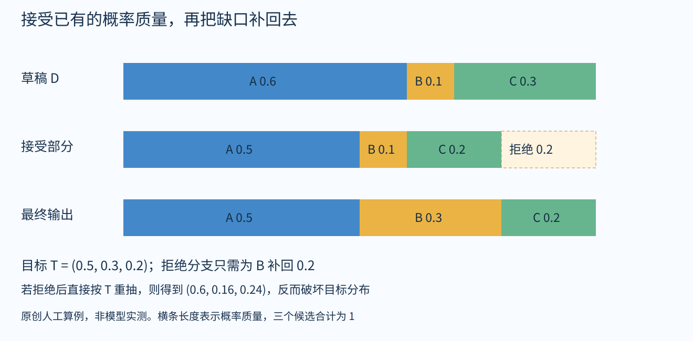

# 小模型写草稿，大模型究竟验证什么？

本篇围绕2026年10月3日提出的三个问题展开：小模型如何写草稿、大模型如何保留自己的输出分布，以及能否只在关键位置接管。默认读者懂基础深度学习、token与概率；不要求先学过拒绝采样。本文是机制导读与原创算例，不是所有相关论文的全文精读或独立复现。具体论文卡记录各自核验深度。

## 1 先把“打分”说清楚

假设已经生成“今天的天气”，现在要选下一个token。语言模型并不只给整句话打一个好坏分，而是为词表中的候选token计算一组概率。不同模型可以给出不同分布：小模型可能偏好“很好”，大模型可能更偏好“不错”。真实token未必恰好等于完整汉语词，这里把候选简写为A、B、C。

以下用D表示草稿模型分布，用T表示目标模型分布。“目标”通常是较大的模型，但保真算法依赖的是指定目标分布，并不依赖参数规模这个称呼。

普通自回归生成每次按T选一个token，把它接到上下文末尾，再算下一组T。位置之间有先后依赖，因此不能在还不知道前一个token时，直接把所有后续token独立生成出来。

投机采样换了一种工作分配：先让便宜的模型提出短候选序列，再让目标模型同时计算这些已知候选前缀下的条件概率。注意，“同时计算概率”与“同时独立决定所有输出”不是一回事。候选前缀已经给定，目标模型可以像处理一段已知文本那样一次批量前向；哪些候选最终能保留，还要从左往右判断。[1][2]

## 2 为什么不能觉得合理就直接接受

如果小模型给A的概率是0.6，大模型只给0.5，永远接受小模型提出的A，就会让A出现过多。哪怕两模型都认为A最可能，概率偏差仍然存在。反过来，大模型更喜欢的B，小模型可能提得太少。

所以这里要解决的是概率质量如何重新分配，并非请另一个助手评价句子“写得好不好”。经典投机采样对草稿token使用以下接受概率：[1][2]

$$\alpha(x)=\min(1,T(x)/D(x))$$

其中所有概率都以同一个已接受前缀为条件。x是刚从D抽到的候选，D(x)大于零；其他词表位置的零概率由残差分布处理。

这个公式做了两件直观的事：草稿给多了，就只保留其中一部分；草稿没有给多，就全部保留。接受草稿所贡献的最终概率质量为D(x)×α(x)，正好等于min(D(x),T(x))。

## 3 一个可以手算到底的例子

以下数值是教学用的人工构造，不是任何模型的实测结果。

| 候选 | 草稿D | 目标T | 接受概率 | 草稿被接受所贡献的质量 |
|---|---:|---:|---:|---:|
| A | 0.6 | 0.5 | 5/6 | 0.5 |
| B | 0.1 | 0.3 | 1 | 0.1 |
| C | 0.3 | 0.2 | 2/3 | 0.2 |

被接受的质量加起来是0.8，还有0.2进入拒绝分支。对照目标可以看到：A和C已经够了，B还缺0.2。因此，拒绝后应把这0.2补给B，而不是随便换一个token。

一般情况下，剩余质量写成max(T(x)−D(x),0)，再归一化成一个新的抽样分布。这个例子归一化后恰好是“只抽B”。两条分支合起来就得到(0.5,0.3,0.2)，与T一致。公式可以核对为：[1][2]

$$P(输出x)=\min(D(x),T(x))+\max(T(x)-D(x),0)=T(x)$$

一个容易忽略的反例是：拒绝后直接重新按T抽样。本例会变成(0.5,0.1,0.2)+0.2×(0.5,0.3,0.2)=(0.6,0.16,0.24)，并不是目标分布。因此“让大模型最后再抽一下”仍不够，补回什么分布是保真机制的一部分。

## 4 从一个token扩展到一小段草稿

小模型先写K个候选。目标模型计算第一个候选的概率、给定第一个候选时第二个的概率，以此类推，还能得到整段之后下一个位置的分布。验证从左到右进行。[2]

若前三个候选接受、第四个拒绝，前面三个保留，第四个用该前缀下的残差分布补一个token，然后结束这轮。旧第五个候选是在旧第四个token之后生成的，条件上下文已经失效，不能继续拿它原来的分数当成新上下文下的保证。

若K个都接受，则从最后位置的目标分布再抽一个token。因此一轮可能推进多个位置。这里的逐位置一致条件，加上条件概率的链式相乘，给出序列分布层面的对应关系；并非保证两次随机运行打印出逐字相同的句子。

温度、top-k或top-p如果属于实际生成策略，也要对相应概率作一致处理。理论精确性还需考虑实际浮点计算与实现细节。“与目标分布一致”更不等于事实正确：若目标模型会犯错，保留它的分布不会自动消除错误。[2]

## 5 节省的是哪部分成本

一次目标模型前向仍然要计算。机会来自小批量生成时，较短候选块的验证可以更充分利用硬件，减少昂贵的串行目标调用。候选越长并非越好：小模型写草稿要花时间，接受率下降会浪费后半段，验证和缓存管理也有开销。[1][2]

因此评估至少要固定模型、精度、硬件、batch、输入输出长度与抽样设置，再分别看每token延迟、整请求延迟、吞吐量和总资源成本。“快了几倍”不能脱离配置搬到另一台机器，更不能直接换算成API账单下降同样比例。这是阅读速度报告时的比较原则，并非本篇做出的性能测量。

## 6 只让大模型生成关键部分是另一个问题

上面的保证来自每个候选的目标概率与接受/补偿规则。若改成小模型平时自己写、认为遇到难点才叫大模型接管一段，系统已经在决定“哪些位置值得付费”。这可以是很有价值的协作方式，但不能仅凭“用了大模型”沿用前面的分布保证。

阅读此类方法时，先问四件事：谁决定交接；交接一个token、一步推理还是一段文本；大模型回来以后是否检查此前的小模型输出；最终目标是精确保留分布，还是在指定评测中取得更好的质量与成本组合。以RelayLLM为例，小模型可以产生调用信号，请大模型续写指定数量的token，然后自己接着写。这正对应“只在部分位置借用大模型”的问题；调用由小模型发起，不能写成大模型自己识别一切关键部分。其质量与调用成本需要按实际评测判断，不能套用上一节的目标分布保真证明。[3]

相关历史回收材料还包括BiLD、Judge Decoding与Faster Cascades。阅读时特别注意：某方法即使精确采样一个级联系统定义的分布，也不自动等于精确采样大模型本身。详细身份和方法证据见本领域逐篇文献卡，本篇不把这些方法视为同一个算法。

## 7 和训练、损失是什么关系

经典的草稿—验证—接受流程属于推理算法。本轮验证没有拿标准答案反向传播，也没有每走一步就更新大模型参数。token概率与接受决策是前向计算和抽样过程的产物。

草稿模型可以预先训练或蒸馏，也可以通过专门的预测头或其他结构改进候选生成；那是另一层训练设计。它的损失改变的是草稿的质量和成本，不能代替部署时正确的验证规则。读后续论文时，建议始终画出两张图：训练时哪些参数接受什么监督；推理时哪些候选被谁接受、拒绝或补写。

## 阅读路线与尚未解决的问题

先用本篇算例读懂Leviathan与Chen的概率机制，再比较改进草稿生成的方法，最后进入选择性交接与质量判别。这个顺序是学习建议，不表示所有后续工作都直接由前一篇发展而来。

当前最值得继续追问的是：你要保留哪个目标模型的哪一种抽样分布？如果允许近似，愿意在哪些任务指标上接受多少变化？实际服务是单请求低延迟还是高并发吞吐？这些问题没有确定前，不能仅凭一个速度数字选出最适合的架构。

## 引用与阅读边界

[1] Leviathan, Kalman, Matias. Fast Inference from Transformers via Speculative Decoding. ICML 2023. https://proceedings.mlr.press/v202/leviathan23a.html

[2] Chen et al. Accelerating Large Language Model Decoding with Speculative Sampling. arXiv:2302.01318v1, 2023-02-02. https://arxiv.org/html/2302.01318v1

[3] RelayLLM. arXiv:2601.05167. https://arxiv.org/html/2601.05167

本次核对官方论文身份、摘要与投机采样算法/方法相关段落；未独立训练、复现性能或审计全部实现。图与数值例子为原创教学表达。聊天来源来自检索摘要，具体条目由此前助手推荐；未取得原会话链接，不能据此推定用户已读或已采纳方案。
