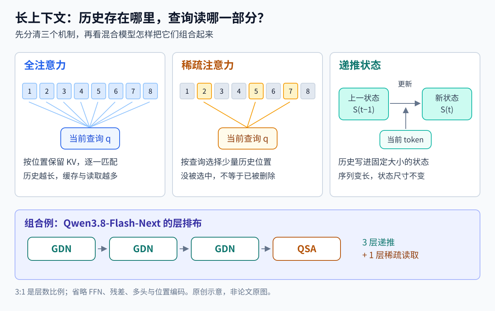
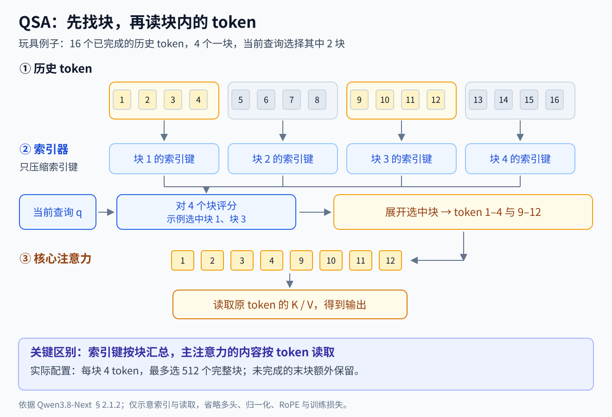

# 长上下文

> 状态：领域入门页 · v3
>
> 速览：
> 1. 长上下文要分四项验收：远距离位置可用、确实利用远处信息、能按指令完成长任务、显存与等待时间可承受。窗口上限只是入口。
> 2. 位置处理、长依赖数据、训练课程与推理执行要一起设计。Llama 3、Qwen2.5-1M 是 2024–2025 年的完整配方参照；它们的后训练比例与外推方式各有适用条件。
> 3. 窗口内仍会丢信息：Lost in the Middle 暴露中段退化，RULER 区分标称与有效长度；到 2026 年，百万窗口仍要分别测检索、多轮共指、跨文档推理与智能体任务。
> 4. `[判断]` 结构路线已跨团队、也能叠加：DeepSeek 稀疏与压缩 KV，Kimi 混合递推状态与全注意力；Qwen 从 2025 年 Qwen2.5-1M 的推理优化，走到 2026 年的 GDN 混合，再在 Qwen3.8-Flash-Next 中叠加稀疏注意力。
> 5. 比较时先固定模型版本、长度、评测与执行配置：3:1 层数不能直接换算成缓存节省，内核加速不能直接换算成整机吞吐，AA-LCR 在 2026 年 9 月更换评分版本后也要重新对齐口径。

本页是[大语言模型](../../README.md)领域的长上下文方向。它与[预训练方向](../pretraining/README.md)的分工如下：
- 预训练页的问题②"注意力不丢失"、问题③"更长更大的注意力"，讲预训练怎样让注意力稳定、怎样降低长序列的计算。
- 本页讲长上下文作为一项能力怎样获得、怎样评测。

相关方向：注意力部件的结构对比在[架构与效率](../architecture/README.md)；推理模型的长输出与解码效率在[推理时计算](../inference/README.md)。

## 这个领域在解决什么

设想把一个 30 万 token 的代码仓库，或一本 500 页的合同一次交给模型，问："第 3 章的条款和附件 B 的哪一条冲突？"模型要做到四件事：
- 在从没训练过的距离上，位置编码仍然可用；
- 真的去读那两处，而不是按局部关键词续写；
- 按问题的要求组织答案；
- 整个过程的显存和首 token 等待时间可以接受。

本方向研究这四件事分别靠什么做到，以及怎样证明做到了。四件事对应四个环节：

| 环节 | 要解决什么 | 代表手段 | 一句话直觉 |
|---|---|---|---|
| 位置 | 推理时出现训练中没见过的距离 | RoPE 与它的插值（PI、YaRN）、提高 RoPE 基频（ABF）、DCA、全局层不用位置编码（NoPE） | 把新距离映射回模型熟悉的范围，或者干脆让全局层不依赖位置 |
| 数据与课程 | 长样本里多数 token 只靠附近几句就能预测，学不到远处依赖 | 预训练末段分级加长；长文档上采样；合成"必须读远处"的任务 | 让正确预测必须用到远处的信息 |
| 后训练 | 能读不等于能按指令处理长文 | 长短混合的指令微调；用短样本做偏好优化 | 少量长指令就能把读取能力变成任务能力 |
| 计算与缓存 | 全注意力的 prefill 计算随长度平方增长，KV 缓存随长度线性增长 | 稀疏 prefill、KV 压缩、稀疏或线性注意力 | 从训练到推理少算、少存，同时保住所需信息 |

四个环节互相牵制：省计算的结构会改变信息怎样保留，长依赖数据则决定模型是否学会使用这条信息通路。

几个名字相近、含义不同的"块"（chunk），读报告时要分开：
- DCA 的块管位置映射；
- 分块 prefill 的块管一次处理多少 token、峰值显存多大；
- 滑动窗口管每个位置能看到多远。

长输入、长输出、长时程强化学习也是三件事：
- 长输入：一次能读多少；
- 长输出：一次写多少，例如推理模型的长思考；
- 长时程强化学习：多少步决策共享一个延迟的奖励。

三者相关，但任何一个变长，都不会自动解决另外两个（[Qwen2.5-1M 精读](../../papers/qwen2.5-1m/reading.md)第八节）。

## 主线历史

结论：
- 2017–2022 年，窗口由训练长度决定；
- 2023 年，开源社区学会用位置插值加少量训练，把窗口扩大 4–32 倍；
- 2024 年，窗口到了百万级，暴露出"能放进去"和"能用上"之间的差距，评测随之改变；
- 2025 年起，长上下文的需求主要来自推理模型与智能体，各家开始改造注意力本身。

每个阶段都写出它做不好的场景。

### 1 窗口由训练长度决定（2017–2022）

- [Transformer](../../papers/transformer/README.md)（2017）用正弦位置编码。
- [RoPE](../../papers/arxiv-2104.09864/README.md)（2021，追一科技）把位置写成 Q、K 的旋转角，使位置项由两个 token 的相对距离决定；多频叠加可呈现远距离衰减特性。它后来成为 Llama、Qwen 系列的默认位置编码。
- GPT-3、LLaMA 的窗口都是 2048。

做不好的场景：超出训练长度就崩。
- PI 的表 1：不做任何调整的 LLaMA 7B，在 4096 到 32768 的窗口上，PG19 困惑度都超过 1000。
- 直接在长文本上继续训练也很慢：1 万个批次之后，有效窗口只从 2048 增到 2560。
- RoPE 作者也写明，说不清它为什么在长文本上表现更好。

### 2 位置插值：少量训练把窗口扩大（2023）

留下的问题：外推会让注意力分数失控，从头用长序列训练又太贵。

| 节点 | 改变了什么 | 当时做不好的场景（原文） |
|---|---|---|
| [PI](../../papers/arxiv-2306.15595/README.md)（2023-06，Meta） | 把新长度上的位置索引线性压回训练范围；LLaMA 7B–65B 约 1000 步扩到 32K，passkey 检索 200 步就达到 8K 的有效长度 | 原窗口内的能力下降：7B 的 BoolQ 从 76.1 降到 64.7（32K） |
| [YaRN](../../papers/arxiv-2309.00071/README.md)（2023-08，Nous Research 等） | 指出 PI 把高频维度也压扁、丢掉了局部距离；改为按频段插值，再加一个注意力温度。Llama 2 扩到 128K，passkey 99.4% | 短任务仍小幅下降（7B 的 MMLU 从 43.8 到 41.7）；评测以困惑度和 passkey 为主 |
| [Effective Long-Context Scaling](../../papers/arxiv-2309.16039/README.md)（2023-09，Meta） | 公开了配方：Llama 2 继续预训练 400B token，RoPE 基频从 1 万提高到 50 万（ABF）。70B 的 MMLU 不降反升；调整长度分布没有明显收益，数据质量更重要 | ZeroSCROLLS 平均 37.7，低于 Claude 的 39.1；自述没有针对广泛的长上下文应用微调 |
| [StreamingLLM](../../papers/arxiv-2309.17453/README.md)（2023-09，MIT 等） | 只缓存最近 token 时，开头 token 一被逐出就崩；保留开头 4 个 token 加滑动窗口，就能稳定处理 400 万 token | 自述不扩展上下文窗口、不增强长期记忆，不适合长文档问答 |
| [Lost in the Middle](../../papers/arxiv-2307.03172/README.md)（2023-07，Stanford 等） | 第一次系统地问"窗口里的信息用上了没有"：准确率随相关文档的位置呈 U 形 | 20、30 篇文档设置的最坏情况下，GPT-3.5-Turbo 低于不给文档的闭卷设置（56.1%）；加长上下文的 16K 版本与原版几乎一样 |

这一阶段的评测停留在困惑度和 passkey（在长文本里埋一个数字，让模型复述），Lost in the Middle 是例外。

`[判断]` 困惑度下降只说明模型没被新位置搞乱，不说明它会用远处的信息。Lost in the Middle 的 U 形曲线，第一次把这两件事分开测量。

位置插值与提高基频留下了可复用的配方，后来的变化与结构有关：
- Qwen2.5-1M 用 ABF，Qwen3.6 与 Qwen3.8-27B 的全局注意力仍保留 RoPE，模型卡提供 YaRN 外推；
- DeepSeek-V2、V3 用 YaRN 从 4K 扩到 128K；
- Gemma 3 只把全局层的 RoPE 基频提到 100 万；
- Kimi 是例外，见第 5 阶段。

### 3 百万窗口与评测反思（2024）

留下的问题：窗口扩到 128K 以上之后，长上下文到底能做什么，用什么证明？

| 节点 | 改变了什么 | 做不好的场景（原文） |
|---|---|---|
| [Gemini 1.5](../../papers/arxiv-2403.05530/README.md)（2024-03，Google） | 闭源模型第一次把窗口推到 1M 以上：文本大海捞针 1M 内超过 99.7%，10M 为 99.2%，视频、音频同样接近满分；只给一本语法书，就学会翻译一种几乎没有网络语料的语言 | 插入 100 根针时，128K 以内召回约 70%，1M 处约 60%；报告呼吁用多针和需要复杂推理的新评测，并且不公开架构 |
| [RULER](../../papers/arxiv-2404.06654/README.md)（2024-04，NVIDIA） | 在检索之外加入多跳追踪、聚合与问答，共 13 个任务；以 Llama2-7B 在 4K 上的 85.6% 为阈值，定义"有效上下文长度" | 17 个声称支持 32K 以上的模型，摘要写明只有一半在 32K 达标；GPT-4 声称 128K，有效长度 64K |
| [Llama 3](../../papers/arxiv-2407.21783/README.md)（2024-07，Meta） | 405B 用约 800B token 分六级，从 8K 加到 128K；每一级以"短上下文评测完全恢复、该长度的大海捞针全部答对"判断是否适应。后训练中，只用短指令会显著损害长上下文能力，混入 0.1% 的合成长数据最好 | 多针（插 4 根、取 2 根）405B 为 98.1%，GPT-4 与 GPT-4o 为 100%；InfiniteBench 问答上 70B 高于 405B |

`[判断]` 这一阶段的转折，是评测目标从"能不能找到"迁移到"能不能用"。
- 三份材料各自写出了同一个结论：单针大海捞针不够。Gemini 1.5 在第 10 节写明，RULER 在摘要里写明，Llama 3 则把短上下文恢复与大海捞针并列为两条标准。
- 但它们给的替代评测不同：Gemini 用多针与 MRCR，RULER 用可调难度的合成任务，Llama 3 用 InfiniteBench、ZeroSCROLLS 这类真实长文问答。
- 结果是"支持多长"的说法从此要配上"在哪个评测上测到多长"。

### 4 开源百万上下文：训练、外推与推理系统一起做（2025 上半年）

留下的问题：闭源模型已有百万窗口，开源模型怎样在承受得起的训练成本下做到，并且部署得起？

[Qwen2.5-1M](../../papers/qwen2.5-1m/reading.md)（2025-01，阿里巴巴 Qwen 团队）把四个环节都写进了一份报告。它的引言把动机写作：上下文长度有限，把模型限制在较简单的单一任务上，并举出仓库级代码生成与海量文档研究两个例子。

- **位置与课程**：从 4K 起分五级加到 256K，RoPE 基频随之从 1 万提高到 1000 万；后三级每级 75% 的序列取当前最大长度。14B 在 128K 上的 RULER，从 32K 阶段的 37.6 提高到 256K 阶段的 87.6。
- **数据**：自然长文之外，加入填空、按关键词或相对位置检索、段落重排这类合成任务，让答案必须依赖远处。
- **后训练**：先只用短指令，再长短混合。偏好优化只用 8K 以内的样本，LongBench-Chat 仍从 7.32 提高到 8.08（7B）。
- **外推与推理**：
  - 推理时用 [DCA](https://arxiv.org/abs/2402.17463)（把远距离映射回训练中见过的相对距离），加上 YaRN 的注意力温度，从 256K 外推到 1M。这里只借用了 YaRN 的温度部分。
  - prefill 用 [MInference](https://arxiv.org/abs/2407.02490) 式的稀疏注意力，并在 1M 长度上重新校准。
  - 首 token 延迟降低 3.2–6.7 倍。

同期，[NSA](../../papers/arxiv-2502.11089/README.md)（2025-02，DeepSeek 与北京大学等）走另一条路：让稀疏注意力从预训练开始就参与训练，而不是推理时事后删边。
- 原文批评事后稀疏化只在 prefill 或解码一侧加速，而且不能训练。
- 每个查询并行走三条分支：压缩块读概况、按分数选块读细节、滑动窗口读局部，再用门控合并。
- 27B 模型上，LongBench 平均 0.469，全注意力为 0.437；64K 大海捞针全部位置找回；64K 解码快 11.6 倍。

做不好的场景：
- Qwen2.5-1M 的 RULER 主表只测到 128K，LV-Eval 到 256K，1M 上只有 passkey 与大海捞针。
- 不做长训练、只做外推的 72B，在 LV-Eval 全部五种长度上都高于 14B-1M：窗口和底层的综合能力是两条轴。
- 短任务有升有降：14B 的 GPQA 从 45.5 降到 39.9，HumanEval 从 83.5 升到 88.4。
- 原版稀疏 prefill 在 400K 以上让 7B-1M 的大海捞针准确率降到 60% 以下，要用 1M 长度重新校准稀疏配置才恢复。
- NSA 只在 64K 以内验证。

### 5 为长程推理与智能体改造注意力（2025 下半年–2026 年中）

留下的问题：推理模型要写几万 token 的思考，智能体要在上下文里累积工具调用的历史。长上下文从"读一篇长文"变成"在长历史上反复决策"，原始注意力的平方复杂度成了主要瓶颈（DeepSeek-V4 第 1 节）。

| 节点 | 改变了什么 | 做不好的场景（原文） |
|---|---|---|
| [Kimi Linear](../../papers/arxiv-2510.26692/README.md)（2025-10） | 每 3 层线性注意力 KDA 接 1 层全注意力 MLA，MLA 层不用位置编码；1M 长度下 KV 缓存最多少 75%，解码最多快 6 倍；128K 上 RULER 84.3，同配方的全 MLA 为 81.3 | 原文写明长上下文检索是纯线性注意力的主要瓶颈，所以仍保留四分之一的全注意力；LongBench v2 上 35.0，低于全 MLA 的 36.1；混合比提到 7:1 后，分布外验证明显变差 |
| [DeepSeek-V3.2](../../papers/arxiv-2512.02556/README.md)（2025-12） | DSA：一个很小的索引器给历史 token 打分，主注意力只读得分最高的 2048 个；先稠密预热索引器，再稀疏训练 | 128K 上限让 20% 以上的搜索智能体测试超长；索引器本身仍是平方复杂度 |
| [DeepSeek-V4](../../papers/arxiv-2606.19348/README.md)（2026-04） | CSA（KV 压缩 4 倍后稀疏选 top-k）与 HCA（压缩 128 倍、稠密）交错，加滑动窗口分支与可学习的 sink。1M 下单 token 推理 FLOPs 为 V3.2 的 27%，KV 缓存为 10%；1M 长度的 MRCR 83.5，Gemini-3.1-Pro 为 76.3 | 128K 以后检索准确率可见下降；MRCR 1M 落后 Claude Opus 4.6（92.9）；作者自述结构偏复杂 |
| [Kimi K3](../../papers/arxiv-2607.24653/README.md)（2026-07） | 沿用 3:1 的 KDA 与 MLA 混合，全局层不用位置编码，直接外推到 1M；上下文在预训练中从 8K 加到 64K，在冷却期从 256K 加到 1M；合成只有读遍整个 1M 上下文才能解出的任务 | 报告写明仅有长度不能带来长程能力；正文没有 RULER、MRCR 这类可与他家对照的长上下文评测，只有第三方的 AA-LCR（74.7）与 BrowseComp |

同期的选择跨越了团队边界：

| 节点 | 改变了什么 | 做不好的场景（原文） |
|---|---|---|
| [Nemotron 3](../../papers/arxiv-2512.20856/README.md)（2025-12，NVIDIA） | 以 Mamba-2（固定大小状态的序列层）与 MoE 交错为主，只留少数注意力层，注意力层不用 RoPE；512K 继续预训练、256K SFT，支持 1M。Nano 在 1M 长度的 RULER 为 54.19，上一代 Nemotron 2 Nano 为 23.43 | 1M 上的 RULER 仍只有约一半；白皮书没有给出 Mamba 与注意力层的确切比例 |
| [GLM-5](../../papers/arxiv-2602.15763/README.md)（2026-02，智谱） | 把 DeepSeek 的 DSA 搬到自己的模型上：中段训练后从 MLA 出发，1000 步稠密预热加 20B token 稀疏适应；长序列注意力计算约省 1.5–2 倍，128K 的 RULER 78.86，稠密 MLA 为 79.21 | 在 GLM-9B 上试过的滑动窗口与 Gated DeltaNet 类线性注意力，128K 上都比 DSA 掉得多（滑窗模式 69.59，全注意力 75.28） |
| [Qwen3.5](../../papers/qwen3.5/README.md)（2026-02）与 [Qwen3.6-35B-A3B](https://huggingface.co/Qwen/Qwen3.6-35B-A3B)（2026-04） | 每三层 Gated DeltaNet（把历史写入固定大小状态的门控线性注意力）接一层门控全注意力；原生 262,144 token，仍用 YaRN 外推到 1,010,000 | 模型卡给出结构与部署配置，未给出这两个版本在百万长度上的逐项长上下文消融 |
| [MiniMax-M2](../../papers/arxiv-2605.26494/README.md)（2026-05，MiniMax） | 反方向：全部 62 层用全注意力，放弃前代 MiniMax-Text-01 的 Lightning Attention 混合；在数千亿到数万亿 token 上试过的滑动窗口混合，标准评测上看似持平，多跳推理、检索与上下文学习却变差，SFT 后 32K 以上差距更大 | 作者写明随上下文变长、GPU 算力增长放缓，次平方注意力会越来越重要，结论可能在更大规模上改变 |

窗口之外还有一条推理时的路：[Recursive Language Models](../../papers/arxiv-2512.24601/README.md)（MIT，2025-12）不把长输入送进网络，而是放进 Python 环境作为一个变量，模型写代码查看、切分，并在片段上递归调用自己，能处理超出窗口两个数量级的输入；在需要两两配对的 OOLONG-Pairs 上，GPT-5 直接作答 0.1%，套上这一框架为 58.0%。[Kimi K2.5](../../papers/arxiv-2602.02276/README.md) 把并行子智能体也看作上下文管理：每个子智能体只持有有限的局部上下文，只把相关结果交回编排器。

另一个数字值得留意：Kimi K3 在 BrowseComp（网页搜索智能体任务）上，在 300K 处触发上下文压缩时为 91.2%，用满 1M、不做上下文管理时为 90.4%（§6.1.3）。

### 6 混合路线继续组合，成本拆到检索与缓存（2026 年 8–9 月）

留下的问题：大部分层改成递推状态后，少数全局层仍要读长历史；稀疏注意力的索引器也有成本。

[Qwen3.8-Flash-Next](../../papers/arxiv-2608.30320/README.md)（2026-08-31 报告）在三层 GDN 接一层全注意力的基础上，继续预训练时把全注意力换成 QSA（先对小块打分，再读取选中块内 token 的稀疏注意力）。递推与稀疏由此进入同一个模型。它保留 RoPE：作者试过的 NoPE 变体在后训练后更容易持续生成而不停下。

图 1 的三列回答不同问题：全注意力保留并读取各位置，稀疏注意力改变本次查询读取的集合，递推层把过去写入固定大小状态。底部的混合让不同层承担不同工作。Qwen3.8-Flash-Next 是 GDN 与 QSA 的组合；[Qwen3.8-27B](https://huggingface.co/Qwen/Qwen3.8-27B) 则仍采用 GDN 与门控全注意力，原生 262,144 token、通过 YaRN 扩到 1M。

图 2 用 16 个已完成历史 token 演示“先找块、再读 token”。QSA 压缩的是索引键；核心注意力仍读取所选块展开后的 token。图中的预算只是手算例子，实际 Flash-Next 每块 4 个 token、选择最多 512 个完整块，另保留未完成末块。

[DeepSeek-V4.1-Flash](../../papers/arxiv-2609.19969/reading.md)（2026-09-17 报告）继续压缩“保存历史”的代价：跨层复用全局 KV，再用 FP4 存储，使全局 KV 降到约 890 字节/token，为 V4-Flash 的约四分之一。它的边界来自稀疏选错与缓存恢复时的近似状态重建，作者把未覆盖的极端输入列为后续测试重点。

`[判断]` 从第 4 阶段到这里，变化是降成本的手段开始叠加：推理外推、递推状态、稀疏读取与缓存压缩分别改不同部件。Qwen2.5-1M 代表的是 2025 年的一个配方；到 2026 年，按公司把模型固定分成“推理端优化、稀疏、线性”三组，已经解释不了这些组合。

做不好的场景也随之细化：V4 的长检索退化、K3 的长任务数据需求、QSA 对照里的百万长度多轮共指难题，以及 V4.1 的缓存恢复边界，分别要用不同测试暴露。K3 的 BrowseComp 压缩结果说明上下文管理可以影响任务表现。

## 技术地基

- **位置编码与 RoPE**：注意力本身不区分 token 的先后，位置要写进 Q、K 的匹配；RoPE 让位置项由相对距离决定，实际分数还取决于 Q、K 的内容。[Transformer 讲义](../../../foundations/lessons/14-attention-transformer.md)第 8 节。
- **KV 缓存、prefill 与 decode**：生成时缓存历史的 K、V。一次性读入长输入的前向叫 prefill，之后逐 token 生成叫 decode。长上下文的首 token 延迟主要花在 prefill，显存主要花在 KV 缓存。[Transformer 讲义](../../../foundations/lessons/14-attention-transformer.md)第 12.4 节。
- **注意力的成本与三类改法**：
  - FlashAttention 只改计算与搬数据的方式，结果是精确的；
  - MQA/GQA 减少 KV 头数，KV 量化降低每个数的位数；
  - 局部与稀疏注意力改变直接读取的历史集合，线性注意力把历史压入递推状态。
  
  见 [Transformer 讲义](../../../foundations/lessons/14-attention-transformer.md)第 14.2–14.4 节，推理端的细节见[推理时计算方向](../inference/README.md)"解码与服务效率"。
- **线性注意力与递推状态**：用固定大小的状态代替随长度增长的 KV 缓存，代价是精确检索变弱。[递推状态谱系](../../../foundations/relations/recurrent-state.md)、[SSM 讲义](../../../foundations/lessons/18-ssm-gnn-moe.md)第 2 节。
- **注意力汇聚**：softmax 的一行权重加起来等于 1，当前位置找不到要读的内容时，多余的权重会落到开头的 token 上。截断缓存、外推、稀疏化时都要处理它。见[预训练页问题②](../pretraining/README.md)。

## 主要路线与团队偏好

`[判断]` 可复用的部分是位置处理与长序列课程，分化发生在如何保存和读取历史。下面按具体版本比较公开选择；历史配方与 2026 年结构并列，是为了看路线怎样变化。

| 团队与证据时期 | `[判断]` 路线 | 代表 | 代价与边界 |
|---|---|---|---|
| Meta（2023–2024 配方） | 保持全注意力，改位置、数据和扩长课程 | PI、Effective Long-Context Scaling、Llama 3 | Llama 3 报告中的窗口为 128K；这些历史结果说明训练配方，不代表此后的产品上限 |
| Google（2024 长上下文报告） | 百万窗口与复杂检索评测一起推进 | Gemini 1.5 | 当时 1M 的百针召回约 60%；该报告没有给出完整训练配方 |
| 阿里巴巴 Qwen（2025–2026） | 从 Qwen2.5-1M 的外推与稀疏 prefill，走向 GDN 混合；Flash-Next 再将全局层稀疏化 | [Qwen3.5](../../papers/qwen3.5/README.md)、[Qwen3.8-Flash-Next](../../papers/arxiv-2608.30320/README.md) | 结构与外推可以并用；Qwen3.8-27B 保留门控全注意力，Flash-Next 的 QSA 结论要按变体引用 |
| DeepSeek（2025–2026-09） | 训练时稀疏，持续压缩并复用 KV | NSA、V3.2、V4、[V4.1-Flash](../../papers/arxiv-2609.19969/reading.md) | 降低全局缓存还要测选择误差、缓存恢复后的状态偏差 |
| Kimi（2025–2026-07） | KDA 线性注意力为主、MLA 全注意力为辅，全局层不用位置编码 | Kimi Linear、K3 | 纯线性检索弱；公开的混合比消融显示全注意力仍有价值 |
| NVIDIA（2025-12 白皮书） | Mamba-2 状态空间层为主，保留少数无 RoPE 的注意力层 | [Nemotron 3](../../papers/arxiv-2512.20856/README.md) | Nano 的百万长度 RULER 仍约一半；该数对应白皮书版本 |
| 智谱（2026-02 的 GLM-5） | 从 MLA 继续训练到 DSA 稀疏注意力 | [GLM-5](../../papers/arxiv-2602.15763/README.md) | 128K RULER 比稠密低 0.35 分；RL 中冻结索引器 |
| MiniMax（2026-05 的 M2 报告） | 回到全注意力，优先保多跳、检索与上下文学习质量 | [MiniMax-M2](../../papers/arxiv-2605.26494/README.md) | 承担全注意力的长序列成本；作者明确保留未来改回高效注意力的可能 |

`[判断]` 收敛与分化：
- **课程可复用，比例要按模型读**：Llama 3、Qwen2.5-1M、V4、K3 都分级加长；Llama 3 的 0.1% 长 SFT 样本与 Qwen2.5-1M 的短偏好数据是各自实验结论。
- **路线可组合，评测要随组合改变**：Qwen3.8-Flash-Next 把递推与稀疏叠加；MiniMax-M2 则给出保留全注意力的反例。训练损失、检索能力与长任务成功率需要一起看。
- **位置处理依赖具体骨干**：Kimi 的全局 NoPE 与 Qwen3.8-Flash-Next 保留 RoPE 都有各自实验依据；能否稳定完成生成，也是位置方案的验收项。

## 用什么衡量进展

结论：评测分四层，从信息检索到长历史上的行动。每层回答不同问题，公布窗口长度时应同时给出在哪些任务上验证到了这个长度。

| 层 | 代表 | 测的是什么 | 已知的口径问题 |
|---|---|---|---|
| 检索 | passkey、大海捞针（单针、多针） | 能否在任意位置找回一条信息 | 只测表层检索（RULER 摘要）；单针接近满分时，多针仍会明显下降（Gemini 1.5 第 5.2.1.5 节）；Llama 3 的多针是插 4 根取 2 根，Gemini 是 100 根，不能直接比较 |
| 合成多任务 | RULER、MRCR（多轮对话中找回第 n 次出现的某类内容） | 检索之外的多跳追踪、聚合、在干扰中问答 | RULER 自述不控制证据位置、与真实任务的相关性未验证；以 Llama2-7B 在 4K 的分数作阈值，是一个相对标准 |
| 真实长文 | LongBench、LongBench-V2、LV-Eval、InfiniteBench、ZeroSCROLLS、CorpusQA、[AA-LCR](https://huggingface.co/datasets/ArtificialAnalysis/AA-LCR/blob/main/README.md) | 文档问答、摘要、代码库理解；AA-LCR 要跨多个真实文档推理 | 需分别报告文档长度与证据分布；Qwen2.5-1M 修改了 LV-Eval 的打分以减少假阴性，不能直接与原排行榜混排 |
| 智能体 | BrowseComp | 在长历史上搜索、决策 | 上下文管理策略（例如压缩）会改变结果（K3：300K 处压缩 91.2%，用满 1M 为 90.4%） |

[Qwen3.8-Flash-Next](../../papers/arxiv-2608.30320/README.md) 的同一张对照表给出一个直观例子：启用 QSA 后，512K–1M 区间的 RULER 平均分为 93.00，而 1M 的八针 MRCR 为 26.44。任务难度与汇总方式不同，两数适合说明“一个长上下文分数不够”，不适合相减来量化能力损失。

其他口径：
- **数据集版本也会改变分数**：[AA-LCR v1.1](https://huggingface.co/datasets/ArtificialAnalysis/AA-LCR/blob/main/README.md) 在 2026 年 9 月修正 16 个答案键，并为判分模型增加系统提示；官方明确要求与 v1.0.0 分数分开比较。K3 报告引用的 2026-07 第三方分数应保留当时日期。
- **效率按阶段和测量对象报告**：至少分开 prefill、decode、全局 KV 与其他运行内存；QSA 报告的 1M 注意力模块加速，不能直接当成整个模型的端到端吞吐。
- **短任务回归要一起报**：Llama 3 把"短上下文评测完全恢复"作为每一级扩长的标准；PI、YaRN、Qwen2.5-1M 都报告了短任务下降。
- **外推的对照要公平**：Qwen2.5-1M 的表 4 中，给原版 14B 也加上外推后，128K 上的 RULER 从 53.0 到 78.1；1M 版本再到 92.2。只和不外推的原版比，会把推理修复的收益算到训练头上。
- **基座与对话模型分开看**：Kimi Linear 的 RULER 对照是基座模型，DeepSeek-V4 的 MRCR 对照是最高推理档的对话模型。
- **目标迁移**：PG19 困惑度与 passkey（2023）→ 大海捞针（2023–2024）→ RULER、LongBench、InfiniteBench（2024–2025）→ MRCR 1M、CorpusQA、BrowseComp（2026）。`[判断]` 每一次迁移，都发生在上一层被刷到接近满分之后。最新一层已经和推理、智能体能力分不开，"长上下文能力"越来越难单独测量。

## 当前开放问题

- **怎样构造“必须读远处”的训练数据？** Qwen2.5-1M 的合成任务与 K3 的百万长度任务说明了方向，生成方式、配比和消融仍需拆开。入口：[Qwen2.5-1M 精读](../../papers/qwen2.5-1m/reading.md)第三、九节、[Kimi K3](../../papers/arxiv-2607.24653/README.md)、[Effective Long-Context Scaling](../../papers/arxiv-2309.16039/README.md)。
- **混合结构在哪些任务上省得值得？** 固定数据、长度、计算预算与后训练，才能分出递推、稀疏和全注意力各自的收益；中段信息、多跳检索和重复关联是需要受控测试的场景。入口：[Qwen3.8-Flash-Next](../../papers/arxiv-2608.30320/README.md)、[MiniMax-M2](../../papers/arxiv-2605.26494/README.md)、[GLM-5](../../papers/arxiv-2602.15763/README.md)、[Lost in the Middle](../../papers/arxiv-2307.03172/README.md)、[递推状态谱系](../../../foundations/relations/recurrent-state.md)。
- **窗口、上下文管理与外部记忆怎样分工？** K3 的 BrowseComp 对照显示压缩策略会影响任务表现；递归读取与子智能体分片又把输入放到了单次窗口之外。入口：[Kimi K3](../../papers/arxiv-2607.24653/README.md)、[Recursive Language Models](../../papers/arxiv-2512.24601/README.md)、[Kimi K2.5](../../papers/arxiv-2602.02276/README.md)、[Frozen Memory Is Not Enough](../../papers/arxiv-2608.17050/README.md)。
- **怎样同时验收能力、成本与运行边界？** 除了检索和长任务成功率，还要记录短任务回归、首 token 延迟、生成速度、缓存占用，以及缓存恢复后的输出稳定性。入口：[RULER](../../papers/arxiv-2404.06654/README.md)、[DeepSeek-V4.1-Flash](../../papers/arxiv-2609.19969/reading.md)、[评估方向](../../../cross-domain/fields/evaluation/README.md)。

## 阅读顺序

1. [Transformer 讲义](../../../foundations/lessons/14-attention-transformer.md)第 8、12.4、14 节 → [RoPE](../../papers/arxiv-2104.09864/README.md)：先弄清位置怎样写进注意力，KV 缓存为什么随长度增长。
2. [PI](../../papers/arxiv-2306.15595/README.md) → [YaRN](../../papers/arxiv-2309.00071/README.md) → [Effective Long-Context Scaling](../../papers/arxiv-2309.16039/README.md)：位置插值怎样从"线性压缩"走到"分频段"再到"提高基频 + 继续预训练"，每篇都写了短任务的代价。
3. [Lost in the Middle](../../papers/arxiv-2307.03172/README.md) → [RULER](../../papers/arxiv-2404.06654/README.md)：在读任何"支持 1M"的报告之前，先知道窗口和能力为什么要分开测。
4. [Qwen2.5-1M 精读](../../papers/qwen2.5-1m/reading.md)：四个环节在一份报告里怎样配合，精读第九节列出了哪些因果关系还缺对照实验。
5. [NSA](../../papers/arxiv-2502.11089/README.md) → [DeepSeek-V4](../../papers/arxiv-2606.19348/README.md) 与 [Kimi Linear](../../papers/arxiv-2510.26692/README.md) → [Kimi K3](../../papers/arxiv-2607.24653/README.md)：两条结构路线，对照着读，结合[预训练页问题③](../pretraining/README.md)的成本表。
6. [Qwen3.8-Flash-Next](../../papers/arxiv-2608.30320/README.md) 与 [DeepSeek-V4.1-Flash](../../papers/arxiv-2609.19969/reading.md)：看递推、稀疏与缓存复用怎样组合，再对照 [GLM-5](../../papers/arxiv-2602.15763/README.md) 与 [MiniMax-M2](../../papers/arxiv-2605.26494/README.md) §2.2.2 → [Recursive Language Models](../../papers/arxiv-2512.24601/README.md)：其他团队怎样在稀疏、线性与全注意力之间选，以及窗口之外的推理时做法。

基线拆分见 [Baseline 页](BASELINES.md)，按问题排列的练习见[路线图](ROADMAP.md)，本方向收录的论文见[论文目录](PAPERS.md)。

## 批注

**易误读**

- **RoPE 的远距离衰减**是多频叠加的性质，单个注意力分数还依赖内容，各个余弦项也不保证随距离单调下降。
- **图 1、图 2** 是机制示意，省略 FFN、残差、归一化和多头细节。3:1 是层数之比，缓存与速度还取决于头数、维度、精度和实现；稀疏读取也不自动删除没被本次选中的历史。
- **QSA 的 Full Attn 对照**是同一 Flash-Next 混合骨干中的全局注意力版本，并非把整个模型所有 GDN 层也换成全注意力。RULER 是长度区间均值，MRCR 是八针配置。
- **Lost in the Middle 的 56.1%** 是 GPT-3.5-Turbo 的闭卷准确率。原文说的是"20、30 篇文档设置的最坏情况"低于它：20 篇设置下，只有第 10、15 个位置（53.8%、55.4%）低于 56.1%（附录表 6）。
- **RULER"只有一半"**出自摘要与第 1 节。v3 的表 3 已经加入 Llama3.1 等新模型，按表逐行数，有效长度达到 32K 的比例与"一半"不完全一致；本页引用原句，不自行换算。
- **Llama 3 的 0.1%** 是"混入 0.1% 合成长数据时，短、长评测都最好"（第 4.3.4 节），不是长数据只能占 0.1%。表 21 中 70B 的 InfiniteBench 问答（36.7）高于 405B（30.5），而正文称 405B 在这一项上领先所有模型，以表为准。
- **Qwen2.5-1M 的偏好优化**只用 8K 以内的样本。报告结论没有把"长上下文强化学习"列为未来工作，只泛称更高效的训练、结构与推理方法。表 4 的对照行标作 GPT-4，正文写 GPT-4o。
- **YaRN 有两种用法**：Qwen2.5-1M 只借用它的注意力温度，与 DCA 联用；DeepSeek-V2、V3 用完整的 YaRN 扩窗口（见预训练页③）。
- **Kimi Linear 的"6 倍"**来自摘要，图 1 的精确值是 1M 长度下每 token 输出时间快 6.3 倍；RULER 对照是 1.4T token、相同配方训练的基座模型。
- **DeepSeek-V4 的 MRCR 与 CorpusQA**是各模型最高推理档的对比，GPT-5.4 因 API 无响应未评测（第 5.3 节）。
- **Kimi K3 的 AA-LCR**是 Artificial Analysis 截至 2026-07-23 的第三方分数，不是 Kimi 自测；该结果早于 2026-09 的 AA-LCR v1.1。

**判断的支撑论文**

- "2023 拼窗口，2025 以后拼成本"：
  - 依据：PI、YaRN、Effective Long-Context Scaling 的出发点都是扩窗口；NSA 第 2 节、DeepSeek-V4 第 1 节、Kimi Linear 第 1 节的出发点都是长序列的计算与 KV 缓存。
  - 边界：Qwen2.5-1M 两者兼有。
- "窗口 ≠ 用得上"：Lost in the Middle 第 2.3 节、RULER 摘要、Gemini 1.5 第 5.2.1.5 节、DeepSeek-V4 第 5.3.2 节、Kimi K3 第 3.4 节与第 6.1.3 节。
  - 反例：Gemini 1.5 的 Kalamang 翻译说明在特定任务上，1M 量级的上下文能被有效使用。
- 评测目标迁移：Gemini 1.5 第 10 节、RULER 第 1 节、Llama 3 第 3.4.2 节都把单针大海捞针列为不足。
- 团队偏好按"两篇以上、存在替代方案时重复同一选择"判断：
  - Meta 在 PI、Effective Long-Context Scaling、Llama 3 中都不改注意力结构，只改位置与训练。
  - DeepSeek 在 NSA、V3.2、V4 中三次推进训练时稀疏。
  - Kimi 在 Kimi Linear 与 K3 中都用 3:1 的 KDA–MLA 混合，并在全局层去掉位置编码。
  - Qwen 在 Qwen3.5、Qwen3.6、Qwen3.8-27B 中重复采用 3:1 GDN 混合；Flash-Next 又把其中的全注意力换成 QSA。这是结构选择的延续与组合，不能外推到未公开结构的同系列产品。
  - Google 在本页以 Gemini 1.5 的历史报告作例子，表中只归纳该版本的选择。

**与其他论文的关联**

- [Qwen3.8-Flash-Next](../../papers/arxiv-2608.30320/README.md) 与 [Qwen3.5](../../papers/qwen3.5/README.md)：新增 QSA 的位置是混合骨干中的全局读取层；[DeepSeek-V4.1-Flash](../../papers/arxiv-2609.19969/reading.md) 进一步说明读取集合之外还有跨层缓存复用这条轴。
- [预训练方向](../pretraining/README.md)问题②③：注意力汇聚、稀疏与线性注意力的成本对比、各家扩长课程。本页不重复那里的结构细节。
- [Qwen2.5-1M 精读](../../papers/qwen2.5-1m/reading.md)：本页第 4 阶段的全部数字来源。精读第五、六节把 DCA、YaRN 温度、稀疏 prefill 的作用与证据边界逐项拆开。
- [递推状态谱系](../../../foundations/relations/recurrent-state.md)与 [Mamba 精读](../../papers/mamba/reading.md)：KDA 与 GDN 都用递推状态保存历史，混合中的全局读取补充了精确检索通路。
- [Gated Attention](../../papers/arxiv-2505.06708/README.md)：用 YaRN 从 32K 扩到 128K 后，基线在原 32K 内的 RULER 从 79.50 跌到 37.94，加门后 128K 上从 31.65 升到 58.82。这说明外推的效果取决于注意力汇聚是否被处理。
- [推理时计算方向](../inference/README.md)：k1.5 的 128K 强化学习，以及 R1-Zero 把最大长度从 32K 提到 64K 后性能跳升，都说明长思考依赖长上下文；GQA、KIVI、vLLM 是长上下文推理的显存手段。
- 旧路线图 `docs/roadmaps/long-context.md` 与 `long-context-graph.json` 中仍成立的内容已并入本页：五个问题的拆分、三种"块"的区分、FlashAttention 与 GQA/KIVI 的区别、长输入、长输出与长时程强化学习的区分。外围论文 DCA、MInference、[LongAlign](https://aclanthology.org/2024.findings-emnlp.74.pdf)、[LongBench](https://arxiv.org/abs/2308.14508)、[Data Engineering for 128K](https://arxiv.org/abs/2402.10171) 暂只给原文链接。

**未核实 / 待验证**

- NSA 的训练 token 数：实验设置一节（arXiv v2 §4.1、ACL 2025 版 §3.1）为 270B，引言写作 260B，论文自身前后不一；本库取 270B。NSA 已在 ACL 2025 正式发表（Long Papers, pp. 23078–23097）。
- Gemini 1.5 是否开放任何权重或数据、作者总数，未核实。
- YaRN 最新版为 2026-02 的 v3，改动内容未找到说明；"所需 token 少 10 倍、训练步数少 2.5 倍"只在摘要中确认，对照对象未在正文核实。
- Effective Long-Context Scaling 是否开放模型权重，未核实。
- Kimi Linear 原文没有单列局限；本页"做不好的场景"取自它的混合比消融（见预训练页）与表 5。
- GLM-5 的滑窗与线性注意力对照在 GLM-9B 上、64K 继续训练 190B token，不是 744B 主模型；MiniMax-M2 的滑窗混合实验没有给出逐项分数，本页只引用其文字结论。
