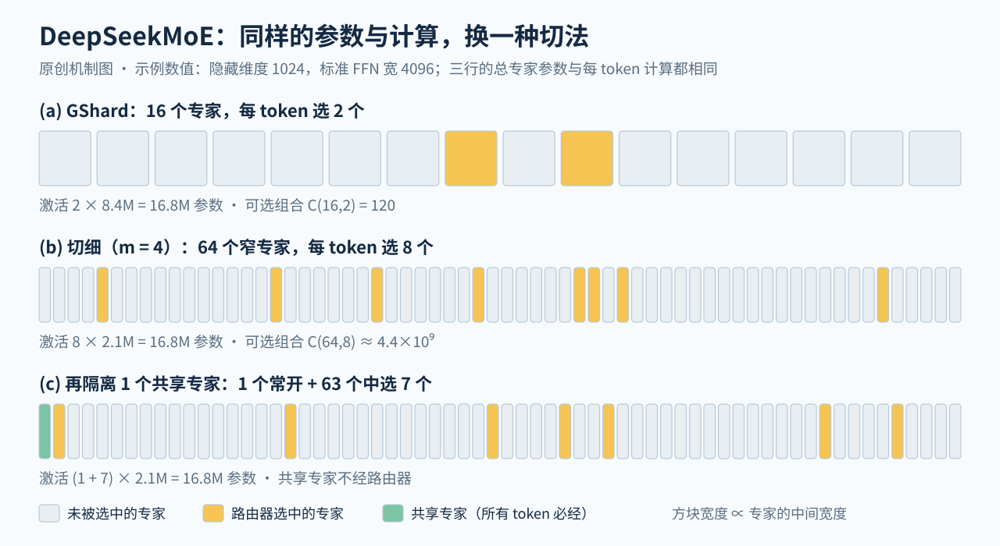

# DeepSeekMoE：把专家切细、再留出常开的共享专家，让每个路由专家只学一类知识

> 状态：技术精读 · 原文 arXiv:2401.06066v1 · 未复现

## 一句话

Dai 等（DeepSeek-AI，2024 年 1 月）在总参数和每 token 计算都不变的前提下改造 MoE 层：把每个专家沿中间维度切成 m 个小专家，每个 token 激活的个数同步乘 m；再拿出几个专家让所有 token 都经过（共享专家）。2B 规模上，它与专家参数和计算都是其 1.5 倍的 GShard 打平（在 Pile 语料测试集上的损失同为 1.808）；16B 模型在 2T token 上以约 40% 的训练计算追平同数据训练的稠密 DeepSeek 7B。这套结构此后成为 DeepSeek-V2、V3、V4 的 FFN，一直没换。

## 它要解决的问题

结论：2023 年的 MoE 每层只有 8–16 个专家、每个 token 选 1–2 个，作者认为这让一个专家被迫装下互不相干的知识，同时几个专家重复存同一份通用知识。

MoE（混合专家，一句话：把 FFN 换成许多结构相同的子网络"专家"，由路由器为每个 token 只挑少数几个计算）的目的，是让总参数和每 token 的计算分开增长，机制与手算见 [MoE 讲义](../../../foundations/lessons/18-ssm-gnn-moe.md)第 4 节。路由器（router，一句话：给每个专家打一个分，取最高的 K 个，即 top-K）在本篇里对专家 i 的打分是 uₜᵀeᵢ 再做 softmax（式 5），eᵢ 是专家的可学习向量。当时的两种代表做法是 GShard（Lepikhin 等 2021，每 token 选 2 个专家）和 [Switch Transformer](../arxiv-2101.03961/README.md)（每 token 只选 1 个）。

作者在引言里点名两个问题（§1）：

- **知识混杂（knowledge hybridity）**：专家少，分到同一个专家的 token 覆盖的知识就杂，一个专家的参数要同时装下很难同时用上的多种知识。
- **知识冗余（knowledge redundancy）**：分到不同专家的 token 也需要共同的通用知识，于是多个专家各自学一份，参数重复。

两者合起来妨碍专家专门化（expert specialization，一句话：每个专家掌握互不重叠、聚焦的知识）。作者把总参数相同的稠密模型看作 MoE 的性能上界，问题就变成：同样的参数和计算，能不能离这个上界更近？

## 核心想法

两处改动都在"总专家参数不变、每 token 计算不变"的约束下进行（图 2）。

1. **细粒度专家切分（fine-grained expert segmentation）**：把每个专家 FFN 的中间维度缩成 1/m，专家数变成 mN，每个 token 激活 mK 个。单个专家装的知识更窄，可选的组合多得多。
2. **共享专家隔离（shared expert isolation）**：从 mN 个专家里拿出 Kₛ 个，所有 token 必经、不经路由器；路由专家的激活数相应减 Kₛ，总计算不变。通用知识集中到共享专家，路由专家只学有区别的部分。

公式与 V2 中的大规模配置已写在 [DeepSeek-V2 精读](../deepseek-v2/reading.md)第 4–5 小节（V2 的式 20–22 就是本篇的式 9–11）。本篇只写增量：两处改动的理由、它们在 2B 到 145B 上怎样被验证，以及后来暴露的代价。

## 机制

图中三行的总专家参数和每 token 计算相同，区别只在切法。

### 1 同样的计算，换一种切法（示例数值）

取一个示例层：隐藏维度 1024，标准 FFN 中间宽度 4096、两个矩阵，一个专家 2 × 1024 × 4096 ≈ 8.4M 参数（示例数值，不是论文配置）。

- **GShard，16 个专家选 2 个**：每 token 激活 2 × 8.4M = 16.8M；可选的专家组合 C(16,2) = 120。
- **切细，m = 4**：64 个宽 1024 的专家，选 8 个，激活 8 × 2.1M = 16.8M；组合数 C(64,8) = 4,426,165,368。这两个组合数是原文 §3.1 自己举的例子。
- **再隔离 1 个共享专家**：1 个常开 + 63 个中选 7 个，激活仍是 8 × 2.1M = 16.8M。

后两种做法的激活参数与 GShard 相同，平均每个专家分到的 token 数（T·K/N，T 为一批的 token 数）也不变；变的是同样多的参数被切成多少块、能怎样组合。

切细的好处是一个 token 可以由 8 块窄专家拼出来，作者认为这让不同的知识能分到不同专家里分别学习。代价有两笔。第一，每个 token 要发往 8 个专家而不是 2 个；专家分布在多张卡上时，分发（dispatch，一句话：按路由结果把 token 的隐藏向量送到专家所在的卡）的份数随 mK 增长。第二，每次矩阵乘的宽度缩成 1/m、次数变成 m 倍，GPU 效率下降；原文 §5.1.2 写明 16B 没有再切细，原因正是专家太小会降低计算效率。

### 2 共享专家：所有 token 必经的一块 FFN

式 9 把输出写成三项之和：Kₛ 个共享专家的输出（没有门值）、被选中的路由专家按门值加权的输出、残差 uₜ。共享专家相当于一块常开的稠密 FFN。原文说明这种结构的雏形来自 DeepSpeed-MoE（Rajbhandari 等 2022），区别是对方从工程角度提出，本篇从算法角度提出（§3.2）。

共享与路由的比例是试出来的：2B、共 64 个专家、激活 8 个时，共享 1、2、4 个的 Pile 损失（在开源英文混合语料 Pile 的测试集上的交叉熵，越低越好）分别为 1.808、1.806、1.811，差别很小；作者取共享 : 激活路由 = 1 : 3 用于放大（§4.4）。实际配置是 2B 为 1 + 7/63，16B 为 2 + 6/64，145B 为 4 + 12/128（附录 A 表 7）。

### 3 16B 的参数账（示例数值）

按官方仓库 config.json（隐藏维度 2048、28 层、专家中间宽度 1408、词表 102,400；专家用 SwiGLU，一句话：带门控的 FFN，有门、上投影、下投影三个矩阵）手算：

- 一个专家 3 × 2048 × 1408 ≈ 8.65M。每个 MoE 层 66 个专家（2 共享 + 64 路由），共 27 个 MoE 层（第 1 层为稠密 FFN），专家合计 ≈ 15.4B。
- 注意力每层 4 × 2048² ≈ 16.8M，28 层 ≈ 0.47B，即原文所说"约 0.5B 注意力参数"。
- 嵌入与输出头 2 × 102,400 × 2048 ≈ 0.42B，第 1 层稠密 FFN ≈ 0.07B。
- 合计 ≈ 16.4B。每 token 经过 8 个专家：27 × 8 × 8.65M ≈ 1.87B，加上注意力、嵌入与稠密层 ≈ 2.83B，与原文的 16.4B / 2.8B 一致。

这本账说明两件事。第一，16B 里约 94% 的参数在专家里，注意力只占约 3%；对照的稠密 DeepSeek 7B 有 2.5B 注意力参数（§5.2.1）。第二，BF16 下 16.4B × 2 字节 ≈ 33 GB，所以原文说它不量化就能放进一张 40 GB 的卡。

### 4 负载均衡：损失强度由部署方式决定

路由是学出来的，会出现负载不均。原文 §3.3 列了两种后果：路由坍缩（routing collapse，一句话：模型总选少数几个专家，其余专家得不到训练）；专家分在多张卡上时，最忙的卡拖慢整体。

对策是两项辅助损失（auxiliary loss，一句话：加在语言建模损失旁边、只为让负载均匀的额外损失）：

- **专家级**：L = α₁ Σᵢ fᵢPᵢ。fᵢ 是专家 i 实际被选中的频率（完全均匀时为 1），Pᵢ 是它的平均路由概率；两者都集中在少数专家时，乘积和变大。
- **设备级**：把专家分成 D 组、每组放一个设备，按组求同样的乘积和。作者写明过强的专家级约束会伤效果，真正要保证的是设备之间的计算均衡，所以 α₁ 取小、设备级系数取大（§3.3）。

三个规模的设定（§4.1.3、§5.1.2、§7.1）把"均衡为谁服务"写得很清楚：

- 2B：全部专家放在一张卡上，不丢 token，不用设备级损失，α₁ = 0.01。
- 16B：每层的专家都在同一设备上，α₁ 降到 0.001；原文说在这种并行方式下更大的 α₁ 不提高计算效率，反而伤效果。
- 145B：路由专家分到 4 个设备上（专家并行，一句话：不同专家放在不同 GPU 上，token 按路由结果被发过去），加设备级损失 α₂ = 0.05，α₁ = 0.003。

`[判断]` 均衡损失的强度由专家怎样摆到硬件上决定，对语言建模本身是一笔纯成本。这正是后来[无辅助损失均衡](../arxiv-2408.15664/README.md)和 [DeepSeek-V3](../arxiv-2412.19437/reading.md) 要拿掉的东西。

另一处细节：16B 与 145B 的第 1 层保留稠密 FFN，原因是"第一层的负载均衡收敛得特别慢"（§5.1.2）。这条经验一路传了下去，见"局限与后续"。

## 证据：哪个实验支撑哪个主张

2B 的验证实验都在 100B token 上训练，用 Pile 损失与 12 项零样本或少样本任务比较；16B 起改用 BPB（每字节比特数，可消除分词器不同带来的差异），并加入 MMLU 等多学科选择题。TriviaQA、NaturalQuestions 是不给参考文档的事实问答，常用来衡量模型记住了多少知识。

| 主张 | 支撑实验 | 怎么读 |
|---|---|---|
| 同参数、同计算下优于 GShard | 表 1，2.0B 总参数、0.3B 激活、100B token：Pile 损失 GShard 1.867，DeepSeekMoE 1.808；TriviaQA 10.2 → 16.6 | 列出的指标全部领先；规模小，HumanEval、MBPP 都在 5% 以下，比较意义有限 |
| 相当于 1.5 倍的 GShard | 表 2：GShard×1.5（专家参数与计算都是 1.5 倍）Pile 损失同为 1.808 | 附录 B 表 10 在 13.3B 专家参数上，多数指标领先 GShard×1.5 |
| 接近 MoE 的上界 | 表 2：Dense×16（16 个常开的标准 FFN）Pile 损失 1.806 | "上界"是作者构造的模型，见批注 |
| 两处改动都有贡献 | 图 3：GShard → 加 1 个共享专家 → 切成 32 个 → 切成 64 个，整体逐步提升 | 只给了归一化后的柱状图 |
| 共享专家不可替代 | §4.5：关掉共享专家、多激活 1 个路由专家，Pile 损失 1.808 → 2.414 | 训练好之后改结构的测试，模型没有为此重训 |
| 路由专家冗余更低 | 图 4：屏蔽得分最高的一部分路由专家，损失上升得比 GShard×1.5 快 | 间接证据：越敏感说明越不可替代 |
| 激活更少也够 | 图 5–6：只激活 4 个路由专家时 Pile 损失与 GShard 相当；从头训练只激活 3 个，仍好于 GShard | 支持"组合更灵活、知识学得更准"的说法 |
| 16B ≈ 稠密 7B | 表 3，同一份 2T 数据：每 4K token 计算 74.4T 对 183.5T（40.5%）；Pile BPB 0.74 对 0.75；TriviaQA 64.8 对 59.7；MMLU 45.0 对 48.2 | 知识类领先，多学科选择题落后 |
| 放大到 145B 仍然成立 | 表 6，245B token：与 GShard 137B 相比 Pile 损失 1.876 对 1.961；用 28.5% 的计算与同数据的 DeepSeek 67B 相当 | 作者称为初步研究；所有模型都只训练了 245B token |

## 局限与后续

原文没有单独的局限一节。正文里自述了两处不足：16B 在多学科选择题（MMLU、C-Eval、CMMLU）上落后稠密 7B，作者归因于注意力参数只有约 0.5B，依据是此前在 DeepSeek 7B 上观察到注意力容量与选择题表现正相关（§5.2.1）；专家切得过细会损失计算效率，所以 16B 没有再切（§5.1.2）。

站在现在看，后来的版本和其他团队对这套结构所做的改动，暴露了当时没有写出来的几笔代价。

**细粒度保留下来，代价转给了系统。** 各家后续都保留细粒度，而且越切越多：V2 每层 160 个路由专家，[V3](../arxiv-2412.19437/reading.md) 256 个；[Kimi K2](../arxiv-2507.20534/README.md) 用稀疏度规模定律（固定激活参数时，专家总数越多损失越低）推到 384 个，同时写明更高的稀疏度"带来更高的基础设施复杂度"，于是停在 384 选 8（§2.3）；[Kimi K3](../arxiv-2607.24653/README.md) 到 896 个，并写明这种稀疏度超出了原有偏置均衡方法的适用范围（§2.3）。DeepSeek 自己为切细付的通信账更具体：V2 限制每个 token 最多访问 3 个设备，V3 限制最多 4 个节点，并专门写了 DualPipe 流水调度与跨节点通信内核。`[判断]` 本篇"切细不增加计算"的验证是在单卡或 4 张卡上做的；跨节点部署时，每个 token 的分发份数随激活专家数增长，后来几代的路由约束和通信工程都在付这笔账。

**共享专家没有成为共识。** DeepSeek 从 V2 的 2 个共享专家减到 V3、V4 的 1 个，共享 : 激活路由从本篇的 1 : 3 变成 1 : 8（V3）与 1 : 6（V4）。[Qwen3](../arxiv-2505.09388/README.md) 的 MoE 明确去掉了 Qwen2.5-MoE 里的共享专家，改用全局批次的负载均衡损失鼓励专家专门化（§2）。Meta 的 Llama 4 Maverick 保留 1 个共享专家，但路由专家每 token 只选 1 个，MoE 层与稠密层交替（[官方博客](https://ai.meta.com/blog/llama-4-multimodal-intelligence/)，2025 年 4 月），在路由一侧回到了粗粒度。Kimi K3 保留 2 个全宽的共享专家，路由专家改在压缩后的潜空间里计算。`[判断]` 本篇 1、2、4 个共享专家的 Pile 损失只差 0.005，这个比例在原文里就没有被确定下来；各家取舍不同，说明共享专家的收益依赖规模与均衡方式，至今没有跨团队的同条件对照。

**均衡损失的两难被单独拿出来解决。** 本篇已承认更大的 α₁ 会伤效果；DeepSeek 2024 年 8 月的[无辅助损失均衡](../arxiv-2408.15664/README.md)把"系数小了均衡不住、大了伤质量"作为出发点，V3 用路由偏置替代损失（[V3 精读](../arxiv-2412.19437/reading.md)第 2–3 小节）。

**第一层难均衡：从稠密层到哈希路由。** 本篇把第一层留作稠密 FFN，V2 同样；V3 留了 3 层，Kimi K2 改为 1 层（K2 表 2）；[DeepSeek-V4](../arxiv-2606.19348/README.md) 把前 3 层换成按 token ID 哈希决定专家的 MoE 层，路由不需要学习（V4 §2.1）。`[判断]` 浅层的输入接近 token 本身，学出来的路由难以均衡，V4 改用静态规则绕开这个问题；这与 [Engram](../arxiv-2601.07372/README.md) 把局部静态模式交给查表的思路一致。

**注意力占比下降的副作用。** 本篇把选择题弱归因于注意力参数少，没有做消融。后来各家在注意力上的取舍并不一致：V2 起用 128 个头的 MLA；Kimi K2 为了 128K 长度下的推理成本把头数从 128 减到 64，验证损失只差 0.5%–1.2%（K2 §2.3）。两者都没有正面回答"FFN 被 MoE 放大之后，注意力该占多少"。

**微调与强化学习。** 本篇第 6 节引用前人"MoE 微调收益不明显"的说法，用 16B 的 SFT 结果说明 MoE 同样能从指令微调中获益。后来的问题出在强化学习：[DeepSeek-V3.2](../arxiv-2512.02556/README.md) 写明，推理框架与训练框架即使输入相同也可能选出不同的专家，被更新的参数子空间因此突然变化，加剧离策略问题（off-policy，一句话：用来训练的样本并非由当前参数下的模型生成）；自 V3-0324 起他们在 RL 中记录采样时的路由、训练时强制复用（Keep Routing），并称这对 MoE 的 RL 稳定性至关重要（V3.2 §3.1）。稠密模型没有这一类问题。

## 批注

**易误读**

- "约 40% 的计算"是每 4K token 训练计算之比（表 3：74.4T 对 183.5T），不是推理延迟之比。按表中数值反推，每 token 约 18.2 GFLOPs，与 6 × 2.8B 激活参数再加注意力项相符。
- "接近 MoE 上界"中的 Dense×16 是 16 个常开的标准 FFN，作者特意不采用常见的注意力 : FFN = 1 : 2 参数比（§4.3），它不是普通的 2B 稠密模型。
- 145B 只训练 245B token，作者称为初步研究；"18.2%"来自只激活一半专家的 142B 变体（表 6）。
- 16B "推理速度接近 7B 稠密模型的 2.5 倍"以"适当的算子优化"为前提，原文没有给出测量条件（§5.2.1）。
- 选择题弱的归因依据是作者在 DeepSeek 7B 上的内部研究，包括其 MQA 版本在 MMLU 类任务上吃力，那部分没有单独发表。
- 原文说每个专家"是标准 FFN 的 0.25 倍"，但没有写标准 FFN 的宽度；官方 config 中 16B 的专家宽度为 1408，第 1 层稠密 FFN 宽度为 10944。

**与其他论文的关联**

- [Switch Transformer](../arxiv-2101.03961/README.md)：每 token 只选 1 个专家，是本篇细粒度的反方向，表 1 中作为对照（Pile 损失 1.881）。
- [DeepSeek-V2 精读](../deepseek-v2/reading.md)：第一次在 236B、跨 8 个设备使用本篇结构，补上设备受限路由、通信级损失与按设备预算丢弃 token。
- [DeepSeek-V3 精读](../arxiv-2412.19437/reading.md)：保留本篇结构，换掉均衡损失与 token 丢弃，路由打分从 softmax 换成 sigmoid。
- [注意力与 FFN 的分工谱系](../../../foundations/relations/attention-ffn-division.md)第 7 节：本篇用"知识"描述专家分工，16B 知识类任务强、选择题弱，是该页"FFN 偏向存知识"的旁证（作者的归因，非消融）。
- [Engram](../arxiv-2601.07372/README.md)：同一团队后来把一部分静态知识从专家挪到查表记忆，沿"按知识切分参数"的方向再走一步。
- [Qwen3](../arxiv-2505.09388/README.md) 与 [Kimi K2](../arxiv-2507.20534/README.md)：前者沿用细粒度、去掉共享专家，后者保留 1 个共享专家、把路由专家加到 384 个。

**未核实 / 待验证**

- GShard、DeepSpeed-MoE、Hash Layer 原文未打开，其做法按本篇第 2、3、8 节的转述写。
- Qwen3 去掉共享专家的具体理由原文没有展开；它引用的全局批次均衡损失（Qiu 等 2025）未打开。
- Llama 4 只有官方博客，层数、专家宽度、均衡方法未公开。
- 数值出处见[证据档案](evidence.json)；机制图见 [SVG](figures/deepseekmoe-mechanism.svg)。
