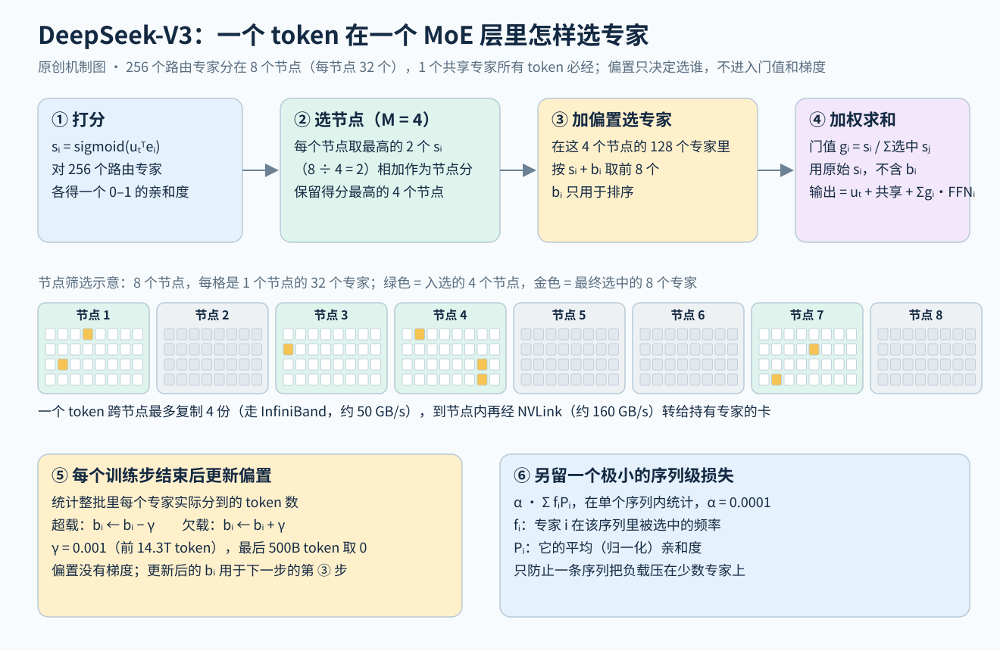

# DeepSeek-V3：用路由偏置代替均衡损失，把细粒度 MoE 放大到 671B，并用 FP8 训练

> 状态：技术精读 · 原文 arXiv:2412.19437v2 · 未复现

## 一句话

DeepSeek-AI（2024 年 12 月）沿用 V2 的 MLA 与 DeepSeekMoE，把模型放大到 671B 总参数、每 token 激活 37B，在 14.8T token 上预训练，全部训练用 2.788M H800 GPU 小时。架构上的增量集中在 MoE 路由：负载均衡改由每个专家的一个偏置项调节，偏置只影响选谁、不进入梯度，另外只留一个系数 0.0001 的序列级损失；每个 token 最多发往 4 个节点；训练和推理都不丢 token。训练目标加了深度为 1 的多 token 预测（MTP），矩阵乘法用 FP8。

## 它要解决的问题

结论：V2 证明了 MLA + DeepSeekMoE 能把成本降下来，但它的负载均衡靠三项辅助损失加丢 token 维持；专家更多、跨的节点更多时，这两样的代价会一起变大。

[DeepSeek-V2 精读](../deepseek-v2/reading.md)第 5 小节写了 V2 的做法：专家级、设备级、通信级三项辅助损失（系数分别为 0.003、0.05、0.02），每个 token 最多访问 3 个设备，超出设备计算预算时丢掉部分 token 的专家计算。[DeepSeekMoE 精读](../arxiv-2401.06066/reading.md)第 4 小节已经说明，专家级损失的系数是按部署方式定的，系数大了会伤效果。DeepSeek 2024 年 8 月的[无辅助损失均衡](../arxiv-2408.15664/README.md)把这一点作为出发点：系数小了均衡不住，系数大了会引入与语言建模冲突的梯度。

V3 要回答：在 256 个路由专家、跨 8 个节点的专家并行（expert parallelism，一句话：不同专家放在不同 GPU 上，token 按路由结果被发过去）下，能不能不靠损失、不丢 token 就保持均衡，同时不让通信拖慢训练？报告还加了一个工程目标：第一次在超大模型上验证 FP8 训练（§1）。

## 核心想法

架构主体不变，这本身就是结论之一：摘要写明 MLA 与 DeepSeekMoE 已在 V2 中充分验证。相对 V2 的增量如下。

| 部件 | V2 | V3 | 原文给的理由 |
|---|---|---|---|
| 路由打分 | softmax | sigmoid，再在选中的专家之间归一化 | 原文只说与 V2"略有不同"（§2.1.2） |
| 负载均衡 | 三项辅助损失 | 每个专家一个偏置，每步按负载加减；另留系数极小的序列级损失 | 减少为均衡付出的性能损失（§1） |
| 路由约束 | 每 token 最多 3 个设备 | 每 token 最多 4 个节点 | 限制训练时的通信（§2.1.2） |
| token 丢弃 | 超出设备预算就丢 | 训练与推理都不丢 | 负载已经足够均衡（§2.1.2） |
| 专家配置 | 2 共享 + 160 路由，激活 6 个 | 1 共享 + 256 路由，激活 8 个；前 3 层稠密 | 原文未说明 |
| 训练目标 | 下一词预测 | 再加深度 1 的 MTP | 两个规模的消融中多数指标提升（§4.5.1） |
| 数值精度 | BF16 | 矩阵乘用 FP8 | 加速并节省显存（§3.3） |

## 机制

图中①–④是一个 token 在一个 MoE 层里的路由，⑤⑥是两种均衡手段。MLA 与 V2 相同，见 V2 精读第 1–3 小节。

### 1 671B 与 37B 的账（示例数值）

按报告 §4.2 与官方 config.json 手算（隐藏维度 7168，61 层；前 3 层是宽 18432 的稠密 FFN，其余 58 层是 MoE；专家中间宽度 2048，用 SwiGLU（一句话：带门控的 FFN，有门、上投影、下投影三个矩阵）；词表 129,280）：

- 一个专家 3 × 7168 × 2048 ≈ 44.0M。每个 MoE 层 257 个专家 ≈ 11.3B，58 层 ≈ 656B，其中路由专家占 654B。
- MLA 每层约 187M（查询压缩到 1536 维，KV 压缩到 512 维，128 个头；最大的是输出投影，约 117M），61 层 ≈ 11.4B。
- 前 3 层稠密 FFN ≈ 1.2B，嵌入与输出头 ≈ 1.9B。
- 合计 ≈ 671.0B。每 token 只经过 9 个专家（1 共享 + 8 路由）：58 × 9 × 44.0M ≈ 23.0B，加上注意力、稠密层、嵌入与输出头 ≈ 37.6B，即报告的 37B。

由这本账可以得到后面要用的三个量：

- **每 token 计算。** 前向矩阵乘约 2 × 37B ≈ 75 GFLOPs；在 4K 序列上，注意力打分与加权平均约再加 10 GFLOPs（平均上下文 2048、128 个头、键 192 维、值 128 维）。训练约为前向的 3 倍，每 token ≈ 255 GFLOPs，1T token ≈ 2.6×10²³ FLOPs。报告说每 1T token 用 180K H800 GPU 小时（§1），折合每卡持续约 390 TFLOP/s（示例估算，报告没有给出算力利用率）。
- **与稠密模型比。** 总参数约是激活参数的 18 倍，同样 671B 的稠密模型每 token 计算也约是 V3 的 18 倍。报告把 Llama-3.1 405B 描述为激活参数约为 V3 的 11 倍（§4.4.2）。
- **显存。** 权重按 FP8 每参数 1 字节，约 671 GB，另有 14B 的 MTP 模块（官方仓库 README：Hugging Face 上共 685B）。按每卡 80 GB 计（假设值），一台 8 卡节点 640 GB 放不下一份权重，还没算 KV 缓存（生成时为每个历史 token 保存的键和值）。这是报告自述"推荐的部署单元较大"的直接原因之一（§6）。

### 2 偏置调节：把均衡从损失里拿出来

V3 的路由（式 12–16）：亲和度 sᵢ,ₜ = sigmoid(uₜᵀeᵢ)；选专家时按 sᵢ,ₜ + bᵢ 取前 8 个；门值仍用原始的 sᵢ,ₜ，在选中的 8 个之间归一化。每个训练步结束时，统计整批（batch，一句话：一次参数更新所用的全部样本）里各专家的负载，超载的专家 bᵢ 减 γ，欠载的加 γ。偏置更新速度 γ 在前 14.3T token 取 0.001，最后 500B token 取 0（§4.2）。

**示例数值**（4 个专家选 2 个，数字为示意）：某 token 的 s = (0.90, 0.80, 0.75, 0.30)。

- 不加偏置：选专家 1、2，门值 0.90/1.70 ≈ 0.53 与 0.80/1.70 ≈ 0.47。
- 专家 1 一直超载、专家 3 一直欠载，偏置积累到 b = (−0.12, 0, +0.08, 0)：s + b = (0.78, 0.80, 0.83, 0.30)，改选专家 3、2；门值仍用原始分数，0.75/1.55 ≈ 0.48 与 0.80/1.55 ≈ 0.52。
- 每步只动 0.001，b₁ 从 0 积累到 −0.12 至少要 120 步，所以偏置反映的是一段时间的平均负载。

要点有两个。偏置只决定"选谁"，选中之后各专家的权重仍由原始分数决定；偏置也没有梯度，与语言建模无关的均衡目标因此进不了反向传播，这正是辅助损失的问题所在。偏置的代价是调节有滞后：无辅助损失均衡原文图 4 显示，更新速度太小（0.0001）时训练早期均衡差，太大（0.01）时后期反而波动。

**序列级损失只防极端情况。** 式 17–20 与 DeepSeekMoE 的专家级损失同形（α Σ fᵢPᵢ），差别是在单条序列内统计，Pᵢ 用归一化后的 sigmoid 分数，系数只有 α = 0.0001，比 V2 的专家级系数小 30 倍。它只防止某一条序列把负载全压在少数专家上。

### 3 均衡的范围：按整批，而不是按序列

结论：V3 的收益很大一部分来自"在多大范围内要求均衡"，而不只是"用不用损失"。

§4.5.3 用 1B 与 3B 的 MoE 比较了三种做法：按序列的辅助损失，验证损失 2.258（3B 为 2.085）；按整批的辅助损失与无辅助损失法都是 2.253（3B 都是 2.080）。也就是说，只要把辅助损失的统计范围从单条序列换成整批，就能拿到与偏置法相同的效果。作者的解释是：按序列均衡要求每条序列内部都把专家用匀，一段纯代码也得均匀用上所有专家；按整批均衡只要求总体均匀，专家可以按领域分工。图 9 在 Pile（一个开源的英文混合语料）测试集上看 16B 模型，无辅助损失模型在 Wikipedia、Github、DM Mathematics 三个领域上的专家负载差异更大。

报告接着写了这种灵活性的两个效率代价（§4.5.3）：

1. **某些序列或小批量内部的不均衡。** 整批均衡不保证每个小批量都均衡。训练时靠大规模专家并行与数据并行让每个微批量足够大来化解。
2. **推理时领域变化引起的不均衡。** 训练时总体均匀，部署时某段时间的请求集中在某个领域，负载就会压到少数专家上。推理侧用冗余专家部署化解（第 5 小节）。

`[判断]` 这两条是 V3 把均衡从训练目标里拿掉之后转给系统的账：模型被允许按领域分工，部署系统就必须为分工带来的负载波动留余量。后来的工作印证了第 2 条：[DeepSeek-V4.1-Flash](../arxiv-2609.19969/README.md) 发现图像与文本 token 的路由偏好不同，"只均衡总负载会掩盖某一模态内部的不均衡"，于是为两种模态各维护一组偏置（§2.1.1）。

### 4 节点受限路由与通信（示例数值）

训练时 256 个路由专家均匀放在 8 个节点的 64 张卡上，每个节点 32 个（§4.2）。路由分两步（§2.1.2）：先给每个节点打分，分数是该节点上亲和度最高的 K_r/M = 8/4 = 2 个专家之和，保留前 M = 4 个节点；再只在这 4 个节点的 128 个专家里选前 8 个。

限制的是节点数而不是设备数，因为两级网络带宽差得多：节点之间走 InfiniBand（IB，约 50 GB/s），节点内走 NVLink（约 160 GB/s，约为 IB 的 3.2 倍）。一个 token 先经 IB 发到目标节点上同编号的卡，再在节点内经 NVLink 转给持有目标专家的卡（§3.2.2）。这样一个 token 跨节点最多复制 4 份，与它在每个节点里选几个专家无关；报告估计每个节点平均可选 3.2 个专家而不增加 NVLink 开销，即同样的通信成本下最多可选 13 个。

每一对"token—专家"的计算与通信之比（示例数值，算法借用 V4 报告 §3.1 的公式）：SwiGLU 三个矩阵约 6 × h × d_e = 6 × 7168 × 2048 ≈ 88 MFLOPs；通信是 FP8 分发 h 字节加 BF16 合并 2h 字节，共 3h ≈ 21.5 KB；比值为 2d_e = 4096 FLOPs/字节。报告说跨节点专家并行让训练的计算 : 通信接近 1 : 1（§3.2.1），通信必须完全藏到计算后面。DualPipe 为此把一对前向块与反向块里的注意力、MLP、两次全互联通信交错排布，并从流水线两端同时灌入微批量；通信内核只占 H800 上 132 个 SM 中的 20 个（SM，流式多处理器，一句话：GPU 上执行计算的基本单元）。代价是每张卡要存两份模型参数，报告认为在大规模专家并行下这不明显增加显存（§3.2.1）。

### 5 不丢 token，以及推理时怎样保持均衡

V2 训练时按容量因子丢掉超出设备预算的 token 的专家计算；V3 训练与推理都不丢（§2.1.2）。推理端为此单独设计了部署（§3.4），预填充与解码分开：

- **预填充**（prefill，一句话：一次性处理整段提示）：最小部署单元 4 个节点 32 张卡，MoE 部分 32 路专家并行。按线上统计约每 10 分钟找出一次高负载专家并复制，共 32 个冗余专家：每张卡除了原本的 8 个专家再多放 1 个。
- **解码**（decode，一句话：逐 token 生成）：最小部署单元 40 个节点 320 张卡，每张卡只放 1 个专家，其中 64 张卡放冗余专家和共享专家。共享专家被当作"每次都被选中的高负载路由专家"，每个 token 共选 9 个。

**示例数值：小批量为什么不划算。** 解码时每个 token 每层选 8/256 = 1/32 的路由专家。同时解码 B 个 token 时，一个路由专家平均分到 B/32 个：B = 32 时，每个专家每步只算 1 个 token，却要把 44M 个参数从显存读一遍；要让每个专家攒到 256 个 token，全系统要同时解码约 8192 个 token。报告写明解码时每个专家的批量通常在 256 个 token 以内，瓶颈是访存而不是计算（§3.4.2）。`[判断]` 稀疏模型的低成本建立在高并发之上；并发低的场景（个人部署、长尾的小批量请求、RL 采样的尾部）拿不到 37B 激活带来的节省，却要为 671B 的权重付显存。V4 报告专门提到 RL 采样"通常遇到长尾的小批量"，并为这类延迟敏感场景重写了专家并行内核（V4 §3.1）。

### 6 MTP 与 FP8：只看与成本有关的部分

两者的完整机制在[预训练方向](../../fields/pretraining/README.md)"⑥训练方式保持简单"与"数值精度"两节，这里只记成本。

- **MTP**（多 token 预测，一句话：在每个位置用一个额外的 Transformer 块再预测下下个 token，嵌入层和输出头与主模型共享，保留完整因果链）。深度 D = 1，损失权重前 10T token 为 0.3、之后为 0.1。额外权重约 14B（官方 README）；推理时可以整块丢掉，或当作投机解码（一句话：先用便宜的草稿猜后面几个 token，再由主模型一次验证）的草稿。第二个 token 的接受率为 85%–90%（§5.4.3），每步平均产出 1 + p ≈ 1.85–1.9 个 token；扣掉草稿块本身的开销，与报告的 1.8 倍每秒 token 数相符。
- **FP8**（8 位浮点，一句话：V3 全部用 E4M3 格式，只有 3 位尾数，表示范围和精度都远小于 BF16）。每个线性层的前向、对输入求导、对权重求导三次矩阵乘都用 FP8，理论速度是 BF16 的 2 倍；嵌入、输出头、MoE 门控、归一化与注意力算子保持高精度（§3.3.1）。激活按 1×128、权重按 128×128 的块分别缩放；H800 的 FP8 累加只保留约 14 位，K = 4096 的随机矩阵乘最大相对误差接近 2%，于是每累加 128 个元素就把部分和搬到 CUDA core 上用 FP32 累加（§3.3.2）。MoE 分发前的激活也量化成 FP8，合并保持 BF16（§3.3.3），这一项直接压缩了第 4 小节的通信量。

## 证据：哪个实验支撑哪个主张

| 主张 | 支撑实验 | 怎么读 |
|---|---|---|
| 偏置法好于纯辅助损失 | 表 5：15.7B（1.33T token）与 228.7B（578B token）的 MoE 去掉全部辅助损失、换成偏置；大模型 Pile BPB（每字节比特数，越低越好）0.656 → 0.652，HumanEval 40.2 → 46.3，GSM8K 70.7 → 74.5 | 对照组的损失系数沿用 V2-Lite 与 V2；大模型 MMLU 68.3 → 67.2，不是全部提升 |
| 关键在均衡范围 | §4.5.3：1B 验证损失按序列辅助损失 2.258，按整批辅助损失与偏置法都是 2.253；3B 为 2.085 对 2.080 | 整批的辅助损失同样可以；差距只有 0.005 |
| 专家更按领域分工 | 图 9、附录 C：16B 模型在 Pile 三个领域上的专家负载 | 只有热力图，没有量化指标 |
| MTP 有用 | 表 4：同样两个规模，推理时去掉 MTP 模块、推理成本相同；大模型 HumanEval 44.5 → 53.7，GSM8K 72.3 → 74.0 | 大模型 MMLU 67.5 → 66.6，多数提升而非全部 |
| FP8 可行 | 附录 B.1：约 16B（1.33T token）与约 230B（约 0.9T token），相对 BF16 的损失相对误差低于 0.25% | 只比较了损失曲线；激活梯度按 128×128 块量化时，16B 在约 300B token 后发散（附录 B.2） |
| 训练便宜 | 表 1：预训练 2664K、长上下文 119K、后训练 5K，共 2788K H800 GPU 小时 | 只算正式训练，不含此前的研究与消融（§1） |
| 训练稳定 | §1：全程没有不可恢复的损失尖峰，没有回滚 | 原文措辞，不等于损失曲线完全没有波动 |

## 局限与后续

原文自述的局限都在部署上（§6）：推荐的部署单元较大，小团队负担重；端到端生成速度已是 V2 的两倍以上，仍有提升空间。作者认为两者会随着硬件进步自然缓解。

站在现在看，V3 的多项选择在随后两年里被逐项修改，修改的位置正好对应 V3 没有写出来的代价。

| 后来的版本 | 改了什么 | 原文给的理由或暴露的问题 |
|---|---|---|
| DeepSeek V3-0324 起（V3.2 报告） | RL 中记录采样时的专家路由，训练时强制复用（Keep Routing） | 推理与训练两套框架对相同输入可能选出不同专家，被更新的参数子空间突变，加剧离策略问题（训练样本并非当前参数生成），RL 不稳定（V3.2 §3.1） |
| Kimi K2（2025） | 专家 256 → 384，取消专家分组，稠密层 3 → 1，注意力头 128 → 64；不用 DualPipe；FP8 只用于存一部分激活，不用于计算 | 稀疏度规模定律；DualPipe 让参数与梯度显存翻倍；初步实验中观察到 FP8 计算有掉点风险（K2 §2.3–2.4） |
| Qwen3（2025） | 保留细粒度，去掉共享专家；用全局批次的负载均衡损失 | 为了鼓励专家专门化（Qwen3 §2） |
| Llama 4（2025） | MoE 层与稠密层交替，128 个路由专家每 token 只选 1 个，另加 1 个共享专家；FP8 训练 | 为了推理效率（官方博客） |
| DeepSeek-V4（2026） | 亲和度 sigmoid 改为 √softplus；取消节点数限制并重新设计并行；前 3 层稠密 FFN 换成哈希路由的 MoE；路由专家权重量化到 FP4 | 1.6T 规模出现与 MoE 层离群值相关的损失尖峰，报告称"路由机制本身似乎加剧了离群值"，用 Anticipatory Routing（用若干步之前的参数计算路由）与 SwiGLU 截断压住，原理未明（V4 §2.1、§4.2.3） |
| Kimi K3（2026） | 偏置不再按固定步长更新，改为按路由分数的分位数直接设定（Quantile Balancing） | 固定步长在"适应太慢"与"负载振荡"之间两难，896 个专家超出了原方法的适用范围（K3 §2.3.3） |
| DeepSeek-V4.1-Flash（2026） | 图像 token 与文本 token 各用一组偏置 | 只均衡总负载会掩盖某一模态内部的不均衡（V4.1-Flash §2.1.1） |

`[判断]` 从这些改动可以读出 V3 的三笔隐藏成本。

- **节点限制是对通信的妥协。** V3 自己说受限路由是为了限制训练通信。[DeepSeek-V4](../arxiv-2606.19348/README.md) 去掉了这个限制，[Kimi K2](../arxiv-2507.20534/README.md) 取消了专家分组。V4 的专家并行内核按"波次"把通信藏进计算，报告给出的条件是：计算峰值与互联带宽之比不超过 2d_e（V4-Pro 为 6144 FLOPs/字节），通信就能完全藏住。通信藏好之后，限制路由范围就不再值得。
- **"全程稳定"不能外推到更大规模。** V3 在 671B 上没有不可恢复的尖峰；到 V4 的 1.6T，尖峰和 MoE 层的离群值一起出现，报告认为路由本身会放大离群值。V3 没有披露 671B 训练中 MoE 层的激活分布，从报告里看不出当时离尖峰还有多远。[Kimi K3](../arxiv-2607.24653/README.md) 在 2.8T 规模的路由分支上同样遇到了内部激活爆炸。
- **MoE 在后训练里还有一笔账。** Keep Routing 说明，路由是离散选择，训练与推理两套实现之间的微小数值差异会被放大成"更新了另一组参数"；稠密模型没有这个问题。V4.1-Flash 在异步 RL 中进一步把跨多个检查点的路由拼接起来复用（concatenated routing-replay，V4.1-Flash §5.2.1）。

FP8 本身也没有成为共识：Kimi K2 不在计算中使用 FP8；Meta 的官方博客写明 Llama 4 Behemoth 用 FP8 预训练；DeepSeek-V4 进一步把路由专家权重降到 FP4，理由是专家权重是显存占用的主要来源（V4 §5.2.1）。

注意力一侧，V3 原样沿用 MLA；[V3.2](../arxiv-2512.02556/README.md) 在其上加 DSA（一句话：用一个小索引器为每个查询挑出 2048 个历史 token，只读这些）稀疏注意力，V4 换成先沿序列压缩 KV 再读取的 CSA/HCA，这条线见 [V2 精读](../deepseek-v2/reading.md)"局限与后续"。

## 批注

**易误读**

- 2.788M GPU 小时只含正式训练，报告按每小时 2 美元折合 557.6 万美元，不含此前对架构、算法与数据的研究和消融（§1）。
- 37B 激活参数包括嵌入与输出头；嵌入只是查表，严格按矩阵乘算的激活约 36.6B。注意力打分的计算随上下文长度另算。
- 表 5 的对照组已经用 sigmoid 门控和 top-K 归一化，比较的只是均衡方法，不是 V2 整体。
- §4.5.3 中 0.005 的验证损失差是"按序列"与"按整批"的差；偏置法与整批辅助损失在这组实验里没有差别。
- "不丢 token"依赖部署侧的冗余专家；报告没有给出不加冗余专家时的负载数据。
- MTP 的 85%–90% 接受率与 1.8 倍每秒 token 数来自报告的特定评测；MTP 本身不保证输出分布不变，要配合标准的投机验证（见[文献卡](README.md)批注）。
- 官方 config.json 中 n_group = 8、topk_group = 4 对应节点受限路由；另有 routed_scaling_factor = 2.5（路由专家输出的放大系数），报告正文没有提到它。

**与其他论文的关联**

- [DeepSeekMoE 精读](../arxiv-2401.06066/reading.md)：结构的来源；那里按部署方式定强度的均衡损失、第一层保留稠密 FFN，都是 V3 改动的起点。
- [DeepSeek-V2 精读](../deepseek-v2/reading.md)：MLA、三项均衡损失、设备受限路由与 token 丢弃；V3 的每一处路由改动都对着它。
- [无辅助损失均衡](../arxiv-2408.15664/README.md)：偏置法的原始论文（1B、3B 模型），V3 是它的第一次大规模使用。
- [Kimi K2](../arxiv-2507.20534/README.md)：结构仿 V3 的最直接对照，改了专家数、注意力头数、专家分组与并行方式。
- [Switch Transformer](../arxiv-2101.03961/README.md)：辅助均衡损失与容量因子（超出容量就丢 token）的来源，也是 MoE 的背景。
- [DeepSeek-R1](../arxiv-2501.12948/README.md)：以 V3-Base 为起点；V3 的后训练又从 R1 系列蒸馏推理能力（§5.4.1）。
- [注意力与 FFN 的分工谱系](../../../foundations/relations/attention-ffn-division.md)第 7 节：V3 前 3 层用稠密 FFN、V4 前 3 层改为哈希路由，是"层的位置成为设计变量"的例子。

**未核实 / 待验证**

- 后训练（SFT、奖励模型、GRPO、R1 蒸馏）与评测章节只略读，未逐项核对数字。
- H800 的单卡显存与 FP8 峰值算力未从官方资料核实；第 1 小节的显存与每卡吞吐是按 80 GB 假设与手算参数量做的估算。
- V4 把 sigmoid 换成 √softplus、取消节点限制的具体原因，V4 报告没有说明；Qwen3 去掉共享专家的理由也没有展开。
- Llama 4 只有官方博客，均衡方法、层数、是否丢 token 未公开。
- 数值出处见[证据档案](evidence.json)；机制图见 [SVG](figures/deepseek-v3-routing.svg)。
